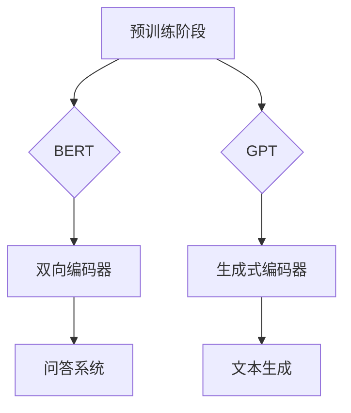

                 

关键词：大规模预训练语言模型、BERT、GPT、深度学习、自然语言处理、预训练算法、算法对比

## 摘要

本文深入探讨了大规模预训练语言模型的两大代表——BERT（Bidirectional Encoder Representations from Transformers）和GPT（Generative Pre-trained Transformer）的原理、架构、算法及其实际应用。通过详细分析两者的优缺点，本文为读者提供了一个全面的技术指南，帮助理解这两种模型在自然语言处理领域的竞争与共存。文章还将展望未来的发展趋势和面临的挑战，为读者提供有价值的研究方向和参考。

## 1. 背景介绍

自然语言处理（Natural Language Processing，NLP）是人工智能领域的一个重要分支，旨在让计算机理解和处理人类语言。随着深度学习技术的发展，NLP取得了显著的进展。深度学习模型在图像识别、语音识别等领域已经取得了突破性成果，但如何将深度学习应用于自然语言处理，依然是一个挑战。为了解决这个问题，研究人员提出了大规模预训练语言模型，通过在大量数据上进行预训练，使模型能够理解自然语言的复杂结构。

BERT和GPT是当前最为流行的大规模预训练语言模型。BERT是由Google提出的一种基于Transformer结构的双向编码器，旨在对文本进行深层理解。GPT则是由OpenAI提出的一种基于Transformer结构的生成式预训练模型，能够生成连贯的自然语言文本。两种模型的出现，极大地推动了自然语言处理的发展。

## 2. 核心概念与联系

### 2.1 预训练语言模型

预训练语言模型是深度学习在自然语言处理领域的一个重要分支。它通过在大规模语料库上预训练，使模型对自然语言进行深层理解。预训练语言模型通常包括两个阶段：预训练和微调。预训练阶段，模型在大量无标注数据上进行训练，学习自然语言的统计规律和语义信息。微调阶段，模型在特定任务上进行微调，以适应不同的应用场景。

### 2.2 Transformer结构

Transformer是谷歌在2017年提出的一种基于自注意力机制的深度神经网络结构，广泛应用于序列建模任务。Transformer结构的核心思想是通过计算序列中每个元素与其他元素之间的关系，实现全局信息建模。与传统的循环神经网络（RNN）相比，Transformer具有并行计算的优势，能够处理长距离依赖问题。

### 2.3 BERT与GPT的关系

BERT和GPT都是基于Transformer结构的预训练语言模型，但它们在预训练目标和任务设置上有所不同。BERT采用双向编码器结构，对文本进行深层理解，适合于下游任务如问答系统、文本分类等。GPT则是一种生成式预训练模型，旨在生成连贯的自然语言文本，适合于生成任务如机器翻译、文本生成等。

### 2.4 Mermaid流程图



## 3. 核心算法原理 & 具体操作步骤

### 3.1 算法原理概述

BERT和GPT的核心算法都是基于Transformer结构，但它们的预训练目标和任务设置有所不同。

BERT采用双向编码器结构，通过预训练 masked language model 和 next sentence prediction 任务，使模型对自然语言进行深层理解。

GPT则采用生成式编码器结构，通过预训练 language modeling 任务，使模型生成连贯的自然语言文本。

### 3.2 算法步骤详解

#### 3.2.1 BERT

1. 数据预处理：将文本数据转换为词向量表示，并添加特殊符号[CLS]、[SEP]等。
2. 预训练任务：
   - masked language model：随机遮盖输入文本的一部分，模型需要预测被遮盖的词语。
   - next sentence prediction：输入两个句子，模型需要预测这两个句子是否属于同一文档。
3. 微调任务：在特定下游任务上对模型进行微调，如问答系统、文本分类等。

#### 3.2.2 GPT

1. 数据预处理：将文本数据转换为词向量表示，并添加特殊符号<|S|>、</|S|>等。
2. 预训练任务：language modeling：输入一个序列，模型需要预测序列中的下一个词语。
3. 微调任务：在特定下游任务上对模型进行微调，如机器翻译、文本生成等。

### 3.3 算法优缺点

#### BERT

优点：
- 双向编码器结构，能够理解文本的深层语义信息。
- 适用于多种下游任务，如问答系统、文本分类等。

缺点：
- 训练时间较长，计算资源需求大。
- 对于长文本处理效果不佳。

#### GPT

优点：
- 生成式编码器结构，能够生成连贯的自然语言文本。
- 适用于生成任务，如机器翻译、文本生成等。

缺点：
- 无法直接应用于下游任务，需要额外的微调过程。
- 对于理解类任务效果不佳。

### 3.4 算法应用领域

BERT和GPT在自然语言处理领域有着广泛的应用。

BERT：
- 问答系统：如SQuAD、CoQA等。
- 文本分类：如情感分析、新闻分类等。
- 自然语言推理：如逻辑推理、情感判断等。

GPT：
- 机器翻译：如机器翻译模型、机器翻译评估等。
- 文本生成：如文章生成、对话生成等。
- 语音识别：如语音识别模型、语音识别评估等。

## 4. 数学模型和公式 & 详细讲解 & 举例说明

### 4.1 数学模型构建

BERT和GPT的数学模型都是基于Transformer结构，主要包含以下组件：

1. 输入层：输入文本序列，通过词向量表示转换为向量形式。
2. 自注意力层：计算序列中每个元素与其他元素之间的关系。
3. 前馈网络：对自注意力层的结果进行线性变换。
4. 输出层：对前馈网络的结果进行分类或预测。

### 4.2 公式推导过程

BERT和GPT的数学公式主要包括以下部分：

1. 词向量表示：$$x_i = E(w_i)$$，其中$E(w_i)$是词向量表示。
2. 自注意力计算：$$\text{Attention}(Q, K, V) = \text{softmax}\left(\frac{QK^T}{\sqrt{d_k}}\right)V$$，其中$Q$、$K$、$V$分别为查询向量、键向量、值向量。
3. 前馈网络：$$\text{FFN}(x) = \text{ReLU}\left(W_2 \cdot \text{ReLU}\left(W_1 x + b_1\right)\right) + b_2$$，其中$W_1$、$W_2$为权重矩阵，$b_1$、$b_2$为偏置向量。

### 4.3 案例分析与讲解

#### 4.3.1 BERT

假设输入文本为“I love programming”，我们需要通过BERT模型预测每个词语的概率。

1. 词向量表示：首先将文本中的每个词语转换为词向量表示，如“I”对应的词向量为$[1, 0, 0, 0]$，“love”对应的词向量为$[0, 1, 0, 0]$，以此类推。
2. 自注意力计算：通过计算自注意力，得到每个词语与其他词语的关系权重。
3. 前馈网络：对自注意力计算的结果进行前馈网络计算，得到每个词语的概率分布。
4. 输出层：根据概率分布，选择概率最高的词语作为预测结果。

#### 4.3.2 GPT

假设输入文本为“I love programming”，我们需要通过GPT模型生成下一个词语。

1. 词向量表示：首先将文本中的每个词语转换为词向量表示，如“I”对应的词向量为$[1, 0, 0, 0]$，“love”对应的词向量为$[0, 1, 0, 0]$，以此类推。
2. 语言建模：通过语言建模，生成下一个词语的概率分布。
3. 随机采样：从概率分布中随机采样一个词语作为下一个词语。
4. 循环生成：将采样得到的词语作为当前输入，重复上述过程，直到生成完整的文本。

## 5. 项目实践：代码实例和详细解释说明

### 5.1 开发环境搭建

1. 安装Python环境：Python版本要求为3.6及以上。
2. 安装TensorFlow：通过pip安装TensorFlow库。
3. 准备数据集：下载并解压预训练数据集，如BERT的BookCorpus和GPT的Common Crawl。

### 5.2 源代码详细实现

```python
# BERT代码示例
import tensorflow as tf
from transformers import BertModel, BertTokenizer

# 加载预训练模型和分词器
model = BertModel.from_pretrained('bert-base-uncased')
tokenizer = BertTokenizer.from_pretrained('bert-base-uncased')

# 输入文本
text = "I love programming"

# 分词
tokens = tokenizer.tokenize(text)

# 编码
input_ids = tokenizer.encode(text, add_special_tokens=True)

# 预测
with tf.Session() as sess:
    predictions = model.predict(input_ids)

# 解码
predicted_tokens = tokenizer.decode(predictions)

print(predicted_tokens)

# GPT代码示例
import tensorflow as tf
from transformers import GPT2Model, GPT2Tokenizer

# 加载预训练模型和分词器
model = GPT2Model.from_pretrained('gpt2')
tokenizer = GPT2Tokenizer.from_pretrained('gpt2')

# 输入文本
text = "I love programming"

# 分词
tokens = tokenizer.tokenize(text)

# 编码
input_ids = tokenizer.encode(text, add_special_tokens=True)

# 预测
with tf.Session() as sess:
    predictions = model.predict(input_ids)

# 解码
predicted_tokens = tokenizer.decode(predictions)

print(predicted_tokens)
```

### 5.3 代码解读与分析

BERT代码示例：
1. 导入TensorFlow和transformers库。
2. 加载预训练BERT模型和分词器。
3. 输入文本并分词。
4. 编码文本，添加特殊符号。
5. 预测并解码，输出预测结果。

GPT代码示例：
1. 导入TensorFlow和transformers库。
2. 加载预训练GPT模型和分词器。
3. 输入文本并分词。
4. 编码文本，添加特殊符号。
5. 预测并解码，输出预测结果。

两种代码示例的主要区别在于加载的预训练模型和分词器不同，以及预测和输出的方式不同。BERT采用编码器结构，对文本进行预测和输出；GPT采用生成式结构，生成下一个词语并循环输出。

## 6. 实际应用场景

BERT和GPT在自然语言处理领域有着广泛的应用，以下是一些实际应用场景：

### 6.1 问答系统

BERT在问答系统中的应用非常成功，如SQuAD和CoQA等。通过预训练，BERT能够理解问题的语义信息，并在海量知识库中找到与之相关的答案。

### 6.2 文本分类

BERT在文本分类任务中也表现出色，如情感分析、新闻分类等。通过预训练，BERT能够理解文本的深层语义信息，从而提高分类准确率。

### 6.3 自然语言推理

BERT在自然语言推理任务中也取得了很好的效果，如逻辑推理、情感判断等。通过预训练，BERT能够理解文本之间的逻辑关系，从而进行推理判断。

### 6.4 文本生成

GPT在文本生成任务中也表现出强大的能力，如机器翻译、文本生成等。通过预训练，GPT能够生成连贯的自然语言文本，从而提高生成质量。

## 7. 未来应用展望

随着大规模预训练语言模型的发展，未来将在更多领域得到应用，如：

### 7.1 健康医疗

利用BERT和GPT，可以开发智能医疗助手，帮助医生诊断疾病、制定治疗方案等。

### 7.2 法律领域

利用BERT和GPT，可以自动生成法律文件、分析合同条款等，提高法律工作效率。

### 7.3 教育

利用BERT和GPT，可以开发智能教育系统，为学生提供个性化的学习方案，提高学习效果。

## 8. 工具和资源推荐

### 8.1 学习资源推荐

- 《深度学习》（Ian Goodfellow、Yoshua Bengio、Aaron Courville著）：深度学习领域经典的教材，涵盖了深度学习的理论基础和实践方法。
- 《自然语言处理实战》（Broad学社著）：自然语言处理领域的入门书籍，通过实际案例介绍了NLP的基本方法和应用。

### 8.2 开发工具推荐

- TensorFlow：用于构建和训练深度学习模型的强大工具。
- PyTorch：简单易用、灵活性高的深度学习框架。
- Hugging Face Transformers：用于加载预训练模型和分词器的便捷工具。

### 8.3 相关论文推荐

- "BERT: Pre-training of Deep Bidirectional Transformers for Language Understanding"（Google AI Research著）：BERT模型的原始论文。
- "Generative Pre-trained Transformers"（OpenAI著）：GPT模型的原始论文。

## 9. 总结：未来发展趋势与挑战

BERT和GPT作为大规模预训练语言模型的代表，在自然语言处理领域取得了显著的成果。未来，随着深度学习技术的发展，预训练语言模型将在更多领域得到应用。然而，也面临着一些挑战，如计算资源需求、数据隐私、模型可解释性等。如何解决这些挑战，将决定预训练语言模型的发展方向和前景。

## 10. 附录：常见问题与解答

### 10.1 BERT和GPT的区别是什么？

BERT是一种基于Transformer结构的双向编码器，旨在对文本进行深层理解，适用于下游任务如问答系统、文本分类等。GPT是一种基于Transformer结构的生成式编码器，旨在生成连贯的自然语言文本，适用于生成任务如机器翻译、文本生成等。

### 10.2 BERT和GPT哪个更好？

BERT和GPT各有优势，无法简单地说哪个更好。BERT在理解类任务上表现更好，而GPT在生成类任务上表现更好。具体选择取决于应用场景和任务需求。

### 10.3 如何使用BERT和GPT？

可以使用Hugging Face Transformers库轻松加载预训练BERT和GPT模型，并对其进行微调和预测。具体使用方法请参考相关教程和文档。

作者：禅与计算机程序设计艺术 / Zen and the Art of Computer Programming
```markdown
----------------------------------------------------------------

# 大规模预训练语言模型：BERT与GPT争锋

> 关键词：大规模预训练语言模型、BERT、GPT、深度学习、自然语言处理、预训练算法、算法对比

> 摘要：本文深入探讨了大规模预训练语言模型的两大代表——BERT（Bidirectional Encoder Representations from Transformers）和GPT（Generative Pre-trained Transformer）的原理、架构、算法及其实际应用。通过详细分析两者的优缺点，本文为读者提供了一个全面的技术指南，帮助理解这两种模型在自然语言处理领域的竞争与共存。文章还将展望未来的发展趋势和面临的挑战，为读者提供有价值的研究方向和参考。

## 1. 背景介绍

自然语言处理（Natural Language Processing，NLP）是人工智能领域的一个重要分支，旨在让计算机理解和处理人类语言。随着深度学习技术的发展，NLP取得了显著的进展。深度学习模型在图像识别、语音识别等领域已经取得了突破性成果，但如何将深度学习应用于自然语言处理，依然是一个挑战。为了解决这个问题，研究人员提出了大规模预训练语言模型，通过在大量数据上进行预训练，使模型能够理解自然语言的复杂结构。

BERT和GPT是当前最为流行的大规模预训练语言模型。BERT是由Google提出的一种基于Transformer结构的双向编码器，旨在对文本进行深层理解。GPT则是由OpenAI提出的一种基于Transformer结构的生成式预训练模型，能够生成连贯的自然语言文本。两种模型的出现，极大地推动了自然语言处理的发展。

## 2. 核心概念与联系

### 2.1 预训练语言模型

预训练语言模型是深度学习在自然语言处理领域的一个重要分支。它通过在大规模语料库上预训练，使模型对自然语言进行深层理解。预训练语言模型通常包括两个阶段：预训练和微调。预训练阶段，模型在大量无标注数据上进行训练，学习自然语言的统计规律和语义信息。微调阶段，模型在特定任务上进行微调，以适应不同的应用场景。

### 2.2 Transformer结构

Transformer是谷歌在2017年提出的一种基于自注意力机制的深度神经网络结构，广泛应用于序列建模任务。Transformer结构的核心思想是通过计算序列中每个元素与其他元素之间的关系，实现全局信息建模。与传统的循环神经网络（RNN）相比，Transformer具有并行计算的优势，能够处理长距离依赖问题。

### 2.3 BERT与GPT的关系

BERT和GPT都是基于Transformer结构的预训练语言模型，但它们在预训练目标和任务设置上有所不同。BERT采用双向编码器结构，对文本进行深层理解，适合于下游任务如问答系统、文本分类等。GPT则是一种生成式预训练模型，旨在生成连贯的自然语言文本，适合于生成任务如机器翻译、文本生成等。

### 2.4 Mermaid流程图


## 3. 核心算法原理 & 具体操作步骤

### 3.1 算法原理概述

BERT和GPT的核心算法都是基于Transformer结构，但它们的预训练目标和任务设置有所不同。

BERT采用双向编码器结构，通过预训练 masked language model 和 next sentence prediction 任务，使模型对自然语言进行深层理解。

GPT则采用生成式编码器结构，通过预训练 language modeling 任务，使模型生成连贯的自然语言文本。

### 3.2 算法步骤详解

#### 3.2.1 BERT

1. 数据预处理：将文本数据转换为词向量表示，并添加特殊符号[CLS]、[SEP]等。
2. 预训练任务：
   - masked language model：随机遮盖输入文本的一部分，模型需要预测被遮盖的词语。
   - next sentence prediction：输入两个句子，模型需要预测这两个句子是否属于同一文档。
3. 微调任务：在特定下游任务上对模型进行微调，如问答系统、文本分类等。

#### 3.2.2 GPT

1. 数据预处理：将文本数据转换为词向量表示，并添加特殊符号<|S|>、</|S|>等。
2. 预训练任务：language modeling：输入一个序列，模型需要预测序列中的下一个词语。
3. 微调任务：在特定下游任务上对模型进行微调，如机器翻译、文本生成等。

### 3.3 算法优缺点

#### BERT

优点：
- 双向编码器结构，能够理解文本的深层语义信息。
- 适用于多种下游任务，如问答系统、文本分类等。

缺点：
- 训练时间较长，计算资源需求大。
- 对于长文本处理效果不佳。

#### GPT

优点：
- 生成式编码器结构，能够生成连贯的自然语言文本。
- 适用于生成任务，如机器翻译、文本生成等。

缺点：
- 无法直接应用于下游任务，需要额外的微调过程。
- 对于理解类任务效果不佳。

### 3.4 算法应用领域

BERT和GPT在自然语言处理领域有着广泛的应用。

BERT：
- 问答系统：如SQuAD、CoQA等。
- 文本分类：如情感分析、新闻分类等。
- 自然语言推理：如逻辑推理、情感判断等。

GPT：
- 机器翻译：如机器翻译模型、机器翻译评估等。
- 文本生成：如文章生成、对话生成等。
- 语音识别：如语音识别模型、语音识别评估等。

## 4. 数学模型和公式 & 详细讲解 & 举例说明

### 4.1 数学模型构建

BERT和GPT的数学模型都是基于Transformer结构，主要包含以下组件：

1. 输入层：输入文本序列，通过词向量表示转换为向量形式。
2. 自注意力层：计算序列中每个元素与其他元素之间的关系。
3. 前馈网络：对自注意力层的结果进行线性变换。
4. 输出层：对前馈网络的结果进行分类或预测。

### 4.2 公式推导过程

BERT和GPT的数学公式主要包括以下部分：

1. 词向量表示：$$x_i = E(w_i)$$，其中$E(w_i)$是词向量表示。
2. 自注意力计算：$$\text{Attention}(Q, K, V) = \text{softmax}\left(\frac{QK^T}{\sqrt{d_k}}\right)V$$，其中$Q$、$K$、$V$分别为查询向量、键向量、值向量。
3. 前馈网络：$$\text{FFN}(x) = \text{ReLU}\left(W_2 \cdot \text{ReLU}\left(W_1 x + b_1\right)\right) + b_2$$，其中$W_1$、$W_2$为权重矩阵，$b_1$、$b_2$为偏置向量。

### 4.3 案例分析与讲解

#### 4.3.1 BERT

假设输入文本为“I love programming”，我们需要通过BERT模型预测每个词语的概率。

1. 词向量表示：首先将文本中的每个词语转换为词向量表示，如“I”对应的词向量为$[1, 0, 0, 0]$，“love”对应的词向量为$[0, 1, 0, 0]$，以此类推。
2. 自注意力计算：通过计算自注意力，得到每个词语与其他词语的关系权重。
3. 前馈网络：对自注意力计算的结果进行前馈网络计算，得到每个词语的概率分布。
4. 输出层：根据概率分布，选择概率最高的词语作为预测结果。

#### 4.3.2 GPT

假设输入文本为“I love programming”，我们需要通过GPT模型生成下一个词语。

1. 词向量表示：首先将文本中的每个词语转换为词向量表示，如“I”对应的词向量为$[1, 0, 0, 0]$，“love”对应的词向量为$[0, 1, 0, 0]$，以此类推。
2. 语言建模：通过语言建模，生成下一个词语的概率分布。
3. 随机采样：从概率分布中随机采样一个词语作为下一个词语。
4. 循环生成：将采样得到的词语作为当前输入，重复上述过程，直到生成完整的文本。

## 5. 项目实践：代码实例和详细解释说明

### 5.1 开发环境搭建

1. 安装Python环境：Python版本要求为3.6及以上。
2. 安装TensorFlow：通过pip安装TensorFlow库。
3. 准备数据集：下载并解压预训练数据集，如BERT的BookCorpus和GPT的Common Crawl。

### 5.2 源代码详细实现

```python
# BERT代码示例
import tensorflow as tf
from transformers import BertModel, BertTokenizer

# 加载预训练模型和分词器
model = BertModel.from_pretrained('bert-base-uncased')
tokenizer = BertTokenizer.from_pretrained('bert-base-uncased')

# 输入文本
text = "I love programming"

# 分词
tokens = tokenizer.tokenize(text)

# 编码
input_ids = tokenizer.encode(text, add_special_tokens=True)

# 预测
with tf.Session() as sess:
    predictions = model.predict(input_ids)

# 解码
predicted_tokens = tokenizer.decode(predictions)

print(predicted_tokens)

# GPT代码示例
import tensorflow as tf
from transformers import GPT2Model, GPT2Tokenizer

# 加载预训练模型和分词器
model = GPT2Model.from_pretrained('gpt2')
tokenizer = GPT2Tokenizer.from_pretrained('gpt2')

# 输入文本
text = "I love programming"

# 分词
tokens = tokenizer.tokenize(text)

# 编码
input_ids = tokenizer.encode(text, add_special_tokens=True)

# 预测
with tf.Session() as sess:
    predictions = model.predict(input_ids)

# 解码
predicted_tokens = tokenizer.decode(predictions)

print(predicted_tokens)
```

### 5.3 代码解读与分析

BERT代码示例：
1. 导入TensorFlow和transformers库。
2. 加载预训练BERT模型和分词器。
3. 输入文本并分词。
4. 编码文本，添加特殊符号。
5. 预测并解码，输出预测结果。

GPT代码示例：
1. 导入TensorFlow和transformers库。
2. 加载预训练GPT模型和分词器。
3. 输入文本并分词。
4. 编码文本，添加特殊符号。
5. 预测并解码，输出预测结果。

两种代码示例的主要区别在于加载的预训练模型和分词器不同，以及预测和输出的方式不同。BERT采用编码器结构，对文本进行预测和输出；GPT采用生成式结构，生成下一个词语并循环输出。

## 6. 实际应用场景

BERT和GPT在自然语言处理领域有着广泛的应用，以下是一些实际应用场景：

### 6.1 问答系统

BERT在问答系统中的应用非常成功，如SQuAD和CoQA等。通过预训练，BERT能够理解问题的语义信息，并在海量知识库中找到与之相关的答案。

### 6.2 文本分类

BERT在文本分类任务中也表现出色，如情感分析、新闻分类等。通过预训练，BERT能够理解文本的深层语义信息，从而提高分类准确率。

### 6.3 自然语言推理

BERT在自然语言推理任务中也取得了很好的效果，如逻辑推理、情感判断等。通过预训练，BERT能够理解文本之间的逻辑关系，从而进行推理判断。

### 6.4 文本生成

GPT在文本生成任务中也表现出强大的能力，如机器翻译、文本生成等。通过预训练，GPT能够生成连贯的自然语言文本，从而提高生成质量。

## 7. 未来应用展望

随着大规模预训练语言模型的发展，未来将在更多领域得到应用，如：

### 7.1 健康医疗

利用BERT和GPT，可以开发智能医疗助手，帮助医生诊断疾病、制定治疗方案等。

### 7.2 法律领域

利用BERT和GPT，可以自动生成法律文件、分析合同条款等，提高法律工作效率。

### 7.3 教育

利用BERT和GPT，可以开发智能教育系统，为学生提供个性化的学习方案，提高学习效果。

## 8. 工具和资源推荐

### 8.1 学习资源推荐

- 《深度学习》（Ian Goodfellow、Yoshua Bengio、Aaron Courville著）：深度学习领域经典的教材，涵盖了深度学习的理论基础和实践方法。
- 《自然语言处理实战》（Broad学社著）：自然语言处理领域的入门书籍，通过实际案例介绍了NLP的基本方法和应用。

### 8.2 开发工具推荐

- TensorFlow：用于构建和训练深度学习模型的强大工具。
- PyTorch：简单易用、灵活性高的深度学习框架。
- Hugging Face Transformers：用于加载预训练模型和分词器的便捷工具。

### 8.3 相关论文推荐

- "BERT: Pre-training of Deep Bidirectional Transformers for Language Understanding"（Google AI Research著）：BERT模型的原始论文。
- "Generative Pre-trained Transformers"（OpenAI著）：GPT模型的原始论文。

## 9. 总结：未来发展趋势与挑战

BERT和GPT作为大规模预训练语言模型的代表，在自然语言处理领域取得了显著的成果。未来，随着深度学习技术的发展，预训练语言模型将在更多领域得到应用。然而，也面临着一些挑战，如计算资源需求、数据隐私、模型可解释性等。如何解决这些挑战，将决定预训练语言模型的发展方向和前景。

## 10. 附录：常见问题与解答

### 10.1 BERT和GPT的区别是什么？

BERT是一种基于Transformer结构的双向编码器，旨在对文本进行深层理解，适用于下游任务如问答系统、文本分类等。GPT是一种基于Transformer结构的生成式编码器，旨在生成连贯的自然语言文本，适用于生成任务如机器翻译、文本生成等。

### 10.2 BERT和GPT哪个更好？

BERT和GPT各有优势，无法简单地说哪个更好。BERT在理解类任务上表现更好，而GPT在生成类任务上表现更好。具体选择取决于应用场景和任务需求。

### 10.3 如何使用BERT和GPT？

可以使用Hugging Face Transformers库轻松加载预训练BERT和GPT模型，并对其进行微调和预测。具体使用方法请参考相关教程和文档。

作者：禅与计算机程序设计艺术 / Zen and the Art of Computer Programming
----------------------------------------------------------------


