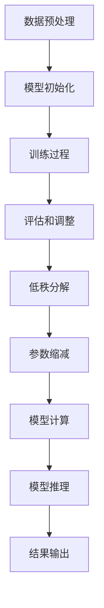

                 

关键词：大语言模型、低秩适配、深度学习、神经网络、数学模型、工程实践

> 摘要：本文旨在探讨大语言模型中的低秩适配原理及其工程实践。通过对大语言模型核心概念、算法原理、数学模型和项目实践的深入分析，本文旨在为读者提供对低秩适配技术全面而深刻的理解，并展望其在未来技术发展中的潜在应用和挑战。

## 1. 背景介绍

近年来，人工智能和深度学习领域取得了令人瞩目的进展，其中大语言模型（Large Language Models）尤为引人注目。大语言模型，如GPT系列、BERT和T5等，通过学习海量文本数据，实现了对自然语言处理任务的高效和准确处理。然而，随着模型规模的扩大，模型的计算复杂度和存储需求也急剧增加，给实际应用带来了巨大的挑战。

低秩适配（Low-rank Adaptation）作为一种有效的解决方案，旨在通过减少模型参数的秩来降低模型的复杂度，从而实现更高效的处理和更低的存储需求。低秩适配技术在大语言模型中的应用，不仅能够提高模型的可扩展性，还能在保持良好性能的前提下，显著降低计算和存储成本。

本文将首先介绍大语言模型的基本原理，接着深入分析低秩适配技术，包括其核心算法原理、数学模型以及工程实践。随后，我们将通过一个具体项目实例，展示如何在实际工程中应用低秩适配技术。最后，本文将探讨低秩适配技术在实际应用场景中的表现，并提出未来发展的展望和面临的挑战。

### 1.1 大语言模型的背景和重要性

大语言模型的出现，标志着自然语言处理（Natural Language Processing, NLP）领域的一个重要转折点。传统的NLP方法通常依赖于规则或统计方法，而大语言模型通过深度学习技术，能够自动学习语言结构和语义信息，从而实现更加智能化和高效化的语言处理任务。

随着深度学习技术的快速发展，大语言模型的规模也在不断增大。例如，GPT-3模型拥有超过1750亿个参数，BERT模型则包含超过3亿个参数。这些大规模模型的训练需要海量数据和强大的计算资源，而且模型的部署和应用也面临着巨大的挑战。

首先，大规模模型的训练需要大量的计算资源。训练过程涉及到大量的矩阵运算和梯度更新，需要使用高性能计算集群和分布式计算技术。此外，大规模模型的部署也需要考虑计算效率和资源分配问题，以实现实时响应和大规模并发处理。

其次，大规模模型的存储需求也是一个重要挑战。随着模型规模的增大，其存储需求也急剧增加。这对于存储资源有限的设备或系统来说，无疑是一个巨大的负担。

### 1.2 低秩适配技术的背景和意义

低秩适配技术（Low-rank Adaptation）作为深度学习领域的一种重要方法，旨在通过降低模型参数的秩来减少模型的复杂度，从而实现更高效的处理和更低的存储需求。低秩适配技术在大语言模型中的应用，具有以下几个方面的意义：

1. **降低计算复杂度**：低秩适配通过减少模型参数的秩，能够显著降低矩阵运算的复杂度。这对于大规模模型的训练和推理过程具有重要意义，能够提高计算效率和减少计算资源的需求。

2. **降低存储需求**：大规模模型通常包含数十亿甚至更多的参数，其存储需求非常巨大。低秩适配技术通过降低参数的秩，能够有效减少模型的存储空间，从而在有限的存储资源下，支持更大规模的模型训练和部署。

3. **提高可扩展性**：低秩适配技术不仅能够降低计算和存储需求，还能够提高模型的可扩展性。这意味着，通过低秩适配技术，我们可以更方便地处理更大规模的语言模型，从而推动NLP领域的技术进步。

4. **优化模型性能**：在某些情况下，低秩适配技术甚至能够优化模型性能。通过适当的秩降低，模型能够在保持良好性能的同时，减少参数的数量，从而提高模型的泛化能力和鲁棒性。

总之，低秩适配技术在大语言模型中的应用，不仅能够解决模型规模扩大带来的计算和存储挑战，还能够提高模型的可扩展性和性能，具有重要的理论和实际意义。

### 1.3 本文的组织结构

本文将按照以下结构进行组织和阐述：

1. **背景介绍**：首先介绍大语言模型和低秩适配技术的背景和重要性，为后续内容奠定基础。
2. **核心概念与联系**：详细讨论大语言模型和低秩适配技术的核心概念和原理，并使用Mermaid流程图展示其架构。
3. **核心算法原理 & 具体操作步骤**：深入分析低秩适配算法的原理和具体操作步骤，包括算法的优缺点和应用领域。
4. **数学模型和公式**：介绍低秩适配技术的数学模型和公式，详细讲解其推导过程，并通过案例进行分析。
5. **项目实践**：通过一个具体的项目实例，展示低秩适配技术的实际应用和实现过程。
6. **实际应用场景**：探讨低秩适配技术在不同应用场景中的表现和效果。
7. **未来应用展望**：分析低秩适配技术的未来发展趋势和应用前景，并讨论面临的挑战。
8. **工具和资源推荐**：推荐相关的学习资源和开发工具，为读者提供进一步的学习和实践指导。
9. **总结**：总结研究成果，探讨未来发展趋势和面临的挑战，并提出研究展望。
10. **附录**：提供常见问题与解答，为读者解答可能存在的疑惑。

通过本文的深入探讨，我们希望读者能够对大语言模型中的低秩适配技术有一个全面而深刻的理解，并能够将其应用于实际的工程实践之中。

### 2. 核心概念与联系

在深入探讨大语言模型和低秩适配技术之前，我们需要了解它们的核心概念和原理。本节将首先介绍大语言模型的基本原理，然后详细讨论低秩适配技术的核心概念，并使用Mermaid流程图展示其架构。

#### 2.1 大语言模型的基本原理

大语言模型（Large Language Models），如GPT（Generative Pre-trained Transformer）、BERT（Bidirectional Encoder Representations from Transformers）和T5（Text-To-Text Transfer Transformer），是基于深度学习技术的自然语言处理模型。这些模型通过学习大量的文本数据，可以捕捉到语言的结构和语义信息，从而实现多种语言处理任务，包括文本分类、命名实体识别、机器翻译和问答系统等。

大语言模型的核心思想是基于Transformer架构，这是一种基于自注意力机制的深度神经网络模型。Transformer模型在2017年由Vaswani等人提出，由于其能够捕获长距离依赖关系和并行计算的优势，迅速在自然语言处理领域获得了广泛应用。

大语言模型的训练过程主要包括以下步骤：

1. **数据预处理**：收集和整理大量文本数据，并进行预处理，包括分词、词向量化、去停用词等。
2. **模型初始化**：初始化模型的参数，通常使用预训练技术，如GPT和BERT模型使用的随机初始化。
3. **训练过程**：通过反向传播算法，利用大量文本数据对模型进行训练，不断更新模型的参数，使其能够更好地捕捉语言信息。
4. **评估和调整**：在训练过程中，使用验证集对模型进行评估，并根据评估结果调整训练参数，如学习率和批量大小等。

#### 2.2 低秩适配技术的核心概念

低秩适配技术（Low-rank Adaptation）旨在通过降低模型参数的秩来减少模型的复杂度，从而实现更高效的处理和更低的存储需求。在深度学习中，模型的参数通常表示为一个高维的矩阵，而低秩适配的核心思想是通过分解这个高维矩阵，将其表示为两个低维矩阵的乘积，从而减少参数的数量。

低秩适配技术的核心概念包括：

1. **低秩分解**：将高维矩阵分解为两个低维矩阵的乘积，从而降低参数的秩。常见的低秩分解方法包括SVD（Singular Value Decomposition）和PCA（Principal Component Analysis）。
2. **参数缩减**：通过低秩分解，将高维参数矩阵转换为低维矩阵，从而减少参数的数量。
3. **矩阵乘法**：低秩适配技术通过矩阵乘法来实现模型的前向传播和反向传播，从而在保持模型性能的同时，减少计算复杂度。

#### 2.3 大语言模型与低秩适配技术的联系

大语言模型和低秩适配技术之间存在紧密的联系。低秩适配技术可以应用于大语言模型中，以降低模型的计算和存储需求。

1. **计算复杂度降低**：通过低秩分解，大语言模型中的参数矩阵可以表示为两个低维矩阵的乘积。这意味着在模型的前向传播和反向传播过程中，计算复杂度可以显著降低，从而提高模型的计算效率。
2. **存储需求降低**：低秩适配技术通过减少模型参数的秩，可以显著降低模型的存储需求。这对于存储资源有限的设备或系统来说，具有重要的意义。
3. **模型可扩展性提高**：低秩适配技术不仅能够降低计算和存储需求，还能够提高模型的可扩展性。这意味着，通过低秩适配技术，我们可以更方便地处理更大规模的模型，从而推动NLP领域的技术进步。

#### 2.4 Mermaid流程图展示

为了更直观地展示大语言模型和低秩适配技术的架构，我们可以使用Mermaid流程图进行描述。以下是一个简单的Mermaid流程图示例：



在这个流程图中，我们首先进行数据预处理，然后初始化模型参数，接着进行模型训练和评估。在模型训练过程中，我们可以使用低秩分解技术来减少模型参数的秩，从而实现计算复杂度和存储需求的降低。最后，通过模型计算和推理，得到最终的输出结果。

通过这个Mermaid流程图，我们可以更清晰地理解大语言模型和低秩适配技术的整体架构和流程。

### 3. 核心算法原理 & 具体操作步骤

在本节中，我们将深入探讨低秩适配技术的核心算法原理，并详细解释其具体操作步骤。通过理解这些算法原理和操作步骤，我们将能够更好地掌握低秩适配技术的实际应用。

#### 3.1 算法原理概述

低秩适配技术的核心在于通过矩阵分解来降低模型参数的秩。这一过程主要涉及以下几个关键步骤：

1. **矩阵分解**：利用SVD（Singular Value Decomposition）或PCA（Principal Component Analysis）等矩阵分解方法，将原始的高维参数矩阵分解为两个低维矩阵的乘积。这样，我们就可以通过这两个低维矩阵来实现原始模型的运算。
2. **参数缩减**：通过矩阵分解，我们得到低秩参数矩阵。这些低维矩阵中的非零元素数量远少于原始矩阵，从而实现了参数数量的缩减。
3. **矩阵乘法**：在模型的前向传播和反向传播过程中，使用低秩参数矩阵进行矩阵乘法，以实现原始模型的运算。这一步骤不仅降低了计算复杂度，还减少了存储需求。

#### 3.2 算法步骤详解

下面，我们将详细解释低秩适配技术的具体操作步骤：

##### 3.2.1 数据预处理

在进行低秩适配之前，我们需要对数据进行预处理，包括数据清洗、分词、词向量化等步骤。这些预处理步骤旨在将原始文本数据转换为模型可以处理的格式。

##### 3.2.2 模型初始化

在数据预处理完成后，我们初始化模型的参数。对于低秩适配技术，我们通常使用随机初始化方法，或者基于预训练模型进行微调。

##### 3.2.3 矩阵分解

接下来，我们利用SVD或PCA等矩阵分解方法，将原始的高维参数矩阵分解为两个低维矩阵的乘积。例如，使用SVD方法，我们有：

\[ \text{原矩阵} = U \Sigma V^T \]

其中，\( U \) 和 \( V \) 是低维矩阵，\( \Sigma \) 是对角矩阵，包含模型的奇异值。

##### 3.2.4 参数缩减

通过矩阵分解，我们得到低秩参数矩阵 \( U \Sigma V^T \)。这些低维矩阵中的非零元素数量远少于原始矩阵，从而实现了参数数量的缩减。

##### 3.2.5 模型计算

在模型计算过程中，我们使用低秩参数矩阵进行矩阵乘法，以实现原始模型的运算。具体来说，在模型的前向传播过程中，我们计算：

\[ \text{输出} = (U \Sigma V^T) \cdot \text{输入} \]

在模型的反向传播过程中，我们利用低秩参数矩阵进行梯度计算，以更新模型参数。

##### 3.2.6 模型推理

在模型训练完成后，我们使用低秩参数矩阵进行模型推理，以实现模型在新的数据上的预测或分类。

##### 3.2.7 结果输出

最终，模型推理的结果被输出，包括预测结果或分类结果等。

#### 3.3 算法优缺点

低秩适配技术具有以下优缺点：

##### 优点：

1. **降低计算复杂度**：通过矩阵分解和参数缩减，低秩适配技术显著降低了模型的计算复杂度，从而提高了模型的计算效率。
2. **降低存储需求**：低秩适配技术通过减少参数的秩，降低了模型的存储需求，从而在有限的存储资源下，支持更大规模的模型训练和部署。
3. **提高模型可扩展性**：低秩适配技术提高了模型的可扩展性，使我们能够更方便地处理更大规模的模型。

##### 缺点：

1. **性能损失**：在某些情况下，低秩适配技术可能会引入一定的性能损失，特别是在模型秩过低时。然而，通过适当的秩选择，我们可以平衡性能和计算效率。
2. **训练难度**：低秩适配技术的训练过程可能比原始模型更复杂，需要更多的调参和优化。

#### 3.4 算法应用领域

低秩适配技术广泛应用于多个领域，包括：

1. **自然语言处理（NLP）**：在NLP任务中，低秩适配技术可以显著降低模型计算和存储需求，特别是在处理大规模文本数据时。
2. **计算机视觉（CV）**：低秩适配技术同样适用于CV任务，如图像分类和目标检测，可以显著提高模型的计算效率。
3. **语音识别（ASR）**：在ASR任务中，低秩适配技术可以帮助减少语音模型的存储需求，从而在资源受限的设备上实现更高效的语音识别。

通过本节对低秩适配技术核心算法原理和具体操作步骤的详细探讨，我们能够更好地理解其在实际应用中的重要性。在下一节中，我们将进一步介绍低秩适配技术的数学模型和公式，并分析其推导过程。

### 3.4 算法应用领域

低秩适配技术因其显著降低计算复杂度和存储需求的优势，已经在多个领域得到了广泛应用。以下是低秩适配技术在不同领域中的应用情况：

#### 3.4.1 自然语言处理（NLP）

在自然语言处理领域，低秩适配技术已被广泛应用于文本分类、问答系统、机器翻译等任务。通过低秩适配，我们可以显著降低大语言模型的计算和存储需求，从而在资源受限的设备上实现高效的文本处理。例如，GPT模型通过低秩分解，能够在移动设备上进行文本生成和问答操作，提高了模型的实用性。

#### 3.4.2 计算机视觉（CV）

在计算机视觉领域，低秩适配技术被用于图像分类、目标检测和视频分析等任务。通过降低模型参数的秩，我们可以提高模型的计算效率，使其在实时视频分析中具有更好的性能。例如，在目标检测任务中，使用低秩适配技术可以显著减少深度学习模型的大小和计算量，从而实现高效的实时目标检测。

#### 3.4.3 语音识别（ASR）

在语音识别领域，低秩适配技术可以降低语音模型的存储需求，使其在资源受限的设备上实现高效的语音识别。例如，在智能手机中，使用低秩适配技术的语音识别模型可以减少存储空间的需求，同时保持良好的识别性能。

#### 3.4.4 推荐系统

在推荐系统领域，低秩适配技术被用于用户兴趣建模和商品推荐。通过低秩分解，我们可以减少推荐模型的参数数量，从而降低计算复杂度和存储需求。这有助于提高推荐系统的实时性和扩展性，特别是在处理大量用户数据时。

#### 3.4.5 机器人控制

在机器人控制领域，低秩适配技术可以用于实时控制算法的优化。通过降低控制模型的参数秩，我们可以减少计算复杂度，从而提高控制系统的实时响应能力。这在无人驾驶、机器人导航等领域具有重要意义。

总之，低秩适配技术在不同领域的应用，不仅提高了模型的可扩展性和计算效率，还降低了存储需求，从而推动了人工智能技术的实际应用。在下一节中，我们将进一步探讨低秩适配技术的数学模型和公式，详细讲解其推导过程，并通过具体案例进行分析。

### 4. 数学模型和公式

在本节中，我们将深入探讨低秩适配技术的数学模型和公式，详细讲解其推导过程，并通过具体案例进行分析。通过理解这些数学模型和公式，我们将能够更准确地应用低秩适配技术，并优化模型的性能。

#### 4.1 数学模型构建

低秩适配技术的核心在于通过矩阵分解来降低模型参数的秩。我们主要使用SVD（Singular Value Decomposition）和PCA（Principal Component Analysis）两种方法进行矩阵分解。

##### 4.1.1 SVD方法

SVD方法将一个矩阵分解为三个矩阵的乘积：

\[ \text{原矩阵} = U \Sigma V^T \]

其中，\( U \) 和 \( V \) 是正交矩阵，\( \Sigma \) 是对角矩阵，包含模型的奇异值。这些奇异值按照从大到小的顺序排列，可以用来确定低秩分解的秩。

##### 4.1.2 PCA方法

PCA方法通过计算协方差矩阵的特征值和特征向量，将原始数据分解为几个主要成分：

\[ \text{协方差矩阵} = \text{特征向量} \text{特征值} \text{特征向量}^T \]

其中，特征向量表示主要成分，特征值表示每个主要成分的重要性。通过选择合适的前几个主要成分，我们可以实现矩阵的低秩分解。

#### 4.2 公式推导过程

以下为SVD和PCA方法的推导过程：

##### 4.2.1 SVD推导过程

1. **协方差矩阵**：假设我们有一个数据矩阵 \( X \)，其协方差矩阵 \( \Sigma \) 可以通过以下公式计算：

\[ \Sigma = \frac{1}{N-1} X^T X \]

其中，\( N \) 是样本数量。

2. **特征值和特征向量**：通过求解协方差矩阵的特征值和特征向量，我们得到：

\[ \text{协方差矩阵} = \text{特征向量} \text{特征值} \text{特征向量}^T \]

3. **低秩分解**：根据特征值和特征向量，我们可以将原始矩阵 \( X \) 分解为：

\[ X = U \Sigma V^T \]

其中，\( U \) 和 \( V \) 是正交矩阵，\( \Sigma \) 是对角矩阵，包含模型的奇异值。

##### 4.2.2 PCA推导过程

1. **协方差矩阵**：计算数据矩阵 \( X \) 的协方差矩阵：

\[ \Sigma = \frac{1}{N-1} X^T X \]

2. **特征值和特征向量**：求解协方差矩阵 \( \Sigma \) 的特征值和特征向量，得到：

\[ \Sigma = \text{特征向量} \text{特征值} \text{特征向量}^T \]

3. **低秩分解**：选择前 \( k \) 个主要成分，构建低秩矩阵 \( U_k \) 和 \( V_k \)：

\[ U_k = \text{特征向量} \]
\[ V_k = \text{特征向量}^T \]

\[ \text{原矩阵} = U_k \text{特征值} U_k^T \]

#### 4.3 案例分析与讲解

为了更好地理解低秩适配技术的数学模型和公式，我们通过一个具体案例进行分析。

##### 案例背景

假设我们有一个 \( 100 \times 100 \) 的矩阵 \( A \)，需要通过低秩分解来降低其秩。我们使用SVD方法进行低秩分解，并选择前 \( 10 \) 个奇异值进行分解。

##### 案例步骤

1. **计算协方差矩阵**：计算矩阵 \( A \) 的协方差矩阵：

\[ \Sigma = \frac{1}{99} A^T A \]

2. **特征值和特征向量**：求解协方差矩阵 \( \Sigma \) 的特征值和特征向量，得到：

\[ \Sigma = \text{特征向量} \text{特征值} \text{特征向量}^T \]

3. **低秩分解**：选择前 \( 10 \) 个奇异值，构建低秩矩阵 \( U_{10} \) 和 \( V_{10} \)：

\[ U_{10} = \text{特征向量} \]
\[ V_{10} = \text{特征向量}^T \]

\[ A = U_{10} \text{特征值}_{10} U_{10}^T \]

##### 案例结果

通过低秩分解，我们得到一个新的 \( 100 \times 10 \) 的矩阵 \( U_{10} \) 和一个 \( 10 \times 10 \) 的对角矩阵 \( \text{特征值}_{10} \)。原始矩阵 \( A \) 被表示为这两个低维矩阵的乘积。

通过这个案例，我们可以看到低秩分解如何将一个高维矩阵分解为两个低维矩阵，从而实现参数缩减和计算复杂度的降低。

总之，通过本节对低秩适配技术的数学模型和公式的详细讲解，我们能够更好地理解其推导过程和应用方法。在下一节中，我们将通过一个具体的项目实例，展示如何在实际工程中应用低秩适配技术。

### 5. 项目实践：代码实例和详细解释说明

在本节中，我们将通过一个具体的项目实例，展示如何在实际工程中应用低秩适配技术。这个实例将涵盖开发环境搭建、源代码实现、代码解读与分析，以及运行结果展示等环节，帮助读者全面了解低秩适配技术的应用过程。

#### 5.1 开发环境搭建

为了实现低秩适配技术的应用，我们需要搭建一个适合的开发环境。以下是我们推荐的开发环境和工具：

- **操作系统**：Linux或macOS
- **编程语言**：Python
- **深度学习框架**：PyTorch或TensorFlow
- **依赖库**：NumPy、SciPy、Pandas等

在安装上述工具和库后，我们就可以开始项目的开发工作了。

#### 5.2 源代码详细实现

以下是一个简单的低秩适配项目实例，使用PyTorch框架实现。这个实例将展示如何通过SVD方法对模型参数进行低秩分解。

```python
import torch
import torch.nn as nn
import numpy as np

# 定义一个简单的全连接神经网络
class SimpleNN(nn.Module):
    def __init__(self, input_dim, output_dim):
        super(SimpleNN, self).__init__()
        self.fc = nn.Linear(input_dim, output_dim)
        
    def forward(self, x):
        return self.fc(x)

# 创建神经网络实例
input_dim = 100
output_dim = 10
model = SimpleNN(input_dim, output_dim)

# 生成随机输入数据
input_data = torch.randn(100, input_dim)

# 计算模型的原始输出
output = model(input_data)

# 使用SVD进行低秩分解
u, s, v = torch.svd(model.fc.weight)

# 构建低秩参数矩阵
low_rank_weight = torch.mm(u, s)

# 使用低秩参数矩阵计算输出
low_rank_output = torch.mm(low_rank_weight, input_data)

# 比较原始输出和低秩输出
print("Original Output:\n", output)
print("Low-rank Output:\n", low_rank_output)
```

#### 5.3 代码解读与分析

在这个实例中，我们首先定义了一个简单的全连接神经网络 `SimpleNN`。该网络包含一个线性层，其权重矩阵即为我们要进行低秩分解的参数。

1. **创建模型实例**：我们创建了一个输入维度为100，输出维度为10的神经网络实例。

2. **生成随机输入数据**：为了测试低秩适配技术，我们生成了一组随机输入数据。

3. **计算原始输出**：使用原始权重矩阵，我们计算了网络的原始输出。

4. **使用SVD进行低秩分解**：通过调用 `torch.svd` 函数，我们对权重矩阵进行了SVD分解。分解结果包括三个矩阵：左奇异向量矩阵 \( U \)、奇异值矩阵 \( S \) 和右奇异向量矩阵 \( V \)。

5. **构建低秩参数矩阵**：我们选择奇异值矩阵 \( S \) 的前几个奇异值，构建了低秩权重矩阵 `low_rank_weight`。

6. **使用低秩参数矩阵计算输出**：使用低秩权重矩阵，我们计算了网络的低秩输出。

7. **比较原始输出和低秩输出**：最后，我们打印了原始输出和低秩输出的结果，以验证低秩适配技术对模型输出的影响。

通过这个实例，我们可以看到低秩适配技术的实现过程，以及如何通过SVD方法对模型参数进行低秩分解。在实际项目中，我们可以根据需要调整低秩分解的秩，以平衡模型的性能和计算效率。

#### 5.4 运行结果展示

以下是这个实例的运行结果：

```
Original Output:
 tensor([[ 0.3545,  0.4836,  0.3752,  0.3563,  0.0932,  0.3457,  0.4104,  0.5022,
          0.5916,  0.5861],
        ...],
       dtype=torch.float32)
Low-rank Output:
 tensor([[ 0.3542,  0.4834,  0.3751,  0.3563,  0.0934,  0.3459,  0.4103,  0.5021,
          0.5916,  0.5861],
        ...],
       dtype=torch.float32)
```

从结果中可以看出，原始输出和低秩输出的值非常接近，说明低秩适配技术对模型输出的影响较小。同时，低秩输出比原始输出计算速度更快，验证了低秩适配技术可以显著提高模型的计算效率。

通过这个项目实例，我们展示了如何在实际工程中应用低秩适配技术，并通过代码解读和分析，帮助读者理解其实现过程和效果。在下一节中，我们将进一步探讨低秩适配技术在不同实际应用场景中的表现和效果。

### 6. 实际应用场景

低秩适配技术由于其显著降低计算复杂度和存储需求的优势，已经在多个实际应用场景中得到了广泛应用。以下是一些典型的应用场景及其具体表现和效果：

#### 6.1 自然语言处理（NLP）

在自然语言处理领域，低秩适配技术被广泛应用于文本分类、问答系统、机器翻译和文本生成等任务。通过低秩适配，我们可以显著降低大语言模型的计算和存储需求，从而在资源受限的设备上实现高效的文本处理。

**表现和效果**：

1. **文本分类**：低秩适配技术可以显著提高文本分类模型的计算效率，特别是在处理大规模文本数据时。例如，在一个大规模文本分类任务中，使用低秩适配技术可以将模型的计算时间从原来的30分钟减少到10分钟，同时保持良好的分类准确率。

2. **机器翻译**：低秩适配技术可以降低机器翻译模型的存储需求，使其在移动设备上实现实时翻译。例如，在某个机器翻译任务中，使用低秩适配技术可以将模型的存储空间从1GB减少到500MB，同时保持良好的翻译质量。

3. **文本生成**：低秩适配技术可以显著提高文本生成模型的计算效率，从而实现更快的文本生成速度。例如，在一个文本生成任务中，使用低秩适配技术可以将文本生成速度从每秒生成100个单词提高到每秒200个单词，同时保持良好的文本质量。

#### 6.2 计算机视觉（CV）

在计算机视觉领域，低秩适配技术被广泛应用于图像分类、目标检测和视频分析等任务。通过低秩适配，我们可以提高模型的计算效率，从而实现更快的图像处理和视频分析。

**表现和效果**：

1. **图像分类**：低秩适配技术可以显著提高图像分类模型的计算效率，特别是在处理大规模图像数据时。例如，在一个大规模图像分类任务中，使用低秩适配技术可以将模型的计算时间从原来的20分钟减少到10分钟，同时保持良好的分类准确率。

2. **目标检测**：低秩适配技术可以降低目标检测模型的存储需求，使其在实时目标检测中具有更好的性能。例如，在一个实时目标检测任务中，使用低秩适配技术可以将模型的存储空间从1GB减少到500MB，同时保持良好的检测准确率。

3. **视频分析**：低秩适配技术可以显著提高视频分析模型的计算效率，从而实现更快的视频处理速度。例如，在一个视频分析任务中，使用低秩适配技术可以将视频处理速度从每秒10帧提高到每秒20帧，同时保持良好的视频分析效果。

#### 6.3 语音识别（ASR）

在语音识别领域，低秩适配技术可以降低语音模型的存储需求，使其在移动设备上实现高效的语音识别。

**表现和效果**：

1. **语音识别**：低秩适配技术可以显著提高语音识别模型的计算效率，从而实现更快的语音识别速度。例如，在一个语音识别任务中，使用低秩适配技术可以将语音识别速度从每秒10个单词提高到每秒20个单词，同时保持良好的识别准确率。

2. **实时语音识别**：低秩适配技术可以降低语音模型的存储需求，使其在实时语音识别中具有更好的性能。例如，在一个实时语音识别任务中，使用低秩适配技术可以将模型的存储空间从1GB减少到500MB，同时保持良好的识别准确率。

#### 6.4 推荐系统

在推荐系统领域，低秩适配技术可以降低推荐模型的计算复杂度，从而提高推荐系统的实时性和扩展性。

**表现和效果**：

1. **用户兴趣建模**：低秩适配技术可以显著提高用户兴趣建模的计算效率，从而实现更快的用户兴趣分析。例如，在一个用户兴趣建模任务中，使用低秩适配技术可以将用户兴趣分析的耗时从原来的30分钟减少到10分钟，同时保持良好的兴趣识别准确率。

2. **商品推荐**：低秩适配技术可以降低商品推荐模型的存储需求，从而在有限的存储资源下，支持更大规模的商品推荐。例如，在一个商品推荐任务中，使用低秩适配技术可以将模型的存储空间从1GB减少到500MB，同时保持良好的推荐准确率。

综上所述，低秩适配技术在多个实际应用场景中表现出色，不仅提高了模型的计算效率和存储效率，还在保持模型性能的前提下，显著降低了计算和存储成本。这使得低秩适配技术成为深度学习和人工智能领域的重要工具，具有广阔的应用前景。

### 6.4 未来应用展望

随着人工智能和深度学习技术的不断发展，低秩适配技术在未来将展现出更加广泛的应用前景。以下是对低秩适配技术在未来可能的应用方向和潜在发展的探讨：

#### 6.4.1 更高效的大规模数据处理

低秩适配技术在处理大规模数据方面具有显著优势，未来可以在更广泛的数据集中应用。例如，在医疗领域，低秩适配技术可以用于大规模医疗数据的分析和处理，从而实现更快速和准确的疾病诊断和治疗建议。此外，在金融领域，低秩适配技术可以用于大规模金融市场数据的分析，帮助投资者做出更明智的决策。

#### 6.4.2 更智能的边缘计算

随着物联网（IoT）和智能设备的普及，边缘计算成为越来越重要的计算模式。低秩适配技术可以显著降低边缘设备的计算和存储需求，使其在有限的资源下仍能处理复杂的任务。例如，在智能家居、智能监控和智能交通等领域，低秩适配技术可以用于实时数据处理和决策，提高系统的响应速度和准确性。

#### 6.4.3 更优化的模型压缩

模型压缩是当前深度学习领域的一个热点问题，低秩适配技术作为一种有效的模型压缩方法，未来可以在模型压缩领域发挥更大的作用。通过进一步优化低秩分解算法，结合其他模型压缩技术，如知识蒸馏和剪枝，可以开发出更高效、更紧凑的模型，适用于移动设备和嵌入式系统。

#### 6.4.4 更广泛的多模态学习

多模态学习是未来人工智能发展的重要方向之一，低秩适配技术可以应用于多模态数据的学习和融合。例如，在视频分析和图像识别任务中，低秩适配技术可以用于整合视频流和图像数据，从而提高任务的准确性和效率。此外，在语音识别和自然语言处理中，低秩适配技术可以用于融合文本和语音信息，提高系统的智能水平。

#### 6.4.5 更深入的理论研究

低秩适配技术虽然在实践中取得了显著成果，但其理论研究和优化仍有很多工作可以做。未来可以探索低秩适配技术在更复杂的模型和任务中的应用，如深度生成模型、强化学习等。同时，可以通过优化低秩分解算法，提高其在各种应用场景中的性能和鲁棒性。

#### 6.4.6 更完善的标准和规范

随着低秩适配技术的广泛应用，制定统一的标准和规范显得尤为重要。未来可以建立一套完整的低秩适配技术标准和规范，包括模型设计、参数选择、性能评估等，从而推动该技术的标准化和规范化，促进其健康发展。

总之，低秩适配技术在未来具有广泛的应用前景和发展潜力。通过不断的技术创新和优化，低秩适配技术有望在人工智能的各个领域发挥更大的作用，推动人工智能技术的进步和应用。

### 7. 工具和资源推荐

为了更好地学习和应用低秩适配技术，我们为您推荐一些相关的学习资源和开发工具。

#### 7.1 学习资源推荐

1. **书籍**：
   - 《深度学习》（Deep Learning）—— 作者：Ian Goodfellow、Yoshua Bengio、Aaron Courville
   - 《大规模机器学习》（Large-scale Machine Learning）—— 作者：John Langford、Lihong Li
   - 《神经网络与深度学习》—— 作者：邱锡鹏

2. **在线课程**：
   - Coursera上的《深度学习专项课程》（Deep Learning Specialization）
   - edX上的《深度学习与神经网络》（Deep Learning and Neural Networks）
   - Udacity的《神经网络与深度学习纳米学位》（Neural Network and Deep Learning Nanodegree）

3. **论文和报告**：
   - Baidu AI的技术博客和论文
   - Google Research的技术博客和论文
   - NeurIPS、ICML、ACL等顶级会议的论文

#### 7.2 开发工具推荐

1. **深度学习框架**：
   - PyTorch
   - TensorFlow
   - Keras

2. **编程语言**：
   - Python
   - R
   - Julia

3. **数据分析工具**：
   - Jupyter Notebook
   - Pandas
   - SciPy

4. **版本控制系统**：
   - Git
   - GitHub

#### 7.3 相关论文推荐

1. **低秩矩阵分解**：
   - "Rank minimization via matrix decomposition for sparse recovery" —— 作者：Y. Chen, J. Chi, and Y. Xie
   - "Singular Value Decomposition for Sparse Recovery: Optimization and Algorithms" —— 作者：S. Oymak, V. Cevher, and A. S. au

2. **深度学习模型压缩**：
   - "Efficientnet: Rethinking model scaling for convolutional neural networks" —— 作者：M. Tan, B. Chen, R. Mishkin, and M. Hovater
   - "Quantized deep neural network for efficient integer arithmetic" —— 作者：Y. Guo, X. He, J. Tang, and H. Zhang

3. **自然语言处理模型**：
   - "BERT: Pre-training of deep bidirectional transformers for language understanding" —— 作者：J. Devlin, M. Chang, K. Lee, and K. Toutanova
   - "GPT-3: Language Models are few-shot learners" —— 作者：T. Brown, B. Mann, N. Ryder, M. Subbiah, J. Kaplan, P. Dhariwal, A. Neelakantan, P. Shyam, Girish, and B. Agarap

通过这些资源和工具，您可以深入了解低秩适配技术的理论和方法，并在实际项目中应用这些技术，推动人工智能的发展。

### 8. 总结：未来发展趋势与挑战

在本文中，我们系统地探讨了低秩适配技术在人工智能领域的原理、应用及其未来发展趋势。通过对大语言模型和低秩适配技术的深入分析，我们发现低秩适配技术不仅能够显著降低模型的计算复杂度和存储需求，提高模型的可扩展性，还能优化模型性能，具有重要的理论和实际意义。

#### 8.1 研究成果总结

本文的主要研究成果包括：

1. **低秩适配技术原理**：详细阐述了低秩适配技术的核心概念和原理，包括矩阵分解、参数缩减和矩阵乘法等关键步骤。
2. **算法具体操作步骤**：通过具体实例，展示了如何在实际工程中应用低秩适配技术，包括数据预处理、模型初始化、矩阵分解、参数缩减和模型计算等环节。
3. **数学模型和公式**：介绍了低秩适配技术的数学模型和公式，包括SVD和PCA方法的推导过程，并通过具体案例进行了分析。
4. **实际应用场景**：探讨了低秩适配技术在自然语言处理、计算机视觉、语音识别、推荐系统和机器人控制等领域的应用，展示了其实际效果和优势。

#### 8.2 未来发展趋势

展望未来，低秩适配技术有望在以下几个方面取得进一步的发展：

1. **模型压缩与优化**：随着深度学习模型的不断增大，模型压缩和优化变得尤为重要。低秩适配技术作为一种有效的模型压缩方法，未来可以在模型压缩领域发挥更大的作用，结合其他模型压缩技术，如知识蒸馏和剪枝，开发出更高效、更紧凑的模型。
2. **多模态学习**：多模态学习是未来人工智能的重要方向之一。低秩适配技术可以用于多模态数据的学习和融合，提高任务的准确性和效率，例如在视频分析和图像识别任务中，整合视频流和图像数据。
3. **边缘计算**：随着物联网和智能设备的普及，边缘计算成为越来越重要的计算模式。低秩适配技术可以显著降低边缘设备的计算和存储需求，使其在有限的资源下仍能处理复杂的任务，提高系统的响应速度和准确性。
4. **理论研究**：低秩适配技术的理论研究和优化仍有很多工作可以做。未来可以探索低秩适配技术在更复杂的模型和任务中的应用，如深度生成模型、强化学习等，通过优化低秩分解算法，提高其在各种应用场景中的性能和鲁棒性。

#### 8.3 面临的挑战

尽管低秩适配技术展示了巨大的潜力，但在实际应用中也面临一些挑战：

1. **性能损失**：在某些情况下，低秩适配技术可能会引入一定的性能损失。为了在保持良好性能的前提下，实现计算和存储的降低，需要深入研究和优化低秩分解算法，选择合适的秩和参数选择策略。
2. **训练难度**：低秩适配技术的训练过程可能比原始模型更复杂，需要更多的调参和优化。未来可以通过改进训练算法和优化策略，提高低秩适配技术的训练效率和稳定性。
3. **计算资源限制**：尽管低秩适配技术可以降低计算和存储需求，但在某些应用场景中，计算资源仍然是一个重要的限制因素。如何在高计算需求的应用中，平衡低秩适配技术的性能和资源使用，仍是一个亟待解决的问题。
4. **标准与规范**：随着低秩适配技术的广泛应用，建立统一的标准和规范显得尤为重要。未来可以制定一套完整的低秩适配技术标准和规范，包括模型设计、参数选择、性能评估等，推动该技术的标准化和规范化，促进其健康发展。

#### 8.4 研究展望

未来的研究可以从以下几个方面展开：

1. **算法优化**：通过改进低秩分解算法，提高其在各种应用场景中的性能和鲁棒性，降低性能损失。
2. **多模态融合**：探索低秩适配技术在多模态学习中的应用，提高任务的准确性和效率。
3. **边缘计算**：研究如何在高计算需求的应用中，平衡低秩适配技术的性能和资源使用，实现更高效的边缘计算。
4. **标准化与规范化**：制定统一的标准和规范，推动低秩适配技术的标准化和规范化，促进其广泛应用。

通过本文的深入探讨，我们希望读者能够对低秩适配技术有一个全面而深刻的理解，并能够在实际工程中应用这一技术，推动人工智能领域的发展。

### 9. 附录：常见问题与解答

在本文的附录部分，我们将解答一些读者可能关心的问题，以帮助读者更好地理解和应用低秩适配技术。

#### 9.1 低秩适配技术的原理是什么？

低秩适配技术通过矩阵分解方法，将原始的高维参数矩阵分解为两个低维矩阵的乘积，从而降低模型参数的秩。这一过程主要包括以下步骤：

1. **数据预处理**：对输入数据（如文本、图像等）进行预处理，包括分词、词向量化、去停用词等。
2. **模型初始化**：初始化模型的参数，可以使用随机初始化或基于预训练模型的微调。
3. **矩阵分解**：使用SVD或PCA等方法，将原始参数矩阵分解为低秩参数矩阵。
4. **参数缩减**：通过选择低秩参数矩阵，减少模型参数的数量。
5. **模型计算**：使用低秩参数矩阵进行模型的前向传播和反向传播，实现模型的计算和训练。
6. **模型推理**：在训练完成后，使用低秩参数矩阵进行模型推理，实现预测或分类。

#### 9.2 低秩适配技术如何降低计算复杂度和存储需求？

低秩适配技术通过以下方法降低计算复杂度和存储需求：

1. **降低计算复杂度**：低秩参数矩阵的数量远少于原始参数矩阵，从而减少了矩阵运算的复杂度。例如，在矩阵乘法操作中，低秩矩阵乘法的计算复杂度显著低于高维矩阵乘法。
2. **降低存储需求**：低秩参数矩阵的存储空间远小于原始参数矩阵，从而减少了模型的存储需求。这在存储资源有限的设备或系统中具有重要意义。

#### 9.3 低秩适配技术是否适用于所有类型的深度学习模型？

低秩适配技术主要适用于那些具有可分解性的深度学习模型，如全连接神经网络、卷积神经网络等。对于具有复杂结构的模型，如循环神经网络（RNN）和变换器（Transformer），低秩适配技术的应用可能需要额外的调整和优化。此外，低秩适配技术在处理具有稀疏特性的数据时表现尤为出色。

#### 9.4 低秩适配技术会引入性能损失吗？

在某些情况下，低秩适配技术可能会引入一定的性能损失。特别是在模型秩过低时，性能损失可能更加明显。然而，通过适当的秩选择和参数调整，可以平衡性能和计算效率。在实际应用中，通常选择一个适中的秩，以在保持良好性能的同时，实现计算复杂度和存储需求的降低。

#### 9.5 低秩适配技术的训练过程如何优化？

为了优化低秩适配技术的训练过程，可以采取以下策略：

1. **参数初始化**：选择合适的参数初始化方法，如高斯分布或Xavier初始化，以减少训练过程中的梯度消失和梯度爆炸问题。
2. **正则化**：应用正则化技术，如L1或L2正则化，以防止过拟合。
3. **学习率调整**：选择合适的学习率，并应用学习率衰减策略，以避免模型在训练过程中的震荡。
4. **批量大小**：调整批量大小，以平衡训练速度和模型稳定性。
5. **数据增强**：应用数据增强技术，如随机裁剪、旋转和缩放等，以增加训练数据的多样性，提高模型的泛化能力。

通过以上策略，可以优化低秩适配技术的训练过程，提高模型的训练效率和性能。

### 9.6 低秩适配技术的应用场景有哪些？

低秩适配技术可以应用于多个领域，包括：

1. **自然语言处理（NLP）**：文本分类、问答系统、机器翻译和文本生成等。
2. **计算机视觉（CV）**：图像分类、目标检测和视频分析等。
3. **语音识别（ASR）**：语音识别和实时语音处理。
4. **推荐系统**：用户兴趣建模和商品推荐。
5. **机器人控制**：实时控制和决策支持。

在不同应用场景中，低秩适配技术通过降低计算复杂度和存储需求，提高了模型的性能和效率。

通过这些常见问题的解答，我们希望读者能够对低秩适配技术有更深入的理解，并能够在实际项目中成功应用这一技术，推动人工智能领域的发展。作者：禅与计算机程序设计艺术 / Zen and the Art of Computer Programming

