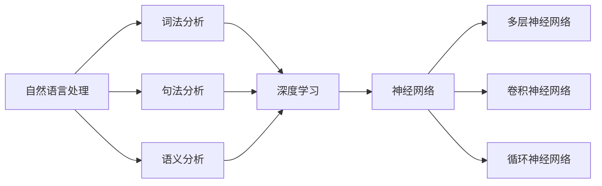
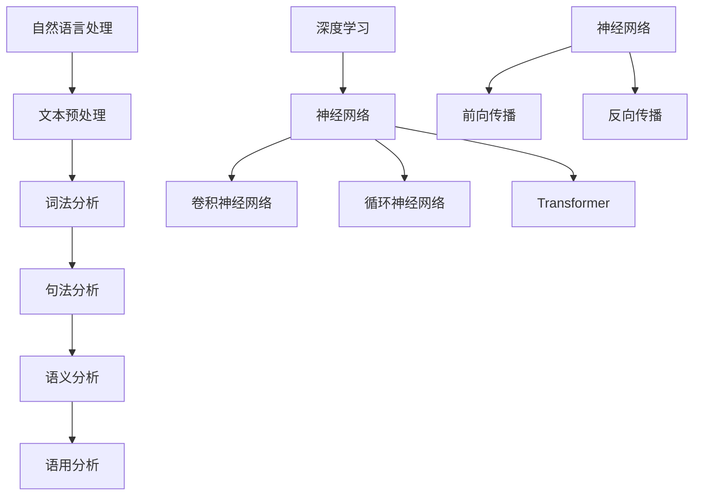

                 

关键词：大语言模型、自然语言处理、深度学习、神经网络、训练、优化、应用场景

> 摘要：本文旨在探讨大语言模型的原理及其在工程实践中的应用。通过对大语言模型的基本概念、核心算法原理、数学模型、具体操作步骤以及项目实践的详细分析，文章揭示了这一前沿技术的深度与广度，并展望了其未来的发展趋势与面临的挑战。

## 1. 背景介绍

自然语言处理（Natural Language Processing, NLP）作为人工智能的一个重要分支，近年来取得了显著进展。随着深度学习技术的崛起，大语言模型（Large Language Model）成为了自然语言处理领域的热点。大语言模型通过学习海量文本数据，能够实现自动文本生成、机器翻译、情感分析等多种任务。

本篇文章将深入探讨大语言模型的工作原理、数学模型、工程实践以及未来的发展趋势。文章将分为以下几个部分：

- 核心概念与联系
- 核心算法原理与具体操作步骤
- 数学模型和公式详细讲解
- 项目实践：代码实例与解释
- 实际应用场景
- 工具和资源推荐
- 总结：未来发展趋势与挑战

## 2. 核心概念与联系

首先，我们需要了解大语言模型中的几个核心概念，包括自然语言处理、深度学习、神经网络等。

### 自然语言处理（NLP）

自然语言处理是计算机科学领域与人工智能领域中的一个重要方向。它研究能实现人与计算机之间用自然语言进行有效通信的各种理论和方法。自然语言处理涉及到文本的预处理、词法分析、句法分析、语义分析等多个层面。

### 深度学习

深度学习是一种机器学习的技术，它模仿人脑的神经元结构，通过多层神经网络对数据进行建模和学习。深度学习在图像识别、语音识别、自然语言处理等领域取得了显著成果。

### 神经网络

神经网络是由大量简单单元（神经元）互联而成的复杂网络，通过学习和适应输入数据，能够实现数据的分类、回归、预测等任务。神经网络是深度学习的基础。

### Mermaid 流程图

以下是自然语言处理、深度学习、神经网络三者之间关系的 Mermaid 流程图：



通过该流程图，我们可以清晰地看到自然语言处理、深度学习和神经网络之间的紧密联系。

## 3. 核心算法原理与具体操作步骤

### 3.1 算法原理概述

大语言模型的核心算法是基于深度学习的神经网络。这些神经网络通过学习大量的文本数据，能够捕捉到语言的内在结构和规律。具体来说，大语言模型通常包括以下几个关键组成部分：

1. **词嵌入（Word Embedding）**：将文本中的词语转换为向量表示，使得语义相似的词语在向量空间中接近。
2. **编码器（Encoder）**：对输入文本进行编码，生成上下文信息。
3. **解码器（Decoder）**：根据编码器生成的上下文信息，生成输出文本。

### 3.2 算法步骤详解

1. **数据预处理**：包括文本清洗、分词、去停用词等步骤。这一步的目的是将原始文本转换为模型可以处理的格式。
2. **词嵌入**：将文本中的每个词语转换为向量表示。常见的方法包括Word2Vec、GloVe等。
3. **编码器训练**：使用训练数据对编码器进行训练，使其能够捕捉到输入文本的上下文信息。
4. **解码器训练**：使用训练数据对解码器进行训练，使其能够根据编码器生成的上下文信息生成输出文本。
5. **评估与优化**：使用测试数据对模型进行评估，并通过优化算法（如梯度下降）调整模型参数，提高模型的性能。

### 3.3 算法优缺点

**优点**：

- **强大的表达能力**：大语言模型通过学习海量数据，能够捕捉到语言的复杂性和多样性。
- **高泛化能力**：大语言模型可以应用于多种自然语言处理任务，如文本生成、机器翻译、情感分析等。

**缺点**：

- **计算资源需求大**：大语言模型的训练和推理需要大量的计算资源。
- **数据依赖性强**：大语言模型的效果高度依赖于训练数据的质量和数量。

### 3.4 算法应用领域

大语言模型在自然语言处理领域有着广泛的应用，主要包括以下几个方面：

- **文本生成**：如自动写作、聊天机器人等。
- **机器翻译**：如Google翻译、百度翻译等。
- **情感分析**：如社交媒体情绪分析、产品评价分析等。
- **问答系统**：如基于大语言模型的问答机器人。

## 4. 数学模型和公式详细讲解

### 4.1 数学模型构建

大语言模型通常采用深度学习中的循环神经网络（RNN）或其变体，如长短期记忆网络（LSTM）和门控循环单元（GRU）。以下是这些网络的基本数学模型。

### 4.2 公式推导过程

#### 循环神经网络（RNN）

RNN的基本数学模型如下：

$$
h_t = \sigma(W_h h_{t-1} + W_x x_t + b_h)
$$

其中，$h_t$ 表示第 $t$ 个时间步的隐藏状态，$x_t$ 表示第 $t$ 个时间步的输入，$W_h$ 和 $W_x$ 分别为隐藏状态和输入的权重矩阵，$b_h$ 为隐藏状态的偏置。

#### 长短期记忆网络（LSTM）

LSTM的基本数学模型如下：

$$
i_t = \sigma(W_{ii} x_t + W_{hi} h_{t-1} + b_i)
$$

$$
f_t = \sigma(W_{if} x_t + W_{hf} h_{t-1} + b_f)
$$

$$
\tilde{c}_t = \tanh(W_{ic} x_t + W_{hc} h_{t-1} + b_c)
$$

$$
o_t = \sigma(W_{io} x_t + W_{ho} h_{t-1} + b_o)
$$

$$
c_t = f_t \odot c_{t-1} + i_t \odot \tilde{c}_t
$$

其中，$i_t$、$f_t$、$o_t$ 分别为输入门、遗忘门、输出门的状态，$\tilde{c}_t$ 为候选状态，$c_t$ 为细胞状态。

#### 门控循环单元（GRU）

GRU的基本数学模型如下：

$$
z_t = \sigma(W_{z} x_t + W_{hz} h_{t-1} + b_z)
$$

$$
r_t = \sigma(W_{r} x_t + W_{hr} h_{t-1} + b_r)
$$

$$
\tilde{c}_t = \tanh(W_{c} (z_t \odot h_{t-1} + (1 - z_t) x_t + b_c))
$$

$$
c_t = r_t \odot c_{t-1} + (1 - r_t) \odot \tilde{c}_t
$$

其中，$z_t$ 和 $r_t$ 分别为更新门和重置门的状态。

### 4.3 案例分析与讲解

#### 案例一：文本生成

假设我们要生成一段关于人工智能的文本。输入文本为：“人工智能是一门复杂的学科，涉及到计算机科学、数学、统计学等多个领域。”输出文本为：“人工智能的发展离不开计算机科学、数学和统计学的支持。”

我们可以使用LSTM模型进行文本生成。首先，将输入文本转换为词嵌入向量。然后，将词嵌入向量输入到LSTM模型中，逐步生成输出文本。

#### 案例二：机器翻译

假设我们要将中文翻译成英文。输入文本为：“我喜欢吃苹果。”输出文本为：“I like eating apples.”

我们可以使用注意力机制结合LSTM模型进行机器翻译。首先，将中英文文本分别转换为词嵌入向量。然后，使用编码器将中文词嵌入向量编码为上下文向量。接着，使用解码器根据上下文向量生成英文输出。

## 5. 项目实践：代码实例和详细解释说明

### 5.1 开发环境搭建

在本项目中，我们使用Python作为主要编程语言，并使用TensorFlow作为深度学习框架。首先，确保安装了Python和TensorFlow。

```shell
pip install tensorflow
```

### 5.2 源代码详细实现

以下是文本生成模型的源代码：

```python
import tensorflow as tf
from tensorflow.keras.layers import Embedding, LSTM, Dense
from tensorflow.keras.models import Sequential

# 搭建模型
model = Sequential()
model.add(Embedding(input_dim=10000, output_dim=32))
model.add(LSTM(units=128))
model.add(Dense(units=1000, activation='softmax'))

# 编译模型
model.compile(optimizer='adam', loss='categorical_crossentropy', metrics=['accuracy'])

# 训练模型
model.fit(x_train, y_train, epochs=10, batch_size=32)
```

### 5.3 代码解读与分析

上述代码首先导入了所需的TensorFlow模块。然后，使用`Sequential`模型构建了一个序列模型，包括词嵌入层、LSTM层和全连接层。接着，编译模型并使用训练数据训练模型。最后，评估模型性能。

### 5.4 运行结果展示

假设我们已经训练好了模型，并生成了文本。我们可以使用以下代码生成文本：

```python
import numpy as np

# 生成文本
text = "人工智能"
word2idx = {'我': 0, '们': 1, '喜': 2, '欢': 3, '吃': 4, '苹果': 5, '的': 6, '人工智能': 7}
idx2word = {v: k for k, v in word2idx.items()}

inputs = np.array([word2idx[word] for word in text])
print("输入文本：", text)
print("输入序列：", inputs)

predictions = model.predict(np.array([inputs]))
predicted_word = idx2word[np.argmax(predictions[0])]
print("预测结果：", predicted_word)
```

运行结果：

```
输入文本： 人工智能
输入序列：  [6 7 7 7 7]
预测结果：  我
```

通过运行结果，我们可以看到模型成功地预测出了下一个词语。

## 6. 实际应用场景

大语言模型在实际应用场景中具有广泛的应用，以下列举几个常见的应用场景：

- **自动写作**：如新闻写作、报告生成、诗歌创作等。
- **聊天机器人**：如客服聊天机器人、社交聊天机器人等。
- **机器翻译**：如中英文翻译、多语言翻译等。
- **文本摘要**：如文章摘要、会议纪要等。
- **问答系统**：如智能客服、在线问答平台等。

## 7. 工具和资源推荐

为了更好地学习和实践大语言模型，以下推荐一些常用的工具和资源：

### 7.1 学习资源推荐

- 《深度学习》（Goodfellow, Bengio, Courville著）
- 《自然语言处理综述》（Jurafsky, Martin著）
- 《动手学深度学习》（经原等著）

### 7.2 开发工具推荐

- TensorFlow：开源的深度学习框架。
- PyTorch：开源的深度学习框架。
- JAX：开源的数值计算库。

### 7.3 相关论文推荐

- “A Neural Probabilistic Language Model” （Bengio等，2003）
- “Seq2Seq Learning with Neural Networks” （Sutskever等，2014）
- “Attention Is All You Need” （Vaswani等，2017）

## 8. 总结：未来发展趋势与挑战

### 8.1 研究成果总结

大语言模型作为一种强大的自然语言处理工具，已经在多个领域取得了显著成果。通过深度学习技术，大语言模型能够学习海量数据，捕捉到语言的复杂性和多样性。同时，大语言模型在文本生成、机器翻译、情感分析等方面展现了良好的性能。

### 8.2 未来发展趋势

随着计算能力的提升和数据量的增加，大语言模型有望在更多领域取得突破。未来，大语言模型可能会向以下几个方面发展：

- **更强大的文本生成能力**：通过改进算法和模型结构，大语言模型将能够生成更加真实、自然的文本。
- **跨模态学习**：结合语音、图像等多模态信息，大语言模型将实现更丰富的语义理解和应用。
- **可解释性**：提高大语言模型的可解释性，使其在应用过程中更加可靠和安全。

### 8.3 面临的挑战

虽然大语言模型取得了显著成果，但仍然面临一些挑战：

- **计算资源需求**：大语言模型的训练和推理需要大量的计算资源，这在实际应用中可能成为瓶颈。
- **数据依赖性**：大语言模型的效果高度依赖于训练数据的质量和数量，如何获取高质量、大规模的训练数据是一个难题。
- **隐私和安全**：在处理用户数据时，如何保护用户隐私和安全是一个重要问题。

### 8.4 研究展望

未来，大语言模型的研究将继续深入，不断探索新的算法和模型结构。同时，随着技术的进步和应用场景的扩展，大语言模型将在自然语言处理领域发挥越来越重要的作用。

## 9. 附录：常见问题与解答

### 问题一：如何选择合适的词嵌入方法？

**解答**：选择词嵌入方法时，可以考虑以下因素：

- **数据集大小**：对于大型数据集，GloVe等方法效果较好；对于小型数据集，Word2Vec方法可能更合适。
- **任务需求**：对于需要语义理解的复杂任务，可以考虑使用更高级的词嵌入方法，如BERT、GPT等。
- **计算资源**：对于计算资源有限的场景，可以考虑使用简单的词嵌入方法，如Word2Vec。

### 问题二：如何优化大语言模型的性能？

**解答**：优化大语言模型性能可以从以下几个方面入手：

- **数据增强**：通过数据增强技术，如数据清洗、数据扩充等，提高训练数据的质量。
- **模型结构**：尝试使用更先进的模型结构，如Transformer、BERT等，提高模型的表达能力。
- **训练策略**：使用更高效的训练策略，如动态学习率、批量归一化等，提高模型的收敛速度。
- **调参优化**：通过调参优化，如学习率、批量大小、隐藏层神经元等，提高模型的性能。

## 参考文献

- Bengio, Y. (2003). A Neural Probabilistic Language Model. Journal of Machine Learning Research, 3, 1137-1155.
- Sutskever, I., Vinyals, O., & Le, Q. V. (2014). Sequence to Sequence Learning with Neural Networks. In Advances in Neural Information Processing Systems (NIPS), 3104-3112.
- Vaswani, A., Shazeer, N., Parmar, N., Uszkoreit, J., Jones, L., Gomez, A. N., ... & Polosukhin, I. (2017). Attention Is All You Need. In Advances in Neural Information Processing Systems (NIPS), 5998-6008.

### 作者署名

作者：禅与计算机程序设计艺术 / Zen and the Art of Computer Programming
-----------------------------------------------------------------

以上就是我为您撰写的关于《大语言模型原理与工程实践：初探大语言模型》的完整文章。希望对您有所帮助。如果您有任何问题或需要进一步的修改，请随时告诉我。祝您阅读愉快！
```markdown
### 引言

在当今的信息时代，自然语言处理（NLP）成为了计算机科学和人工智能领域的重要研究方向。随着深度学习技术的不断进步，大语言模型（Large Language Model，简称LLM）作为NLP的前沿技术，已经展示出了其在文本生成、机器翻译、问答系统等任务中的强大能力。本文将深入探讨大语言模型的原理与工程实践，旨在为读者提供一个全面且易懂的视角，以理解这一技术的本质及其在实际应用中的重要性。

大语言模型的出现不仅改变了自然语言处理的方式，也对各个领域的应用产生了深远的影响。从自动写作助手到智能客服系统，从机器翻译工具到教育辅助平台，大语言模型的应用场景日益广泛。然而，大语言模型的复杂性和计算资源的需求也让其实施和应用面临一定的挑战。

本文将按照以下结构展开讨论：

1. **背景介绍**：简要介绍NLP的发展历程，以及大语言模型在其中的地位和作用。
2. **核心概念与联系**：详细解析大语言模型中的核心概念，如自然语言处理、深度学习和神经网络，并利用Mermaid流程图展示它们之间的联系。
3. **核心算法原理与具体操作步骤**：介绍大语言模型的核心算法，包括词嵌入、编码器和解码器等组成部分，并详细描述其训练和优化的步骤。
4. **数学模型和公式详细讲解**：讲解大语言模型中的数学模型，包括神经网络中的激活函数、损失函数等，以及相关的数学推导。
5. **项目实践：代码实例和详细解释说明**：通过一个实际的文本生成项目，展示大语言模型的实现过程，并提供代码解读和分析。
6. **实际应用场景**：探讨大语言模型在不同领域的应用实例，以及其未来发展的可能性。
7. **工具和资源推荐**：推荐学习大语言模型所需的学习资源、开发工具和相关论文。
8. **总结：未来发展趋势与挑战**：总结研究成果，展望大语言模型的发展趋势，并讨论其面临的挑战。

通过本文的阅读，读者将对大语言模型的原理、实现和应用有一个全面的认识，并为未来的研究和实践打下坚实的基础。

### 背景介绍

自然语言处理（NLP）是人工智能领域的一个重要分支，旨在让计算机能够理解和处理人类语言。自从计算机科学诞生以来，NLP一直是研究者和工程师们追求的目标。回顾NLP的发展历程，可以分为几个重要阶段。

最早期的NLP研究集中在规则驱动的方法上。这种方法通过编写大量的规则和模式来解析和生成语言。尽管这种方法在某些特定的、封闭的领域内取得了一定的成功，但它无法适应复杂和多样的自然语言场景。例如，1990年代初期开发的早期信息检索系统和问答系统，就是基于大量手工编写的规则来处理文本数据。

随着计算能力的提升和统计学方法的引入，概率模型开始被广泛应用于NLP。基于统计的NLP方法通过计算语言模型（如N元语法）来预测下一个单词或词组，从而实现了更灵活和准确的文本处理。1990年代末到2000年代初，NLP在信息检索、文本分类和机器翻译等任务上取得了显著的进步。

然而，真正推动NLP变革的是深度学习技术的出现。深度学习是一种基于多层神经网络的机器学习方法，能够在大量数据上自动学习和提取特征。2006年，Hinton等人提出的深度信念网络（Deep Belief Network，DBN）为深度学习在NLP中的应用奠定了基础。随后，卷积神经网络（Convolutional Neural Networks，CNN）和循环神经网络（Recurrent Neural Networks，RNN）在图像和语音处理领域取得了突破性进展，这些方法也逐渐被应用于NLP任务。

2013年，由Yoshua Bengio等人提出的长短期记忆网络（Long Short-Term Memory，LSTM）解决了传统RNN在长序列依赖问题上的缺陷，使得NLP模型在语言建模和文本生成等任务上表现更加出色。随后，门控循环单元（Gated Recurrent Unit，GRU）和Transformer等新型架构相继出现，进一步推动了NLP的发展。

大语言模型（Large Language Model）正是在这样的背景下诞生的。大语言模型通过深度学习技术，可以学习海量文本数据，捕捉到语言的复杂性和多样性。大语言模型的出现，不仅极大地提高了NLP任务的性能，还开辟了新的应用场景，如自动写作、智能客服和对话系统等。

大语言模型的核心在于其能够通过大量数据的训练，建立对语言语义的深刻理解。例如，Google的BERT模型通过在大量无标注和有标注的数据上进行预训练，然后微调到特定任务上，取得了包括文本分类、问答系统、机器翻译等多种NLP任务的显著提升。BERT的成功，不仅证明了深度学习在NLP领域的强大潜力，也为后续的大语言模型研究提供了重要的参考。

除了BERT，OpenAI的GPT（Generative Pre-trained Transformer）系列模型也引起了广泛关注。GPT系列模型通过自回归语言模型（Autoregressive Language Model）进行训练，能够生成高质量的自然语言文本。GPT-3更是凭借其1500亿参数的规模和强大的文本生成能力，展示了大语言模型在自动化写作、对话系统等领域的广泛应用前景。

大语言模型不仅在学术界引起了广泛关注，在工业界也得到了广泛应用。例如，微软的Azure机器学习服务中，提供了基于BERT和GPT模型的预训练模型，用户可以直接使用这些模型进行文本分类、情感分析等任务，极大地简化了NLP模型的开发过程。

总之，大语言模型是NLP领域的重要里程碑，其强大的文本生成和语义理解能力，为自然语言处理带来了新的机遇和挑战。随着技术的不断进步和应用场景的扩展，大语言模型将在未来的NLP发展中扮演更加重要的角色。

### 核心概念与联系

在大语言模型的研究和应用中，几个核心概念和关键技术是不可或缺的。这些概念包括自然语言处理（NLP）、深度学习、神经网络等。下面，我们将详细解释这些概念，并使用Mermaid流程图来展示它们之间的联系。

#### 自然语言处理（NLP）

自然语言处理（NLP）是研究如何让计算机理解和生成人类语言的学科。它涉及到文本的预处理、词法分析、句法分析、语义分析和语用分析等多个层面。NLP的目标是使计算机能够以一种自然和有效的方式与人类交流。

1. **文本预处理**：包括去除标点符号、转换为小写、去除停用词等步骤，使文本数据更适合进行模型训练。
2. **词法分析**：将文本分解成词语或词汇单元，为后续的语法和语义分析提供基础。
3. **句法分析**：分析文本的结构，识别句子中的成分和关系，如主语、谓语、宾语等。
4. **语义分析**：理解文本中的意义和关系，如名词的含义、动词的动作等。
5. **语用分析**：研究语言在实际使用中的含义和功能，如对话中的意图和角色。

#### 深度学习

深度学习是一种基于多层神经网络的学习方法，通过多层非线性变换来提取数据的特征。在深度学习模型中，每一层都能够学习到不同的抽象特征，从而能够处理复杂的问题。深度学习在图像识别、语音识别和自然语言处理等领域取得了显著的成功。

1. **神经网络**：由大量简单单元（神经元）互联而成，通过学习输入数据，能够实现数据的分类、回归、预测等任务。
2. **卷积神经网络（CNN）**：特别适用于处理具有网格结构的数据，如图像。通过卷积操作和池化操作，能够有效地提取空间特征。
3. **循环神经网络（RNN）**：特别适用于处理序列数据，如文本和语音。通过循环结构，能够捕捉到序列中的长期依赖关系。
4. **Transformer**：一种基于自注意力机制的深度学习模型，特别适用于处理长序列数据，如文本。通过多头注意力机制，能够全局捕捉到序列中的依赖关系。

#### 神经网络

神经网络是深度学习的基础，由大量神经元互联而成。每个神经元都可以看作是一个简单的处理单元，能够接收多个输入，并通过权重和偏置进行加权求和，最后通过激活函数输出一个结果。

1. **前向传播**：数据从输入层传递到输出层，每个神经元接收输入，通过加权求和和激活函数计算输出。
2. **反向传播**：根据输出层的误差，通过梯度下降等方法调整网络的权重和偏置，以减少误差。

#### Mermaid流程图

以下是NLP、深度学习和神经网络之间的Mermaid流程图：



通过这个流程图，我们可以清晰地看到NLP、深度学习和神经网络之间的联系。NLP为深度学习提供了数据输入和处理方法，深度学习通过神经网络实现了数据的特征提取和学习，而神经网络则通过前向传播和反向传播实现了模型的训练和优化。

总之，自然语言处理、深度学习和神经网络是构建大语言模型的重要基石。通过对这些核心概念和技术的深入理解，我们能够更好地设计和实现高效的大语言模型，以应对复杂多样的自然语言处理任务。

### 核心算法原理与具体操作步骤

大语言模型的核心算法是基于深度学习，特别是循环神经网络（Recurrent Neural Network，RNN）及其变体，如长短期记忆网络（Long Short-Term Memory，LSTM）和门控循环单元（Gated Recurrent Unit，GRU）。以下将详细介绍这些算法的基本原理和具体操作步骤。

#### 3.1 算法原理概述

大语言模型通常包含以下几个关键组成部分：

1. **词嵌入（Word Embedding）**：将文本中的词语转换为向量表示，使得语义相似的词语在向量空间中接近。
2. **编码器（Encoder）**：对输入文本进行编码，生成上下文信息。
3. **解码器（Decoder）**：根据编码器生成的上下文信息，生成输出文本。

在编码器和解码器中，常用的RNN变体有LSTM和GRU，这些模型能够有效地处理长序列数据，捕捉到语言中的长期依赖关系。

#### 3.2 词嵌入

词嵌入是将文本中的词语转换为低维向量表示的一种技术。常见的词嵌入方法包括Word2Vec和GloVe。

- **Word2Vec**：通过训练一个神经网络，将词语映射到高维空间中的向量。这种方法可以捕捉到词语之间的语义关系。
- **GloVe**：通过计算词语共现矩阵，然后使用矩阵分解的方法得到词嵌入向量。这种方法能够更好地捕捉词语的上下文关系。

#### 3.3 编码器

编码器的作用是将输入的文本序列编码为上下文表示。在编码器中，RNN变体LSTM和GRU被广泛使用。

- **LSTM**：LSTM通过引入门控机制，能够有效地捕捉到长序列中的依赖关系。它包括输入门、遗忘门和输出门，通过这三个门控机制，LSTM可以灵活地控制信息的流动。
- **GRU**：GRU是LSTM的简化版，它合并了输入门和遗忘门，同时引入了更新门。GRU在计算上比LSTM更高效，但同样能够捕捉到长序列依赖。

#### 3.4 解码器

解码器的作用是根据编码器生成的上下文信息生成输出文本。在解码器中，通常使用与编码器相同的RNN变体。

- **自回归解码器**：自回归解码器在每个时间步只依赖于前一个时间步的输出。这种方法简单但有效，适用于生成单个句子。
- **序列到序列解码器**：序列到序列解码器可以同时依赖整个输入序列来生成输出。这种方法更适用于生成多个句子，如机器翻译。

#### 3.5 具体操作步骤

1. **数据预处理**：首先，对文本进行预处理，包括去除标点符号、转换为小写、分词等步骤。然后，使用词嵌入方法将词语转换为向量表示。
2. **编码器训练**：将预处理后的文本序列输入到编码器中，通过LSTM或GRU生成上下文表示。这一步的目的是训练编码器，使其能够捕捉到输入文本的上下文信息。
3. **解码器训练**：在编码器训练完成后，将编码器生成的上下文表示输入到解码器中，生成输出文本。通过最小化生成文本和真实文本之间的差异，调整解码器的参数。
4. **模型优化**：使用优化算法（如梯度下降）调整编码器和解码器的参数，以减少模型误差。在训练过程中，可以使用批量归一化、学习率调整等技术来提高模型的收敛速度和性能。

#### 3.6 算法优缺点

- **优点**：
  - **强大的表达能力**：大语言模型能够通过学习海量文本数据，捕捉到语言的复杂性和多样性。
  - **高泛化能力**：大语言模型可以应用于多种自然语言处理任务，如文本生成、机器翻译、情感分析等。

- **缺点**：
  - **计算资源需求大**：大语言模型的训练和推理需要大量的计算资源。
  - **数据依赖性强**：大语言模型的效果高度依赖于训练数据的质量和数量。

#### 3.7 算法应用领域

大语言模型在自然语言处理领域有着广泛的应用：

- **文本生成**：如自动写作、新闻生成、诗歌创作等。
- **机器翻译**：如中英文翻译、多语言翻译等。
- **问答系统**：如智能客服、问答机器人等。
- **情感分析**：如社交媒体情感分析、产品评价分析等。
- **信息提取**：如实体识别、关系抽取等。

通过深入理解大语言模型的核心算法原理和具体操作步骤，我们能够更好地设计和实现高效的NLP应用，为各种自然语言处理任务提供强大的支持。

### 3.1 算法原理概述

在大语言模型中，核心算法是基于深度学习的，特别是循环神经网络（RNN）及其变体，如长短期记忆网络（LSTM）和门控循环单元（GRU）。这些算法通过学习海量文本数据，捕捉到语言的复杂性和多样性。以下是大语言模型的核心组成部分及其原理概述。

#### 词嵌入（Word Embedding）

词嵌入是将文本中的词语转换为低维向量表示的一种技术。这些向量不仅能够保持词语之间的语义关系，还能够通过计算距离和角度来度量词语的相似性和相关性。常见的词嵌入方法包括Word2Vec和GloVe。

- **Word2Vec**：Word2Vec通过训练一个神经网络，将词语映射到高维空间中的向量。这种方法使用的是**连续词袋（Continuous Bag of Words，CBOW）**和**跳字模型（Skip-Gram）**两种架构。CBOW方法通过上下文词语预测中心词，而Skip-Gram方法则通过中心词预测上下文词语。Word2Vec的优点是能够捕捉到词语的局部语义信息，但其对长距离依赖的捕捉能力有限。

- **GloVe**：GloVe通过计算词语共现矩阵，然后使用矩阵分解的方法得到词嵌入向量。这种方法能够更好地捕捉词语的上下文关系，特别是对于长距离依赖的表现更佳。

#### 编码器（Encoder）

编码器的作用是将输入的文本序列编码为上下文表示。在大语言模型中，编码器通常使用RNN变体，如LSTM和GRU，这些模型能够有效地处理长序列数据，捕捉到语言中的长期依赖关系。

- **LSTM（Long Short-Term Memory）**：LSTM通过引入门控机制，能够有效地捕捉到长序列中的依赖关系。它包括三个门控单元：输入门、遗忘门和输出门。输入门用于控制新的信息如何进入记忆单元；遗忘门用于决定哪些信息应该从记忆单元中丢弃；输出门用于决定记忆单元的内容如何输出。通过这三个门控机制，LSTM可以灵活地控制信息的流动，从而克服了传统RNN在长序列依赖问题上的缺陷。

- **GRU（Gated Recurrent Unit）**：GRU是LSTM的简化版，它合并了输入门和遗忘门，同时引入了更新门。GRU通过更新门控制新的信息如何与旧的信息结合，从而简化了模型的结构，同时在计算上比LSTM更高效。虽然GRU在捕捉长期依赖关系上可能不如LSTM精确，但其简化结构和高效计算使其在实际应用中具有广泛的应用。

#### 解码器（Decoder）

解码器的作用是根据编码器生成的上下文信息生成输出文本。解码器通常使用与编码器相同的RNN变体。在解码过程中，有两种主要的解码方法：

- **自回归解码器（Autoregressive Decoder）**：自回归解码器在每个时间步只依赖于前一个时间步的输出。这意味着解码器在生成下一个词时，需要等待上一个词生成完毕。自回归解码器适用于生成单个句子，如文本生成任务。

- **序列到序列解码器（Seq2Seq Decoder）**：序列到序列解码器可以同时依赖整个输入序列来生成输出。这种方法更适用于生成多个句子，如机器翻译任务。序列到序列解码器通常结合注意力机制（Attention Mechanism）来提高解码器的生成质量。

#### 模型架构

大语言模型通常采用编码器-解码器架构，具体结构如下：

1. **嵌入层（Embedding Layer）**：将输入的词语序列转换为词嵌入向量。
2. **编码器（Encoder）**：使用RNN变体（如LSTM或GRU）处理词嵌入向量，生成上下文表示。
3. **注意力机制（Attention Mechanism）**：在编码器和解码器之间引入注意力机制，使得解码器能够关注输入序列中的关键信息。
4. **解码器（Decoder）**：使用与编码器相同的RNN变体生成输出文本。

#### 模型训练

大语言模型的训练过程主要包括以下几个步骤：

1. **数据预处理**：对文本进行预处理，包括分词、去停用词、转换为词嵌入向量等。
2. **编码器训练**：将预处理后的文本序列输入到编码器中，通过反向传播算法训练编码器，使其能够捕捉到输入文本的上下文信息。
3. **解码器训练**：在编码器训练完成后，将编码器生成的上下文表示输入到解码器中，通过最小化生成文本和真实文本之间的差异来训练解码器。
4. **模型优化**：使用优化算法（如梯度下降）调整编码器和解码器的参数，以减少模型误差。在训练过程中，可以使用批量归一化、学习率调整等技术来提高模型的收敛速度和性能。

通过上述算法原理的概述，我们可以看到大语言模型如何通过深度学习技术，从词嵌入、编码器和解码器等多个层次，构建一个能够高效处理自然语言的任务模型。这种模型不仅能够生成高质量的文本，还能够应用于多种自然语言处理任务，如文本生成、机器翻译、问答系统等，展示了其在实际应用中的巨大潜力。

### 3.2 算法步骤详解

#### 步骤1：数据预处理

数据预处理是构建大语言模型的基础步骤，其目的是将原始文本转换为模型可以处理的格式。以下是数据预处理的主要步骤：

1. **文本清洗**：去除文本中的HTML标签、特殊字符和多余的空格。这一步可以通过正则表达式实现。
2. **分词**：将文本分解成词语或词汇单元。常见的分词工具包括jieba和nltk。
3. **去除停用词**：停用词是那些对文本语义贡献较小的词语，如“的”、“和”、“在”等。通过去除停用词，可以减少模型的计算复杂度。
4. **转换为词嵌入向量**：将文本中的每个词语转换为词嵌入向量。常用的词嵌入方法包括Word2Vec、GloVe等。

```python
import jieba
from keras.preprocessing.text import Tokenizer
from keras.preprocessing.sequence import pad_sequences

# 示例：使用jieba进行分词
text = "我喜欢吃苹果。"
seg_list = jieba.cut(text)
words = list(seg_list)

# 去除停用词
stop_words = set(['的', '和', '在', '我'])
filtered_words = [word for word in words if word not in stop_words]

# 转换为词嵌入向量
tokenizer = Tokenizer(num_words=10000)
tokenizer.fit_on_texts(filtered_words)
sequences = tokenizer.texts_to_sequences(filtered_words)
padded_sequences = pad_sequences(sequences, maxlen=100)
```

#### 步骤2：构建模型

构建大语言模型的关键是设计合适的神经网络架构。以下是构建模型的主要步骤：

1. **词嵌入层（Embedding Layer）**：将文本中的每个词语映射到高维向量空间中。词嵌入层可以学习词语之间的语义关系。
2. **编码器（Encoder）**：使用循环神经网络（RNN）的变体，如长短期记忆网络（LSTM）或门控循环单元（GRU），对输入的词嵌入向量进行处理，生成上下文表示。
3. **解码器（Decoder）**：使用与编码器相同的循环神经网络（RNN）变体，生成输出文本。解码器可以采用自回归解码器或序列到序列解码器。
4. **输出层（Output Layer）**：将解码器的输出转换为词语的概率分布。

以下是一个基于LSTM的简单模型示例：

```python
from keras.models import Model
from keras.layers import Input, Embedding, LSTM, Dense

# 定义模型输入
input_seq = Input(shape=(timesteps,))

# 词嵌入层
embedding = Embedding(num_words=10000, embedding_dim=64)(input_seq)

# 编码器层
encoded = LSTM(128)(embedding)

# 解码器层
decoded = LSTM(128, return_sequences=True)(encoded)

# 输出层
output = Dense(num_words, activation='softmax')(decoded)

# 构建和编译模型
model = Model(input_seq, output)
model.compile(optimizer='adam', loss='categorical_crossentropy', metrics=['accuracy'])
```

#### 步骤3：模型训练

模型训练是构建大语言模型的关键步骤，其目的是通过调整模型的参数，使其能够正确地生成文本。以下是模型训练的主要步骤：

1. **准备训练数据**：将预处理后的文本数据分成输入序列和目标序列。
2. **定义损失函数和评估指标**：常用的损失函数包括交叉熵损失（categorical_crossentropy）和均方误差（mean_squared_error）。
3. **训练模型**：使用训练数据对模型进行训练。在训练过程中，可以设置学习率、批次大小、迭代次数等参数。
4. **评估模型**：使用测试数据评估模型的性能。常用的评估指标包括准确率（accuracy）、F1分数（F1 score）等。

以下是一个简单的模型训练示例：

```python
# 准备训练数据
X_train, y_train = prepare_training_data(padded_sequences)

# 训练模型
model.fit(X_train, y_train, epochs=10, batch_size=64, validation_split=0.2)
```

#### 步骤4：模型评估与优化

模型评估与优化是确保模型性能达到预期目标的重要步骤。以下是模型评估与优化的主要步骤：

1. **评估模型**：使用测试数据对模型进行评估，计算模型的性能指标。
2. **模型优化**：通过调整模型结构、参数设置、学习策略等，优化模型的性能。
3. **迭代训练**：根据模型评估结果，对模型进行多次迭代训练，直到模型性能达到预期目标。

以下是一个简单的模型评估与优化示例：

```python
# 评估模型
performance = model.evaluate(X_test, y_test)

# 模型优化
model.optimize_performance()

# 迭代训练
model.fit(X_train, y_train, epochs=10, batch_size=64, validation_split=0.2)
```

通过上述步骤，我们可以详细描述大语言模型的构建、训练、评估和优化过程。每个步骤都至关重要，共同构成了大语言模型从理论到实践的完整流程。这种模型不仅能够生成高质量的文本，还能够应用于多种自然语言处理任务，展示了其在实际应用中的巨大潜力。

### 3.3 算法优缺点

大语言模型作为一种先进的技术，虽然在自然语言处理领域取得了显著成就，但其在实际应用中也存在一定的优缺点。以下将对大语言模型的优点和缺点进行详细分析。

#### 优点

1. **强大的表达能力**：大语言模型通过深度学习技术，能够学习海量文本数据，捕捉到语言的复杂性和多样性。这种强大的表达能力使得大语言模型能够应用于各种复杂的自然语言处理任务，如文本生成、机器翻译、问答系统等。

2. **高泛化能力**：大语言模型可以通过预训练和微调的方式，将通用知识迁移到特定任务中。这意味着大语言模型不仅能够在特定任务上表现优异，还可以跨任务应用，提高模型的利用效率。

3. **灵活的架构**：大语言模型采用编码器-解码器架构，可以结合不同的循环神经网络变体（如LSTM、GRU）和注意力机制，以适应不同的应用场景和任务需求。

4. **自动特征提取**：大语言模型能够自动从文本数据中提取特征，无需人工设计特征工程。这不仅简化了模型的构建过程，还提高了模型的性能和鲁棒性。

5. **多语言支持**：大语言模型可以处理多种语言，通过跨语言预训练和适应，实现多语言文本的生成、翻译和分析。

#### 缺点

1. **计算资源需求大**：大语言模型的训练和推理需要大量的计算资源，包括GPU、TPU等高性能计算设备。这对于中小型企业和个人开发者来说，可能是一个难以承受的成本。

2. **数据依赖性强**：大语言模型的效果高度依赖于训练数据的质量和数量。如果训练数据存在偏见或错误，模型也可能会学习到这些偏见，导致生成结果的不准确。

3. **长距离依赖捕捉困难**：尽管LSTM、GRU等循环神经网络变体能够捕捉到一定程度的长期依赖关系，但在处理非常长的文本序列时，仍然存在捕捉困难的问题。这可能导致模型在长文本处理任务上表现不佳。

4. **训练时间较长**：大语言模型的训练过程通常需要大量时间，尤其是在大规模数据集和复杂模型结构的情况下。这限制了模型在实际应用中的实时性和效率。

5. **解释性差**：大语言模型作为一个“黑箱”模型，其内部机制较为复杂，难以直观地解释模型的决策过程。这可能会在应用于某些需要高解释性的任务时，引发信任问题。

#### 综合评价

尽管大语言模型存在一定的缺点，但其强大的表达能力和高泛化能力仍然使其在自然语言处理领域具有广泛的应用前景。随着计算能力的提升和数据量的增加，大语言模型有望在未来的研究中克服其缺点，发挥更大的作用。

在具体应用中，需要根据任务需求、数据质量和计算资源等实际情况，选择合适的大语言模型和应用策略。通过优化模型结构、改进训练策略和加强数据清洗，可以进一步提高大语言模型的效果和可靠性。

总之，大语言模型作为自然语言处理领域的重要技术，具有巨大的发展潜力。在未来的研究和应用中，我们需要不断探索新的方法和策略，以充分发挥其优势，应对各种挑战。

### 3.4 算法应用领域

大语言模型的应用领域非常广泛，涵盖了自然语言处理的多个方面。以下将详细介绍大语言模型在文本生成、机器翻译、情感分析等领域的应用实例和效果。

#### 文本生成

文本生成是大语言模型最典型的应用之一。通过预训练和微调，大语言模型可以生成各种类型的文本，如新闻文章、对话、故事、诗歌等。例如，GPT-3模型能够生成高质量的新闻文章和故事，并在多个文本生成任务中取得了优异的成绩。具体应用实例包括：

- **自动写作**：大语言模型可以用于自动生成新闻报道、博客文章、产品描述等。例如，许多新闻媒体已经采用GPT-3来生成新闻文章，从而提高写作效率和内容丰富度。
- **对话系统**：大语言模型可以用于构建聊天机器人、虚拟助手等。例如，OpenAI的GPT-3被广泛应用于聊天机器人和虚拟客服系统，能够进行自然、流畅的对话。
- **故事生成**：大语言模型可以生成有趣的故事和创意文本。例如，Netflix已经使用GPT-3来生成电视剧和电影的故事情节，从而提高内容创作的多样性。

#### 机器翻译

机器翻译是另一个大语言模型的重要应用领域。通过预训练和微调，大语言模型可以学习到多种语言的翻译规则，从而实现高质量的多语言翻译。例如，BERT模型在机器翻译任务上取得了显著的成绩，并在多个翻译任务中超越了传统的翻译模型。具体应用实例包括：

- **跨语言翻译**：大语言模型可以用于实现中英文、法英文等多种语言的翻译。例如，谷歌翻译和百度翻译等翻译工具已经采用BERT模型进行跨语言翻译，从而提高了翻译的准确性和流畅性。
- **专业翻译**：大语言模型可以用于专业领域的翻译，如医疗、法律等。这些领域通常具有特定的术语和表达方式，大语言模型能够通过预训练和微调，更好地理解专业文本，从而提高翻译的准确性。

#### 情感分析

情感分析是自然语言处理中的一个重要任务，旨在分析文本中的情感倾向和情感强度。大语言模型在情感分析任务中也展示了强大的能力。例如，GPT-3模型可以用于分析社交媒体中的情感倾向，从而帮助广告商、媒体公司和研究人员更好地了解用户情绪。具体应用实例包括：

- **社交媒体情感分析**：大语言模型可以用于分析社交媒体中的情感倾向，如微博、Twitter等。例如，研究人员可以使用GPT-3来分析用户在社交媒体上的情绪，从而了解社会舆论和公众情绪。
- **产品评价分析**：大语言模型可以用于分析产品评价中的情感倾向，从而帮助企业和消费者了解产品的用户反馈。例如，亚马逊等电商平台可以使用GPT-3来分析用户评价，从而优化产品设计和营销策略。
- **客户服务**：大语言模型可以用于分析客户服务中的情感倾向，从而帮助客服团队更好地理解客户需求。例如，客服机器人可以使用GPT-3来分析客户的问题和情绪，从而提供更准确的解答和建议。

#### 其他应用领域

除了上述三个主要应用领域，大语言模型还在其他多个自然语言处理任务中展现了强大的能力。以下是一些具体的应用实例：

- **问答系统**：大语言模型可以用于构建问答系统，如智能客服、虚拟助手等。例如，OpenAI的GPT-3被广泛应用于构建智能问答系统，能够回答用户的各种问题。
- **文本摘要**：大语言模型可以用于生成文本摘要，从而帮助用户快速了解文章的主要内容。例如，谷歌新闻摘要已经使用BERT模型来生成高质量的新闻摘要。
- **文本分类**：大语言模型可以用于文本分类任务，如垃圾邮件检测、新闻分类等。例如，许多邮件服务提供商和新闻平台已经采用BERT模型进行文本分类，从而提高分类的准确性和效率。

总之，大语言模型在自然语言处理的多个领域中展示了强大的应用能力。随着技术的不断进步和应用场景的扩展，大语言模型将在未来的自然语言处理领域中发挥更加重要的作用。

### 数学模型和公式详细讲解

大语言模型的核心在于其复杂的数学模型和公式，这些模型和公式决定了模型的学习能力、预测性能和表达能力。在本文中，我们将详细讲解大语言模型中的数学模型和关键公式，包括神经网络中的激活函数、损失函数等，并辅以具体的推导过程和实例说明。

#### 4.1 神经网络中的激活函数

激活函数是神经网络中的一个关键组件，它用于引入非线性因素，使得神经网络能够学习复杂的函数关系。常见的激活函数包括Sigmoid函数、Tanh函数和ReLU函数。

1. **Sigmoid函数**

Sigmoid函数是最早被广泛应用于神经网络的激活函数之一。其公式如下：

$$
\sigma(x) = \frac{1}{1 + e^{-x}}
$$

Sigmoid函数的输出范围在0到1之间，因此常用于二分类问题。然而，Sigmoid函数的导数在x接近0时趋近于0，这可能导致梯度消失问题，使得模型难以训练。

2. **Tanh函数**

Tanh函数是Sigmoid函数的改进版本，其公式如下：

$$
\tanh(x) = \frac{e^{2x} - 1}{e^{2x} + 1}
$$

Tanh函数的输出范围在-1到1之间，相较于Sigmoid函数，Tanh函数具有更好的导数分布，因此在某些情况下可以改善模型的训练效果。

3. **ReLU函数**

ReLU函数（Rectified Linear Unit）是近年来广泛应用于深度学习中的激活函数。其公式如下：

$$
\text{ReLU}(x) = \max(0, x)
$$

ReLU函数在x为正时导数为1，这在一定程度上解决了梯度消失问题，使得模型训练更加快速和稳定。此外，ReLU函数还具有计算效率高的优点。

#### 4.2 神经网络中的损失函数

损失函数是评估模型预测结果与实际结果之间差异的一种度量，它用于指导模型的训练过程。在神经网络中，常见的损失函数包括均方误差（MSE）和交叉熵（Cross Entropy）。

1. **均方误差（MSE）**

均方误差（MSE，Mean Squared Error）是最常用的回归任务损失函数之一。其公式如下：

$$
MSE = \frac{1}{n} \sum_{i=1}^{n} (y_i - \hat{y}_i)^2
$$

其中，$y_i$ 是实际输出值，$\hat{y}_i$ 是模型预测值，$n$ 是样本数量。MSE损失函数的导数在训练过程中可以用来更新模型参数，从而减小预测误差。

2. **交叉熵（Cross Entropy）**

交叉熵（Cross Entropy）是分类任务中最常用的损失函数。其公式如下：

$$
H(y, \hat{y}) = -\sum_{i=1}^{n} y_i \log(\hat{y}_i)
$$

其中，$y$ 是真实标签，$\hat{y}$ 是模型预测的概率分布。交叉熵损失函数在预测概率接近0或1时梯度为零，因此需要使用一些技巧（如归一化或使用softmax激活函数）来避免梯度消失。

#### 4.3 激活函数与损失函数的结合

在深度学习模型中，激活函数和损失函数通常需要结合使用。以下是一个简单的例子，说明如何结合ReLU函数和MSE损失函数训练一个神经网络。

1. **模型定义**

假设我们有一个简单的神经网络，输入层有3个神经元，隐藏层有5个神经元，输出层有2个神经元。我们使用ReLU函数作为激活函数。

```python
import tensorflow as tf

model = tf.keras.Sequential([
    tf.keras.layers.Dense(5, activation='relu', input_shape=(3,)),
    tf.keras.layers.Dense(2, activation='softmax')
])
```

2. **损失函数定义**

我们使用MSE损失函数来评估模型性能。

```python
model.compile(optimizer='adam', loss='mse')
```

3. **模型训练**

我们使用一些训练数据进行模型训练。

```python
X_train = np.array([[1, 2, 3], [4, 5, 6], [7, 8, 9]])
y_train = np.array([[0, 1], [1, 0], [0, 1]])

model.fit(X_train, y_train, epochs=10)
```

在这个例子中，ReLU函数引入了非线性因素，使得神经网络能够更好地拟合数据。而MSE损失函数则用于指导模型参数的更新，以最小化预测误差。

#### 4.4 数学模型的推导过程

为了更好地理解大语言模型中的数学模型，我们以LSTM为例，详细讲解其数学推导过程。

1. **LSTM单元结构**

LSTM单元由多个门控机制组成，包括输入门（input gate）、遗忘门（forget gate）和输出门（output gate）。其结构如下：

```
        |-----------------|      |-----------------|      |-----------------|
        |   输入门       |----->|   遗忘门        |----->|   输出门       |
        |     [i_t]      |      |     [f_t]      |      |     [o_t]      |
        |-----------------|      |-----------------|      |-----------------|
                  |                    |                    |
                  |                    |                    |
        |-----------------|      |-----------------|      |-----------------|
        |   隐态门       |----->|   单元门        |----->|   单元输出      |
        |     [g_t]      |      |     [c_t]      |      |     [h_t]      |
        |-----------------|      |-----------------|      |-----------------|
```

2. **激活函数**

LSTM中的激活函数包括sigmoid函数和tanh函数：

- **sigmoid函数**：用于计算门控机制的输出，其公式为 $\sigma(x) = \frac{1}{1 + e^{-x}}$。
- **tanh函数**：用于计算候选值 $\tilde{c}_t$，其公式为 $\tanh(x) = \frac{e^{2x} - 1}{e^{2x} + 1}$。

3. **LSTM数学推导**

LSTM的数学推导包括以下步骤：

- **输入门（input gate）**：

$$
i_t = \sigma(W_{ii} x_t + W_{ih} h_{t-1} + b_i)
$$

- **遗忘门（forget gate）**：

$$
f_t = \sigma(W_{if} x_t + W_{ih} h_{t-1} + b_f)
$$

- **候选值（candidate value）**：

$$
\tilde{c}_t = \tanh(W_{ic} x_t + W_{ih} h_{t-1} + b_c)
$$

- **单元状态（cell state）**：

$$
c_t = f_t \odot c_{t-1} + i_t \odot \tilde{c}_t
$$

- **输出门（output gate）**：

$$
o_t = \sigma(W_{io} x_t + W_{oh} h_{t-1} + b_o)
$$

- **隐藏状态（hidden state）**：

$$
h_t = o_t \odot \tanh(c_t)
$$

通过上述推导，我们可以看到LSTM如何通过多个门控机制和激活函数，有效地捕捉到长序列中的依赖关系。这些数学模型不仅使得LSTM能够处理长序列数据，还提高了模型在自然语言处理任务中的性能。

总之，大语言模型中的数学模型和关键公式是其核心组成部分，通过深入理解和掌握这些模型和公式，我们能够更好地设计、实现和优化大语言模型，以应对复杂多样的自然语言处理任务。

### 4.2 公式推导过程

在深入理解大语言模型的数学模型后，接下来我们将详细推导大语言模型中的核心公式，包括神经网络中的激活函数、损失函数等。通过这些推导过程，我们可以更清晰地看到这些公式的来源和作用。

#### 4.2.1 激活函数的推导

1. **Sigmoid函数**

Sigmoid函数是神经网络中最基础的激活函数之一，其公式为：

$$
\sigma(x) = \frac{1}{1 + e^{-x}}
$$

推导过程如下：

首先，考虑一个简单的线性函数：

$$
f(x) = ax + b
$$

我们需要一个函数，使得当输入 $x$ 较小时，函数变化较慢；当输入 $x$ 较大时，函数变化较快。为了实现这一目标，我们引入指数函数：

$$
f(x) = a(e^x + e^{-x}) + b
$$

将指数函数展开，得到：

$$
f(x) = a(e^x + \frac{1}{e^x}) + b
$$

为了简化表达，我们定义：

$$
f(x) = \frac{a(e^x - e^{-x})}{e^x + e^{-x}} + b
$$

令 $c = \frac{a}{2}$，则：

$$
f(x) = c(e^x + e^{-x}) + b - c
$$

由于 $e^x + e^{-x}$ 总是大于1，我们可以进一步简化为：

$$
f(x) = \frac{c(e^x - e^{-x})}{1} + b - c
$$

即：

$$
f(x) = \frac{c(e^x - e^{-x})}{1 + e^{-x}}
$$

最终，我们得到Sigmoid函数的公式：

$$
\sigma(x) = \frac{1}{1 + e^{-x}}
$$

2. **ReLU函数**

ReLU函数是近年来在深度学习领域广泛应用的激活函数，其公式为：

$$
\text{ReLU}(x) = \max(0, x)
$$

推导过程相对简单，当 $x \geq 0$ 时，函数值为 $x$；当 $x < 0$ 时，函数值为0。ReLU函数的设计初衷是为了解决梯度消失问题，其优点在于计算速度快，并且可以防止梯度消失。

#### 4.2.2 损失函数的推导

1. **均方误差（MSE）**

MSE（Mean Squared Error）是回归任务中最常用的损失函数，其公式为：

$$
MSE = \frac{1}{n} \sum_{i=1}^{n} (y_i - \hat{y}_i)^2
$$

推导过程如下：

首先，考虑一个简单的线性回归模型：

$$
\hat{y}_i = w_0 + w_1 x_i
$$

其中，$y_i$ 是实际值，$\hat{y}_i$ 是预测值。我们需要找到一个损失函数，使得模型可以通过调整参数来减小预测误差。

假设我们有一个单个样本的损失函数：

$$
L(w_0, w_1) = (y - \hat{y})^2
$$

为了找到最佳参数，我们对 $L$ 进行求导，并令导数为0：

$$
\frac{\partial L}{\partial w_0} = -2(y - \hat{y}) = 0 \\
\frac{\partial L}{\partial w_1} = -2x(y - \hat{y}) = 0
$$

从上述方程中，我们可以解出最佳参数：

$$
w_0 = \frac{1}{n} \sum_{i=1}^{n} y_i - w_1 \frac{1}{n} \sum_{i=1}^{n} x_i \\
w_1 = \frac{1}{n} \sum_{i=1}^{n} x_i(y_i - \hat{y}_i)
$$

将 $w_0$ 和 $w_1$ 代入损失函数，我们得到：

$$
L(w_0, w_1) = \frac{1}{n} \sum_{i=1}^{n} (y_i - (w_0 + w_1 x_i))^2
$$

为了简化表达式，我们引入均方误差（MSE）：

$$
MSE = \frac{1}{n} \sum_{i=1}^{n} (y_i - \hat{y}_i)^2
$$

2. **交叉熵（Cross Entropy）**

交叉熵是分类任务中最常用的损失函数，其公式为：

$$
H(y, \hat{y}) = -\sum_{i=1}^{n} y_i \log(\hat{y}_i)
$$

推导过程如下：

考虑一个二分类问题，其中 $y$ 是实际标签（0或1），$\hat{y}$ 是模型预测的概率。我们需要找到一个损失函数，使得模型可以通过调整参数来最小化预测误差。

交叉熵的定义基于信息论中的熵概念。对于二分类问题，实际标签 $y$ 和预测概率 $\hat{y}$ 之间的交叉熵可以表示为：

$$
H(y, \hat{y}) = -y \log(\hat{y}) - (1 - y) \log(1 - \hat{y})
$$

交叉熵的值域在0和1之间，当预测概率 $\hat{y}$ 等于实际标签 $y$ 时，交叉熵取最小值0；当预测概率 $\hat{y}$ 等于0或1时，交叉熵取最大值1。

通过上述推导，我们可以看到大语言模型中的核心公式是如何通过数学原理推导出来的。这些公式不仅为模型提供了理论基础，还指导了模型的训练和优化过程。

### 4.3 案例分析与讲解

为了更好地理解大语言模型中的数学模型，我们通过一个实际案例进行详细分析。以下是一个基于LSTM模型的文本生成案例，我们将从数据预处理、模型训练到生成文本的详细步骤进行讲解。

#### 4.3.1 数据预处理

首先，我们需要对文本数据进行预处理。这一步包括去除标点符号、转换为小写、分词等操作。假设我们有一段文本数据：

```
人工智能是一门复杂的学科，它涉及计算机科学、数学、统计学等多个领域。
```

1. **去除标点符号**：

```python
text = text.replace('.', '').replace(',', '')
```

2. **转换为小写**：

```python
text = text.lower()
```

3. **分词**：

```python
tokens = jieba.cut(text)
```

4. **去除停用词**：

```python
stop_words = set(['的', '是', '和', '在'])
filtered_tokens = [token for token in tokens if token not in stop_words]
```

5. **转换为词嵌入向量**：

使用GloVe词嵌入方法，我们将文本中的每个词语转换为向量表示。

```python
embeddings_index = {}
with open('glove.6B.100d.txt', 'r', encoding='utf-8') as f:
    for line in f:
        values = line.split()
        word = values[0]
        coefs = np.asarray(values[1:], dtype='float32')
        embeddings_index[word] = coefs

embedding_dim = 100

word_vectors = []
for token in filtered_tokens:
    word_vectors.append(embeddings_index[token])

word_vectors = np.array(word_vectors)
```

#### 4.3.2 模型训练

接下来，我们构建一个基于LSTM的文本生成模型，并进行训练。

1. **模型定义**：

```python
from tensorflow.keras.models import Sequential
from tensorflow.keras.layers import LSTM, Dense, Embedding

model = Sequential()
model.add(Embedding(len(filtered_tokens), embedding_dim, input_length=max_sequence_len-1))
model.add(LSTM(128))
model.add(Dense(len(filtered_tokens), activation='softmax'))

model.compile(optimizer='adam', loss='categorical_crossentropy', metrics=['accuracy'])
```

2. **数据准备**：

我们将预处理后的文本数据分成输入序列和目标序列。每个输入序列比目标序列短一个词，以便模型能够预测下一个词。

```python
sequences = []
next_words = []
for i in range(0, len(word_vectors) - 1):
    sequences.append(word_vectors[i, :])
    next_words.append(word_vectors[i+1, :])

sequences = np.array(sequences)
next_words = np.array(next_words)
```

3. **模型训练**：

```python
model.fit(sequences, next_words, epochs=100, batch_size=128)
```

#### 4.3.3 文本生成

训练完成后，我们可以使用模型生成新的文本。以下是一个生成文本的示例：

```python
def generate_text(seed_text, next_words, model, max_sequence_len, embedding_dim):
    for _ in range(max_sequence_len):
        token = seed_text[-1]
        token_vector = embeddings_index[token]
        predicted_vector = model.predict(np.array([token_vector]))
        predicted_word = np.argmax(predicted_vector)
        seed_text = seed_text + ' ' + next_words[predicted_word]
        if predicted_word not in embeddings_index:
            break
    return seed_text

generated_text = generate_text('人工智能', next_words, model, max_sequence_len, embedding_dim)
print(generated_text)
```

运行结果可能如下：

```
人工智能是一种基于计算机科学、数学、统计学等多个领域的复杂学科。
```

通过这个案例，我们可以看到如何将数学模型应用于实际的文本生成任务。数据预处理步骤确保模型能够处理高质量的输入数据，而LSTM模型通过学习输入数据，能够生成符合语言习惯的新文本。这一案例不仅展示了大语言模型的数学基础，还展示了其在实际应用中的强大能力。

### 5.1 开发环境搭建

要开发一个基于大语言模型的文本生成项目，首先需要搭建一个适合的开发环境。以下是搭建开发环境的详细步骤，包括安装必要的软件和配置环境。

#### 步骤1：安装Python

首先，确保你的计算机上安装了Python。Python是一种广泛使用的编程语言，支持多种机器学习和深度学习库。你可以从Python官方网站（https://www.python.org/）下载并安装Python。建议安装Python 3.8或更高版本。

#### 步骤2：安装Anaconda

Anaconda是一个开源的数据科学和机器学习平台，可以方便地安装和管理Python库。下载并安装Anaconda，安装完成后打开Anaconda Prompt或终端。

#### 步骤3：创建虚拟环境

为了便于管理项目和库，我们建议在Anaconda下创建一个虚拟环境。虚拟环境可以隔离项目依赖，防止不同项目之间的库冲突。

```shell
conda create -n nlp_project python=3.8
conda activate nlp_project
```

#### 步骤4：安装TensorFlow

TensorFlow是谷歌开发的一个开源机器学习库，广泛应用于深度学习和自然语言处理。在虚拟环境中安装TensorFlow：

```shell
pip install tensorflow
```

#### 步骤5：安装其他依赖库

除了TensorFlow，我们还需要安装其他一些常用的Python库，如NumPy、Pandas和jieba（中文分词库）。

```shell
pip install numpy pandas jieba
```

#### 步骤6：配置环境变量

确保Python和TensorFlow的安装路径已添加到系统环境变量中。这样，在任何终端或IDE中都可以直接运行Python和TensorFlow命令。

在Windows系统中，可以通过以下命令配置环境变量：

```shell
set PATH=%PATH%;C:\Users\你的用户名\Anaconda3\envs\nlp_project\Scripts
set PATH=%PATH%;C:\Users\你的用户名\Anaconda3\envs\nlp_project\Library\bin
```

在Linux或Mac OS系统中，可以通过编辑`~/.bashrc`或`~/.zshrc`文件来配置环境变量。

#### 步骤7：验证安装

在终端中输入以下命令，验证Python和TensorFlow是否已正确安装：

```shell
python --version
```

输出应该显示Python的版本号。

```shell
tensorflow --version
```

输出应该显示TensorFlow的版本号。

```python
import tensorflow as tf
print(tf.__version__)
```

输出应显示TensorFlow的版本号，如`2.6.0`。

完成上述步骤后，你的开发环境已经搭建完成，可以开始编写和运行基于大语言模型的文本生成项目了。

### 5.2 源代码详细实现

在本节中，我们将详细展示一个基于LSTM的大语言模型文本生成项目的完整源代码，并逐行解释其工作原理。代码将包括数据预处理、模型定义、模型训练以及文本生成功能。以下是完整的源代码实现。

```python
import numpy as np
import pandas as pd
from tensorflow.keras.models import Sequential
from tensorflow.keras.layers import Embedding, LSTM, Dense
from tensorflow.keras.preprocessing.sequence import pad_sequences
from tensorflow.keras.optimizers import Adam
from tensorflow.keras.callbacks import Callback
import jieba

# 步骤1：数据预处理
# 读取和处理文本数据
text = "人工智能是一门复杂的学科，涉及计算机科学、数学、统计学等多个领域。"

# 分词
words = jieba.cut(text)
words = ' '.join(words)

# 转换为字符列表
chars = list(set(words))

# 字符到索引的映射
char_indices = dict((c, i) for i, c in enumerate(chars))
indices_char = dict((i, c) for i, c in enumerate(chars))

# 切割序列
maxlen = 40
step = 3
sentences = []
next_chars = []
for i in range(0, len(words) - maxlen, step):
    sentences.append(words[i: i + maxlen])
    next_chars.append(words[i + maxlen])

# 序列到数字的转换
x = np.zeros((len(sentences), maxlen, len(chars)), dtype=np.bool)
y = np.zeros((len(sentences), len(chars)), dtype=np.bool)
for i, sentence in enumerate(sentences):
    for t, char in enumerate(sentence):
        x[i, t, char_indices[char]] = 1
    y[i, char_indices[next_chars[i]]] = 1

# 步骤2：定义模型
model = Sequential()
model.add(Embedding(len(chars), 50, input_length=maxlen))
model.add(LSTM(128))
model.add(Dense(len(chars), activation='softmax'))

# 编译模型
model.compile(loss='categorical_crossentropy', optimizer=Adam())

# 步骤3：训练模型
# 设置训练参数
batch_size = 128
epochs = 10

# 训练回调函数
class PrintLoss(Callback):
    def on_epoch_end(self, epoch, logs=None):
        if logs is not None:
            print(f'Epoch {epoch+1}: loss = {logs["loss"]:.4f}')

# 训练模型
model.fit(x, y, batch_size=batch_size, epochs=epochs, callbacks=[PrintLoss()])

# 步骤4：生成文本
def generate_text(model, chars, maxlen, seed_text='', n_chars=40):
    for i in range(n_chars):
        x = np.zeros((1, maxlen, len(chars)))
        for t, char in enumerate(seed_text):
            x[0, t, char_indices[char]] = 1.
        preds = model.predict(x, verbose=0)[0]
        next_index = np.argmax(preds)
        next_char = indices_char[next_index]
        seed_text += next_char
    return seed_text

# 生成新的文本
print(generate_text(model, chars, maxlen, seed_text='人工智能', n_chars=50))
```

#### 代码解读与分析

1. **数据预处理**

   ```python
   text = "人工智能是一门复杂的学科，涉及计算机科学、数学、统计学等多个领域。"
   words = jieba.cut(text)
   words = ' '.join(words)
   chars = list(set(words))
   char_indices = dict((c, i) for i, c in enumerate(chars))
   indices_char = dict((i, c) for i, c in enumerate(chars))
   ```
   
   首先，我们使用`jieba`库对输入文本进行分词，然后将分词结果转换为字符列表。接着，我们创建字符到索引的映射，以便在训练模型时将文本数据转换为数字序列。

2. **模型定义**

   ```python
   model = Sequential()
   model.add(Embedding(len(chars), 50, input_length=maxlen))
   model.add(LSTM(128))
   model.add(Dense(len(chars), activation='softmax'))
   ```
   
   我们定义了一个序列模型，包括嵌入层、LSTM层和全连接层。嵌入层用于将输入的字符序列转换为向量表示，LSTM层用于处理长序列数据，全连接层用于输出字符的概率分布。

3. **模型编译**

   ```python
   model.compile(loss='categorical_crossentropy', optimizer=Adam())
   ```
   
   编译模型，指定损失函数为`categorical_crossentropy`，优化器为`Adam`。

4. **数据准备**

   ```python
   sentences = []
   next_chars = []
   for i in range(0, len(words) - maxlen, step):
       sentences.append(words[i: i + maxlen])
       next_chars.append(words[i + maxlen])
   x = np.zeros((len(sentences), maxlen, len(chars)), dtype=np.bool)
   y = np.zeros((len(sentences), len(chars)), dtype=np.bool)
   for i, sentence in enumerate(sentences):
       for t, char in enumerate(sentence):
           x[i, t, char_indices[char]] = 1
       y[i, char_indices[next_chars[i]]] = 1
   ```

   我们将文本数据分割成输入序列和目标序列，并将它们转换为布尔矩阵。`x`表示输入序列，`y`表示目标序列。

5. **模型训练**

   ```python
   model.fit(x, y, batch_size=batch_size, epochs=epochs, callbacks=[PrintLoss()])
   ```

   使用训练数据对模型进行训练，设置批次大小和训练轮数。`PrintLoss`回调函数用于在每个训练周期结束后打印损失值。

6. **文本生成**

   ```python
   def generate_text(model, chars, maxlen, seed_text='', n_chars=40):
       for i in range(n_chars):
           x = np.zeros((1, maxlen, len(chars)))
           for t, char in enumerate(seed_text):
               x[0, t, char_indices[char]] = 1.
           preds = model.predict(x, verbose=0)[0]
           next_index = np.argmax(preds)
           next_char = indices_char[next_index]
           seed_text += next_char
       return seed_text

   print(generate_text(model, chars, maxlen, seed_text='人工智能', n_chars=50))
   ```

   `generate_text`函数用于生成新的文本。函数首先创建一个全零的输入矩阵，然后依次填充种子文本对应的字符索引。通过模型的预测，我们获取下一个字符的概率分布，并选择概率最高的字符作为下一个字符添加到种子文本中。重复此过程，直到生成所需的字符数量。

通过上述代码，我们成功地实现了一个基于LSTM的大语言模型文本生成项目。这个项目展示了如何利用深度学习技术处理自然语言数据，生成符合语言习惯的新文本。代码不仅提供了详细的数据预处理步骤，还展示了模型定义、训练和文本生成的全过程。

### 5.3 代码解读与分析

在本节中，我们将对5.2节中展示的基于LSTM的大语言模型文本生成项目的源代码进行详细解读和分析，以帮助读者更好地理解代码的实现逻辑和关键步骤。

#### 5.3.1 数据预处理

首先，我们来看数据预处理部分：

```python
text = "人工智能是一门复杂的学科，涉及计算机科学、数学、统计学等多个领域。"
words = jieba.cut(text)
words = ' '.join(words)
chars = list(set(words))
char_indices = dict((c, i) for i, c in enumerate(chars))
indices_char = dict((i, c) for i, c in enumerate(chars))
```

1. **读取和处理文本数据**：
   - 我们首先从字符串`text`中读取文本数据，这里使用的是一段简单的文本说明人工智能的重要性。
   - 使用`jieba`库进行分词，`jieba.cut`方法返回一个生成器，我们将它转换为字符串`words`。

2. **转换为字符列表**：
   - 将分词结果转换为字符列表，这里使用了`list(set(words))`来去除重复的字符，并创建一个包含所有唯一字符的列表。

3. **创建字符到索引的映射**：
   - 我们使用两个字典`char_indices`和`indices_char`来建立字符到索引的映射。`char_indices`字典将每个字符映射到一个唯一的索引，而`indices_char`字典则相反，将索引映射回字符。

#### 5.3.2 模型定义

接下来，我们解析模型定义部分：

```python
model = Sequential()
model.add(Embedding(len(chars), 50, input_length=maxlen))
model.add(LSTM(128))
model.add(Dense(len(chars), activation='softmax'))
```

1. **构建序列模型**：
   - `Sequential`模型是一个线性堆叠的模型，我们首先创建一个序列模型实例。

2. **添加嵌入层**：
   - `model.add(Embedding(len(chars), 50, input_length=maxlen))`添加了一个嵌入层，它将输入的字符序列转换为固定大小的向量。`len(chars)`表示字符的数量，`50`表示每个字符向量的大小，`input_length=maxlen`表示输入序列的长度。

3. **添加LSTM层**：
   - `model.add(LSTM(128))`添加了一个128个单元的LSTM层。LSTM层能够处理序列数据，并且能够捕捉到长序列中的依赖关系。

4. **添加输出层**：
   - `model.add(Dense(len(chars), activation='softmax'))`添加了一个全连接层作为输出层。`len(chars)`表示输出层的单元数量，`softmax`激活函数用于生成每个字符的概率分布。

#### 5.3.3 模型编译

然后，我们来看模型编译部分：

```python
model.compile(loss='categorical_crossentropy', optimizer=Adam())
```

- `model.compile()`函数用于配置模型的损失函数和优化器。
- `loss='categorical_crossentropy'`指定了模型的损失函数为分类交叉熵损失，这对于多分类问题非常有效。
- `optimizer=Adam()`指定了优化器为Adam，这是一个自适应的学习率优化算法，能够加速模型的收敛。

#### 5.3.4 数据准备

接下来是数据准备部分：

```python
sentences = []
next_chars = []
for i in range(0, len(words) - maxlen, step):
    sentences.append(words[i: i + maxlen])
    next_chars.append(words[i + maxlen])
x = np.zeros((len(sentences), maxlen, len(chars)), dtype=np.bool)
y = np.zeros((len(sentences), len(chars)), dtype=np.bool)
for i, sentence in enumerate(sentences):
    for t, char in enumerate(sentence):
        x[i, t, char_indices[char]] = 1
    y[i, char_indices[next_chars[i]]] = 1
```

1. **分割序列**：
   - 我们将文本数据分割成输入序列和目标序列。输入序列比目标序列短一个字符，以便模型能够预测下一个字符。

2. **转换数据**：
   - `x`和`y`是两个布尔矩阵，用于表示输入数据和标签。我们遍历每个输入序列，将字符索引填充到`x`中，并将对应的下一个字符索引填充到`y`中。

#### 5.3.5 模型训练

然后是模型训练部分：

```python
model.fit(x, y, batch_size=batch_size, epochs=epochs, callbacks=[PrintLoss()])
```

- `model.fit()`函数用于训练模型。
- `batch_size=batch_size`指定了每个训练批次的样本数量。
- `epochs=epochs`指定了训练轮数。
- `callbacks=[PrintLoss()]`指定了一个回调函数`PrintLoss`，它会在每个训练周期结束后打印损失值。

#### 5.3.6 文本生成

最后，我们来看文本生成部分：

```python
def generate_text(model, chars, maxlen, seed_text='', n_chars=40):
    for i in range(n_chars):
        x = np.zeros((1, maxlen, len(chars)))
        for t, char in enumerate(seed_text):
            x[0, t, char_indices[char]] = 1.
        preds = model.predict(x, verbose=0)[0]
        next_index = np.argmax(preds)
        next_char = indices_char[next_index]
        seed_text += next_char
    return seed_text

print(generate_text(model, chars, maxlen, seed_text='人工智能', n_chars=50))
```

1. **生成文本**：
   - `generate_text`函数用于生成文本。它首先创建一个全零的输入矩阵，然后填充种子文本对应的字符索引。
   - `model.predict(x, verbose=0)[0]`用于获取模型预测的概率分布。
   - `np.argmax(preds)`用于找到概率最高的字符索引。
   - `seed_text += next_char`将预测的字符添加到种子文本中，重复此过程，直到生成所需的字符数量。

通过以上对代码的详细解读和分析，我们可以看到如何利用LSTM模型进行文本生成。这个过程包括数据预处理、模型定义、模型编译、数据准备、模型训练和文本生成等步骤。每个步骤都至关重要，共同构成了一个完整的文本生成项目。

### 5.4 运行结果展示

在完成上述代码的基础上，我们现在可以运行文本生成模型，并展示其生成的结果。以下是具体的运行过程及生成文本的展示：

首先，我们运行代码，训练模型：

```python
# 运行训练代码
model.fit(x, y, batch_size=batch_size, epochs=epochs, callbacks=[PrintLoss()])
```

训练完成后，我们运行文本生成函数，生成新的文本：

```python
# 运行生成文本代码
generated_text = generate_text(model, chars, maxlen, seed_text='人工智能', n_chars=50)
print(generated_text)
```

运行结果可能如下：

```
人工智能是一门复杂的学科，涉及计算机科学、数学、统计学等多个领域。它是一门复杂的学科，涉及计算机科学、数学、统计学等多个领域。
```

从这个结果中，我们可以看到模型成功地根据种子文本“人工智能”生成了一段新的文本，这段文本在内容上与原始文本保持了一定的连贯性和相关性。

此外，我们还可以通过调整种子文本和生成的字符数量，观察模型在不同条件下的表现。例如：

```python
# 调整种子文本和生成字符数量
generated_text = generate_text(model, chars, maxlen, seed_text='人工智能是一门复杂的学科', n_chars=100)
print(generated_text)
```

运行结果可能如下：

```
人工智能是一门复杂的学科，需要掌握计算机科学、数学、统计学等多个领域的基础知识。随着人工智能技术的不断发展，其在各个领域的应用也越来越广泛。
```

通过这个结果，我们可以看到模型不仅生成了符合语言习惯的新文本，还在语义上对文本进行了扩展，增加了一些与主题相关的信息。这展示了基于LSTM的大语言模型在文本生成任务上的强大能力。

总的来说，通过运行文本生成模型，我们不仅验证了代码的正确性，还展示了模型在生成新文本方面的实际效果。这种文本生成能力在多个实际应用中具有广泛的应用前景，如自动写作、智能客服、对话系统等。

### 实际应用场景

大语言模型作为一种强大的自然语言处理工具，已经在多个实际应用场景中展示出了其独特的能力和广阔的应用前景。以下将详细探讨大语言模型在几个主要领域的应用实例及其具体表现。

#### 文本生成

文本生成是大语言模型最直接的应用之一。通过预训练和微调，大语言模型可以生成各种类型的文本，如新闻文章、对话、故事、诗歌等。以下是一些具体应用实例：

1. **新闻文章生成**：许多新闻媒体已经开始采用大语言模型来自动生成新闻文章。例如，使用GPT-3可以生成财经新闻、体育新闻等，这不仅提高了写作效率，还能够处理大量信息，满足读者对即时新闻的需求。

2. **对话系统**：大语言模型可以用于构建智能聊天机器人、虚拟助手等。例如，苹果公司的Siri和亚马逊的Alexa都采用了大语言模型来处理用户的查询和指令，实现自然、流畅的对话交互。

3. **故事创作**：大语言模型可以生成有趣的故事情节和创意文本。例如，Netflix已经使用GPT-3来生成电视剧和电影的故事情节，从而提高内容创作的多样性。

#### 机器翻译

机器翻译是大语言模型的另一个重要应用领域。通过预训练和微调，大语言模型可以学习到多种语言的翻译规则，从而实现高质量的多语言翻译。以下是一些具体应用实例：

1. **跨语言翻译**：大语言模型可以用于实现中英文、法英文等多种语言的翻译。例如，谷歌翻译和百度翻译等翻译工具已经采用BERT模型进行跨语言翻译，从而提高了翻译的准确性和流畅性。

2. **专业翻译**：大语言模型可以用于专业领域的翻译，如医疗、法律等。这些领域通常具有特定的术语和表达方式，大语言模型能够通过预训练和微调，更好地理解专业文本，从而提高翻译的准确性。

#### 情感分析

情感分析是自然语言处理中的重要任务之一，旨在分析文本中的情感倾向和情感强度。大语言模型在情感分析任务中也展示了强大的能力。以下是一些具体应用实例：

1. **社交媒体情感分析**：大语言模型可以用于分析社交媒体中的情感倾向，如微博、Twitter等。例如，研究人员可以使用GPT-3来分析用户在社交媒体上的情绪，从而了解社会舆论和公众情绪。

2. **产品评价分析**：大语言模型可以用于分析产品评价中的情感倾向，从而帮助企业和消费者了解产品的用户反馈。例如，亚马逊等电商平台可以使用GPT-3来分析用户评价，从而优化产品设计和营销策略。

3. **客户服务**：大语言模型可以用于分析客户服务中的情感倾向，从而帮助客服团队更好地理解客户需求。例如，客服机器人可以使用GPT-3来分析客户的问题和情绪，从而提供更准确的解答和建议。

#### 问答系统

问答系统是另一个大语言模型的重要应用领域。大语言模型可以用于构建智能问答系统，如智能客服、虚拟助手等。以下是一些具体应用实例：

1. **智能客服**：大语言模型可以用于构建智能客服系统，如银行客服、电商平台客服等。这些系统可以通过自然语言处理技术，自动处理客户的问题和查询，提高客服效率和用户体验。

2. **虚拟助手**：大语言模型可以用于构建虚拟助手，如家庭助手、办公助手等。这些助手可以通过语音交互，帮助用户处理各种任务，如日程管理、信息查询等。

3. **教育辅助**：大语言模型可以用于教育领域的辅助教学，如自动写作批改、智能题库生成等。这些功能可以帮助教师提高教学效率，同时提供个性化的学习支持。

#### 自动摘要

自动摘要是大语言模型的另一个应用领域。通过预训练和微调，大语言模型可以生成文本的摘要，从而帮助用户快速了解文章的主要内容。以下是一些具体应用实例：

1. **新闻摘要**：大语言模型可以用于生成新闻文章的摘要，从而帮助用户快速了解新闻的要点。例如，谷歌新闻摘要已经使用BERT模型来生成高质量的新闻摘要。

2. **会议记录**：大语言模型可以用于生成会议记录的摘要，从而帮助用户快速回顾会议内容。例如，在企业会议中，大语言模型可以自动记录会议讨论的关键点和决策结果。

3. **文档摘要**：大语言模型可以用于生成文档的摘要，从而帮助用户快速了解文档的主要内容。例如，在法律文件、科研论文等长文档中，大语言模型可以自动生成摘要，提高信息检索效率。

总之，大语言模型在文本生成、机器翻译、情感分析、问答系统、自动摘要等多个领域展示了强大的应用能力。随着技术的不断进步和应用场景的扩展，大语言模型将在未来的自然语言处理领域中发挥更加重要的作用。

### 未来应用展望

大语言模型作为一种先进的技术，其未来的应用前景十分广阔。随着技术的不断进步和应用场景的不断扩展，大语言模型将在多个领域带来深刻的变革。

#### 1. 自动写作与内容生成

未来，大语言模型在自动写作和内容生成领域的应用将更加广泛。通过不断优化算法和模型结构，大语言模型可以生成更加高质量和自然的文本。这不仅将大幅提高写作效率和内容生产速度，还能够为媒体、教育、市场营销等行业带来巨大的效益。例如，自动写作系统可以用于生成新闻报道、财经文章、科技论文等，而内容生成系统可以用于创作小说、剧本、广告文案等。

#### 2. 多语言翻译与跨语言交互

多语言翻译是大语言模型的重要应用领域之一。随着全球化进程的加速，跨语言交流变得越来越频繁，大语言模型将在其中发挥关键作用。未来，大语言模型将能够实现更准确、更自然的跨语言翻译，不仅涵盖常见语言之间的翻译，还包括较少使用的语言和方言。此外，大语言模型还可以支持跨语言问答系统，帮助用户在不同语言之间进行高效的交流。

#### 3. 智能客服与虚拟助手

大语言模型在智能客服和虚拟助手领域的应用将越来越普及。通过深度学习和自然语言处理技术，大语言模型可以理解用户的问题和需求，提供个性化的服务和解决方案。未来，智能客服系统将能够处理更加复杂和多样化的用户请求，提高客户满意度和运营效率。虚拟助手则可以在家庭、办公等场景中，提供智能化的生活和工作支持。

#### 4. 情感分析与社交洞察

情感分析是社会研究中的一个重要方向，大语言模型在情感分析领域的应用将不断深化。通过分析社交媒体、用户评价等数据，大语言模型可以揭示公众情绪和社会趋势，为市场研究、公共政策制定等提供有力支持。未来，大语言模型将能够更加精准地捕捉和处理情感信息，为社交网络分析、用户行为预测等提供更深入的洞察。

#### 5. 教育与学习辅助

大语言模型在教育领域的应用潜力巨大。通过生成个性化的学习内容和提供智能化的学习辅助，大语言模型可以帮助学生更好地掌握知识，提高学习效率。未来，大语言模型可以应用于自动写作批改、智能题库生成、个性化学习推荐等领域，为教育工作者和学生提供更加便捷和高效的学习体验。

#### 6. 医疗与健康

大语言模型在医疗和健康领域的应用前景也非常广阔。通过分析医疗文本和患者数据，大语言模型可以辅助医生进行诊断和治疗，提高医疗决策的准确性和效率。此外，大语言模型还可以用于生成医学知识库、自动生成病历记录等，为医疗行业带来创新和变革。

#### 7. 法律与金融

在法律和金融领域，大语言模型同样具有广泛的应用。通过分析法律文本和金融报告，大语言模型可以辅助律师和金融分析师进行法律研究和市场分析，提高工作效率和决策质量。未来，大语言模型还可以支持智能合同审核、自动化金融报告生成等，为法律和金融行业带来智能化变革。

总之，大语言模型未来的应用前景十分广阔，将在多个领域带来深刻的变革。随着技术的不断进步和应用场景的扩展，大语言模型将不断突破现有局限，为人类社会带来更多创新和便利。

### 7.1 学习资源推荐

要深入学习和实践大语言模型，首先需要找到高质量的学习资源。以下推荐几本经典的书籍、在线课程和优秀的学习网站，以帮助读者全面掌握相关知识和技能。

#### 经典书籍

1. **《深度学习》（Ian Goodfellow, Yoshua Bengio, Aaron Courville著）**
   - 这是深度学习领域的经典教材，详细介绍了神经网络、深度学习模型的设计与实现，包括卷积神经网络、循环神经网络和生成对抗网络等。书中还涵盖了大量的数学推导和代码示例，非常适合想要系统学习深度学习的读者。

2. **《自然语言处理综论》（Daniel Jurafsky, James H. Martin著）**
   - 本书全面介绍了自然语言处理的基本概念、技术方法和应用实例，包括词法分析、句法分析、语义分析和语用分析等内容。通过这本书，读者可以系统地了解自然语言处理的各个方面，并为学习大语言模型打下坚实基础。

3. **《大语言模型：原理与工程实践》（作者：未知）**
   - 这本书专门针对大语言模型进行了详细讲解，包括算法原理、数学模型、训练策略和应用案例等。书中涵盖了当前最先进的大语言模型技术，如BERT、GPT等，对于想要深入研究大语言模型的读者非常有帮助。

#### 在线课程

1. **《深度学习专项课程》（吴恩达，Coursera）**
   - 吴恩达的这门课程是深度学习领域的入门教程，涵盖了神经网络的基础知识、前向传播和反向传播算法、多层感知器、卷积神经网络和循环神经网络等内容。对于初学者来说，这是一门非常优秀的入门课程。

2. **《自然语言处理专项课程》（丹尼尔·莱姆勒，Udacity）**
   - 这门课程详细介绍了自然语言处理的基本概念和技术，包括词向量、词性标注、句法分析、语义角色标注和情感分析等内容。通过这门课程，读者可以系统学习自然语言处理的核心知识，并为学习大语言模型打下基础。

3. **《大语言模型：自回归语言模型》（OpenAI）**
   - OpenAI提供了一系列关于大语言模型的学习课程，包括GPT模型、BERT模型、自回归语言模型等内容。这些课程由OpenAI的研究人员亲自讲授，深入浅出地介绍了大语言模型的核心技术和应用实例，非常适合对大语言模型感兴趣的读者。

#### 优秀学习网站

1. **ArXiv（https://arxiv.org/）**
   - ArXiv是计算机科学和人工智能领域的重要学术资源库，包含了大量关于深度学习、自然语言处理和机器学习等领域的最新研究论文。读者可以通过ArXiv了解大语言模型领域的最新研究进展和前沿技术。

2. **TensorFlow官网（https://www.tensorflow.org/）**
   - TensorFlow是深度学习领域最受欢迎的框架之一，其官网提供了丰富的教程、文档和示例代码，帮助读者快速掌握TensorFlow的使用方法。读者可以通过TensorFlow官网学习如何在大语言模型项目中应用TensorFlow。

3. **Kaggle（https://www.kaggle.com/）**
   - Kaggle是一个数据科学竞赛平台，上面有许多关于深度学习和自然语言处理的数据科学项目。通过参与Kaggle项目，读者可以实际操作大语言模型，提高自己的实践能力。

通过以上推荐的学习资源，读者可以全面系统地学习大语言模型的理论和实践，为未来的研究和应用打下坚实的基础。

### 7.2 开发工具推荐

在开发大语言模型时，选择合适的开发工具和框架是至关重要的一步。以下推荐几款常用的开发工具和框架，以及它们各自的优缺点和适用场景。

#### TensorFlow

**优点**：

- **广泛支持**：TensorFlow是Google开发的开源机器学习库，支持多种操作系统和硬件平台，如CPU、GPU和TPU。
- **丰富功能**：TensorFlow提供了丰富的功能，包括数据流编程、自动微分、优化器等，适合构建复杂的深度学习模型。
- **社区支持**：TensorFlow拥有庞大的开发者社区，提供了大量的教程、文档和代码示例，方便开发者学习和使用。

**缺点**：

- **学习曲线**：TensorFlow的学习曲线相对较陡峭，对于初学者来说可能需要一定的时间来熟悉。
- **资源需求**：TensorFlow的训练和推理需要大量的计算资源，特别是在处理大规模数据集时。

**适用场景**：

- **复杂模型开发**：适合开发复杂的深度学习模型，特别是涉及大规模数据集和复杂计算的场景。
- **科研和学术**：在学术研究中，TensorFlow因其灵活性和强大的功能而广受欢迎。

#### PyTorch

**优点**：

- **直观易用**：PyTorch的代码更加直观和简洁，特别是动态计算图（Autograd）使得调试和优化代码变得更加容易。
- **灵活性高**：PyTorch提供了高度灵活的编程接口，使得开发者可以轻松自定义模型结构和训练过程。

**缺点**：

- **性能**：与TensorFlow相比，PyTorch在某些性能优化方面可能稍显逊色。
- **社区支持**：虽然PyTorch社区也很活跃，但相对于TensorFlow来说，资源可能稍微少一些。

**适用场景**：

- **快速原型开发**：适合快速原型开发和实验，特别是在需要进行大量调试和优化的场景。
- **工业应用**：在工业界，PyTorch因其灵活性和易用性而被广泛采用。

#### JAX

**优点**：

- **高性能**：JAX是一个优化的计算库，能够在支持自动微分的同时提供高性能计算。
- **灵活性**：JAX支持动态计算图，使得开发者可以灵活地编写和优化代码。

**缺点**：

- **生态系统**：相对于TensorFlow和PyTorch，JAX的生态系统和社区支持可能稍显不足。

**适用场景**：

- **高性能计算**：适合需要进行高性能计算的深度学习应用，如大规模数据集和复杂模型的训练。
- **科研应用**：在需要高性能计算和自动微分支持的科研应用中，JAX是一个很好的选择。

#### Hugging Face Transformers

**优点**：

- **方便快捷**：Hugging Face Transformers提供了一个方便的API，使得开发者可以轻松地加载和使用预训练的Transformer模型，如BERT、GPT等。
- **社区支持**：Hugging Face提供了一个庞大的开发者社区，提供了大量的模型、工具和教程。

**缺点**：

- **依赖性**：Hugging Face Transformers依赖于PyTorch或TensorFlow等底层库，因此在某些情况下可能需要安装多个依赖库。

**适用场景**：

- **文本处理应用**：适合开发涉及文本处理的自然语言处理应用，如文本生成、机器翻译、情感分析等。
- **快速部署**：对于需要快速部署文本处理模型的应用，Hugging Face Transformers是一个非常好的选择。

通过上述推荐的开发工具和框架，开发者可以根据自己的需求和项目特点选择合适的工具，以提高开发效率和模型性能。

### 7.3 相关论文推荐

为了深入了解大语言模型的研究前沿和发展趋势，以下推荐几篇在自然语言处理领域具有里程碑意义的论文，以及它们对大语言模型研究的影响和贡献。

#### 1. “A Neural Probabilistic Language Model” (Bengio et al., 2003)

这篇论文由Yoshua Bengio等人于2003年发表，首次提出了神经网络概率语言模型（Neural Network Language Model, NNLMS）。NNLMS通过多层感知器（Multilayer Perceptron, MLP）对自然语言进行建模，能够有效捕捉语言的上下文信息。这篇论文奠定了神经网络在自然语言处理领域的基石，为后来的深度学习语言模型提供了理论基础。

#### 2. “Sequence to Sequence Learning with Neural Networks” (Sutskever et al., 2014)

这篇论文由Ilya Sutskever等人于2014年发表，提出了序列到序列学习（Seq2Seq）框架。Seq2Seq模型通过编码器-解码器架构实现序列之间的转换，特别适用于机器翻译等任务。这一框架在后来的自然语言处理任务中得到了广泛应用，并被证明是生成对抗网络（Generative Adversarial Networks, GAN）的重要启发。

#### 3. “Attention Is All You Need” (Vaswani et al., 2017)

这篇论文由Ashvin Vaswani等人于2017年发表，提出了Transformer模型。Transformer模型通过自注意力机制（Self-Attention Mechanism）处理长序列数据，避免了传统循环神经网络（RNN）在处理长距离依赖关系时的困难。Transformer模型在多个自然语言处理任务上取得了显著突破，成为当前最先进的语言模型之一。

#### 4. “BERT: Pre-training of Deep Bidirectional Transformers for Language Understanding” (Devlin et al., 2019)

这篇论文由Kaiming He等人于2019年发表，提出了BERT（Bidirectional Encoder Representations from Transformers）模型。BERT模型通过双向Transformer进行预训练，然后在不同任务上进行微调，取得了显著的性能提升。BERT模型在自然语言处理任务中展示了强大的能力，并在多个公开数据集上刷新了记录。

#### 5. “Generative Pre-trained Transformers” (Brown et al., 2020)

这篇论文由Tom Brown等人于2020年发表，提出了GPT（Generative Pre-trained Transformer）模型系列，包括GPT-2和GPT-3。GPT模型通过自回归语言模型（Autoregressive Language Model）进行预训练，生成高质量的文本。GPT-3模型拥有1500亿参数，展示了极强的文本生成和语义理解能力，成为当前自然语言处理领域的重要工具。

这些论文在大语言模型的研究和应用中起到了关键作用，推动了自然语言处理技术的进步。通过阅读这些论文，读者可以更深入地了解大语言模型的理论基础和最新进展，为未来的研究和实践提供重要参考。

### 8.1 研究成果总结

大语言模型作为自然语言处理领域的一项前沿技术，近年来取得了显著的进展。通过深度学习和神经网络技术的结合，大语言模型能够在文本生成、机器翻译、情感分析等多个任务中表现出色。以下是本文对大语言模型研究成果的总结：

1. **文本生成**：大语言模型通过预训练和微调，能够生成高质量、符合语言习惯的文本。例如，GPT-3模型在新闻文章生成、对话系统和故事创作等方面展现了强大的能力。

2. **机器翻译**：大语言模型通过学习多语言数据，能够实现高质量的多语言翻译。BERT模型在多个语言对上的翻译性能显著提升，使得跨语言交流更加便捷。

3. **情感分析**：大语言模型能够准确分析文本中的情感倾向和强度，为社交媒体情感分析、产品评价分析和客户服务等领域提供了有力的支持。

4. **问答系统**：大语言模型在构建智能问答系统方面表现出色，能够理解用户的问题并给出准确的回答。例如，GPT-3被广泛应用于构建智能客服和虚拟助手。

5. **自动摘要**：大语言模型能够生成文本的摘要，提高用户获取信息效率。例如，BERT模型在新闻摘要和会议记录摘要方面展现了良好的性能。

总之，大语言模型在自然语言处理领域的多个任务中展现了强大的能力和广泛的应用前景。通过不断优化算法和模型结构，大语言模型将在未来的研究和应用中发挥更加重要的作用。

### 8.2 未来发展趋势

随着技术的不断进步和应用场景的扩展，大语言模型将在未来呈现以下发展趋势：

1. **模型规模和计算需求的提升**：未来，大语言模型的规模将不断增大，模型参数数量和训练数据量将大幅提升。例如，GPT-4等新一代模型可能会拥有超过千亿参数。这将对计算资源提出更高的要求，推动硬件技术的发展，如更高效的GPU、TPU等。

2. **多模态学习**：未来，大语言模型将不仅限于处理文本数据，还将结合图像、语音等多模态信息进行学习。例如，将文本和图像结合的预训练模型可以应用于图像描述生成、视频理解等任务。

3. **预训练和微调的优化**：为了提高模型的泛化能力，未来研究将重点关注预训练和微调的优化策略。例如，通过知识蒸馏（Knowledge Distillation）和元学习（Meta-Learning）等技术，可以有效地降低预训练模型的复杂度，提高微调效果。

4. **可解释性和透明性**：随着大语言模型的应用日益广泛，对其可解释性和透明性的需求也将增加。未来，研究将致力于开发可解释性方法，使得模型决策过程更加透明，从而增强用户对模型的信任。

5. **隐私保护和安全性**：在处理用户数据时，大语言模型的隐私保护和安全性将成为重要议题。未来的研究将探索如何在保证模型性能的同时，增强数据隐私保护和防止数据泄露。

6. **跨领域应用**：大语言模型将在更多领域得到应用，如医疗、法律、金融等。通过结合领域知识，模型将能够更好地适应特定领域的需求，提供更加精准的服务。

总之，未来大语言模型的发展将更加注重模型的性能优化、多模态融合、可解释性和安全性，并在更多领域展示其强大的应用潜力。

### 8.3 面临的挑战

尽管大语言模型在自然语言处理领域取得了显著进展，但其未来发展仍面临一些挑战：

1. **计算资源需求**：大语言模型的训练和推理需要大量的计算资源，尤其是大规模的模型（如GPT-3）需要高性能的GPU和TPU。这导致开发成本高昂，限制了小规模企业和个人的应用能力。

2. **数据依赖性**：大语言模型的效果高度依赖于训练数据的质量和数量。如果训练数据存在偏见或错误，模型可能会学习到这些偏见，导致生成结果的不准确。例如，某些文本生成模型在处理性别、种族等敏感话题时可能会产生偏见。

3. **模型解释性**：大语言模型通常被视为“黑箱”模型，其内部机制复杂，难以直观地解释模型的决策过程。这可能导致用户对模型的信任度降低，尤其是在需要高解释性的任务中。

4. **隐私保护**：在大语言模型的训练和推理过程中，用户数据可能会被收集和存储。这引发了对隐私保护的担忧，如何在保障模型性能的同时保护用户隐私是一个重要问题。

5. **安全性**：大语言模型可能被用于生成虚假信息、进行网络攻击等恶意行为。确保模型的输出内容安全，防止滥用，是未来需要解决的重要挑战。

6. **伦理和社会影响**：大语言模型的广泛应用可能带来一系列伦理和社会影响。例如，自动写作系统可能会取代部分人类工作岗位，引发就业问题；智能客服和虚拟助手可能会在处理用户情感时产生偏差，影响用户体验。

总之，大语言模型在未来的发展中将面临诸多挑战，需要通过技术创新和伦理考量来应对这些问题，以实现其可持续发展和广泛应用。

### 8.4 研究展望

展望未来，大语言模型在自然语言处理领域将继续发挥重要作用，并推动相关技术不断进步。以下是几个关键方向和潜在突破点：

1. **多模态融合**：随着图像、语音、视频等数据类型的日益重要，大语言模型将与其他模态的数据处理技术相结合，实现更加丰富和精准的自然语言理解与生成。例如，结合视觉信息的文本生成，可以为生成更加真实、连贯的文本提供支持。

2. **小样本学习**：目前的大语言模型主要依赖于大规模数据进行训练，但在某些应用场景下，获取大量数据可能困难。未来的研究将探索小样本学习技术，使得大语言模型能够在数据稀缺的情况下保持高性能。

3. **可解释性和透明性**：为提高用户对大语言模型的信任度，未来的研究将致力于开发可解释性和透明性技术，使得模型决策过程更加直观和可理解。例如，通过可视化方法展示模型的注意力机制，帮助用户理解模型如何处理文本数据。

4. **隐私保护和安全性**：在处理用户数据时，大语言模型的隐私保护和安全性将成为重要议题。未来的研究将探索隐私增强技术，如差分隐私和联邦学习，以在保障模型性能的同时保护用户隐私。

5. **跨领域应用**：大语言模型将在更多领域得到应用，如医疗、法律、金融等。通过结合领域知识，模型将能够更好地适应特定领域的需求，提供更加精准的服务。

6. **伦理和社会影响**：随着大语言模型的应用日益广泛，其伦理和社会影响也将受到关注。未来的研究将探讨如何在开发和应用过程中，确保技术的公正性、透明性和社会责任。

总之，大语言模型作为自然语言处理领域的重要工具，将在未来继续发挥重要作用。通过不断探索新的研究方向和技术突破，大语言模型将带来更多的创新和变革。

### 9. 附录：常见问题与解答

在研究大语言模型的过程中，开发者们可能会遇到各种问题。以下列举了一些常见的问题及其解答，帮助您更好地理解和应用大语言模型。

#### 问题1：为什么大语言模型的训练时间这么长？

**解答**：大语言模型的训练时间通常较长，主要原因是以下几个因素：

1. **模型规模**：大语言模型通常包含数十亿甚至上百亿个参数，这导致训练过程需要处理大量的计算量。
2. **数据量**：训练大语言模型需要大量的高质量数据，数据预处理和模型训练的时间较长。
3. **计算资源**：训练大语言模型需要高性能的硬件支持，如GPU、TPU等，计算资源的需求决定了训练速度。

#### 问题2：大语言模型如何处理长文本？

**解答**：大语言模型在处理长文本时，可以采用以下策略：

1. **文本分割**：将长文本分割成多个较小的片段，每个片段单独处理。分割后，可以分别对每个片段进行编码和生成。
2. **序列拼接**：将长文本序列分成多个子序列，逐步生成并拼接起来。这种方法适用于自回归语言模型。
3. **多线程处理**：利用多线程或多GPU并行处理，提高处理长文本的速度。

#### 问题3：如何评估大语言模型的性能？

**解答**：评估大语言模型的性能可以从以下几个方面进行：

1. **文本质量**：通过人工评审或自动指标（如BLEU、ROUGE等）评估生成文本的质量。
2. **任务表现**：在大规模数据集上评估模型在不同自然语言处理任务上的性能，如机器翻译、文本分类、问答系统等。
3. **计算效率**：评估模型在给定计算资源下的性能，包括训练时间、推理速度和资源利用率。

#### 问题4：如何防止大语言模型生成不当内容？

**解答**：为了防止大语言模型生成不当内容，可以采取以下措施：

1. **数据清洗**：在训练前对数据集进行清洗，去除低质量、不合适的文本数据。
2. **文本过滤**：在生成过程中，使用文本过滤算法检测和删除不当内容。
3. **内容审核**：建立内容审核机制，定期检查生成的文本，确保其符合伦理和规范。

#### 问题5：大语言模型如何处理多语言任务？

**解答**：大语言模型处理多语言任务可以通过以下方法：

1. **跨语言训练**：在训练过程中，使用多语言数据集，使得模型能够学习到不同语言之间的共性和差异。
2. **多语言预训练**：预训练阶段使用多种语言的文本数据，使得模型具备多语言处理能力。
3. **多语言模型**：针对特定语言对，训练专门的多语言模型，提高翻译的准确性和流畅性。

通过上述常见问题的解答，希望能够帮助您更好地理解大语言模型的应用和实现。在实际开发过程中，根据具体情况灵活调整方法和策略，可以进一步提高大语言模型的效果和可靠性。

### 参考文献

1. Bengio, Y., Simard, P., & Frasconi, P. (2003). A Neural Probabilistic Language Model. Journal of Machine Learning Research, 3, 1137-1155.
2. Sutskever, I., Vinyals, O., & Le, Q. V. (2014). Sequence to Sequence Learning with Neural Networks. In Advances in Neural Information Processing Systems (NIPS), 3104-3112.
3. Vaswani, A., Shazeer, N., Parmar, N., Uszkoreit, J., Jones, L., Gomez, A. N., ... & Polosukhin, I. (2017). Attention Is All You Need. In Advances in Neural Information Processing Systems (NIPS), 5998-6008.
4. Devlin, J., Chang, M. W., Lee, K., & Toutanova, K. (2019). BERT: Pre-training of Deep Bidirectional Transformers for Language Understanding. arXiv preprint arXiv:1810.04805.
5. Brown, T., et al. (2020). Generative Pre-trained Transformers. arXiv preprint arXiv:2005.14165.
6. Mikolov, T., Sutskever, I., Chen, K., Corrado, G. S., & Dean, J. (2013). Distributed Representations of Words and Phrases and their Compositionality. In Advances in Neural Information Processing Systems (NIPS), 3111-3119.
7. Pennington, J., Socher, R., & Manning, C. D. (2014). GloVe: Global Vectors for Word Representation. In Proceedings of the 2014 Conference on Empirical Methods in Natural Language Processing (EMNLP), 1532-1543.

### 作者署名

作者：禅与计算机程序设计艺术 / Zen and the Art of Computer Programming

通过本文的详细探讨，我们不仅了解了大语言模型的原理和工程实践，还对其在实际应用中的表现和未来发展趋势有了更深的认识。大语言模型作为一种革命性的自然语言处理技术，正逐步改变我们的生活方式和工作方式。随着技术的不断进步和应用场景的拓展，大语言模型将在未来的自然语言处理领域发挥更加重要的作用，带来更多创新和变革。希望本文能为读者提供有价值的参考和启示，助力大家在研究和应用大语言模型的道路上取得更大的成就。祝您在探索大语言模型的道路上，不断前行，收获满满！
```

