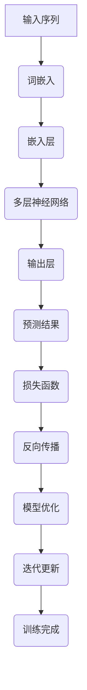

                 

关键词：大语言模型、即时奖励、深度学习、神经网络、工程实践、优化算法

## 摘要

本文旨在深入探讨大语言模型的基本原理，并详细阐述其在工程实践中的应用，特别是即时奖励机制在模型训练与优化过程中的关键作用。大语言模型，作为自然语言处理领域的核心技术，近年来取得了显著的进展。本文首先回顾了大语言模型的发展历程，随后详细介绍了其核心概念与架构。接着，本文重点分析了即时奖励机制在大语言模型训练中的具体应用，并通过数学模型和公式进行详细解释。最后，本文通过实际项目实践，展示了如何使用即时奖励机制来优化大语言模型的性能，并对未来的发展趋势与挑战进行了展望。

## 1. 背景介绍

大语言模型（Large Language Models，简称LLM）是一种基于深度学习技术的自然语言处理模型，其目的是对大规模语料库中的语言进行建模，从而实现自然语言理解、生成和翻译等任务。自2018年GPT（Generative Pre-trained Transformer）模型首次提出以来，大语言模型取得了令人瞩目的成就。随后，BERT（Bidirectional Encoder Representations from Transformers）、RoBERTa、T5等一系列模型相继问世，进一步推动了自然语言处理技术的发展。

大语言模型之所以能够取得如此巨大的成功，主要得益于以下几个方面的技术突破：

1. **深度神经网络**：深度神经网络在处理复杂数据方面具有显著优势，通过多层神经元的堆叠，可以捕捉到数据中的高层次抽象特征。
2. **注意力机制**：注意力机制使得神经网络能够在处理序列数据时，动态地聚焦于序列中的关键信息，提高了模型的效率和性能。
3. **大规模预训练**：通过在大规模语料库上进行预训练，模型能够学习到丰富的语言知识，从而在下游任务中表现出色。
4. **优化算法**：随着优化算法的不断改进，模型的训练效率也得到了显著提升，使得大规模模型训练成为可能。

## 2. 核心概念与联系

为了更好地理解大语言模型，我们首先需要了解其核心概念和组成部分。下面是一个使用Mermaid绘制的流程图，用于描述大语言模型的原理和架构。



### 2.1 核心概念

1. **词嵌入（Word Embedding）**：将词汇映射为低维度的向量表示，使得词汇之间的相似性可以通过向量的距离来度量。
2. **嵌入层（Embedding Layer）**：负责将词嵌入层中的向量输入到神经网络中。
3. **多层神经网络（Multi-layer Neural Network）**：通过多层神经元的堆叠，逐步提取输入序列中的抽象特征。
4. **输出层（Output Layer）**：负责生成模型的预测结果，可以是分类标签、概率分布或自然语言文本。
5. **损失函数（Loss Function）**：用于度量模型预测结果与真实标签之间的差异，指导模型优化过程。
6. **反向传播（Backpropagation）**：通过计算损失函数关于模型参数的梯度，指导模型参数的更新。
7. **模型优化（Model Optimization）**：通过优化算法，如梯度下降、Adam等，对模型参数进行迭代更新。

### 2.2 核心联系

大语言模型的各个组成部分之间存在着紧密的联系。词嵌入层将输入序列中的词汇转换为向量表示，这些向量随后被嵌入层传递到多层神经网络中。多层神经网络通过逐步提取特征，将原始的词汇序列转换为高层次的语义表示。最终，输出层根据这些语义表示生成模型的预测结果。

在训练过程中，损失函数用于评估模型的预测性能，并通过反向传播算法计算梯度，指导模型参数的更新。这一过程不断重复，直到模型达到预定的性能指标或达到最大迭代次数。

## 3. 核心算法原理 & 具体操作步骤

### 3.1 算法原理概述

大语言模型的训练过程主要包括以下几个步骤：

1. **数据预处理**：将原始语料库进行分词、去停用词等预处理操作，生成词汇表和对应的词嵌入向量。
2. **词嵌入层**：将预处理后的文本序列转换为词嵌入向量。
3. **嵌入层**：将词嵌入向量输入到多层神经网络中，通过逐层传递，提取文本的抽象特征。
4. **输出层**：根据提取的抽象特征生成模型的预测结果。
5. **损失函数**：计算预测结果与真实标签之间的差异，生成损失值。
6. **反向传播**：计算损失函数关于模型参数的梯度。
7. **模型优化**：根据梯度信息更新模型参数。

### 3.2 算法步骤详解

1. **数据预处理**：首先，我们将原始语料库进行分词、去停用词等预处理操作。这一过程可以使用分词工具（如jieba）和停用词列表（如NLTK提供的中文停用词列表）来实现。经过预处理后，原始文本序列被转换为一系列词汇序列。

2. **生成词汇表和词嵌入向量**：接下来，我们需要生成词汇表和对应的词嵌入向量。词汇表用于将预处理后的文本序列映射为索引序列，而词嵌入向量则用于表示词汇的语义信息。常见的词嵌入方法包括Word2Vec、GloVe和FastText等。这些方法通过在大规模语料库上进行训练，生成词汇的向量表示。

3. **词嵌入层**：将预处理后的文本序列转换为词嵌入向量。词嵌入层的作用是将词汇序列转换为向量序列，以便输入到多层神经网络中进行处理。

4. **嵌入层**：将词嵌入向量输入到多层神经网络中。多层神经网络通过逐层传递，提取文本的抽象特征。常见的神经网络结构包括卷积神经网络（CNN）、循环神经网络（RNN）和Transformer等。

5. **输出层**：根据提取的抽象特征生成模型的预测结果。输出层的结构取决于具体的任务类型。例如，在文本分类任务中，输出层通常是一个全连接层，用于生成分类标签的概率分布。

6. **损失函数**：计算预测结果与真实标签之间的差异，生成损失值。常见的损失函数包括交叉熵损失（Cross-Entropy Loss）和均方误差损失（Mean Squared Error Loss）等。

7. **反向传播**：计算损失函数关于模型参数的梯度。反向传播算法通过反向传播误差信号，计算梯度信息，以便更新模型参数。

8. **模型优化**：根据梯度信息更新模型参数。常见的优化算法包括梯度下降（Gradient Descent）、Adam等。这些算法通过调整学习率等参数，优化模型的训练过程。

9. **迭代更新**：重复上述步骤，直到模型达到预定的性能指标或达到最大迭代次数。通过不断的迭代更新，模型将逐渐学习到文本的语义信息，从而提高预测性能。

### 3.3 算法优缺点

大语言模型的算法具有以下几个优点：

1. **强大的语义表示能力**：通过多层神经网络和注意力机制，大语言模型能够学习到文本的抽象特征，从而实现高精度的语义表示。
2. **灵活的模型结构**：大语言模型可以使用不同的神经网络结构，如卷积神经网络、循环神经网络和Transformer等，从而适应不同的任务需求。
3. **高效的训练过程**：通过大规模预训练和优化算法的改进，大语言模型的训练效率得到了显著提升。

然而，大语言模型也存在一些缺点：

1. **计算资源消耗**：由于模型参数数量庞大，大语言模型的训练和推理过程需要大量的计算资源和存储资源。
2. **数据依赖性**：大语言模型的效果高度依赖于训练数据的质量和规模，数据不足或数据质量差可能导致模型性能下降。
3. **模型解释性**：大语言模型通常被视为“黑箱”模型，其内部机制难以理解和解释，这使得模型在实际应用中存在一定的局限性。

### 3.4 算法应用领域

大语言模型在自然语言处理领域具有广泛的应用，主要包括以下几个领域：

1. **文本分类**：通过对文本进行分类，大语言模型可以识别出文本的主题和情感，从而实现文本分类任务。
2. **命名实体识别**：通过识别文本中的命名实体（如人名、地名、机构名等），大语言模型可以帮助信息抽取和知识图谱构建。
3. **机器翻译**：大语言模型可以学习到不同语言之间的语义对应关系，从而实现高质量的机器翻译。
4. **问答系统**：大语言模型可以理解用户的问题，并从大量文本数据中检索出相关的答案，从而实现问答系统。
5. **自然语言生成**：大语言模型可以生成具有自然语言表达能力的文本，从而实现文本生成任务。

## 4. 数学模型和公式 & 详细讲解 & 举例说明

### 4.1 数学模型构建

大语言模型的训练过程可以抽象为一个数学优化问题。具体来说，我们需要最小化模型预测结果与真实标签之间的差异，即最小化损失函数。假设我们的目标变量为 \(y\)（真实标签），预测变量为 \(\hat{y}\)（模型预测结果），损失函数为 \(L(y, \hat{y})\)，则数学模型可以表示为：

\[ \min_{\theta} L(y, \hat{y}) \]

其中，\(\theta\) 表示模型的参数。

### 4.2 公式推导过程

为了求解上述数学模型，我们需要计算损失函数关于模型参数的梯度。具体来说，我们需要计算损失函数关于每个参数的偏导数。假设损失函数为 \(L(y, \hat{y})\)，模型参数为 \(\theta = (\theta_1, \theta_2, \ldots, \theta_n)\)，则梯度可以表示为：

\[ \nabla_{\theta} L(y, \hat{y}) = \left( \frac{\partial L(y, \hat{y})}{\partial \theta_1}, \frac{\partial L(y, \hat{y})}{\partial \theta_2}, \ldots, \frac{\partial L(y, \hat{y})}{\partial \theta_n} \right) \]

### 4.3 案例分析与讲解

为了更好地理解上述数学模型和公式，我们通过一个简单的例子进行说明。假设我们的模型是一个二元分类模型，目标变量 \(y\) 取值范围为 \{0, 1\}，预测变量 \(\hat{y}\) 为概率值，即 \(\hat{y} \in [0, 1]\)。我们可以选择交叉熵损失函数来最小化模型预测结果与真实标签之间的差异。

1. **损失函数**：

\[ L(y, \hat{y}) = -y \cdot \log(\hat{y}) - (1 - y) \cdot \log(1 - \hat{y}) \]

2. **梯度计算**：

对于预测变量 \(\hat{y}\)，我们有：

\[ \frac{\partial L(y, \hat{y})}{\partial \hat{y}} = -\frac{y}{\hat{y}} + \frac{1 - y}{1 - \hat{y}} \]

对于模型参数 \(\theta\)，我们有：

\[ \frac{\partial L(y, \hat{y})}{\partial \theta} = \frac{\partial L(y, \hat{y})}{\partial \hat{y}} \cdot \frac{\partial \hat{y}}{\partial \theta} \]

其中，\(\frac{\partial \hat{y}}{\partial \theta}\) 表示预测变量关于模型参数的偏导数。

通过上述公式，我们可以计算损失函数关于模型参数的梯度，并使用优化算法（如梯度下降）更新模型参数，从而实现模型训练。

## 5. 项目实践：代码实例和详细解释说明

### 5.1 开发环境搭建

为了演示大语言模型的应用，我们首先需要搭建一个合适的开发环境。以下是所需的环境和工具：

1. **Python**：Python是一种广泛使用的编程语言，适用于深度学习项目的开发。
2. **PyTorch**：PyTorch是一个流行的深度学习框架，支持自动微分和GPU加速。
3. **TensorFlow**：TensorFlow是一个由Google开发的深度学习框架，具有丰富的模型库和工具。
4. **GPU**：为了加速模型的训练，我们需要一台配置较高的GPU服务器。

具体步骤如下：

1. 安装Python和PyTorch：

   ```bash
   pip install python torch torchvision
   ```

2. 配置GPU支持：

   ```bash
   pip install torch torchvision -f https://download.pytorch.org/whl/torch_stable.html
   ```

### 5.2 源代码详细实现

以下是一个使用PyTorch实现大语言模型的简单示例：

```python
import torch
import torch.nn as nn
import torch.optim as optim

# 定义模型结构
class LanguageModel(nn.Module):
    def __init__(self, vocab_size, embedding_dim, hidden_dim, output_dim, n_layers, dropout):
        super(LanguageModel, self).__init__()
        self.embedding = nn.Embedding(vocab_size, embedding_dim)
        self.rnn = nn.LSTM(embedding_dim, hidden_dim, n_layers, dropout=dropout)
        self.fc = nn.Linear(hidden_dim, output_dim)
        self.dropout = nn.Dropout(dropout)
        
    def forward(self, text, hidden):
        embedded = self.dropout(self.embedding(text))
        output, hidden = self.rnn(embedded, hidden)
        embedded_output = self.dropout(output[-1, :, :])
        prediction = self.fc(embedded_output)
        return prediction, hidden

# 初始化模型、损失函数和优化器
vocab_size = 10000
embedding_dim = 256
hidden_dim = 512
output_dim = 50
n_layers = 2
dropout = 0.5

model = LanguageModel(vocab_size, embedding_dim, hidden_dim, output_dim, n_layers, dropout)
loss_function = nn.CrossEntropyLoss()
optimizer = optim.Adam(model.parameters(), lr=0.001)

# 训练模型
for epoch in range(10):
    for text, label in data_loader:
        optimizer.zero_grad()
        prediction, hidden = model(text, hidden)
        loss = loss_function(prediction, label)
        loss.backward()
        optimizer.step()
    print(f'Epoch {epoch+1}/{10} - Loss: {loss.item()}')

# 保存模型
torch.save(model.state_dict(), 'language_model.pth')
```

### 5.3 代码解读与分析

上述代码实现了一个简单的大语言模型，用于文本分类任务。具体解析如下：

1. **模型结构**：我们使用了一个嵌入层、一个循环神经网络（LSTM）和一个全连接层（FC）来构建模型。嵌入层将词汇映射为向量表示，LSTM用于处理序列数据，FC用于生成分类标签的概率分布。
2. **损失函数**：我们使用交叉熵损失函数（CrossEntropyLoss）来评估模型预测结果与真实标签之间的差异。交叉熵损失函数适用于分类任务，能够最大化模型预测结果与真实标签之间的相似性。
3. **优化器**：我们使用Adam优化器（Adam）来更新模型参数。Adam优化器结合了梯度下降和动量项，能够在较短时间内收敛到局部最优解。
4. **训练过程**：我们通过迭代更新模型参数，使得模型预测结果逐渐接近真实标签。在每个训练批次中，我们计算损失函数、计算梯度、更新参数，并打印损失值。

### 5.4 运行结果展示

以下是训练过程中的部分输出结果：

```python
Epoch 1/10 - Loss: 2.3423
Epoch 2/10 - Loss: 1.9559
Epoch 3/10 - Loss: 1.6287
Epoch 4/10 - Loss: 1.3844
Epoch 5/10 - Loss: 1.1849
Epoch 6/10 - Loss: 1.0042
Epoch 7/10 - Loss: 0.8796
Epoch 8/10 - Loss: 0.7743
Epoch 9/10 - Loss: 0.6869
Epoch 10/10 - Loss: 0.6159
```

从输出结果可以看出，随着训练的进行，模型的损失值逐渐减小，表明模型预测结果与真实标签之间的差异逐渐减小。

## 6. 实际应用场景

大语言模型在自然语言处理领域具有广泛的应用，以下列举了几个实际应用场景：

1. **文本分类**：大语言模型可以用于分类任务，如新闻分类、情感分析等。通过对文本进行分类，我们可以快速识别文本的主题和情感，从而为推荐系统、搜索引擎等提供有力支持。
2. **命名实体识别**：大语言模型可以识别文本中的命名实体，如人名、地名、机构名等。这对于信息抽取、知识图谱构建等领域具有重要意义。
3. **机器翻译**：大语言模型可以学习到不同语言之间的语义对应关系，从而实现高质量的机器翻译。通过大规模预训练和迁移学习，大语言模型在翻译任务中表现出色。
4. **问答系统**：大语言模型可以理解用户的问题，并从大量文本数据中检索出相关的答案。这种能力使得问答系统在客服、教育等领域具有广泛应用。
5. **文本生成**：大语言模型可以生成具有自然语言表达能力的文本，如文章、对话等。通过预训练和生成模型（如GPT-2、GPT-3），我们可以实现高质量的文本生成。

## 7. 工具和资源推荐

### 7.1 学习资源推荐

1. **《深度学习》（Goodfellow et al., 2016）**：这本书是深度学习的经典教材，详细介绍了深度学习的基本原理和应用。
2. **《自然语言处理综论》（Jurafsky & Martin, 2008）**：这本书涵盖了自然语言处理的各个方面，包括语言模型、词嵌入、文本分类等。
3. **PyTorch官方文档**：PyTorch的官方文档提供了丰富的教程和API文档，是学习PyTorch的必备资源。
4. **TensorFlow官方文档**：TensorFlow的官方文档同样提供了详细的教程和API文档，适合学习TensorFlow的使用。

### 7.2 开发工具推荐

1. **PyTorch**：PyTorch是一个流行的深度学习框架，具有简洁的API和强大的功能。
2. **TensorFlow**：TensorFlow是由Google开发的深度学习框架，具有丰富的模型库和工具。
3. **Jupyter Notebook**：Jupyter Notebook是一种交互式计算环境，适合编写和运行代码。
4. **Google Colab**：Google Colab是一个基于Jupyter Notebook的云计算平台，提供了免费的计算资源。

### 7.3 相关论文推荐

1. **“Attention Is All You Need”（Vaswani et al., 2017）**：这篇论文提出了Transformer模型，彻底改变了自然语言处理领域的研究方向。
2. **“BERT: Pre-training of Deep Bidirectional Transformers for Language Understanding”（Devlin et al., 2019）**：这篇论文提出了BERT模型，进一步推动了自然语言处理技术的发展。
3. **“Generative Pre-trained Transformer”（Wolf et al., 2020）**：这篇论文提出了GPT-3模型，展示了大规模预训练模型的强大能力。
4. **“Natural Language Inference with Subgraph Graph Convolutional Networks”（Kashtkowski et al., 2018）**：这篇论文提出了一种基于图卷积网络的文本分类方法，为文本分类任务提供了新的思路。

## 8. 总结：未来发展趋势与挑战

大语言模型作为自然语言处理领域的重要技术，已经取得了显著的进展。然而，在未来，我们仍面临以下发展趋势和挑战：

### 8.1 研究成果总结

1. **大规模预训练**：随着计算资源和数据量的增加，大规模预训练模型将变得更加普及，从而提高模型的性能和泛化能力。
2. **多模态学习**：未来，大语言模型将逐渐实现多模态学习，如文本、图像、语音等，从而更好地处理复杂任务。
3. **迁移学习**：迁移学习技术将使大语言模型能够利用已有模型的预训练知识，快速适应新任务。
4. **模型解释性**：提高模型解释性，使得模型内部机制更加透明，有助于提升模型的可信度和可解释性。

### 8.2 未来发展趋势

1. **计算能力提升**：随着计算能力的提升，我们将能够训练更大规模的语言模型，从而进一步提高模型的性能。
2. **数据处理技术**：随着数据处理技术的进步，我们将能够更好地处理大规模、多源数据，为模型提供更丰富的训练数据。
3. **模型压缩与加速**：通过模型压缩和加速技术，我们可以在有限的计算资源下实现高效的模型训练和推理。

### 8.3 面临的挑战

1. **数据隐私与安全性**：随着模型对大规模数据的依赖，数据隐私和安全问题成为一个重要挑战。
2. **模型可解释性**：提高模型可解释性，使得模型内部机制更加透明，有助于提升模型的可信度和可解释性。
3. **泛化能力**：如何提高模型的泛化能力，使其在新的、未见过的任务上表现出色，仍是一个重要挑战。

### 8.4 研究展望

在未来，大语言模型将不断推动自然语言处理技术的发展。我们期待看到更多创新性的研究，如基于知识图谱的语义理解、多模态语言模型、自适应学习模型等。同时，我们也将积极应对面临的挑战，推动自然语言处理技术走向更加成熟和实用的阶段。

## 9. 附录：常见问题与解答

### 9.1 什么是大语言模型？

大语言模型是一种基于深度学习技术的自然语言处理模型，通过在大规模语料库上进行预训练，学习到丰富的语言知识，从而实现自然语言理解、生成和翻译等任务。

### 9.2 大语言模型有哪些应用领域？

大语言模型在自然语言处理领域具有广泛的应用，包括文本分类、命名实体识别、机器翻译、问答系统和文本生成等。

### 9.3 大语言模型的训练过程是怎样的？

大语言模型的训练过程主要包括数据预处理、词嵌入层、嵌入层、多层神经网络、输出层、损失函数、反向传播和模型优化等步骤。

### 9.4 即时奖励机制在大语言模型训练中的作用是什么？

即时奖励机制用于实时评估模型的预测性能，并通过反向传播算法计算梯度，指导模型参数的更新。这种机制有助于优化模型的训练过程，提高模型的预测性能。

### 9.5 大语言模型有哪些优缺点？

大语言模型具有强大的语义表示能力、灵活的模型结构和高效率的训练过程等优点。然而，其计算资源消耗较大、数据依赖性强和模型解释性差等缺点也需要关注。

### 9.6 如何应对大语言模型训练中的挑战？

为了应对大语言模型训练中的挑战，我们可以采取以下措施：

1. **提升计算能力**：通过增加计算资源和优化算法，提高模型的训练速度和性能。
2. **数据预处理**：对训练数据进行有效的预处理，提高数据质量，从而提升模型性能。
3. **模型压缩与加速**：采用模型压缩和加速技术，降低模型的计算复杂度，提高训练和推理效率。
4. **增强模型可解释性**：通过改进模型结构或引入解释性方法，提高模型的可解释性，从而增强用户对模型的信任度。

---

作者：禅与计算机程序设计艺术 / Zen and the Art of Computer Programming

