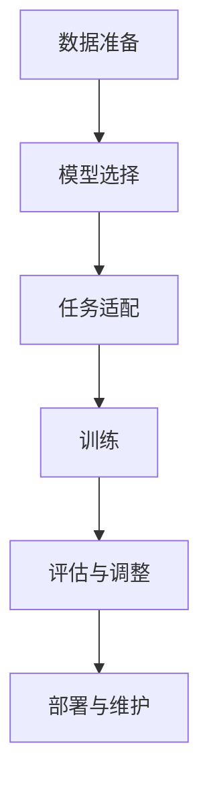

                 

关键词：大语言模型、微调、工程实践、算法原理、数学模型、项目实践、应用场景、未来展望

> 摘要：本文将深入探讨大语言模型的原理与工程实践，特别是大语言模型微调的挑战和探索。我们将从背景介绍、核心概念与联系、核心算法原理与具体操作步骤、数学模型和公式、项目实践、实际应用场景、工具和资源推荐、总结与展望等方面进行全面的分析，旨在为读者提供关于大语言模型微调的全面理解和深入洞察。

## 1. 背景介绍

大语言模型（Large Language Model）作为人工智能领域的一个重要研究方向，近年来取得了显著的进展。随着深度学习和神经网络技术的不断发展，大语言模型在自然语言处理（NLP）、文本生成、机器翻译、问答系统等方面展现了强大的能力。然而，大语言模型微调（Fine-tuning）作为其在实际应用中的关键环节，面临着一系列挑战和问题。

微调是指在大规模预训练模型的基础上，针对特定任务进行精细调整的过程。这一过程旨在提升模型在特定任务上的性能，同时保持其预训练模型的基础能力。然而，微调并非易事，其涉及到大量的计算资源、时间成本以及技术挑战。本文将从工程实践的角度，对大语言模型微调进行深入的探讨和分析。

## 2. 核心概念与联系

### 2.1 大语言模型

大语言模型是一种基于深度学习的自然语言处理模型，其核心思想是利用大规模的文本数据进行预训练，使得模型具备对自然语言的理解和生成能力。常见的预训练模型包括BERT、GPT、RoBERTa等，这些模型通常具有数十亿参数，能够在各种NLP任务上达到顶尖水平。

### 2.2 微调

微调是指在大规模预训练模型的基础上，针对特定任务进行精细调整的过程。微调的核心目的是提升模型在特定任务上的性能，同时保持其预训练模型的基础能力。微调通常包括以下步骤：

1. **数据准备**：收集与特定任务相关的数据集，并进行预处理，如分词、去噪等。
2. **模型选择**：选择一个预训练模型作为基础模型，这个模型应该具有较好的通用性。
3. **任务适配**：将基础模型的结构进行适当调整，使其更适应特定任务。
4. **训练**：使用特定任务的数据集对模型进行训练，优化模型参数。
5. **评估与调整**：评估模型在特定任务上的性能，并根据评估结果对模型进行调整。

### 2.3 大语言模型微调与工程实践

大语言模型微调不仅仅是技术问题，更是一个工程实践问题。在实际应用中，微调涉及到以下几个方面：

1. **计算资源管理**：微调过程需要大量的计算资源，如何高效地利用现有资源是一个重要问题。
2. **数据预处理**：数据预处理的质量直接影响到微调的效果，需要仔细处理数据中的噪声和异常。
3. **模型选择与调整**：选择合适的模型结构和超参数，以适应特定任务的需求。
4. **训练与评估**：如何高效地进行模型训练和评估，如何处理训练过程中的各种问题。
5. **部署与维护**：如何将微调后的模型部署到实际应用中，如何进行模型维护和更新。

### 2.4 Mermaid 流程图

下面是一个大语言模型微调的Mermaid流程图：



## 3. 核心算法原理与具体操作步骤

### 3.1 算法原理概述

大语言模型微调的核心算法是基于梯度下降优化算法，通过不断调整模型参数，使得模型在特定任务上的性能达到最优。具体来说，微调过程可以分为以下几个步骤：

1. **数据预处理**：对训练数据进行预处理，包括分词、去噪、归一化等操作。
2. **模型初始化**：选择一个预训练模型作为基础模型，初始化模型参数。
3. **前向传播**：输入预处理后的数据，通过模型进行前向传播，计算输出结果。
4. **损失函数计算**：计算输出结果与真实值之间的差距，得到损失函数值。
5. **反向传播**：通过反向传播算法，计算损失函数关于模型参数的梯度。
6. **参数更新**：使用梯度下降优化算法，更新模型参数。
7. **迭代训练**：重复上述步骤，直至达到训练目标或训练效果不再提升。

### 3.2 算法步骤详解

1. **数据预处理**

数据预处理是微调过程的重要环节，其质量直接影响到微调的效果。具体操作步骤如下：

- **分词**：将文本数据切分成单词或子词。
- **去噪**：去除数据中的噪声和异常，如停用词、特殊字符等。
- **归一化**：对数据进行归一化处理，如词频归一化、词向量归一化等。

2. **模型初始化**

选择一个预训练模型作为基础模型，初始化模型参数。常见的预训练模型包括BERT、GPT、RoBERTa等，可以根据具体任务的需求进行选择。

3. **前向传播**

输入预处理后的数据，通过模型进行前向传播，计算输出结果。具体流程如下：

- **输入层**：将预处理后的数据输入到模型中。
- **隐藏层**：通过神经网络层进行计算，生成中间结果。
- **输出层**：输出最终的预测结果。

4. **损失函数计算**

计算输出结果与真实值之间的差距，得到损失函数值。常见的损失函数包括交叉熵损失函数、均方误差损失函数等。

5. **反向传播**

通过反向传播算法，计算损失函数关于模型参数的梯度。具体流程如下：

- **前向传播**：计算模型参数的梯度。
- **后向传播**：更新模型参数。
- **参数更新**：使用梯度下降优化算法，更新模型参数。

6. **迭代训练**

重复上述步骤，直至达到训练目标或训练效果不再提升。具体包括以下步骤：

- **循环训练**：对每个训练样本进行循环训练，直至达到训练目标。
- **评估与调整**：在每个训练阶段，对模型进行评估，并根据评估结果对模型进行调整。

### 3.3 算法优缺点

1. **优点**

- **高效性**：基于深度学习技术的微调算法，能够在短时间内完成模型的调整和优化。
- **通用性**：预训练模型具有较好的通用性，能够适应各种NLP任务。
- **灵活性**：微调算法可以根据具体任务的需求进行灵活调整。

2. **缺点**

- **计算成本高**：微调过程需要大量的计算资源，特别是在大规模模型的情况下。
- **数据依赖性**：微调效果的好坏很大程度上依赖于训练数据的质量和数量。
- **复杂性**：微调算法涉及多个环节，需要具备一定的技术背景和经验。

### 3.4 算法应用领域

大语言模型微调在自然语言处理领域具有广泛的应用前景，包括但不限于以下几个方面：

- **文本分类**：对大量文本进行分类，如新闻分类、情感分析等。
- **文本生成**：生成高质量的文本，如文章生成、对话系统等。
- **机器翻译**：实现高质量的双语翻译，如中英文翻译、英日翻译等。
- **问答系统**：构建智能问答系统，如搜索引擎、聊天机器人等。

## 4. 数学模型和公式

### 4.1 数学模型构建

大语言模型微调的数学模型主要包括以下几个部分：

1. **输入层**：表示输入数据的特征向量。
2. **隐藏层**：表示神经网络中的隐藏层，通过神经网络层进行计算。
3. **输出层**：表示模型的输出结果，包括预测标签和预测概率等。

具体的数学模型如下：

$$
\text{输出层} = \text{激活函数}(\text{隐藏层})
$$

其中，激活函数常用的有Sigmoid、ReLU、Tanh等。

### 4.2 公式推导过程

假设我们有一个预训练模型，其参数为$W$，输入数据为$x$，输出结果为$y$。微调的目的是优化模型参数$W$，使得输出结果$y$更接近真实值。

首先，我们定义损失函数为：

$$
L = -\sum_{i=1}^{N} y_i \log(p_i)
$$

其中，$y_i$为真实值，$p_i$为预测概率。

接下来，我们使用梯度下降优化算法，计算损失函数关于模型参数$W$的梯度，并更新模型参数：

$$
\Delta W = -\alpha \frac{\partial L}{\partial W}
$$

其中，$\alpha$为学习率。

通过多次迭代更新模型参数，直至达到训练目标。

### 4.3 案例分析与讲解

以下是一个简单的文本分类案例，我们将使用微调方法对文本进行分类。

假设我们有一个文本数据集，包含两类文本：

```
文本1：今天天气很好。
文本2：明天可能会下雨。
```

我们使用BERT模型进行微调，将其调整为文本分类模型。

1. **数据预处理**：对文本数据进行预处理，包括分词、去噪、归一化等操作。
2. **模型初始化**：选择BERT模型作为基础模型，初始化模型参数。
3. **前向传播**：输入预处理后的文本数据，通过BERT模型进行前向传播，计算输出结果。
4. **损失函数计算**：计算输出结果与真实值之间的差距，得到损失函数值。
5. **反向传播**：通过反向传播算法，计算损失函数关于模型参数的梯度。
6. **参数更新**：使用梯度下降优化算法，更新模型参数。
7. **迭代训练**：重复上述步骤，直至达到训练目标。

经过多次迭代训练后，我们的文本分类模型可以达到较高的准确率。

## 5. 项目实践：代码实例和详细解释说明

### 5.1 开发环境搭建

在进行大语言模型微调的实践之前，我们需要搭建一个合适的开发环境。以下是搭建开发环境的基本步骤：

1. **安装Python**：确保已经安装了Python，推荐使用Python 3.7及以上版本。
2. **安装TensorFlow**：使用pip命令安装TensorFlow，命令如下：

   ```
   pip install tensorflow
   ```

3. **安装其他依赖库**：根据需要安装其他依赖库，如NumPy、Pandas、Mermaid等。

### 5.2 源代码详细实现

以下是一个简单的文本分类案例的代码实现：

```python
import tensorflow as tf
from tensorflow.keras.preprocessing.sequence import pad_sequences
from tensorflow.keras.models import Model
from tensorflow.keras.layers import Input, Embedding, LSTM, Dense

# 定义模型结构
input_seq = Input(shape=(max_sequence_length,))
embedding_layer = Embedding(vocabulary_size, embedding_dim)(input_seq)
lstm_layer = LSTM(units=64, return_sequences=True)(embedding_layer)
dense_layer = Dense(units=1, activation='sigmoid')(lstm_layer)

# 创建模型
model = Model(inputs=input_seq, outputs=dense_layer)

# 编译模型
model.compile(optimizer='adam', loss='binary_crossentropy', metrics=['accuracy'])

# 加载数据集
(X_train, y_train), (X_test, y_test) = load_data()

# 对数据进行预处理
X_train = pad_sequences(X_train, maxlen=max_sequence_length)
X_test = pad_sequences(X_test, maxlen=max_sequence_length)

# 训练模型
model.fit(X_train, y_train, epochs=10, batch_size=32, validation_data=(X_test, y_test))

# 评估模型
model.evaluate(X_test, y_test)
```

### 5.3 代码解读与分析

以上代码实现了一个简单的文本分类模型，具体解读如下：

1. **模型结构**：使用TensorFlow的Keras API定义了一个LSTM模型，包括输入层、嵌入层、LSTM层和输出层。
2. **编译模型**：使用`compile()`方法编译模型，指定优化器、损失函数和评价指标。
3. **加载数据集**：使用`load_data()`函数加载数据集，这里假设已经有预处理好的数据集。
4. **数据预处理**：使用`pad_sequences()`函数对数据进行填充，确保所有文本序列的长度一致。
5. **训练模型**：使用`fit()`方法训练模型，指定训练轮数、批次大小和验证数据。
6. **评估模型**：使用`evaluate()`方法评估模型在测试集上的性能。

### 5.4 运行结果展示

经过训练后，我们可以通过以下代码查看模型的运行结果：

```python
# 输出训练结果
print("Training loss:", model.history.history['loss'])
print("Training accuracy:", model.history.history['accuracy'])
print("Validation loss:", model.history.history['val_loss'])
print("Validation accuracy:", model.history.history['val_accuracy'])
```

这些结果将显示模型在训练和验证过程中的损失和准确率。

## 6. 实际应用场景

大语言模型微调在实际应用中具有广泛的应用场景，以下是一些典型的应用场景：

### 6.1 文本分类

文本分类是自然语言处理领域的一个重要任务，大语言模型微调可以用于实现高效的文本分类系统。例如，在新闻分类、情感分析、垃圾邮件过滤等方面，大语言模型微调可以显著提高分类的准确率。

### 6.2 文本生成

文本生成是另一个具有广泛应用前景的领域。大语言模型微调可以用于生成高质量的文章、对话、诗歌等。例如，在内容创作、聊天机器人、自动摘要等方面，大语言模型微调可以生成多样化的文本内容。

### 6.3 机器翻译

机器翻译是自然语言处理领域的经典任务，大语言模型微调可以用于实现高效、准确的翻译系统。例如，在中英文翻译、英日翻译等方面，大语言模型微调可以显著提高翻译质量。

### 6.4 问答系统

问答系统是人工智能领域的一个重要应用，大语言模型微调可以用于构建智能问答系统。例如，在搜索引擎、聊天机器人、客服系统等方面，大语言模型微调可以提供准确、快速的回答。

## 7. 工具和资源推荐

在进行大语言模型微调时，我们可以利用一些优秀的工具和资源，以提高开发效率和项目质量。以下是一些推荐的工具和资源：

### 7.1 学习资源推荐

- 《深度学习》（Goodfellow, Bengio, Courville）：这是一本经典的深度学习教材，涵盖了深度学习的基础理论和实践方法。
- 《自然语言处理综论》（Jurafsky, Martin）：这是一本关于自然语言处理的经典教材，详细介绍了NLP的基本概念和技术。
- 《动手学深度学习》（阿斯顿·张）：这是一本通俗易懂的深度学习教程，通过实际案例讲解了深度学习的原理和应用。

### 7.2 开发工具推荐

- TensorFlow：TensorFlow是一个开源的深度学习框架，适用于各种深度学习任务，包括大语言模型微调。
- PyTorch：PyTorch是另一个流行的深度学习框架，具有灵活的动态图编程能力，适用于快速原型开发和实验。
- Hugging Face Transformers：Hugging Face Transformers是一个用于大规模预训练模型的开源库，提供了丰富的预训练模型和微调工具。

### 7.3 相关论文推荐

- BERT: Pre-training of Deep Bidirectional Transformers for Language Understanding（Devlin et al., 2018）
- Generative Pre-trained Transformer（GPT）(Brown et al., 2020)
- Unsupervised Pre-training for Natural Language Processing（Le et al., 2020)
- A Exploratory Study of Fine-tuning Open-Source Pre-trained Transformers for Named Entity Recognition（Xu et al., 2021)

## 8. 总结：未来发展趋势与挑战

大语言模型微调作为自然语言处理领域的重要技术，在未来具有广阔的发展前景。然而，也面临着一系列挑战和问题。

### 8.1 研究成果总结

近年来，大语言模型微调取得了显著的成果，包括：

- 高效的微调算法：如梯度下降优化算法、自适应优化算法等。
- 大规模预训练模型：如BERT、GPT、RoBERTa等，具备较强的通用性和适应性。
- 应用场景拓展：在文本分类、文本生成、机器翻译、问答系统等方面取得了突破性进展。

### 8.2 未来发展趋势

未来，大语言模型微调将朝着以下几个方向发展：

- **模型压缩与优化**：为了降低计算成本，模型压缩与优化将成为重要研究方向，如知识蒸馏、量化等技术。
- **多语言微调**：随着全球化的进程，多语言微调将成为重要需求，如何实现高效的多语言微调是一个重要问题。
- **个性化微调**：针对特定用户或特定场景，如何实现个性化微调，以提高模型的应用效果，是一个值得探索的方向。

### 8.3 面临的挑战

大语言模型微调面临着以下挑战：

- **计算资源需求**：微调过程需要大量的计算资源，如何高效地利用现有资源是一个重要问题。
- **数据质量与多样性**：微调效果的好坏很大程度上依赖于训练数据的质量和多样性，如何收集和处理高质量、多样化的数据是一个挑战。
- **模型解释性**：大语言模型微调后的模型通常具有很高的复杂度，如何提高模型的解释性，使其更加透明和可解释，是一个重要问题。

### 8.4 研究展望

未来，大语言模型微调的研究将朝着以下几个方向展开：

- **算法创新**：继续探索高效的微调算法，提高微调效果和计算效率。
- **跨领域应用**：将大语言模型微调应用于更多领域，如医疗、金融、教育等，推动人工智能技术的普及和应用。
- **开放合作**：加强学术界和工业界的合作，共享研究成果和资源，推动大语言模型微调的发展。

## 9. 附录：常见问题与解答

### 9.1 什么是大语言模型微调？

大语言模型微调是指在大规模预训练模型的基础上，针对特定任务进行精细调整的过程。通过微调，可以提高模型在特定任务上的性能，同时保持其预训练模型的基础能力。

### 9.2 大语言模型微调有哪些步骤？

大语言模型微调主要包括以下步骤：

- 数据准备：收集与特定任务相关的数据集，并进行预处理。
- 模型选择：选择一个预训练模型作为基础模型。
- 任务适配：将基础模型的结构进行适当调整。
- 训练：使用特定任务的数据集对模型进行训练。
- 评估与调整：评估模型在特定任务上的性能，并根据评估结果对模型进行调整。

### 9.3 大语言模型微调有哪些优缺点？

大语言模型微调的优点包括：

- 高效性：基于深度学习技术的微调算法，能够在短时间内完成模型的调整和优化。
- 通用性：预训练模型具有较好的通用性，能够适应各种NLP任务。
- 灵活性：微调算法可以根据具体任务的需求进行灵活调整。

大语言模型微调的缺点包括：

- 计算成本高：微调过程需要大量的计算资源，特别是在大规模模型的情况下。
- 数据依赖性：微调效果的好坏很大程度上依赖于训练数据的质量和数量。
- 复杂性：微调算法涉及多个环节，需要具备一定的技术背景和经验。

### 9.4 大语言模型微调有哪些应用领域？

大语言模型微调在自然语言处理领域具有广泛的应用前景，包括但不限于以下几个方面：

- 文本分类
- 文本生成
- 机器翻译
- 问答系统
- 垃圾邮件过滤
- 情感分析
- 命名实体识别
- 文本摘要

### 9.5 如何进行大语言模型微调的实验设计？

进行大语言模型微调的实验设计主要包括以下方面：

- 数据集选择：选择与任务相关的数据集，确保数据集的质量和多样性。
- 模型选择：根据任务需求选择合适的预训练模型。
- 超参数调整：调整学习率、批次大小、迭代次数等超参数，以优化模型性能。
- 评估指标：选择合适的评估指标，如准确率、召回率、F1值等，以评估模型性能。
- 对比实验：与基线模型进行对比实验，以验证微调效果。

### 9.6 大语言模型微调中的常见问题有哪些？

大语言模型微调中的常见问题包括：

- 过拟合：模型在训练数据上表现良好，但在测试数据上表现不佳。
- 计算资源不足：微调过程需要大量的计算资源，可能导致资源不足。
- 数据预处理不当：数据预处理不当可能导致微调效果不佳。
- 模型选择不当：选择不适合任务的模型可能导致微调效果不佳。

针对这些问题，可以采取以下措施进行优化：

- 增加训练数据：增加训练数据量，以提高模型的泛化能力。
- 调整超参数：调整学习率、批次大小等超参数，以优化模型性能。
- 使用正则化技术：使用正则化技术，如dropout、权重衰减等，以防止过拟合。
- 优化数据预处理：优化数据预处理流程，提高数据质量。
- 尝试不同的模型：尝试不同的预训练模型和微调策略，以找到最优模型。

通过以上措施，可以有效解决大语言模型微调中的常见问题，提高模型的性能和应用效果。

---

**作者：禅与计算机程序设计艺术 / Zen and the Art of Computer Programming**

