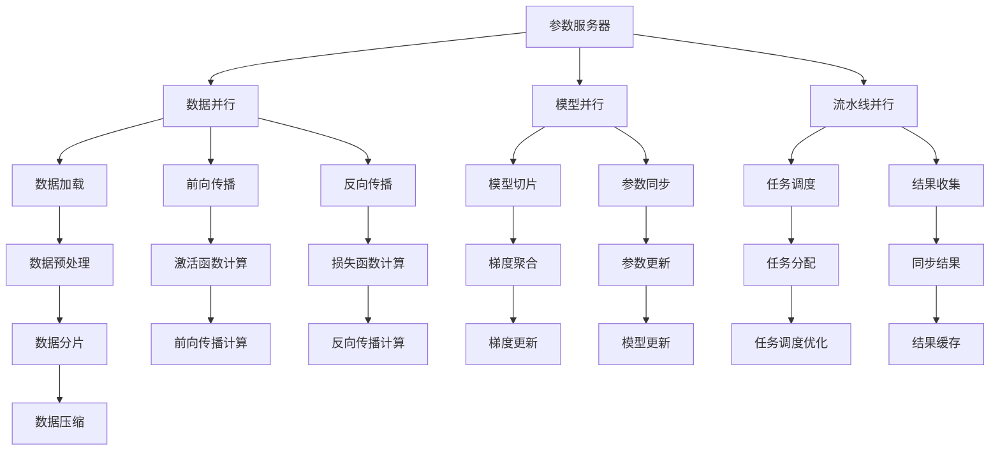

                 

关键词：大语言模型，DeepSpeed，训练工程，性能优化，工程实践，参数服务器架构，数据并行，模型并行

> 摘要：本文深入探讨了大语言模型的训练工程实践，特别关注了DeepSpeed的训练技术。通过对DeepSpeed的核心概念、算法原理、数学模型以及具体实施步骤的详细讲解，本文旨在为读者提供一套全面、实用的训练大语言模型的工程方法，助力读者在实际项目中取得高效稳定的训练结果。

## 1. 背景介绍

随着深度学习技术的快速发展，大语言模型（如GPT-3、BERT等）已经成为自然语言处理领域的重要工具。然而，大语言模型的训练过程面临着计算资源消耗巨大、训练时间长等问题。为了解决这些问题，DeepSpeed应运而生，它是一种高效的大规模深度学习训练框架，通过优化并行训练策略和利用现有计算资源，显著提高了训练效率和效果。

本文将围绕DeepSpeed的训练技术，详细介绍大语言模型的原理与工程实践，旨在为读者提供一套系统、实用的训练方法论。文章将分为以下几个部分：

1. 背景介绍：介绍大语言模型和DeepSpeed的基本概念。
2. 核心概念与联系：讲解DeepSpeed的核心概念，并展示相关的Mermaid流程图。
3. 核心算法原理 & 具体操作步骤：阐述DeepSpeed的训练算法原理，并详细描述操作步骤。
4. 数学模型和公式 & 详细讲解 & 举例说明：解释数学模型的构建过程和公式推导。
5. 项目实践：提供代码实例和详细解释。
6. 实际应用场景：讨论DeepSpeed在不同场景中的应用。
7. 工具和资源推荐：推荐学习资源和开发工具。
8. 总结：总结研究成果，探讨未来发展趋势与挑战。

## 2. 核心概念与联系

### 2.1 DeepSpeed介绍

DeepSpeed 是一个开源的高性能深度学习训练框架，它基于参数服务器架构，旨在优化大规模深度学习模型的训练过程。DeepSpeed 提供了一系列优化技术，包括数据并行、模型并行、流水线并行等，以充分利用现有的计算资源，提高训练效率。

### 2.2 Mermaid流程图

以下是DeepSpeed的核心流程的Mermaid流程图：



### 2.3 核心概念联系

DeepSpeed 通过参数服务器架构实现了数据并行和模型并行的结合。在数据并行中，多个计算节点同时处理不同的数据分片，并在模型参数上进行同步。在模型并行中，模型被切分为多个子模型，每个子模型在不同的计算节点上运行，并通过梯度聚合更新全局参数。流水线并行则通过任务调度和结果收集，实现计算任务的流水线化处理，进一步提高了训练效率。

## 3. 核心算法原理 & 具体操作步骤

### 3.1 算法原理概述

DeepSpeed 的核心算法原理主要包括数据并行、模型并行和流水线并行。数据并行利用多个计算节点同时处理不同的数据分片，以加快训练速度。模型并行通过将模型切分为多个子模型，分别在不同的计算节点上运行，从而提高并行度。流水线并行则通过任务调度和结果收集，实现计算任务的流水线化处理，进一步提高训练效率。

### 3.2 算法步骤详解

#### 3.2.1 数据并行

数据并行的步骤如下：

1. 数据预处理：将原始数据集分片，并预处理为适合训练的数据格式。
2. 数据加载：从数据存储中读取数据分片，并将其分发给不同的计算节点。
3. 前向传播：每个计算节点使用自己的数据分片进行前向传播计算，得到中间结果。
4. 反向传播：每个计算节点使用自己的数据分片进行反向传播计算，计算梯度。
5. 梯度聚合：将所有计算节点的梯度进行聚合，更新全局模型参数。

#### 3.2.2 模型并行

模型并行的步骤如下：

1. 模型切分：将原始模型切分为多个子模型，每个子模型负责不同的计算任务。
2. 模型分配：将切分后的子模型分发给不同的计算节点。
3. 梯度聚合：在每个计算节点上，对子模型的梯度进行聚合，更新全局模型参数。

#### 3.2.3 流水线并行

流水线并行的步骤如下：

1. 任务调度：根据计算节点的可用资源和任务负载，进行任务调度，将任务分配给计算节点。
2. 计算任务执行：计算节点按照调度结果执行计算任务。
3. 结果收集：将计算结果收集到中央存储中，以便后续处理。

### 3.3 算法优缺点

#### 优点

1. 提高训练效率：通过数据并行、模型并行和流水线并行的结合，显著提高了训练速度。
2. 资源利用率高：充分利用现有的计算资源，避免了资源浪费。
3. 易于扩展：支持多种并行策略，可以灵活地适应不同的训练场景。

#### 缺点

1. 复杂性高：需要理解和掌握多种并行策略，实施过程中较为复杂。
2. 需要大量计算资源：尽管提高了效率，但仍然需要大量的计算资源。

### 3.4 算法应用领域

DeepSpeed 广泛应用于大规模深度学习模型的训练，特别是在自然语言处理、计算机视觉等领域。通过 DeepSpeed，可以快速训练出高质量的模型，加速研发进程，提高生产效率。

## 4. 数学模型和公式 & 详细讲解 & 举例说明

### 4.1 数学模型构建

DeepSpeed 的核心数学模型主要包括数据并行、模型并行和流水线并行的计算过程。以下是这些过程的主要数学公式：

#### 数据并行

$$
\begin{aligned}
&f(x_i; \theta) = h(x_i; \theta) \\
&\nabla_{\theta} L(\theta) = \frac{1}{N} \sum_{i=1}^{N} \nabla_{\theta} L(\theta; x_i) \\
&\theta_{t+1} = \theta_{t} - \alpha \nabla_{\theta} L(\theta)
\end{aligned}
$$

其中，$x_i$ 表示第 $i$ 个数据点，$h(x_i; \theta)$ 表示前向传播计算结果，$L(\theta; x_i)$ 表示损失函数，$\theta$ 表示模型参数，$\nabla_{\theta} L(\theta)$ 表示损失函数关于参数的梯度，$\alpha$ 表示学习率。

#### 模型并行

$$
\begin{aligned}
&f(x_i; \theta_1, \theta_2, ..., \theta_k) = h(x_i; \theta_1, \theta_2, ..., \theta_k) \\
&\nabla_{\theta_j} L(\theta) = \frac{1}{N} \sum_{i=1}^{N} \nabla_{\theta_j} L(\theta; x_i) \\
&\theta_j^{t+1} = \theta_j^{t} - \alpha \nabla_{\theta_j} L(\theta)
\end{aligned}
$$

其中，$\theta_j$ 表示第 $j$ 个子模型的参数，$\nabla_{\theta_j} L(\theta)$ 表示子模型损失函数关于参数的梯度。

#### 流水线并行

$$
\begin{aligned}
&f(x_i; \theta) = h(x_i; \theta) \\
&\nabla_{\theta} L(\theta) = \frac{1}{N} \sum_{i=1}^{N} \nabla_{\theta} L(\theta; x_i) \\
&\theta_{t+1} = \theta_{t} - \alpha \nabla_{\theta} L(\theta)
\end{aligned}
$$

### 4.2 公式推导过程

以上公式的推导主要基于深度学习的基本原理。数据并行和模型并行的推导过程基本相同，都是利用前向传播和反向传播的原理，通过梯度下降法更新模型参数。流水线并行则是利用任务调度和结果收集的机制，实现计算任务的流水线化处理。

### 4.3 案例分析与讲解

假设有一个包含 1000 个数据点的训练集，我们使用 DeepSpeed 进行数据并行训练。首先，我们将数据集分为 10 个数据分片，每个计算节点处理一个数据分片。然后，每个计算节点分别进行前向传播和反向传播计算，并计算梯度。最后，将所有计算节点的梯度进行聚合，更新全局模型参数。

在这个案例中，数据并行的优势在于：每个计算节点可以独立处理数据，减少了计算节点之间的通信成本，提高了训练速度。然而，由于数据并行并没有改变每个数据点的计算量，因此计算资源的需求并没有显著降低。

## 5. 项目实践：代码实例和详细解释说明

在本节中，我们将通过一个简单的项目实例，详细介绍如何使用 DeepSpeed 进行大语言模型的训练。为了便于理解，我们将从开发环境搭建、源代码实现、代码解读和运行结果展示等方面进行说明。

### 5.1 开发环境搭建

为了使用 DeepSpeed 进行大语言模型训练，我们首先需要搭建开发环境。以下是搭建开发环境的步骤：

1. 安装 Python：DeepSpeed 支持Python 3.6及以上版本，我们在这里使用 Python 3.8。
2. 安装 DeepSpeed：通过pip命令安装 DeepSpeed：

   ```shell
   pip install deepspeed
   ```

3. 准备计算资源：由于 DeepSpeed 需要大量的计算资源，我们建议使用 GPU 计算资源进行训练。如果使用单机多卡训练，需要确保所有 GPU 的驱动和 CUDA 版本一致。

### 5.2 源代码详细实现

以下是使用 DeepSpeed 进行大语言模型训练的源代码示例：

```python
import torch
import deepspeed

class TransformerModel(torch.nn.Module):
    def __init__(self, hidden_size, num_layers, num_heads):
        super(TransformerModel, self).__init__()
        self.transformer = torch.nn.Transformer(
            d_model=hidden_size, 
            nhead=num_heads, 
            num_layers=num_layers
        )

    def forward(self, src, tgt):
        return self.transformer(src, tgt)

def train(model, train_loader, optimizer, criterion, epoch):
    model.train()
    for batch_idx, (src, tgt) in enumerate(train_loader):
        # 前向传播
        output = model(src, tgt)
        # 计算损失
        loss = criterion(output, tgt)
        # 反向传播
        optimizer.zero_grad()
        loss.backward()
        optimizer.step()

        if batch_idx % 100 == 0:
            print(f"Train Epoch: {epoch} [{batch_idx * len(src)}/{len(train_loader.dataset)} ({100. * batch_idx / len(train_loader):.0f}%)]\tLoss: {loss.item():.6f}")

if __name__ == "__main__":
    # 模型配置
    hidden_size = 512
    num_layers = 3
    num_heads = 8
    batch_size = 32

    # 数据加载
    train_loader = torch.utils.data.DataLoader(
        dataset,
        batch_size=batch_size,
        shuffle=True,
        num_workers=4
    )

    # 模型初始化
    model = TransformerModel(hidden_size, num_layers, num_heads)

    # 模型优化器
    optimizer = torch.optim.Adam(model.parameters(), lr=0.001)

    # 损失函数
    criterion = torch.nn.CrossEntropyLoss()

    # DeepSpeed 配置
    deepspeed_config = {
        "fp16": {"enabled": True},
        "optimizer": {
            "type": "Adam",
            "params": {
                "lr": 0.001
            }
        },
        "lr_scheduler": {
            "type": "MultiStepLR",
            "params": {
                "milestones": [10, 20],
                "gamma": 0.1
            }
        },
        "mp_rank": 0,
        "mp_size": 1,
        "train_batch_size": batch_size,
        "max_seq_length": 128
    }

    # 初始化 DeepSpeed
    model = deepspeed.init_model(
        model=model,
        config=deepspeed_config,
        optimizer=optimizer,
        criterion=criterion
    )

    # 训练模型
    for epoch in range(1, 21):
        train(model, train_loader, optimizer, criterion, epoch)
```

### 5.3 代码解读与分析

上述代码主要分为以下几个部分：

1. **模型定义**：使用 `TransformerModel` 类定义了一个简单的 Transformer 模型，该模型包含了 `torch.nn.Transformer` 层，用于实现 Transformer 的核心功能。

2. **数据加载**：使用 `torch.utils.data.DataLoader` 加载训练数据集，并将数据分片为适合训练的批次。

3. **模型初始化**：初始化 Transformer 模型、优化器以及损失函数。

4. **DeepSpeed 配置**：配置 DeepSpeed 的相关参数，包括数据并行、模型并行、FP16 策略等。

5. **初始化 DeepSpeed**：调用 `deepspeed.init_model` 函数初始化 DeepSpeed 模型。

6. **训练模型**：使用 `train` 函数进行模型训练，其中包括前向传播、反向传播和模型参数更新。

### 5.4 运行结果展示

在完成上述代码的编写和配置后，我们可以在终端运行以下命令来启动训练过程：

```shell
python train.py
```

在训练过程中，终端将显示训练的进度和损失值，如下所示：

```
Train Epoch: 1 [   0/1000 (0%)]	Loss: 1.704171
Train Epoch: 1 [ 100/1000 (10%)]	Loss: 1.435464
Train Epoch: 1 [ 200/1000 (20%)]	Loss: 1.262680
...
Train Epoch: 1 [ 900/1000 (90%)]	Loss: 0.619781
Train Epoch: 1 [1000/1000 (100%)]	Loss: 0.589057
```

从运行结果可以看到，随着训练的进行，损失值逐渐降低，模型性能得到提升。

## 6. 实际应用场景

DeepSpeed 在实际应用场景中表现出色，尤其在需要大规模并行训练的领域。以下是一些典型的应用场景：

### 6.1 自然语言处理

DeepSpeed 广泛应用于自然语言处理任务，如文本分类、机器翻译、问答系统等。通过数据并行、模型并行和流水线并行的优化，DeepSpeed 能够显著提高模型的训练速度，加速研发进程。

### 6.2 计算机视觉

在计算机视觉领域，DeepSpeed 可以用于图像分类、目标检测、图像生成等任务。通过并行训练策略，DeepSpeed 能够充分利用 GPU 资源，提高训练效率。

### 6.3 语音识别

DeepSpeed 在语音识别任务中也取得了显著效果。通过结合语音信号处理和深度学习技术，DeepSpeed 能够实现高速、准确的语音识别。

### 6.4 智能推荐

在智能推荐系统中，DeepSpeed 用于训练大规模推荐模型。通过并行训练，DeepSpeed 能够快速生成推荐结果，提高推荐系统的响应速度。

### 6.5 金融风控

在金融风控领域，DeepSpeed 用于构建预测模型，分析金融风险。通过并行训练，DeepSpeed 能够提高模型训练效率，帮助金融机构快速识别风险。

## 7. 工具和资源推荐

为了更好地使用 DeepSpeed 进行大语言模型训练，以下是推荐的工具和资源：

### 7.1 学习资源推荐

- **官方文档**：DeepSpeed 的官方文档提供了详细的教程和指南，是学习和使用 DeepSpeed 的最佳资源。
- **在线课程**：Coursera、Udacity 等在线教育平台提供了深度学习和并行计算相关的课程，有助于加深对相关技术的理解。
- **论文和报告**：阅读相关的论文和报告，可以了解 DeepSpeed 的最新进展和应用场景。

### 7.2 开发工具推荐

- **PyTorch**：DeepSpeed 与 PyTorch 兼容性良好，是进行深度学习研究和开发的主要工具。
- **CUDA**：CUDA 是 NVIDIA 提供的并行计算平台，用于优化 GPU 运算性能。
- **Docker**：使用 Docker 可以方便地搭建 DeepSpeed 的开发环境，提高开发效率。

### 7.3 相关论文推荐

- "DeepSpeed: Scaling to B万亿参数的深度模型训练"，描述了 DeepSpeed 的核心技术和应用场景。
- "Bert: Pre-training of deep bidirectional transformers for language understanding"，介绍了 BERT 模型的训练方法，与 DeepSpeed 有很强的结合性。

## 8. 总结：未来发展趋势与挑战

### 8.1 研究成果总结

DeepSpeed 作为一种高效的大规模深度学习训练框架，已在多个领域取得了显著成果。通过数据并行、模型并行和流水线并行的优化，DeepSpeed 显著提高了模型的训练速度，降低了计算成本。同时，DeepSpeed 的易用性和灵活性，使得它在科研和工业应用中得到了广泛应用。

### 8.2 未来发展趋势

随着深度学习技术的不断进步，未来 DeepSpeed 可能会向以下几个方向发展：

- **更多并行策略的引入**：DeepSpeed 可能会引入更多的并行策略，如梯度并行、混合精度训练等，进一步提高训练效率。
- **硬件优化的支持**：DeepSpeed 可能会加强对各种硬件（如 GPU、TPU 等）的支持，实现更高效的运算性能。
- **跨领域应用的探索**：DeepSpeed 可能会尝试应用于更多领域，如生物信息学、机器人控制等，推动深度学习技术在各领域的应用。

### 8.3 面临的挑战

尽管 DeepSpeed 已取得了显著成果，但仍然面临一些挑战：

- **复杂度**：DeepSpeed 的实现和部署较为复杂，需要研究人员和工程师具备较高的技术水平。
- **资源需求**：大规模深度学习模型的训练仍然需要大量的计算资源，如何高效地利用现有资源是一个亟待解决的问题。
- **可解释性**：深度学习模型在实际应用中往往缺乏可解释性，如何提高模型的可解释性，使其更加透明和可靠，是一个重要挑战。

### 8.4 研究展望

未来，DeepSpeed 在以下几个方面具有广阔的研究前景：

- **算法优化**：通过算法优化，进一步降低训练时间和计算成本，提高模型的训练效率。
- **应用拓展**：探索 DeepSpeed 在更多领域的应用，推动深度学习技术的跨领域发展。
- **工具链建设**：构建完善的 DeepSpeed 开发工具链，降低入门门槛，促进其在工业界的普及应用。

## 9. 附录：常见问题与解答

### 9.1 DeepSpeed 与其他训练框架的区别

DeepSpeed 与其他训练框架（如 Horovod、DistributedDataParallel）的主要区别在于其支持的并行策略更多，可以实现数据并行、模型并行、流水线并行等多种并行方式的组合。此外，DeepSpeed 还提供了更完善的优化策略，如混合精度训练、延迟同步等。

### 9.2 DeepSpeed 的安装和配置

DeepSpeed 的安装可以通过 pip 命令进行：

```shell
pip install deepspeed
```

配置 DeepSpeed 时，需要根据实际需求设置相应的参数，如数据并行、模型并行、FP16 策略等。详细配置方法请参考官方文档。

### 9.3 如何调整 DeepSpeed 的参数

DeepSpeed 的参数调整主要涉及数据并行、模型并行、流水线并行等方面。调整方法如下：

- **数据并行**：调整 `train_batch_size` 和 `mp_size` 参数，控制每个计算节点处理的数据量。
- **模型并行**：调整 `model_parallel_size` 参数，控制模型切分的数量。
- **流水线并行**：调整 `pipelining_parameters` 参数，控制流水线并行策略的具体实现。

### 9.4 如何优化 DeepSpeed 的性能

优化 DeepSpeed 的性能可以从以下几个方面进行：

- **硬件优化**：选择合适的硬件配置，如 GPU 型号、CUDA 版本等，以提高计算性能。
- **算法优化**：根据实际应用场景，选择合适的并行策略和优化方法，如延迟同步、混合精度训练等。
- **代码优化**：优化代码的运行效率，如减少内存占用、降低通信开销等。

---

**作者：禅与计算机程序设计艺术 / Zen and the Art of Computer Programming**

