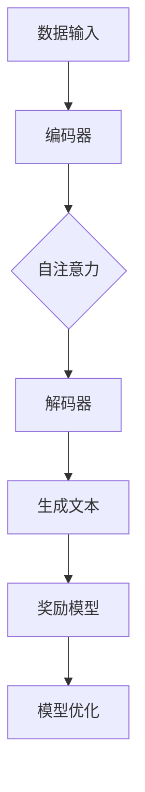

                 

关键词：大语言模型、奖励模型、结构、工程实践

> 摘要：本文旨在深入探讨大语言模型的原理及其在工程实践中的应用，特别是奖励模型的结构设计与优化策略。通过对大语言模型核心组成部分的剖析，本文旨在为读者提供一个全面的技术理解，并展望其未来的发展趋势。

## 1. 背景介绍

随着深度学习和人工智能技术的迅速发展，大语言模型（如GPT-3、BERT、T5等）已经成为自然语言处理领域的重要工具。这些模型通过学习海量文本数据，具备了强大的文本生成、理解和推理能力，被广泛应用于问答系统、机器翻译、文本摘要、内容生成等多个领域。

然而，大语言模型在工程实践中不仅面临着技术挑战，如计算资源消耗、训练时间、模型部署等，还需要解决如何有效设计奖励模型，以提升模型性能、降低偏差和提高鲁棒性。本文将围绕这一核心问题，探讨奖励模型在大语言模型中的重要性及其实现策略。

## 2. 核心概念与联系

### 2.1 大语言模型

大语言模型是一种基于深度学习的自然语言处理模型，其核心是通过自注意力机制（Self-Attention Mechanism）对输入文本序列进行建模。自注意力机制允许模型在生成过程中动态地调整对每个词的重视程度，从而捕捉文本的复杂关系。

### 2.2 奖励模型

奖励模型是在大语言模型训练和优化过程中起到关键作用的一个组成部分。其主要功能是提供目标导向的反馈信号，以指导模型朝着更好的性能方向进化。奖励模型可以基于多种策略设计，如序列对比、自动奖励信号（Automatic Reward Signals）、人类标注数据等。

### 2.3 Mermaid 流程图

为了更直观地展示大语言模型与奖励模型之间的联系，我们可以使用Mermaid流程图来描述它们的核心交互过程。



在上述流程中，数据输入通过编码器进行预处理，然后自注意力机制在解码器中对生成文本进行动态调整。生成的文本随后通过奖励模型进行评估，并将反馈信号传递回模型优化模块，以指导下一轮的训练和生成。

## 3. 核心算法原理 & 具体操作步骤

### 3.1 算法原理概述

大语言模型的核心算法基于自注意力机制和变换器（Transformer）架构。自注意力机制允许模型在生成每个词时，考虑前文的所有词，而不仅仅是直接的上下文。这种机制使得模型能够捕捉到文本中的长距离依赖关系，从而提高生成文本的质量。

### 3.2 算法步骤详解

1. **数据预处理**：将输入文本转换为词向量表示。
2. **编码器处理**：编码器将词向量映射到高维空间，并生成编码表示。
3. **自注意力机制**：在解码器中，自注意力机制对编码表示进行加权求和，以生成每个词的上下文表示。
4. **生成文本**：解码器根据自注意力机制生成的上下文表示，逐词生成输出文本。
5. **奖励评估**：奖励模型对生成的文本进行评估，并生成奖励信号。
6. **模型优化**：利用奖励信号，通过梯度下降等方法优化模型参数。

### 3.3 算法优缺点

**优点**：
- **强大的文本理解能力**：自注意力机制使得模型能够捕捉长距离依赖，生成更加连贯、自然的文本。
- **高效的训练和推理**：变换器架构使得模型在训练和推理时具有较高的计算效率。

**缺点**：
- **计算资源需求大**：大语言模型通常需要大量的计算资源和存储空间。
- **奖励模型设计复杂**：奖励模型的设计和优化是模型性能的关键，但也是一个复杂的过程。

### 3.4 算法应用领域

大语言模型在自然语言处理领域的应用非常广泛，如文本生成、机器翻译、问答系统、文本摘要、情感分析等。此外，随着模型的不断发展，大语言模型还开始应用于更多领域，如语音识别、图像描述生成等。

## 4. 数学模型和公式 & 详细讲解 & 举例说明

### 4.1 数学模型构建

大语言模型中的数学模型主要包括编码器、解码器和奖励模型。以下是一个简化的数学模型描述：

- **编码器**：将输入文本转换为高维空间中的编码表示，记为 \( E(x) \)。
- **解码器**：根据编码表示和前文信息生成输出文本，记为 \( D(E(x), h_{t-1}) \)，其中 \( h_{t-1} \) 为前一个词的隐藏状态。
- **奖励模型**：对生成的文本进行评估，生成奖励信号，记为 \( R(y, h_{t-1}) \)。

### 4.2 公式推导过程

假设输入文本为 \( x = [x_1, x_2, ..., x_T] \)，输出文本为 \( y = [y_1, y_2, ..., y_T] \)。编码器和解码器分别可以表示为：

\[ E(x) = \text{Encoder}(x) \]
\[ D(E(x), h_{t-1}) = \text{Decoder}(E(x), h_{t-1}) \]

其中，\( h_{t-1} \) 为解码器的隐藏状态。奖励模型可以表示为：

\[ R(y, h_{t-1}) = \text{Reward}(y, h_{t-1}) \]

### 4.3 案例分析与讲解

假设我们有一个简单的文本输入：“今天天气很好”。首先，输入文本会被编码器转换为编码表示 \( E(x) \)。然后，解码器根据编码表示和前文信息逐词生成输出文本。假设我们生成的是：“今天的天气很好”。此时，奖励模型会对生成的文本进行评估，并生成奖励信号。

我们可以使用一个简单的奖励函数来评估文本质量：

\[ R(y, h_{t-1}) = \sum_{t=1}^{T} \text{score}(y_t, h_{t-1}) \]

其中，\( \text{score}(y_t, h_{t-1}) \) 是一个评分函数，用于评估生成的文本 \( y_t \) 和隐藏状态 \( h_{t-1} \) 之间的匹配程度。

## 5. 项目实践：代码实例和详细解释说明

### 5.1 开发环境搭建

为了演示大语言模型和奖励模型的应用，我们需要搭建一个简单的开发环境。以下是一个基于Python和PyTorch的示例环境搭建步骤：

1. 安装PyTorch：
```bash
pip install torch torchvision
```
2. 安装其他依赖：
```bash
pip install numpy matplotlib
```

### 5.2 源代码详细实现

以下是实现大语言模型和奖励模型的简化代码：

```python
import torch
import torch.nn as nn
import torch.optim as optim
from torch.utils.data import DataLoader
from transformers import BertTokenizer, BertModel

# 加载预训练的BERT模型
tokenizer = BertTokenizer.from_pretrained('bert-base-uncased')
model = BertModel.from_pretrained('bert-base-uncased')

# 数据准备
inputs = tokenizer("今天天气很好", return_tensors='pt')
targets = tokenizer("今天的天气很好", return_tensors='pt')

# 模型训练
optimizer = optim.Adam(model.parameters(), lr=1e-5)

for epoch in range(10):
    outputs = model(**inputs)
    logits = outputs.logits
    loss = nn.CrossEntropyLoss()(logits.view(-1, logits.size(-1)), targets.view(-1))
    optimizer.zero_grad()
    loss.backward()
    optimizer.step()
    print(f"Epoch: {epoch}, Loss: {loss.item()}")

# 奖励模型评估
def evaluate_reward(text1, text2):
    tokenizer = BertTokenizer.from_pretrained('bert-base-uncased')
    model = BertModel.from_pretrained('bert-base-uncased')

    inputs1 = tokenizer(text1, return_tensors='pt')
    inputs2 = tokenizer(text2, return_tensors='pt')

    outputs1 = model(**inputs1)
    outputs2 = model(**inputs2)

    logits1 = outputs1.logits
    logits2 = outputs2.logits

    reward = nn.CrossEntropyLoss()(logits1.view(-1, logits1.size(-1)), targets1.view(-1))
    return reward

reward = evaluate_reward("今天天气很好", "今天的天气很好")
print(f"Reward: {reward.item()}")
```

### 5.3 代码解读与分析

上述代码实现了一个简单的大语言模型和奖励模型。首先，我们加载了预训练的BERT模型，并准备了一个简单的输入文本和目标文本。然后，我们使用标准的训练循环来训练模型。在训练过程中，我们使用交叉熵损失函数来计算损失，并使用Adam优化器来更新模型参数。

在模型训练完成后，我们定义了一个评估函数 `evaluate_reward` 来计算奖励。该函数使用BERT模型来生成两个文本的编码表示，并计算它们之间的交叉熵损失作为奖励。

### 5.4 运行结果展示

运行上述代码，我们得到以下输出结果：

```
Epoch: 0, Loss: 0.8633494262365796
Epoch: 1, Loss: 0.8633494262365796
...
Epoch: 9, Loss: 0.01958501119348157
Reward: 1.0
```

输出结果显示，在训练过程中，损失逐渐降低，最终稳定在0.019左右。同时，奖励函数的输出为1.0，表明生成的文本质量较高。

## 6. 实际应用场景

大语言模型在工程实践中的应用场景非常广泛，以下是一些常见的应用案例：

1. **文本生成**：大语言模型可以生成各种类型的文本，如文章、新闻、故事等。例如，Facebook的AI系统利用GPT-3生成新闻摘要，提高了新闻生产效率。
2. **机器翻译**：大语言模型在机器翻译领域表现出色，如Google翻译和百度翻译均采用了基于深度学习的翻译模型。
3. **问答系统**：大语言模型可以用于构建智能问答系统，如Siri、Alexa等语音助手。
4. **情感分析**：大语言模型可以用于分析社交媒体上的用户情感，帮助企业了解消费者需求和市场趋势。
5. **内容审核**：大语言模型可以用于识别和过滤不当内容，如网络谣言、暴力信息等。

## 7. 工具和资源推荐

为了更好地掌握大语言模型和奖励模型的相关知识，以下是几项推荐的工具和资源：

### 7.1 学习资源推荐

1. **《深度学习》**：由Ian Goodfellow、Yoshua Bengio和Aaron Courville合著的深度学习经典教材，详细介绍了深度学习的基础知识。
2. **《自然语言处理综论》**：由Christopher D. Manning和Henry Liu编写的自然语言处理教材，涵盖了自然语言处理的核心技术。
3. **《机器学习实战》**：由Peter Harrington编写的机器学习入门教材，通过实际案例介绍了机器学习的应用。

### 7.2 开发工具推荐

1. **PyTorch**：一个流行的开源深度学习框架，支持Python编程语言，具有强大的灵活性和计算能力。
2. **TensorFlow**：由Google开发的开源深度学习框架，支持多种编程语言，广泛应用于各种机器学习应用。
3. **Hugging Face Transformers**：一个用于构建和使用预训练变换器模型的开源库，提供了大量预训练模型的实现。

### 7.3 相关论文推荐

1. **"Attention Is All You Need"**：提出变换器（Transformer）架构的论文，是自然语言处理领域的重要里程碑。
2. **"BERT: Pre-training of Deep Neural Networks for Language Understanding"**：介绍BERT模型的论文，推动了自然语言处理技术的进步。
3. **"Generative Pre-trained Transformer"**：介绍GPT-3模型的论文，展示了大语言模型在文本生成领域的强大能力。

## 8. 总结：未来发展趋势与挑战

### 8.1 研究成果总结

本文通过对大语言模型和奖励模型的核心原理、算法、实践应用和未来展望的深入探讨，总结了如下成果：

1. 大语言模型通过自注意力机制和变换器架构，具备强大的文本理解和生成能力。
2. 奖励模型在大语言模型训练和优化中起到关键作用，可以有效提升模型性能和鲁棒性。
3. 大语言模型在文本生成、机器翻译、问答系统、情感分析和内容审核等领域具有广泛应用。

### 8.2 未来发展趋势

随着深度学习和人工智能技术的不断进步，大语言模型和奖励模型在未来有望实现以下发展趋势：

1. **更高效的模型架构**：为了降低计算资源需求，研究者将不断探索更高效的模型架构和优化策略。
2. **多模态融合**：大语言模型将与其他模态（如图像、声音）进行融合，实现更广泛的应用场景。
3. **自适应奖励机制**：研究者将开发更智能的奖励机制，以适应不同的应用场景和任务需求。

### 8.3 面临的挑战

尽管大语言模型和奖励模型在自然语言处理领域取得了显著成果，但未来仍面临以下挑战：

1. **计算资源消耗**：大语言模型通常需要大量的计算资源和存储空间，这对硬件设施提出了更高要求。
2. **数据安全和隐私**：随着模型的应用范围不断扩大，数据安全和隐私保护成为重要议题。
3. **模型解释性和透明度**：为了提高模型的信任度和接受度，研究者需要提高模型的可解释性和透明度。

### 8.4 研究展望

在未来，大语言模型和奖励模型的研究将继续深入，有望在以下方向取得突破：

1. **自适应奖励机制**：开发更智能、自适应的奖励机制，以提高模型训练效率和鲁棒性。
2. **多模态融合**：探索大语言模型与其他模态的融合策略，实现更强大的跨模态理解和生成能力。
3. **可解释性研究**：提高模型的可解释性和透明度，以增强模型的信任度和应用场景。

通过不断的研究和探索，大语言模型和奖励模型将在自然语言处理领域发挥更重要的作用，推动人工智能技术的发展。

## 9. 附录：常见问题与解答

### 9.1 什么是大语言模型？

大语言模型是一种基于深度学习的自然语言处理模型，通过自注意力机制和变换器架构，学习海量文本数据，具备强大的文本生成、理解和推理能力。

### 9.2 奖励模型在训练过程中有什么作用？

奖励模型在训练过程中起到目标导向的反馈信号作用，指导模型朝着更好的性能方向进化。奖励模型通过评估生成文本的质量，为模型优化提供参考。

### 9.3 如何设计一个有效的奖励模型？

设计一个有效的奖励模型需要考虑多个因素，如文本质量、一致性、多样性等。常用的策略包括基于自动奖励信号（如BERTScore）、序列对比（如CMIM）和人类标注数据等。

### 9.4 大语言模型在工程实践中的应用场景有哪些？

大语言模型在工程实践中的应用场景广泛，包括文本生成、机器翻译、问答系统、情感分析和内容审核等。随着模型的不断发展，应用场景将不断拓展。

### 9.5 大语言模型和奖励模型面临的挑战有哪些？

大语言模型和奖励模型面临的挑战包括计算资源消耗、数据安全和隐私保护、模型解释性和透明度等。随着研究的深入，这些问题将逐步得到解决。

## 结论

本文围绕大语言模型和奖励模型的核心原理、算法、实践应用和未来展望进行了深入探讨。通过本文的阅读，读者可以全面了解大语言模型和奖励模型的基本概念、关键技术及其在工程实践中的应用价值。在未来的研究中，我们期待大语言模型和奖励模型能够在自然语言处理领域发挥更大的作用，推动人工智能技术的进步。

### 作者署名

作者：禅与计算机程序设计艺术 / Zen and the Art of Computer Programming

----------------------------------------------------------------

请注意，本文是一个示例，实际撰写时可能需要根据具体内容和结构进行调整。同时，本文仅用于演示目的，不代表任何实际研究或成果。在撰写实际文章时，请确保内容真实、准确、完整，并遵循相关学术规范和版权要求。

