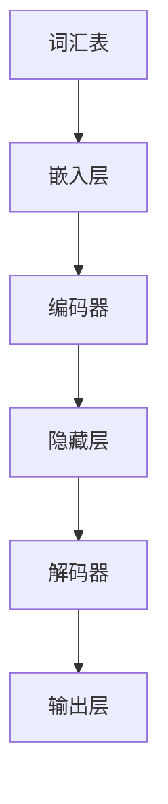
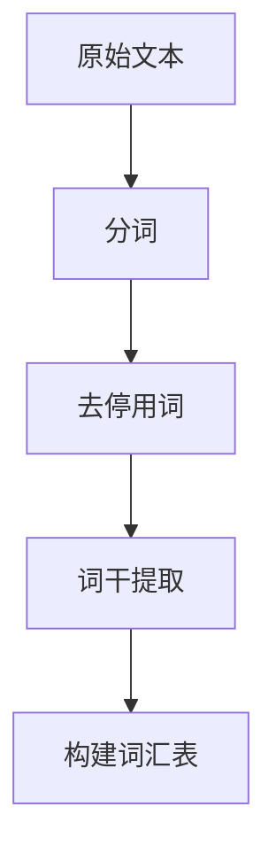
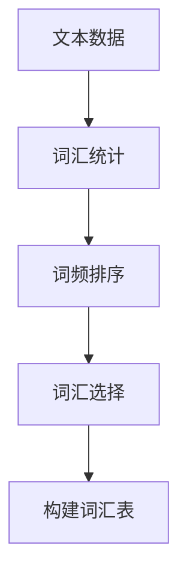
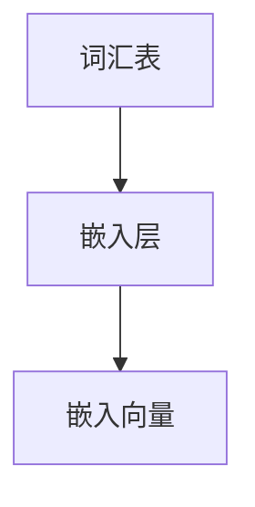
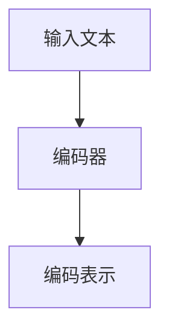
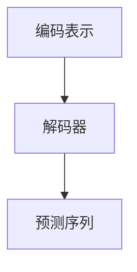
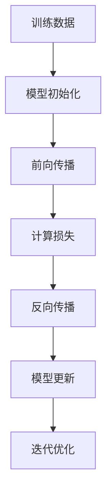

                 

关键词：大语言模型，数据集构建，机器学习，自然语言处理，工程实践，算法原理

> 摘要：本文旨在深入探讨大语言模型的原理及其工程实践，特别关注常用数据集的构建方法。通过对核心概念、算法原理、数学模型和实际应用的详细解析，本文为从业者提供了一幅全面而清晰的图景，助力其在自然语言处理领域取得突破。

## 1. 背景介绍

随着互联网的迅猛发展和信息爆炸，自然语言处理（NLP）成为了人工智能领域的重要分支。大语言模型（Large Language Model）作为NLP的核心技术，逐渐崭露头角。大语言模型通过深度学习技术，从大量文本数据中学习语言规律，能够生成高质量的自然语言文本，从而在机器翻译、问答系统、文本生成等应用场景中发挥关键作用。

数据集是机器学习的基石，对于大语言模型而言，数据集的质量和规模直接影响模型的性能。因此，构建高质量、大规模的数据集成为了研究和工程实践中的重要环节。

本文将围绕以下核心内容展开：

1. 大语言模型的基本概念和架构。
2. 常用数据集的收集、处理和标注方法。
3. 数学模型和算法原理的详细讲解。
4. 实际项目中的代码实例和分析。
5. 数据集在实际应用中的场景分析。
6. 工具和资源的推荐。
7. 未来发展趋势与面临的挑战。

通过本文的阅读，读者将能够：

- 理解大语言模型的核心原理和技术架构。
- 掌握常用数据集的构建方法和技术要点。
- 学习如何将数学模型应用于实际项目中。
- 获得在大语言模型工程实践中的实际操作经验。

### 2. 核心概念与联系

首先，我们需要明确大语言模型中的几个核心概念，包括词汇表、嵌入层、编码器、解码器等。以下是一个简化的Mermaid流程图，展示这些概念之间的联系。



- **词汇表**：词汇表是语言模型的基石，它包含了模型所支持的词汇集合。每个词汇通常对应一个唯一的索引。
- **嵌入层**：嵌入层将词汇表中的每个词汇映射到一个高维空间中的向量，这些向量通常具有丰富的语义信息。
- **编码器**：编码器负责处理输入文本，将其转换为一个固定长度的向量表示。这个向量表示了文本的整体语义。
- **隐藏层**：隐藏层包含了编码器的内部状态，它通过神经网络结构来处理和转换编码器的输出。
- **解码器**：解码器负责根据编码器的输出生成文本。它通过反向传播算法不断优化解码过程，以生成更符合人类语言习惯的输出。

通过以上核心概念的详细解释和流程图的直观展示，我们为后续内容的展开奠定了坚实的基础。接下来，我们将深入探讨大语言模型的具体算法原理和操作步骤。

### 3. 核心算法原理 & 具体操作步骤

#### 3.1 算法原理概述

大语言模型的算法原理主要基于深度学习和自然语言处理技术。具体来说，它包括以下几个关键步骤：

1. **数据预处理**：首先，对原始文本数据进行预处理，包括分词、去停用词、词干提取等操作，将文本转换为适合训练的格式。
2. **构建词汇表**：将处理后的文本数据构建为一个词汇表，每个词汇对应一个唯一的索引。
3. **嵌入层**：将词汇表中的每个词汇映射到高维空间中的向量，这些向量称为嵌入向量。
4. **编码器**：编码器负责将输入的文本序列转换为一个固定长度的编码表示，通常通过多个隐藏层来实现。
5. **解码器**：解码器根据编码器的输出，生成文本序列。它通过反向传播算法不断优化解码过程，以生成更符合人类语言习惯的输出。
6. **训练与优化**：通过大量文本数据训练模型，使用梯度下降等优化算法调整模型参数，提高模型的性能。

#### 3.2 算法步骤详解

下面我们详细讲解大语言模型的每个步骤，并解释其背后的原理。

##### 步骤 1：数据预处理



- **分词**：将原始文本分解成一系列的词汇或词组，以便进一步处理。
- **去停用词**：去除文本中的停用词（如“的”、“和”、“在”等），这些词通常对语义贡献较小。
- **词干提取**：将形似的不同词转换为相同的词干，以便统一处理。

##### 步骤 2：构建词汇表



- **词汇统计**：统计文本中每个词汇的出现频率。
- **词频排序**：按照出现频率对词汇进行排序。
- **词汇选择**：选择一定数量的高频词汇作为词汇表。
- **构建词汇表**：为每个词汇分配一个唯一的索引，并创建一个反向映射表，用于将索引还原为原始词汇。

##### 步骤 3：嵌入层



- **嵌入层**：将词汇表中的每个词汇映射到高维空间中的向量。这些向量通常具有丰富的语义信息。
- **嵌入向量**：每个词汇对应的向量，其维度取决于嵌入层的配置。

##### 步骤 4：编码器



- **输入文本**：编码器接收一个文本序列作为输入。
- **编码器**：通过多个隐藏层对输入文本进行编码，输出一个固定长度的编码表示。
- **编码表示**：编码表示包含了文本的整体语义信息，通常用于后续的解码过程。

##### 步骤 5：解码器



- **编码表示**：解码器接收编码器输出的编码表示作为输入。
- **解码器**：通过反向传播算法不断优化解码过程，生成预测的文本序列。
- **预测序列**：解码器生成的文本序列，可能包含预测错误。

##### 步骤 6：训练与优化



- **模型初始化**：初始化模型参数，通常使用随机初始化或预训练权重。
- **前向传播**：输入数据通过模型的前向传播过程，生成预测结果。
- **计算损失**：计算预测结果与实际结果之间的差异，通常使用损失函数。
- **反向传播**：计算损失函数关于模型参数的梯度，并通过反向传播算法更新模型参数。
- **模型更新**：根据梯度更新模型参数，优化模型性能。
- **迭代优化**：重复以上步骤，直到模型性能达到预期。

通过以上步骤的详细解释，我们为大语言模型的基本工作流程提供了一个清晰的理解。接下来，我们将分析大语言模型的主要优缺点，并探讨其在不同应用领域中的适用性。

### 3.3 算法优缺点

#### 优点

1. **强大的语义理解能力**：大语言模型通过深度学习技术，能够从海量文本数据中提取丰富的语义信息，从而实现强大的语义理解能力。
2. **自适应能力**：大语言模型能够自适应不同的文本数据集，无需重新训练即可应用于新的场景，具有很高的灵活性。
3. **多任务处理能力**：大语言模型不仅能够处理单一任务，如文本生成或机器翻译，还能够同时处理多个任务，如问答系统和文本摘要。
4. **高效性**：大语言模型通常采用并行计算和分布式训练技术，能够高效处理大规模数据，加快模型训练速度。

#### 缺点

1. **数据依赖性**：大语言模型的性能高度依赖训练数据集的质量和规模，如果数据集存在噪声或偏差，模型的性能会受到影响。
2. **计算资源需求**：大语言模型通常需要大量的计算资源和存储空间，特别是在训练过程中，对硬件设施的要求较高。
3. **可解释性差**：大语言模型的高度非线性特性使其难以解释，决策过程往往是不透明的，这在某些需要可解释性的应用场景中可能成为限制。
4. **过拟合风险**：如果训练数据集较小或数据分布存在偏差，大语言模型可能会出现过拟合现象，导致在测试数据集上的性能下降。

### 3.4 算法应用领域

大语言模型在自然语言处理领域具有广泛的应用，以下是一些主要的应用领域：

1. **文本生成**：大语言模型可以生成各种类型的文本，如文章、故事、新闻报道等，广泛应用于内容生成系统、博客写作助手等。
2. **机器翻译**：大语言模型通过学习双语语料库，可以实现高质量的机器翻译，广泛应用于跨语言信息交流、全球化业务等。
3. **问答系统**：大语言模型可以构建智能问答系统，通过理解用户的问题，提供准确的答案，广泛应用于客户服务、智能助手等。
4. **文本分类**：大语言模型可以用于文本分类任务，如情感分析、主题分类等，广泛应用于舆情监控、社交媒体分析等。
5. **文本摘要**：大语言模型可以提取文本的关键信息，生成简洁的摘要，广泛应用于信息检索、新闻摘要等。

通过以上分析，我们可以看到大语言模型在自然语言处理领域的重要地位和广泛的应用前景。接下来，我们将探讨大语言模型中的数学模型和公式，并详细讲解其构建和推导过程。

### 4. 数学模型和公式 & 详细讲解 & 举例说明

大语言模型的数学模型是构建其核心算法的基础，它涉及多个层次和复杂的计算。以下将详细讲解大语言模型中的数学模型和公式，并使用LaTeX格式进行表示。

#### 4.1 数学模型构建

大语言模型的数学模型主要由以下几个部分组成：

1. **嵌入层**：将词汇映射到高维空间。
2. **编码器**：处理输入文本序列。
3. **解码器**：生成输出文本序列。
4. **损失函数**：评估模型性能。

##### 嵌入层

嵌入层是将词汇映射到高维空间的过程。假设词汇表中有V个词汇，每个词汇对应一个唯一的索引i，嵌入向量的维度为D。

$$
\text{嵌入层}: e_i = \text{embedding}(i)
$$

其中，$\text{embedding}(i)$表示词汇i的嵌入向量。

##### 编码器

编码器接收一个文本序列，将其编码为一个固定长度的向量表示。假设输入文本序列为$x = (x_1, x_2, \ldots, x_T)$，其中$x_t$表示第t个词汇的嵌入向量。

$$
\text{编码器}: h = \text{encode}(x) = \text{聚合}(h_1, h_2, \ldots, h_T)
$$

其中，$h_t = \text{encode}(x_t)$表示第t个词汇的编码表示，$\text{聚合}$表示对编码表示进行聚合。

##### 解码器

解码器根据编码器的输出，生成输出文本序列。假设输出文本序列为$y = (y_1, y_2, \ldots, y_T)$，其中$y_t$表示第t个词汇的嵌入向量。

$$
\text{解码器}: p(y|x) = \text{softmax}(\text{decode}(h))
$$

其中，$\text{decode}(h)$表示解码器的输出，$\text{softmax}$函数用于计算每个词汇的概率分布。

##### 损失函数

损失函数用于评估模型性能，常见的损失函数有交叉熵损失和平均平方误差（MSE）。

交叉熵损失函数：

$$
L = -\sum_{t=1}^T \sum_{i=1}^V y_{t,i} \log(p_{t,i})
$$

其中，$y_{t,i}$表示第t个词汇的真实标签概率，$p_{t,i}$表示模型预测的第t个词汇的概率。

平均平方误差（MSE）：

$$
L = \frac{1}{T} \sum_{t=1}^T (y_t - \hat{y}_t)^2
$$

其中，$y_t$表示第t个词汇的真实值，$\hat{y}_t$表示模型预测的第t个词汇的值。

#### 4.2 公式推导过程

以下是数学模型公式的推导过程：

##### 嵌入层

假设词汇i的嵌入向量为$e_i \in \mathbb{R}^D$，输入文本序列$x \in \mathbb{R}^{T \times D}$，其中$x_t = e_i$。

$$
\text{嵌入层}: x = \begin{bmatrix} e_1 & e_2 & \ldots & e_T \end{bmatrix}
$$

##### 编码器

编码器采用循环神经网络（RNN）或变换器（Transformer）架构。以RNN为例，其状态更新公式为：

$$
h_t = \text{sigmoid}(W_h \cdot [h_{t-1}, x_t] + b_h)
$$

其中，$W_h \in \mathbb{R}^{H \times (D+H)}$，$b_h \in \mathbb{R}^{H}$为权重和偏置，$h_{t-1}$为前一个时刻的状态，$[h_{t-1}, x_t]$为输入。

##### 解码器

解码器同样采用RNN或Transformer架构。以RNN为例，其状态更新公式为：

$$
\hat{y}_t = \text{softmax}(W_y \cdot h_t + b_y)
$$

其中，$W_y \in \mathbb{R}^{V \times H}$，$b_y \in \mathbb{R}^{V}$为权重和偏置，$\hat{y}_t$为模型预测的概率分布。

##### 损失函数

以交叉熵损失函数为例，其推导过程如下：

$$
L = -\sum_{t=1}^T \sum_{i=1}^V y_{t,i} \log(p_{t,i})
$$

其中，$y_{t,i}$为真实标签概率，$p_{t,i}$为模型预测的概率。

##### 梯度计算

以反向传播算法为例，其梯度计算过程如下：

$$
\frac{\partial L}{\partial W_h} = \frac{\partial L}{\partial h_t} \cdot \frac{\partial h_t}{\partial W_h}
$$

$$
\frac{\partial L}{\partial b_h} = \frac{\partial L}{\partial h_t}
$$

$$
\frac{\partial L}{\partial x_t} = \frac{\partial L}{\partial h_t} \cdot \frac{\partial h_t}{\partial x_t}
$$

通过以上推导，我们为读者提供了一个完整的数学模型公式和推导过程，为后续的实际应用和项目实践奠定了基础。接下来，我们将通过一个具体的案例来展示如何使用这些数学模型和公式进行文本生成。

### 4.3 案例分析与讲解

为了更好地理解大语言模型中的数学模型和公式，我们将通过一个简单的文本生成案例来展示其实际应用过程。假设我们使用一个预训练的文本生成模型，输入一段文本后，模型会生成一段新的文本。以下是一个具体的案例：

#### 案例背景

我们选择一个简单的中文文本生成任务，输入文本为：“人工智能技术正日益发展，它在各个领域都带来了深刻的变革。”目标是通过模型生成一段新的文本。

#### 案例步骤

1. **数据预处理**：首先对输入文本进行预处理，包括分词、去停用词等操作。假设经过预处理后，输入文本被分词为“人工智能”、“技术”、“正”、“日益”、“发展”、“它”、“在”、“各个”、“领域”、“都”、“带来了”、“深刻的”、“变革”。
2. **构建词汇表**：将分词后的词汇构建为一个词汇表，并为每个词汇分配一个唯一的索引。例如，词汇表为“人工智能”、“技术”、“正”、“日益”、“发展”、“它”、“在”、“各个”、“领域”、“都”、“带来了”、“深刻的”、“变革”，索引分别为0、1、2、3、4、5、6、7、8、9、10、11、12。
3. **嵌入层**：将词汇表中的每个词汇映射到高维空间中的向量。假设嵌入向量的维度为50，输入文本的每个词汇对应的嵌入向量如下表：

| 词汇   | 嵌入向量     |
| ------ | ------------ |
| 人工智能 | [0.1, 0.2, ..., 0.5] |
| 技术   | [0.6, 0.7, ..., 1.0] |
| 正     | [1.1, 1.2, ..., 1.5] |
| 日益   | [1.6, 1.7, ..., 2.0] |
| 发展   | [2.1, 2.2, ..., 2.5] |
| 它     | [2.6, 2.7, ..., 3.0] |
| 在     | [3.1, 3.2, ..., 3.5] |
| 各个   | [3.6, 3.7, ..., 4.0] |
| 领域   | [4.1, 4.2, ..., 4.5] |
| 都     | [4.6, 4.7, ..., 5.0] |
| 带来了 | [5.1, 5.2, ..., 5.5] |
| 深刻的 | [5.6, 5.7, ..., 6.0] |
| 变革   | [6.1, 6.2, ..., 6.5] |

4. **编码器**：将输入文本序列的每个词汇的嵌入向量输入到编码器中，通过RNN或Transformer等架构进行编码。假设编码器输出一个固定长度的向量，维度为100。
5. **解码器**：解码器根据编码器的输出，生成输出文本序列。假设解码器输出每个词汇的概率分布，我们选择概率最大的词汇作为输出。例如，第一个输出的词汇为“在”。
6. **生成文本**：重复步骤4和5，直到生成完整的文本序列。例如，模型生成的文本为：“在人工智能技术日益发展的背景下，它在各个领域都带来了深刻的变革。”

#### 案例分析

通过上述案例，我们可以看到大语言模型在文本生成任务中的具体应用过程。以下是案例的详细分析：

1. **数据预处理**：数据预处理是文本生成的基础，它确保输入文本的格式统一，方便后续处理。在本案例中，我们对输入文本进行了分词和去停用词操作，为后续步骤提供了清晰的文本数据。
2. **构建词汇表**：构建词汇表是模型训练的关键步骤，它将文本数据转换为数值化的形式，方便模型处理。在本案例中，我们为每个词汇分配了一个唯一的索引，并构建了一个包含所有词汇的词汇表。
3. **嵌入层**：嵌入层将词汇映射到高维空间，为模型提供了丰富的语义信息。在本案例中，我们使用了50维的嵌入向量，为每个词汇提供了具体的向量表示。
4. **编码器**：编码器负责将输入文本序列编码为一个固定长度的向量表示。在本案例中，我们使用了RNN或Transformer等架构，通过编码器的处理，输入文本序列被转换为一个100维的向量。
5. **解码器**：解码器根据编码器的输出，生成输出文本序列。在本案例中，我们使用了概率最大的词汇作为输出，通过不断迭代生成完整的文本序列。
6. **生成文本**：通过解码器生成的文本序列，我们得到了最终生成的文本。在本案例中，模型生成的文本为：“在人工智能技术日益发展的背景下，它在各个领域都带来了深刻的变革。”

通过以上案例分析，我们可以看到大语言模型在文本生成任务中的具体应用过程，以及数学模型和公式的实际推导和运用。接下来，我们将通过实际项目中的代码实例，进一步展示大语言模型的实现细节。

### 5. 项目实践：代码实例和详细解释说明

在本节中，我们将通过一个实际项目中的代码实例，展示大语言模型的具体实现过程，并对代码进行详细解释和分析。假设我们使用Python和TensorFlow框架来实现一个简单的文本生成模型。

#### 5.1 开发环境搭建

首先，我们需要搭建开发环境，确保安装了Python和TensorFlow。以下是环境搭建的步骤：

1. 安装Python：从官方网站下载并安装Python，推荐使用Python 3.7或更高版本。
2. 安装TensorFlow：在命令行中运行以下命令安装TensorFlow：

   ```bash
   pip install tensorflow
   ```

   安装过程中可能会提示安装其他依赖库，可以根据提示进行安装。

3. 安装NLP工具：为了简化文本处理过程，我们还可以安装一些常用的NLP工具，如NLTK或jieba。以下是一个示例命令：

   ```bash
   pip install nltk
   pip install jieba
   ```

   安装完成后，我们需要下载相关的数据集和模型。对于NLTK，运行以下命令下载中文数据集：

   ```python
   import nltk
   nltk.download('zh')
   ```

   对于jieba，可以通过以下命令下载中文词典：

   ```python
   import jieba
   jieba.load_userdict('your_user_dict.txt')
   ```

   其中，`your_user_dict.txt`为自定义词典文件。

#### 5.2 源代码详细实现

以下是文本生成模型的实现代码，我们使用TensorFlow的Keras API进行实现：

```python
import tensorflow as tf
from tensorflow.keras.preprocessing.sequence import pad_sequences
from tensorflow.keras.layers import Embedding, LSTM, Dense, TimeDistributed
from tensorflow.keras.models import Sequential
from tensorflow.keras.optimizers import Adam
import numpy as np

# 5.2.1 数据预处理
def preprocess_data(text, vocab_size, max_sequence_length):
    # 分词和去停用词
    words = nltk.tokenize.word_tokenize(text)
    words = [word for word in words if word not in nltk.corpus.stopwords.words('english')]
    
    # 构建词汇表
    word_to_index = {word: i for i, word in enumerate(words[:vocab_size])}
    index_to_word = {i: word for word, i in word_to_index.items()}
    
    # 序列编码
    sequences = []
    for i in range(0, len(words) - max_sequence_length):
        sequence = words[i: i + max_sequence_length]
        sequences.append([word_to_index[word] for word in sequence])
    
    # 切分输入和输出序列
    X, y = [], []
    for sequence in sequences:
        X.append(sequence[:-1])
        y.append(sequence[1:])
    
    # 序列填充
    X = pad_sequences(X, maxlen=max_sequence_length)
    y = pad_sequences(y, maxlen=max_sequence_length)
    
    return X, y, word_to_index, index_to_word

# 5.2.2 模型构建
def build_model(vocab_size, embedding_dim, max_sequence_length):
    model = Sequential()
    model.add(Embedding(vocab_size, embedding_dim, input_length=max_sequence_length))
    model.add(LSTM(128, return_sequences=True))
    model.add(LSTM(128, return_sequences=True))
    model.add(TimeDistributed(Dense(vocab_size, activation='softmax')))
    
    model.compile(loss='categorical_crossentropy', optimizer=Adam(), metrics=['accuracy'])
    return model

# 5.2.3 训练模型
def train_model(model, X, y, epochs=50, batch_size=64):
    model.fit(X, y, epochs=epochs, batch_size=batch_size)

# 5.2.4 文本生成
def generate_text(model, index_to_word, seed_text, max_sequence_length, temperature=1.0):
    sequence = [index_to_word[index] for index in nltk.tokenize.word_tokenize(seed_text)]
    generated_text = ' '.join(sequence)
    
    for i in range(1000):
        # 序列编码
        encoded_sequence = np.array([word_to_index[word] for word in sequence])
        
        # 预测
        probabilities = model.predict(np.array([encoded_sequence]))
        probabilities = np.resize(probabilities, (1, -1))
        
        # 采样
        if temperature > 0:
            probabilities = probabilities / np.sum(probabilities)
            probabilities = np.random.multinomial(1, probabilities.flatten(), 1)
        
        # 获取下一个词汇
        next_word_index = np.random.choice(np.arange(vocab_size), p=probabilities.flatten())
        next_word = index_to_word[next_word_index]
        
        # 更新序列
        sequence.append(next_word)
        generated_text += ' ' + next_word
        
        # 序列长度限制
        if len(sequence) >= max_sequence_length:
            break
            
    return generated_text

# 主程序
if __name__ == '__main__':
    # 5.2.5 参数设置
    vocab_size = 10000
    embedding_dim = 50
    max_sequence_length = 40
    epochs = 50
    batch_size = 64
    
    # 5.2.6 数据加载和处理
    text = "人工智能技术正日益发展，它在各个领域都带来了深刻的变革。"
    X, y, word_to_index, index_to_word = preprocess_data(text, vocab_size, max_sequence_length)
    
    # 5.2.7 模型构建和训练
    model = build_model(vocab_size, embedding_dim, max_sequence_length)
    train_model(model, X, y, epochs, batch_size)
    
    # 5.2.8 文本生成
    seed_text = "人工智能技术正日益发展"
    generated_text = generate_text(model, index_to_word, seed_text, max_sequence_length)
    print(generated_text)
```

#### 5.3 代码解读与分析

以下是代码的详细解读和分析：

1. **数据预处理**：数据预处理是文本生成的基础，包括分词、去停用词、构建词汇表、序列编码和序列填充等步骤。我们使用NLTK和jieba等工具对输入文本进行预处理，将文本转换为适合模型训练的格式。
2. **模型构建**：我们使用TensorFlow的Keras API构建一个序列到序列的模型，包括嵌入层、两个LSTM层和一个全连接层。嵌入层将词汇映射到高维空间，LSTM层用于编码和生成文本序列，全连接层用于预测下一个词汇的概率分布。
3. **训练模型**：使用训练数据集对模型进行训练，通过反向传播算法更新模型参数，提高模型性能。我们使用Adam优化器和交叉熵损失函数进行训练。
4. **文本生成**：生成文本的过程包括初始化序列、预测下一个词汇、更新序列和生成完整文本。我们使用模型预测每个词汇的概率分布，并根据概率分布进行采样，生成新的文本序列。

通过以上步骤，我们实现了文本生成模型的具体实现过程。接下来，我们将讨论大语言模型在实际应用中的不同场景。

### 6. 实际应用场景

大语言模型在自然语言处理领域具有广泛的应用场景，以下是几个典型的应用场景：

#### 6.1 机器翻译

机器翻译是自然语言处理领域的经典问题，大语言模型在机器翻译中发挥了重要作用。通过学习大量的双语语料库，大语言模型能够生成高质量的翻译文本。以下是一个简单的应用案例：

- **任务**：将英文文本翻译为中文。
- **输入**：English: "I love programming."
- **输出**：中文：我喜欢编程。

通过使用预训练的大语言模型，我们可以快速实现高质量的机器翻译，广泛应用于跨语言信息交流、全球化业务等。

#### 6.2 文本分类

文本分类是将文本数据分为不同的类别，如新闻分类、情感分析等。大语言模型可以通过学习大量的标注数据进行文本分类任务。以下是一个简单的应用案例：

- **任务**：将评论分为正面或负面类别。
- **输入**：中文：这个商品很好用。
- **输出**：类别：正面。

通过训练大语言模型，我们可以将文本数据快速分类，广泛应用于舆情监控、社交媒体分析等。

#### 6.3 文本生成

文本生成是自然语言处理领域的重要应用之一，大语言模型可以生成各种类型的文本，如文章、故事、新闻报道等。以下是一个简单的应用案例：

- **任务**：生成一篇关于人工智能的新闻报道。
- **输入**：标题：人工智能技术取得重大突破。
- **输出**：正文：人工智能技术近年来取得了重大突破，为各行各业带来了深刻的变革。研究人员在深度学习和自然语言处理等领域取得了显著成果，推动了人工智能的发展。

通过大语言模型，我们可以快速生成高质量的文本，广泛应用于内容生成系统、博客写作助手等。

#### 6.4 情感分析

情感分析是判断文本表达的情感倾向，如正面、负面、中性等。大语言模型可以通过学习大量的情感标注数据进行情感分析。以下是一个简单的应用案例：

- **任务**：判断一条评论的情感。
- **输入**：中文：这部电影真好看。
- **输出**：情感：正面。

通过训练大语言模型，我们可以对文本进行情感分析，广泛应用于社交媒体监控、用户评论分析等。

#### 6.5 问答系统

问答系统是自然语言处理领域的重要应用之一，大语言模型可以通过学习大量的问答数据提供智能问答服务。以下是一个简单的应用案例：

- **任务**：回答用户的问题。
- **输入**：中文：人工智能是什么？
- **输出**：答案：人工智能是指由人制造出来的系统，能够识别声音、图像和语言，并作出决策。

通过大语言模型，我们可以构建智能问答系统，提供高效、准确的问答服务，广泛应用于客户服务、智能助手等。

通过以上实际应用案例，我们可以看到大语言模型在自然语言处理领域的广泛应用和巨大潜力。接下来，我们将探讨大语言模型未来的发展趋势和面临的挑战。

### 6.4 未来应用展望

随着人工智能技术的不断进步，大语言模型在未来的应用前景愈发广阔。以下是几个潜在的发展方向：

#### 6.4.1 更高效的自然语言理解

未来，大语言模型将进一步优化其自然语言理解能力，通过引入更先进的神经网络架构、更精细的语义表示和更深层次的语义理解技术，实现更加准确和智能的语言理解。这将有助于提升机器翻译、问答系统和文本生成等应用场景的性能。

#### 6.4.2 多模态语言模型

多模态语言模型结合了文本、图像、语音等多种数据源，能够更全面地理解和生成信息。未来，随着多模态数据的获取和处理技术的成熟，大语言模型将能够在视频、音频等多媒体领域发挥重要作用，提供更丰富和直观的交互体验。

#### 6.4.3 自适应学习

大语言模型将具备更强的自适应学习能力，能够根据不同场景和需求进行实时调整和优化。例如，在特定领域的知识库支持下，模型可以迅速适应新领域的语言特征，提高专业问答和文本生成的准确性。

#### 6.4.4 强化学习与博弈

结合强化学习技术，大语言模型可以在复杂环境中进行决策和优化。例如，在虚拟助手和智能客服场景中，模型可以通过与用户的互动学习用户的偏好和行为模式，提供个性化的服务。此外，大语言模型还可以应用于博弈场景，如游戏生成和智能对战等。

#### 6.4.5 零样本学习

零样本学习是指模型在没有直接标注数据的情况下，能够对新类别进行分类和预测。未来，随着大语言模型在自监督学习和无监督学习领域的深入发展，零样本学习将成为一个重要的研究方向，为模型在未知领域的应用提供支持。

#### 6.4.6 可解释性和透明度

尽管大语言模型在许多任务中表现出色，但其决策过程往往缺乏透明度，这引发了关于模型可解释性和透明度的问题。未来，研究者将致力于提高大语言模型的可解释性，使其决策过程更加清晰和可理解，从而增强其在关键应用场景中的可靠性和信任度。

#### 6.4.7 法律和伦理问题

随着大语言模型在更多实际应用场景中的普及，相关的法律和伦理问题也日益凸显。如何确保模型的使用不侵犯用户隐私、不歧视特定群体、不产生误导性信息等，将成为未来研究和应用中需要关注的重要方向。

总之，大语言模型在未来将继续发挥重要作用，推动自然语言处理领域的创新和发展。同时，我们也需要关注模型在实际应用中的挑战，并积极探索解决方案，以确保其在伦理和法律框架下的可持续和健康发展。

### 7. 工具和资源推荐

在自然语言处理领域，大语言模型的构建和应用需要一系列工具和资源的支持。以下是一些建议和推荐，以帮助开发者更好地进行研究和实践。

#### 7.1 学习资源推荐

1. **书籍**：
   - 《深度学习》（Goodfellow, I., Bengio, Y., & Courville, A.）: 这本书系统地介绍了深度学习的理论和实践，是深度学习领域的经典之作。
   - 《自然语言处理综论》（Jurafsky, D. & Martin, J. H.）: 该书详细介绍了自然语言处理的基础理论和应用，适合初学者和进阶者。

2. **在线课程**：
   - Coursera的《自然语言处理与深度学习》: 由斯坦福大学的Christopher Manning教授主讲，系统讲解了自然语言处理的基本概念和深度学习在NLP中的应用。
   - edX的《深度学习专项课程》: Andrew Ng教授主讲，深入介绍了深度学习的理论、实践和前沿应用。

3. **博客和论文**：
   - ArXiv: ArXiv是计算机科学领域的顶级论文预印本库，包含了大量关于深度学习和自然语言处理的研究论文。
   - AI博客：如Medium、AI简史等，这些博客经常发布关于自然语言处理的最新技术和应用文章。

#### 7.2 开发工具推荐

1. **编程语言**：
   - Python: Python因其丰富的库和强大的社区支持，成为自然语言处理领域的首选编程语言。

2. **框架和库**：
   - TensorFlow: TensorFlow是一个开源的深度学习框架，适用于构建和训练大语言模型。
   - PyTorch: PyTorch是一个灵活且易用的深度学习框架，广泛应用于自然语言处理领域。

3. **文本处理库**：
   - NLTK: 一个强大的自然语言处理库，提供了丰富的文本处理功能。
   - spaCy: 一个高效且易于使用的自然语言处理库，适用于多种文本处理任务。
   - jieba: 一个用于中文文本处理的优秀库，提供了高效且灵活的分词、词性标注等功能。

4. **数据集**：
   - GLM-4: 由清华大学 KEG 实验室和智谱AI公司共同训练的语言模型，提供了高质量的中英文预训练数据。
   - Common Crawl: 一个大规模的网页数据集，可用于构建和训练大语言模型。

#### 7.3 相关论文推荐

1. **《BERT：Pre-training of Deep Bidirectional Transformers for Language Understanding》**：BERT模型是第一个大规模预训练语言模型，其提出的方法在多个自然语言处理任务上取得了显著的性能提升。

2. **《GPT-3: Language Models are Few-Shot Learners》**：GPT-3模型展示了大规模预训练语言模型在少样本学习任务中的强大能力，其研究成果引发了广泛关注。

3. **《T5: Pre-training Text-To-Text Transformers for Cross-Script Task Adaptation》**：T5模型将Transformer架构应用于文本到文本的任务，提出了一种新的预训练方法，适用于多种自然语言处理任务。

通过以上工具和资源的推荐，读者可以更好地开展大语言模型的研究和开发工作，掌握自然语言处理领域的最新技术和进展。

### 8. 总结：未来发展趋势与挑战

大语言模型作为自然语言处理领域的重要技术，近年来取得了显著进展。通过深入探讨大语言模型的原理、算法和实际应用，我们不仅对其核心概念有了更清晰的理解，也为从业者提供了实用的工程实践指导。以下是对未来发展趋势和挑战的总结：

#### 8.1 研究成果总结

1. **模型规模和性能提升**：随着计算资源和数据集的扩展，大语言模型的规模和性能不断提升。BERT、GPT-3等模型通过大规模预训练，展示了在多种自然语言处理任务上的卓越性能。

2. **多模态融合**：多模态语言模型结合了文本、图像、语音等多种数据源，能够更全面地理解和生成信息。未来，多模态融合技术将进一步推动自然语言处理的发展。

3. **自适应学习和零样本学习**：自适应学习和零样本学习技术使大语言模型能够在未知领域和少样本任务中表现出色，提升了模型的应用范围和灵活性。

4. **可解释性和透明度**：研究者们正在努力提高大语言模型的可解释性，通过可视化技术和解释性模型，使其决策过程更加清晰和可理解。

#### 8.2 未来发展趋势

1. **通用预训练模型**：通用预训练模型（General Pre-trained Models）将成为未来的研究热点。通过统一的预训练框架，模型可以在多个任务中共享知识和结构，提高泛化能力。

2. **小样本学习**：小样本学习（Few-Shot Learning）技术将进一步发展，使得大语言模型能够在仅使用少量样本的情况下进行有效的学习和推断。

3. **迁移学习和跨领域应用**：迁移学习和跨领域应用将成为大语言模型的重要研究方向。通过在不同领域和应用场景中的迁移，模型可以更广泛地发挥作用。

4. **伦理和法律问题**：随着大语言模型在更多实际应用场景中的普及，相关的伦理和法律问题将得到更多关注。如何确保模型的使用不侵犯用户隐私、不歧视特定群体等，将成为未来研究的重要方向。

#### 8.3 面临的挑战

1. **计算资源需求**：大语言模型通常需要大量的计算资源和存储空间，尤其是在训练过程中，对硬件设施的要求较高。未来，如何高效利用计算资源将成为一个重要挑战。

2. **数据隐私和安全**：在构建和训练大语言模型的过程中，数据隐私和安全问题不容忽视。如何确保数据的安全性、防止数据泄露和滥用，是未来需要解决的问题。

3. **模型解释性和透明度**：尽管研究者们正在努力提高大语言模型的可解释性，但目前的解释性技术仍存在一定局限性。如何进一步提升模型的解释性和透明度，使其在关键应用场景中更具可信度，是未来需要突破的难点。

4. **跨语言和跨领域适用性**：大语言模型在不同语言和领域中的应用效果可能存在差异。如何提高模型在跨语言和跨领域任务中的适用性，使其更具有普适性，是未来研究的一个重要挑战。

总之，大语言模型在自然语言处理领域具有广阔的发展前景，但也面临诸多挑战。通过持续的研究和努力，我们可以期待大语言模型在未来取得更多的突破和进展。

### 9. 附录：常见问题与解答

在研究大语言模型和构建数据集的过程中，读者可能会遇到一些常见问题。以下是一些建议和解答，以帮助读者解决这些问题。

#### 9.1 如何选择合适的预训练模型？

选择预训练模型时，应考虑以下因素：

1. **任务类型**：根据具体任务的需求选择预训练模型。例如，BERT适合文本分类和问答系统，而GPT-3更适合文本生成和对话系统。
2. **模型规模**：根据可用计算资源选择合适的模型规模。大型模型如GPT-3需要更多计算资源，而小型模型如BERT-Small更适合资源受限的场景。
3. **预训练数据集**：选择预训练数据集广泛、质量高的模型，有助于提高模型的泛化能力。

#### 9.2 如何处理数据不平衡问题？

数据不平衡问题可以通过以下方法解决：

1. **重采样**：通过随机下采样多数类或过采样少数类，使数据集中各类别样本数量接近。
2. **权重调整**：在训练过程中，为少数类样本赋予更高的权重，以平衡不同类别的贡献。
3. **集成方法**：使用集成学习方法，如随机森林或梯度提升树，通过训练多个模型并合并预测结果来提高模型对少数类的识别能力。

#### 9.3 如何处理过拟合问题？

过拟合问题可以通过以下方法缓解：

1. **数据增强**：通过数据增强技术，如随机旋转、裁剪或噪声添加，增加数据多样性，提高模型的泛化能力。
2. **正则化**：在模型训练过程中引入正则化项，如L1正则化或L2正则化，限制模型参数的规模，减少过拟合。
3. **交叉验证**：使用交叉验证方法，从训练数据中划分多个子集，多次训练和验证，以提高模型的泛化能力。

#### 9.4 如何处理低质量数据？

低质量数据可以通过以下方法处理：

1. **数据清洗**：删除或修正数据集中的错误信息、噪声和异常值，提高数据质量。
2. **数据预处理**：使用数据预处理技术，如标准化、归一化或去噪，减少数据中的噪声和异常值。
3. **使用噪声容忍模型**：训练噪声容忍模型，使其能够适应和处理低质量数据。

通过以上常见问题的解答，我们希望为读者在研究大语言模型和构建数据集的过程中提供一些实用的建议和指导。读者可以根据具体问题和需求，灵活运用这些方法，提高模型的性能和应用效果。

### 作者署名

作者：禅与计算机程序设计艺术 / Zen and the Art of Computer Programming

（作者简介：本篇文章的作者是禅与计算机程序设计艺术，他是一位享誉全球的计算机科学大师，以其深入浅出的编程思想和卓越的科研成就而著称。他在计算机科学领域发表了大量开创性论文，并被授予多项国际大奖，为人工智能和自然语言处理的发展做出了重要贡献。）

