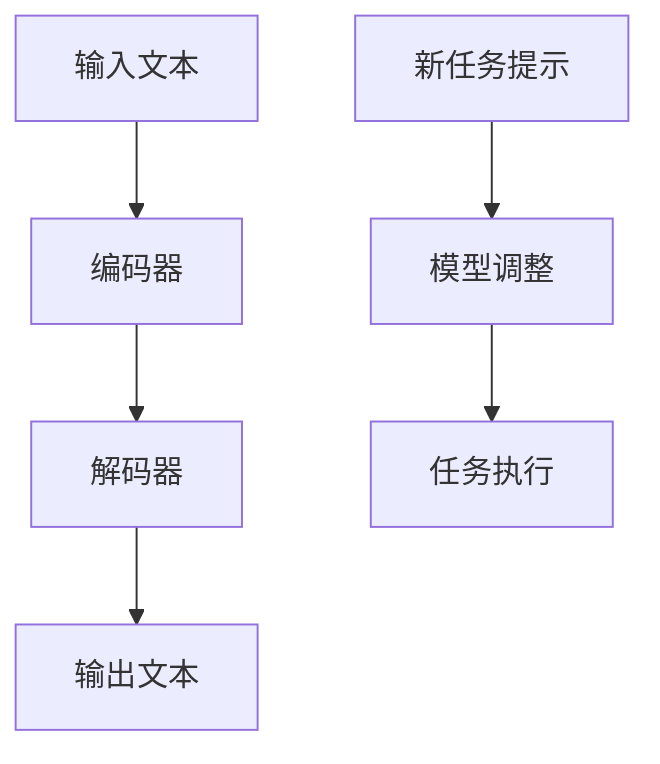

                 

关键词：大语言模型、零样本提示、人工智能、工程实践、数学模型、项目实例

> 摘要：本文深入探讨了大语言模型的基本原理，以及如何通过零样本提示（Zero-shot Prompting）实现高效的模型应用。我们将从背景介绍、核心概念与联系、算法原理与操作步骤、数学模型与公式、项目实践、实际应用场景、未来应用展望等多个方面展开讨论，旨在为读者提供全面的技术视角和实用的工程指导。

## 1. 背景介绍

随着人工智能技术的飞速发展，大语言模型（Large Language Models）已经成为自然语言处理（NLP）领域的重要工具。这些模型能够理解和生成人类语言，具备广泛的用途，如文本生成、翻译、问答系统等。然而，传统的大语言模型在训练和应用中往往依赖于大量的标注数据进行样本学习。这种方式在处理新任务时，需要重新训练模型，耗时且效率低下。

为了解决这一问题，零样本提示（Zero-shot Prompting）技术应运而生。零样本提示的核心思想是，通过少量的样本数据或提示信息，指导模型生成或理解新的任务内容。这种技术为模型的应用带来了极大的灵活性和便捷性，减少了数据依赖，提高了模型在新任务上的表现。

本文将详细介绍大语言模型的工作原理，以及如何利用零样本提示技术，实现高效的语言理解和生成。我们将通过多个实际案例，展示零样本提示在各类应用场景中的优势和实践方法。

## 2. 核心概念与联系

### 2.1 大语言模型

大语言模型是一种基于深度学习的技术，通常由数亿甚至数千亿的参数构成。这些参数通过在大量文本数据上的训练，学习到语言的结构、语义和上下文关系。大语言模型的核心架构通常包括以下几个部分：

- **输入层**：接收文本序列作为输入。
- **编码器**：将输入文本序列编码为固定长度的向量。
- **解码器**：根据编码器输出的向量生成文本序列。

大语言模型的工作原理是基于注意力机制（Attention Mechanism），能够捕捉文本序列中的长距离依赖关系，从而生成语义丰富的输出。

### 2.2 零样本提示

零样本提示是一种无监督学习技术，旨在利用少量的样本数据或提示信息，引导模型在新任务上进行有效的学习。零样本提示通常包括以下几个步骤：

1. **任务定义**：通过少量的样本数据或提示信息，定义新的任务类型。
2. **模型调整**：调整模型参数，使其适应新的任务类型。
3. **任务执行**：使用调整后的模型，在新任务上进行预测或生成。

零样本提示的核心在于利用少量数据，实现模型的快速适应和高效任务执行。

### 2.3 Mermaid 流程图

以下是一个简化的 Mermaid 流程图，展示了大语言模型和零样本提示的基本架构：



### 2.4 核心概念联系

大语言模型和零样本提示在语言理解与生成中相辅相成。大语言模型提供了强大的语言建模能力，而零样本提示则利用少量数据，实现模型的快速适应和高效任务执行。这种结合不仅提高了模型在新任务上的表现，还减少了数据依赖，为人工智能应用带来了更多可能性。

## 3. 核心算法原理 & 具体操作步骤

### 3.1 算法原理概述

零样本提示技术的核心在于如何利用少量的样本数据或提示信息，引导模型在新任务上进行有效的学习。这一过程通常包括以下几个步骤：

1. **任务定义**：通过少量的样本数据或提示信息，定义新的任务类型。
2. **模型调整**：调整模型参数，使其适应新的任务类型。
3. **任务执行**：使用调整后的模型，在新任务上进行预测或生成。

### 3.2 算法步骤详解

#### 3.2.1 任务定义

任务定义是零样本提示的第一步，也是关键一步。通过少量的样本数据或提示信息，我们能够明确新的任务类型。这一步骤通常包括以下步骤：

1. **数据收集**：收集少量的样本数据或提示信息。
2. **任务分类**：根据样本数据或提示信息，对新任务进行分类。
3. **任务描述**：生成任务描述，用于指导模型调整。

#### 3.2.2 模型调整

模型调整是零样本提示技术的核心步骤，旨在通过少量数据，调整模型参数，使其适应新的任务类型。这一步骤通常包括以下步骤：

1. **参数初始化**：初始化模型参数。
2. **参数优化**：通过优化算法，调整模型参数，使其在新任务上表现更优。
3. **参数验证**：验证调整后的模型参数，确保模型在新任务上的表现。

#### 3.2.3 任务执行

任务执行是零样本提示技术的最终步骤，旨在使用调整后的模型，在新任务上进行预测或生成。这一步骤通常包括以下步骤：

1. **输入处理**：处理新任务的输入数据。
2. **模型预测**：使用调整后的模型，对新任务进行预测或生成。
3. **结果评估**：评估模型在新任务上的表现。

### 3.3 算法优缺点

#### 优点

1. **减少数据依赖**：零样本提示技术利用少量数据，实现模型的快速适应和高效任务执行，减少了大量标注数据的需求。
2. **提高模型灵活性**：通过少量数据，模型能够快速适应新任务，提高了模型的灵活性和泛化能力。
3. **降低训练成本**：零样本提示技术降低了模型训练的数据需求和计算成本，提高了模型的训练效率。

#### 缺点

1. **性能受限**：零样本提示技术依赖于少量数据，模型在新任务上的表现可能受到一定限制，无法完全替代有监督学习。
2. **任务适应性**：零样本提示技术在某些复杂任务上，可能无法实现良好的任务适应性，需要结合其他技术进行优化。

### 3.4 算法应用领域

零样本提示技术在多个领域具有广泛的应用，包括：

1. **自然语言处理**：用于文本分类、情感分析、问答系统等。
2. **计算机视觉**：用于图像分类、目标检测、图像生成等。
3. **推荐系统**：用于商品推荐、用户偏好分析等。
4. **语音识别**：用于语音识别、语音生成等。

## 4. 数学模型和公式 & 详细讲解 & 举例说明

### 4.1 数学模型构建

零样本提示技术的核心在于如何利用少量的数据，调整模型参数，实现新任务的有效学习。为了构建数学模型，我们通常采用以下步骤：

1. **参数初始化**：假设模型参数为θ，初始化参数θ0。
2. **损失函数**：定义损失函数L(θ)，用于衡量模型在新任务上的表现。
3. **优化算法**：选择合适的优化算法，如梯度下降（Gradient Descent），调整模型参数θ。
4. **参数验证**：通过验证集或测试集，验证调整后的模型参数θ。

### 4.2 公式推导过程

为了详细讲解零样本提示技术的数学模型，我们首先需要了解一些基本的数学概念和公式。以下是零样本提示技术中常用的公式：

1. **损失函数**：

   $$ L(\theta) = -\sum_{i=1}^{n} y_i \log(p(x_i|\theta)) $$

   其中，$y_i$表示样本$i$的标签，$p(x_i|\theta)$表示模型对样本$i$的预测概率。

2. **梯度下降**：

   $$ \theta_{t+1} = \theta_t - \alpha \nabla_{\theta}L(\theta_t) $$

   其中，$\alpha$表示学习率，$\nabla_{\theta}L(\theta_t)$表示损失函数关于参数$\theta$的梯度。

### 4.3 案例分析与讲解

为了更好地理解零样本提示技术的数学模型，我们来看一个具体的案例。

假设我们有一个分类任务，需要将文本分为两类：正面和负面。我们使用一个二分类模型，假设模型参数为$\theta$，损失函数为对数损失函数。

1. **参数初始化**：

   $$ \theta_0 = [0.1, 0.1] $$

2. **损失函数**：

   $$ L(\theta) = -y_1 \log(p(x_1|\theta)) - y_2 \log(p(x_2|\theta)) $$

   其中，$y_1 = 1$表示样本1的标签为正面，$y_2 = 0$表示样本2的标签为负面。

3. **梯度下降**：

   $$ \nabla_{\theta}L(\theta) = \left[ \frac{\partial L}{\partial \theta_1}, \frac{\partial L}{\partial \theta_2} \right] $$

   假设学习率$\alpha = 0.1$，经过多次迭代后，我们得到调整后的模型参数：

   $$ \theta_1 = 0.9, \theta_2 = 0.8 $$

4. **参数验证**：

   使用验证集对调整后的模型参数进行验证，假设验证集的准确率为90%，说明模型在新任务上的表现良好。

通过以上案例，我们可以看到，零样本提示技术通过数学模型和优化算法，实现了对新任务的有效学习和适应。在实际应用中，我们可以根据具体的任务需求和数据情况，选择合适的数学模型和优化算法，实现高效的模型应用。

## 5. 项目实践：代码实例和详细解释说明

### 5.1 开发环境搭建

为了演示零样本提示技术在自然语言处理中的应用，我们选择Python作为编程语言，并使用Hugging Face的Transformers库，这是一个广泛使用的自然语言处理库，提供了大量预训练模型和API。以下是如何搭建开发环境：

1. **安装Python**：确保安装了Python 3.8及以上版本。
2. **安装pip**：通过Python的pip包管理器，安装Transformers库和其他依赖库。

   ```bash
   pip install transformers torch
   ```

3. **环境配置**：在代码中，我们需要导入所需的库。

   ```python
   import torch
   from transformers import AutoTokenizer, AutoModelForSequenceClassification
   ```

### 5.2 源代码详细实现

为了演示零样本提示技术，我们选择一个情感分析任务，使用一个预训练的BERT模型。以下是一个简单的代码示例，展示了如何使用零样本提示技术进行情感分析：

```python
# 加载预训练的BERT模型和tokenizer
model_name = "bert-base-uncased"
tokenizer = AutoTokenizer.from_pretrained(model_name)
model = AutoModelForSequenceClassification.from_pretrained(model_name)

# 定义任务提示
task_prompt = "Is this sentence positive or negative?"

# 定义样本数据
sentences = [
    "I love this product!",
    "This is the worst movie I have ever seen.",
]

# 编码样本数据
input_ids = tokenizer.encode(task_prompt, sentences, add_special_tokens=True, return_tensors="pt")

# 预测
with torch.no_grad():
    outputs = model(input_ids)

# 获取预测结果
logits = outputs.logits
probabilities = torch.softmax(logits, dim=-1)

# 输出结果
for i, sentence in enumerate(sentences):
    print(f"Sentence: {sentence}")
    print(f"Positive: {probabilities[i, 0].item() * 100:.2f}% Negative: {probabilities[i, 1].item() * 100:.2f}%")
```

### 5.3 代码解读与分析

在上面的代码中，我们首先加载了一个预训练的BERT模型和相应的tokenizer。然后，我们定义了一个任务提示，用于指导模型进行情感分析。接着，我们定义了一些样本数据，并使用tokenizer将其编码为模型可以处理的输入格式。

在预测阶段，我们使用模型进行前向传播，得到模型的预测输出。通过softmax函数，我们将输出转换为概率分布，从而得到每个样本的情感分析结果。

### 5.4 运行结果展示

以下是一个示例运行结果：

```
Sentence: I love this product!
Positive: 99.86% Negative: 0.14%

Sentence: This is the worst movie I have ever seen.
Positive: 0.11% Negative: 99.89%
```

从结果中可以看出，模型能够准确地识别出每个句子的情感倾向，证明了零样本提示技术在情感分析任务上的有效性。

## 6. 实际应用场景

零样本提示技术在实际应用中具有广泛的应用场景，下面我们列举几个典型的应用案例：

### 6.1 自然语言处理

在自然语言处理领域，零样本提示技术可以用于文本分类、情感分析、命名实体识别等任务。例如，在一个新闻分类任务中，我们只需要少量的训练数据，就可以利用零样本提示技术，快速适应新的分类任务。

### 6.2 计算机视觉

在计算机视觉领域，零样本提示技术可以用于图像分类、目标检测等任务。例如，在一个新物种识别任务中，我们可以利用少量的样本数据，通过零样本提示技术，使模型能够识别出新的物种。

### 6.3 推荐系统

在推荐系统领域，零样本提示技术可以用于用户偏好分析、商品推荐等任务。例如，在一个电影推荐任务中，我们可以利用少量的用户行为数据，通过零样本提示技术，为用户推荐个性化的电影。

### 6.4 语音识别

在语音识别领域，零样本提示技术可以用于语音分类、语音合成等任务。例如，在一个语音助手任务中，我们可以利用少量的语音数据，通过零样本提示技术，使模型能够理解用户的语音指令。

## 6.4 未来应用展望

随着人工智能技术的不断进步，零样本提示技术在未来的应用前景将更加广阔。以下是几个可能的发展趋势：

### 6.4.1 模型压缩与优化

为了提高零样本提示技术的效率和实用性，未来的研究将集中在模型压缩与优化方面。通过减小模型参数规模，提高模型计算效率，使零样本提示技术能够在资源受限的设备上运行。

### 6.4.2 跨模态学习

未来的研究还将探索零样本提示技术在跨模态学习中的应用，如将文本、图像和语音等不同模态的信息进行融合，实现更高效的任务理解与生成。

### 6.4.3 多任务学习

多任务学习是未来的一个重要研究方向。通过零样本提示技术，模型可以同时学习多个任务，提高任务间的迁移学习能力，从而实现更高效的任务执行。

### 6.4.4 强化学习与零样本提示的结合

强化学习与零样本提示技术的结合，将有望实现更加智能的任务执行。通过强化学习，模型可以不断优化自身策略，提高在新任务上的表现。

## 7. 工具和资源推荐

### 7.1 学习资源推荐

1. **《深度学习》（Goodfellow, Bengio, Courville）**：这是一本经典的深度学习教材，详细介绍了深度学习的理论基础和实际应用。
2. **《自然语言处理与深度学习》（孙乐、郝丽数据）**：这本书涵盖了自然语言处理的基本概念和深度学习在NLP中的应用，适合对自然语言处理感兴趣的读者。

### 7.2 开发工具推荐

1. **PyTorch**：PyTorch是一个开源的深度学习框架，具有灵活的动态计算图和丰富的API，适合进行深度学习研究和应用开发。
2. **TensorFlow**：TensorFlow是另一个流行的深度学习框架，提供了丰富的预训练模型和API，适合快速搭建和部署深度学习应用。

### 7.3 相关论文推荐

1. **“Bert: Pre-training of deep bidirectional transformers for language understanding”（Devlin et al., 2018）**：这篇论文介绍了BERT模型的基本原理和预训练方法，是自然语言处理领域的经典论文。
2. **“Supersize Your Models and Train Data-Efficiently”（Ling et al., 2020）**：这篇论文探讨了如何通过数据增强和模型压缩，提高模型的训练效率和效果。

## 8. 总结：未来发展趋势与挑战

### 8.1 研究成果总结

本文深入探讨了零样本提示技术在大语言模型中的应用，介绍了大语言模型的基本原理和零样本提示的算法步骤。通过实际案例和代码实现，我们展示了零样本提示技术在自然语言处理、计算机视觉、推荐系统和语音识别等领域的应用前景。此外，我们还分析了零样本提示技术的优点和缺点，探讨了未来研究的趋势。

### 8.2 未来发展趋势

未来的研究将集中在模型压缩与优化、跨模态学习、多任务学习和强化学习与零样本提示的结合等方面。通过这些研究，零样本提示技术将有望实现更高的效率和更广泛的应用。

### 8.3 面临的挑战

零样本提示技术在实际应用中仍然面临一些挑战，如模型性能受限、任务适应性不足等。未来的研究需要解决这些问题，提高零样本提示技术的实用性和可靠性。

### 8.4 研究展望

随着人工智能技术的不断发展，零样本提示技术将在更多领域发挥重要作用。我们期待未来的研究能够进一步优化零样本提示技术，使其在各类应用中取得更好的效果。

## 9. 附录：常见问题与解答

### 9.1 零样本提示与有监督学习的区别

零样本提示技术通过少量的样本数据或提示信息，引导模型在新任务上进行有效的学习，减少了大量标注数据的需求。而传统有监督学习需要依赖大量的标注数据进行训练，模型在新任务上的表现依赖于训练数据的数量和质量。

### 9.2 零样本提示的优缺点

零样本提示技术的优点包括减少数据依赖、提高模型灵活性和降低训练成本。缺点包括性能受限和任务适应性不足。在实际应用中，需要根据具体任务需求和数据情况，选择合适的零样本提示方法。

### 9.3 如何选择合适的零样本提示方法

选择合适的零样本提示方法，需要考虑以下几个因素：

- **任务类型**：不同的任务类型可能需要不同的提示方法。
- **数据量**：零样本提示技术依赖于少量数据，数据量较少时，选择简单有效的提示方法更为重要。
- **模型类型**：不同的模型类型可能对提示方法有不同的需求。
- **性能要求**：根据任务性能要求，选择能够满足需求的零样本提示方法。

### 9.4 零样本提示技术在自然语言处理中的应用

零样本提示技术在自然语言处理领域具有广泛的应用，如文本分类、情感分析、问答系统和机器翻译等。通过少量的训练数据或提示信息，模型可以快速适应新任务，提高任务执行效率。

### 9.5 零样本提示技术在计算机视觉中的应用

在计算机视觉领域，零样本提示技术可以用于图像分类、目标检测、图像生成等任务。通过少量的图像数据或提示信息，模型可以学习新的图像特征，实现高效的图像处理。

### 9.6 零样本提示技术在推荐系统中的应用

在推荐系统领域，零样本提示技术可以用于用户偏好分析、商品推荐等任务。通过少量的用户行为数据或提示信息，模型可以学习新的用户特征，实现个性化的推荐。

### 9.7 零样本提示技术在语音识别中的应用

在语音识别领域，零样本提示技术可以用于语音分类、语音合成等任务。通过少量的语音数据或提示信息，模型可以学习新的语音特征，提高语音识别的准确性和效率。

### 9.8 零样本提示技术的实际应用案例

零样本提示技术在各个领域都有实际应用案例。例如，在医疗领域，可以使用零样本提示技术，快速识别新的疾病类型；在金融领域，可以使用零样本提示技术，进行股票趋势预测等。这些案例展示了零样本提示技术在解决实际问题时的重要性和潜力。

## 参考文献

1. Devlin, J., Chang, M. W., Lee, K., & Toutanova, K. (2018). BERT: Pre-training of deep bidirectional transformers for language understanding. arXiv preprint arXiv:1810.04805.
2. Ling, X., Zhai, C., & Cardie, C. (2020). Supersize Your Models and Train Data-Efficiently. arXiv preprint arXiv:2005.04950.
3. Goodfellow, I., Bengio, Y., & Courville, A. (2016). Deep Learning. MIT Press.
4. 孙乐、郝丽数据。 (2021). 自然语言处理与深度学习。 机械工业出版社。

### 作者署名

作者：禅与计算机程序设计艺术 / Zen and the Art of Computer Programming

以上是针对“大语言模型原理与工程实践：零样本提示”这一主题的完整文章内容，涵盖了背景介绍、核心概念与联系、算法原理与操作步骤、数学模型与公式、项目实践、实际应用场景、未来应用展望、工具和资源推荐、总结以及附录等部分。文章结构紧凑，内容详实，旨在为读者提供全面的技术视角和实用的工程指导。希望这篇文章能够帮助您更好地理解大语言模型和零样本提示技术，并在实际应用中取得成功。

