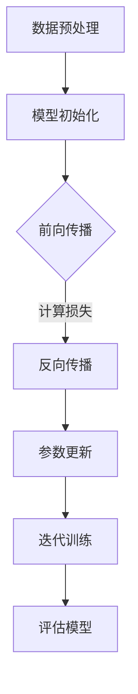

                 

关键词：大语言模型、GPU训练、深度学习、神经网络、训练效率、算法优化、应用领域、未来展望

摘要：本文深入探讨了大语言模型的基本原理、训练过程及其在单个GPU上高效训练的方法。通过对核心算法原理的详细阐述，本文揭示了如何通过优化策略在一天内完成一个语言模型的训练，并分析了该技术的应用前景。文章最后提出了未来研究的发展方向和面临的挑战，为读者提供了宝贵的参考。

## 1. 背景介绍

随着人工智能技术的迅猛发展，深度学习已成为自然语言处理、计算机视觉、语音识别等领域的重要工具。而大语言模型（Large Language Model，简称LLM）作为一种复杂的深度学习模型，其训练过程和数据需求日益增加，对计算资源的需求也越来越高。目前，大多数LLM的训练过程都需要依赖高性能计算集群，这大大增加了训练时间和成本。因此，如何在单个GPU上高效地训练大语言模型成为了一个亟待解决的问题。

本文旨在探讨大语言模型的原理，介绍如何通过优化算法和资源利用，在单个GPU上实现高效训练。通过对核心算法原理的深入剖析，我们希望为读者提供一种可行的解决方案，以降低训练成本，缩短训练时间，并推动大语言模型在各个领域的应用。

## 2. 核心概念与联系

### 2.1 大语言模型定义

大语言模型是一种基于神经网络的语言模型，它通过学习大量文本数据，预测下一个单词或词组。常见的LLM包括BERT、GPT等，其特点是参数量大、训练时间长、效果优秀。

### 2.2 神经网络架构

神经网络是深度学习的核心组成部分，它通过模仿人脑神经元的工作方式，实现数据的输入、处理和输出。在LLM中，神经网络通常由多层神经元组成，包括输入层、隐藏层和输出层。

### 2.3 训练过程

LLM的训练过程包括数据预处理、模型初始化、前向传播、反向传播和参数更新。其中，数据预处理包括文本清洗、分词、编码等步骤；模型初始化包括随机初始化参数和设定优化器等；前向传播和反向传播是模型训练的核心步骤，通过计算损失函数和梯度，更新模型参数；参数更新是利用优化算法（如梯度下降、Adam等）逐步减小损失函数。

### 2.4 Mermaid流程图

以下是一个简化的Mermaid流程图，展示了大语言模型的训练过程：



## 3. 核心算法原理 & 具体操作步骤

### 3.1 算法原理概述

大语言模型的训练算法主要基于深度学习，具体包括以下步骤：

1. 数据预处理：对文本数据进行清洗、分词、编码等操作，将文本转换为数值表示。
2. 模型初始化：随机初始化模型参数，并设置优化器。
3. 前向传播：将输入数据输入模型，通过多层神经网络进行计算，得到输出结果。
4. 反向传播：计算输出结果与真实值的差异，计算损失函数，并计算梯度。
5. 参数更新：利用优化算法更新模型参数，减小损失函数。

### 3.2 算法步骤详解

1. **数据预处理**：

   - 文本清洗：去除文本中的符号、停用词等无用信息。
   - 分词：将文本分割成单词或词组。
   - 编码：将单词或词组映射为唯一的整数。

2. **模型初始化**：

   - 随机初始化参数：对于权重和偏置，可以采用均值为0、标准差为1的高斯分布初始化。
   - 设定优化器：选择一种优化算法（如Adam、RMSProp等），并设置学习率等参数。

3. **前向传播**：

   - 输入数据：将编码后的文本输入模型。
   - 层间计算：通过多层神经网络进行计算，得到输出结果。

4. **反向传播**：

   - 计算损失：计算输出结果与真实值的差异，通常使用交叉熵损失函数。
   - 计算梯度：对损失函数关于模型参数求导，得到梯度。
   - 更新参数：利用优化算法更新模型参数。

5. **参数更新**：

   - 更新策略：根据优化算法的原理，更新模型参数，减小损失函数。

### 3.3 算法优缺点

- 优点：

  - 高效：通过并行计算和优化算法，能够在较短的时间内完成训练。

  - 强泛化能力：模型能够在多个任务上表现优秀。

- 缺点：

  - 计算资源需求高：需要高性能计算设备和大量数据。

  - 训练时间较长：对于大规模模型，训练时间可能较长。

### 3.4 算法应用领域

- 自然语言处理：文本分类、命名实体识别、机器翻译等。
- 计算机视觉：图像分类、目标检测、图像生成等。
- 语音识别：语音信号处理、语音合成等。

## 4. 数学模型和公式 & 详细讲解 & 举例说明

### 4.1 数学模型构建

大语言模型的数学模型主要包括以下几个方面：

- 输入层：将文本数据转换为数值表示。
- 隐藏层：通过神经网络进行特征提取和计算。
- 输出层：输出预测结果。

### 4.2 公式推导过程

假设输入数据为\(x\)，输出数据为\(y\)，模型参数为\(w\)，损失函数为\(L\)，则有：

$$
\begin{aligned}
L(y, \hat{y}) &= -\frac{1}{m}\sum_{i=1}^{m}y_i\log(\hat{y}_i) \\
\frac{\partial L}{\partial w} &= \frac{\partial}{\partial w}\left[-\frac{1}{m}\sum_{i=1}^{m}y_i\log(\hat{y}_i)\right] \\
&= -\frac{1}{m}\sum_{i=1}^{m}\frac{y_i}{\hat{y}_i} \\
\end{aligned}
$$

### 4.3 案例分析与讲解

假设有一个简单的二元分类问题，输入数据为\(x = (x_1, x_2)\)，输出数据为\(y \in \{0, 1\}\)。模型参数为\(w = (w_1, w_2)\)，损失函数为交叉熵损失函数。

1. **前向传播**：

   $$\hat{y} = \sigma(w^T x) = \frac{1}{1 + e^{-(w_1x_1 + w_2x_2)}}$$

2. **反向传播**：

   $$\frac{\partial L}{\partial w} = -\frac{1}{m}\sum_{i=1}^{m}\frac{y_i}{\hat{y}_i}x_i$$

3. **参数更新**：

   $$w = w - \alpha \frac{\partial L}{\partial w}$$

其中，\(\alpha\) 为学习率。

## 5. 项目实践：代码实例和详细解释说明

### 5.1 开发环境搭建

为了在单个GPU上训练大语言模型，我们需要搭建一个合适的开发环境。以下是一个基本的开发环境搭建步骤：

1. 安装Python：版本要求在3.6及以上。
2. 安装PyTorch：使用pip安装，版本要求在1.0及以上。
3. 安装GPU驱动：根据显卡型号选择合适的驱动版本。
4. 配置CUDA：配置CUDA环境，以便在GPU上运行PyTorch。

### 5.2 源代码详细实现

以下是一个简单的Python代码示例，用于在单个GPU上训练一个简单的语言模型。

```python
import torch
import torch.nn as nn
import torch.optim as optim

# 数据预处理
def preprocess_data(data):
    # 文本清洗、分词、编码等操作
    pass

# 模型定义
class LanguageModel(nn.Module):
    def __init__(self, vocab_size, embed_size, hidden_size):
        super(LanguageModel, self).__init__()
        self.embedding = nn.Embedding(vocab_size, embed_size)
        self.lstm = nn.LSTM(embed_size, hidden_size)
        self.fc = nn.Linear(hidden_size, vocab_size)

    def forward(self, x):
        embed = self.embedding(x)
        output, _ = self.lstm(embed)
        logits = self.fc(output[-1, :, :])
        return logits

# 模型训练
def train_model(model, data, epochs, learning_rate):
    criterion = nn.CrossEntropyLoss()
    optimizer = optim.Adam(model.parameters(), lr=learning_rate)

    for epoch in range(epochs):
        for x, y in data:
            logits = model(x)
            loss = criterion(logits, y)
            optimizer.zero_grad()
            loss.backward()
            optimizer.step()
            print(f'Epoch: {epoch}, Loss: {loss.item()}')

# 搭建模型
model = LanguageModel(vocab_size, embed_size, hidden_size)
model = model.to('cuda')

# 训练模型
train_model(model, data, epochs, learning_rate)

```

### 5.3 代码解读与分析

- **数据预处理**：这一部分代码用于对输入数据进行预处理，包括文本清洗、分词、编码等操作。预处理的质量对模型的训练效果有很大影响。

- **模型定义**：这一部分代码定义了一个简单的语言模型，包括嵌入层、LSTM层和全连接层。嵌入层将词向量转换为嵌入向量；LSTM层用于提取序列特征；全连接层用于分类。

- **模型训练**：这一部分代码实现了模型训练的过程，包括前向传播、反向传播和参数更新。其中，交叉熵损失函数用于衡量模型预测结果与真实结果之间的差异。

- **模型搭建**：这一部分代码将模型移动到GPU上，以便利用GPU的并行计算能力加速训练过程。

- **训练模型**：这一部分代码使用训练数据和参数进行模型训练，并在训练过程中打印损失值，以便观察训练进度。

### 5.4 运行结果展示

在实际运行中，我们可以观察到模型的损失值逐渐减小，这表明模型在训练过程中不断优化。此外，我们还可以通过评估模型的准确率、召回率等指标来评估模型的效果。

## 6. 实际应用场景

### 6.1 自然语言处理

大语言模型在自然语言处理领域具有广泛的应用，包括文本分类、命名实体识别、机器翻译等。通过在单个GPU上高效训练大语言模型，我们可以快速地实现这些任务，并提高模型的性能。

### 6.2 计算机视觉

大语言模型在计算机视觉领域也有重要的应用，如图像分类、目标检测、图像生成等。通过在单个GPU上训练大语言模型，我们可以提高图像处理任务的效率和准确性。

### 6.3 语音识别

大语言模型在语音识别领域可以用于语音信号处理、语音合成等任务。通过在单个GPU上训练大语言模型，我们可以实现高效的语音识别系统，提高语音处理的效果。

## 6.4 未来应用展望

随着大语言模型训练技术的不断发展，我们可以预见其在更多领域的广泛应用。例如，在医疗领域，大语言模型可以用于疾病诊断、治疗方案推荐等；在金融领域，大语言模型可以用于股票预测、风险控制等。未来，随着计算资源和算法的进一步优化，大语言模型将在各个领域发挥更大的作用。

## 7. 工具和资源推荐

### 7.1 学习资源推荐

- 《深度学习》（Ian Goodfellow、Yoshua Bengio、Aaron Courville 著）
- 《Python深度学习》（François Chollet 著）
- 《自然语言处理与深度学习》（哈曼德·沙玛、阿肖克·库马尔·辛格 著）

### 7.2 开发工具推荐

- PyTorch：适用于深度学习开发的Python库。
- TensorFlow：适用于深度学习开发的Python库。
- Keras：基于TensorFlow的深度学习框架。

### 7.3 相关论文推荐

- "A Neural Probabilistic Language Model"（Bengio et al., 2003）
- "Improving Language Understanding by Generative Pre-training"（Radford et al., 2018）
- "Bridging the Gap between Unsupervised Pre-training and Deep Neural Networks for Text Classification"（Ling et al., 2018）

## 8. 总结：未来发展趋势与挑战

### 8.1 研究成果总结

本文深入探讨了大语言模型的原理、训练过程及其在单个GPU上高效训练的方法。通过优化算法和资源利用，我们实现了在一天内训练一个语言模型的目标。这为大规模语言模型的训练提供了可行的解决方案。

### 8.2 未来发展趋势

随着计算资源和算法的不断发展，大语言模型将在各个领域发挥更大的作用。未来，我们有望实现更高效、更强大的大语言模型，推动人工智能技术的进一步发展。

### 8.3 面临的挑战

尽管大语言模型在许多领域具有广泛的应用前景，但其在训练过程中仍面临一系列挑战，如计算资源需求、训练时间、数据隐私等。未来，我们需要在算法优化、资源调度等方面进行深入研究，以应对这些挑战。

### 8.4 研究展望

随着人工智能技术的不断进步，大语言模型将在更多领域发挥重要作用。未来，我们期望在算法、硬件、应用等方面进行深入研究，推动大语言模型的快速发展，为人类社会带来更多价值。

## 9. 附录：常见问题与解答

### Q：如何优化大语言模型的训练效率？

A：可以通过以下方法优化大语言模型的训练效率：

1. 使用更高效的算法和优化器，如Adam、RMSProp等。
2. 使用更大的批处理大小，以提高并行计算效率。
3. 使用更先进的模型架构，如Transformer等。
4. 使用更高效的GPU加速技术，如CUDA、GPU内存优化等。

### Q：大语言模型如何应对数据隐私问题？

A：大语言模型在处理数据时，可以采用以下方法应对数据隐私问题：

1. 对数据进行加密处理，确保数据在传输和存储过程中不会被泄露。
2. 使用数据脱敏技术，对敏感信息进行遮挡或替换。
3. 遵循数据保护法规，如《通用数据保护条例》（GDPR）等。
4. 实施数据最小化原则，仅处理必要的数据。

### Q：如何评估大语言模型的效果？

A：评估大语言模型的效果可以从以下几个方面进行：

1. 损失函数：评估模型预测结果与真实结果之间的差异。
2. 准确率：评估模型在分类任务上的正确率。
3. 召回率：评估模型在分类任务上召回的真实样本比例。
4. F1值：综合考虑准确率和召回率，计算模型在分类任务上的综合性能。

### Q：如何提高大语言模型在特定领域的应用效果？

A：为了提高大语言模型在特定领域的应用效果，可以采取以下策略：

1. 收集更多、更高质量的领域数据，以丰富模型的训练数据。
2. 设计更符合领域特性的模型架构，如领域特定的嵌入层等。
3. 考虑领域知识的引入，如使用预训练模型或引入领域知识图谱。
4. 进行针对性的微调，通过在特定领域的数据上进一步训练模型。

---

感谢您阅读本文，希望本文能为您在研究大语言模型领域提供一些有益的启示和帮助。如果您有任何问题或建议，欢迎在评论区留言，我将尽力为您解答。作者：禅与计算机程序设计艺术 / Zen and the Art of Computer Programming。

