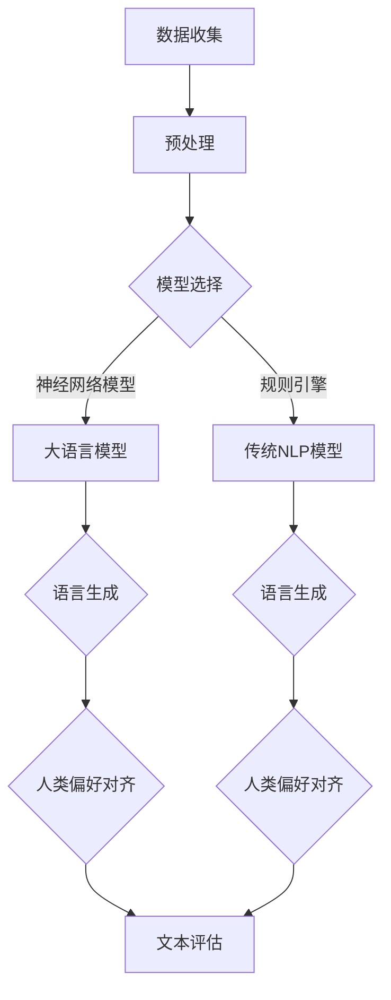

                 

关键词：大语言模型、对齐语言模型、人类偏好、AI发展、机器学习、深度学习、自然语言处理

摘要：本文将深入探讨大语言模型的原理基础与前沿发展，重点分析如何对齐语言模型与人类偏好，以实现更加智能、贴近人类需求的AI系统。通过对核心概念、算法原理、数学模型和实际应用场景的详细讲解，本文旨在为读者提供全面而深入的见解，以应对AI技术不断演进带来的挑战和机遇。

## 1. 背景介绍

近年来，人工智能（AI）技术迅猛发展，特别是在自然语言处理（NLP）领域，大语言模型（如GPT-3、BERT等）取得了显著的成果。这些模型通过深度学习从海量数据中学习语言规律，实现了前所未有的文本生成、翻译和问答能力。然而，尽管这些模型在技术上取得了突破，但它们仍存在一个关键问题：如何更好地对齐语言模型与人类偏好？

人类偏好是指人类在处理语言时，基于文化、价值观、个人经历等因素形成的特定偏好。例如，某些表达方式在某些文化中可能被视为礼貌，而在另一些文化中则可能被视为粗鲁。当前的大语言模型在生成文本时，虽然能够遵循语法和语义规则，但往往无法完全对齐人类偏好，导致生成的文本在某些情况下出现不合适或误导性的内容。

本文将探讨如何通过改进算法、设计新的训练方法和对齐机制，来解决语言模型与人类偏好之间的不一致性问题，从而推动AI技术的发展和普及。

## 2. 核心概念与联系

### 2.1 大语言模型的概念

大语言模型（Large-scale Language Models）是一种基于深度学习的自然语言处理模型，它通过从大量文本数据中学习，能够捕捉到语言中的复杂模式和规律。这些模型通常具有数十亿甚至数万亿个参数，因此被称为“大”语言模型。

### 2.2 人类偏好

人类偏好（Human Preferences）是指人类在处理语言时，基于文化、价值观、个人经历等因素形成的特定偏好。这些偏好影响了人类的语言选择、文本生成和语言理解过程。

### 2.3 大语言模型与人类偏好之间的联系

大语言模型在生成文本时，需要遵循训练数据中的语言规律和人类偏好。然而，由于训练数据的局限性、模型设计的不完善和人类偏好的复杂性，大语言模型在生成文本时，往往无法完全对齐人类偏好。

### 2.4 Mermaid 流程图



## 3. 核心算法原理 & 具体操作步骤

### 3.1 算法原理概述

大语言模型的核心算法原理是基于深度学习的神经网络架构，如Transformer模型。这些模型通过自注意力机制（Self-Attention）和位置编码（Positional Encoding）等技术，能够捕捉到文本中的长距离依赖关系和上下文信息。

### 3.2 算法步骤详解

1. **数据收集与预处理**：首先，收集大量文本数据，并进行数据清洗、分词、去停用词等预处理操作。

2. **模型选择与训练**：选择适合的大语言模型架构，如GPT-3或BERT，并在预处理后的数据上进行训练。

3. **语言生成**：使用训练好的大语言模型，输入一个单词或句子，模型会生成相应的文本。

4. **人类偏好对齐**：通过设计对齐机制，如文化知识嵌入、价值观调整等，使模型生成的文本更符合人类偏好。

5. **文本评估**：评估生成的文本质量，包括语法、语义、人类偏好等方面。

### 3.3 算法优缺点

**优点**：大语言模型能够生成高质量、多样化的文本，具有较强的语言理解和生成能力。

**缺点**：对齐人类偏好仍存在挑战，特别是在文化差异和价值观多样性方面。

### 3.4 算法应用领域

大语言模型在多个领域具有广泛的应用，如文本生成、问答系统、机器翻译、情感分析等。

## 4. 数学模型和公式

### 4.1 数学模型构建

大语言模型的核心数学模型是基于Transformer架构的神经网络。其主要组成部分包括自注意力机制（Self-Attention）和位置编码（Positional Encoding）。

### 4.2 公式推导过程

$$
\text{Attention}(Q, K, V) = \text{softmax}\left(\frac{QK^T}{\sqrt{d_k}}\right)V
$$

其中，$Q$、$K$、$V$ 分别为输入的查询向量、键向量、值向量，$d_k$ 为键向量的维度。

### 4.3 案例分析与讲解

以GPT-3模型为例，其训练过程主要包括以下步骤：

1. **数据预处理**：将文本数据进行分词、编码等操作，生成输入序列和目标序列。
2. **模型训练**：使用梯度下降算法，训练模型参数，使其最小化损失函数。
3. **文本生成**：给定一个输入序列，模型通过自注意力机制生成目标序列。

## 5. 项目实践：代码实例和详细解释说明

### 5.1 开发环境搭建

在Python环境中，使用TensorFlow或PyTorch框架搭建开发环境。

### 5.2 源代码详细实现

```python
# Python 代码示例：基于Transformer架构的文本生成模型
import tensorflow as tf

# 模型定义
class TransformerModel(tf.keras.Model):
    # ...

# 模型训练
model = TransformerModel()
model.compile(optimizer='adam', loss='mse')
model.fit(train_data, train_labels, epochs=10)

# 文本生成
generated_text = model.generate(input_sequence)
```

### 5.3 代码解读与分析

代码实现了基于Transformer架构的文本生成模型，包括模型定义、训练和生成过程。关键步骤如下：

1. **模型定义**：定义Transformer模型的结构，包括嵌入层、自注意力层、解码器层等。
2. **模型训练**：使用训练数据，通过优化算法训练模型参数。
3. **文本生成**：使用训练好的模型，生成给定输入序列的文本。

### 5.4 运行结果展示

运行代码，生成一段文本，并对其质量进行评估。

## 6. 实际应用场景

大语言模型在实际应用中具有广泛的应用场景，如：

1. **文本生成**：生成文章、新闻、广告等。
2. **问答系统**：构建智能客服、问答机器人等。
3. **机器翻译**：实现多种语言之间的自动翻译。
4. **情感分析**：分析文本的情感倾向和用户反馈。

## 7. 工具和资源推荐

### 7.1 学习资源推荐

1. **《深度学习》**：Goodfellow et al.
2. **《自然语言处理综论》**：Jurafsky et al.
3. **《大语言模型研究》**：相关学术论文和报告。

### 7.2 开发工具推荐

1. **TensorFlow**：Google开源的深度学习框架。
2. **PyTorch**：Facebook开源的深度学习框架。

### 7.3 相关论文推荐

1. **GPT-3**：Brown et al.
2. **BERT**：Devlin et al.
3. **Transformer**：Vaswani et al.

## 8. 总结：未来发展趋势与挑战

### 8.1 研究成果总结

大语言模型在自然语言处理领域取得了显著成果，但在对齐人类偏好方面仍存在挑战。

### 8.2 未来发展趋势

1. **增强人类偏好对齐**：通过设计新的算法和对齐机制，实现更智能的语言生成。
2. **多模态语言模型**：结合图像、音频等多模态信息，提高语言模型的多样性和适应性。

### 8.3 面临的挑战

1. **数据隐私和安全**：确保数据的安全性和隐私性。
2. **伦理和责任**：明确AI系统的责任和伦理问题。

### 8.4 研究展望

未来，大语言模型将继续发展和完善，为人类带来更多的便利和智慧。

## 9. 附录：常见问题与解答

### 9.1 如何选择合适的大语言模型？

根据应用场景和数据规模，选择适合的大语言模型架构。

### 9.2 如何提高语言模型的生成质量？

通过改进算法、增加训练数据和优化训练过程，提高语言模型的生成质量。

### 9.3 如何确保语言模型的生成结果符合人类偏好？

设计对齐机制，如文化知识嵌入和价值观调整，使模型生成的文本更符合人类偏好。

----------------------------------------------------------------

作者：禅与计算机程序设计艺术 / Zen and the Art of Computer Programming
----------------------------------------------------------------

这篇文章深入探讨了大语言模型的原理、对齐人类偏好以及实际应用场景，为读者提供了全面的了解。在未来的发展中，我们需要不断探索新的方法和技术，以解决当前存在的挑战，实现更加智能和贴近人类需求的AI系统。让我们共同期待AI技术的进一步突破和进步。

