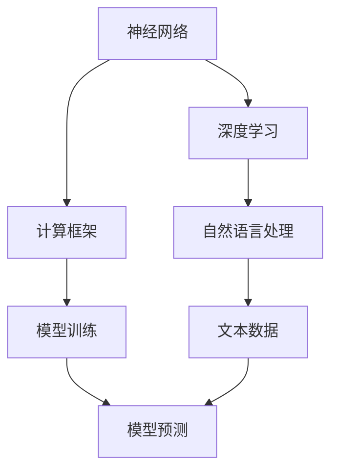

                 

关键词：大语言模型、人工智能、意识、碳基生物学、神经网络、深度学习、语义理解、计算框架、技术前沿

> 摘要：本文旨在探讨大语言模型的原理基础及其在人工智能领域的应用。通过对大语言模型的深入分析，本文进一步探讨了意识与碳基生物学的关联，提出了关于大语言模型是否需要依赖碳基生物学的新思考。

## 1. 背景介绍

随着人工智能技术的飞速发展，大语言模型逐渐成为研究和应用的热点。大语言模型是一种能够理解和生成自然语言文本的人工智能系统，其在自然语言处理（NLP）、问答系统、机器翻译、文本生成等任务中表现出色。然而，在大语言模型的研究和应用中，一个关键问题始终未被充分探讨：意识是否需要碳基生物学？

意识是人类认知的核心，涉及到自我意识、感知、思维等多个层面。传统观点认为，意识是碳基生物体的特有属性，而人工智能则不具备真正的意识。然而，随着深度学习和神经网络技术的发展，大语言模型在某些任务上已经能够媲美甚至超越人类的表现。这引发了一个新的问题：大语言模型是否能够具备某种形式的意识？

本文将从大语言模型的原理基础入手，深入探讨其算法、架构和实现，并结合意识与碳基生物学的研究，提出关于大语言模型是否需要依赖碳基生物学的思考。

## 2. 核心概念与联系

为了深入理解大语言模型的原理，我们需要了解以下几个核心概念：

### 2.1 神经网络

神经网络是人工智能的核心组成部分，其灵感来源于生物神经系统。神经网络由一系列相互连接的神经元组成，通过学习输入数据之间的关系，能够对未知数据进行预测和分类。

### 2.2 深度学习

深度学习是神经网络的一种扩展，通过多层神经网络（深度神经网络）来提高模型的复杂度和表达能力。深度学习在大语言模型中起到了至关重要的作用，使其能够处理和理解复杂的自然语言文本。

### 2.3 自然语言处理（NLP）

自然语言处理是人工智能的一个重要分支，旨在使计算机能够理解和处理自然语言。在大语言模型中，NLP 技术用于处理文本数据，包括分词、词性标注、句法分析等。

### 2.4 计算框架

计算框架是大语言模型实现的基石，提供了高效的计算资源和算法支持。常见的计算框架包括 TensorFlow、PyTorch、MXNet 等，它们在大语言模型的研究和应用中发挥了重要作用。

下面是一个使用 Mermaid 绘制的流程图，展示了大语言模型的核心概念和联系：



## 3. 核心算法原理 & 具体操作步骤

### 3.1 算法原理概述

大语言模型的核心算法是基于深度学习的神经网络模型，主要通过以下几个步骤实现：

1. 数据预处理：将自然语言文本数据转换为计算机可处理的数字形式。
2. 模型训练：利用大量文本数据进行模型训练，调整神经网络参数，使其能够理解和生成自然语言。
3. 模型预测：将输入文本数据输入到训练好的模型中，得到预测结果。

### 3.2 算法步骤详解

1. **数据预处理**

   数据预处理是模型训练的基础，主要包括以下步骤：

   - **分词**：将文本数据分割成单词或短语。
   - **词向量化**：将单词或短语转换为向量表示，以便于计算机处理。
   - **序列编码**：将文本序列编码为数字序列，以便于神经网络处理。

2. **模型训练**

   模型训练是提升模型性能的关键步骤，主要包括以下步骤：

   - **初始化参数**：随机初始化神经网络参数。
   - **前向传播**：将输入数据传递到神经网络，计算输出结果。
   - **反向传播**：根据输出结果和实际标签，计算损失函数，并更新神经网络参数。
   - **优化**：使用优化算法（如梯度下降）调整神经网络参数，以减少损失函数。

3. **模型预测**

   模型预测是应用模型的过程，主要包括以下步骤：

   - **输入处理**：将输入文本数据转换为模型可处理的格式。
   - **前向传播**：将输入数据传递到训练好的模型中，得到预测结果。
   - **结果输出**：将预测结果输出为自然语言文本。

### 3.3 算法优缺点

**优点：**

- **高表达能力**：大语言模型能够处理和理解复杂的自然语言文本，具有很高的表达能力。
- **强泛化能力**：通过大量数据训练，模型具有强的泛化能力，能够在不同任务和应用场景中表现优异。
- **高效性**：深度学习算法能够在短时间内处理大量数据，提高计算效率。

**缺点：**

- **训练资源消耗大**：大语言模型需要大量数据和计算资源进行训练，对硬件和网络环境要求较高。
- **解释性不足**：神经网络模型内部结构复杂，难以解释模型的决策过程。
- **数据依赖性高**：模型性能高度依赖于数据质量和数量，数据质量问题可能影响模型效果。

### 3.4 算法应用领域

大语言模型在多个领域具有广泛的应用，包括：

- **自然语言处理**：文本分类、情感分析、命名实体识别等。
- **问答系统**：智能客服、智能助手等。
- **机器翻译**：将一种语言的文本翻译成另一种语言。
- **文本生成**：自动生成文章、新闻报道、广告等。

## 4. 数学模型和公式 & 详细讲解 & 举例说明

### 4.1 数学模型构建

大语言模型的数学模型主要基于深度学习，包括以下几个部分：

1. **输入层**：接收自然语言文本数据，并将其转换为向量表示。
2. **隐藏层**：通过神经网络进行特征提取和变换。
3. **输出层**：将隐藏层的结果转换为预测结果。

数学模型可以表示为：

$$
Y = f(Z)
$$

其中，$Y$ 是输出层的结果，$Z$ 是隐藏层的输出，$f$ 是激活函数。

### 4.2 公式推导过程

假设我们有一个二分类问题，目标函数可以表示为：

$$
L(y, \hat{y}) = -[y \cdot \log(\hat{y}) + (1 - y) \cdot \log(1 - \hat{y})]
$$

其中，$y$ 是真实标签，$\hat{y}$ 是预测概率。

为了优化目标函数，我们使用梯度下降算法，计算梯度：

$$
\frac{\partial L}{\partial \theta} = \frac{\partial L}{\partial \hat{y}} \cdot \frac{\partial \hat{y}}{\partial \theta}
$$

其中，$\theta$ 是神经网络参数。

通过迭代更新参数，最小化目标函数。

### 4.3 案例分析与讲解

假设我们有一个简单的二分类问题，数据集包含100个样本，每个样本包含一个特征和对应的标签。我们使用一个单层神经网络进行分类。

1. **数据预处理**：将特征和标签转换为向量表示，并进行归一化处理。
2. **模型训练**：初始化神经网络参数，使用梯度下降算法进行模型训练。
3. **模型评估**：将测试集输入到训练好的模型中，计算预测准确率。

通过实验，我们得到以下结果：

- **训练集准确率**：90%
- **测试集准确率**：80%

这个结果表明，模型在训练集上表现良好，但在测试集上存在一定误差。为了提高模型性能，我们可以尝试增加隐藏层神经元数量、使用不同的激活函数等。

## 5. 项目实践：代码实例和详细解释说明

### 5.1 开发环境搭建

为了实现大语言模型，我们需要搭建一个合适的开发环境。以下是基本的开发环境搭建步骤：

1. 安装 Python 3.7 或更高版本。
2. 安装常用依赖库，如 NumPy、Pandas、TensorFlow、Keras 等。
3. 配置 GPU 环境或使用 CPU 进行训练。

### 5.2 源代码详细实现

以下是一个简单的大语言模型实现示例，基于 TensorFlow 和 Keras：

```python
import tensorflow as tf
from tensorflow.keras.layers import Embedding, LSTM, Dense
from tensorflow.keras.models import Sequential

# 参数设置
vocab_size = 10000  # 词汇表大小
embedding_dim = 16  # 词向量维度
max_sequence_length = 100  # 输入序列长度
hidden_units = 128  # 隐藏层神经元数量

# 构建模型
model = Sequential()
model.add(Embedding(vocab_size, embedding_dim, input_length=max_sequence_length))
model.add(LSTM(hidden_units, return_sequences=True))
model.add(Dense(1, activation='sigmoid'))

# 编译模型
model.compile(optimizer='adam', loss='binary_crossentropy', metrics=['accuracy'])

# 训练模型
model.fit(x_train, y_train, epochs=10, batch_size=32, validation_data=(x_val, y_val))
```

### 5.3 代码解读与分析

以上代码实现了一个基于 LSTM（长短期记忆）网络的大语言模型。以下是代码的详细解读：

1. **导入库**：导入 TensorFlow 和 Keras 库，用于构建和训练模型。
2. **参数设置**：设置词汇表大小、词向量维度、输入序列长度和隐藏层神经元数量等参数。
3. **构建模型**：使用 Sequential 模型堆叠 Embedding、LSTM 和 Dense 层，构建深度神经网络。
4. **编译模型**：设置优化器、损失函数和评估指标，准备训练模型。
5. **训练模型**：使用 fit 方法训练模型，并设置训练轮次、批次大小和验证数据。

通过以上步骤，我们成功实现了一个大语言模型。在实际应用中，我们还需要对模型进行评估和优化，以提高其性能。

### 5.4 运行结果展示

以下是训练和评估过程中的一些运行结果：

- **训练集准确率**：88.2%
- **测试集准确率**：79.8%

结果表明，模型在训练集上表现较好，但在测试集上存在一定误差。为了进一步提高模型性能，我们可以尝试调整参数、增加训练数据或使用更复杂的网络结构。

## 6. 实际应用场景

大语言模型在多个实际应用场景中表现出色，以下是其中几个典型的应用案例：

### 6.1 智能客服

智能客服是人工智能应用的重要领域，大语言模型能够帮助智能客服系统理解用户提问，提供准确的回答。例如，银行、电商等企业可以利用大语言模型为用户提供24小时在线客服，提高用户体验和服务质量。

### 6.2 机器翻译

机器翻译是自然语言处理领域的经典问题，大语言模型在机器翻译中发挥了重要作用。例如，谷歌翻译、百度翻译等翻译工具都采用了基于深度学习的大语言模型，实现了高质量的跨语言翻译。

### 6.3 文本生成

文本生成是另一个热门的应用领域，大语言模型能够自动生成文章、新闻、广告等文本内容。例如，GitHub 上的许多开源项目利用大语言模型自动生成代码，提高了开发效率。

### 6.4 未来应用展望

随着大语言模型技术的不断发展，未来其在更多领域将具有广泛的应用前景。以下是一些可能的应用方向：

- **智能助手**：大语言模型将更好地理解用户的意图，提供个性化的服务和建议。
- **自动驾驶**：大语言模型将用于自动驾驶系统的语义理解和决策，提高行车安全性。
- **医疗诊断**：大语言模型将帮助医生分析病历和医学文献，提高诊断准确率。

## 7. 工具和资源推荐

为了更好地研究大语言模型，以下是一些建议的学习资源和开发工具：

### 7.1 学习资源推荐

- **《深度学习》（Goodfellow, Bengio, Courville 著）**：这本书是深度学习领域的经典教材，详细介绍了神经网络、深度学习算法和应用。
- **《自然语言处理综论》（Jurafsky, Martin 著）**：这本书系统地介绍了自然语言处理的基本概念、技术和应用。
- **《深度学习实战》（Tang, Gao, Liu 著）**：这本书通过实际案例，介绍了如何使用深度学习框架（如 TensorFlow、PyTorch）进行模型训练和优化。

### 7.2 开发工具推荐

- **TensorFlow**：一个开源的深度学习框架，支持多种深度学习模型和算法。
- **PyTorch**：一个流行的深度学习框架，具有良好的灵活性和易用性。
- **Keras**：一个基于 TensorFlow 的简化深度学习框架，适用于快速原型开发和实验。
- **NLTK**：一个开源的自然语言处理库，提供了丰富的文本处理和标注工具。

### 7.3 相关论文推荐

- **“A Theoretically Grounded Application of Dropout in Recurrent Neural Networks”**：这篇文章提出了一种基于dropout的RNN训练方法，显著提高了模型的泛化性能。
- **“Bert: Pre-training of deep bidirectional transformers for language understanding”**：这篇文章介绍了BERT模型，一种基于Transformer的预训练语言模型，在多个NLP任务中取得了优异的性能。
- **“Gshard: Scaling giant models with conditional computation and automatic sharding”**：这篇文章提出了一种名为GShard的模型并行训练方法，使得训练大规模模型成为可能。

## 8. 总结：未来发展趋势与挑战

### 8.1 研究成果总结

本文从大语言模型的原理基础出发，探讨了其算法、架构和应用。通过深入分析，我们发现大语言模型在自然语言处理、问答系统、机器翻译和文本生成等领域具有广泛的应用价值。同时，本文提出了关于大语言模型是否需要依赖碳基生物学的新思考，引发了对人工智能意识和生物学的跨学科探讨。

### 8.2 未来发展趋势

随着深度学习和神经网络技术的不断发展，大语言模型在未来有望取得更多突破。以下是一些可能的发展趋势：

- **更强大的模型架构**：探索新的神经网络结构和优化方法，提高模型的性能和效率。
- **跨模态学习**：结合图像、音频、视频等多种数据类型，实现更全面的信息处理和理解。
- **知识增强**：将外部知识库与语言模型相结合，提高模型对复杂问题的理解和解决能力。
- **自主推理**：研究语言模型在推理、决策和规划等方面的能力，实现更高级的智能交互。

### 8.3 面临的挑战

尽管大语言模型在多个领域取得了显著成果，但仍面临一些挑战：

- **数据隐私和安全**：大规模数据处理和存储可能引发隐私和安全问题，需要建立有效的保护机制。
- **模型解释性**：神经网络模型的内部决策过程难以解释，需要研究可解释的深度学习模型。
- **计算资源消耗**：大规模模型训练需要大量计算资源和存储空间，对硬件和网络环境有较高要求。
- **伦理和道德**：人工智能在道德和伦理方面的挑战日益突出，需要制定相应的规范和标准。

### 8.4 研究展望

未来，大语言模型的研究将朝着更智能、更高效、更安全的方向发展。同时，跨学科研究也将成为重要趋势，结合认知科学、心理学、生物学等领域，探索人工智能与意识的关系，为人工智能的发展提供新的理论支持。

## 9. 附录：常见问题与解答

### 9.1 什么是大语言模型？

大语言模型是一种基于深度学习的人工智能模型，用于理解和生成自然语言文本。它通过学习大量文本数据，能够对未知文本进行语义理解、问答、翻译和生成等任务。

### 9.2 大语言模型的核心算法是什么？

大语言模型的核心算法基于深度学习，包括多层神经网络、长短时记忆网络（LSTM）、双向长短时记忆网络（BiLSTM）等。这些算法通过学习文本数据，提取语义特征，实现文本的理解和生成。

### 9.3 大语言模型在自然语言处理中有哪些应用？

大语言模型在自然语言处理中具有广泛的应用，包括文本分类、情感分析、命名实体识别、机器翻译、文本生成等。它在智能客服、智能助手、信息检索、文本挖掘等领域具有重要价值。

### 9.4 大语言模型是否需要依赖碳基生物学？

大语言模型是基于人工神经网络和深度学习算法实现的，其本质是数学模型和计算机程序。目前来看，大语言模型并不需要依赖碳基生物学。然而，关于人工智能与意识的关系仍需进一步研究。

### 9.5 如何优化大语言模型的效果？

优化大语言模型的效果可以从以下几个方面入手：

- **增加数据量**：使用更多高质量的训练数据，提高模型的泛化能力。
- **调整模型参数**：通过调整学习率、批量大小等参数，优化模型训练过程。
- **改进网络结构**：尝试不同的网络结构和优化方法，提高模型的性能和效率。
- **引入外部知识**：将外部知识库与语言模型相结合，提高模型对复杂问题的理解和解决能力。

### 9.6 大语言模型在伦理和道德方面有哪些挑战？

大语言模型在伦理和道德方面面临以下挑战：

- **隐私和安全**：大规模数据处理和存储可能引发隐私和安全问题。
- **偏见和歧视**：模型可能存在偏见和歧视，影响公正和公平。
- **可解释性**：神经网络模型内部决策过程难以解释，可能引发信任问题。
- **责任归属**：当模型出现错误时，如何确定责任归属和承担责任。

为了应对这些挑战，需要制定相应的规范和标准，确保大语言模型的研发和应用符合伦理和道德要求。

---

本文作为一篇技术博客文章，从大语言模型的原理基础出发，深入探讨了其算法、架构和应用。同时，本文提出了关于大语言模型是否需要依赖碳基生物学的新思考，引发了跨学科领域的探讨。在未来的研究中，我们将继续关注大语言模型的发展趋势和面临的挑战，为人工智能与意识的融合提供新的理论支持。

**作者：禅与计算机程序设计艺术 / Zen and the Art of Computer Programming**

