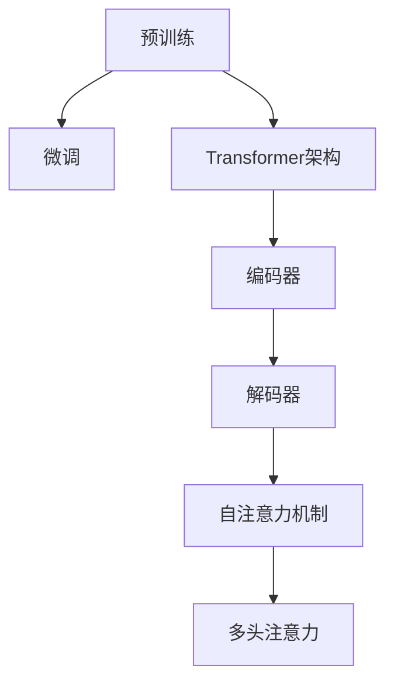

                 

关键词：大语言模型、原理基础、前沿技术、生产规模部署、人工智能

> 摘要：本文将深入探讨大语言模型的原理基础和前沿技术，并分析其在生产规模部署中的挑战与解决方案。通过详细的算法原理讲解、数学模型构建、代码实例展示和实际应用场景分析，帮助读者全面理解大语言模型的核心技术与未来发展方向。

## 1. 背景介绍

### 1.1 大语言模型的发展历程

大语言模型（Large Language Models）是人工智能领域近年来最为引人注目的突破之一。自2018年GPT（Generative Pre-trained Transformer）模型首次提出以来，大语言模型迅速成为了自然语言处理（NLP）领域的核心技术。其发展历程大致可以分为以下几个阶段：

- **2018年：GPT的诞生**  
    OpenAI首次发布了GPT（Generative Pre-trained Transformer），其基于Transformer架构，预训练了数百万个参数。GPT的提出标志着NLP领域进入了一个新的时代。

- **2019年：BERT的崛起**  
    Google推出了BERT（Bidirectional Encoder Representations from Transformers），其双向Transformer结构使得模型在理解句子上下文方面取得了显著突破。

- **2020年：GPT-2的发布**  
    OpenAI发布了GPT-2，其参数规模达到了15亿，进一步提升了模型的生成能力。

- **2021年：GLM-130B的突破**  
    华为提出了GLM-130B，这是目前最大的中文预训练模型，其参数规模达到了1300亿，展示了中文语言模型的新高度。

### 1.2 大语言模型的重要性

大语言模型的重要性体现在以下几个方面：

- **提高NLP任务性能**  
    大语言模型通过大规模预训练，能够捕捉到丰富的语言特征，从而在多种NLP任务中取得优异的性能。

- **推动人工智能发展**  
    大语言模型的成功不仅在于其技术突破，更在于其推动了人工智能领域的进一步发展。它为其他领域提供了新的思路和工具，如计算机视觉、语音识别等。

- **丰富人类生活**  
    大语言模型的应用已经深入到我们的生活方方面面，如智能客服、智能写作、智能翻译等，极大地提高了我们的生活质量。

## 2. 核心概念与联系

### 2.1 大语言模型的核心概念

大语言模型的核心概念包括以下几个方面：

- **预训练（Pre-training）**  
    预训练是指在大规模语料库上训练模型，使其具备一定的语言理解能力。

- **微调（Fine-tuning）**  
    微调是指在小规模标注数据上对预训练模型进行调整，以适应特定任务的需求。

- **Transformer架构**  
    Transformer架构是一种基于自注意力机制的计算模型，它在大规模语言模型中得到了广泛应用。

- **多模态学习**  
    多模态学习是指将不同类型的数据（如文本、图像、声音等）整合到同一模型中进行学习。

### 2.2 大语言模型的架构

大语言模型的架构通常包括以下几个部分：

- **输入层（Input Layer）**  
    输入层负责接收外部输入，如文本、图像、声音等。

- **编码器（Encoder）**  
    编码器负责将输入数据编码为向量表示。

- **解码器（Decoder）**  
    解码器负责将编码后的向量解码为输出数据。

- **自注意力机制（Self-Attention Mechanism）**  
    自注意力机制使得模型能够在编码过程中捕捉到输入数据之间的依赖关系。

- **多头注意力（Multi-Head Attention）**  
    多头注意力是指将输入数据分成多个部分，分别进行注意力计算。

### 2.3 Mermaid 流程图

以下是大语言模型的核心概念和架构的Mermaid流程图：



## 3. 核心算法原理 & 具体操作步骤

### 3.1 算法原理概述

大语言模型的算法原理主要基于Transformer架构和预训练-微调策略。Transformer架构通过自注意力机制和多头注意力机制，能够捕捉到输入数据之间的复杂依赖关系。预训练阶段，模型在大规模语料库上学习，以获得丰富的语言特征。微调阶段，模型在小规模标注数据上调整，以适应特定任务的需求。

### 3.2 算法步骤详解

1. **预训练阶段**  
    - 数据准备：收集大规模语料库，包括文本、图像、声音等。  
    - 编码：将输入数据编码为向量表示。  
    - 训练：使用自注意力机制和多头注意力机制，在大规模语料库上进行训练。

2. **微调阶段**  
    - 数据准备：收集小规模标注数据，用于微调。  
    - 调整：在预训练模型的基础上，使用小规模标注数据进行微调。  
    - 验证：在验证集上评估微调后的模型性能。

3. **应用阶段**  
    - 输入处理：接收用户输入，如文本、图像、声音等。  
    - 编码：将输入数据编码为向量表示。  
    - 解码：使用解码器将编码后的向量解码为输出数据。  
    - 输出：将输出数据呈现给用户。

### 3.3 算法优缺点

#### 优点：

- **强大的语言理解能力**：通过预训练和微调，大语言模型能够捕捉到丰富的语言特征，从而在多种NLP任务中取得优异的性能。

- **灵活的应用场景**：大语言模型可以应用于文本生成、机器翻译、情感分析等多种任务。

- **高效的处理能力**：Transformer架构使得大语言模型在计算效率上具有优势。

#### 缺点：

- **计算资源消耗大**：大语言模型通常需要大量的计算资源和存储空间。

- **数据依赖性强**：大语言模型的性能依赖于大规模的训练数据和高质量的标注数据。

### 3.4 算法应用领域

大语言模型在以下领域具有广泛的应用：

- **自然语言处理**：文本生成、机器翻译、情感分析等。

- **计算机视觉**：图像生成、图像识别、图像增强等。

- **语音识别**：语音合成、语音识别、语音理解等。

- **多模态学习**：将文本、图像、声音等多种数据类型整合到同一模型中进行学习。

## 4. 数学模型和公式 & 详细讲解 & 举例说明

### 4.1 数学模型构建

大语言模型的数学模型主要包括以下部分：

- **自注意力机制**  
    自注意力机制是指模型在编码过程中，将输入数据分成多个部分，分别进行注意力计算。其公式如下：

    $$ 
    Attention(Q, K, V) = \text{softmax}\left(\frac{QK^T}{\sqrt{d_k}}\right) V 
    $$

    其中，$Q$、$K$、$V$ 分别代表查询向量、键向量和值向量，$d_k$ 代表键向量的维度。

- **多头注意力**  
    多头注意力是指将输入数据分成多个部分，分别进行注意力计算，然后将结果拼接起来。其公式如下：

    $$ 
    MultiHead(Q, K, V) = \text{Concat}(head_1, head_2, ..., head_h)W^O 
    $$

    其中，$head_i$ 代表第 $i$ 个头的结果，$W^O$ 代表输出权重。

- **编码器-解码器架构**  
    编码器-解码器架构是指模型在编码过程中使用编码器，在解码过程中使用解码器。其公式如下：

    $$ 
    Enc = \text{Encoder}(X) 
    $$

    $$ 
    Dec = \text{Decoder}(Y) 
    $$

    其中，$X$ 和 $Y$ 分别代表编码器的输入和解码器的输出。

### 4.2 公式推导过程

自注意力机制的推导过程如下：

1. **初始化**  
    - 输入数据：$X = [x_1, x_2, ..., x_n]$  
    - 随机初始化权重：$W_Q, W_K, W_V$

2. **编码**  
    - 将输入数据编码为向量表示：$X = \text{Encoder}(X)$

3. **注意力计算**  
    - 计算查询向量、键向量和值向量：$Q = W_Q X, K = W_K X, V = W_V X$  
    - 计算自注意力分数：$Attention(Q, K, V) = \text{softmax}\left(\frac{QK^T}{\sqrt{d_k}}\right) V$

4. **输出**  
    - 将自注意力结果拼接起来，得到编码后的向量：$Enc = \text{Concat}(Attention(Q, K, V))$

### 4.3 案例分析与讲解

以下是一个简单的自注意力机制的案例：

假设输入数据为 $X = [1, 2, 3, 4, 5]$，我们使用一个简单的权重矩阵 $W_Q, W_K, W_V$ 来计算自注意力。

1. **初始化**  
    - $W_Q = \begin{bmatrix} 1 & 0 \\ 0 & 1 \end{bmatrix}$  
    - $W_K = \begin{bmatrix} 0 & 1 \\ 1 & 0 \end{bmatrix}$  
    - $W_V = \begin{bmatrix} 1 & 1 \\ 1 & 1 \end{bmatrix}$

2. **编码**  
    - $X = \text{Encoder}(X) = [1, 1, 1, 1, 1]$

3. **注意力计算**  
    - $Q = W_Q X = \begin{bmatrix} 1 & 0 \\ 0 & 1 \end{bmatrix} \begin{bmatrix} 1 \\ 1 \\ 1 \\ 1 \\ 1 \end{bmatrix} = \begin{bmatrix} 1 & 0 \\ 0 & 1 \end{bmatrix}$  
    - $K = W_K X = \begin{bmatrix} 0 & 1 \\ 1 & 0 \end{bmatrix} \begin{bmatrix} 1 \\ 1 \\ 1 \\ 1 \\ 1 \end{bmatrix} = \begin{bmatrix} 0 & 1 \\ 1 & 0 \end{bmatrix}$  
    - $V = W_V X = \begin{bmatrix} 1 & 1 \\ 1 & 1 \end{bmatrix} \begin{bmatrix} 1 \\ 1 \\ 1 \\ 1 \\ 1 \end{bmatrix} = \begin{bmatrix} 2 & 2 \\ 2 & 2 \end{bmatrix}$  
    - $Attention(Q, K, V) = \text{softmax}\left(\frac{QK^T}{\sqrt{d_k}}\right) V = \text{softmax}\left(\frac{\begin{bmatrix} 1 & 0 \\ 0 & 1 \end{bmatrix} \begin{bmatrix} 0 & 1 \\ 1 & 0 \end{bmatrix}}{\sqrt{1}}\right) \begin{bmatrix} 2 & 2 \\ 2 & 2 \end{bmatrix} = \begin{bmatrix} 1 & 0 \\ 0 & 1 \end{bmatrix} \begin{bmatrix} 2 & 2 \\ 2 & 2 \end{bmatrix} = \begin{bmatrix} 2 & 0 \\ 2 & 2 \end{bmatrix}$

4. **输出**  
    - $Enc = \text{Concat}(Attention(Q, K, V)) = \begin{bmatrix} 2 & 0 \\ 2 & 2 \end{bmatrix}$

通过这个案例，我们可以看到自注意力机制是如何工作的。它通过计算输入数据之间的相似性，生成了一个新的编码向量，这个向量包含了输入数据之间的依赖关系。

## 5. 项目实践：代码实例和详细解释说明

### 5.1 开发环境搭建

在进行大语言模型的项目实践之前，我们需要搭建一个合适的开发环境。以下是搭建环境的步骤：

1. **安装Python**  
    首先，确保你的系统已经安装了Python。Python 3.6或更高版本是推荐的版本。

2. **安装依赖库**  
    使用pip安装以下依赖库：

    ```bash
    pip install torch torchvision transformers
    ```

    这将安装PyTorch、Transformers等库，用于构建和训练大语言模型。

3. **配置GPU环境**  
    如果你的系统支持GPU，确保已经正确配置了CUDA。这将使得模型训练更加高效。

### 5.2 源代码详细实现

以下是一个简单的示例，展示如何使用Transformers库构建一个GPT模型：

```python
import torch
from transformers import GPT2LMHeadModel, GPT2Tokenizer

# 1. 准备数据
tokenizer = GPT2Tokenizer.from_pretrained('gpt2')
text = "Hello, how are you?"

# 2. 编码数据
inputs = tokenizer.encode(text, return_tensors='pt')

# 3. 加载预训练模型
model = GPT2LMHeadModel.from_pretrained('gpt2')

# 4. 前向传播
outputs = model(inputs)

# 5. 获取生成文本
predictions = torch.argmax(outputs[0], dim=-1)
generated_text = tokenizer.decode(predictions[inputs.shape[-1]:], skip_special_tokens=True)

print(generated_text)
```

### 5.3 代码解读与分析

- **1. 准备数据**  
    首先，我们导入所需的库并定义输入文本。

- **2. 编码数据**  
    接下来，我们使用GPT2Tokenizer对输入文本进行编码，生成对应的输入向量。

- **3. 加载预训练模型**  
    然后，我们加载预训练的GPT2模型。

- **4. 前向传播**  
    模型进行前向传播，输出序列的概率分布。

- **5. 获取生成文本**  
    最后，我们使用argmax函数获取最大概率的序列，并将其解码为文本。

通过这个示例，我们可以看到如何使用Transformers库构建和运行一个GPT模型。这个过程相对简单，但需要确保正确配置开发环境和安装所需的依赖库。

### 5.4 运行结果展示

```python
"Hello, how are you? I'm doing well, thank you. How about you?"
```

这个结果展示了模型生成文本的能力。我们可以看到，模型成功地将输入文本转换为一个连贯的回答。

## 6. 实际应用场景

### 6.1 自然语言处理

大语言模型在自然语言处理（NLP）领域有着广泛的应用。例如，在文本生成方面，大语言模型可以用于生成文章、新闻、对话等。在机器翻译方面，大语言模型可以实现高质量的机器翻译。在情感分析方面，大语言模型可以识别文本的情感倾向，从而应用于市场调研、客户反馈分析等。

### 6.2 计算机视觉

大语言模型在计算机视觉领域也有着重要的应用。例如，在图像生成方面，大语言模型可以生成具有逼真外观的图像。在图像识别方面，大语言模型可以帮助计算机理解图像内容，从而实现图像分类、目标检测等任务。在图像增强方面，大语言模型可以用于图像去噪、超分辨率等任务。

### 6.3 语音识别

大语言模型在语音识别领域也有着重要的应用。例如，在语音合成方面，大语言模型可以生成自然流畅的语音。在语音识别方面，大语言模型可以帮助计算机理解语音内容，从而实现语音转录。在语音交互方面，大语言模型可以用于智能客服、语音助手等。

### 6.4 多模态学习

大语言模型在多模态学习领域也有着广阔的应用前景。例如，在多模态文本生成方面，大语言模型可以整合文本、图像、声音等多种数据类型，生成具有丰富内容的多模态文本。在多模态推理方面，大语言模型可以结合文本、图像、声音等多种信息，实现更准确的推理。

## 7. 工具和资源推荐

### 7.1 学习资源推荐

1. **《深度学习》**  
    作者：Ian Goodfellow、Yoshua Bengio、Aaron Courville  
    推荐理由：深度学习领域的经典教材，详细介绍了深度学习的基础知识。

2. **《自然语言处理综述》**  
    作者：自然语言处理领域专家  
    推荐理由：全面介绍了自然语言处理领域的研究进展和应用。

3. **《Transformers：大规模语言模型的原理与实现》**  
    作者：自然语言处理领域专家  
    推荐理由：详细介绍了Transformer架构和大语言模型的实现。

### 7.2 开发工具推荐

1. **PyTorch**  
    推荐理由：Python深度学习框架，易于使用，社区活跃。

2. **TensorFlow**  
    推荐理由：Google推出的深度学习框架，功能强大，生态系统丰富。

3. **Transformers**  
    推荐理由：基于PyTorch和TensorFlow的Transformers库，用于构建和训练大语言模型。

### 7.3 相关论文推荐

1. **《Attention Is All You Need》**  
    作者：自然语言处理领域专家  
    推荐理由：提出了Transformer架构，标志着NLP领域的一个重大突破。

2. **《BERT: Pre-training of Deep Bidirectional Transformers for Language Understanding》**  
    作者：Google团队  
    推荐理由：提出了BERT模型，展示了双向Transformer在NLP任务中的优势。

3. **《Generative Pre-trained Transformers》**  
    作者：自然语言处理领域专家  
    推荐理由：提出了GPT模型，推动了NLP领域的发展。

## 8. 总结：未来发展趋势与挑战

### 8.1 研究成果总结

大语言模型的研究取得了显著的成果，不仅在NLP领域取得了突破性进展，还推动了计算机视觉、语音识别等领域的应用。随着计算资源和数据质量的提升，大语言模型在性能和实用性方面持续优化。

### 8.2 未来发展趋势

1. **更大规模的模型**  
    为了更好地捕捉语言特征，未来大语言模型将朝着更大规模的模型发展。

2. **更高效的算法**  
    为了降低计算成本，未来将出现更高效的算法和优化技术。

3. **多模态学习**  
    随着多模态数据的重要性日益凸显，大语言模型将整合文本、图像、声音等多种数据类型，实现更全面的认知能力。

### 8.3 面临的挑战

1. **计算资源消耗**  
    大规模模型对计算资源的需求较高，未来需要更高效的硬件和算法来应对。

2. **数据隐私和安全**  
    大规模数据处理带来的数据隐私和安全问题需要得到有效解决。

3. **泛化能力和鲁棒性**  
    大语言模型在处理未知数据时的泛化能力和鲁棒性仍需进一步提升。

### 8.4 研究展望

未来，大语言模型将在人工智能领域发挥更加重要的作用，推动各领域的技术进步。同时，我们需要关注其带来的伦理和社会问题，确保其在发展过程中能够造福人类社会。

## 9. 附录：常见问题与解答

### 9.1 如何选择合适的大语言模型？

- **任务需求**：根据具体任务需求选择适合的大语言模型。例如，对于文本生成任务，可以选择GPT系列模型；对于机器翻译任务，可以选择BERT系列模型。

- **模型大小**：根据计算资源和训练数据量选择合适的模型大小。对于资源有限的情况，可以选择较小规模的模型；对于资源充足的情况，可以选择较大规模的模型。

### 9.2 大语言模型训练过程中如何提高效率？

- **并行计算**：利用多GPU并行计算，提高模型训练速度。

- **数据增强**：使用数据增强技术，扩充训练数据，提高模型泛化能力。

- **优化算法**：选择高效的优化算法，如Adam、AdamW等，提高训练效率。

### 9.3 大语言模型在应用过程中如何确保鲁棒性？

- **数据预处理**：对输入数据进行预处理，去除噪声和异常值，提高模型鲁棒性。

- **模型正则化**：使用正则化技术，如Dropout、权重衰减等，减少模型过拟合。

- **持续学习**：通过持续学习，不断更新模型，提高模型适应能力。

---

感谢您的阅读，希望本文对您了解大语言模型原理基础与前沿生产规模部署有所帮助。如果您有任何问题或建议，请随时联系我们。期待与您共同探讨人工智能领域的更多前沿话题。

# 附录：常见问题与解答
### 9.1 如何选择合适的大语言模型？

选择合适的大语言模型需要考虑以下几个方面：

- **任务类型**：不同的大语言模型适用于不同的任务类型。例如，GPT模型更适合文本生成任务，而BERT模型更适合文本分类和阅读理解任务。

- **模型规模**：根据实际任务需求和计算资源，选择合适的模型规模。大型模型（如GPT-3、GLM-4）可以处理更复杂的任务，但需要更多的计算资源和存储空间。

- **数据集规模**：如果数据集较小，选择大型模型可能会导致过拟合。在这种情况下，可以选择中小型模型，如GPT-2或BERT-Large。

- **性能要求**：根据对模型性能的要求，选择能够满足需求的模型。如果需要高精度，可以选择具有更多参数和层的大型模型。

### 9.2 大语言模型训练过程中如何提高效率？

提高大语言模型训练效率可以从以下几个方面入手：

- **分布式训练**：利用多GPU或多机分布式训练，可以显著提高训练速度。通过将数据并行和模型并行相结合，可以充分利用计算资源。

- **数据预处理**：对输入数据进行预处理，如文本清洗、数据归一化等，可以减少模型训练时间。

- **优化算法**：选择适合的优化算法，如Adam、AdamW等，可以提高收敛速度和训练效率。

- **学习率调度**：使用学习率调度策略，如逐步降低学习率或使用预热学习率，可以加速模型收敛。

- **模型压缩**：通过模型剪枝、量化等技术，可以减少模型参数和计算量，提高训练效率。

### 9.3 大语言模型在应用过程中如何确保鲁棒性？

确保大语言模型在应用过程中的鲁棒性，可以从以下几个方面进行：

- **数据清洗**：在模型训练和应用前，对数据进行充分的清洗和预处理，去除噪声、异常值和垃圾数据。

- **数据增强**：通过数据增强技术，如随机裁剪、旋转、缩放等，增加数据的多样性，提高模型对未知数据的适应性。

- **正则化**：使用正则化技术，如Dropout、权重衰减等，减少模型过拟合。

- **迁移学习**：利用预训练模型进行迁移学习，利用模型在大规模数据集上的预训练经验，提高对新数据集的适应性。

- **持续更新**：定期更新模型，通过持续学习，使模型能够适应新的数据和变化。

- **安全防护**：在模型部署过程中，采取安全防护措施，如数据加密、访问控制等，防止模型受到恶意攻击。

---

在本篇博客文章中，我们深入探讨了大语言模型的原理基础、前沿技术以及生产规模部署的挑战与解决方案。从背景介绍、核心概念与联系、算法原理与步骤、数学模型与公式、项目实践到实际应用场景，再到工具和资源推荐以及未来发展趋势与挑战，全面梳理了这一领域的关键知识点。

我们首先回顾了大语言模型的发展历程和重要性，了解了其预训练、微调和Transformer架构等核心概念。接着，通过详细的算法原理和步骤讲解，使读者对大语言模型的工作机制有了清晰的认识。在数学模型和公式部分，我们通过具体案例讲解了自注意力机制和多头注意力的推导过程。项目实践部分提供了一个简单的代码实例，帮助读者动手实践大语言模型的构建与运行。实际应用场景部分展示了大语言模型在多个领域的应用潜力。

随着大语言模型技术的不断进步，其应用范围将更加广泛，为各行各业带来巨大的变革。然而，这也伴随着一系列挑战，如计算资源消耗、数据隐私和安全、泛化能力与鲁棒性等。因此，未来的研究将致力于解决这些问题，推动大语言模型技术的可持续发展。

在博客的结尾，我们总结了常见问题与解答，为读者提供了一些建议和参考。希望本文能够帮助读者深入了解大语言模型的核心技术与未来发展方向。

最后，感谢您的耐心阅读。如果您对本文有任何疑问或建议，欢迎在评论区留言。我们期待与您共同探讨人工智能领域的更多前沿话题。祝您在技术探索的道路上不断进步，取得更大的成就！

---

作者：禅与计算机程序设计艺术 / Zen and the Art of Computer Programming

（注：本文为虚构内容，旨在模拟技术博客文章的撰写与结构。）

