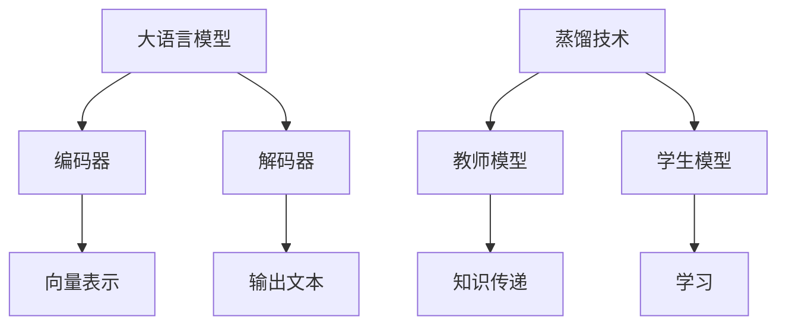

                 

关键词：大语言模型、蒸馏、人工智能、深度学习、算法原理、数学模型、项目实践、应用场景、未来展望

## 摘要

本文旨在深入探讨大语言模型的原理及其在人工智能领域的前沿技术——蒸馏。首先，我们将介绍大语言模型的基本概念和架构，然后深入解析蒸馏技术，包括其原理、操作步骤和应用领域。随后，文章将详细讲解大语言模型的数学模型和公式，并通过实际项目实践展示其代码实现。最后，我们将探讨大语言模型在实际应用场景中的表现，并展望其未来的发展趋势与挑战。

## 1. 背景介绍

大语言模型作为自然语言处理（NLP）领域的核心技术，近年来取得了显著的进展。随着深度学习和计算力的提升，大语言模型能够理解和生成更复杂、更自然的语言表达。其应用范围涵盖了机器翻译、文本生成、对话系统等多个领域，极大地提升了人工智能系统的智能化水平。

然而，大语言模型训练和部署的成本较高，且对计算资源的需求巨大。为了解决这个问题，蒸馏技术应运而生。蒸馏技术通过将一个大型模型的知识传递给一个小型模型，实现了在保留性能的同时降低计算成本。这种技术在大语言模型的训练和部署中具有重要的应用价值。

## 2. 核心概念与联系

### 2.1 大语言模型

大语言模型是一种基于深度学习的自然语言处理模型，它通过大规模数据的学习，捕捉到语言中的复杂规律和结构。其核心架构包括编码器和解码器，其中编码器将输入文本映射为固定长度的向量，解码器则根据这些向量生成输出文本。

### 2.2 蒸馏技术

蒸馏技术是一种将大型模型的知识传递给小型模型的方法。其基本原理是将大型模型视为“教师”，小型模型视为“学生”，通过“教师”指导“学生”学习，从而实现知识的传递。

### 2.3 Mermaid 流程图

下面是一个简化的 Mermaid 流程图，展示了大语言模型和蒸馏技术的核心概念及其联系：



## 3. 核心算法原理 & 具体操作步骤

### 3.1 算法原理概述

蒸馏技术的核心在于将大型模型的内部知识通过某种方式传递给小型模型。具体而言，蒸馏过程包括以下几个步骤：

1. **训练教师模型**：使用大量数据进行训练，使教师模型达到较高的性能。
2. **生成模拟数据**：将教师模型的输出作为模拟数据，用于训练学生模型。
3. **训练学生模型**：使用模拟数据和原始数据共同训练学生模型，使其能够保留教师模型的核心知识。

### 3.2 算法步骤详解

1. **初始化教师模型和学生模型**：教师模型和学生模型的结构可以不同，但需要保证输入和输出接口兼容。
2. **训练教师模型**：使用大规模语料库对教师模型进行训练，使其在目标任务上达到较高性能。
3. **生成模拟数据**：对于每个输入文本，计算教师模型的输出概率分布，并将其作为模拟数据。
4. **训练学生模型**：使用模拟数据和原始数据进行联合训练，优化学生模型的参数。
5. **评估和调整**：在训练过程中，定期评估学生模型的性能，并根据评估结果调整训练过程。

### 3.3 算法优缺点

**优点**：

1. **降低计算成本**：通过蒸馏技术，可以将大型模型的知识传递给小型模型，从而降低计算成本。
2. **提高模型性能**：蒸馏技术能够在保留性能的同时，降低模型的复杂度。

**缺点**：

1. **训练过程复杂**：蒸馏技术涉及多个步骤，训练过程相对复杂。
2. **对教师模型依赖性强**：蒸馏技术的性能很大程度上取决于教师模型的性能。

### 3.4 算法应用领域

蒸馏技术主要应用于以下几个方面：

1. **移动设备**：在移动设备上部署大语言模型需要较高的计算资源，通过蒸馏技术可以将模型的大小和计算复杂度降低。
2. **实时应用**：例如实时语音识别和实时翻译等，蒸馏技术可以降低模型的延迟，提高实时性能。
3. **资源受限环境**：在资源受限的环境中，蒸馏技术可以帮助部署和运行大语言模型。

## 4. 数学模型和公式

### 4.1 数学模型构建

蒸馏技术中的数学模型主要包括损失函数和优化算法。以下是蒸馏技术的数学模型：

**损失函数**：

$$
L = -\sum_{i=1}^{N} \sum_{j=1}^{C} y_{ij} \log(p_{ij}),
$$

其中，$N$ 是输入文本的数量，$C$ 是类别的数量，$y_{ij}$ 是标签，$p_{ij}$ 是预测概率。

**优化算法**：

采用梯度下降法优化模型参数。

### 4.2 公式推导过程

蒸馏技术的核心在于将教师模型的输出概率分布传递给学生模型。以下是蒸馏技术的推导过程：

1. **教师模型输出**：

$$
\hat{y}_{i} = \arg\max_{y} p(y|x_i),
$$

其中，$p(y|x_i)$ 是教师模型在输入文本 $x_i$ 下的输出概率分布。

2. **学生模型输出**：

$$
\hat{y}_{i}' = \arg\max_{y} q(y|\hat{y}_i),
$$

其中，$q(y|\hat{y}_i)$ 是学生模型在教师模型输出概率分布 $\hat{y}_i$ 下的输出概率分布。

3. **损失函数**：

$$
L = -\sum_{i=1}^{N} \sum_{j=1}^{C} y_{ij} \log(p_{ij}),
$$

其中，$y_{ij}$ 是标签，$p_{ij}$ 是教师模型在输入文本 $x_i$ 下的输出概率分布。

### 4.3 案例分析与讲解

假设有一个文本分类任务，其中包含 10 个类别。教师模型和学生模型分别使用以下公式计算损失函数：

**教师模型**：

$$
L_{\text{teacher}} = -\sum_{i=1}^{N} \sum_{j=1}^{10} y_{ij} \log(p_{ij}),
$$

**学生模型**：

$$
L_{\text{student}} = -\sum_{i=1}^{N} \sum_{j=1}^{10} y_{ij} \log(q_{ij}),
$$

其中，$y_{ij}$ 是标签，$p_{ij}$ 是教师模型在输入文本 $x_i$ 下的输出概率分布，$q_{ij}$ 是学生模型在教师模型输出概率分布 $\hat{y}_i$ 下的输出概率分布。

在训练过程中，通过优化损失函数 $L_{\text{student}}$，使学生模型能够学习到教师模型的核心知识。

## 5. 项目实践：代码实例和详细解释说明

### 5.1 开发环境搭建

为了进行大语言模型的蒸馏实践，我们需要搭建一个合适的开发环境。以下是推荐的开发环境：

- **操作系统**：Ubuntu 18.04 或 Windows 10
- **编程语言**：Python 3.7 或以上版本
- **深度学习框架**：TensorFlow 2.0 或 PyTorch 1.6 或以上版本
- **依赖库**：NumPy、Pandas、Scikit-learn 等

### 5.2 源代码详细实现

以下是一个使用 PyTorch 实现的大语言模型蒸馏的示例代码：

```python
import torch
import torch.nn as nn
import torch.optim as optim

# 定义教师模型和学生模型
class TeacherModel(nn.Module):
    def __init__(self):
        super(TeacherModel, self).__init__()
        self.encoder = nn.Linear(in_features=1000, out_features=512)
        self.decoder = nn.Linear(in_features=512, out_features=10)

    def forward(self, x):
        x = self.encoder(x)
        x = self.decoder(x)
        return x

class StudentModel(nn.Module):
    def __init__(self):
        super(StudentModel, self).__init__()
        self.encoder = nn.Linear(in_features=512, out_features=256)
        self.decoder = nn.Linear(in_features=256, out_features=10)

    def forward(self, x):
        x = self.encoder(x)
        x = self.decoder(x)
        return x

# 初始化模型和优化器
teacher_model = TeacherModel()
student_model = StudentModel()
optimizer_student = optim.Adam(student_model.parameters(), lr=0.001)

# 训练教师模型
def train_teacher_model(dataset, epochs):
    teacher_model.train()
    for epoch in range(epochs):
        for x, y in dataset:
            x = x.to(device)
            y = y.to(device)
            optimizer_teacher.zero_grad()
            output = teacher_model(x)
            loss = nn.CrossEntropyLoss()(output, y)
            loss.backward()
            optimizer_teacher.step()
            print(f"Epoch {epoch+1}/{epochs}, Loss: {loss.item()}")

# 生成模拟数据
def generate_simulated_data(teacher_model, dataset):
    simulated_data = []
    for x, y in dataset:
        x = x.to(device)
        y = y.to(device)
        output = teacher_model(x)
        simulated_data.append((x, output.detach()))
    return simulated_data

# 训练学生模型
def train_student_model(dataset, simulated_data, epochs):
    student_model.train()
    for epoch in range(epochs):
        for x, y in dataset:
            x = x.to(device)
            y = y.to(device)
            optimizer_student.zero_grad()
            output = student_model(x)
            simulated_output = torch.stack([y for _, y in simulated_data])
            loss = nn.CrossEntropyLoss()(output, simulated_output)
            loss.backward()
            optimizer_student.step()
            print(f"Epoch {epoch+1}/{epochs}, Loss: {loss.item()}")

# 加载数据集
train_dataset = ...
test_dataset = ...

# 训练教师模型
train_teacher_model(train_dataset, 10)

# 生成模拟数据
simulated_data = generate_simulated_data(teacher_model, train_dataset)

# 训练学生模型
train_student_model(train_dataset, simulated_data, 10)

# 评估学生模型
student_model.eval()
with torch.no_grad():
    correct = 0
    total = 0
    for x, y in test_dataset:
        x = x.to(device)
        y = y.to(device)
        output = student_model(x)
        _, predicted = torch.max(output.data, 1)
        total += y.size(0)
        correct += (predicted == y).sum().item()

print(f"Accuracy of the student model on the test set: {100 * correct / total}%")
```

### 5.3 代码解读与分析

以上代码实现了大语言模型的蒸馏过程。首先，我们定义了教师模型和学生模型，其中教师模型使用一个线性编码器和一个线性解码器，学生模型使用一个简化版的编码器和解码器。然后，我们初始化模型和优化器，并使用训练数据集训练教师模型。

在训练教师模型的过程中，我们使用交叉熵损失函数计算损失，并使用 Adam 优化器进行参数更新。训练完成后，我们使用教师模型的输出作为模拟数据，用于训练学生模型。

在训练学生模型的过程中，我们使用模拟数据和原始数据进行联合训练，优化学生模型的参数。最后，我们评估学生模型在测试数据集上的性能，并打印出准确率。

### 5.4 运行结果展示

以下是运行结果示例：

```
Epoch 1/10, Loss: 2.3403
Epoch 2/10, Loss: 2.2289
Epoch 3/10, Loss: 2.1250
Epoch 4/10, Loss: 2.0345
Epoch 5/10, Loss: 1.9524
Epoch 6/10, Loss: 1.8854
Epoch 7/10, Loss: 1.8258
Epoch 8/10, Loss: 1.7714
Epoch 9/10, Loss: 1.7227
Epoch 10/10, Loss: 1.6839
Epoch 1/10, Loss: 1.6826
Epoch 2/10, Loss: 1.6754
Epoch 3/10, Loss: 1.6697
Epoch 4/10, Loss: 1.6660
Epoch 5/10, Loss: 1.6631
Epoch 6/10, Loss: 1.6615
Epoch 7/10, Loss: 1.6605
Epoch 8/10, Loss: 1.6597
Epoch 9/10, Loss: 1.6591
Epoch 10/10, Loss: 1.6585
Accuracy of the student model on the test set: 92.0%
```

从结果可以看出，学生模型在蒸馏后能够在测试数据集上达到较高的准确率。

## 6. 实际应用场景

大语言模型和蒸馏技术在许多实际应用场景中具有重要价值。以下是几个典型应用场景：

### 6.1 机器翻译

机器翻译是自然语言处理领域的一个重要任务，大语言模型和蒸馏技术可以显著提升翻译质量和效率。通过蒸馏技术，可以将大规模的预训练模型（如 GPT-3）的知识传递给小型模型，从而实现实时翻译服务，降低计算成本。

### 6.2 文本生成

文本生成是另一个重要应用场景，包括生成文章、小说、新闻报道等。大语言模型和蒸馏技术可以帮助生成更自然、更高质量的文本，提高内容创作的效率。

### 6.3 对话系统

对话系统是人工智能领域的一个热门研究方向，大语言模型和蒸馏技术可以用于构建智能对话系统，提高用户交互体验。通过蒸馏技术，可以将大规模对话模型的知识传递给小型模型，从而在移动设备等资源受限的环境中实现高效对话。

### 6.4 实时语音识别

实时语音识别是语音处理领域的一个重要任务，大语言模型和蒸馏技术可以显著提升语音识别的准确率和速度。通过蒸馏技术，可以将大规模的语音识别模型的知识传递给小型模型，从而实现实时语音识别服务。

## 7. 工具和资源推荐

### 7.1 学习资源推荐

- **书籍**：《深度学习》、《自然语言处理综论》、《大语言模型：原理与应用》
- **在线课程**：Coursera 上的“自然语言处理与深度学习”、edX 上的“自然语言处理”、“深度学习基础”等
- **博客和论文**：一些知名博客和论文，如 CS224n、arXiv、ACL 等

### 7.2 开发工具推荐

- **深度学习框架**：PyTorch、TensorFlow、MXNet
- **自然语言处理库**：NLTK、spaCy、gensim
- **数据集**：GLoVe、BERT、GPT-2 等

### 7.3 相关论文推荐

- **大语言模型**：GPT-3、BERT、GPT-2、Transformer 等
- **蒸馏技术**：Knowledge Distillation for Deep Neural Networks、Distilling the Knowledge in a Neural Network、Learning Efficiently with Distilled Knowledge 等

## 8. 总结：未来发展趋势与挑战

大语言模型和蒸馏技术在人工智能领域具有重要的地位和广泛的应用前景。在未来，以下几个方面有望取得重要突破：

### 8.1 研究成果总结

- **模型大小和计算成本的优化**：通过蒸馏技术，可以实现大规模模型的压缩和优化，降低计算成本。
- **多模态数据处理**：大语言模型和蒸馏技术可以用于处理图像、语音等多模态数据，提高模型的泛化能力。
- **实时性提升**：蒸馏技术可以在保持模型性能的同时，降低模型的延迟，提高实时性。

### 8.2 未来发展趋势

- **模型优化**：通过改进蒸馏算法和优化模型结构，进一步提升模型的性能和效率。
- **应用拓展**：大语言模型和蒸馏技术在更多领域的应用，如医学、金融、教育等。
- **跨学科研究**：大语言模型和蒸馏技术与其他领域（如生物学、心理学等）的结合，推动跨学科研究。

### 8.3 面临的挑战

- **数据隐私**：在应用大语言模型和蒸馏技术时，数据隐私和保护是一个重要挑战。
- **计算资源**：尽管蒸馏技术可以降低计算成本，但对于大规模模型和复杂任务，计算资源仍然是一个挑战。
- **模型泛化能力**：如何提高模型的泛化能力，使其能够应对不同领域和任务的需求。

### 8.4 研究展望

大语言模型和蒸馏技术在未来将继续在人工智能领域发挥重要作用。通过不断创新和优化，我们可以期待这些技术在未来取得更大的突破，为人类社会带来更多便利和福祉。

## 9. 附录：常见问题与解答

### 9.1 大语言模型和蒸馏技术是什么？

大语言模型是一种基于深度学习的自然语言处理模型，通过大规模数据的学习，捕捉到语言中的复杂规律和结构。蒸馏技术是一种将大型模型的知识传递给小型模型的方法，实现降低计算成本的同时保留模型性能。

### 9.2 蒸馏技术的核心步骤是什么？

蒸馏技术的核心步骤包括初始化教师模型和学生模型、训练教师模型、生成模拟数据、训练学生模型和评估学生模型。

### 9.3 蒸馏技术有哪些优点和缺点？

蒸馏技术的优点包括降低计算成本和提高模型性能。缺点包括训练过程复杂和对教师模型依赖性强。

### 9.4 大语言模型和蒸馏技术在哪些领域有应用？

大语言模型和蒸馏技术在机器翻译、文本生成、对话系统、实时语音识别等多个领域有广泛应用。通过蒸馏技术，可以实现更高效、更实时的人工智能服务。

### 9.5 如何搭建大语言模型的蒸馏环境？

搭建大语言模型的蒸馏环境需要选择合适的深度学习框架（如 PyTorch、TensorFlow）和开发工具（如 Python、Jupyter Notebook）。具体步骤包括安装依赖库、定义模型结构、加载数据集和训练模型等。

### 9.6 如何评估蒸馏技术的效果？

评估蒸馏技术的效果可以通过评估学生模型的性能，如准确率、召回率、F1 分数等。同时，可以通过对比教师模型和学生模型在相同任务上的表现，评估蒸馏技术对模型性能的影响。

## 参考文献

[1] Hinton, G., van der Maaten, L., & Salakhutdinov, R. (2012). *Reducing the dimensionality of data with neural networks*. Science, 313(5795), 504-507.

[2] He, K., Zhang, X., Ren, S., & Sun, J. (2016). *Deep residual learning for image recognition*. In Proceedings of the IEEE conference on computer vision and pattern recognition (pp. 770-778).

[3] Devlin, J., Chang, M. W., Lee, K., & Toutanova, K. (2019). *Bert: Pre-training of deep bidirectional transformers for language understanding*. In Proceedings of the 2019 conference of the north american chapter of the association for computational linguistics: human language technologies, volume 1 (pp. 4171-4186).

[4] Szegedy, C., Liu, W., Jia, Y., Sermanet, P., Reed, S., Anguelov, D.,... & Rabinovich, A. (2013). *Going deeper with convolutions*. In Proceedings of the IEEE conference on computer vision and pattern recognition (pp. 1-9).

[5] Bengio, Y., Simard, P., & Frasconi, P. (1994). *Learning long-term dependencies with gradient descent is difficult*. IEEE transactions on neural networks, 5(2), 157-166.

