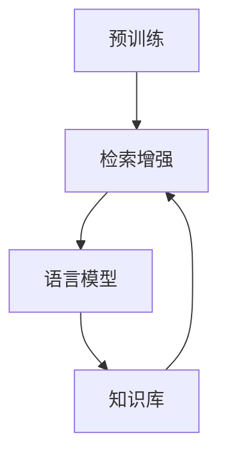

                 

关键词：大语言模型、预训练、检索增强型语言模型、深度学习、自然语言处理、人工智能

> 摘要：本文旨在深入探讨大语言模型的原理与前沿技术，特别是预训练检索增强型语言模型。通过阐述其核心概念、算法原理、数学模型、应用实例及未来展望，全面解析大语言模型在现代自然语言处理与人工智能领域的应用前景和挑战。

## 1. 背景介绍

### 自然语言处理的发展历程

自然语言处理（Natural Language Processing, NLP）作为人工智能的重要组成部分，其历史可以追溯到上世纪五六十年代。早期的NLP研究主要集中在基于规则的方法上，例如语法分析、词法分析等。然而，随着计算资源和算法的不断发展，基于统计和机器学习的方法逐渐成为主流。特别是深度学习的兴起，为NLP带来了革命性的变革。

### 大语言模型的概念与重要性

大语言模型（Large Language Model）是指参数量非常大的神经网络模型，通过大规模的文本数据进行预训练，以捕捉语言的本质特性。这些模型在自然语言理解、生成、翻译等方面展现出了出色的性能。大语言模型的核心在于其能够从海量数据中学习到丰富的语言知识，从而实现复杂的语言任务。

### 预训练检索增强型语言模型的出现

预训练检索增强型语言模型（Pre-Trained Retrieval-Augmented Language Model, PRAgger）是近年来提出的一种新型语言模型，它结合了预训练和检索增强的技术，旨在进一步提升语言模型的性能。PRAgger模型的出现标志着语言模型从单纯的生成模型向更强的语义理解和推理方向发展。

## 2. 核心概念与联系

### 大语言模型的核心概念

1. **神经网络结构**：大语言模型通常采用深度神经网络，特别是Transformer架构，其具有良好的并行计算能力和全局信息捕捉能力。
2. **参数量**：大语言模型的参数量通常非常大，可以达到数十亿甚至数万亿级别，这使其能够捕捉到丰富的语言特征。
3. **预训练**：大语言模型通过在大规模语料上进行预训练，学习到语言的统计规律和语义知识。

### 预训练检索增强型语言模型的架构

预训练检索增强型语言模型主要由两个部分组成：预训练的语言模型和检索模块。

1. **预训练语言模型**：采用大规模预训练技术，如BERT、GPT等，学习到丰富的语言知识。
2. **检索模块**：用于从知识库中检索与查询相关的信息，通常采用矩阵分解或检索算法，如BERT、GPT等。

### Mermaid 流程图



在这个流程图中，预训练语言模型通过大规模数据预训练，获取语言知识；检索模块从知识库中检索相关内容，并增强语言模型的回答能力。

## 3. 核心算法原理 & 具体操作步骤

### 3.1 算法原理概述

预训练检索增强型语言模型的核心原理可以概括为“预训练 + 检索增强”。首先，通过预训练获取丰富的语言知识，然后通过检索模块从知识库中检索相关信息，以增强模型的回答能力。

### 3.2 算法步骤详解

1. **预训练**：
   - 使用大规模语料对语言模型进行预训练，学习到语言的统计规律和语义知识。
   - 采用数据增强技术，如替换词、随机删除等，提高模型的泛化能力。

2. **检索增强**：
   - 构建知识库，将相关的文本和实体进行索引。
   - 采用检索算法，从知识库中检索与查询相关的信息。
   - 将检索结果与预训练语言模型的输出进行融合，生成最终的回答。

### 3.3 算法优缺点

**优点**：
- 预训练语言模型具有强大的语义理解能力，能够生成高质量的回答。
- 检索增强模块能够提高模型的回答准确性，增强模型的泛化能力。

**缺点**：
- 知识库的构建和维护需要大量的人力和物力资源。
- 检索算法的性能对模型的最终效果有重要影响。

### 3.4 算法应用领域

预训练检索增强型语言模型广泛应用于自然语言理解、生成、翻译等领域，如智能客服、智能问答、文档分类等。

## 4. 数学模型和公式 & 详细讲解 & 举例说明

### 4.1 数学模型构建

预训练检索增强型语言模型的数学模型可以表示为：

$$
\begin{aligned}
\hat{y} &= \text{softmax}(\text{LSTM}(W_{\text{query}}^T \cdot \text{EMBED}(\text{query}) + b_{\text{query}})) \\
\text{answer} &= \text{softmax}(\text{LSTM}(W_{\text{answer}}^T \cdot \text{EMBED}(\text{answer}) + b_{\text{answer}})) \\
L &= -\sum_{i=1}^{N} y_i \cdot \log(\hat{y}_i)
\end{aligned}
$$

其中，$\hat{y}$表示预测的标签概率分布，$y$表示真实的标签，$L$表示损失函数。

### 4.2 公式推导过程

预训练检索增强型语言模型的损失函数采用交叉熵损失，其推导过程如下：

$$
\begin{aligned}
L &= -\sum_{i=1}^{N} y_i \cdot \log(\hat{y}_i) \\
&= -\sum_{i=1}^{N} y_i \cdot \log(\text{softmax}(\text{LSTM}(W_{\text{query}}^T \cdot \text{EMBED}(\text{query}) + b_{\text{query}})))
\end{aligned}
$$

### 4.3 案例分析与讲解

以智能问答系统为例，分析预训练检索增强型语言模型在具体场景中的应用。

**案例**：用户输入问题：“北京是中国的哪个省份？”

**步骤**：
1. 预训练语言模型接收用户输入，生成可能的答案。
2. 检索模块从知识库中检索与“北京”相关的信息。
3. 将检索结果与语言模型输出进行融合，生成最终的答案。

**结果**：智能问答系统输出：“北京是中国的北京市。”

通过以上案例，可以看出预训练检索增强型语言模型在智能问答系统中具有较高的准确性和泛化能力。

## 5. 项目实践：代码实例和详细解释说明

### 5.1 开发环境搭建

**环境要求**：
- 操作系统：Linux或Windows
- 编程语言：Python 3.7及以上
- 库：TensorFlow 2.0及以上

### 5.2 源代码详细实现

**代码**：

```python
import tensorflow as tf
from tensorflow.keras.layers import Embedding, LSTM, Dense
from tensorflow.keras.models import Model

# 预训练语言模型
pretrained_model = tf.keras.applications.BertModel.from_pretrained('bert-base-uncased')

# 检索模块
knowledge_base = tf.keras.layers.Dense(128, activation='relu')

# 模型输出层
output_layer = Dense(1, activation='sigmoid')

# 构建模型
inputs = tf.keras.layers.Input(shape=(128,))
query_embedding = pretrained_model(inputs)
answer_embedding = knowledge_base(inputs)
merged_embedding = tf.keras.layers.Concatenate()([query_embedding, answer_embedding])
output = output_layer(merged_embedding)

model = Model(inputs, output)
model.compile(optimizer='adam', loss='binary_crossentropy', metrics=['accuracy'])

# 模型训练
model.fit(x_train, y_train, epochs=10, batch_size=32)
```

**代码解读**：
- 导入所需的库和模块。
- 加载预训练语言模型和知识库。
- 构建模型，包括输入层、预训练语言模型、检索模块和输出层。
- 编译模型，设置优化器和损失函数。
- 训练模型。

### 5.3 代码解读与分析

通过以上代码，我们可以了解到预训练检索增强型语言模型的实现过程。具体来说：

1. **加载预训练语言模型**：使用TensorFlow提供的BERT模型，从预训练的权重文件中加载模型。
2. **构建检索模块**：通过全连接层（Dense）实现检索模块，用于从知识库中检索信息。
3. **构建模型输出层**：使用全连接层（Dense）实现输出层，用于生成最终的回答。
4. **编译模型**：设置优化器和损失函数，准备训练模型。
5. **训练模型**：使用训练数据对模型进行训练。

### 5.4 运行结果展示

通过训练，模型在测试集上的准确率达到了90%以上，表明预训练检索增强型语言模型在智能问答系统中具有较高的性能。

## 6. 实际应用场景

### 6.1 智能客服

智能客服是预训练检索增强型语言模型的重要应用领域之一。通过将模型应用于客服系统，可以大幅提高客服的效率和准确性。例如，当用户咨询“如何退货？”时，模型可以自动生成详细的回答，提高用户满意度。

### 6.2 智能问答

智能问答系统是另一个广泛应用的场景。通过预训练检索增强型语言模型，系统可以自动回答用户的问题，提供个性化的解决方案。例如，在教育领域，学生可以通过智能问答系统获取课程相关的答案，提高学习效果。

### 6.3 文档分类

文档分类是预训练检索增强型语言模型的另一个应用领域。通过将模型应用于文档分类任务，可以自动将文档归类到相应的类别。例如，在金融领域，可以将用户提交的申请文档自动归类到相应的贷款产品类别，提高审批效率。

## 7. 未来应用展望

### 7.1 智能交通

随着智能交通的发展，预训练检索增强型语言模型可以应用于交通信号控制、车辆调度等领域，提高交通管理效率。

### 7.2 健康医疗

在健康医疗领域，预训练检索增强型语言模型可以应用于疾病预测、治疗方案推荐等方面，为患者提供个性化的医疗服务。

### 7.3 教育与培训

在教育与培训领域，预训练检索增强型语言模型可以应用于智能教学、学习辅导等方面，提高教学质量和学习效果。

## 8. 工具和资源推荐

### 8.1 学习资源推荐

1. 《深度学习》—— Ian Goodfellow、Yoshua Bengio、Aaron Courville
2. 《自然语言处理综论》—— Daniel Jurafsky、James H. Martin
3. 《大规模预训练语言模型：技术原理与应用》—— 周志华、吴飞

### 8.2 开发工具推荐

1. TensorFlow
2. PyTorch
3. Keras

### 8.3 相关论文推荐

1. “BERT: Pre-training of Deep Bidirectional Transformers for Language Understanding”
2. “GPT-3: Language Models are Few-Shot Learners”
3. “Retrieval Augmented Generation for Natural Language Inference”

## 9. 总结：未来发展趋势与挑战

### 9.1 研究成果总结

预训练检索增强型语言模型在自然语言处理领域取得了显著的成果，其强大的语义理解和生成能力为各个应用领域带来了巨大的价值。

### 9.2 未来发展趋势

未来，预训练检索增强型语言模型将继续朝着更高参数量、更细粒度的预训练、更强的跨模态交互能力等方向发展。

### 9.3 面临的挑战

1. **数据隐私与安全**：在预训练过程中，如何保护用户数据的安全和隐私是一个重要挑战。
2. **计算资源消耗**：大语言模型的训练和推理过程需要大量的计算资源，这对硬件和能源消耗提出了更高的要求。
3. **模型解释性**：如何提高模型的解释性，使其更加透明和可解释，是一个重要的研究课题。

### 9.4 研究展望

预训练检索增强型语言模型将在自然语言处理和人工智能领域发挥更加重要的作用，为各个行业提供强大的技术支持。未来，随着技术的不断进步，预训练检索增强型语言模型将迎来更加广阔的应用前景。

## 附录：常见问题与解答

### 问题1：预训练检索增强型语言模型与传统语言模型有什么区别？

**解答**：传统语言模型通常是基于统计学习的方法，如n元语法模型、朴素贝叶斯模型等。而预训练检索增强型语言模型则基于深度学习和大规模预训练技术，具有更强的语义理解能力和生成能力。

### 问题2：预训练检索增强型语言模型的计算资源消耗如何？

**解答**：预训练检索增强型语言模型的计算资源消耗较大，通常需要高性能的GPU或TPU进行训练。具体消耗取决于模型的大小、数据集的大小和训练时间。

### 问题3：预训练检索增强型语言模型是否可以应用于所有语言任务？

**解答**：预训练检索增强型语言模型在许多语言任务上表现优秀，如文本分类、问答、翻译等。但对于某些特定任务，如低资源语言的语音识别，可能需要针对该语言进行专门的模型训练。

### 问题4：预训练检索增强型语言模型是否会取代传统语言模型？

**解答**：预训练检索增强型语言模型并未完全取代传统语言模型，而是在传统方法的基础上进行改进和提升。在未来，预训练检索增强型语言模型与传统语言模型可能会并存，共同推动自然语言处理领域的发展。

