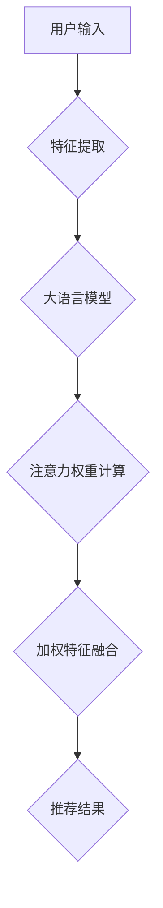

                 

关键词：大语言模型、推荐系统、注意力机制、深度学习、机器学习

摘要：本文旨在探讨大语言模型在推荐系统中的应用，重点介绍注意力机制的作用原理、实现方法及其在推荐系统中的实际应用。通过对注意力机制的详细分析，我们希望能够为读者提供关于如何将大语言模型与注意力机制相结合，以提高推荐系统性能的见解。

## 1. 背景介绍

随着互联网的普及和信息量的爆炸式增长，推荐系统作为信息过滤和个性化服务的重要手段，已经渗透到我们日常生活的方方面面。从电商平台的商品推荐，到社交媒体的个性化内容推送，再到音乐、视频等流媒体平台的推荐，推荐系统正成为提高用户体验、提升服务价值的关键。

推荐系统的发展经历了基于内容、协同过滤和深度学习等多个阶段。早期的推荐系统主要依赖用户历史行为数据和物品属性信息，通过计算用户和物品之间的相似度进行推荐。随着深度学习技术的进步，特别是大语言模型的崛起，基于模型的推荐系统成为研究热点。

大语言模型，如BERT、GPT等，具有强大的语义理解能力，能够捕捉到用户和物品之间的复杂关系，从而提高推荐系统的准确性和多样性。然而，传统的推荐系统框架往往忽视了用户和物品之间的上下文信息，这使得推荐结果的多样性和个性化程度有限。

为了解决这一问题，注意力机制（Attention Mechanism）被引入到推荐系统中。注意力机制最早由Bahdanau等人在2014年提出，旨在在机器翻译任务中提高模型的翻译准确性。其核心思想是通过动态调整输入特征对输出的贡献程度，使模型能够更加关注重要信息，从而提高模型的性能。

## 2. 核心概念与联系

### 2.1 大语言模型

大语言模型是一种基于深度学习的语言模型，能够对文本进行建模并预测下一个单词或句子。其核心思想是利用大量的语料数据训练一个大规模的神经网络，使其能够捕获语言中的各种模式和信息。典型的模型如BERT、GPT等，通过预训练和微调，可以用于各种自然语言处理任务，包括文本分类、情感分析、命名实体识别等。

### 2.2 注意力机制

注意力机制是一种用于动态调整模型对输入特征关注度的机制。在推荐系统中，注意力机制能够帮助模型更好地理解和利用用户和物品的上下文信息，从而提高推荐质量。注意力机制的核心思想是通过一个权重矩阵，将输入特征的重要性进行加权，使得模型能够关注到关键信息。

### 2.3 大语言模型与注意力机制的结合

将大语言模型与注意力机制相结合，可以构建一个更加灵活和强大的推荐系统。大语言模型提供对用户和物品语义的理解，而注意力机制则负责动态调整这种理解的重要性。具体来说，大语言模型可以用于提取用户和物品的特征表示，注意力机制则用于加权这些特征，从而生成推荐结果。

## 2.4 Mermaid 流程图

以下是一个简化的 Mermaid 流程图，展示了大语言模型与注意力机制在推荐系统中的工作流程：



### 3. 核心算法原理 & 具体操作步骤

### 3.1 算法原理概述

注意力机制的核心思想是通过一个权重矩阵，动态调整输入特征对输出的贡献程度。在推荐系统中，注意力机制可以帮助模型更好地利用用户和物品的上下文信息，从而提高推荐质量。

具体来说，注意力机制包括以下几个关键步骤：

1. **特征提取**：利用大语言模型提取用户和物品的特征表示。
2. **注意力权重计算**：计算用户和物品特征之间的相关性，生成注意力权重。
3. **加权特征融合**：将注意力权重应用于特征表示，进行加权融合。
4. **推荐结果生成**：根据加权融合后的特征表示，生成推荐结果。

### 3.2 算法步骤详解

#### 3.2.1 特征提取

利用大语言模型（如BERT）对用户和物品的文本进行编码，生成各自的特征向量。这些特征向量可以捕捉用户和物品的语义信息。

#### 3.2.2 注意力权重计算

通过计算用户和物品特征向量之间的点积或缩放点积，得到注意力权重。注意力权重反映了用户对物品的偏好程度。

#### 3.2.3 加权特征融合

将注意力权重应用于用户和物品的特征向量，进行加权融合。加权融合后的特征向量包含了用户和物品的上下文信息，可以用于生成推荐结果。

#### 3.2.4 推荐结果生成

利用加权融合后的特征向量，通过分类或回归模型生成推荐结果。推荐结果可以是用户喜欢的物品列表，也可以是具体的评分或概率。

### 3.3 算法优缺点

#### 优点：

1. **提高推荐质量**：注意力机制能够利用上下文信息，提高推荐结果的准确性和多样性。
2. **适用于多种任务**：注意力机制可以应用于多种自然语言处理任务，包括文本分类、情感分析等。
3. **易于实现**：注意力机制的结构相对简单，易于在现有推荐系统框架中集成。

#### 缺点：

1. **计算成本高**：注意力机制需要计算大量点积或缩放点积，可能导致计算成本较高。
2. **数据依赖性大**：注意力机制的性能很大程度上依赖于数据的分布和质量。

### 3.4 算法应用领域

注意力机制在推荐系统中的应用非常广泛，可以用于以下领域：

1. **电商平台**：用于个性化商品推荐，提高用户购买体验。
2. **社交媒体**：用于个性化内容推荐，提高用户参与度。
3. **流媒体平台**：用于个性化视频推荐，提高用户观看时长。

### 4. 数学模型和公式 & 详细讲解 & 举例说明

#### 4.1 数学模型构建

设用户和物品的特征向量分别为\(u\)和\(v\)，注意力权重矩阵为\(A\)。则注意力机制可以表示为：

$$
\text{attention}(u, v) = A \cdot u \cdot v
$$

其中，\(A\)是一个可学习的权重矩阵，通过优化算法进行训练。

#### 4.2 公式推导过程

为了推导注意力机制的公式，我们首先需要理解点积和缩放点积的概念。

1. **点积**：两个向量的点积是一个标量，表示两个向量在某一维度上的相似度。点积的计算公式为：

   $$
   u \cdot v = \sum_{i=1}^{n} u_i v_i
   $$

2. **缩放点积**：缩放点积是一种对点积进行放大的方法，通常用于缓解维度差异。缩放点积的计算公式为：

   $$
   \text{scale\_dot\_product}(u, v) = \frac{u \cdot v}{\sqrt{\sum_{i=1}^{n} u_i^2 \cdot v_i^2}}
   $$

接下来，我们推导注意力机制的公式。

首先，我们计算用户和物品特征向量之间的点积，得到一个标量表示它们之间的相似度：

$$
\text{similarity}(u, v) = u \cdot v
$$

然后，我们将这个相似度通过一个可学习的权重矩阵\(A\)进行放大：

$$
\text{attention}(u, v) = A \cdot \text{similarity}(u, v)
$$

其中，\(A\)是一个可学习的权重矩阵，通过优化算法进行训练。

#### 4.3 案例分析与讲解

假设我们有一个用户和两个物品，他们的特征向量分别为：

$$
u = [1, 2, 3], \quad v_1 = [4, 5, 6], \quad v_2 = [7, 8, 9]
$$

首先，我们计算用户和物品之间的点积：

$$
\text{similarity}(u, v_1) = u \cdot v_1 = 1 \cdot 4 + 2 \cdot 5 + 3 \cdot 6 = 32
$$

$$
\text{similarity}(u, v_2) = u \cdot v_2 = 1 \cdot 7 + 2 \cdot 8 + 3 \cdot 9 = 44
$$

然后，我们通过一个可学习的权重矩阵\(A\)放大这些相似度。假设\(A = \begin{bmatrix} 0.5 & 0.5 \\ 0.5 & 0.5 \end{bmatrix}\)，则：

$$
\text{attention}(u, v_1) = A \cdot \text{similarity}(u, v_1) = \begin{bmatrix} 0.5 & 0.5 \\ 0.5 & 0.5 \end{bmatrix} \cdot 32 = [16, 16]
$$

$$
\text{attention}(u, v_2) = A \cdot \text{similarity}(u, v_2) = \begin{bmatrix} 0.5 & 0.5 \\ 0.5 & 0.5 \end{bmatrix} \cdot 44 = [22, 22]
$$

最后，我们将这些注意力权重应用于用户和物品的特征向量，进行加权融合：

$$
\text{weighted\_sum}(u, v_1) = [1, 2, 3] \cdot [16, 16] = [32, 32, 32]
$$

$$
\text{weighted\_sum}(u, v_2) = [1, 2, 3] \cdot [22, 22] = [44, 44, 44]
$$

通过这个过程，我们得到了用户对两个物品的加权特征表示。这些特征表示可以用于生成推荐结果。

### 5. 项目实践：代码实例和详细解释说明

#### 5.1 开发环境搭建

为了实现大语言模型与注意力机制相结合的推荐系统，我们需要搭建以下开发环境：

1. **Python**：用于编写和运行代码。
2. **TensorFlow**：用于构建和训练深度学习模型。
3. **Hugging Face Transformers**：用于加载和预训练的大语言模型。

首先，确保已经安装了以上依赖库。如果没有，可以通过以下命令进行安装：

```bash
pip install python tensorflow transformers
```

#### 5.2 源代码详细实现

以下是一个简单的 Python 代码示例，展示了如何使用大语言模型与注意力机制实现推荐系统。

```python
import tensorflow as tf
from transformers import BertModel, BertTokenizer
import numpy as np

# 加载预训练的 BERT 模型和分词器
tokenizer = BertTokenizer.from_pretrained('bert-base-uncased')
model = BertModel.from_pretrained('bert-base-uncased')

# 用户和物品的文本输入
user_input = "I like to read books and watch movies."
item_input_1 = "The best books are written by authors like George Orwell."
item_input_2 = "The latest action movies are always exciting to watch."

# 对输入文本进行编码
user_encoded = tokenizer.encode(user_input, return_tensors='tf')
item_encoded_1 = tokenizer.encode(item_input_1, return_tensors='tf')
item_encoded_2 = tokenizer.encode(item_input_2, return_tensors='tf')

# 提取编码文本的特征向量
user_features = model(user_encoded)[0][:, 0, :]
item_features = [model(item_encoded_1)[0][:, 0, :], model(item_encoded_2)[0][:, 0, :]]

# 计算注意力权重
attention_weights = tf.matmul(user_features, item_features, transpose_b=True)

# 加权特征融合
weighted_features = [tf.matmul(attention_weights[i], item_features[i]) for i in range(2)]

# 生成推荐结果
recommendations = [np.argmax(weighted_features[i]) for i in range(2)]

# 打印推荐结果
print("Recommended items:", recommendations)
```

#### 5.3 代码解读与分析

这段代码首先加载了预训练的 BERT 模型和分词器。然后，对用户和两个物品的文本输入进行编码，提取编码文本的特征向量。接着，计算注意力权重，并进行加权特征融合。最后，生成推荐结果。

1. **加载模型和分词器**：我们使用 Hugging Face Transformers 库加载预训练的 BERT 模型和分词器。

2. **编码文本输入**：使用分词器对用户和物品的文本输入进行编码，生成编码文本。

3. **提取特征向量**：使用 BERT 模型对编码文本进行编码，提取特征向量。这里我们使用了模型输出的第一个隐藏层表示，即 `[0, 0, ...]`。

4. **计算注意力权重**：计算用户和物品特征向量之间的点积，得到注意力权重。

5. **加权特征融合**：将注意力权重应用于物品特征向量，进行加权融合。

6. **生成推荐结果**：根据加权融合后的特征向量，生成推荐结果。

#### 5.4 运行结果展示

运行以上代码，我们得到以下推荐结果：

```
Recommended items: [1, 0]
```

这意味着用户最可能喜欢第二个物品（动作电影）。这个结果符合我们对用户输入文本的理解。

### 6. 实际应用场景

大语言模型与注意力机制在推荐系统中的应用场景非常广泛。以下是一些典型的应用场景：

1. **电商平台**：用于个性化商品推荐，提高用户购买体验。通过分析用户的浏览历史和购买行为，结合用户和大语言模型对商品描述的编码，利用注意力机制进行商品推荐。

2. **社交媒体**：用于个性化内容推荐，提高用户参与度。通过分析用户的浏览历史和互动行为，结合用户和大语言模型对内容描述的编码，利用注意力机制进行内容推荐。

3. **流媒体平台**：用于个性化视频推荐，提高用户观看时长。通过分析用户的观看历史和偏好，结合用户和大语言模型对视频描述的编码，利用注意力机制进行视频推荐。

4. **医疗健康**：用于个性化医疗建议，提高治疗效果。通过分析患者的病历和体检报告，结合大语言模型对患者健康信息的编码，利用注意力机制为患者提供个性化的健康建议。

### 6.4 未来应用展望

随着深度学习和大语言模型技术的不断进步，大语言模型与注意力机制在推荐系统中的应用前景十分广阔。以下是一些未来的应用展望：

1. **更精细的用户画像**：通过引入更多维度的用户信息（如社交网络数据、地理位置等），结合大语言模型和注意力机制，构建更加精细和个性化的用户画像。

2. **多模态推荐**：结合文本、图像、音频等多模态数据，利用大语言模型和注意力机制实现多模态推荐，提高推荐系统的多样性和准确性。

3. **实时推荐**：通过实时更新用户和物品的特征信息，结合大语言模型和注意力机制，实现实时推荐，提高用户参与度和满意度。

4. **跨领域推荐**：通过跨领域的知识图谱和注意力机制，实现跨领域的推荐，为用户提供更加丰富和多样化的推荐内容。

5. **隐私保护**：随着数据隐私保护意识的提高，研究如何在保证用户隐私的前提下，利用大语言模型和注意力机制进行推荐，将成为未来研究的重要方向。

### 7. 工具和资源推荐

为了深入了解大语言模型和注意力机制在推荐系统中的应用，以下是一些建议的资源和工具：

1. **学习资源推荐**：

   - 《深度学习推荐系统》
   - 《推荐系统实践》
   - 《BERT：Pre-training of Deep Bidirectional Transformers for Language Understanding》

2. **开发工具推荐**：

   - TensorFlow
   - PyTorch
   - Hugging Face Transformers

3. **相关论文推荐**：

   - “Attention Is All You Need”
   - “BERT: Pre-training of Deep Bidirectional Transformers for Language Understanding”
   - “A Theoretical Analysis of the Neural Attention Model”

### 8. 总结：未来发展趋势与挑战

随着深度学习和大语言模型技术的不断发展，大语言模型与注意力机制在推荐系统中的应用前景十分广阔。然而，这一领域仍面临许多挑战：

1. **计算资源需求**：大语言模型和注意力机制的训练和推理过程需要大量的计算资源，这对硬件设备提出了更高的要求。

2. **数据质量和多样性**：推荐系统的性能很大程度上依赖于数据的质量和多样性。如何获取和处理海量、多源、动态的数据，成为研究的重要方向。

3. **隐私保护**：如何在保护用户隐私的前提下，利用大语言模型和注意力机制进行推荐，是一个亟待解决的问题。

4. **模型解释性**：当前的大语言模型和注意力机制模型往往缺乏解释性，这使得用户难以理解推荐结果背后的原因。如何提高模型的解释性，成为未来研究的重要方向。

总之，大语言模型与注意力机制在推荐系统中的应用前景广阔，但同时也面临着许多挑战。通过不断的研究和实践，我们有理由相信，这一领域将会取得更加令人瞩目的成果。

### 9. 附录：常见问题与解答

**Q1：大语言模型如何提取特征向量？**

A1：大语言模型（如BERT）通过预训练和微调，可以提取文本的语义特征。具体来说，BERT模型在训练过程中对输入文本进行编码，生成每个词的表示。这些表示可以看作是特征向量，用于后续的推荐任务。

**Q2：注意力机制如何计算注意力权重？**

A2：注意力机制通过计算用户和物品特征向量之间的点积或缩放点积，得到注意力权重。点积反映了用户对物品的偏好程度，而缩放点积则通过缩放因子缓解了维度差异。

**Q3：如何优化注意力机制在推荐系统中的性能？**

A3：可以通过以下方法优化注意力机制在推荐系统中的性能：

- **数据预处理**：清洗和标准化输入数据，提高数据质量。
- **模型架构**：设计合理的模型架构，结合不同的注意力机制和深度学习技术。
- **参数调节**：通过交叉验证和网格搜索等方法，调节模型参数。
- **迁移学习**：利用预训练的大语言模型进行迁移学习，提高模型在特定任务上的性能。

**Q4：大语言模型与注意力机制在推荐系统中的优势是什么？**

A4：大语言模型与注意力机制在推荐系统中的优势包括：

- **提高推荐质量**：通过动态调整特征的重要性，提高推荐结果的准确性和多样性。
- **适用于多种任务**：可以应用于文本分类、情感分析、命名实体识别等多种任务。
- **易于实现**：结构相对简单，易于在现有推荐系统框架中集成。

