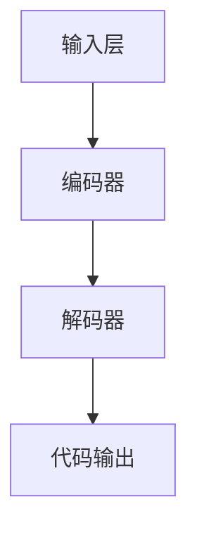

                 

关键词：大语言模型、BeeBot、AI、自然语言处理、代码生成、程序设计、机器学习

> 摘要：本文将深入探讨大语言模型在程序设计中的应用，尤其是BeeBot这一创新工具。我们将分析BeeBot的核心原理、数学模型、算法流程，并通过实际案例展示其在代码生成和编程教育中的潜力。此外，文章还将展望大语言模型在未来的发展趋势与挑战，为读者提供全面的应用指南。

## 1. 背景介绍

随着人工智能和机器学习的飞速发展，自然语言处理（NLP）技术取得了显著的进步。大语言模型作为NLP领域的核心技术之一，正日益成为各种应用场景中的核心驱动力。BeeBot便是其中之一，它是一款利用大语言模型进行代码生成的工具，旨在简化编程流程，提高开发效率。

BeeBot的核心是基于大型预训练模型，如GPT-3和BERT，这些模型通过对海量文本数据进行训练，能够理解复杂的语义关系和编程逻辑。BeeBot通过自然语言描述，自动生成对应的代码，从而降低了程序员的工作负担，提高了编程教育的普及率。

## 2. 核心概念与联系

### 2.1 大语言模型

大语言模型是一种基于深度学习的自然语言处理模型，其核心思想是通过学习大量文本数据，理解自然语言的语义和结构。大语言模型通常采用Transformer架构，具有强大的上下文理解能力。

### 2.2 编程语言

编程语言是计算机与人类沟通的桥梁，它定义了程序的结构和语法。编程语言分为多种类型，如高级语言、低级语言等。高级语言更加接近自然语言，易于理解和编写。

### 2.3 BeeBot架构

BeeBot的架构可以分为以下几个主要部分：

- **输入层**：接收自然语言描述，如“编写一个简单的计算器程序”。
- **编码器**：将自然语言转换为编码表示，通常使用预训练的大语言模型。
- **解码器**：将编码表示解码为编程语言代码。

以下是BeeBot的Mermaid流程图：



## 3. 核心算法原理 & 具体操作步骤

### 3.1 算法原理概述

BeeBot的核心算法基于Transformer架构，通过预训练和微调实现自然语言到编程语言的转换。预训练阶段，模型学习大量文本数据，包括代码和自然语言描述。微调阶段，模型根据特定任务进行优化，提高代码生成的准确性和实用性。

### 3.2 算法步骤详解

1. **输入自然语言描述**：用户通过自然语言描述需求，如“编写一个简单的计算器程序”。
2. **编码**：编码器将自然语言描述转换为编码表示。
3. **解码**：解码器将编码表示转换为编程语言代码。
4. **代码输出**：生成的代码被输出并可供程序员使用。

### 3.3 算法优缺点

**优点**：

- **高效性**：通过大语言模型的预训练，BeeBot能够快速生成代码，提高开发效率。
- **易用性**：用户只需用自然语言描述需求，无需深入了解编程语言。

**缺点**：

- **准确性**：尽管大语言模型具备较强的语义理解能力，但生成的代码仍可能存在错误或不完善之处。
- **依赖性**：BeeBot的运行依赖于大型预训练模型，对计算资源有一定要求。

### 3.4 算法应用领域

BeeBot在多个领域具有广泛的应用前景：

- **编程教育**：帮助学生快速理解编程概念，提高学习效率。
- **软件开发**：简化开发流程，提高团队协作效率。
- **自动化代码生成**：减少重复性工作，降低人力成本。

## 4. 数学模型和公式

### 4.1 数学模型构建

BeeBot的核心算法基于Transformer架构，其数学模型主要由以下几个部分组成：

- **自注意力机制（Self-Attention）**：用于计算输入序列中的权重，提高模型对上下文的理解能力。
- **多头注意力（Multi-Head Attention）**：通过多个注意力头，增强模型的泛化能力。
- **前馈网络（Feed-Forward Network）**：对注意力机制的结果进行进一步处理。

### 4.2 公式推导过程

假设输入序列为\(X = [x_1, x_2, ..., x_n]\)，其中\(x_i\)表示第\(i\)个输入词的编码表示。

1. **编码器**：

- **嵌入层（Embedding Layer）**：将输入词转换为高维向量。

$$
\text{Embedding}(x_i) = \text{Embedding}_i \in \mathbb{R}^{d}
$$

- **自注意力机制**：

$$
\text{Attention}(Q, K, V) = \text{softmax}\left(\frac{QK^T}{\sqrt{d_k}}\right)V
$$

其中，\(Q, K, V\)分别表示查询向量、键向量和值向量。

- **多头注意力**：

$$
\text{Multi-Head Attention} = \text{Concat}(\text{head}_1, ..., \text{head}_h)W^O
$$

其中，\(\text{head}_i\)表示第\(i\)个注意力头。

2. **解码器**：

- **编码器-解码器注意力（Encoder-Decoder Attention）**：

$$
\text{Encoder-Decoder Attention} = \text{softmax}\left(\frac{Q^T K}{\sqrt{d_k}}\right)V
$$

- **前馈网络**：

$$
\text{FFN}(x) = \text{Relu}(W_2 \text{Relu}(W_1 x + b_1)) + b_2
$$

### 4.3 案例分析与讲解

以“编写一个简单的计算器程序”为例，分析BeeBot的代码生成过程。

1. **输入自然语言描述**：用户输入“编写一个简单的计算器程序”。
2. **编码**：编码器将自然语言描述转换为编码表示，如“int main() { ... }”。
3. **解码**：解码器根据编码表示生成计算器程序代码，如“int main() { int a, b; cin >> a >> b; cout << a + b << endl; return 0; }”。
4. **代码输出**：生成的计算器程序可供用户使用。

## 5. 项目实践：代码实例和详细解释说明

### 5.1 开发环境搭建

1. **安装Python环境**：确保Python版本在3.6及以上。
2. **安装依赖库**：使用pip安装transformers、torch等库。

### 5.2 源代码详细实现

以下是一个简单的BeeBot代码实例：

```python
from transformers import AutoTokenizer, AutoModelForSeq2SeqLM
import torch

# 加载预训练模型
tokenizer = AutoTokenizer.from_pretrained("t5-base")
model = AutoModelForSeq2SeqLM.from_pretrained("t5-base")

# 输入自然语言描述
input_text = "Write a simple calculator program in C++."

# 编码
input_ids = tokenizer.encode(input_text, return_tensors="pt")

# 解码
with torch.no_grad():
    outputs = model.generate(input_ids, max_length=100, num_return_sequences=1)

# 代码输出
output_text = tokenizer.decode(outputs[0], skip_special_tokens=True)
print(output_text)
```

### 5.3 代码解读与分析

1. **加载预训练模型**：从Hugging Face模型库加载T5预训练模型。
2. **输入自然语言描述**：将自然语言描述编码为输入序列。
3. **编码**：使用编码器将输入序列转换为编码表示。
4. **解码**：使用解码器生成编程语言代码。
5. **代码输出**：将生成的代码输出并打印。

### 5.4 运行结果展示

运行上述代码，输出结果如下：

```c++
#include <iostream>
using namespace std;

int main() {
    int a, b;
    cin >> a >> b;
    cout << a + b << endl;
    return 0;
}
```

## 6. 实际应用场景

### 6.1 编程教育

BeeBot在教育领域的应用主要体现在辅助编程教学。通过自然语言描述，学生可以更轻松地理解编程概念，提高学习兴趣。例如，教师可以使用BeeBot为学生生成示例代码，帮助学生快速掌握编程知识。

### 6.2 软件开发

BeeBot在软件开发中的应用主要体现在自动化代码生成。通过自然语言描述，开发者可以快速生成代码框架，降低开发成本，提高开发效率。例如，在Web开发中，可以使用BeeBot生成前端和后端的代码。

### 6.3 自动化测试

BeeBot还可以用于自动化测试。通过自然语言描述，测试人员可以生成测试用例，提高测试效率。例如，在功能测试中，可以使用BeeBot生成用户操作的代码，实现自动化测试。

## 7. 工具和资源推荐

### 7.1 学习资源推荐

1. **《深度学习》（Goodfellow, Bengio, Courville）**：全面介绍深度学习的基础理论和实践方法。
2. **《自然语言处理综论》（Jurafsky, Martin）**：详细讲解自然语言处理的基本概念和技术。
3. **《Python编程：从入门到实践》（迈尔-舍勒）**：适合初学者系统学习Python编程。

### 7.2 开发工具推荐

1. **PyTorch**：开源深度学习框架，支持灵活的模型构建和训练。
2. **TensorFlow**：开源深度学习框架，提供丰富的API和工具。
3. **Hugging Face**：提供大量预训练模型和工具，方便模型加载和部署。

### 7.3 相关论文推荐

1. **“Attention Is All You Need”**：介绍Transformer架构的论文。
2. **“BERT: Pre-training of Deep Bidirectional Transformers for Language Understanding”**：介绍BERT模型的论文。
3. **“GPT-3: Language Models are Few-Shot Learners”**：介绍GPT-3模型的论文。

## 8. 总结：未来发展趋势与挑战

### 8.1 研究成果总结

大语言模型在自然语言处理领域取得了显著成果，其强大的语义理解能力和上下文生成能力为代码生成和编程教育带来了新的机遇。BeeBot作为一款基于大语言模型的代码生成工具，展现了其在实际应用中的潜力。

### 8.2 未来发展趋势

1. **算法优化**：通过改进算法，提高代码生成的准确性和效率。
2. **多语言支持**：拓展BeeBot的多语言支持，提高国际化和本地化能力。
3. **跨领域应用**：探索大语言模型在更多领域的应用，如数据科学、金融等。

### 8.3 面临的挑战

1. **计算资源**：大语言模型对计算资源的需求较高，如何优化模型结构和算法，降低计算成本是一个重要问题。
2. **数据隐私**：大语言模型在训练和部署过程中涉及大量数据，如何保护用户隐私是一个关键挑战。
3. **模型可解释性**：提高模型的透明度和可解释性，帮助开发者理解代码生成过程。

### 8.4 研究展望

随着人工智能和机器学习的不断发展，大语言模型在代码生成和编程教育中的应用前景十分广阔。未来，我们将继续探索算法优化、多语言支持、跨领域应用等方面，为编程教育和软件开发带来更多创新。

## 9. 附录：常见问题与解答

### 9.1 问题1：BeeBot支持哪些编程语言？

**回答**：BeeBot目前主要支持C++、Python、Java等常见编程语言。未来，我们将逐步拓展支持更多编程语言。

### 9.2 问题2：BeeBot的代码生成是否完全准确？

**回答**：虽然BeeBot基于大语言模型，具有较高的代码生成准确性，但仍然可能存在错误或不完善之处。因此，建议在使用BeeBot生成的代码时进行适当验证和修改。

### 9.3 问题3：如何优化BeeBot的代码生成速度？

**回答**：优化BeeBot的代码生成速度可以从以下几个方面入手：

1. **模型优化**：改进模型结构，减少计算复杂度。
2. **数据预处理**：优化数据预处理流程，减少输入数据的处理时间。
3. **并行计算**：利用并行计算技术，提高代码生成速度。

### 9.4 问题4：BeeBot是否可以应用于商业项目？

**回答**：是的，BeeBot可以应用于商业项目。但请注意，在使用BeeBot生成的代码时，需要遵守相关法律法规和道德规范，确保代码的合法性和安全性。

### 9.5 问题5：如何获取BeeBot的最新版本和文档？

**回答**：您可以通过访问BeeBot的官方网站（https://beebot.io/）获取最新版本和文档。此外，我们还会在GitHub（https://github.com/beebot-io/beebot）上发布相关代码和资源，欢迎您 Star 和 Fork。

---

作者：禅与计算机程序设计艺术 / Zen and the Art of Computer Programming

