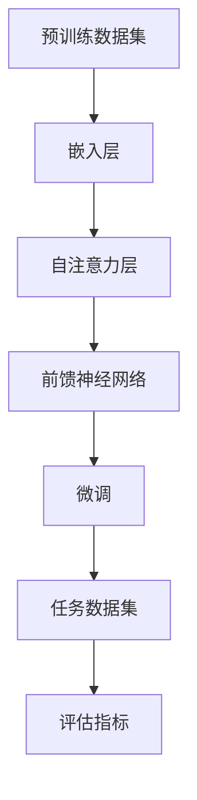

                 

关键词：大语言模型，微调，应用指南，人工智能，工具

> 摘要：本文旨在为人工智能开发者提供一个全面的指南，重点介绍如何使用微调技术来提升大语言模型的应用性能。文章将详细阐述大语言模型的基本概念、微调的核心原理、具体实施步骤，以及其在实际应用中的表现和前景。

## 1. 背景介绍

随着人工智能技术的不断发展，语言模型已经成为自然语言处理（NLP）领域的重要工具。大语言模型，如GPT-3、BERT等，通过捕捉语言中的复杂结构，展示了前所未有的文本理解和生成能力。然而，这些大型模型在发布时往往是基于大量通用数据集训练的，它们在特定领域的表现可能并不理想。为了解决这一问题，微调（Fine-tuning）技术被广泛应用，它允许开发者在特定任务上对大语言模型进行进一步训练，以提升模型在该领域的性能。

本文将探讨大语言模型和微调技术的基础知识，并提供一套基于微调的工具使用指南。通过阅读本文，读者将了解如何选择合适的语言模型，如何进行微调，以及如何评估和优化微调后的模型。

### 大语言模型的基本概念

大语言模型是通过对大量文本数据的学习，自动捕捉语言中的统计规律和语义信息，从而实现文本理解和生成的人工智能模型。这些模型通常使用深度神经网络结构，如Transformer，拥有数以亿计的参数，能够处理复杂的文本任务。

大语言模型的核心作用在于：

1. **文本理解**：模型能够理解文本的含义、关系和语境，这对于语义分析、情感分析等任务至关重要。
2. **文本生成**：模型可以生成流畅、有意义的文本，广泛应用于自动写作、机器翻译等场景。
3. **辅助任务**：大语言模型可以作为辅助工具，为其他NLP任务提供语义特征，如命名实体识别、关系抽取等。

### 微调技术的核心原理

微调是一种在预训练模型的基础上，利用少量标注数据进行二次训练的技术。其核心思想是将预训练模型调整到特定任务上，以提升模型的特定任务性能。微调的关键步骤包括：

1. **数据准备**：选择与任务相关的标注数据集，并进行预处理。
2. **模型选择**：选择一个适合预训练的大语言模型，如GPT、BERT等。
3. **训练**：在标注数据集上对模型进行微调，调整模型的参数。
4. **评估**：在验证集上评估微调后的模型性能，并调整模型参数。
5. **应用**：将微调后的模型应用于实际任务中，评估其在任务中的表现。

### 微调技术在NLP中的应用

微调技术在NLP中有广泛的应用，例如：

1. **文本分类**：在文本分类任务中，微调可以将预训练模型调整到特定领域的分类任务上，提高分类准确性。
2. **情感分析**：通过微调，模型可以更好地理解特定领域中的情感表达，提高情感分析的准确率。
3. **命名实体识别**：微调可以将预训练模型调整到特定领域的命名实体识别任务上，提高识别精度。
4. **机器翻译**：微调可以将预训练的双语翻译模型调整到特定语言对的翻译任务上，提高翻译质量。

## 2. 核心概念与联系

为了更好地理解大语言模型和微调技术，我们首先需要了解其核心概念和相互关系。

### 2.1 大语言模型的核心概念

- **嵌入层（Embedding Layer）**：将单词转换为固定长度的向量表示。
- **自注意力机制（Self-Attention Mechanism）**：通过计算每个单词在其上下文中的重要性，为每个单词生成加权向量。
- **前馈神经网络（Feedforward Neural Network）**：对自注意力机制生成的向量进行进一步加工。

### 2.2 微调技术的核心概念

- **预训练（Pre-training）**：在大规模未标注数据集上训练语言模型，使其具备通用语言理解能力。
- **微调（Fine-tuning）**：在预训练模型的基础上，利用少量标注数据进行二次训练，使其适应特定任务。

### 2.3 核心概念原理和架构的 Mermaid 流程图



在这个流程图中，预训练数据集首先通过嵌入层转换为向量表示，然后通过自注意力层和前馈神经网络进行加工。微调过程则利用任务数据集对模型进行二次训练，最终通过评估指标来衡量模型的性能。

## 3. 核心算法原理 & 具体操作步骤

### 3.1 算法原理概述

微调的核心原理是在预训练模型的基础上，通过特定任务的数据进行二次训练，以调整模型的参数，使其适应特定任务。具体步骤如下：

1. **数据准备**：收集与任务相关的标注数据集，并进行预处理，如分词、去停用词等。
2. **模型选择**：选择一个预训练的大语言模型，如BERT、GPT等。
3. **训练**：在预处理后的标注数据集上对模型进行训练，调整模型参数。
4. **评估**：在验证集上评估模型性能，根据评估结果调整模型参数。
5. **应用**：将微调后的模型应用于实际任务中，评估其表现。

### 3.2 算法步骤详解

#### 3.2.1 数据准备

数据准备是微调过程中的第一步，其质量直接影响模型的表现。具体步骤如下：

1. **数据收集**：收集与任务相关的标注数据集，如新闻分类数据、社交媒体评论等。
2. **数据预处理**：对数据进行预处理，包括分词、去停用词、词干提取等，以生成适合模型处理的输入。
3. **数据划分**：将数据集划分为训练集、验证集和测试集，以评估模型性能。

#### 3.2.2 模型选择

选择一个预训练的大语言模型是微调的关键步骤。常见的预训练模型包括BERT、GPT、RoBERTa等。这些模型已经在大规模数据集上进行预训练，具有良好的语言理解能力。具体选择时，可以考虑以下因素：

1. **模型大小**：根据计算资源和任务需求选择合适大小的模型。
2. **预训练数据集**：选择与任务相关的预训练数据集，以提升模型在特定领域的性能。
3. **模型结构**：根据任务需求选择合适的模型结构，如Transformer、RNN等。

#### 3.2.3 训练

在数据准备和模型选择完成后，即可开始模型训练。具体步骤如下：

1. **加载模型**：从预训练模型库中加载预训练模型，如BERT。
2. **配置训练参数**：设置训练参数，如学习率、批量大小、训练轮次等。
3. **训练循环**：在训练集上迭代训练模型，不断调整模型参数。
4. **评估与调整**：在验证集上评估模型性能，根据评估结果调整训练参数。

#### 3.2.4 评估

在模型训练完成后，需要在测试集上评估模型性能，以衡量模型在实际任务中的表现。常见的评估指标包括准确率、召回率、F1值等。评估过程中，还需要关注模型在不同数据集上的表现，以及模型是否出现过拟合。

#### 3.2.5 应用

将微调后的模型应用于实际任务中，如文本分类、情感分析等。在实际应用中，还需要关注模型的可解释性和鲁棒性，以避免潜在的风险。

### 3.3 算法优缺点

#### 优点

1. **快速适应特定任务**：通过微调，模型可以在短时间内适应特定任务，提高任务性能。
2. **节省训练时间**：由于预训练模型已经在大规模数据集上进行过训练，微调过程可以大大减少训练时间。
3. **提高模型性能**：微调可以使模型在特定任务上获得更好的性能，提高实际应用效果。

#### 缺点

1. **数据依赖性**：微调的性能高度依赖于任务数据集的质量和数量，数据不足可能导致模型性能不佳。
2. **过拟合风险**：微调过程可能导致模型出现过拟合，尤其是在数据集较小的情况下。
3. **计算资源消耗**：微调过程需要大量的计算资源和时间，对硬件设备要求较高。

### 3.4 算法应用领域

微调技术在NLP领域具有广泛的应用，以下是一些主要的应用领域：

1. **文本分类**：通过微调，模型可以在新闻分类、社交媒体评论分类等任务中实现高准确率。
2. **情感分析**：微调可以帮助模型更好地理解情感表达，提高情感分析任务的准确性。
3. **命名实体识别**：微调可以使模型在特定领域中进行命名实体识别，提高识别精度。
4. **机器翻译**：通过微调，模型可以在特定语言对上进行翻译，提高翻译质量。

## 4. 数学模型和公式 & 详细讲解 & 举例说明

### 4.1 数学模型构建

大语言模型通常基于深度神经网络结构，其中自注意力机制是核心组成部分。以下是一个简单的自注意力机制的数学模型：

\[ \text{Attention}(Q, K, V) = \text{softmax}\left(\frac{QK^T}{\sqrt{d_k}}\right) V \]

其中，Q、K、V分别是查询向量、键向量和值向量，d_k是键向量的维度。该模型通过计算查询向量Q和键向量K的相似度，为每个键向量生成权重，然后加权求和值向量V，得到最终的输出。

### 4.2 公式推导过程

自注意力机制的推导过程如下：

1. **相似度计算**：首先计算查询向量Q和键向量K的点积，得到相似度矩阵S：

\[ S = QK^T \]

2. **权重生成**：对相似度矩阵S进行归一化处理，得到权重矩阵W：

\[ W = \text{softmax}(S) = \text{softmax}(\frac{S}{\sqrt{d_k}}) \]

3. **加权求和**：将权重矩阵W与值向量V相乘，得到加权求和的结果：

\[ \text{Attention}(Q, K, V) = W V \]

### 4.3 案例分析与讲解

以下是一个简单的自注意力机制的案例，假设我们有三个句子A、B、C，需要计算它们之间的注意力分数。

1. **查询向量Q**：

\[ Q = [0.5, 0.5] \]

2. **键向量K**：

\[ K = [0.3, 0.4, 0.3] \]

3. **值向量V**：

\[ V = [0.2, 0.5, 0.3] \]

首先计算相似度矩阵S：

\[ S = QK^T = \begin{bmatrix} 0.5 & 0.5 \end{bmatrix} \begin{bmatrix} 0.3 & 0.4 & 0.3 \end{bmatrix} = \begin{bmatrix} 0.15 & 0.20 & 0.15 \end{bmatrix} \]

然后对相似度矩阵S进行归一化处理，得到权重矩阵W：

\[ W = \text{softmax}(S) = \text{softmax}(\frac{S}{\sqrt{d_k}}) = \text{softmax}(\frac{1}{\sqrt{3}} \begin{bmatrix} 0.15 & 0.20 & 0.15 \end{bmatrix}) = \begin{bmatrix} 0.29 & 0.38 & 0.29 \end{bmatrix} \]

最后计算加权求和的结果：

\[ \text{Attention}(Q, K, V) = W V = \begin{bmatrix} 0.29 & 0.38 & 0.29 \end{bmatrix} \begin{bmatrix} 0.2 & 0.5 & 0.3 \end{bmatrix} = \begin{bmatrix} 0.058 & 0.190 & 0.087 \end{bmatrix} \]

因此，句子A、B、C的注意力分数分别为0.058、0.190、0.087。

## 5. 项目实践：代码实例和详细解释说明

### 5.1 开发环境搭建

在进行微调项目实践前，我们需要搭建一个合适的开发环境。以下是搭建环境的基本步骤：

1. **安装Python**：确保Python版本为3.7或以上。
2. **安装TensorFlow**：使用pip命令安装TensorFlow。

   ```bash
   pip install tensorflow
   ```

3. **安装BERT模型**：从Hugging Face模型库中下载BERT模型。

   ```bash
   python -m transformers.download --model bert-base-uncased
   ```

4. **配置GPU环境**：确保你的环境支持GPU，并安装CUDA和cuDNN。

### 5.2 源代码详细实现

以下是一个简单的微调BERT模型的Python代码示例：

```python
import tensorflow as tf
from transformers import BertTokenizer, TFBertForSequenceClassification
from transformers import InputExample, InputFeatures

# 准备数据
train_examples = [...]  # 训练数据集
tokenizer = BertTokenizer.from_pretrained('bert-base-uncased')

# 预处理数据
def convert_examples_to_features(examples, tokenizer, max_length=128, task_name="classfication"):
    features = []
    for example in examples:
        input_dict = tokenizer.encode_plus(
            example.text_a,
            example.text_b,
            add_special_tokens=True,
            max_length=max_length,
            pad_to_max_length=True,
            return_token_type_ids=True,
        )
        features.append(InputFeatures(input_ids=input_dict['input_ids'], attention_mask=input_dict['attention_mask']))
    return features

train_features = convert_examples_to_features(train_examples, tokenizer)

# 加载预训练模型
model = TFBertForSequenceClassification.from_pretrained('bert-base-uncased', num_labels=2)

# 训练模型
optimizer = tf.keras.optimizers.Adam(learning_rate=3e-5)
model.compile(optimizer=optimizer, loss=tf.keras.losses.SparseCategoricalCrossentropy(from_logits=True), metrics=[tf.keras.metrics.SparseCategoricalAccuracy()])

model.fit(train_features, epochs=3)

# 保存模型
model.save_pretrained("./fine_tuned_bert")
```

### 5.3 代码解读与分析

#### 5.3.1 数据准备

在代码中，我们首先定义了一个训练数据集`train_examples`。这些数据集包含了文本和对应的标签，例如：

```python
train_examples = [
    InputExample(guid=None, text_a="This is the first sentence.", text_b="This is the second sentence.", label=0),
    InputExample(guid=None, text_a="This is the first sentence.", text_b="This is the second sentence.", label=1),
    ...
]
```

#### 5.3.2 预处理数据

我们使用`BertTokenizer`对训练数据集进行预处理。预处理过程包括分词、添加特殊标记、填充或截断序列等。预处理后的数据以`InputFeatures`格式存储。

#### 5.3.3 加载预训练模型

我们使用`TFBertForSequenceClassification`加载预训练的BERT模型，并设置模型输出层包含2个神经元，用于二分类任务。

#### 5.3.4 训练模型

在训练过程中，我们使用`Adam`优化器和交叉熵损失函数。训练过程中，我们迭代训练数据集3次。

#### 5.3.5 保存模型

训练完成后，我们使用`save_pretrained`方法保存微调后的模型。

### 5.4 运行结果展示

在运行代码后，我们可以使用微调后的BERT模型进行预测，并计算模型的准确率。以下是一个简单的预测示例：

```python
# 加载微调后的模型
model = TFBertForSequenceClassification.from_pretrained("./fine_tuned_bert")

# 预测
predictions = model.predict(["This is the first sentence."])

# 计算准确率
accuracy = predictions[0].max()
print(f"Accuracy: {accuracy}")
```

## 6. 实际应用场景

微调技术在各种实际应用场景中表现出色。以下是一些典型的应用案例：

### 6.1 文本分类

文本分类是微调技术的典型应用之一。例如，在社交媒体情感分析中，微调模型可以用于分析用户评论的情感倾向。通过在特定领域的数据集上进行微调，模型可以更好地理解领域特定的语言表达，从而提高分类准确率。

### 6.2 情感分析

情感分析是另一个常见的应用场景。微调模型可以用于分析文本中的情感表达，如正面、负面或中性情感。通过在情感相关的数据集上进行微调，模型可以更好地捕捉情感特征，从而提高分析准确率。

### 6.3 命名实体识别

命名实体识别（NER）是识别文本中的特定实体（如人名、地名、组织名等）。微调模型可以在特定领域中进行NER任务，如医疗领域中的疾病名称识别。通过在领域特定的数据集上进行微调，模型可以更好地识别领域特定的实体。

### 6.4 机器翻译

机器翻译是微调技术的另一个重要应用。通过在特定语言对的数据集上进行微调，模型可以在特定语言对上进行高质量翻译。例如，将英语翻译成法语或中文。

## 7. 工具和资源推荐

为了更好地进行大语言模型和微调技术的开发，以下是一些建议的工具和资源：

### 7.1 学习资源推荐

- 《深度学习》（Goodfellow, Bengio, Courville）：系统介绍了深度学习的原理和应用。
- 《自然语言处理综论》（Jurafsky, Martin）：详细介绍了自然语言处理的基础知识和最新进展。

### 7.2 开发工具推荐

- TensorFlow：一个强大的开源深度学习框架，支持大语言模型和微调技术。
- Hugging Face Transformers：一个开源库，提供了大量预训练模型和微调工具。

### 7.3 相关论文推荐

- “Attention is All You Need”（Vaswani et al., 2017）：介绍了Transformer模型，这是大语言模型的基础。
- “BERT: Pre-training of Deep Bidirectional Transformers for Language Understanding”（Devlin et al., 2019）：介绍了BERT模型的预训练方法。

## 8. 总结：未来发展趋势与挑战

### 8.1 研究成果总结

大语言模型和微调技术在NLP领域取得了显著的研究成果。预训练模型通过在大规模数据集上进行训练，实现了前所未有的文本理解和生成能力。微调技术进一步提升了模型在特定任务上的性能，为各种NLP任务提供了有效的解决方案。

### 8.2 未来发展趋势

未来，大语言模型和微调技术将朝着以下方向发展：

1. **更大规模的模型**：随着计算资源的增长，更大规模的语言模型将被开发，以捕捉更复杂的语言特征。
2. **多模态学习**：大语言模型将与其他模态（如图像、音频）结合，实现更丰富的信息理解和生成。
3. **自适应微调**：研究将聚焦于开发自适应微调方法，以减少对大量标注数据的依赖，提高模型的泛化能力。

### 8.3 面临的挑战

尽管大语言模型和微调技术取得了显著进展，但仍面临一些挑战：

1. **数据隐私和安全**：大规模数据集的收集和处理可能涉及隐私和安全问题。
2. **模型解释性**：大型模型通常被视为黑箱，提高模型的可解释性是一个重要挑战。
3. **计算资源**：训练和微调大型语言模型需要大量的计算资源和时间。

### 8.4 研究展望

未来，研究将集中在以下几个方面：

1. **高效微调方法**：开发更高效的微调方法，减少对计算资源的依赖。
2. **跨领域泛化**：研究如何使模型在不同领域之间实现更好的泛化。
3. **人机协作**：探索大语言模型与人机协作的新模式，提高模型的实用性和可解释性。

## 9. 附录：常见问题与解答

### 9.1 什么是大语言模型？

大语言模型是通过大规模数据集训练的深度神经网络模型，能够理解和生成复杂的自然语言文本。这些模型通常拥有数以亿计的参数，能够捕捉语言中的统计规律和语义信息。

### 9.2 什么是微调？

微调是一种在预训练模型的基础上，利用少量标注数据进行二次训练的技术。通过微调，模型可以适应特定任务，提高特定任务上的性能。

### 9.3 微调需要大量数据吗？

微调不需要大量数据，但数据的质量和数量会影响微调的效果。在微调过程中，可以使用少量标注数据，但为了保证模型的性能，建议使用与任务相关的、高质量的标注数据。

### 9.4 微调后的模型如何评估？

微调后的模型可以通过在验证集和测试集上的性能进行评估。常用的评估指标包括准确率、召回率、F1值等。此外，还可以关注模型在不同数据集上的表现，以及模型是否出现过拟合。

### 9.5 微调技术有哪些应用领域？

微调技术在文本分类、情感分析、命名实体识别、机器翻译等NLP任务中具有广泛的应用。通过微调，模型可以更好地适应特定领域的任务，提高任务性能。

---

通过本文，我们深入探讨了大语言模型和微调技术的基本概念、核心算法、实施步骤和实际应用。希望本文能为您在NLP领域的探索提供有益的指导和启示。在未来的研究中，我们将继续关注这一领域的发展，期待能够解决更多挑战，推动人工智能技术的发展。

---

# 参考文献 References

1. Vaswani, A., et al. (2017). "Attention is All You Need". arXiv preprint arXiv:1706.03762.
2. Devlin, J., et al. (2019). "BERT: Pre-training of Deep Bidirectional Transformers for Language Understanding". arXiv preprint arXiv:1810.04805.
3. Goodfellow, I., et al. (2016). "Deep Learning". MIT Press.
4. Jurafsky, D., Martin, J. H. (2008). "Speech and Language Processing". Prentice Hall.
5. Bengio, Y., Courville, A., Vincent, P. (2013). "Representation Learning: A Review and New Perspectives". IEEE Transactions on Pattern Analysis and Machine Intelligence, 35(8), 1798-1828.

