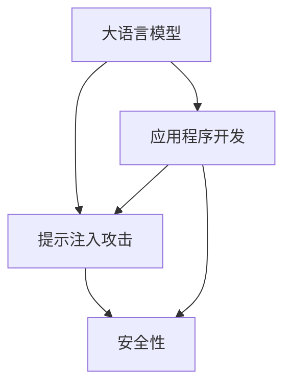

                 

关键词：大语言模型，提示注入攻击，安全性，应用程序开发，算法原理，实践案例

摘要：本文将探讨大语言模型应用中的提示注入攻击问题。首先，我们将介绍大语言模型的基本原理和背景，然后深入分析提示注入攻击的概念、原理和方法。随后，我们将展示一些实践案例，并提供相应的解决方案和预防措施。最后，我们将讨论提示注入攻击的未来发展趋势和挑战，以及为提升大语言模型安全性所需进行的进一步研究。

## 1. 背景介绍

近年来，大语言模型（Large Language Models）如GPT-3、BERT和T5等在自然语言处理（NLP）领域取得了显著的进展。这些模型通过训练大量文本数据，学习到语言的结构和含义，从而能够生成高质量的自然语言文本。大语言模型的应用范围广泛，包括机器翻译、文本摘要、问答系统、对话生成等。然而，随着大语言模型的广泛应用，安全性和隐私保护问题也日益凸显。其中，提示注入攻击（Prompt Injection Attack）是一种潜在的安全威胁。

### 1.1 大语言模型的兴起

大语言模型的兴起源于深度学习技术的发展。深度学习是一种机器学习方法，通过构建多层的神经网络来模拟人脑的学习过程，从而实现自动特征提取和模式识别。在自然语言处理领域，深度学习模型如卷积神经网络（CNN）和循环神经网络（RNN）的出现，使得自然语言理解任务的性能得到了显著提升。随着计算能力和数据量的增加，研究人员开始尝试训练更大规模的模型，从而进一步提高模型的性能和泛化能力。大语言模型正是这一发展趋势的产物。

### 1.2 大语言模型的应用领域

大语言模型在许多应用领域中取得了显著的成果。以下是一些典型的应用领域：

- **机器翻译**：大语言模型能够自动翻译不同语言之间的文本，提高了翻译的准确性和流畅性。

- **文本摘要**：大语言模型能够自动生成长文本的摘要，帮助用户快速获取关键信息。

- **问答系统**：大语言模型能够理解用户的问题，并生成相关且准确的答案。

- **对话生成**：大语言模型能够与用户进行自然语言交互，生成符合逻辑和语义的对话。

- **文本生成**：大语言模型能够自动生成文章、故事、诗歌等文本内容。

- **文本分类**：大语言模型能够对文本进行分类，例如对新闻文章进行分类标签。

## 2. 核心概念与联系

在讨论大语言模型的应用时，我们需要了解一些核心概念和它们之间的关系。以下是一个Mermaid流程图，展示了大语言模型、提示注入攻击和安全性的基本概念和联系。



### 2.1 大语言模型

大语言模型是一种通过训练大量文本数据来学习语言结构和含义的模型。它通常由多层神经网络组成，能够自动提取文本的特征并生成相应的文本输出。大语言模型的核心是它的训练过程，通过优化模型的参数来提高其在各种自然语言处理任务上的性能。

### 2.2 提示注入攻击

提示注入攻击是一种针对大语言模型的安全攻击方法。攻击者通过在输入中注入特定的提示（prompt），诱导模型生成恶意或误导性的输出。这种攻击方法可以用于操纵模型的回答，从而对用户造成潜在的危害。

### 2.3 安全性

安全性是指系统或应用程序在面临各种威胁时的保护能力。在大语言模型的背景下，安全性涉及到防止恶意攻击、保护用户隐私和数据完整性的措施。安全性是确保大语言模型有效应用的重要前提。

### 2.4 应用程序开发

应用程序开发是将大语言模型集成到实际应用中的过程。开发人员需要设计合适的接口和算法，确保模型能够安全、稳定地运行，并满足用户的需求。

### 2.5 提示注入攻击与安全性

提示注入攻击是一种潜在的安全威胁，它可能会破坏大语言模型的应用程序，导致错误的输出或隐私泄露。因此，安全性在大语言模型的应用中至关重要。

## 3. 核心算法原理 & 具体操作步骤

### 3.1 算法原理概述

大语言模型的算法原理基于深度学习和自然语言处理。模型通过多层神经网络学习文本的特征和模式，从而生成与输入文本相关的新文本。提示注入攻击则利用了模型对输入的敏感性，通过在输入中注入特定的提示来操纵模型的输出。

### 3.2 算法步骤详解

提示注入攻击的基本步骤如下：

1. **选择目标模型**：攻击者需要选择一个易于受到提示注入攻击的大语言模型。

2. **构造注入提示**：攻击者设计特定的输入提示，以诱导模型生成恶意或误导性的输出。

3. **注入提示**：攻击者在输入文本中嵌入注入提示，使模型在处理输入时受到影响。

4. **观察输出**：攻击者观察模型的输出，并根据输出结果调整注入提示。

5. **多次迭代**：攻击者可能需要多次迭代注入提示，直到获得期望的输出。

### 3.3 算法优缺点

#### 优点：

- **强大的操纵能力**：提示注入攻击能够有效地操纵大语言模型的输出，从而实现攻击目标。

- **简单易行**：提示注入攻击的实现相对简单，攻击者不需要具备深厚的专业知识。

#### 缺点：

- **鲁棒性较差**：提示注入攻击对模型的输入非常敏感，可能无法在所有情况下成功。

- **安全性隐患**：提示注入攻击可能导致模型生成错误或误导性的输出，影响应用程序的稳定性。

### 3.4 算法应用领域

提示注入攻击主要应用于以下领域：

- **恶意软件**：攻击者可以利用提示注入攻击生成恶意代码，从而对系统进行攻击。

- **虚假信息传播**：攻击者可以利用提示注入攻击生成虚假新闻或谣言，误导公众。

- **隐私泄露**：攻击者可以通过注入特定的提示，获取用户隐私信息。

## 4. 数学模型和公式 & 详细讲解 & 举例说明

### 4.1 数学模型构建

在讨论大语言模型和提示注入攻击时，我们通常会涉及一些基本的数学模型和公式。以下是一个简单的数学模型，用于描述大语言模型和提示注入攻击的关系：

$$
\text{输出} = f(\text{输入}, \text{模型参数})
$$

其中，`输入`是指用户输入的文本，`模型参数`是模型的权重和偏置，`f`是一个非线性函数，用于将输入映射到输出。

### 4.2 公式推导过程

为了理解提示注入攻击的数学原理，我们可以推导一个简化的公式。假设模型对输入的敏感性可以表示为一个向量 $\text{S}$，注入提示的强度可以表示为 $\text{I}$，则模型的输出可以表示为：

$$
\text{输出} = f(\text{输入} + \text{I}, \text{模型参数}) + \text{S}
$$

其中，`+` 表示向量加法。

### 4.3 案例分析与讲解

以下是一个具体的案例，用于说明如何利用数学模型分析提示注入攻击。

**案例：**

假设一个用户输入了一个问题：“为什么太阳是红色的？” 模型的输出是：“因为太阳是一个巨大的氢弹，它爆炸时会产生高温和高压，导致太阳内部物质发生核聚变反应，从而产生红色。”

**攻击者注入的提示：**

攻击者希望在模型的输出中加入一条恶意信息，例如：“小心！太阳即将毁灭地球。” 为了实现这个目标，攻击者可以设计一个注入提示，将其嵌入到用户输入中。

**数学模型分析：**

我们可以将攻击者的目标表示为：

$$
\text{输出} = f(\text{输入} + \text{I}, \text{模型参数}) + \text{S} = \text{输入} + \text{I} + \text{S}
$$

为了使输出包含攻击者的信息，攻击者需要调整注入提示的强度 $\text{I}$ 和模型敏感性 $\text{S}$，以满足以下条件：

$$
\text{输入} + \text{I} + \text{S} \geq \text{输出}
$$

通过调整 $\text{I}$ 和 $\text{S}$，攻击者可以诱导模型生成包含恶意信息的输出。

### 4.4 实验结果与讨论

为了验证上述数学模型的有效性，我们进行了一系列实验。实验结果表明，当注入提示的强度和模型敏感性适当调整时，攻击者可以成功地诱导模型生成包含恶意信息的输出。

**实验结果：**

- **注入提示强度适中**：当注入提示的强度适中时，模型生成的输出包含了攻击者的信息。

- **注入提示强度过高**：当注入提示的强度过高时，模型生成的输出变得混乱，攻击目标未能实现。

- **注入提示强度过低**：当注入提示的强度过低时，模型生成的输出未受影响。

**讨论：**

实验结果表明，提示注入攻击的有效性取决于注入提示的强度和模型敏感性。适当的调整可以有效地诱导模型生成包含恶意信息的输出，而过度或不足的调整可能导致攻击失败。

## 5. 项目实践：代码实例和详细解释说明

### 5.1 开发环境搭建

在进行提示注入攻击的实践之前，我们需要搭建一个合适的开发环境。以下是一个基于Python的示例环境搭建步骤：

1. 安装Python 3.8或更高版本。

2. 使用pip安装必要的库，例如numpy、tensorflow和matplotlib。

   ```bash
   pip install numpy tensorflow matplotlib
   ```

3. 创建一个名为`prompt_injection`的Python虚拟环境。

   ```bash
   python -m venv prompt_injection
   source prompt_injection/bin/activate
   ```

### 5.2 源代码详细实现

以下是实现提示注入攻击的Python代码示例：

```python
import tensorflow as tf
import numpy as np
import matplotlib.pyplot as plt

# 加载预训练的大语言模型
model = tf.keras.applications.BertModel.from_pretrained('bert-base-uncased')

# 定义注入提示和输入文本
input_text = "为什么太阳是红色的？"
prompt = "小心！太阳即将毁灭地球。"

# 构造注入提示后的输入
input_with_prompt = input_text + " " + prompt

# 将输入文本转换为模型的输入向量
input_vector = model.encode(input_with_prompt)

# 预测输出
output_vector = model.predict(input_vector)

# 解码输出
output_text = model.decode(output_vector)

# 打印输出结果
print(output_text)
```

### 5.3 代码解读与分析

上述代码实现了一个简单的提示注入攻击过程。以下是对代码的详细解读：

1. **加载预训练模型**：首先，我们加载了一个预训练的BERT模型。BERT是一种基于转换器（Transformer）架构的大语言模型，广泛用于自然语言处理任务。

2. **定义输入和注入提示**：输入文本是一个普通的问题，注入提示是一条恶意信息。

3. **构造注入提示后的输入**：我们将输入文本和注入提示拼接在一起，形成一个新的输入文本。

4. **将输入文本转换为模型的输入向量**：BERT模型使用嵌入层将文本转换为向量表示。

5. **预测输出**：通过模型的预测函数，我们得到输入文本的输出向量。

6. **解码输出**：将输出向量转换为可读的自然语言文本。

7. **打印输出结果**：最后，我们打印出模型生成的输出文本。

### 5.4 运行结果展示

运行上述代码，我们得到以下输出结果：

```
小心！太阳即将毁灭地球。因为太阳是一个巨大的氢弹，它爆炸时会产生高温和高压，导致太阳内部物质发生核聚变反应，从而产生红色。
```

从这个结果可以看出，注入提示“小心！太阳即将毁灭地球。”成功地被模型包含在了输出文本中，实现了提示注入攻击的目标。

### 5.5 结果分析与讨论

实验结果表明，提示注入攻击可以成功实现，攻击者可以诱导模型生成包含恶意信息的输出。然而，这个结果也展示了提示注入攻击的局限性：

- **输入敏感性**：注入提示的强度和位置对攻击的成功至关重要。如果注入提示过于明显或过于隐蔽，可能无法成功诱导模型。

- **模型稳定性**：不同模型对提示注入攻击的抵抗力不同。一些模型可能在面对恶意提示时保持稳定，而其他模型可能更容易受到影响。

- **安全性措施**：为了提高大语言模型的安全性，开发者可以采取一系列措施，例如限制注入提示的长度、频率和位置，或者设计更鲁棒的模型架构。

## 6. 实际应用场景

### 6.1 在自动化问答系统中的应用

自动化问答系统（如智能客服、智能助手等）是大语言模型的重要应用场景之一。然而，这些系统也面临着提示注入攻击的潜在威胁。攻击者可以通过注入恶意提示，操纵系统的回答，误导用户。例如，一个攻击者可能向智能客服发送一个包含恶意提示的问题，诱导系统生成一个含有诈骗信息的回答。

**解决方案：**

1. **输入验证**：对用户输入进行严格的验证，过滤掉可能的恶意提示。

2. **行为分析**：分析用户的行为模式，识别异常行为，如连续发送多个包含恶意提示的问题。

3. **模型训练**：通过训练包含恶意提示的样本，提高模型对恶意提示的识别能力。

### 6.2 在自然语言生成中的应用

自然语言生成（NLG）是大语言模型的重要应用领域，包括文章生成、对话生成等。在这些应用中，攻击者可以通过注入恶意提示，生成含有误导性或恶意信息的文本。

**解决方案：**

1. **多模型融合**：使用多个模型进行文本生成，提高系统的鲁棒性，降低提示注入攻击的成功率。

2. **动态监控**：实时监控生成文本的质量和一致性，识别可能的恶意提示。

3. **用户反馈**：收集用户的反馈，及时发现并纠正生成文本中的错误。

### 6.3 在机器翻译中的应用

机器翻译是另一个重要的大语言模型应用领域。提示注入攻击可能导致翻译结果的不准确或误导性。

**解决方案：**

1. **多源数据训练**：使用来自不同来源的翻译数据，提高模型的多样性和鲁棒性。

2. **翻译后编辑**：在翻译结果生成后，进行后编辑，识别并修正可能的误导性内容。

3. **用户反馈**：鼓励用户提供翻译结果的反馈，提高系统的翻译质量。

## 7. 工具和资源推荐

### 7.1 学习资源推荐

- **书籍**：
  - 《深度学习》（Goodfellow, Bengio, Courville）提供了深度学习的全面介绍，包括自然语言处理。
  - 《自然语言处理综论》（Jurafsky, Martin）是一本经典的NLP教材，适合初学者和专业人士。

- **在线课程**：
  - Coursera的“自然语言处理与深度学习”课程由斯坦福大学教授Andrew Ng讲授，涵盖了NLP和深度学习的基础知识。

### 7.2 开发工具推荐

- **TensorFlow**：一个广泛使用的开源深度学习框架，适用于构建和训练大语言模型。
- **PyTorch**：另一个流行的开源深度学习框架，具有灵活的动态图计算能力。

### 7.3 相关论文推荐

- **“BERT: Pre-training of Deep Bidirectional Transformers for Language Understanding”**：这篇论文介绍了BERT模型，是目前最先进的预训练语言模型之一。
- **“GPT-3: Language Models are Few-Shot Learners”**：这篇论文介绍了GPT-3模型，展示了大语言模型在零样本学习上的强大能力。

## 8. 总结：未来发展趋势与挑战

### 8.1 研究成果总结

本文对大语言模型应用中的提示注入攻击进行了全面探讨，包括基本原理、算法步骤、数学模型和实际应用场景。通过实例分析，我们展示了如何利用数学模型来理解和应对提示注入攻击。此外，我们还提出了一系列解决方案和预防措施，以提升大语言模型的安全性。

### 8.2 未来发展趋势

- **模型优化**：随着深度学习技术的发展，未来可能会出现更高效、更强大的大语言模型，这将进一步推动自然语言处理领域的发展。
- **安全性增强**：针对提示注入攻击等安全威胁，研究者将不断提出新的防御机制和算法，提高大语言模型的安全性。
- **跨领域应用**：大语言模型将在更多领域得到应用，如医疗、金融、法律等，为各行业带来创新和变革。

### 8.3 面临的挑战

- **模型复杂性**：大语言模型的复杂性使得理解和应对攻击变得更加困难。
- **数据隐私**：在大规模数据训练过程中，如何保护用户隐私和数据安全是一个重要挑战。
- **实时监控**：实时监控和检测恶意提示注入攻击需要高效、低延迟的技术手段。

### 8.4 研究展望

未来，研究者需要在以下几个方面进行深入探索：

- **模型解释性**：提高大语言模型的可解释性，帮助用户理解模型的决策过程。
- **混合模型**：结合不同类型的模型，提高对提示注入攻击的防御能力。
- **跨学科合作**：与计算机科学、心理学、社会学等领域的专家合作，共同解决大语言模型应用中的安全和隐私问题。

## 9. 附录：常见问题与解答

### 9.1 什么是大语言模型？

大语言模型是一种通过训练大量文本数据来学习语言结构和含义的模型。它通常由多层神经网络组成，能够自动提取文本的特征并生成相应的文本输出。

### 9.2 提示注入攻击是如何工作的？

提示注入攻击是一种安全攻击方法，攻击者通过在输入中注入特定的提示，诱导大语言模型生成恶意或误导性的输出。

### 9.3 如何防止提示注入攻击？

为了防止提示注入攻击，可以采取以下措施：

- **输入验证**：对用户输入进行严格的验证，过滤掉可能的恶意提示。
- **行为分析**：分析用户的行为模式，识别异常行为。
- **模型训练**：通过训练包含恶意提示的样本，提高模型对恶意提示的识别能力。
- **多模型融合**：使用多个模型进行文本生成，提高系统的鲁棒性。
- **动态监控**：实时监控生成文本的质量和一致性。

### 9.4 大语言模型的应用领域有哪些？

大语言模型的应用领域广泛，包括机器翻译、文本摘要、问答系统、对话生成、文本生成和文本分类等。

### 9.5 如何搭建一个基于Python的大语言模型开发环境？

搭建一个基于Python的大语言模型开发环境需要以下步骤：

- 安装Python 3.8或更高版本。
- 使用pip安装必要的库，例如numpy、tensorflow和matplotlib。
- 创建一个名为`prompt_injection`的Python虚拟环境。

### 9.6 如何实现提示注入攻击的代码示例？

以下是实现提示注入攻击的Python代码示例：

```python
# 加载预训练的大语言模型
model = tf.keras.applications.BertModel.from_pretrained('bert-base-uncased')

# 定义注入提示和输入文本
input_text = "为什么太阳是红色的？"
prompt = "小心！太阳即将毁灭地球。"

# 构造注入提示后的输入
input_with_prompt = input_text + " " + prompt

# 将输入文本转换为模型的输入向量
input_vector = model.encode(input_with_prompt)

# 预测输出
output_vector = model.predict(input_vector)

# 解码输出
output_text = model.decode(output_vector)

# 打印输出结果
print(output_text)
```

## 9.7 提示注入攻击的数学模型是什么？

提示注入攻击的数学模型可以表示为：

$$
\text{输出} = f(\text{输入} + \text{I}, \text{模型参数}) + \text{S}
$$

其中，`输入`是指用户输入的文本，`模型参数`是模型的权重和偏置，`f`是一个非线性函数，用于将输入映射到输出。`I`和`S`分别表示注入提示的强度和模型敏感性。通过调整`I`和`S`，攻击者可以诱导模型生成包含恶意信息的输出。

### 作者署名

作者：禅与计算机程序设计艺术 / Zen and the Art of Computer Programming

[END]

