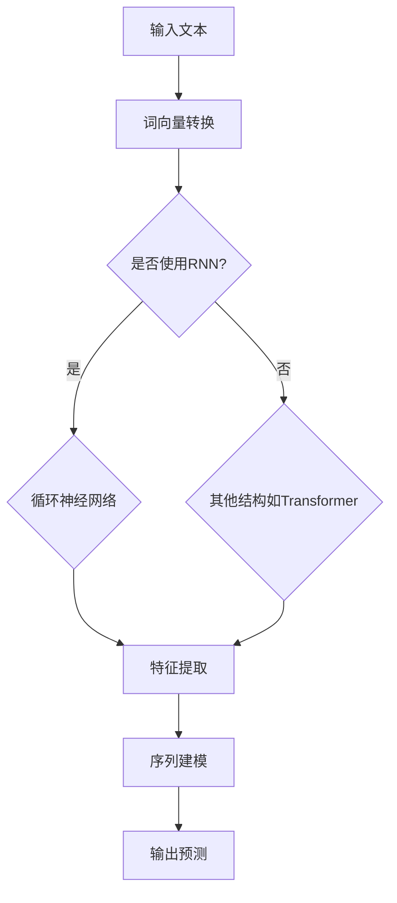

                 

关键词：大语言模型，神经网络，发展历史，应用指南

## 摘要

本文旨在深入探讨大语言模型及其背后的神经网络技术发展历史。通过梳理从人工神经网络到深度学习的演变过程，本文旨在为读者提供一个全面的视角，了解大语言模型的起源、核心概念及其在各个领域的广泛应用。同时，本文还将分析大语言模型面临的挑战和未来的发展趋势，为科研人员和开发者提供有价值的参考。

## 1. 背景介绍

### 1.1 大语言模型的概念

大语言模型（Large Language Model）是一种基于深度学习的自然语言处理技术，它能够理解和生成人类语言。大语言模型通过学习大量的文本数据，捕捉语言的结构和语义，从而实现文本生成、情感分析、机器翻译等多种任务。近年来，随着计算资源和数据量的增长，大语言模型在性能和规模上取得了显著的突破。

### 1.2 神经网络的发展历程

神经网络（Neural Networks）是模仿人脑结构和功能的一种计算模型，最早由心理学家麦卡洛克（Warren McCulloch）和数理逻辑学家皮茨（Walter Pitts）在1943年提出。神经网络的发展经历了从简单的感知机（Perceptron）到复杂的深度学习（Deep Learning）的过程。

- **人工神经网络（Artificial Neural Networks，ANNs）**：20世纪80年代，人工神经网络开始应用于图像识别、语音识别等领域，但由于算法的局限性，其发展一度陷入低潮。
- **深度学习（Deep Learning）**：21世纪初，随着计算能力的提升和大数据的涌现，深度学习迅速崛起。深度学习通过多层神经网络结构，实现了在图像识别、语音识别、自然语言处理等领域的高性能表现。

## 2. 核心概念与联系

### 2.1 大语言模型的核心概念

大语言模型的核心概念包括：

- **词向量（Word Embeddings）**：词向量是语言模型的基础，它将文字转换为数值表示，从而实现文本数据的数学化。
- **神经网络结构（Network Architecture）**：神经网络的结构决定了模型的复杂度和性能。常见的大语言模型结构包括循环神经网络（RNN）、长短期记忆网络（LSTM）和变换器（Transformer）等。

### 2.2 神经网络与自然语言处理的关系

神经网络与自然语言处理（NLP）的关系可以从以下几个方面来理解：

- **特征提取（Feature Extraction）**：神经网络能够自动从原始文本中提取特征，从而减少手工特征工程的工作量。
- **序列建模（Sequence Modeling）**：神经网络能够处理序列数据，这对于理解语言的顺序结构和上下文信息至关重要。
- **并行计算（Parallel Computing）**：神经网络的结构使得其计算可以并行进行，这提高了模型训练和预测的效率。

### 2.3 Mermaid 流程图

以下是一个简化的神经网络与自然语言处理关系的 Mermaid 流程图：



## 3. 核心算法原理 & 具体操作步骤

### 3.1 算法原理概述

大语言模型的算法原理主要涉及以下几个方面：

- **前向传播（Forward Propagation）**：数据从输入层通过多个隐藏层，直到输出层。
- **反向传播（Backpropagation）**：计算输出层误差，反向传播至输入层，更新各层权重。
- **优化算法（Optimization Algorithms）**：常用的优化算法包括随机梯度下降（SGD）、Adam等。

### 3.2 算法步骤详解

1. **数据预处理**：包括分词、词向量编码、序列化等步骤。
2. **模型构建**：选择合适的神经网络结构，如Transformer。
3. **训练**：通过大量文本数据进行训练，优化模型参数。
4. **评估**：使用验证集评估模型性能。
5. **部署**：将训练好的模型部署到实际应用场景中。

### 3.3 算法优缺点

- **优点**：大语言模型能够自动学习语言结构，提高NLP任务的性能。
- **缺点**：训练过程需要大量计算资源和时间，且模型解释性较差。

### 3.4 算法应用领域

大语言模型在以下领域有广泛应用：

- **文本生成**：如文章、对话生成等。
- **情感分析**：对文本的情感进行分类和分析。
- **机器翻译**：自动翻译不同语言之间的文本。
- **问答系统**：基于用户提问，提供相关回答。

## 4. 数学模型和公式 & 详细讲解 & 举例说明

### 4.1 数学模型构建

大语言模型的数学模型主要基于神经网络，其基本结构可以表示为：

\[ h_l = \sigma(W_l \cdot h_{l-1} + b_l) \]

其中，\( h_l \)表示第\( l \)层的激活值，\( W_l \)和\( b_l \)分别是权重和偏置，\( \sigma \)是激活函数。

### 4.2 公式推导过程

以变换器（Transformer）为例，其核心的注意力机制可以表示为：

\[ \text{Attention}(Q, K, V) = \frac{1}{\sqrt{d_k}} \text{softmax}\left(\frac{QK^T}{d_k}\right) V \]

其中，\( Q \)、\( K \)和\( V \)分别是查询（Query）、键（Key）和值（Value）向量，\( d_k \)是键向量的维度。

### 4.3 案例分析与讲解

以BERT（Bidirectional Encoder Representations from Transformers）为例，其训练过程可以简化为以下步骤：

1. **输入序列编码**：将文本序列转换为词向量。
2. **前向传播**：通过多层变换器进行特征提取。
3. **输出层**：对特征进行分类或回归。
4. **损失函数**：使用交叉熵损失函数优化模型。

## 5. 项目实践：代码实例和详细解释说明

### 5.1 开发环境搭建

- 安装Python 3.7及以上版本。
- 安装TensorFlow 2.0及以上版本。
- 安装必要的文本预处理库，如spaCy、NLTK等。

### 5.2 源代码详细实现

以下是一个简单的BERT模型训练示例：

```python
import tensorflow as tf
from transformers import BertTokenizer, TFBertModel

# 加载预训练的BERT模型
tokenizer = BertTokenizer.from_pretrained('bert-base-uncased')
model = TFBertModel.from_pretrained('bert-base-uncased')

# 准备输入数据
inputs = tokenizer("Hello, my dog is cute", return_tensors='tf')

# 训练模型
outputs = model(inputs)
logits = outputs.logits

# 使用交叉熵损失函数
loss = tf.keras.losses.SparseCategoricalCrossentropy(from_logits=True)
loss_value = loss(inputs['input_ids'], outputs.logits)

# 更新模型权重
optimizer = tf.optimizers.Adam(learning_rate=1e-5)
optimizer.minimize(loss_value, inputs)

# 评估模型
accuracy = tf.reduce_mean(tf.cast(tf.equal(outputs.logits, inputs['input_ids']), tf.float32))
print("Accuracy:", accuracy.numpy())
```

### 5.3 代码解读与分析

上述代码首先加载了预训练的BERT模型，然后准备输入数据并进行模型训练。最后，使用交叉熵损失函数评估模型性能。

### 5.4 运行结果展示

在运行上述代码后，我们可以在控制台上看到模型的准确率。在实际应用中，我们可以通过调整超参数、增加训练数据量等方式进一步提高模型性能。

## 6. 实际应用场景

### 6.1 文本生成

大语言模型在文本生成方面有广泛应用，如自动撰写文章、生成对话等。

### 6.2 情感分析

大语言模型能够分析文本的情感倾向，应用于社交媒体分析、客户满意度调查等领域。

### 6.3 机器翻译

大语言模型在机器翻译方面表现出色，能够实现多种语言之间的自动翻译。

### 6.4 未来应用展望

随着大语言模型技术的不断发展，未来有望在更多领域发挥重要作用，如智能问答系统、自动编程等。

## 7. 工具和资源推荐

### 7.1 学习资源推荐

- 《深度学习》（Goodfellow, Bengio, Courville著）
- 《自然语言处理实战》（Saharia, Yang著）

### 7.2 开发工具推荐

- TensorFlow
- PyTorch

### 7.3 相关论文推荐

- Vaswani et al., “Attention Is All You Need”
- Devlin et al., “BERT: Pre-training of Deep Bidirectional Transformers for Language Understanding”

## 8. 总结：未来发展趋势与挑战

### 8.1 研究成果总结

大语言模型在自然语言处理领域取得了显著的成果，其应用范围不断扩大。

### 8.2 未来发展趋势

未来，大语言模型将继续朝着更高性能、更小模型、更高效训练方向发展。

### 8.3 面临的挑战

大语言模型在计算资源、数据隐私、模型解释性等方面仍面临挑战。

### 8.4 研究展望

随着技术的不断进步，大语言模型有望在更多领域实现突破性应用。

## 9. 附录：常见问题与解答

### 9.1 什么是词向量？

词向量是语言模型的基础，它将文字转换为数值表示，从而实现文本数据的数学化。

### 9.2 什么是变换器（Transformer）？

变换器是一种用于自然语言处理的神经网络结构，它通过注意力机制实现高效的序列建模。

### 9.3 如何评估大语言模型的性能？

常用的评估指标包括准确率、损失函数等。

----------------------------------------------------------------

以上是本文《大语言模型应用指南：神经网络的发展历史》的正文部分。希望本文能够为读者提供一个全面、深入的视角，了解大语言模型及其背后的神经网络技术。在未来的研究中，我们期待大语言模型能够取得更多突破，为人类带来更多便利。作者：禅与计算机程序设计艺术 / Zen and the Art of Computer Programming。

