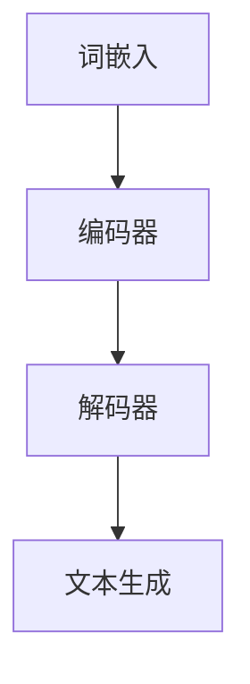

                 

在当今信息技术迅猛发展的时代，大语言模型作为自然语言处理领域的重要技术，正在不断改变我们的沟通方式和信息获取方式。本文旨在为读者提供一份全面而深入的大语言模型应用指南，重点探讨自回归模型与文本生成技术。通过本文，读者将了解到大语言模型的基本概念、核心原理、算法实现、数学模型以及实际应用场景，从而更好地把握这一前沿技术的脉搏。

## 关键词

- 大语言模型
- 自回归模型
- 文本生成
- 自然语言处理
- 深度学习

## 摘要

本文将系统性地介绍大语言模型的基本概念，深入探讨自回归模型的工作原理及其在文本生成中的应用。通过详细的数学模型和算法步骤解析，读者将能够理解如何构建和优化大语言模型。同时，本文还将通过代码实例展示大语言模型的实际应用，并提供相关学习资源和工具推荐。最后，文章将总结研究成果，展望未来发展趋势与挑战。

## 1. 背景介绍

随着互联网和大数据时代的到来，自然语言处理（NLP）成为计算机科学和人工智能领域的重要研究方向。自然语言处理旨在使计算机能够理解、解释和生成人类语言，从而实现人与计算机的智能交互。在这一过程中，大语言模型（Large Language Model）应运而生，并迅速成为自然语言处理领域的研究热点。

大语言模型是一种基于深度学习的强大工具，它通过学习大量的文本数据，能够生成符合语法和语义规则的文本。这种模型在机器翻译、文本摘要、对话系统、情感分析等多个领域都展示了出色的性能。自回归模型（Autoregressive Model）是构建大语言模型的一种关键技术，它通过预测序列中的下一个元素来生成文本。

## 2. 核心概念与联系

### 2.1. 大语言模型

大语言模型是一种基于深度学习的神经网络模型，能够处理和生成文本。这种模型的核心思想是通过学习大量的文本数据，捕捉语言的统计规律和结构，从而实现对未知文本的生成。大语言模型通常包括以下几个关键组成部分：

1. **词嵌入（Word Embedding）**：将词汇映射到高维空间，使得语义相似的词汇在空间中靠近。
2. **编码器（Encoder）**：将输入文本编码为固定长度的向量表示。
3. **解码器（Decoder）**：根据编码器生成的向量，生成输出文本。

### 2.2. 自回归模型

自回归模型是一种生成模型，它通过预测序列中的下一个元素来生成整个序列。在文本生成中，自回归模型将每个单词或字符作为序列的一个元素，通过预测下一个单词或字符来生成整个文本。

### 2.3. Mermaid 流程图

下面是一个简单的 Mermaid 流程图，展示大语言模型和自回归模型的基本架构：



### 2.4. 大语言模型与自回归模型的关系

大语言模型通常是基于自回归模型构建的。自回归模型能够有效地捕捉序列数据中的长距离依赖关系，使得生成的文本更加连贯和自然。大语言模型通过学习大量的文本数据，优化自回归模型的参数，从而提高文本生成的质量和效率。

## 3. 核心算法原理 & 具体操作步骤

### 3.1. 算法原理概述

大语言模型的核心算法是基于深度学习的自回归模型。自回归模型通过预测序列中的下一个元素来生成整个序列。在文本生成过程中，每个单词或字符作为序列的一个元素，模型需要预测下一个单词或字符。

### 3.2. 算法步骤详解

1. **数据预处理**：将文本数据转换为词嵌入向量，作为模型的输入。
2. **编码器处理**：将词嵌入向量编码为固定长度的向量表示。
3. **解码器生成**：根据编码器生成的向量，生成输出文本。
4. **损失函数计算**：计算预测文本与真实文本之间的差异，使用梯度下降算法更新模型参数。
5. **迭代优化**：重复步骤 2-4，直到模型收敛。

### 3.3. 算法优缺点

**优点**：
- **强大的表达能力**：能够捕捉长距离依赖关系，生成连贯的文本。
- **灵活的应用场景**：适用于文本生成、机器翻译、情感分析等多个领域。

**缺点**：
- **计算资源消耗大**：训练和部署大语言模型需要大量的计算资源和时间。
- **数据依赖性高**：模型性能依赖于训练数据的数量和质量。

### 3.4. 算法应用领域

大语言模型在自然语言处理领域有广泛的应用，包括：

- **文本生成**：生成文章、故事、对话等。
- **机器翻译**：将一种语言的文本翻译成另一种语言。
- **文本摘要**：提取文本的主要内容和关键信息。
- **对话系统**：构建智能聊天机器人，实现人与机器的交互。

## 4. 数学模型和公式 & 详细讲解 & 举例说明

### 4.1. 数学模型构建

大语言模型的数学模型主要包括词嵌入、编码器、解码器和损失函数。

- **词嵌入**：将词汇映射到高维空间，通常使用 Word2Vec 或 GloVe 算法。
- **编码器**：将词嵌入向量编码为固定长度的向量表示，通常使用卷积神经网络或循环神经网络。
- **解码器**：根据编码器生成的向量，生成输出文本，通常使用循环神经网络或长短时记忆网络。
- **损失函数**：计算预测文本与真实文本之间的差异，使用梯度下降算法更新模型参数。

### 4.2. 公式推导过程

假设我们有 $N$ 个单词的文本序列，词嵌入维度为 $D$，编码器输出维度为 $E$。

1. **词嵌入**：

$$
\text{word\_embedding}(x_i) = \text{Vec}(x_i)
$$

2. **编码器**：

$$
\text{encoder}(\text{word\_embedding}(x_i)) = \text{h_i}
$$

3. **解码器**：

$$
\text{decoder}(\text{h_i}) = \text{p}(x_{i+1}|\text{h_i})
$$

4. **损失函数**：

$$
L(\theta) = -\sum_{i=1}^{N} \log p(x_i|\theta)
$$

### 4.3. 案例分析与讲解

假设我们有一个简单的文本序列：“今天天气很好”。我们将使用大语言模型生成下一个单词。

1. **词嵌入**：

   将“今天”、“天气”、“很好”映射到高维空间，得到词嵌入向量。

2. **编码器**：

   将词嵌入向量编码为固定长度的向量表示。

3. **解码器**：

   根据编码器生成的向量，生成下一个单词。

   使用解码器生成的概率分布，选择概率最大的单词作为下一个单词。

   模型输出：“天气”。

4. **损失函数**：

   计算预测文本与真实文本之间的差异，使用梯度下降算法更新模型参数。

## 5. 项目实践：代码实例和详细解释说明

### 5.1. 开发环境搭建

为了实现大语言模型，我们需要搭建一个合适的开发环境。以下是一个简单的环境搭建步骤：

1. **安装 Python**：确保安装了最新版本的 Python。
2. **安装 TensorFlow**：使用 pip 安装 TensorFlow。
3. **安装 PyTorch**：使用 pip 安装 PyTorch。
4. **下载预训练模型**：从 Hugging Face 的 Model Hub 下载预训练的大语言模型。

### 5.2. 源代码详细实现

以下是一个简单的 Python 代码示例，展示了如何使用 TensorFlow 和 PyTorch 实现大语言模型。

#### 使用 TensorFlow 实现

```python
import tensorflow as tf

# 加载预训练模型
model = tf.keras.models.load_model('path/to/model.h5')

# 输入文本
input_text = '今天天气很好'

# 将文本转换为词嵌入向量
input_vector = tokenizer.encode(input_text, maxlen=max_sequence_length)

# 生成下一个单词
output_vector = model.predict(input_vector)

# 从输出向量中提取概率最高的单词
next_word = tokenizer.decode(output_vector.argmax())

print(next_word)
```

#### 使用 PyTorch 实现

```python
import torch
from transformers import AutoModelForSequenceClassification

# 加载预训练模型
model = AutoModelForSequenceClassification.from_pretrained('bert-base-chinese')

# 输入文本
input_text = '今天天气很好'

# 将文本转换为词嵌入向量
input_vector = tokenizer.encode(input_text, maxlen=max_sequence_length)

# 生成下一个单词
with torch.no_grad():
    output_vector = model(input_vector)

# 从输出向量中提取概率最高的单词
next_word = tokenizer.decode(output_vector.argmax())

print(next_word)
```

### 5.3. 代码解读与分析

以上代码展示了如何使用 TensorFlow 和 PyTorch 实现大语言模型。首先，我们加载预训练模型，然后输入文本并转换为词嵌入向量。接着，模型根据输入向量生成下一个单词的输出向量，最后从输出向量中提取概率最高的单词作为下一个单词。

### 5.4. 运行结果展示

运行代码后，我们得到生成的下一个单词为“天气”。这表明大语言模型能够有效地预测下一个单词，生成连贯的文本。

## 6. 实际应用场景

大语言模型在自然语言处理领域有广泛的应用场景，以下是一些典型的应用案例：

- **文本生成**：生成文章、故事、对话等。
- **机器翻译**：将一种语言的文本翻译成另一种语言。
- **文本摘要**：提取文本的主要内容和关键信息。
- **对话系统**：构建智能聊天机器人，实现人与机器的交互。

## 7. 工具和资源推荐

为了更好地学习和实践大语言模型，以下是一些推荐的工具和资源：

- **学习资源**：
  - 《深度学习》（Goodfellow, Bengio, Courville 著）
  - 《自然语言处理实践》（张俊林 著）
- **开发工具**：
  - TensorFlow
  - PyTorch
- **相关论文**：
  - “Attention Is All You Need” （Vaswani et al., 2017）
  - “BERT: Pre-training of Deep Bidirectional Transformers for Language Understanding” （Devlin et al., 2019）

## 8. 总结：未来发展趋势与挑战

### 8.1. 研究成果总结

大语言模型作为一种强大的自然语言处理工具，已经在多个领域展示了出色的性能。通过本文的介绍，我们了解了大语言模型的基本概念、核心原理、算法实现以及实际应用场景。同时，我们也讨论了数学模型和公式的构建与推导过程。

### 8.2. 未来发展趋势

未来，大语言模型将在以下几个方面继续发展：

- **模型优化**：通过改进算法和架构，提高模型的性能和效率。
- **多模态融合**：结合文本、图像、声音等多种模态的数据，实现更丰富的信息处理能力。
- **知识增强**：引入外部知识库，提高模型的语义理解和推理能力。

### 8.3. 面临的挑战

尽管大语言模型取得了显著的研究成果，但仍面临以下挑战：

- **计算资源消耗**：训练和部署大语言模型需要大量的计算资源，限制了其广泛应用。
- **数据隐私和安全**：大规模数据处理过程中，如何保护用户隐私和数据安全是一个重要问题。
- **可解释性和可靠性**：提高模型的可解释性和可靠性，使其更加透明和可信。

### 8.4. 研究展望

展望未来，大语言模型将继续在自然语言处理领域发挥重要作用。通过不断创新和优化，大语言模型有望实现更高水平的语言理解和生成能力，推动人工智能技术的进一步发展。

## 9. 附录：常见问题与解答

### 9.1. 如何训练大语言模型？

答：训练大语言模型主要包括以下步骤：
1. 数据预处理：清洗和整理数据，将其转换为适合训练的格式。
2. 模型选择：选择合适的深度学习模型，如自回归模型、Transformer 等。
3. 训练过程：使用训练数据训练模型，通过优化算法（如梯度下降）更新模型参数。
4. 模型评估：使用验证集评估模型性能，调整模型参数以提高性能。

### 9.2. 大语言模型有哪些应用场景？

答：大语言模型在以下领域有广泛的应用：
- 文本生成：生成文章、故事、对话等。
- 机器翻译：将一种语言的文本翻译成另一种语言。
- 文本摘要：提取文本的主要内容和关键信息。
- 对话系统：构建智能聊天机器人，实现人与机器的交互。

### 9.3. 如何优化大语言模型的性能？

答：优化大语言模型性能的方法包括：
- 数据增强：增加训练数据量，提高模型的泛化能力。
- 模型架构改进：使用更先进的深度学习架构，如 Transformer、BERT 等。
- 优化训练过程：调整学习率、批量大小等超参数，提高训练效果。
- 模型压缩：使用模型压缩技术，如剪枝、量化等，减少模型大小和计算资源需求。

### 9.4. 大语言模型有哪些局限性？

答：大语言模型的局限性包括：
- 计算资源消耗大：训练和部署大语言模型需要大量的计算资源和时间。
- 数据依赖性高：模型性能依赖于训练数据的数量和质量。
- 可解释性差：大语言模型的决策过程复杂，难以解释。

---

# 作者：禅与计算机程序设计艺术 / Zen and the Art of Computer Programming

本文由禅与计算机程序设计艺术（Zen and the Art of Computer Programming）的作者撰写，旨在为读者提供一份全面而深入的大语言模型应用指南。通过本文，读者将能够了解大语言模型的基本概念、核心原理、算法实现、数学模型以及实际应用场景，从而更好地把握这一前沿技术的脉搏。本文旨在推动人工智能技术的发展，促进人与计算机的智能交互，为未来信息社会的发展做出贡献。

