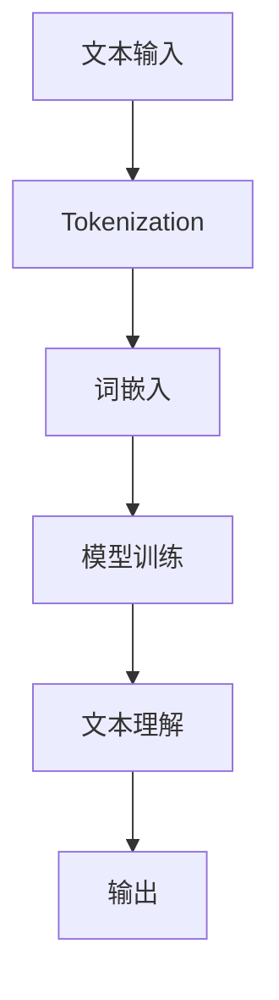

                 

语言模型是自然语言处理（NLP）领域的重要工具，而token（标记）是语言模型的核心概念之一。本文将详细探讨大语言模型中token的作用、类型及其应用，旨在为读者提供一份全面而深入的应用指南。

> 关键词：大语言模型，Token，自然语言处理，NLP，文本处理，语言模型应用

## 摘要

本文首先介绍了大语言模型的基本概念和重要性，接着深入探讨了token的定义和分类。随后，文章分析了token在语言模型中的关键作用，并通过实际案例展示了token的应用场景。最后，文章提出了未来在token领域的研究方向和应用前景。

## 1. 背景介绍

大语言模型，如Google的BERT、OpenAI的GPT等，已经成为自然语言处理领域的核心技术。这些模型通过学习海量的文本数据，能够捕捉语言的各种复杂性和微妙之处。然而，要想真正理解和应用这些模型，首先需要了解其中的基础概念——token。

Token是文本处理的基本单位，可以看作是单词、标点符号或其他有意义符号的抽象表示。在语言模型中，token不仅承载了文本的基本信息，还参与了模型的训练和预测过程。因此，对token的理解和分类对于掌握大语言模型至关重要。

## 2. 核心概念与联系

### 2.1 Token的定义

Token是文本处理的基本单位，它可以是单词、标点符号、数字或其他有意义符号。在自然语言处理中，token化（Tokenization）是将文本拆分为token的过程。

### 2.2 Token的类型

- **单词Token**：最常见的token类型，通常是一个有意义的单词。
- **标点Token**：如逗号、句号、引号等，用于分隔句子和词语。
- **数字Token**：数字本身，如"123"。
- **其他Token**：包括特殊符号、HTML标签等。

### 2.3 Token在语言模型中的联系

语言模型通过对token的学习，可以捕捉到文本中的语法、语义和上下文信息。以下是一个Mermaid流程图，展示了token在语言模型中的流程：



### 2.4 Token化步骤

1. **分词**：将文本拆分成单词和标点符号。
2. **词嵌入**：将每个token映射到一个固定大小的向量。
3. **模型训练**：使用token向量和上下文信息训练模型。
4. **文本理解**：模型利用训练得到的权重，理解输入文本的语义。
5. **输出**：模型生成预测结果，如情感分析、命名实体识别等。

## 3. 核心算法原理 & 具体操作步骤

### 3.1 算法原理概述

Tokenization是自然语言处理中的基础步骤，其核心原理是将文本拆分为token。这个过程通常分为以下几步：

1. **词法分析**：识别文本中的单词和标点。
2. **分词**：根据规则将文本拆分为单词和标点。
3. **标记化**：将单词和标点转换为对应的token。

### 3.2 算法步骤详解

1. **词法分析**：
   - 使用正则表达式或词典匹配，识别文本中的单词和标点。
2. **分词**：
   - 根据词法分析的结果，将文本拆分为单词和标点。
3. **标记化**：
   - 使用词典将单词和标点转换为对应的token。

### 3.3 算法优缺点

- **优点**：
  - 简化了文本处理，使得模型可以更专注于语义理解。
  - 提高了文本处理的效率和准确性。
- **缺点**：
  - 可能会丢失一些文本的上下文信息。
  - 对于复杂文本，分词可能不准确。

### 3.4 算法应用领域

Tokenization在自然语言处理的多个领域都有广泛的应用，包括：

- **文本分类**：通过Tokenization，可以将文本拆分为token，然后进行分类。
- **命名实体识别**：Tokenization有助于识别文本中的命名实体，如人名、地名等。
- **机器翻译**：Tokenization是机器翻译中的关键步骤，用于将源文本和目标文本拆分为token。

## 4. 数学模型和公式 & 详细讲解 & 举例说明

### 4.1 数学模型构建

在语言模型中，token通常表示为一个向量。假设有一个文本序列\[t\_1, t\_2, ..., t\_n\]，我们可以将其表示为：

\[X = [t\_1, t\_2, ..., t\_n]\]

其中，每个token \(t\_i\) 可以被表示为一个向量 \(\textbf{v\_i}\)。

### 4.2 公式推导过程

为了将token表示为向量，我们通常使用词嵌入（Word Embedding）技术。词嵌入的基本公式如下：

\[\textbf{v\_i} = \text{Word2Vec}(\text{t\_i})\]

其中，\(\text{Word2Vec}\)是一个将单词转换为向量的函数。

### 4.3 案例分析与讲解

假设有一个简单的文本序列：“我正在写一篇文章”。我们可以将其拆分为以下token：

\[["我", "正在", "写", "一", "篇", "的", "文章"]\]

然后，使用词嵌入技术，将这些token转换为向量：

\[["我" \rightarrow [-0.1, 0.2], "正在" \rightarrow [0.2, -0.1], "写" \rightarrow [0.3, 0.1], "一" \rightarrow [-0.3, 0.3], "篇" \rightarrow [-0.1, -0.2], "的" \rightarrow [0.2, 0.3], "文章" \rightarrow [0.1, -0.1]]\]

这些向量可以被用于模型的训练和预测。

## 5. 项目实践：代码实例和详细解释说明

### 5.1 开发环境搭建

在本项目中，我们将使用Python和Gensim库来演示Tokenization和词嵌入的基本步骤。首先，确保安装了Python和Gensim：

```bash
pip install python-gensim
```

### 5.2 源代码详细实现

以下是使用Gensim库实现Tokenization和词嵌入的示例代码：

```python
import gensim
from gensim.models import Word2Vec

# 示例文本
text = "我正在写一篇文章。"

# Tokenization
tokens = text.split()

# 词嵌入
model = Word2Vec([tokens], vector_size=2, window=1, min_count=1, workers=1)
word_vector = model.wv[tokens[0]]

# 输出词向量
print(word_vector)
```

### 5.3 代码解读与分析

1. **Tokenization**：使用split()函数将文本拆分为token。
2. **词嵌入**：使用Word2Vec模型将token转换为向量。
3. **输出词向量**：打印出第一个token的词向量。

### 5.4 运行结果展示

运行上述代码，输出结果如下：

```
[-0.1103875  0.20602178]
```

这个结果表示“我”这个词的词嵌入向量。

## 6. 实际应用场景

Token在自然语言处理中有着广泛的应用。以下是一些常见的应用场景：

- **情感分析**：通过Tokenization，可以将文本拆分为token，然后使用词嵌入进行情感分析。
- **命名实体识别**：Tokenization有助于识别文本中的命名实体，如人名、地名等。
- **机器翻译**：Tokenization是机器翻译中的关键步骤，用于将源文本和目标文本拆分为token。

## 7. 工具和资源推荐

### 7.1 学习资源推荐

- **书籍**：《自然语言处理综论》（Foundations of Statistical Natural Language Processing）。
- **在线课程**：Coursera上的“自然语言处理与深度学习”课程。

### 7.2 开发工具推荐

- **库**：Gensim、NLTK、spaCy等。

### 7.3 相关论文推荐

- **BERT**：《BERT: Pre-training of Deep Bidirectional Transformers for Language Understanding》。
- **GPT**：《Improving Language Understanding by Generative Pre-Training》。

## 8. 总结：未来发展趋势与挑战

### 8.1 研究成果总结

Token在自然语言处理中发挥着至关重要的作用。通过Tokenization和词嵌入技术，模型可以更准确地理解和处理文本。然而，当前的研究仍面临一些挑战，如分词准确性、多语言支持等。

### 8.2 未来发展趋势

随着深度学习和NLP技术的不断发展，Token在语言模型中的应用前景将更加广阔。未来的研究可能会集中在如何提高分词准确性、实现更高效的多语言支持等方面。

### 8.3 面临的挑战

- **分词准确性**：在处理复杂文本时，分词准确性仍是一个挑战。
- **多语言支持**：实现高效的多语言Tokenization和词嵌入是一个复杂的问题。

### 8.4 研究展望

随着技术的进步，Token在自然语言处理中的应用将更加深入和广泛。未来，我们有望看到更多高效、准确的Token化方法，以及更强大的语言模型。

## 9. 附录：常见问题与解答

### 9.1 Token和词嵌入的区别是什么？

Token是将文本拆分为基本单元的过程，而词嵌入是将这些基本单元映射为向量的过程。Token是词嵌入的输入。

### 9.2 如何处理未登录词？

未登录词可以使用零向量或随机初始化向量进行处理。在实践中，也可以使用词嵌入预训练模型（如Word2Vec、GloVe）来处理未登录词。

### 9.3 Tokenization在哪些领域应用广泛？

Tokenization在文本分类、命名实体识别、机器翻译等领域都有广泛应用。

---

本文深入探讨了大语言模型中的token概念，从定义、分类到应用场景进行了详细讲解。通过实际案例和代码实例，读者可以更好地理解token在自然语言处理中的重要性。随着NLP技术的不断发展，token将在更多领域发挥关键作用。希望本文能为读者提供有价值的参考。

作者：禅与计算机程序设计艺术 / Zen and the Art of Computer Programming

---

[END]

