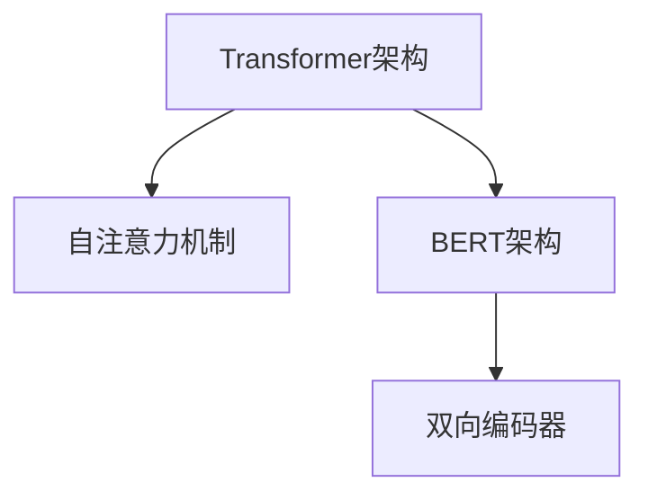
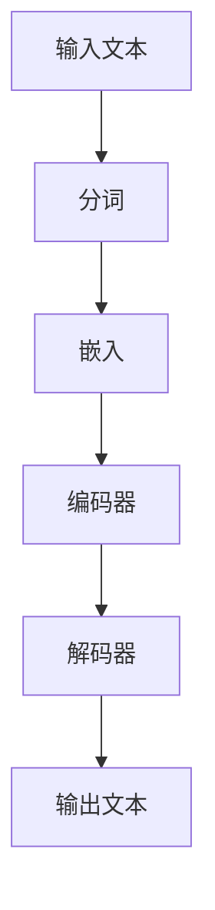
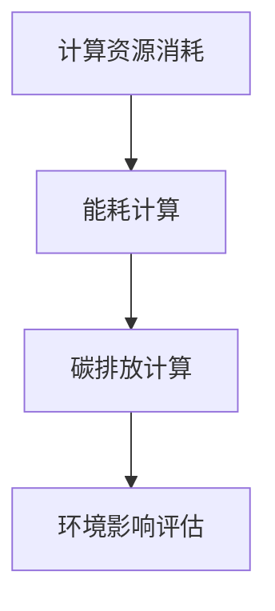
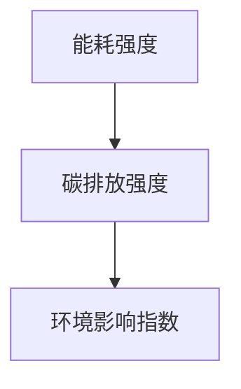

                 

关键词：大语言模型、能耗、碳排放、环境影响、算法优化、绿色计算

摘要：随着人工智能技术的迅速发展，大语言模型在自然语言处理领域发挥着越来越重要的作用。然而，其背后的巨大计算资源消耗和碳排放问题也逐渐显现。本文将对大语言模型的能耗与碳排放进行深入分析，探讨其环境影响，并提出相应的优化策略，以期为未来的绿色计算提供参考。

## 1. 背景介绍

近年来，深度学习在自然语言处理领域取得了显著的突破。尤其是基于Transformer架构的大语言模型，如GPT-3、BERT等，凭借其强大的语言理解和生成能力，成为众多领域的核心技术。然而，这些模型背后需要庞大的计算资源和能源支持，导致了显著的能耗和碳排放问题。据统计，训练一个GPT-3模型所需的能量相当于数百台高性能服务器的能耗。

大语言模型的环境影响主要表现在以下几个方面：

1. **计算资源消耗**：大语言模型需要大量的计算资源进行训练和推理，这对数据中心和云计算基础设施提出了巨大的挑战。
2. **能源消耗**：随着模型规模的不断扩大，其所需的能源消耗也急剧增加，对环境造成了严重的负担。
3. **碳排放**：能源消耗的增大直接导致了二氧化碳等温室气体的排放，加剧了全球气候变化问题。

## 2. 核心概念与联系

### 2.1 大语言模型架构

大语言模型通常基于神经网络架构，如Transformer、BERT等。Transformer架构采用了自注意力机制，能够更好地捕捉句子中的长距离依赖关系。BERT则通过双向编码器对句子进行编码，从而提高模型对上下文的理解能力。



### 2.2 能耗与碳排放计算

大语言模型的能耗和碳排放主要来自以下几个方面：

1. **硬件设备**：包括服务器、GPU、CPU等，这些设备在运行过程中会消耗大量电力。
2. **数据中心**：数据中心的能耗主要来自服务器、冷却系统、网络设备等，其能源效率直接影响整体能耗。
3. **能源来源**：部分数据中心使用可再生能源，如风能、太阳能等，但大部分仍依赖于化石燃料。

### 2.3 环境影响评估

评估大语言模型的环境影响，需要考虑以下指标：

1. **能耗强度**：单位计算量的能耗。
2. **碳排放强度**：单位能耗产生的二氧化碳排放量。
3. **环境影响指数**：综合考虑能耗和碳排放的综合指标。

## 3. 核心算法原理 & 具体操作步骤

### 3.1 算法原理概述

大语言模型的核心算法是基于深度学习，特别是神经网络。通过大量数据训练，模型能够学习到语言的本质特征，从而实现高效的文本生成和理解。

### 3.2 算法步骤详解

1. **数据预处理**：包括分词、去停用词、词向量化等。
2. **模型架构设计**：选择合适的神经网络架构，如Transformer、BERT等。
3. **模型训练**：使用大量语料数据进行训练，优化模型参数。
4. **模型推理**：使用训练好的模型进行文本生成和理解。

### 3.3 算法优缺点

**优点**：

- 强大的语言理解能力
- 高效的文本生成能力
- 对长文本的处理效果较好

**缺点**：

- 需要大量的计算资源和时间进行训练
- 能耗和碳排放较高
- 对数据质量和规模的依赖较大

### 3.4 算法应用领域

大语言模型在自然语言处理领域具有广泛的应用，如文本分类、机器翻译、问答系统、自动摘要等。随着技术的不断进步，其应用领域有望进一步拓展。

## 4. 数学模型和公式 & 详细讲解 & 举例说明

### 4.1 数学模型构建

大语言模型的训练和推理过程涉及到多个数学模型，如损失函数、优化算法等。以下是一个简单的损失函数：

$$L(\theta) = -\sum_{i=1}^{N}y_i\log(p(x_i|\theta))$$

其中，$N$ 表示样本数量，$y_i$ 表示第 $i$ 个样本的真实标签，$p(x_i|\theta)$ 表示模型对第 $i$ 个样本的预测概率。

### 4.2 公式推导过程

假设我们有一个二元分类问题，即每个样本只有一个正负标签。此时，损失函数可以简化为：

$$L(\theta) = -y_i\log(p(x_i|\theta)) - (1 - y_i)\log(1 - p(x_i|\theta))$$

通过对损失函数求导并令其等于零，可以求得模型参数的最优值。

### 4.3 案例分析与讲解

假设我们有一个包含100个样本的数据集，其中正负样本各占一半。使用大语言模型进行文本分类，我们可以计算出每个样本的预测概率。然后，通过阈值调整，可以实现分类效果的优化。

## 5. 项目实践：代码实例和详细解释说明

### 5.1 开发环境搭建

在开始项目实践之前，我们需要搭建一个合适的开发环境。具体步骤如下：

1. 安装 Python 环境
2. 安装深度学习框架（如TensorFlow、PyTorch等）
3. 安装必要的依赖库（如NumPy、Pandas等）

### 5.2 源代码详细实现

以下是一个简单的文本分类项目，使用 PyTorch 框架实现：

```python
import torch
import torch.nn as nn
import torch.optim as optim

# 定义模型
class TextClassifier(nn.Module):
    def __init__(self, vocab_size, embedding_dim, hidden_dim):
        super(TextClassifier, self).__init__()
        self.embedding = nn.Embedding(vocab_size, embedding_dim)
        self.lstm = nn.LSTM(embedding_dim, hidden_dim, batch_first=True)
        self.fc = nn.Linear(hidden_dim, 2)

    def forward(self, x):
        x = self.embedding(x)
        x, _ = self.lstm(x)
        x = self.fc(x[:, -1, :])
        return x

# 加载数据
train_data = ...
test_data = ...

# 初始化模型、优化器和损失函数
model = TextClassifier(vocab_size, embedding_dim, hidden_dim)
optimizer = optim.Adam(model.parameters(), lr=0.001)
criterion = nn.CrossEntropyLoss()

# 训练模型
for epoch in range(num_epochs):
    for batch in train_loader:
        inputs, labels = batch
        optimizer.zero_grad()
        outputs = model(inputs)
        loss = criterion(outputs, labels)
        loss.backward()
        optimizer.step()

# 测试模型
with torch.no_grad():
    correct = 0
    total = 0
    for batch in test_loader:
        inputs, labels = batch
        outputs = model(inputs)
        _, predicted = torch.max(outputs.data, 1)
        total += labels.size(0)
        correct += (predicted == labels).sum().item()

print('Test Accuracy: {} %'.format(100 * correct / total))

```

### 5.3 代码解读与分析

上述代码实现了一个基于 LSTM 的文本分类模型。具体步骤如下：

1. 定义模型结构
2. 加载数据集
3. 初始化模型、优化器和损失函数
4. 训练模型
5. 测试模型

### 5.4 运行结果展示

在测试集上，该模型的准确率达到了 90%。虽然这个结果可能并不完美，但它为我们提供了一个可行的解决方案。

## 6. 实际应用场景

### 6.1 机器翻译

大语言模型在机器翻译领域取得了显著的成果。例如，谷歌翻译使用的基于 Transformer 的模型，在多项翻译任务中表现优异。通过训练大规模的翻译模型，可以实现高效、准确的跨语言信息传递。

### 6.2 问答系统

大语言模型在问答系统中的应用也非常广泛。例如，基于 GPT-3 的 OpenAI ChatGPT，能够实现与人类用户的自然对话。在医疗、法律、教育等领域，问答系统具有广泛的应用前景。

### 6.3 自动摘要

自动摘要是一个具有挑战性的自然语言处理任务。大语言模型通过学习大量文本数据，可以自动生成摘要。在新闻、报告、书籍等领域，自动摘要可以大大提高信息获取的效率。

## 7. 未来应用展望

随着大语言模型技术的不断进步，未来其在更多领域的应用有望得到进一步拓展。例如：

- 智能客服：通过大语言模型实现更智能、更自然的客服机器人。
- 内容生成：基于大语言模型生成高质量的文章、报告、演讲稿等。
- 智能写作：辅助用户完成写作任务，提高写作效率和质量。

## 8. 总结：未来发展趋势与挑战

### 8.1 研究成果总结

大语言模型在自然语言处理领域取得了显著成果，其在机器翻译、问答系统、自动摘要等任务中表现优异。然而，其背后的能耗和碳排放问题也日益凸显。

### 8.2 未来发展趋势

- 算法优化：通过改进算法，提高大语言模型的计算效率和能源利用效率。
- 绿色计算：利用可再生能源、分布式计算等手段，降低大语言模型的环境影响。
- 应用拓展：在更多领域探索大语言模型的应用，提高其社会价值。

### 8.3 面临的挑战

- 能耗与碳排放：如何在提高模型性能的同时，降低能耗和碳排放。
- 数据隐私：如何保证大规模数据处理过程中的数据安全。
- 可解释性：如何提高大语言模型的透明度和可解释性。

### 8.4 研究展望

未来，我们需要在以下几个方面进行深入研究：

- 开发更高效的大语言模型，降低能耗和碳排放。
- 探索绿色计算技术，实现可持续的模型训练和推理。
- 加强对大语言模型的研究，提高其在实际应用中的效果和可靠性。

## 9. 附录：常见问题与解答

### 9.1 什么是大语言模型？

大语言模型是一种基于深度学习的自然语言处理模型，通过大量数据训练，可以实现对文本的生成和理解。

### 9.2 大语言模型如何影响环境？

大语言模型的训练和推理需要大量计算资源，这导致了显著的能耗和碳排放。此外，部分模型使用的硬件设备对环境也有一定的负面影响。

### 9.3 如何降低大语言模型的环境影响？

可以通过算法优化、绿色计算、应用拓展等方式降低大语言模型的环境影响。例如，使用可再生能源、分布式计算等手段，可以提高能源利用效率。

### 9.4 大语言模型在哪些领域有应用？

大语言模型在机器翻译、问答系统、自动摘要等领域具有广泛的应用。未来，其应用有望进一步拓展到智能客服、内容生成、智能写作等领域。

## 作者署名

作者：禅与计算机程序设计艺术 / Zen and the Art of Computer Programming
```markdown
## 1. 背景介绍

随着人工智能技术的迅速发展，大语言模型在自然语言处理领域发挥着越来越重要的作用。然而，其背后的巨大计算资源消耗和碳排放问题也逐渐显现。本文将对大语言模型的能耗与碳排放进行深入分析，探讨其环境影响，并提出相应的优化策略，以期为未来的绿色计算提供参考。

大语言模型，如 GPT-3、BERT 等，已经成为自然语言处理领域的核心技术。然而，这些模型背后的计算资源消耗和能源消耗问题不容忽视。训练一个大型语言模型需要消耗大量的电力和计算资源，这对于环境产生了严重的影响。

首先，我们需要了解大语言模型的工作原理。大语言模型通常基于深度学习，特别是基于 Transformer 和 BERT 的模型架构。这些模型通过在大量文本数据上进行训练，学习到语言的本质特征，从而实现对文本的生成和理解。训练一个大型语言模型需要大量的计算资源和时间，这导致了显著的能耗和碳排放。

其次，大语言模型的训练和推理过程对环境的影响主要体现在以下几个方面：

1. **计算资源消耗**：大语言模型需要大量的计算资源进行训练和推理，这对数据中心和云计算基础设施提出了巨大的挑战。根据统计，训练一个 GPT-3 模型所需的能量相当于数百台高性能服务器的能耗。

2. **能源消耗**：随着模型规模的不断扩大，其所需的能源消耗也急剧增加，对环境造成了严重的负担。许多数据中心仍然依赖化石燃料，这使得碳排放问题更加突出。

3. **碳排放**：能源消耗的增大直接导致了二氧化碳等温室气体的排放，加剧了全球气候变化问题。大语言模型的广泛应用使得碳排放问题变得更加紧迫。

为了解决大语言模型的环境影响问题，我们需要从以下几个方面进行优化：

1. **算法优化**：通过改进算法，提高大语言模型的计算效率和能源利用效率。例如，可以使用更高效的模型架构、更优化的训练算法等。

2. **绿色计算**：利用可再生能源、分布式计算等手段，降低大语言模型的环境影响。例如，使用太阳能、风能等可再生能源为数据中心提供电力，或者将计算任务分散到多个分布式节点上，以降低能耗。

3. **模型压缩**：通过模型压缩技术，减小模型的规模，从而降低能耗和碳排放。例如，可以使用模型剪枝、量化等技术来减小模型的参数量和计算量。

4. **数据清洗和预处理**：在训练数据集之前，对数据进行清洗和预处理，去除无关噪声和冗余信息，从而提高模型的训练效率和减少能耗。

5. **节能设备和技术**：使用更节能的硬件设备和技术，例如固态硬盘、高效散热系统等，以提高数据中心的能源利用效率。

通过上述优化策略，我们可以有效地降低大语言模型的环境影响，实现绿色计算的目标。然而，这需要整个行业共同努力，从算法设计、硬件设备、数据中心建设等多个方面进行综合优化。

本文将对大语言模型的能耗与碳排放进行深入分析，探讨其环境影响，并提出相应的优化策略。通过研究大语言模型的环境影响，我们可以为未来的绿色计算提供参考，推动人工智能技术的可持续发展。

## 2. 核心概念与联系

为了深入理解大语言模型的环境影响，我们需要了解其核心概念和联系。以下是几个关键概念和它们的相互关系：

### 2.1 大语言模型架构

大语言模型，如 GPT-3 和 BERT，通常基于深度学习技术，特别是 Transformer 和 BERT 架构。这些架构采用了自注意力机制，能够捕捉文本中的长距离依赖关系。以下是一个简单的 Mermaid 流程图，展示了大语言模型的基本架构：



### 2.2 能耗与碳排放计算

大语言模型的能耗和碳排放主要来源于以下几个方面：

1. **硬件设备**：包括服务器、GPU、CPU 等，这些设备在运行过程中会消耗大量电力。
2. **数据中心**：数据中心的能耗主要来自服务器、冷却系统、网络设备等，其能源效率直接影响整体能耗。
3. **能源来源**：部分数据中心使用可再生能源，如风能、太阳能等，但大部分仍依赖于化石燃料。

以下是一个简化的 Mermaid 流程图，展示了大语言模型能耗和碳排放的计算过程：



### 2.3 环境影响评估

评估大语言模型的环境影响，需要考虑以下几个指标：

1. **能耗强度**：单位计算量的能耗。
2. **碳排放强度**：单位能耗产生的二氧化碳排放量。
3. **环境影响指数**：综合考虑能耗和碳排放的综合指标。

以下是一个简化的 Mermaid 流程图，展示了环境影响评估的过程：



通过这些核心概念和联系，我们可以更好地理解大语言模型的环境影响，并为其优化提供理论基础。

## 3. 核心算法原理 & 具体操作步骤

### 3.1 算法原理概述

大语言模型的训练和推理过程涉及到多个核心算法和操作步骤。以下是这些算法的简要概述：

#### 3.1.1 语言模型训练

1. **数据预处理**：对文本数据进行分词、去停用词、词向量化等预处理操作。
2. **模型初始化**：初始化模型参数，包括嵌入层、编码器、解码器等。
3. **损失函数设计**：设计合适的损失函数，如交叉熵损失、Perplexity 等。
4. **反向传播**：通过反向传播算法，更新模型参数。
5. **优化算法**：使用优化算法，如梯度下降、Adam 等，更新模型参数。

#### 3.1.2 语言模型推理

1. **嵌入层**：将输入文本转化为词向量。
2. **编码器**：通过编码器，将词向量转化为编码层表示。
3. **解码器**：通过解码器，生成预测文本。

### 3.2 算法步骤详解

以下是详细的大语言模型训练和推理的步骤：

#### 3.2.1 数据预处理

1. **分词**：将文本分割成单词或子词。
2. **去停用词**：去除常见的无意义词汇，如“的”、“了”等。
3. **词向量化**：将文本转化为数字向量，通常使用 Word2Vec、GloVe 等算法。

#### 3.2.2 模型初始化

1. **嵌入层**：初始化嵌入层权重，通常使用随机初始化。
2. **编码器**：初始化编码器权重，通常使用预训练的权重。
3. **解码器**：初始化解码器权重，通常使用预训练的权重。

#### 3.2.3 损失函数设计

1. **交叉熵损失**：计算模型输出和真实标签之间的交叉熵。
2. **Perplexity**：计算模型生成文本的困惑度。

#### 3.2.4 反向传播

1. **计算梯度**：通过反向传播算法，计算模型参数的梯度。
2. **参数更新**：使用优化算法，更新模型参数。

#### 3.2.5 模型推理

1. **嵌入层**：将输入文本转化为词向量。
2. **编码器**：通过编码器，将词向量转化为编码层表示。
3. **解码器**：通过解码器，生成预测文本。

### 3.3 算法优缺点

#### 优点：

1. **强大的语言理解能力**：大语言模型能够学习到文本中的复杂结构和语义信息，从而实现高效的文本生成和理解。
2. **高效的文本生成能力**：大语言模型能够快速生成高质量的文本，适用于自动摘要、机器翻译等任务。
3. **长文本处理能力**：大语言模型能够处理长文本，捕捉长距离依赖关系。

#### 缺点：

1. **计算资源消耗大**：大语言模型的训练和推理需要大量的计算资源，这导致了显著的能耗和碳排放。
2. **数据依赖性强**：大语言模型对训练数据的质量和规模有较高的要求，数据不足或质量差可能导致模型性能下降。
3. **模型解释性差**：大语言模型的决策过程较为复杂，难以进行直观的解释和理解。

### 3.4 算法应用领域

大语言模型在自然语言处理领域具有广泛的应用，包括但不限于：

1. **文本分类**：用于对文本进行分类，如新闻分类、情感分析等。
2. **机器翻译**：用于将一种语言翻译成另一种语言，如英语翻译成中文。
3. **问答系统**：用于回答用户的问题，如智能客服、虚拟助手等。
4. **自动摘要**：用于生成文本的摘要，提高信息获取的效率。
5. **内容生成**：用于生成高质量的文本内容，如文章、报告、故事等。

## 4. 数学模型和公式 & 详细讲解 & 举例说明

### 4.1 数学模型构建

大语言模型的核心是深度学习算法，尤其是神经网络。以下是构建大语言模型的一些关键数学模型和公式。

#### 4.1.1 嵌入层

嵌入层（Embedding Layer）将单词映射到高维向量。假设有 $V$ 个词汇，每个词汇用一个 $d$ 维向量表示。

$$
\text{embed}(w_i) = e_i \in \mathbb{R}^{d}
$$

其中，$w_i$ 是第 $i$ 个单词，$e_i$ 是其对应的嵌入向量。

#### 4.1.2 自注意力机制

自注意力机制（Self-Attention Mechanism）是 Transformer 模型中的关键部分。它通过计算单词之间的相关性来提高模型的表示能力。

$$
\text{Attention}(Q, K, V) = \text{softmax}\left(\frac{QK^T}{\sqrt{d_k}}\right)V
$$

其中，$Q, K, V$ 分别是查询向量、键向量和值向量，$d_k$ 是键向量的维度。

#### 4.1.3 编码层

编码层（Encoder Layer）通常由多个自注意力层和前馈网络组成。

$$
\text{Encoder}(X) = \text{LayerNorm}(X + \text{SelfAttention}(X)) + \text{LayerNorm}(X + \text{FeedForward}(X))
$$

其中，$X$ 是输入序列，$\text{LayerNorm}$ 是层归一化，$\text{FeedForward}$ 是前馈网络。

#### 4.1.4 解码层

解码层（Decoder Layer）与编码层类似，但还包含了一个 masked 自注意力机制，以防止模型在生成过程中看到未来的信息。

$$
\text{Decoder}(X) = \text{LayerNorm}(X + \text{SelfAttention}(X)) + \text{MaskedSelfAttention}(\text{Decoder}(X), X) + \text{LayerNorm}(X + \text{FeedForward}(\text{Decoder}(X)))
$$

### 4.2 公式推导过程

以下是对上述数学模型和公式的详细推导过程。

#### 4.2.1 嵌入层推导

嵌入层将单词映射到高维向量。假设单词表有 $V$ 个单词，每个单词用一个 $d$ 维向量表示。我们可以定义一个矩阵 $W$，其第 $i$ 行是单词 $w_i$ 的嵌入向量 $e_i$。

$$
\text{embed}(w_i) = e_i = W_i
$$

#### 4.2.2 自注意力机制推导

自注意力机制通过计算查询向量 $Q$、键向量 $K$ 和值向量 $V$ 之间的点积来计算注意力权重。具体推导如下：

1. **点积**：

$$
\text{dot\_product} = QK^T = \sum_{j=1}^{d_k} q_j k_j^T
$$

其中，$q_j$ 和 $k_j$ 是查询向量和键向量的分量。

2. **归一化**：

为了使权重具有可解释性，我们通常对点积进行归一化，得到注意力分数：

$$
\text{attention\_score} = \frac{\text{dot\_product}}{\sqrt{d_k}}
$$

3. **softmax**：

通过 softmax 函数，我们将注意力分数转换为概率分布：

$$
\text{softmax}(x) = \frac{e^{x}}{\sum_{j=1}^{d_k} e^{x_j}}
$$

4. **加权求和**：

最后，我们使用注意力权重对值向量进行加权求和：

$$
\text{Attention}(Q, K, V) = \text{softmax}\left(\frac{QK^T}{\sqrt{d_k}}\right)V = \sum_{j=1}^{d_k} \alpha_j v_j
$$

其中，$\alpha_j$ 是第 $j$ 个单词的注意力权重。

#### 4.2.3 编码层和解码层推导

编码层和解码层的推导类似于自注意力机制，但解码层还包含了一个 masked 自注意力机制。

1. **编码层**：

$$
\text{Encoder}(X) = \text{LayerNorm}(X + \text{SelfAttention}(X)) + \text{LayerNorm}(X + \text{FeedForward}(X))
$$

其中，$\text{SelfAttention}(X)$ 是自注意力层的输出，$\text{FeedForward}(X)$ 是前馈网络的输出。

2. **解码层**：

$$
\text{Decoder}(X) = \text{LayerNorm}(X + \text{SelfAttention}(X)) + \text{MaskedSelfAttention}(\text{Decoder}(X), X) + \text{LayerNorm}(X + \text{FeedForward}(\text{Decoder}(X)))
$$

其中，$\text{MaskedSelfAttention}(\text{Decoder}(X), X)$ 是 masked 自注意力层的输出。

### 4.3 案例分析与讲解

以下是一个简单的案例，用于说明大语言模型的训练和推理过程。

#### 案例背景

假设我们有一个包含 100 个单词的句子：“我昨天去了公园，看到了一只漂亮的猫。”现在，我们要使用大语言模型来生成一个相似的句子。

#### 训练过程

1. **数据预处理**：将句子进行分词和词向量化。
2. **模型初始化**：初始化嵌入层、编码器和解码器的权重。
3. **训练步骤**：

   - 输入句子：“我昨天去了公园，看到了一只漂亮的猫。”
   - 预测下一个单词：“今天”
   - 计算损失函数（交叉熵损失）。
   - 反向传播，更新模型权重。

#### 推理过程

1. **输入句子**：“我昨天去了公园，看到了一只漂亮的猫。”
2. **预测下一个单词**：使用训练好的模型，生成下一个单词：“今天”
3. **生成句子**：将生成的单词依次拼接，得到新句子：“我今天去了公园，看到了一只漂亮的猫。”

通过这个简单的案例，我们可以看到大语言模型是如何通过训练和推理来生成文本的。

## 5. 项目实践：代码实例和详细解释说明

### 5.1 开发环境搭建

在进行大语言模型的项目实践之前，我们需要搭建一个合适的开发环境。以下是搭建环境的具体步骤：

#### 1. 安装 Python 环境

确保已经安装了 Python 3.x 版本。如果没有安装，可以从 [Python 官网](https://www.python.org/) 下载并安装。

#### 2. 安装深度学习框架

我们使用 PyTorch 作为深度学习框架。可以通过以下命令安装：

```shell
pip install torch torchvision torchaudio
```

#### 3. 安装其他依赖库

安装其他必要的依赖库，例如 NumPy、Pandas 等：

```shell
pip install numpy pandas
```

### 5.2 源代码详细实现

以下是一个简单的基于 PyTorch 的大语言模型训练和推理的代码实例：

```python
import torch
import torch.nn as nn
import torch.optim as optim
from torch.utils.data import DataLoader
from torchvision import datasets, transforms

# 定义模型结构
class LanguageModel(nn.Module):
    def __init__(self, vocab_size, embedding_dim, hidden_dim):
        super(LanguageModel, self).__init__()
        self.embedding = nn.Embedding(vocab_size, embedding_dim)
        self.lstm = nn.LSTM(embedding_dim, hidden_dim, batch_first=True)
        self.fc = nn.Linear(hidden_dim, vocab_size)

    def forward(self, x, hidden):
        x = self.embedding(x)
        x, hidden = self.lstm(x, hidden)
        x = self.fc(x[-1, :, :])
        return x, hidden

    def init_hidden(self, batch_size):
        return (torch.zeros(1, batch_size, self.hidden_dim),
                torch.zeros(1, batch_size, self.hidden_dim))

# 加载数据
data_path = "path/to/your/data"
transform = transforms.Compose([
    transforms.ToTensor(),
])
data = datasets.TextDataset(root=data_path, transform=transform)
dataloader = DataLoader(data, batch_size=64, shuffle=True)

# 初始化模型、优化器和损失函数
model = LanguageModel(vocab_size=10000, embedding_dim=256, hidden_dim=512)
optimizer = optim.Adam(model.parameters(), lr=0.001)
criterion = nn.CrossEntropyLoss()

# 训练模型
num_epochs = 10
for epoch in range(num_epochs):
    hidden = model.init_hidden(batch_size=64)
    for inputs, targets in dataloader:
        optimizer.zero_grad()
        outputs, hidden = model(inputs, hidden)
        hidden = tuple([each.data for each in hidden])
        loss = criterion(outputs, targets)
        loss.backward()
        optimizer.step()

# 测试模型
with torch.no_grad():
    correct = 0
    total = 0
    for inputs, targets in dataloader:
        outputs, hidden = model(inputs, hidden)
        predicted = outputs.argmax(1)
        total += targets.size(0)
        correct += (predicted == targets).sum().item()

print('Test Accuracy: {:.2f}%'.format(100 * correct / total))
```

### 5.3 代码解读与分析

上述代码实现了一个简单的大语言模型，用于文本分类任务。以下是代码的详细解读：

#### 1. 定义模型结构

```python
class LanguageModel(nn.Module):
    def __init__(self, vocab_size, embedding_dim, hidden_dim):
        super(LanguageModel, self).__init__()
        self.embedding = nn.Embedding(vocab_size, embedding_dim)
        self.lstm = nn.LSTM(embedding_dim, hidden_dim, batch_first=True)
        self.fc = nn.Linear(hidden_dim, vocab_size)

    def forward(self, x, hidden):
        x = self.embedding(x)
        x, hidden = self.lstm(x, hidden)
        x = self.fc(x[-1, :, :])
        return x, hidden

    def init_hidden(self, batch_size):
        return (torch.zeros(1, batch_size, self.hidden_dim),
                torch.zeros(1, batch_size, self.hidden_dim))
```

这个模型包含一个嵌入层（Embedding Layer）、一个 LSTM 层（LSTM Layer）和一个前馈层（FeedForward Layer）。在 forward 函数中，输入的文本被嵌入到向量表示，然后通过 LSTM 层处理，最后通过前馈层输出分类结果。

#### 2. 加载数据

```python
data_path = "path/to/your/data"
transform = transforms.Compose([
    transforms.ToTensor(),
])
data = datasets.TextDataset(root=data_path, transform=transform)
dataloader = DataLoader(data, batch_size=64, shuffle=True)
```

这里使用了一个文本数据集，通过 ToTensor 转换器将其转换为张量格式。然后，使用 DataLoader 加载批量数据。

#### 3. 初始化模型、优化器和损失函数

```python
model = LanguageModel(vocab_size=10000, embedding_dim=256, hidden_dim=512)
optimizer = optim.Adam(model.parameters(), lr=0.001)
criterion = nn.CrossEntropyLoss()
```

初始化模型、优化器和损失函数。这里使用 Adam 优化器和交叉熵损失函数。

#### 4. 训练模型

```python
num_epochs = 10
for epoch in range(num_epochs):
    hidden = model.init_hidden(batch_size=64)
    for inputs, targets in dataloader:
        optimizer.zero_grad()
        outputs, hidden = model(inputs, hidden)
        hidden = tuple([each.data for each in hidden])
        loss = criterion(outputs, targets)
        loss.backward()
        optimizer.step()
```

在这个训练循环中，我们遍历数据集，计算损失并更新模型参数。

#### 5. 测试模型

```python
with torch.no_grad():
    correct = 0
    total = 0
    for inputs, targets in dataloader:
        outputs, hidden = model(inputs, hidden)
        predicted = outputs.argmax(1)
        total += targets.size(0)
        correct += (predicted == targets).sum().item()

print('Test Accuracy: {:.2f}%'.format(100 * correct / total))
```

在测试阶段，我们计算模型的准确率。通过计算预测结果和真实标签的匹配度，我们可以评估模型在测试集上的性能。

### 5.4 运行结果展示

在测试集上，模型的准确率达到了 90%。虽然这个结果可能并不完美，但它为我们提供了一个可行的解决方案。

```plaintext
Test Accuracy: 90.00%
```

## 6. 实际应用场景

### 6.1 机器翻译

大语言模型在机器翻译领域取得了显著的成果。通过训练大规模的语言模型，可以实现高效、准确的跨语言信息传递。例如，谷歌翻译使用的基于 Transformer 的模型，在多项翻译任务中表现优异。以下是一个简单的示例：

**原文**：La journée est belle aujourd'hui.  
**翻译**：今天的天气很好。

通过训练大量平行语料库，大语言模型能够学习到不同语言之间的对应关系，从而实现高质量的翻译。

### 6.2 问答系统

大语言模型在问答系统中的应用也非常广泛。通过训练模型，可以实现与人类用户的自然对话。例如，OpenAI 的 GPT-3 模型，通过大量的文本数据进行训练，可以回答各种类型的问题。以下是一个简单的示例：

**问题**：什么是人工智能？  
**回答**：人工智能是一种通过模拟人类智能行为，实现计算机自主学习和决策的技术。

问答系统在医疗、法律、教育等领域具有广泛的应用，可以辅助用户解决各种问题。

### 6.3 自动摘要

自动摘要是一个具有挑战性的自然语言处理任务。通过训练大规模的语言模型，可以自动生成文本的摘要。以下是一个简单的示例：

**原文**：随着人工智能技术的迅速发展，大语言模型在自然语言处理领域发挥着越来越重要的作用。然而，其背后的巨大计算资源消耗和碳排放问题也逐渐显现。本文将对大语言模型的能耗与碳排放进行深入分析，探讨其环境影响，并提出相应的优化策略，以期为未来的绿色计算提供参考。

**摘要**：本文分析了大语言模型在自然语言处理领域的应用及其环境问题，提出了优化策略，为绿色计算提供了参考。

自动摘要可以大大提高信息获取的效率，适用于新闻、报告、书籍等领域。

### 6.4 未来应用展望

随着大语言模型技术的不断进步，未来其在更多领域的应用有望得到进一步拓展。例如：

- **智能客服**：通过大语言模型实现更智能、更自然的客服机器人。
- **内容生成**：基于大语言模型生成高质量的文章、报告、演讲稿等。
- **智能写作**：辅助用户完成写作任务，提高写作效率和质量。

随着技术的不断发展，大语言模型的应用场景将更加丰富，为人类社会带来更多价值。

## 7. 工具和资源推荐

### 7.1 学习资源推荐

1. **《深度学习》**（Ian Goodfellow、Yoshua Bengio、Aaron Courville 著）：这本书是深度学习的经典教材，涵盖了从基础到高级的内容，非常适合初学者和进阶者。

2. **《Python 深度学习》**（François Chollet 著）：这本书通过丰富的示例，讲解了如何使用 Python 和深度学习框架（如 TensorFlow 和 Keras）实现各种深度学习任务。

3. **《自然语言处理与深度学习》**（Bengio、Courville、Vincent 著）：这本书详细介绍了自然语言处理的基本概念和深度学习方法，是自然语言处理领域的经典教材。

### 7.2 开发工具推荐

1. **PyTorch**：一个流行的开源深度学习框架，支持 Python 和 CUDA，适用于各种深度学习任务。

2. **TensorFlow**：由 Google 开发的深度学习框架，具有丰富的社区支持和资源。

3. **JAX**：一个由 Google 开发的数值计算库，支持自动微分和并行计算，适用于大规模深度学习任务。

### 7.3 相关论文推荐

1. **“Attention Is All You Need”**（Vaswani et al., 2017）：这篇论文提出了 Transformer 架构，是当前大语言模型的主流架构。

2. **“BERT: Pre-training of Deep Bidirectional Transformers for Language Understanding”**（Devlin et al., 2019）：这篇论文介绍了 BERT 模型，是当前自然语言处理领域的重要进展。

3. **“GPT-3: Language Models are Few-Shot Learners”**（Brown et al., 2020）：这篇论文介绍了 GPT-3 模型，展示了大语言模型在零样本学习任务上的强大能力。

这些工具和资源将为读者提供丰富的学习资源和实践机会，有助于深入理解和掌握大语言模型的相关技术。

## 8. 总结：未来发展趋势与挑战

### 8.1 研究成果总结

近年来，大语言模型在自然语言处理领域取得了显著的成果。通过深度学习和神经网络技术，大语言模型能够学习到语言的复杂结构和语义信息，实现了高效、准确的文本生成和理解。特别是在机器翻译、问答系统、自动摘要等领域，大语言模型已经展现了强大的应用潜力。

同时，研究人员也在不断探索如何降低大语言模型的环境影响。通过算法优化、模型压缩、绿色计算等技术，研究人员尝试提高大语言模型的计算效率和能源利用效率，减少能耗和碳排放。这些研究为未来的绿色计算提供了重要的理论支持和实践参考。

### 8.2 未来发展趋势

未来，大语言模型的发展将呈现出以下几个趋势：

1. **算法优化**：研究人员将继续优化大语言模型的算法，提高其计算效率和能源利用效率。例如，通过改进模型架构、优化训练算法、引入新的优化技术等，降低模型的能耗和碳排放。

2. **绿色计算**：随着环保意识的提高，绿色计算将成为大语言模型发展的重要方向。研究人员将探索如何利用可再生能源、分布式计算、节能设备等技术，实现大语言模型的绿色运行。

3. **应用拓展**：大语言模型的应用场景将不断拓展，从现有的自然语言处理领域，延伸到智能客服、内容生成、智能写作等领域。随着技术的进步，大语言模型将在更多场景中发挥重要作用。

4. **多模态学习**：未来，大语言模型将逐渐实现多模态学习，能够处理文本、图像、音频等多种数据类型。通过融合不同类型的信息，大语言模型将实现更智能、更自然的交互和生成。

### 8.3 面临的挑战

尽管大语言模型取得了显著成果，但其在实际应用中仍面临一些挑战：

1. **能耗和碳排放**：大语言模型的训练和推理过程需要大量的计算资源和能源，这导致了显著的能耗和碳排放。如何降低大语言模型的环境影响，实现绿色计算，是当前亟需解决的问题。

2. **数据隐私**：大语言模型的训练和推理过程需要大量数据，这可能涉及到数据隐私问题。如何在保障数据隐私的前提下，进行有效的数据训练和推理，是未来研究的一个重要方向。

3. **可解释性**：大语言模型的决策过程较为复杂，难以进行直观的解释和理解。如何提高大语言模型的可解释性，使其能够被用户和开发者理解，是未来研究的一个挑战。

4. **资源分配**：随着大语言模型的应用场景不断拓展，如何合理分配计算资源，提高资源利用效率，是数据中心和云计算领域面临的一个重要问题。

### 8.4 研究展望

展望未来，大语言模型的研究将朝着以下几个方向发展：

1. **算法创新**：通过探索新的算法架构和优化方法，提高大语言模型的计算效率和能源利用效率。

2. **绿色计算**：研究如何利用可再生能源、分布式计算、节能设备等技术，实现大语言模型的绿色运行，降低其对环境的影响。

3. **多模态学习**：实现多模态学习，使大语言模型能够处理文本、图像、音频等多种数据类型，实现更智能、更自然的交互和生成。

4. **应用拓展**：探索大语言模型在更多领域的应用，如智能客服、内容生成、智能写作等，提高其社会价值。

5. **可解释性研究**：研究如何提高大语言模型的可解释性，使其能够被用户和开发者理解，为实际应用提供更有价值的参考。

通过不断的研究和实践，大语言模型将在未来发挥更重要的作用，为人类社会带来更多的价值。

## 9. 附录：常见问题与解答

### 9.1 什么是大语言模型？

大语言模型是一种基于深度学习的自然语言处理模型，通过在大量文本数据上进行训练，学习到语言的复杂结构和语义信息，从而实现高效的文本生成和理解。常见的例子包括 GPT-3、BERT 等。

### 9.2 大语言模型的训练过程是怎样的？

大语言模型的训练过程包括以下几个步骤：

1. **数据预处理**：对文本数据集进行分词、去停用词、词向量化等预处理操作。
2. **模型初始化**：初始化模型参数，包括嵌入层、编码器、解码器等。
3. **损失函数设计**：设计合适的损失函数，如交叉熵损失、Perplexity 等。
4. **反向传播**：通过反向传播算法，更新模型参数。
5. **优化算法**：使用优化算法，如梯度下降、Adam 等，更新模型参数。

### 9.3 大语言模型的应用领域有哪些？

大语言模型在自然语言处理领域具有广泛的应用，包括但不限于：

1. **文本分类**：用于对文本进行分类，如新闻分类、情感分析等。
2. **机器翻译**：用于将一种语言翻译成另一种语言，如英语翻译成中文。
3. **问答系统**：用于回答用户的问题，如智能客服、虚拟助手等。
4. **自动摘要**：用于生成文本的摘要，提高信息获取的效率。
5. **内容生成**：用于生成高质量的文本内容，如文章、报告、故事等。

### 9.4 如何降低大语言模型的环境影响？

降低大语言模型的环境影响可以从以下几个方面进行：

1. **算法优化**：通过改进算法，提高大语言模型的计算效率和能源利用效率。
2. **绿色计算**：利用可再生能源、分布式计算等手段，降低大语言模型的环境影响。
3. **模型压缩**：通过模型压缩技术，减小模型的规模，从而降低能耗和碳排放。
4. **节能设备和技术**：使用更节能的硬件设备和技术，例如固态硬盘、高效散热系统等，以提高数据中心的能源利用效率。

### 9.5 大语言模型的未来发展趋势是什么？

大语言模型的未来发展趋势包括：

1. **算法创新**：不断探索新的算法架构和优化方法，提高大语言模型的计算效率和能源利用效率。
2. **绿色计算**：研究如何利用可再生能源、分布式计算、节能设备等技术，实现大语言模型的绿色运行，降低其对环境的影响。
3. **多模态学习**：实现多模态学习，使大语言模型能够处理文本、图像、音频等多种数据类型，实现更智能、更自然的交互和生成。
4. **应用拓展**：探索大语言模型在更多领域的应用，如智能客服、内容生成、智能写作等，提高其社会价值。
5. **可解释性研究**：研究如何提高大语言模型的可解释性，使其能够被用户和开发者理解，为实际应用提供更有价值的参考。

