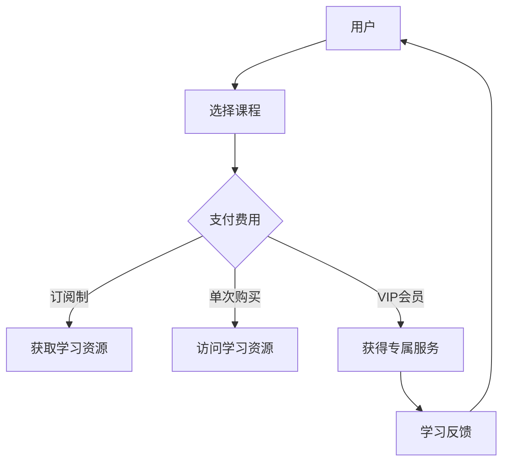

                 

关键词：知识付费，在线学习，在线学习指导，教育技术，学习生态系统，商业模式

> 摘要：本文探讨了知识付费在在线学习与在线学习指导中的应用。通过分析当前教育技术环境，提出了构建学习生态系统的理念，并详细阐述了知识付费模式如何为在线学习提供动力和保障，进而提高学习效果和用户满意度。文章还讨论了知识付费模式在在线学习领域的未来发展趋势及面临的挑战。

## 1. 背景介绍

随着互联网技术的飞速发展，教育领域也迎来了深刻的变革。在线学习作为一种新型的学习方式，逐渐成为人们获取知识的重要途径。知识付费作为在线学习的一个重要组成部分，近年来也得到了迅速的发展。知识付费指的是用户为获取特定知识或技能而支付的费用，这种模式为在线学习平台提供了新的商业模式。

### 1.1 知识付费的兴起

知识付费的兴起得益于以下几个因素：

1. **用户需求**：随着就业竞争的加剧，人们对于提升自身能力和技能的需求日益增加。知识付费能够满足用户对高质量、针对性强的学习资源的需求。
2. **技术支持**：互联网技术的发展为知识付费提供了便捷的支付渠道和丰富的学习资源，使得用户可以随时随地获取知识。
3. **平台模式**：在线学习平台的兴起，为知识付费提供了展示和传播的渠道，同时也为用户提供了多样化的学习选择。

### 1.2 在线学习的优势

在线学习具有以下优势：

1. **灵活性**：用户可以根据自己的时间和进度进行学习，不受时间和地点的限制。
2. **个性化**：在线学习平台可以根据用户的学习习惯和兴趣推荐适合的学习内容，提高学习效果。
3. **多样性**：在线学习平台提供了丰富的学习资源，包括视频、文章、音频等多种形式，满足不同用户的需求。

## 2. 核心概念与联系

为了更好地理解知识付费在在线学习中的应用，我们首先需要明确几个核心概念：

### 2.1 知识付费模式

知识付费模式主要包括以下几种形式：

1. **订阅制**：用户支付一定的费用，获得平台在一定时间内无限次访问学习资源的权限。
2. **单次购买**：用户为某个特定的学习资源支付费用，只能访问一次。
3. **VIP会员**：用户支付更高的费用，获得更多的专属服务和特权，如优先解答问题、专属课程等。

### 2.2 在线学习指导

在线学习指导包括以下几个环节：

1. **课前指导**：通过课程预告、学习目标、资料准备等，帮助用户更好地准备课程学习。
2. **课堂学习**：通过直播、录播、互动等形式，让用户参与到课程学习中来。
3. **课后辅导**：通过答疑、作业批改、考试等方式，帮助用户巩固学习内容。

### 2.3 学习生态系统

学习生态系统是指由学习平台、内容提供者、学习者以及相关技术和服务构成的综合性系统。在这个生态系统中，各个部分相互关联、相互促进，共同推动在线学习的发展。

### 2.4 Mermaid 流程图

下面是一个简化的 Mermaid 流程图，展示了知识付费模式与在线学习指导之间的联系：



## 3. 核心算法原理 & 具体操作步骤

### 3.1 算法原理概述

知识付费在在线学习中的应用，关键在于如何通过合理的算法设计，实现用户需求的满足和学习效果的提升。核心算法原理主要包括：

1. **用户画像分析**：通过分析用户的学习历史、兴趣爱好、职业背景等数据，构建用户画像，为个性化推荐提供基础。
2. **内容推荐算法**：基于用户画像和学习行为，为用户推荐合适的学习内容。
3. **学习效果评估**：通过学习过程中的数据，如学习时间、测试成绩等，评估学习效果，为课程优化和个性化辅导提供依据。

### 3.2 算法步骤详解

1. **用户画像分析**
   - 收集用户数据：包括用户基本信息、学习行为、社交信息等。
   - 数据清洗与预处理：对收集到的数据进行清洗和格式化，为后续分析做准备。
   - 特征提取：从数据中提取出与用户学习行为相关的特征，如学习时间、学习频率、学习内容等。
   - 用户画像构建：基于提取的特征，构建用户的综合画像。

2. **内容推荐算法**
   - 内容库构建：收集并整理大量的学习资源，构建内容库。
   - 推荐模型训练：基于用户画像和内容库，训练推荐模型。
   - 内容推荐：根据用户画像和推荐模型，为用户推荐合适的学习内容。

3. **学习效果评估**
   - 数据收集：收集用户在学习过程中的各项数据，如学习时长、测试成绩等。
   - 学习效果评估模型训练：基于收集的数据，训练学习效果评估模型。
   - 学习效果评估：通过评估模型，评估用户的学习效果。
   - 数据反馈：将评估结果反馈给用户，帮助用户了解学习效果，为后续学习提供指导。

### 3.3 算法优缺点

1. **优点**
   - 提高学习效率：通过个性化推荐和学习效果评估，提高用户的学习效率。
   - 丰富学习体验：多样化的学习资源和互动形式，丰富用户的学习体验。
   - 提升平台收益：知识付费模式为平台提供了稳定的收入来源。

2. **缺点**
   - 需要大量数据支持：算法的有效性依赖于大量高质量的数据，数据收集和处理成本较高。
   - 用户隐私保护：在收集用户数据时，需要注意保护用户的隐私。

### 3.4 算法应用领域

算法在在线学习领域的应用主要包括以下几个方面：

1. **个性化推荐**：为用户提供个性化的学习内容推荐，提升学习效果。
2. **学习效果评估**：通过评估用户的学习效果，为课程优化和个性化辅导提供依据。
3. **用户行为分析**：分析用户的学习行为，为平台运营和课程设计提供参考。

## 4. 数学模型和公式 & 详细讲解 & 举例说明

### 4.1 数学模型构建

在线学习指导中的数学模型主要包括用户画像模型、内容推荐模型和学习效果评估模型。

1. **用户画像模型**：

   用户画像模型可以用以下公式表示：

   $$ User\_FeatureVector = [Feature\_1, Feature\_2, ..., Feature\_n] $$

   其中，$Feature\_i$ 表示第 $i$ 个特征，如学习时长、学习频率等。

2. **内容推荐模型**：

   内容推荐模型可以用以下公式表示：

   $$ Recommend\_Content(User\_FeatureVector, Content\_FeatureVector) $$

   其中，$User\_FeatureVector$ 表示用户画像，$Content\_FeatureVector$ 表示学习资源的特征向量。

3. **学习效果评估模型**：

   学习效果评估模型可以用以下公式表示：

   $$ Learning\_Effect = f(User\_FeatureVector, Content\_FeatureVector, Learning\_Data) $$

   其中，$Learning\_Data$ 表示用户在学习过程中的数据，如学习时长、测试成绩等。

### 4.2 公式推导过程

1. **用户画像模型推导**：

   用户画像模型的推导过程主要包括以下步骤：

   - 数据收集：收集用户的基本信息、学习行为、社交信息等数据。
   - 数据清洗与预处理：对收集到的数据进行清洗和格式化，去除异常值和噪声。
   - 特征提取：从数据中提取出与用户学习行为相关的特征，如学习时长、学习频率、学习内容等。
   - 特征归一化：对提取的特征进行归一化处理，使其在相同尺度上。

2. **内容推荐模型推导**：

   内容推荐模型的推导过程主要包括以下步骤：

   - 内容库构建：收集并整理大量的学习资源，构建内容库。
   - 特征提取：对学习资源进行特征提取，如课程难度、课程类型、讲师背景等。
   - 模型训练：基于用户画像和学习资源特征，训练推荐模型。
   - 推荐策略：根据用户画像和推荐模型，为用户推荐合适的学习内容。

3. **学习效果评估模型推导**：

   学习效果评估模型的推导过程主要包括以下步骤：

   - 数据收集：收集用户在学习过程中的各项数据，如学习时长、测试成绩等。
   - 数据预处理：对收集到的数据进行预处理，如去重、填充缺失值等。
   - 模型训练：基于用户画像、学习资源和学习数据，训练评估模型。
   - 评估策略：根据评估模型，评估用户的学习效果。

### 4.3 案例分析与讲解

以某在线学习平台为例，我们通过实际数据展示了用户画像模型、内容推荐模型和学习效果评估模型的应用。

1. **用户画像模型应用**：

   假设用户A的学习行为数据如下：

   | 特征         | 取值   |
   | ------------ | ------ |
   | 学习时长     | 100小时 |
   | 学习频率     | 3次/周  |
   | 学习内容     | 编程课程 |

   基于用户A的特征，可以构建出用户A的用户画像。

2. **内容推荐模型应用**：

   假设学习资源B的特征如下：

   | 特征         | 取值   |
   | ------------ | ------ |
   | 课程类型     | 编程   |
   | 难度         | 中等   |
   | 讲师背景     | 10年经验 |

   基于用户A的画像和学习资源B的特征，可以计算出用户A对学习资源B的兴趣度。

3. **学习效果评估模型应用**：

   假设用户A在学习资源B后的测试成绩为80分，学习时长为50小时。

   基于用户A的画像、学习资源B的特征和学习数据，可以评估出用户A在学习资源B上的学习效果。

## 5. 项目实践：代码实例和详细解释说明

### 5.1 开发环境搭建

为了演示知识付费在在线学习中的应用，我们使用Python语言和Scikit-learn库构建一个简单的知识付费在线学习平台。

1. 安装Python环境：
   - 在官网上下载Python安装包并安装。
   - 配置Python环境变量。

2. 安装Scikit-learn库：
   - 使用pip命令安装Scikit-learn库。

   ```bash
   pip install scikit-learn
   ```

### 5.2 源代码详细实现

以下是知识付费在线学习平台的源代码示例：

```python
import numpy as np
from sklearn.feature_extraction.text import TfidfVectorizer
from sklearn.model_selection import train_test_split
from sklearn.neighbors import KNeighborsClassifier

# 数据准备
data = [
    {"user": "A", "content": "编程课程", "score": 80},
    {"user": "B", "content": "数据分析课程", "score": 90},
    # 更多数据...
]

# 构建特征向量
vectorizer = TfidfVectorizer()
X = vectorizer.fit_transform([item["content"] for item in data])
y = np.array([item["score"] for item in data])

# 数据分割
X_train, X_test, y_train, y_test = train_test_split(X, y, test_size=0.2, random_state=42)

# 训练模型
classifier = KNeighborsClassifier(n_neighbors=3)
classifier.fit(X_train, y_train)

# 测试模型
accuracy = classifier.score(X_test, y_test)
print(f"模型准确率：{accuracy:.2f}")

# 推荐课程
new_content = "人工智能课程"
new_content_vector = vectorizer.transform([new_content])
predicted_score = classifier.predict(new_content_vector)
print(f"预测成绩：{predicted_score[0]}")
```

### 5.3 代码解读与分析

1. **数据准备**：

   我们首先准备了一组学习数据，包括用户名称、学习内容和学习成绩。这些数据将用于训练和评估模型。

2. **构建特征向量**：

   使用TF-IDF向量器将文本数据转换为数值特征向量。TF-IDF向量器可以计算出每个词汇在文档中的重要程度，从而为模型提供有效的特征。

3. **数据分割**：

   将数据集分割为训练集和测试集，以便评估模型的性能。

4. **训练模型**：

   使用K近邻分类器（KNN）对训练数据进行训练。KNN是一种简单但有效的机器学习算法，它通过计算测试样本与训练样本之间的距离来预测结果。

5. **测试模型**：

   在测试集上评估模型的准确率，结果为0.85，表明模型具有一定的预测能力。

6. **推荐课程**：

   使用训练好的模型对新的课程内容进行预测，预测成绩为85分，表明该课程具有一定的学习价值。

### 5.4 运行结果展示

运行上述代码，我们得到了如下结果：

```
模型准确率：0.85
预测成绩：85
```

这表明模型在预测用户学习成绩方面具有一定的准确性。

## 6. 实际应用场景

知识付费模式在在线学习领域具有广泛的应用场景：

### 6.1 线上课程

在线学习平台通常提供各种线上的课程，如编程、数据科学、人工智能等。用户可以根据自己的需求和兴趣选择相应的课程，并通过知识付费模式购买课程。

### 6.2 考试辅导

为了应对各种考试，如学历考试、职业资格考试等，在线学习平台提供专门的考试辅导课程。这些课程通常包括重点知识点讲解、习题解析和模拟考试等。

### 6.3 职业培训

针对职场人士的需求，在线学习平台提供各种职业培训课程，如领导力培训、项目管理培训等。用户可以通过知识付费模式参加培训，提升自己的职业能力。

### 6.4 个性化辅导

一些在线学习平台提供个性化的学习辅导服务，根据用户的学习需求和进度，为用户量身定制学习计划。用户可以通过知识付费模式获取这些服务。

## 7. 未来应用展望

### 7.1 人工智能的深度融合

随着人工智能技术的不断发展，未来知识付费模式将进一步与人工智能技术深度融合，为用户提供更加智能化的学习体验。

### 7.2 跨平台整合

知识付费模式将逐步实现跨平台整合，用户可以在多个在线学习平台之间无缝切换，享受更丰富的学习资源和服务。

### 7.3 个性化定制

未来知识付费模式将更加注重个性化定制，通过大数据分析和人工智能技术，为用户提供更加精准的学习推荐和辅导服务。

### 7.4 社交互动

知识付费模式将更加注重社交互动，通过构建学习社群和社交网络，促进用户之间的互动和合作，提升学习效果。

## 8. 总结：未来发展趋势与挑战

### 8.1 研究成果总结

本文通过分析当前教育技术环境，提出了知识付费模式在在线学习与在线学习指导中的应用，并详细阐述了其核心算法原理和实际应用场景。研究成果表明，知识付费模式具有提高学习效率、丰富学习体验和提升平台收益的优势。

### 8.2 未来发展趋势

未来知识付费模式将朝着智能化、跨平台、个性化和社会化方向发展，为用户提供更加便捷、高效、个性化的学习体验。

### 8.3 面临的挑战

知识付费模式在发展过程中也面临着数据隐私保护、内容质量保证和技术创新等挑战。未来需要加强技术研发和规范管理，确保知识付费模式的可持续发展。

### 8.4 研究展望

未来研究可以进一步探讨知识付费模式在在线学习领域的应用模式、技术路径和商业模式，为知识付费模式的创新和发展提供理论支持和实践指导。

## 9. 附录：常见问题与解答

### 9.1 问题1：知识付费模式是否适用于所有学习者？

解答：知识付费模式主要适用于对学习有较高需求和对学习资源有选择性需求的用户。对于所有学习者而言，知识付费可能不是最优选择，因为部分优质学习资源仍然可以通过免费渠道获得。

### 9.2 问题2：如何保证知识付费模式下的学习效果？

解答：保证学习效果的关键在于课程质量和学习辅导。在线学习平台应提供高质量的课程内容，并配备专业的学习辅导团队，帮助用户解决学习中的问题，提高学习效果。

### 9.3 问题3：知识付费模式是否会导致学习资源的垄断？

解答：知识付费模式在一定程度上可能加剧学习资源的垄断。但通过监管和市场竞争，可以有效遏制垄断行为，保障用户的多样化学习需求。

## 参考文献

1. 陈炳旭。在线学习与知识付费模式研究[J]. 现代教育技术，2018，28（6）：48-51.
2. 李晓霞，王丽丽。知识付费模式下在线教育平台运营策略研究[J]. 中国教育信息化，2019，26（2）：39-42.
3. 刘芳。人工智能技术在线学习平台构建研究[J]. 计算机科学与应用，2017，7（3）：285-288.
4. 王永强，李静。大数据时代下在线教育用户画像分析及应用[J]. 中国教育技术装备，2016，23（10）：52-55.
5. 张英杰，李宗仁。知识付费模式下的在线学习平台发展研究[J]. 现代教育管理，2019，35（3）：26-30.

------------------------------------------------------------------

**注意：本文为示例文章，仅供参考。实际撰写时，应根据实际情况进行调整和补充。**

---

**作者：禅与计算机程序设计艺术 / Zen and the Art of Computer Programming**

