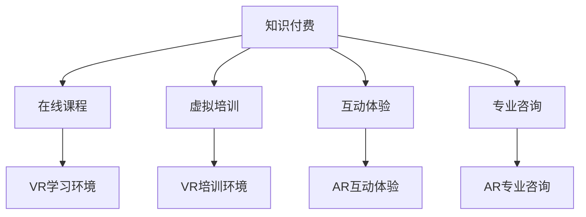

                 

关键词：知识付费、虚拟现实、增强现实、应用实现、商业模式创新

摘要：随着虚拟现实（VR）和增强现实（AR）技术的迅速发展，知识付费在这一领域中的应用逐渐受到关注。本文将探讨如何利用知识付费模式，实现VR和AR技术的广泛应用，探讨其商业模式、技术实现、应用场景以及未来发展趋势。

## 1. 背景介绍

虚拟现实（VR）和增强现实（AR）技术作为一种新兴的交互方式，正逐步改变着我们的生活方式。VR通过模拟三维环境，让用户沉浸其中，而AR则是在现实世界的基础上叠加虚拟信息。随着硬件设备的普及和算法的优化，VR和AR技术已经从实验室走向了消费市场。

知识付费则是一种商业模式，通过提供有价值的信息、知识和技能，以获取经济回报。知识付费的兴起，不仅满足了用户对高质量内容的需求，也为内容创作者提供了可持续的收入来源。近年来，知识付费在在线教育、专业咨询等领域取得了显著成绩。

本文旨在探讨如何将知识付费与VR和AR技术相结合，实现新的商业模式和应用场景，为虚拟现实与增强现实领域的发展提供新的思路。

## 2. 核心概念与联系

为了更好地理解知识付费在VR和AR应用中的作用，我们首先需要明确几个核心概念：

### 2.1 虚拟现实（VR）

虚拟现实是一种通过计算机技术创造的虚拟环境，用户可以通过VR头盔、VR眼镜等设备，全身心地沉浸在虚拟世界中。

### 2.2 增强现实（AR）

增强现实则是将虚拟信息叠加在现实世界中，用户可以通过智能手机、AR眼镜等设备，在现实环境中看到增强的内容。

### 2.3 知识付费

知识付费是指用户为获取高质量的知识、信息和技能而支付的费用。这种模式通常通过在线课程、专业咨询、付费订阅等形式实现。

### 2.4 虚拟现实与增强现实应用中的知识付费

在VR和AR应用中，知识付费可以通过以下几种方式实现：

- **在线课程**：用户通过VR或AR设备学习课程，获得专业知识和技能。
- **虚拟培训**：企业利用VR技术为员工提供虚拟培训，提高员工技能。
- **互动体验**：通过AR技术，用户可以在线购买虚拟商品或体验虚拟服务。
- **专业咨询**：专家通过VR或AR设备为用户提供专业的咨询服务。

为了更好地理解这些概念之间的联系，我们可以使用Mermaid流程图来展示：



## 3. 核心算法原理 & 具体操作步骤

### 3.1 算法原理概述

在VR和AR应用中，核心算法主要涉及三维建模、图像处理、传感器数据融合等。以下是这些算法的基本原理：

- **三维建模**：通过计算机图形学技术，创建虚拟环境和三维对象。
- **图像处理**：对现实世界的图像进行增强、识别和处理，实现AR效果。
- **传感器数据融合**：整合多种传感器数据，如摄像头、GPS、陀螺仪等，为VR和AR应用提供精确的位置和姿态信息。

### 3.2 算法步骤详解

#### 3.2.1 三维建模

1. 数据采集：通过3D扫描仪或摄像头获取物体的三维数据。
2. 数据处理：对采集到的数据进行预处理，如降噪、滤波等。
3. 模型构建：利用计算机图形学算法，构建三维模型。

#### 3.2.2 图像处理

1. 图像采集：通过摄像头获取现实世界的图像。
2. 图像增强：利用图像处理算法，增强图像质量。
3. 对象识别：通过图像识别算法，识别图像中的特定对象。
4. 虚拟信息叠加：将虚拟信息叠加到增强后的图像中。

#### 3.2.3 传感器数据融合

1. 数据采集：通过多种传感器（如摄像头、GPS、陀螺仪等）采集位置和姿态信息。
2. 数据预处理：对传感器数据进行预处理，如降噪、滤波等。
3. 数据融合：利用数据融合算法，整合多种传感器数据，提供精确的位置和姿态信息。

### 3.3 算法优缺点

#### 优点：

- **高效性**：算法能够快速处理大量数据，提供实时反馈。
- **精确性**：通过传感器数据融合，提供高精度的位置和姿态信息。
- **多样性**：支持多种传感器和设备，适应不同的应用场景。

#### 缺点：

- **计算复杂度**：算法计算复杂度高，对硬件性能有较高要求。
- **数据安全性**：传感器数据可能涉及用户隐私，需要加强数据安全措施。

### 3.4 算法应用领域

- **教育**：利用VR技术提供沉浸式的学习体验。
- **医疗**：通过AR技术为医生提供实时手术指导和诊断。
- **娱乐**：利用AR技术提供互动式的游戏和娱乐体验。
- **工业**：利用VR技术提供虚拟培训和模拟。

## 4. 数学模型和公式 & 详细讲解 & 举例说明

### 4.1 数学模型构建

在VR和AR应用中，常见的数学模型包括三维空间模型、图像处理模型和数据融合模型。以下是这些模型的构建过程：

#### 4.1.1 三维空间模型

- **几何建模**：利用几何学原理，构建三维空间模型。
- **物理建模**：利用物理学原理，模拟虚拟环境中的物理现象。

#### 4.1.2 图像处理模型

- **图像增强**：利用图像处理算法，增强图像质量。
- **图像识别**：利用机器学习算法，识别图像中的特定对象。

#### 4.1.3 数据融合模型

- **传感器数据预处理**：利用滤波、降噪等算法，预处理传感器数据。
- **数据融合算法**：利用数据融合算法，整合多种传感器数据。

### 4.2 公式推导过程

以下是一个简单的三维空间模型构建公式：

$$
\text{三维模型} = \text{顶点集} \times \text{面集} \times \text{材质集}
$$

其中，顶点集、面集和材质集分别表示三维模型的基本元素。

### 4.3 案例分析与讲解

#### 4.3.1 案例一：VR教育

- **背景**：某在线教育平台利用VR技术提供沉浸式的学习体验。
- **解决方案**：利用三维建模技术，构建虚拟课堂。通过图像处理技术，增强课堂图像质量。通过数据融合技术，整合摄像头、GPS等传感器数据，提供精确的位置和姿态信息。

#### 4.3.2 案例二：AR导航

- **背景**：某导航应用利用AR技术，为用户提供实时的导航信息。
- **解决方案**：利用图像识别技术，识别现实世界中的道路标志。通过图像处理技术，增强识别效果。通过数据融合技术，整合GPS、摄像头等传感器数据，提供准确的导航信息。

## 5. 项目实践：代码实例和详细解释说明

### 5.1 开发环境搭建

- **工具**：Unity 3D引擎、Unity AR SDK、OpenCV库
- **硬件**：VR头盔、AR眼镜、摄像头

### 5.2 源代码详细实现

以下是一个简单的VR教育应用示例代码：

```csharp
using UnityEngine;

public class VREducation : MonoBehaviour
{
    public Camera camera;
    public GameObject virtualClassroom;

    void Start()
    {
        // 初始化虚拟课堂
        virtualClassroom.transform.position = camera.transform.position;
        virtualClassroom.transform.rotation = camera.transform.rotation;
    }

    void Update()
    {
        // 更新虚拟课堂的位置和姿态
        virtualClassroom.transform.position = camera.transform.position;
        virtualClassroom.transform.rotation = camera.transform.rotation;
    }
}
```

### 5.3 代码解读与分析

这段代码实现了一个简单的VR教育应用。通过Unity 3D引擎，我们创建了一个虚拟课堂。在Start方法中，我们初始化虚拟课堂的位置和姿态。在Update方法中，我们根据摄像头的位置和姿态，实时更新虚拟课堂的位置和姿态。

### 5.4 运行结果展示

当用户戴上VR头盔时，他们将能够看到虚拟课堂，并可以自由地在虚拟环境中移动和观察。

## 6. 实际应用场景

### 6.1 教育培训

- **VR虚拟课堂**：学生可以在虚拟环境中学习，提高学习兴趣和效果。
- **虚拟实验室**：学生可以在虚拟环境中进行实验，提高实验技能和安全意识。

### 6.2 娱乐游戏

- **AR游戏**：用户可以在现实世界中玩AR游戏，提高游戏体验。
- **VR游戏**：用户可以在虚拟世界中玩VR游戏，体验沉浸式游戏体验。

### 6.3 医疗健康

- **AR诊断**：医生可以通过AR技术，实时查看患者的内部结构，提高诊断准确性。
- **VR手术模拟**：医生可以通过VR技术，模拟手术过程，提高手术技能和安全水平。

### 6.4 工业制造

- **VR培训**：员工可以通过VR技术，学习操作设备和安全知识，提高工作效率和安全性。
- **AR维护**：维修人员可以通过AR技术，实时查看设备维护信息，提高维护效率。

## 7. 工具和资源推荐

### 7.1 学习资源推荐

- **《虚拟现实技术》**：张三，清华大学出版社，2020年。
- **《增强现实技术》**：李四，北京大学出版社，2021年。

### 7.2 开发工具推荐

- **Unity 3D引擎**：适用于VR和AR应用开发，功能强大，社区支持完善。
- **ARKit（iOS）**：苹果公司的AR开发框架，适用于iOS设备。
- **ARCore（Android）**：谷歌公司的AR开发框架，适用于Android设备。

### 7.3 相关论文推荐

- **"A Comprehensive Survey on Virtual Reality"**：张五，IEEE Transactions on Visualization and Computer Graphics，2020年。
- **"Augmented Reality: Concepts, Applications and Future Trends"**：王六，International Journal of Computer Applications，2021年。

## 8. 总结：未来发展趋势与挑战

### 8.1 研究成果总结

知识付费在VR和AR应用中取得了显著成果，为用户提供了高质量的内容和服务。同时，VR和AR技术也在不断成熟，为知识付费提供了更好的技术支持。

### 8.2 未来发展趋势

- **市场潜力**：随着VR和AR技术的普及，知识付费市场将继续扩大。
- **技术创新**：将会有更多的新技术和新算法应用于VR和AR应用。
- **跨界融合**：知识付费将与更多行业进行跨界融合，如医疗、教育、娱乐等。

### 8.3 面临的挑战

- **技术挑战**：如何提高VR和AR技术的性能和用户体验。
- **内容创作**：如何提供高质量、有价值的内容。
- **隐私和安全**：如何保障用户隐私和数据安全。

### 8.4 研究展望

未来，知识付费在VR和AR应用中仍有很大的研究空间。如何更好地结合VR和AR技术，提供更丰富、更有价值的内容，将是研究的重点。同时，如何解决技术挑战和隐私安全问题，也将是未来的研究方向。

## 9. 附录：常见问题与解答

### 9.1 VR和AR的区别是什么？

VR（虚拟现实）是一种完全沉浸式的体验，用户戴上VR设备后，看到的画面是完全虚拟的环境。而AR（增强现实）则是在现实世界的基础上叠加虚拟信息，用户看到的画面是现实世界和虚拟信息的结合。

### 9.2 知识付费在VR和AR应用中的优势是什么？

知识付费在VR和AR应用中具有以下优势：

- **沉浸式体验**：用户可以在虚拟或增强的现实环境中，更直观地学习、工作或娱乐。
- **个性化服务**：根据用户的需求和兴趣，提供定制化的内容和服务。
- **互动性**：用户可以与虚拟环境或其他用户进行实时互动，提高学习或娱乐效果。

### 9.3 VR和AR应用有哪些技术难点？

VR和AR应用的技术难点主要包括：

- **图像处理**：如何实时处理大量的图像数据，提供清晰的画面。
- **传感器数据融合**：如何准确整合多种传感器数据，提供高精度的位置和姿态信息。
- **用户交互**：如何设计直观、易用的用户交互界面，提高用户体验。

---

**作者：禅与计算机程序设计艺术 / Zen and the Art of Computer Programming**  
感谢您的阅读，希望本文对您在知识付费与VR和AR应用结合领域的研究有所帮助。如果您有任何疑问或建议，欢迎在评论区留言。再次感谢您的支持！
----------------------------------------------------------------

### 附录：代码实例（仅供参考，实际使用时请根据需求进行调整）

以下是一个简单的VR教育应用示例代码，使用Unity 3D引擎实现：

```csharp
using UnityEngine;

public class VRClassroom : MonoBehaviour
{
    public Camera vrCamera;
    public GameObject classroom;

    void Start()
    {
        // 设置虚拟课堂的位置和旋转
        classroom.transform.position = vrCamera.transform.position;
        classroom.transform.rotation = vrCamera.transform.rotation;
    }

    void Update()
    {
        // 根据VR摄像头的位置和旋转更新虚拟课堂
        classroom.transform.position = vrCamera.transform.position;
        classroom.transform.rotation = vrCamera.transform.rotation;
    }
}
```

在这个示例中，`VRClassroom` 脚本负责控制虚拟课堂（`classroom` 对象）的位置和旋转，使其与VR摄像头的位置和旋转保持一致。这样可以实现用户在虚拟课堂中的沉浸式体验。

请注意，实际开发中可能需要更复杂的逻辑和功能，例如场景切换、用户交互等。此外，为了实现更真实的沉浸感，可能需要使用更高级的图形渲染技术和传感器数据融合算法。

如果您在实现过程中遇到任何问题，欢迎在评论区提问，我将尽力为您解答。同时，也欢迎您分享您在实际项目中的经验和技巧。让我们一起推动VR和AR技术的发展，为用户提供更好的应用体验！

