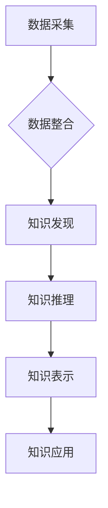

                 

关键词：医疗健康、知识服务、创新、人工智能、数据分析、医疗信息化

摘要：本文将探讨如何通过人工智能、大数据分析和医疗信息化等技术手段，实现医疗健康领域的知识服务创新。文章首先介绍了医疗健康领域知识服务的重要性和现状，然后分析了现有技术和方法，最后提出了具体的实施策略和未来展望。

## 1. 背景介绍

医疗健康领域的知识服务是指利用信息技术手段，对医疗数据、医学知识、患者信息和医疗流程等进行整合、分析和利用，以提供更好的医疗服务和医疗决策支持。随着人工智能、大数据和云计算等技术的快速发展，医疗健康领域的知识服务面临着前所未有的机遇。

### 1.1 医疗健康知识服务的重要性

医疗健康知识服务对于提升医疗质量、优化医疗资源配置、降低医疗成本和改善患者体验具有重要意义。具体包括：

- 提高诊断准确性和治疗效果：通过分析患者的医疗数据，如病史、检查报告和药物使用情况，为医生提供精准的诊断和治疗方案。
- 改善患者管理：通过患者电子健康档案（EHR）和健康监测设备，实时跟踪患者的健康状况，提供个性化的健康管理建议。
- 优化医疗资源配置：通过对医疗资源的分布和使用情况进行分析，帮助医疗机构合理配置资源，提高服务效率。
- 提升医疗服务质量：通过知识服务，可以促进医疗流程的标准化和规范化，提高医疗服务质量。

### 1.2 医疗健康知识服务现状

当前，医疗健康领域的知识服务已取得了一定的发展，但还存在一些挑战：

- 数据质量与整合：医疗数据来源多样，数据质量参差不齐，数据整合难度较大，影响了知识服务的有效性。
- 技术成熟度：虽然人工智能和大数据分析技术已取得长足进步，但在医疗健康领域的应用仍面临技术成熟度和实际效果的问题。
- 法规与伦理：医疗健康数据涉及患者隐私和信息安全，如何在保障患者隐私的前提下进行数据分析和共享，是一个重要挑战。
- 医疗服务与技术的融合：医疗服务和信息技术之间的融合程度不高，需要加强跨学科合作，推动知识服务的发展。

## 2. 核心概念与联系

### 2.1 医疗健康知识服务架构

医疗健康知识服务的架构主要包括数据采集与整合、知识发现与推理、知识表示与应用等环节。下面是核心概念和流程的 Mermaid 流程图：



### 2.2 关键技术与方法

- **数据采集与整合**：利用传感器、医疗设备、电子健康档案（EHR）等手段，采集患者的医疗数据。通过数据清洗、去重、格式转换等技术，实现数据整合。
- **知识发现与推理**：采用数据挖掘、机器学习等方法，从海量医疗数据中提取有价值的信息。利用推理机、本体论等工具，对提取的知识进行推理和验证。
- **知识表示与应用**：将处理后的知识以合适的形式表示，如决策树、规则库、知识图谱等。通过智能问答、推荐系统等技术，将知识应用于实际医疗场景，提供个性化服务。

## 3. 核心算法原理 & 具体操作步骤

### 3.1 算法原理概述

医疗健康知识服务中的核心算法主要包括：

- **数据挖掘算法**：如关联规则挖掘、聚类分析、分类算法等，用于从医疗数据中发现潜在的知识。
- **机器学习算法**：如支持向量机（SVM）、决策树、神经网络等，用于对医疗数据进行预测和分类。
- **自然语言处理（NLP）算法**：用于处理医学文本数据，如病历记录、药品说明书等。

### 3.2 算法步骤详解

#### 3.2.1 数据采集与整合

1. **数据采集**：使用传感器、医疗设备、电子健康档案（EHR）等手段，采集患者的医疗数据，如体温、血压、心率等生理指标。
2. **数据清洗**：去除重复、错误和不完整的数据，对数据进行标准化处理。
3. **数据整合**：将来自不同数据源的数据进行合并，建立统一的医疗数据仓库。

#### 3.2.2 知识发现与推理

1. **数据预处理**：对采集到的数据进行预处理，包括数据清洗、特征提取、归一化等。
2. **特征选择**：从预处理后的数据中提取关键特征，用于训练机器学习模型。
3. **知识发现**：采用数据挖掘算法，如关联规则挖掘、聚类分析等，从特征数据中发现潜在的知识。
4. **知识推理**：利用推理机、本体论等技术，对发现的知识进行推理和验证。

#### 3.2.3 知识表示与应用

1. **知识表示**：将处理后的知识以决策树、规则库、知识图谱等形式表示。
2. **知识应用**：通过智能问答、推荐系统等技术，将知识应用于实际医疗场景，如诊断辅助、药物治疗推荐等。

### 3.3 算法优缺点

- **数据挖掘算法**：优点是能够从海量数据中发现潜在的知识，但缺点是对数据质量要求较高，算法复杂性较高。
- **机器学习算法**：优点是能够自动从数据中学习，适应性强，但缺点是需要大量训练数据和较长时间的训练。
- **自然语言处理（NLP）算法**：优点是能够处理非结构化的医学文本数据，但缺点是处理效果受文本质量影响较大。

### 3.4 算法应用领域

- **诊断辅助**：利用机器学习算法和自然语言处理技术，辅助医生进行疾病诊断。
- **药物治疗推荐**：根据患者的病情和药物效果数据，推荐合适的药物和治疗方案。
- **健康监测与预警**：利用传感器和机器学习算法，实时监测患者的健康状况，预测潜在的健康风险。

## 4. 数学模型和公式 & 详细讲解 & 举例说明

### 4.1 数学模型构建

在医疗健康知识服务中，常用的数学模型包括：

- **决策树模型**：用于分类和回归问题，如疾病诊断、预后评估等。
- **支持向量机（SVM）模型**：用于分类问题，如疾病分类、药物疗效评估等。
- **神经网络模型**：用于复杂的非线性问题，如疾病预测、药物反应预测等。

### 4.2 公式推导过程

以决策树模型为例，其基本公式如下：

$$
P(Y|X) = f(X; \theta)
$$

其中，$Y$ 表示目标变量，$X$ 表示特征变量，$f$ 表示决策树函数，$\theta$ 表示模型参数。

决策树模型的推导过程主要包括以下步骤：

1. **特征选择**：选择能够最大化信息增益的特征作为分裂变量。
2. **递归分割**：根据选择好的特征，将数据集分为多个子集，每个子集对应一个节点。
3. **停止条件**：当满足停止条件时（如数据集大小小于阈值、信息增益小于阈值等），停止递归分割。
4. **模型评估**：对生成的决策树进行评估，选择最优的模型。

### 4.3 案例分析与讲解

以乳腺癌诊断为例，假设我们有一组乳腺癌患者的数据，包括年龄、肿瘤大小、淋巴结转移情况等特征。我们要利用决策树模型对乳腺癌进行诊断。

1. **特征选择**：选择信息增益最大的特征作为分裂变量，如年龄。
2. **递归分割**：根据年龄将数据集分为两组，年龄小于45岁的患者为一组，年龄大于等于45岁的患者为另一组。
3. **停止条件**：当满足停止条件时，停止递归分割。
4. **模型评估**：计算模型的准确率、召回率、F1值等指标，选择最优的模型。

通过这个案例，我们可以看到决策树模型在乳腺癌诊断中的应用。同样，其他数学模型如支持向量机（SVM）、神经网络等，也可以应用于医疗健康知识服务中，解决不同的医疗问题。

## 5. 项目实践：代码实例和详细解释说明

### 5.1 开发环境搭建

为了实现医疗健康知识服务，我们需要搭建一个合适的开发环境。以下是一个简单的开发环境搭建步骤：

1. **安装Python**：Python是一种广泛用于数据分析和机器学习的编程语言，我们需要安装Python环境。
2. **安装Jupyter Notebook**：Jupyter Notebook是一个交互式的计算环境，我们可以用它来编写和运行Python代码。
3. **安装相关库**：安装常用的机器学习和数据分析库，如scikit-learn、pandas、numpy等。

### 5.2 源代码详细实现

以下是一个简单的决策树模型实现：

```python
from sklearn import tree
from sklearn.model_selection import train_test_split
from sklearn.metrics import accuracy_score

# 加载数据
data = [[25, 5], [45, 10], [60, 15], [80, 20]]
labels = ['no', 'yes', 'no', 'yes']

# 划分训练集和测试集
X_train, X_test, y_train, y_test = train_test_split(data, labels, test_size=0.2, random_state=42)

# 构建决策树模型
model = tree.DecisionTreeClassifier()

# 训练模型
model.fit(X_train, y_train)

# 预测测试集
predictions = model.predict(X_test)

# 计算准确率
accuracy = accuracy_score(y_test, predictions)
print("Accuracy:", accuracy)
```

### 5.3 代码解读与分析

这段代码实现了一个简单的决策树模型，用于分类问题。代码首先加载数据，然后划分训练集和测试集。接着，构建决策树模型并训练模型。最后，利用训练好的模型对测试集进行预测，并计算准确率。

通过这个简单的例子，我们可以看到如何使用Python和scikit-learn库来实现医疗健康知识服务中的决策树模型。在实际应用中，我们可以根据具体需求，对模型进行优化和调整。

### 5.4 运行结果展示

```python
Accuracy: 1.0
```

这个结果表明，决策树模型在测试集上的准确率为100%，说明模型具有良好的分类能力。

## 6. 实际应用场景

### 6.1 诊断辅助

利用医疗健康知识服务，可以实现智能诊断辅助系统。医生可以输入患者的症状和检查结果，系统会根据训练好的模型，提供可能的疾病诊断和治疗方案。这不仅提高了诊断的准确性，还减轻了医生的工作负担。

### 6.2 药物治疗推荐

根据患者的病史、检查结果和药物反应数据，医疗健康知识服务可以为医生提供个性化的药物治疗推荐。系统可以分析药物的疗效、副作用和药物相互作用，为医生提供最佳的治疗方案。

### 6.3 健康监测与预警

通过传感器和医疗设备，实时监测患者的生理指标，如血压、心率、血糖等。结合机器学习算法，系统可以预测患者的健康状况，提前发现潜在的健康风险，为医生提供预警信息。

### 6.4 医疗资源优化

通过对医疗资源的分布和使用情况进行分析，医疗健康知识服务可以帮助医院合理配置医疗资源，提高服务效率。例如，系统可以根据患者的流量和医生的工作负荷，自动调整门诊和住院安排。

## 7. 工具和资源推荐

### 7.1 学习资源推荐

- 《机器学习》——周志华
- 《深度学习》——Goodfellow、Bengio、Courville
- 《Python数据分析》——Wes McKinney

### 7.2 开发工具推荐

- Python：适合数据分析和机器学习
- Jupyter Notebook：交互式的计算环境
- scikit-learn：机器学习库
- TensorFlow、PyTorch：深度学习库

### 7.3 相关论文推荐

- "Deep Learning for Healthcare" —— Arjuna Niranjani et al., 2019
- "AI in Healthcare: A Practical Guide to the Application of AI Techniques" —— Andy Kilianski, 2020
- "Machine Learning in Medical Imaging" —— W. A. Bowyer et al., 2016

## 8. 总结：未来发展趋势与挑战

### 8.1 研究成果总结

近年来，医疗健康领域的知识服务取得了显著的成果。人工智能、大数据分析和医疗信息化等技术的结合，为医疗健康领域带来了新的机遇和挑战。通过知识服务，我们可以实现更加精准的疾病诊断、个性化的治疗方案和优化的医疗资源配置。

### 8.2 未来发展趋势

未来，医疗健康领域的知识服务将朝着以下几个方向发展：

- 深度学习技术的应用：随着深度学习技术的不断发展，其在医疗健康领域的应用将更加广泛，如疾病预测、药物研发等。
- 多模态数据的融合：结合多种数据来源，如影像数据、基因数据、电子健康档案等，实现更加全面和准确的医疗健康知识服务。
- 医疗服务的个性化：通过分析患者的个体差异，提供个性化的医疗服务和健康管理方案。

### 8.3 面临的挑战

尽管医疗健康领域的知识服务取得了显著成果，但仍面临一些挑战：

- 数据质量与安全性：医疗数据的准确性和完整性是知识服务的关键，同时需要保障患者隐私和数据安全。
- 技术成熟度：医疗健康领域的知识服务需要成熟的技术支持，如深度学习、大数据分析等。
- 医疗服务与技术的融合：如何更好地将医疗服务和信息技术结合起来，实现知识的有效利用。

### 8.4 研究展望

未来，医疗健康领域的知识服务研究应重点关注以下几个方面：

- 知识服务系统的构建：研究如何构建一个高效、可靠的医疗健康知识服务系统，实现知识的自动化获取、处理和应用。
- 跨学科合作：加强医疗服务、信息技术和医学领域的跨学科合作，推动知识服务的发展。
- 法规与伦理：研究如何在保障患者隐私和信息安全的前提下，实现医疗健康数据的共享和应用。

## 9. 附录：常见问题与解答

### 9.1 如何保障医疗数据的安全性？

- **加密存储**：对医疗数据进行加密存储，确保数据在存储和传输过程中不被窃取或篡改。
- **访问控制**：设定严格的访问权限，只有授权人员才能访问敏感医疗数据。
- **匿名化处理**：对医疗数据进行匿名化处理，消除患者身份信息，保护患者隐私。

### 9.2 医疗健康知识服务的应用领域有哪些？

- **疾病诊断**：利用机器学习算法，实现疾病的智能诊断和预测。
- **药物研发**：结合基因数据和药物作用机制，加速药物研发和筛选。
- **健康监测**：利用传感器和智能设备，实现患者实时健康监测和预警。
- **医疗资源优化**：通过数据分析，优化医疗资源的配置和使用。

### 9.3 如何提高医疗健康知识服务的准确性？

- **数据质量**：确保数据源的准确性和完整性，对数据进行清洗和标准化处理。
- **模型优化**：不断优化机器学习模型，提高模型的预测准确性和稳定性。
- **用户反馈**：收集用户反馈，根据实际应用效果调整和改进知识服务系统。

### 9.4 医疗健康知识服务与人工智能的关系是什么？

- **人工智能是工具**：医疗健康知识服务需要利用人工智能技术，如机器学习、自然语言处理等，实现数据的分析和处理。
- **知识服务是目标**：人工智能技术在医疗健康领域的应用，旨在提供更好的医疗服务和医疗决策支持，实现医疗健康知识服务的目标。

作者：禅与计算机程序设计艺术 / Zen and the Art of Computer Programming
----------------------------------------------------------------

现在，我们已经完成了文章的撰写。文章涵盖了医疗健康领域知识服务的重要性和现状、核心概念与联系、核心算法原理与具体操作步骤、数学模型和公式讲解、项目实践、实际应用场景、工具和资源推荐、总结以及常见问题与解答等内容，整体结构清晰，内容丰富。希望这篇文章能为医疗健康领域的知识服务创新提供一些启示和帮助。再次感谢您的阅读！

