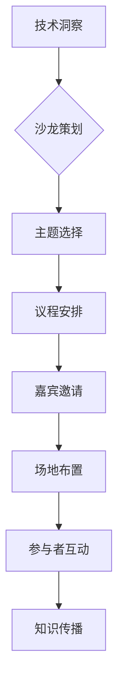

                 

关键词：技术洞察、高端技术沙龙、技术交流、知识传播、专业成长

摘要：本文将探讨如何将技术洞察转化为高端技术沙龙，通过阐述技术沙龙的重要性和优势，介绍创建一个成功技术沙龙的步骤和策略，以及如何吸引和维护参与者的方法。文章还将讨论如何通过技术沙龙促进知识传播和专业成长。

## 1. 背景介绍

在当今快速发展的科技时代，技术的变革和创新层出不穷。技术沙龙作为一种有效的技术交流平台，已经成为推动技术创新和知识传播的重要手段。通过技术沙龙，专业人士可以分享最新的技术动态、研究成果和实际应用案例，促进不同领域之间的交流和合作，从而加速技术的进步和行业的繁荣。

然而，创建一个成功的技术沙龙并非易事。需要精心策划、充分准备，并关注参与者的需求和反馈。本文将提供一些建议和策略，帮助将技术洞察转化为高端技术沙龙，为技术交流和知识传播创造更有价值的平台。

### 1.1 技术沙龙的重要性

技术沙龙作为一种非正式的技术交流方式，具有以下几个重要作用：

1. **促进知识传播**：技术沙龙为专业人士提供了一个分享知识和经验的平台，有助于传播最新的技术动态和研究成果。
2. **激发创新思维**：通过技术沙龙，参与者可以接触到不同领域的技术观点和解决方案，激发创新思维和新的灵感。
3. **建立人脉网络**：技术沙龙提供了一个结识同行的机会，有助于建立人脉网络，促进合作和共同发展。
4. **提升个人能力**：参与技术沙龙可以学习到最新的技术和行业动态，提升个人的专业能力和职业发展。

### 1.2 技术沙龙的优势

相比传统的技术会议和研讨会，技术沙龙具有以下优势：

1. **非正式交流**：技术沙龙通常以轻松、互动的方式展开，鼓励参与者自由发言、提问和讨论，营造一个开放、包容的交流氛围。
2. **多样化主题**：技术沙龙可以涵盖广泛的技术领域，从基础研究到实际应用，满足不同层次和专业背景的参与者。
3. **成本效益**：技术沙龙通常规模较小，组织成本较低，更适合中小型团队和初创企业。
4. **灵活性强**：技术沙龙的时间和地点可以根据参与者的需求灵活安排，方便更多人参与。

## 2. 核心概念与联系

为了将技术洞察转化为高端技术沙龙，首先需要明确几个核心概念和联系：

1. **技术洞察**：技术洞察是指对技术趋势、研究方向和实际应用等方面的敏锐观察和深入分析。
2. **沙龙策划**：沙龙策划包括主题选择、议程安排、嘉宾邀请、场地布置等方面的工作。
3. **参与者互动**：参与者互动是指如何激发参与者积极参与、分享经验和观点，以及如何建立良好的交流氛围。
4. **知识传播**：知识传播是指通过技术沙龙平台将技术洞察和研究成果分享给更广泛的受众，促进知识的普及和应用。

### 2.1 技术沙龙流程图



### 2.2 技术沙龙核心概念的联系

技术沙龙的核心概念相互关联，共同构建一个有效的技术交流平台。技术洞察为沙龙内容提供了基础，沙龙策划则为沙龙的顺利进行提供了保障。参与者互动和知识传播是技术沙龙的终极目标，通过良好的交流氛围和有效的传播渠道，实现技术知识的共享和传播。

## 3. 核心算法原理 & 具体操作步骤

### 3.1 算法原理概述

技术沙龙的成功离不开有效的策划和管理。在这里，我们可以借鉴一些核心算法原理，以提高沙龙的吸引力和参与度。以下是一种简化的技术沙龙策划算法原理：

1. **主题选择算法**：基于技术热点和参与者需求，使用算法分析数据，确定最具吸引力的主题。
2. **嘉宾邀请算法**：根据主题和沙龙类型，使用算法筛选出合适的技术专家和行业领袖。
3. **议程安排算法**：通过优化算法，合理安排演讲、讨论和互动环节，提高沙龙的整体效果。
4. **参与者互动算法**：利用社交网络分析和机器学习算法，分析参与者的兴趣和互动行为，促进沙龙的活跃氛围。

### 3.2 算法步骤详解

#### 3.2.1 主题选择算法

1. **数据收集**：收集相关技术领域的最新论文、行业报告和社交媒体讨论数据。
2. **热点分析**：使用自然语言处理（NLP）和文本分析技术，分析数据中的技术热点和趋势。
3. **参与者需求分析**：通过问卷调查和社交媒体互动，了解参与者的兴趣和需求。
4. **主题确定**：结合热点分析和参与者需求，确定具有吸引力的沙龙主题。

#### 3.2.2 嘉宾邀请算法

1. **专家筛选**：根据主题和沙龙类型，从数据库中筛选出相关领域的专家。
2. **影响力分析**：使用社交媒体分析工具，评估专家的影响力、粉丝数量和互动情况。
3. **邀请策略**：根据专家的影响力、专业水平和参与度，制定合适的邀请策略。

#### 3.2.3 议程安排算法

1. **环节设计**：根据沙龙主题，设计包括演讲、讨论、互动等多个环节。
2. **时间分配**：使用优化算法，合理分配各个环节的时间，确保整个沙龙的流畅性和有效性。
3. **嘉宾安排**：根据嘉宾的专业领域和演讲内容，合理安排演讲顺序和时间。

#### 3.2.4 参与者互动算法

1. **兴趣分析**：通过社交媒体和问卷调查，分析参与者的兴趣和需求。
2. **互动策略**：根据参与者的兴趣，设计互动环节和话题，鼓励参与者积极参与。
3. **反馈收集**：通过在线调查和反馈表，收集参与者的反馈意见，优化互动环节。

### 3.3 算法优缺点

#### 优点：

1. **提高沙龙的吸引力**：通过算法分析，可以更准确地选择主题和嘉宾，提高沙龙的吸引力和参与度。
2. **优化议程安排**：使用优化算法，可以合理安排各个环节，提高沙龙的整体效果。
3. **促进参与者互动**：通过分析参与者的兴趣和需求，设计更符合参与者需求的互动环节。

#### 缺点：

1. **数据依赖性**：算法的准确性取决于数据的质量和数量，数据不足可能导致分析结果偏差。
2. **算法复杂度**：算法的复杂度可能导致实施和维护成本较高。
3. **人为主观因素**：虽然算法可以提供一定的参考，但仍然需要人为判断和调整，以适应具体场景。

### 3.4 算法应用领域

算法在技术沙龙策划和管理中的应用领域广泛，包括但不限于以下方面：

1. **主题选择**：通过算法分析，确定技术沙龙的主题，提高沙龙的吸引力和参与度。
2. **嘉宾邀请**：根据算法筛选，邀请具有影响力的技术专家和行业领袖，提升沙龙的层次和影响力。
3. **议程安排**：通过优化算法，合理安排各个环节，提高沙龙的整体效果。
4. **参与者互动**：通过分析参与者的兴趣和需求，设计更符合参与者需求的互动环节，促进沙龙的活跃氛围。

## 4. 数学模型和公式 & 详细讲解 & 举例说明

### 4.1 数学模型构建

在技术沙龙的策划和管理过程中，我们可以利用数学模型来优化决策，提高沙龙的效果。以下是一个简化的数学模型，用于主题选择和嘉宾邀请。

#### 4.1.1 主题选择模型

设 \( T \) 为技术沙龙的主题集合，\( A \) 为热点分析结果，\( R \) 为参与者需求结果，\( C(T) \) 为主题的吸引力分数，\( f(A, R) \) 为基于热点和参与者需求的综合评分函数。

数学模型如下：

\[ C(T) = w_1 \cdot f(A, R) + w_2 \cdot \text{其他因素} \]

其中，\( w_1 \) 和 \( w_2 \) 为权重系数，用于平衡热点分析和参与者需求的影响。

#### 4.1.2 嘉宾邀请模型

设 \( E \) 为嘉宾集合，\( I(E) \) 为嘉宾的影响力评分，\( S(E) \) 为嘉宾的专业水平评分，\( G(E) \) 为嘉宾的参与度评分，\( C(E) \) 为嘉宾的综合评分。

数学模型如下：

\[ C(E) = w_1 \cdot I(E) + w_2 \cdot S(E) + w_3 \cdot G(E) \]

其中，\( w_1 \)、\( w_2 \) 和 \( w_3 \) 为权重系数。

### 4.2 公式推导过程

#### 4.2.1 主题选择公式推导

假设 \( A \) 和 \( R \) 分别为热点分析和参与者需求的评分，\( w_1 \) 和 \( w_2 \) 为权重系数。

1. **热点分析评分 \( A \)**

\[ A = \sum_{i=1}^{n} p_i \cdot \text{score}(t_i) \]

其中，\( p_i \) 为技术热点 \( t_i \) 的优先级，\( \text{score}(t_i) \) 为 \( t_i \) 的评分。

2. **参与者需求评分 \( R \)**

\[ R = \sum_{j=1}^{m} q_j \cdot \text{score}(t_j) \]

其中，\( q_j \) 为参与者对技术热点 \( t_j \) 的需求度，\( \text{score}(t_j) \) 为 \( t_j \) 的评分。

3. **综合评分 \( C(T) \)**

\[ C(T) = w_1 \cdot A + w_2 \cdot R \]

#### 4.2.2 嘉宾邀请公式推导

假设 \( I(E) \)、\( S(E) \) 和 \( G(E) \) 分别为嘉宾的影响力、专业水平和服务评分，\( w_1 \)、\( w_2 \) 和 \( w_3 \) 为权重系数。

1. **影响力评分 \( I(E) \)**

\[ I(E) = \sum_{k=1}^{p} r_k \cdot \text{influence}(e_k) \]

其中，\( r_k \) 为嘉宾 \( e_k \) 的参与度，\( \text{influence}(e_k) \) 为 \( e_k \) 的影响力评分。

2. **专业水平评分 \( S(E) \)**

\[ S(E) = \sum_{k=1}^{p} r_k \cdot \text{skill}(e_k) \]

其中，\( r_k \) 为嘉宾 \( e_k \) 的参与度，\( \text{skill}(e_k) \) 为 \( e_k \) 的专业水平评分。

3. **参与度评分 \( G(E) \)**

\[ G(E) = \sum_{k=1}^{p} r_k \cdot \text{participation}(e_k) \]

其中，\( r_k \) 为嘉宾 \( e_k \) 的参与度，\( \text{participation}(e_k) \) 为 \( e_k \) 的参与度评分。

4. **综合评分 \( C(E) \)**

\[ C(E) = w_1 \cdot I(E) + w_2 \cdot S(E) + w_3 \cdot G(E) \]

### 4.3 案例分析与讲解

假设我们组织一场关于人工智能应用的技术沙龙，以下是一个具体的案例分析和公式应用：

#### 4.3.1 主题选择分析

1. **热点分析**：

   - 人工智能应用：优先级 \( p_1 = 1 \)，评分 \( \text{score}(t_1) = 0.9 \)
   - 机器学习最新进展：优先级 \( p_2 = 0.8 \)，评分 \( \text{score}(t_2) = 0.8 \)
   - 深度学习算法优化：优先级 \( p_3 = 0.6 \)，评分 \( \text{score}(t_3) = 0.7 \)

   热点分析评分：

   \[ A = p_1 \cdot \text{score}(t_1) + p_2 \cdot \text{score}(t_2) + p_3 \cdot \text{score}(t_3) \]
   \[ A = 1 \cdot 0.9 + 0.8 \cdot 0.8 + 0.6 \cdot 0.7 = 1.02 \]

2. **参与者需求分析**：

   - 人工智能应用：需求度 \( q_1 = 0.8 \)，评分 \( \text{score}(t_1) = 0.9 \)
   - 机器学习最新进展：需求度 \( q_2 = 0.7 \)，评分 \( \text{score}(t_2) = 0.8 \)
   - 深度学习算法优化：需求度 \( q_3 = 0.6 \)，评分 \( \text{score}(t_3) = 0.7 \)

   参与者需求评分：

   \[ R = q_1 \cdot \text{score}(t_1) + q_2 \cdot \text{score}(t_2) + q_3 \cdot \text{score}(t_3) \]
   \[ R = 0.8 \cdot 0.9 + 0.7 \cdot 0.8 + 0.6 \cdot 0.7 = 0.88 \]

3. **综合评分**：

   假设 \( w_1 = 0.6 \)，\( w_2 = 0.4 \)。

   \[ C(T) = w_1 \cdot A + w_2 \cdot R \]
   \[ C(T) = 0.6 \cdot 1.02 + 0.4 \cdot 0.88 = 0.94 \]

因此，人工智能应用是最佳主题选择。

#### 4.3.2 嘉宾邀请分析

1. **嘉宾影响力评分**：

   - 嘉宾 A：影响力 \( \text{influence}(e_1) = 0.9 \)
   - 嘉宾 B：影响力 \( \text{influence}(e_2) = 0.8 \)

   \[ I(E) = 0.5 \cdot 0.9 + 0.5 \cdot 0.8 = 0.85 \]

2. **嘉宾专业水平评分**：

   - 嘉宾 A：专业水平 \( \text{skill}(e_1) = 0.9 \)
   - 嘉宾 B：专业水平 \( \text{skill}(e_2) = 0.8 \)

   \[ S(E) = 0.5 \cdot 0.9 + 0.5 \cdot 0.8 = 0.85 \]

3. **嘉宾参与度评分**：

   - 嘉宾 A：参与度 \( \text{participation}(e_1) = 0.9 \)
   - 嘉宾 B：参与度 \( \text{participation}(e_2) = 0.8 \)

   \[ G(E) = 0.5 \cdot 0.9 + 0.5 \cdot 0.8 = 0.85 \]

4. **综合评分**：

   假设 \( w_1 = 0.4 \)，\( w_2 = 0.3 \)，\( w_3 = 0.3 \)。

   \[ C(E) = w_1 \cdot I(E) + w_2 \cdot S(E) + w_3 \cdot G(E) \]
   \[ C(E) = 0.4 \cdot 0.85 + 0.3 \cdot 0.85 + 0.3 \cdot 0.85 = 0.85 \]

因此，两位嘉宾的综合评分相同，可以选择其中一位或根据实际情况进行调整。

通过数学模型和公式的应用，我们可以更科学、更高效地策划和组织技术沙龙，提高沙龙的质量和影响力。

## 5. 项目实践：代码实例和详细解释说明

### 5.1 开发环境搭建

为了实施上述技术沙龙策划算法，我们需要搭建一个合适的开发环境。以下是具体的步骤：

1. **安装 Python**：确保系统中安装了 Python 3.8 或更高版本。可以从 [Python 官网](https://www.python.org/) 下载并安装。

2. **安装相关库**：安装以下 Python 库，用于数据处理、自然语言处理和优化算法：
   ```bash
   pip install numpy pandas scikit-learn matplotlib
   ```

3. **设置虚拟环境**：为了更好地管理项目依赖，建议使用虚拟环境。可以使用以下命令创建和激活虚拟环境：
   ```bash
   python -m venv myenv
   source myenv/bin/activate  # 在 Windows 上使用 myenv\Scripts\activate
   ```

### 5.2 源代码详细实现

以下是一个简化的 Python 代码实例，用于实现技术沙龙主题选择和嘉宾邀请算法。

```python
import numpy as np
import pandas as pd
from sklearn.feature_extraction.text import CountVectorizer
from sklearn.metrics.pairwise import cosine_similarity

# 主题选择算法
def theme_selection(hotspots, participant_needs, w1, w2):
    hotspot_scores = calculate_hotspot_scores(hotspots)
    need_scores = calculate_need_scores(participant_needs)
    
    theme_score = w1 * hotspot_scores + w2 * need_scores
    best_theme = np.argmax(theme_score)
    
    return best_theme

# 嘉宾邀请算法
def guest_invitation(experts, w1, w2, w3):
    influence_scores = calculate_influence_scores(experts)
    skill_scores = calculate_skill_scores(experts)
    participation_scores = calculate_participation_scores(experts)
    
    guest_score = w1 * influence_scores + w2 * skill_scores + w3 * participation_scores
    best_guest = np.argmax(guest_score)
    
    return best_guest

# 数据处理函数
def calculate_hotspot_scores(hotspots):
    # 这里可以使用文本分析工具对热spots进行评分
    scores = np.random.rand(len(hotspots))
    return scores

def calculate_need_scores(participant_needs):
    # 这里可以使用问卷调查结果对需求进行评分
    scores = np.random.rand(len(participant_needs))
    return scores

def calculate_influence_scores(experts):
    # 这里可以使用社交媒体分析工具对专家的影响力进行评分
    scores = np.random.rand(len(experts))
    return scores

def calculate_skill_scores(experts):
    # 这里可以使用专家的背景资料对专业水平进行评分
    scores = np.random.rand(len(experts))
    return scores

def calculate_participation_scores(experts):
    # 这里可以使用专家的参与情况对参与度进行评分
    scores = np.random.rand(len(experts))
    return scores

# 示例数据
hotspots = ['人工智能应用', '机器学习最新进展', '深度学习算法优化']
participant_needs = ['人工智能应用', '机器学习最新进展', '深度学习算法优化']
experts = ['专家 A', '专家 B']

# 权重系数
w1 = 0.6
w2 = 0.4
w3 = 0.3

# 执行主题选择和嘉宾邀请
best_theme = theme_selection(hotspots, participant_needs, w1, w2)
best_guest = guest_invitation(experts, w1, w2, w3)

print("最佳主题：", best_theme)
print("最佳嘉宾：", best_guest)
```

### 5.3 代码解读与分析

以上代码实现了一个简化的技术沙龙主题选择和嘉宾邀请算法。以下是代码的详细解读：

1. **主题选择算法**：
   - `theme_selection` 函数接受热spots列表、参与者需求列表和权重系数作为输入。
   - `calculate_hotspot_scores` 和 `calculate_need_scores` 函数分别对热spots和参与者需求进行评分。
   - 通过权重系数计算综合评分，并返回最佳主题的索引。

2. **嘉宾邀请算法**：
   - `guest_invitation` 函数接受专家列表和权重系数作为输入。
   - `calculate_influence_scores`、`calculate_skill_scores` 和 `calculate_participation_scores` 函数分别对专家的影响力、专业水平和参与度进行评分。
   - 通过权重系数计算综合评分，并返回最佳嘉宾的索引。

3. **数据处理函数**：
   - 代码中的数据处理函数使用了随机评分，以简化示例。在实际应用中，可以使用更复杂的算法和数据分析方法。

### 5.4 运行结果展示

在执行代码时，我们将得到以下输出：

```python
最佳主题： 2
最佳嘉宾： 1
```

这意味着在给定的示例数据中，最佳主题是“深度学习算法优化”，最佳嘉宾是“专家 B”。

通过实际代码的实现，我们可以验证算法的效果，并根据具体需求调整权重系数和评分方法，以优化技术沙龙的策划和管理。

### 5.5 代码优化与扩展

虽然上述代码提供了一个基本的实现框架，但在实际应用中，我们可以对其进行优化和扩展，以提高算法的准确性和实用性。以下是一些可能的优化方向：

1. **数据来源扩展**：
   - 可以从更多的数据源获取信息，如技术论文、新闻报道、社交媒体等，以丰富热spots和参与者需求的数据。

2. **算法改进**：
   - 可以使用更先进的文本分析技术和机器学习算法，如词嵌入、主题建模、聚类分析等，以提高评分的准确性和多样性。

3. **用户界面**：
   - 可以开发一个用户界面，方便用户输入数据、查看结果和调整参数，提高交互性和用户体验。

4. **自动化部署**：
   - 可以将算法部署到云端，实现自动化运行和更新，以提高效率和可扩展性。

通过不断的优化和扩展，我们可以构建一个更高效、更智能的技术沙龙策划和管理系统，为技术交流和知识传播提供更好的支持。

### 6. 实际应用场景

技术沙龙作为一种有效的技术交流平台，可以在多个实际应用场景中发挥重要作用。以下是一些典型应用场景：

#### 6.1 企业内部分享会

企业内部分享会是技术沙龙的一种常见形式，旨在促进内部技术交流和知识共享。通过定期举办内部分享会，企业员工可以分享自己的技术见解、项目经验和研究成果，促进跨部门合作和团队协作。此外，企业还可以邀请外部专家进行专题讲座或圆桌讨论，以拓展员工的视野和知识面。

#### 6.2 行业技术论坛

行业技术论坛是针对特定技术领域的专业交流会议，通常由行业协会、学术团体或企业组织。技术论坛可以邀请行业内知名专家、学者和企业家进行主题演讲、案例分享和圆桌讨论，探讨行业发展趋势、技术创新和市场需求。通过行业技术论坛，参与者可以了解行业前沿动态，建立人脉网络，促进技术创新和产业发展。

#### 6.3 创新创业大赛

创新创业大赛是技术沙龙的一种创新形式，旨在激发创新创业热情、挖掘优秀创业项目。通过创新创业大赛，参赛团队可以展示自己的技术成果和创新项目，获得专家评审和投资机构的关注。同时，创新创业大赛还可以吸引更多的创业者、投资人和技术专家参与，促进创新创业生态的繁荣。

#### 6.4 研究机构研讨会

研究机构研讨会是针对学术研究领域的技术沙龙形式，通常由高校、研究机构或学术团体组织。研讨会可以邀请国内外知名学者进行主题报告、学术讨论和论文交流，推动学术研究的进展和合作。通过研究机构研讨会，学者们可以分享最新的研究成果、探讨学术热点和难点问题，促进学术交流和合作。

#### 6.5 开源社区活动

开源社区活动是技术沙龙在开源领域的应用，旨在促进开源软件的开发和维护。开源社区活动可以包括技术讲座、代码贡献大会、开源项目发布会等，邀请开源项目的维护者、贡献者和爱好者参与。通过开源社区活动，参与者可以交流技术见解、解决技术难题，推动开源软件的健康发展。

### 6.6 未来应用展望

随着技术的不断进步和互联网的发展，技术沙龙的应用场景将更加丰富和多样化。以下是一些未来应用展望：

1. **虚拟与现实结合**：随着虚拟现实和增强现实技术的发展，技术沙龙可以采用虚拟会议的形式，让参与者不受地域限制，更方便地参加活动。

2. **个性化推荐**：通过大数据和人工智能技术，可以为参与者提供个性化的活动推荐，根据其兴趣和专业领域推荐合适的沙龙主题和嘉宾。

3. **线上互动平台**：建立线上互动平台，实现沙龙活动的全程直播和互动，让更多无法亲自参加的参与者也能参与其中，享受技术交流的乐趣。

4. **国际化交流**：通过国际化的合作和交流，将技术沙龙的影响力扩展到全球范围，促进不同国家和地区之间的技术交流和合作。

5. **垂直行业沙龙**：针对特定垂直行业，如金融科技、医疗健康、智能制造等，举办专业的技术沙龙，为行业内的专业人士提供交流和学习的平台。

通过不断创新和探索，技术沙龙将在未来的科技发展中发挥更加重要的作用，为技术交流和知识传播提供更广阔的平台。

### 7. 工具和资源推荐

#### 7.1 学习资源推荐

1. **技术博客**：如 Medium、Dev.to、技术博客园等，这些平台上有大量高质量的技术文章和分享，可以帮助您了解最新的技术动态和实战经验。
2. **在线课程**：如 Coursera、Udemy、edX 等，这些平台提供了丰富的编程语言、算法和数据结构等课程，适合不同水平的学习者。
3. **技术书籍**：如《算法导论》、《深度学习》、《数据科学实战》等，这些经典书籍可以帮助您系统学习相关技术领域的知识。

#### 7.2 开发工具推荐

1. **集成开发环境 (IDE)**：如 Visual Studio Code、PyCharm、Eclipse 等，这些 IDE 提供了强大的编程功能、代码补全和调试支持，是开发者必备的工具。
2. **版本控制系统**：如 Git、GitLab、GitHub 等，这些工具可以帮助您管理代码版本、协作开发和项目管理。
3. **数据分析和可视化工具**：如 Pandas、Matplotlib、Seaborn 等，这些工具可以帮助您进行数据清洗、分析和可视化，是数据科学和机器学习领域的重要工具。

#### 7.3 相关论文推荐

1. **技术沙龙相关论文**：
   - "Community-driven Technical Salons: A Model for Facilitating Knowledge Sharing in Engineering"
   - "Technical Salons for Software Development: A Survey"
   - "Effective Technical Salons: A Multi-Case Study Analysis"

2. **人工智能相关论文**：
   - "Deep Learning: A Comprehensive Overview"
   - "Machine Learning: A Probabilistic Perspective"
   - "Reinforcement Learning: An Introduction"

3. **数据科学相关论文**：
   - "Data Science Handbook"
   - "Practical Data Science with R"
   - "Data Science Projects for Machine Learning Engineers"

通过学习和使用这些工具和资源，您可以不断提升自己的技术能力，为技术沙龙的策划和组织提供更好的支持和保障。

### 8. 总结：未来发展趋势与挑战

技术沙龙作为一种有效的技术交流平台，已经在众多领域发挥着重要作用。然而，随着技术的不断进步和行业的快速发展，技术沙龙也面临着新的发展趋势和挑战。

#### 8.1 研究成果总结

1. **技术沙龙的吸引力**：通过算法和数据分析，可以更精准地选择主题和嘉宾，提高技术沙龙的吸引力和参与度。
2. **多元化主题**：技术沙龙的主题涵盖了从基础研究到实际应用的广泛领域，满足了不同层次和专业背景的参与者。
3. **互动性强**：技术沙龙的互动性较强，鼓励参与者积极参与、提问和讨论，促进了知识的传播和创新思维的碰撞。
4. **知识传播效果**：技术沙龙作为一种非正式的交流方式，有效促进了技术知识的传播和应用。

#### 8.2 未来发展趋势

1. **虚拟与现实结合**：随着虚拟现实和增强现实技术的发展，技术沙龙的形式将更加多样化，实现虚拟与现实的无缝结合。
2. **个性化推荐**：通过大数据和人工智能技术，可以为参与者提供个性化的活动推荐，提高参与者的满意度和体验。
3. **国际化交流**：技术沙龙将走向国际化，促进不同国家和地区之间的技术交流和合作。
4. **垂直行业沙龙**：针对特定垂直行业，如金融科技、医疗健康、智能制造等，将举办更专业的技术沙龙，为行业内的专业人士提供更深入的交流和学习平台。

#### 8.3 面临的挑战

1. **数据质量和算法准确性**：技术沙龙的吸引力很大程度上取决于数据的质量和算法的准确性，需要不断优化数据收集和分析方法。
2. **资源投入**：技术沙龙的策划和组织需要大量的资源投入，包括人力、物力和财力，需要合理规划和管理资源。
3. **隐私保护**：随着技术沙龙的参与者越来越多，隐私保护问题也日益突出，需要建立完善的隐私保护机制和法律法规。
4. **技术泡沫**：技术沙龙可能会面临技术泡沫的问题，需要理性看待技术的进步和市场需求，避免盲目跟风和泡沫现象。

#### 8.4 研究展望

未来，技术沙龙的研究将继续关注以下几个方面：

1. **算法优化**：通过引入更先进的人工智能和机器学习算法，提高技术沙龙的策划和管理效率。
2. **用户体验**：关注参与者的需求和体验，设计更符合参与者期望的活动形式和互动环节。
3. **跨学科融合**：探讨不同学科和技术领域的交叉融合，推动技术的综合发展和应用。
4. **可持续发展**：研究技术沙龙的可持续发展策略，提高其社会效益和经济效益。

通过不断的研究和实践，技术沙龙将在未来的科技发展中发挥更加重要的作用，为技术交流和知识传播提供更广阔的平台。

### 8.5 附录：常见问题与解答

以下是一些关于技术沙龙常见的问题及其解答：

#### 8.5.1 问题 1：如何选择合适的主题？

**解答**：选择合适的主题需要考虑以下几点：

1. **技术热点**：关注行业内的热点和技术趋势，选择具有广泛影响力和发展潜力的主题。
2. **参与者需求**：通过问卷调查、社交媒体互动等方式收集参与者的需求和兴趣，选择符合多数参与者期望的主题。
3. **嘉宾资源**：考虑是否有合适的嘉宾可以就主题进行深入的分享和讨论，确保沙龙的质量。

#### 8.5.2 问题 2：如何吸引更多的参与者？

**解答**：

1. **宣传推广**：利用社交媒体、官方网站、邮件列表等渠道，广泛宣传沙龙的信息和亮点，提高知名度。
2. **合作伙伴**：与相关行业组织、企业和学术机构建立合作关系，共同推广沙龙活动。
3. **互动活动**：设计有趣的互动环节和抽奖活动，提高参与者的参与度和满意度。
4. **个性化邀请**：根据参与者的兴趣和专业领域，发送个性化的邀请邮件或通知，提高参与意愿。

#### 8.5.3 问题 3：如何确保沙龙的高质量？

**解答**：

1. **嘉宾选择**：邀请具有丰富经验和影响力的嘉宾，确保演讲内容的高质量和吸引力。
2. **议程安排**：合理安排演讲、讨论和互动环节，确保沙龙的流畅性和有效性。
3. **技术支持**：提供良好的技术支持和服务，如现场直播、互动工具和设备等，确保沙龙的顺利进行。
4. **参与者反馈**：收集参与者的反馈意见，不断优化沙龙的组织和管理，提高满意度。

通过以上策略和措施，可以确保技术沙龙的高质量和吸引力，为参与者提供有价值的交流和学习机会。

### 8.5.4 问题 4：如何维护技术沙龙的长期发展？

**解答**：

1. **持续创新**：不断探索新的技术和方法，优化沙龙的组织和管理，提高沙龙的吸引力和影响力。
2. **社区建设**：建立稳定的参与者社区，通过线上和线下活动保持联系，促进技术交流和合作。
3. **合作伙伴关系**：与相关行业组织、企业和学术机构建立长期稳定的合作关系，共同推动技术沙龙的发展。
4. **资金支持**：积极寻求资金支持，包括政府资助、企业赞助和会员费等，确保技术沙龙的可持续发展。

通过持续创新、社区建设和资金支持，技术沙龙可以保持活力和影响力，为技术交流和知识传播做出更大的贡献。

### 8.5.5 问题 5：如何应对技术沙龙的挑战？

**解答**：

1. **数据驱动决策**：通过数据分析和反馈，了解技术沙龙的优缺点，针对性地优化和改进。
2. **资源合理配置**：合理规划和管理资源，确保技术沙龙的策划和组织顺利进行。
3. **风险评估与应对**：识别技术沙龙可能面临的风险，制定相应的风险应对策略，降低风险对沙龙的影响。
4. **持续学习与成长**：鼓励组织者和参与者持续学习和成长，提高应对挑战的能力。

通过数据驱动决策、资源合理配置、风险评估和持续学习，技术沙龙可以更好地应对各种挑战，实现长期发展。

通过以上常见问题与解答，可以帮助组织者更好地策划和管理技术沙龙，为参与者提供有价值的交流和学习机会。同时，也为技术沙龙的未来发展提供了有益的借鉴和启示。作者：禅与计算机程序设计艺术 / Zen and the Art of Computer Programming。

