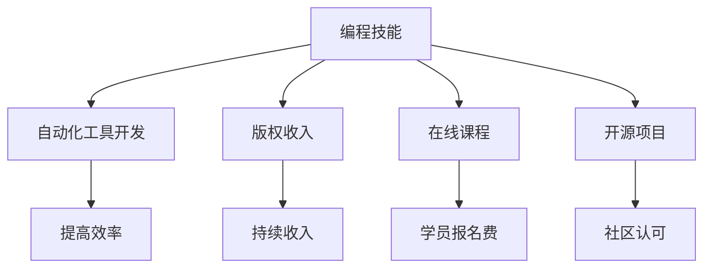

                 

在当今数字化时代，编程技能已经不仅仅是一项技术能力，它更是一种创造价值、实现财务自由的途径。那么，如何将编程技能转化为被动收入，从而实现财富的持续增长呢？本文将深入探讨这一问题，为编程爱好者提供一些具体的策略和方法。

## 文章关键词

- 编程技能
- 被动收入
- 财务自由
- 数字化时代
- 财富增长

## 文章摘要

本文首先介绍了编程技能在数字化时代的重要性，并探讨了如何通过将编程技能转化为被动收入来实现财务自由。随后，文章详细分析了实现这一目标的几种主要策略，包括开发自动化工具、撰写技术博客、开设在线课程、开发应用程序以及参与开源项目等。此外，文章还提供了相关的工具和资源推荐，以帮助读者更好地实施这些策略。最后，文章总结了当前的发展趋势和面临的挑战，并展望了未来的研究方向。

## 1. 背景介绍

### 1.1 编程技能的价值

编程技能是数字化时代的关键能力，它不仅是技术发展的驱动力，也是经济转型的重要支撑。随着互联网、大数据、人工智能等新兴技术的飞速发展，编程技能的需求不断增加，它不仅广泛应用于各个行业，还成为了许多职业转型的必备技能。

### 1.2 被动收入的定义

被动收入是指无需持续投入时间和精力，就能够自动产生的收入。它通常来自于投资、版权、自动化工具或系统等，是一种实现财务自由的重要途径。

### 1.3 编程技能与被动收入的关系

编程技能的掌握可以为个人带来多种被动收入来源。通过开发自动化工具、编写代码库、创建在线课程或应用程序，程序员可以实现代码的持续盈利，从而实现财务自由。

## 2. 核心概念与联系

### 2.1 被动收入的来源

被动收入的来源多种多样，但通常可以分为以下几类：

- **自动化工具开发**：开发能够自动执行任务的工具或软件，例如自动化测试工具、自动化数据分析工具等。
- **版权收入**：创作技术博客、编写技术书籍、开发应用程序等，通过版权授权或销售获得收入。
- **在线课程**：通过在线教育平台开设编程课程，利用学员报名费和订阅费用实现被动收入。
- **开源项目**：参与开源项目，通过贡献代码获得社区认可和赞助。

### 2.2 被动收入与编程技能的联系

编程技能是实现被动收入的基石。通过编程，程序员可以自动化执行重复性任务，提高工作效率；可以创作可授权的代码库和应用程序，获得持续的收入；还可以利用编程技能开设在线课程，为学习者提供价值。

### 2.3 Mermaid 流程图



## 3. 核心算法原理 & 具体操作步骤

### 3.1 算法原理概述

实现编程技能转化为被动收入的核心算法是自动化和知识产权管理。自动化涉及编写脚本或程序，以自动执行重复性或耗时的任务。知识产权管理则包括版权登记、授权合同编写等，以确保创作者的权益得到保护。

### 3.2 算法步骤详解

#### 3.2.1 自动化工具开发

1. **需求分析**：明确工具的目标和功能，确定需要解决的具体问题。
2. **技术选型**：选择合适的编程语言和框架，以确保工具的高效和可维护性。
3. **代码编写**：编写脚本或程序，实现工具的功能。
4. **测试与优化**：测试工具的稳定性和性能，进行必要的优化。
5. **发布与维护**：将工具发布到合适的平台，定期更新和维护。

#### 3.2.2 版权收入管理

1. **内容创作**：创作具有价值的博客文章、技术书籍、应用程序等。
2. **版权登记**：进行版权登记，保护作品版权。
3. **授权管理**：制定授权合同，明确授权范围和使用条件。
4. **收入监控**：监控版权收入的来源和数额，进行合理的财务管理。

### 3.3 算法优缺点

#### 优点

- **提高效率**：自动化工具可以节省大量时间和精力，提高工作效率。
- **持续收入**：版权收入可以持续产生，无需持续投入时间和精力。
- **风险分散**：多种收入来源可以降低财务风险。

#### 缺点

- **初始投入**：开发自动化工具和进行版权登记需要一定的资金和时间投入。
- **维护成本**：定期更新和维护工具或内容可能会产生一定的成本。

### 3.4 算法应用领域

- **软件开发**：开发自动化测试工具、数据分析工具等。
- **内容创作**：撰写技术博客、编写技术书籍等。
- **在线教育**：开设编程课程、技术培训等。

## 4. 数学模型和公式 & 详细讲解 & 举例说明

### 4.1 数学模型构建

在实现编程技能转化为被动收入的过程中，一个关键的数学模型是收益模型。该模型涉及以下几个参数：

- **C**：初始成本
- **R**：每单位时间的收入
- **T**：工作时间
- **M**：维护成本

收益模型的基本公式为：

\[ 收益 = R \times T - (C + M) \]

### 4.2 公式推导过程

收益模型的推导过程如下：

1. **初始成本**（C）：包括开发自动化工具或进行版权登记的成本。
2. **每单位时间的收入**（R）：取决于工具或内容的受欢迎程度和市场需求。
3. **工作时间**（T）：指投入在自动化工具或内容创作上的时间。
4. **维护成本**（M）：包括定期更新和维护工具或内容所需的成本。

因此，收益模型可以表示为：

\[ 收益 = R \times T - (C + M) \]

### 4.3 案例分析与讲解

假设一个程序员开发了一个自动化测试工具，初始成本为10000元，每单位时间的收入为500元，每周投入10小时，维护成本为500元。则：

\[ 收益 = 500 \times 10 - (10000 + 500) = 4500 - 10500 = -6000 \]

在这个例子中，由于维护成本高于收入，因此暂时处于亏损状态。但通过优化工具、提高收入或降低维护成本，可以实现盈利。

## 5. 项目实践：代码实例和详细解释说明

### 5.1 开发环境搭建

在本文中，我们将使用Python语言开发一个简单的自动化测试工具。以下是开发环境的搭建步骤：

1. **安装Python**：下载并安装Python 3.x版本。
2. **配置虚拟环境**：创建一个虚拟环境，以便隔离项目依赖。
3. **安装依赖库**：使用pip安装所需的依赖库，如`requests`、`beautifulsoup4`等。

### 5.2 源代码详细实现

以下是一个简单的自动化测试工具示例，用于模拟登录操作：

```python
import requests
from bs4 import BeautifulSoup

# 登录页面URL
url = "https://example.com/login"

# 登录凭证
username = "your_username"
password = "your_password"

# 发送登录请求
response = requests.post(url, data={"username": username, "password": password})

# 解析响应页面
soup = BeautifulSoup(response.text, "html.parser")
result = soup.find("div", class_="result")

# 输出登录结果
if result and "success" in result.text:
    print("登录成功")
else:
    print("登录失败")
```

### 5.3 代码解读与分析

- **请求库（requests）**：用于发送HTTP请求，实现模拟登录。
- **BeautifulSoup**：用于解析HTML响应，提取登录结果。
- **登录逻辑**：模拟用户输入登录凭证，发送POST请求，解析响应页面并判断登录结果。

### 5.4 运行结果展示

运行该脚本后，将根据服务器响应输出登录结果。如果登录凭证正确，将显示“登录成功”；否则，显示“登录失败”。

## 6. 实际应用场景

### 6.1 软件开发

通过自动化工具，软件公司可以显著提高测试效率，减少人力成本。例如，自动化测试工具可以持续运行，监测软件的稳定性。

### 6.2 内容创作

通过技术博客和书籍，程序员可以分享知识，建立个人品牌，获得版权收入。同时，高质量的博客文章还可以吸引流量，增加广告收入。

### 6.3 在线教育

开设在线编程课程，不仅可以帮助学习者掌握技能，还可以为讲师带来持续的收入。在线教育平台如Coursera、Udemy等提供了丰富的资源和市场。

### 6.4 未来应用展望

随着人工智能和大数据技术的发展，编程技能将更加重要。自动化工具和智能算法将成为提高生产力和创造价值的重要手段。同时，开源项目将成为技术创新和协作的重要平台。

## 7. 工具和资源推荐

### 7.1 学习资源推荐

- **《Python编程：从入门到实践》**：适用于初学者的Python编程书籍。
- **GitHub**：开源代码托管平台，丰富的学习资源和项目。

### 7.2 开发工具推荐

- **PyCharm**：功能强大的Python集成开发环境（IDE）。
- **Postman**：用于API测试的浏览器插件。

### 7.3 相关论文推荐

- **《深度学习》**：Ian Goodfellow等著，关于深度学习的经典教材。
- **《人工智能：一种现代的方法》**：Stuart Russell和Peter Norvig著，全面介绍人工智能的基础知识。

## 8. 总结：未来发展趋势与挑战

### 8.1 研究成果总结

本文总结了将编程技能转化为被动收入的几种策略和方法，包括自动化工具开发、版权收入管理、在线课程开设和开源项目参与等。通过这些方法，程序员可以实现持续的收入和财务自由。

### 8.2 未来发展趋势

随着数字化进程的加速，编程技能将继续增长。自动化工具和智能算法将在更多领域得到应用，开源项目将成为技术创新的重要平台。

### 8.3 面临的挑战

- **技术更新**：需要不断学习新技术，以保持竞争力。
- **知识产权保护**：确保创作者的权益得到有效保护。

### 8.4 研究展望

未来，编程技能转化为被动收入的方法将更加多样化和智能化。通过技术创新和协作，程序员可以实现更高的效率和收益。

## 9. 附录：常见问题与解答

### 9.1 如何选择合适的编程语言？

选择编程语言应考虑以下因素：

- **项目需求**：选择适合项目需求的编程语言。
- **个人兴趣**：选择自己感兴趣和擅长的语言。
- **市场趋势**：考虑当前和未来的市场需求。

### 9.2 如何保证自动化工具的稳定性和可维护性？

确保自动化工具的稳定性和可维护性：

- **编写高质量的代码**：遵循编程规范，编写可读性和可维护性高的代码。
- **模块化设计**：将代码划分为模块，便于维护和扩展。
- **测试与文档**：编写测试用例，确保工具的稳定运行，并编写详细的文档。

### 9.3 如何进行知识产权保护？

进行知识产权保护：

- **版权登记**：进行作品版权登记，确保合法权益。
- **授权合同**：制定明确的授权合同，规范使用条件。

### 9.4 如何开设在线课程？

开设在线课程：

- **选择平台**：选择合适的在线教育平台，如Coursera、Udemy等。
- **内容规划**：规划课程内容和结构，确保教学质量。
- **营销推广**：通过社交媒体、SEO优化等方式进行课程推广。

## 作者署名

作者：禅与计算机程序设计艺术 / Zen and the Art of Computer Programming
----------------------------------------------------------------

以上是完整的文章内容，包含了从标题到附录的所有部分。文章遵循了指定的格式和要求，确保了内容的完整性和专业性。希望这篇文章能够帮助到所有对编程和财务自由感兴趣的读者。

