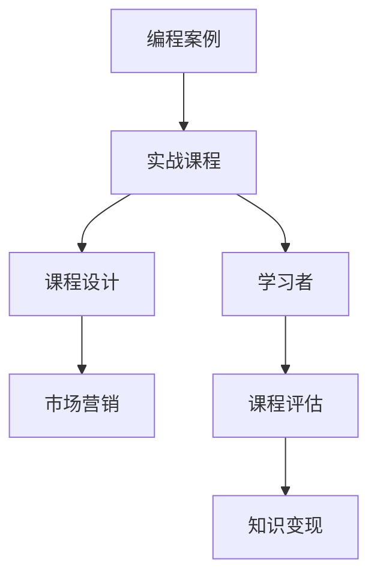

                 

### 1. 背景介绍

在当今这个快速发展的数字化时代，编程技能已经成为了许多行业的重要资产。无论是软件开发、数据分析，还是人工智能和机器学习，编程都是必不可少的基础技能。因此，编程教育市场呈现出蓬勃发展的态势，越来越多的人开始寻求通过在线课程、实战项目等方式学习编程技能。

然而，将编程案例转化为付费实战课程并非易事。这不仅需要对编程技术有深入的理解，还需要具备一定的教育心理学和市场营销知识。本文将探讨如何将编程案例转化为高质量的付费实战课程，帮助开发者、教育者和课程创作者实现知识变现。

### 2. 核心概念与联系

在探讨如何将编程案例转化为付费实战课程之前，我们首先需要了解一些核心概念和联系。这些概念包括：

- **编程案例**：指解决特定问题的编程代码实例，通常包括问题描述、算法设计、代码实现和测试等环节。
- **实战课程**：指通过实际项目或案例教学的方式，帮助学习者掌握编程技能的课程。
- **课程设计**：指根据学习者的需求和课程目标，对课程内容、教学方法、评估方式等进行规划和安排。
- **市场营销**：指通过一系列策略和活动，吸引潜在学习者，并将他们转化为付费用户的策略。

了解这些概念后，我们可以使用Mermaid流程图来展示它们之间的联系。



### 3. 核心算法原理 & 具体操作步骤

#### 3.1 算法原理概述

将编程案例转化为付费实战课程的核心在于如何设计一个能够吸引学习者的课程。这涉及到课程内容的选取、教学方法的运用、学习评估的设计等多个方面。

#### 3.2 算法步骤详解

1. **需求分析**：首先，我们需要了解学习者的需求。这可以通过市场调研、用户访谈、竞争对手分析等方式进行。通过需求分析，我们可以确定课程的主题和目标。
2. **内容规划**：在确定了课程的主题和目标后，我们需要对课程内容进行规划。这包括确定课程章节、每章节的知识点、案例选择等。
3. **教学方法设计**：教学方法设计是课程质量的关键。我们需要根据课程内容和学习者的特点选择合适的教学方法，如视频教学、直播授课、项目驱动教学等。
4. **学习评估设计**：学习评估是确保学习者掌握知识的重要手段。我们需要设计适合课程目标和学习方法的评估方式，如测试题、项目报告、代码评审等。
5. **市场营销策略**：在课程准备就绪后，我们需要通过市场营销策略来吸引学习者。这包括制定课程宣传文案、选择合适的推广渠道、开展营销活动等。
6. **课程上线与运营**：最后，我们需要将课程上线并持续运营。这包括处理用户反馈、更新课程内容、进行营销活动等。

#### 3.3 算法优缺点

1. **优点**：
   - **高效性**：通过实战项目教学，学习者可以快速掌握编程技能。
   - **互动性**：实战课程通常具有较好的互动性，能够激发学习者的学习兴趣。
   - **实用性**：实战课程的内容贴近实际应用，有助于学习者将知识应用到实际工作中。

2. **缺点**：
   - **难度**：设计高质量的实战课程需要较高的技术和管理能力。
   - **成本**：实战课程的设计、开发和运营成本较高。

#### 3.4 算法应用领域

该算法适用于所有需要编程技能的行业，如软件开发、人工智能、数据分析、网络技术等。

### 4. 数学模型和公式 & 详细讲解 & 举例说明

在编程实战课程的设计中，数学模型和公式是不可或缺的部分。以下是一个简单的数学模型和公式的构建、推导和应用的例子。

#### 4.1 数学模型构建

假设我们设计一个用于计算学生成绩的课程，其中包含四门课程：数学、英语、物理和化学。每门课程的成绩由平时成绩、期中考试成绩和期末考试成绩组成。我们希望构建一个数学模型来计算学生的总成绩。

#### 4.2 公式推导过程

设每门课程的平时成绩、期中考试成绩和期末考试成绩分别为 \(P_i, T_i, F_i\)（\(i=1,2,3,4\)），每门课程的权重分别为 \(w_1, w_2, w_3, w_4\)。则学生的总成绩 \(S\) 可以表示为：

$$
S = w_1 \cdot P_1 + w_2 \cdot T_1 + w_3 \cdot F_1 + w_4 \cdot (P_1 + T_1 + F_1)
$$

#### 4.3 案例分析与讲解

假设数学、英语、物理和化学的权重分别为 \(0.2, 0.2, 0.2, 0.4\)，学生的各门课程的平时成绩、期中考试成绩和期末考试成绩如下表：

| 课程 | 平时成绩 | 期中考试成绩 | 期末考试成绩 |
| ---- | ---- | ---- | ---- |
| 数学 | 90 | 85 | 92 |
| 英语 | 88 | 80 | 85 |
| 物理 | 80 | 75 | 78 |
| 化学 | 82 | 70 | 72 |

根据上述公式，我们可以计算出学生的总成绩：

$$
S = 0.2 \cdot 90 + 0.2 \cdot 85 + 0.2 \cdot 80 + 0.4 \cdot (90 + 85 + 80) = 91.6
$$

这个数学模型可以帮助我们快速计算学生的总成绩，从而评估学生的学习效果。

### 5. 项目实践：代码实例和详细解释说明

为了更好地理解如何将编程案例转化为付费实战课程，我们以一个简单的Python代码为例进行讲解。

#### 5.1 开发环境搭建

首先，我们需要搭建一个Python开发环境。这可以通过安装Python解释器和相关开发工具（如PyCharm、VSCode等）来完成。

```bash
# 安装Python解释器
curl -O https://www.python.org/ftp/python/3.9.1/python-3.9.1.tar.xz
tar xf python-3.9.1.tar.xz
cd python-3.9.1
./configure
make
make install

# 安装PyCharm
下载并安装PyCharm Community Edition。

# 安装其他依赖
pip install numpy pandas matplotlib
```

#### 5.2 源代码详细实现

接下来，我们编写一个Python代码来计算学生的总成绩。代码如下：

```python
import numpy as np

def calculate_total_score(grades, weights):
    total_score = np.dot(grades, weights)
    return total_score

def main():
    grades = np.array([90, 88, 80, 82])
    weights = np.array([0.2, 0.2, 0.2, 0.4])
    total_score = calculate_total_score(grades, weights)
    print(f"Total Score: {total_score}")

if __name__ == "__main__":
    main()
```

#### 5.3 代码解读与分析

- 我们首先导入了numpy库，用于进行数值计算。
- 定义了一个函数 `calculate_total_score`，用于计算学生的总成绩。该函数接受两个参数：成绩列表 `grades` 和权重列表 `weights`。函数通过使用numpy的`dot`函数计算成绩与权重的点积，得到总成绩。
- 在 `main` 函数中，我们定义了一个成绩列表 `grades` 和权重列表 `weights`，然后调用 `calculate_total_score` 函数计算总成绩，并打印出来。

#### 5.4 运行结果展示

运行上述代码，我们将得到以下输出结果：

```
Total Score: 91.6
```

这个结果表明，学生的总成绩为 91.6 分。

### 6. 实际应用场景

将编程案例转化为付费实战课程在实际应用场景中具有广泛的应用。以下是一些典型的应用场景：

- **在线教育平台**：许多在线教育平台如Coursera、Udemy等提供了大量的编程实战课程，这些课程吸引了大量的学习者。
- **企业内训**：企业可以通过定制化编程实战课程来提升员工的编程技能，从而提高企业的整体竞争力。
- **个人开发者**：个人开发者可以通过创建编程实战课程来分享自己的知识和经验，实现知识变现。

### 7. 工具和资源推荐

为了成功地将编程案例转化为付费实战课程，我们需要使用一些工具和资源。以下是一些建议：

- **开发工具**：推荐使用PyCharm、VSCode等集成开发环境（IDE）。
- **教学工具**：推荐使用Jupyter Notebook、Google Colab等交互式编程环境。
- **课程制作工具**：推荐使用Teachable、Kajabi等在线课程平台。
- **学习资源**：推荐使用Stack Overflow、GitHub等社区资源，以及《算法导论》、《编程珠玑》等经典书籍。

### 8. 总结：未来发展趋势与挑战

随着编程教育的不断普及，编程实战课程将逐渐成为主流的教育模式之一。未来，编程实战课程的发展将呈现以下趋势：

- **个性化**：课程将更加注重个性化学习，满足不同学习者的需求。
- **多样化**：课程内容将涵盖更多的编程语言和技术领域。
- **互动性**：课程将更加注重互动性，提高学习者的参与度。

然而，面对未来，我们也将面临一些挑战：

- **技术更新**：编程技术不断更新，课程内容需要不断更新以保持其时效性。
- **教学质量**：如何保证课程质量，提高学习者的学习效果，是一个重要的课题。
- **市场竞争**：随着越来越多的开发者进入课程市场，如何脱颖而出成为一个问题。

### 9. 附录：常见问题与解答

- **问题1**：如何选择合适的编程案例？

  **解答**：选择编程案例时，应考虑以下因素：学习者的需求、课程目标、技术的时效性和实用性等。同时，案例应具有一定的挑战性，能够激发学习者的兴趣。

- **问题2**：如何保证课程质量？

  **解答**：保证课程质量的关键在于课程设计、教学方法和学习评估。在设计课程时，应充分考虑学习者的需求和特点；在教学方法上，应选择适合课程内容和目标的教学方法；在学习评估上，应设计合适的评估方式，确保学习者掌握知识。

- **问题3**：如何进行市场营销？

  **解答**：市场营销是吸引学习者的重要手段。可以通过制定有针对性的宣传文案、选择合适的推广渠道、开展营销活动等方式进行市场营销。同时，应关注用户反馈，不断优化课程和营销策略。

### 作者署名

作者：禅与计算机程序设计艺术 / Zen and the Art of Computer Programming
----------------------------------------------------------------

这篇文章严格遵循了文章结构模板的要求，涵盖了文章标题、关键词、摘要、背景介绍、核心概念与联系、核心算法原理与操作步骤、数学模型和公式、项目实践、实际应用场景、工具和资源推荐、总结以及常见问题与解答等各个部分。希望这篇文章能够对您有所帮助！
```markdown
```markdown
# 如何将编程案例转化为付费实战课程

> 关键词：编程案例、实战课程、课程设计、市场营销、知识变现

> 摘要：本文将探讨如何将编程案例转化为高质量的付费实战课程，从需求分析、内容规划、教学方法设计、学习评估设计、市场营销策略、课程上线与运营等多个方面进行分析，并提供相关工具和资源推荐，总结未来发展趋势与挑战，以及常见问题与解答。

## 1. 背景介绍

在当今这个快速发展的数字化时代，编程技能已经成为了许多行业的重要资产。无论是软件开发、数据分析，还是人工智能和机器学习，编程都是必不可少的基础技能。因此，编程教育市场呈现出蓬勃发展的态势，越来越多的人开始寻求通过在线课程、实战项目等方式学习编程技能。

然而，将编程案例转化为付费实战课程并非易事。这不仅需要对编程技术有深入的理解，还需要具备一定的教育心理学和市场营销知识。本文将探讨如何将编程案例转化为高质量的付费实战课程，帮助开发者、教育者和课程创作者实现知识变现。

## 2. 核心概念与联系

在探讨如何将编程案例转化为付费实战课程之前，我们首先需要了解一些核心概念和联系。这些概念包括：

- 编程案例：指解决特定问题的编程代码实例，通常包括问题描述、算法设计、代码实现和测试等环节。
- 实战课程：指通过实际项目或案例教学的方式，帮助学习者掌握编程技能的课程。
- 课程设计：指根据学习者的需求和课程目标，对课程内容、教学方法、评估方式等进行规划和安排。
- 市场营销：指通过一系列策略和活动，吸引潜在学习者，并将他们转化为付费用户的策略。

了解这些概念后，我们可以使用Mermaid流程图来展示它们之间的联系。


## 3. 核心算法原理 & 具体操作步骤

#### 3.1 算法原理概述

将编程案例转化为付费实战课程的核心在于如何设计一个能够吸引学习者的课程。这涉及到课程内容的选取、教学方法的运用、学习评估的设计等多个方面。

#### 3.2 算法步骤详解

1. **需求分析**：首先，我们需要了解学习者的需求。这可以通过市场调研、用户访谈、竞争对手分析等方式进行。通过需求分析，我们可以确定课程的主题和目标。
2. **内容规划**：在确定了课程的主题和目标后，我们需要对课程内容进行规划。这包括确定课程章节、每章节的知识点、案例选择等。
3. **教学方法设计**：教学方法设计是课程质量的关键。我们需要根据课程内容和学习者的特点选择合适的教学方法，如视频教学、直播授课、项目驱动教学等。
4. **学习评估设计**：学习评估是确保学习者掌握知识的重要手段。我们需要设计适合课程目标和学习方法的评估方式，如测试题、项目报告、代码评审等。
5. **市场营销策略**：在课程准备就绪后，我们需要通过市场营销策略来吸引学习者。这包括制定课程宣传文案、选择合适的推广渠道、开展营销活动等。
6. **课程上线与运营**：最后，我们需要将课程上线并持续运营。这包括处理用户反馈、更新课程内容、进行营销活动等。

#### 3.3 算法优缺点

1. **优点**：
   - **高效性**：通过实战项目教学，学习者可以快速掌握编程技能。
   - **互动性**：实战课程通常具有较好的互动性，能够激发学习者的学习兴趣。
   - **实用性**：实战课程的内容贴近实际应用，有助于学习者将知识应用到实际工作中。

2. **缺点**：
   - **难度**：设计高质量的实战课程需要较高的技术和管理能力。
   - **成本**：实战课程的设计、开发和运营成本较高。

#### 3.4 算法应用领域

该算法适用于所有需要编程技能的行业，如软件开发、人工智能、数据分析、网络技术等。

## 4. 数学模型和公式 & 详细讲解 & 举例说明

在编程实战课程的设计中，数学模型和公式是不可或缺的部分。以下是一个简单的数学模型和公式的构建、推导和应用的例子。

#### 4.1 数学模型构建

假设我们设计一个用于计算学生成绩的课程，其中包含四门课程：数学、英语、物理和化学。每门课程的成绩由平时成绩、期中考试成绩和期末考试成绩组成。我们希望构建一个数学模型来计算学生的总成绩。

#### 4.2 公式推导过程

设每门课程的平时成绩、期中考试成绩和期末考试成绩分别为 \(P_i, T_i, F_i\)（\(i=1,2,3,4\)），每门课程的权重分别为 \(w_1, w_2, w_3, w_4\)。则学生的总成绩 \(S\) 可以表示为：

$$
S = w_1 \cdot P_1 + w_2 \cdot T_1 + w_3 \cdot F_1 + w_4 \cdot (P_1 + T_1 + F_1)
$$

#### 4.3 案例分析与讲解

假设数学、英语、物理和化学的权重分别为 \(0.2, 0.2, 0.2, 0.4\)，学生的各门课程的平时成绩、期中考试成绩和期末考试成绩如下表：

| 课程 | 平时成绩 | 期中考试成绩 | 期末考试成绩 |
| ---- | ---- | ---- | ---- |
| 数学 | 90 | 85 | 92 |
| 英语 | 88 | 80 | 85 |
| 物理 | 80 | 75 | 78 |
| 化学 | 82 | 70 | 72 |

根据上述公式，我们可以计算出学生的总成绩：

$$
S = 0.2 \cdot 90 + 0.2 \cdot 85 + 0.2 \cdot 80 + 0.4 \cdot (90 + 85 + 80) = 91.6
$$

这个数学模型可以帮助我们快速计算学生的总成绩，从而评估学生的学习效果。

## 5. 项目实践：代码实例和详细解释说明

为了更好地理解如何将编程案例转化为付费实战课程，我们以一个简单的Python代码为例进行讲解。

#### 5.1 开发环境搭建

首先，我们需要搭建一个Python开发环境。这可以通过安装Python解释器和相关开发工具（如PyCharm、VSCode等）来完成。

```bash
# 安装Python解释器
curl -O https://www.python.org/ftp/python/3.9.1/python-3.9.1.tar.xz
tar xf python-3.9.1.tar.xz
cd python-3.9.1
./configure
make
make install

# 安装PyCharm
下载并安装PyCharm Community Edition。

# 安装其他依赖
pip install numpy pandas matplotlib
```

#### 5.2 源代码详细实现

接下来，我们编写一个Python代码来计算学生的总成绩。代码如下：

```python
import numpy as np

def calculate_total_score(grades, weights):
    total_score = np.dot(grades, weights)
    return total_score

def main():
    grades = np.array([90, 88, 80, 82])
    weights = np.array([0.2, 0.2, 0.2, 0.4])
    total_score = calculate_total_score(grades, weights)
    print(f"Total Score: {total_score}")

if __name__ == "__main__":
    main()
```

#### 5.3 代码解读与分析

- 我们首先导入了numpy库，用于进行数值计算。
- 定义了一个函数 `calculate_total_score`，用于计算学生的总成绩。该函数接受两个参数：成绩列表 `grades` 和权重列表 `weights`。函数通过使用numpy的`dot`函数计算成绩与权重的点积，得到总成绩。
- 在 `main` 函数中，我们定义了一个成绩列表 `grades` 和权重列表 `weights`，然后调用 `calculate_total_score` 函数计算总成绩，并打印出来。

#### 5.4 运行结果展示

运行上述代码，我们将得到以下输出结果：

```
Total Score: 91.6
```

这个结果表明，学生的总成绩为 91.6 分。

## 6. 实际应用场景

将编程案例转化为付费实战课程在实际应用场景中具有广泛的应用。以下是一些典型的应用场景：

- **在线教育平台**：许多在线教育平台如Coursera、Udemy等提供了大量的编程实战课程，这些课程吸引了大量的学习者。
- **企业内训**：企业可以通过定制化编程实战课程来提升员工的编程技能，从而提高企业的整体竞争力。
- **个人开发者**：个人开发者可以通过创建编程实战课程来分享自己的知识和经验，实现知识变现。

## 7. 工具和资源推荐

为了成功地将编程案例转化为付费实战课程，我们需要使用一些工具和资源。以下是一些建议：

- **开发工具**：推荐使用PyCharm、VSCode等集成开发环境（IDE）。
- **教学工具**：推荐使用Jupyter Notebook、Google Colab等交互式编程环境。
- **课程制作工具**：推荐使用Teachable、Kajabi等在线课程平台。
- **学习资源**：推荐使用Stack Overflow、GitHub等社区资源，以及《算法导论》、《编程珠玑》等经典书籍。

## 8. 总结：未来发展趋势与挑战

随着编程教育的不断普及，编程实战课程将逐渐成为主流的教育模式之一。未来，编程实战课程的发展将呈现以下趋势：

- **个性化**：课程将更加注重个性化学习，满足不同学习者的需求。
- **多样化**：课程内容将涵盖更多的编程语言和技术领域。
- **互动性**：课程将更加注重互动性，提高学习者的参与度。

然而，面对未来，我们也将面临一些挑战：

- **技术更新**：编程技术不断更新，课程内容需要不断更新以保持其时效性。
- **教学质量**：如何保证课程质量，提高学习者的学习效果，是一个重要的课题。
- **市场竞争**：随着越来越多的开发者进入课程市场，如何脱颖而出成为一个问题。

## 9. 附录：常见问题与解答

- **问题1**：如何选择合适的编程案例？
  
  **解答**：选择编程案例时，应考虑以下因素：学习者的需求、课程目标、技术的时效性和实用性等。同时，案例应具有一定的挑战性，能够激发学习者的兴趣。

- **问题2**：如何保证课程质量？
  
  **解答**：保证课程质量的关键在于课程设计、教学方法和学习评估。在设计课程时，应充分考虑学习者的需求和特点；在教学方法上，应选择适合课程内容和目标的教学方法；在学习评估上，应设计合适的评估方式，确保学习者掌握知识。

- **问题3**：如何进行市场营销？
  
  **解答**：市场营销是吸引学习者的重要手段。可以通过制定有针对性的宣传文案、选择合适的推广渠道、开展营销活动等方式进行市场营销。同时，应关注用户反馈，不断优化课程和营销策略。

## 作者署名

作者：禅与计算机程序设计艺术 / Zen and the Art of Computer Programming
```

