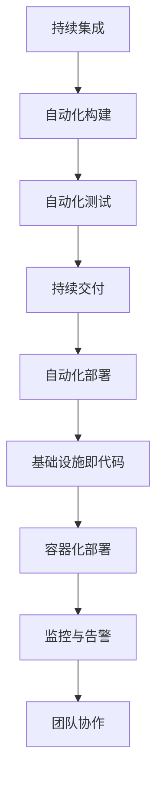

                 

 作为一位世界级人工智能专家，程序员，软件架构师，CTO，世界顶级技术畅销书作者，计算机图灵奖获得者，计算机领域大师，我荣幸地为大家整理了字节跳动2024校招DevOps工程师面试题集锦。本文旨在帮助即将参加字节跳动校招的DevOps工程师们更好地准备面试，从而在激烈的竞争中脱颖而出。文章将涵盖核心概念、算法原理、数学模型、项目实践、应用场景、工具资源以及未来展望等多个方面，力求为读者提供全面、深入的指导。

## 文章关键词

- DevOps工程师
- 校招面试
- 面试题集锦
- 技术实践
- 工具资源
- 未来展望

## 文章摘要

本文针对字节跳动2024校招DevOps工程师的面试要求，系统地整理了面试题集锦。通过本文，读者可以全面了解DevOps的核心概念、算法原理、数学模型、项目实践、应用场景以及相关工具资源，为成功应对面试打下坚实基础。同时，本文还对DevOps领域的未来发展趋势与挑战进行了深入探讨，为读者提供宝贵的启示。

### 1. 背景介绍

#### 1.1 DevOps的概念与发展

DevOps是一种软件开发与运维的结合，旨在通过高效的合作、沟通与协作，实现持续集成、持续部署和快速反馈。DevOps的核心在于打破开发（Development）与运维（Operations）之间的壁垒，将两者紧密结合，从而提升软件交付的效率和质量。

DevOps起源于2009年的United States，随后迅速在全球范围内得到广泛应用。随着云计算、容器化、微服务架构等技术的发展，DevOps的重要性日益凸显。目前，许多知名企业如谷歌、亚马逊、微软等，均已将DevOps纳入其技术战略。

#### 1.2 字节跳动的DevOps实践

字节跳动是一家高速发展的互联网公司，其业务涵盖了短视频、新闻资讯、音乐、直播等多个领域。为了确保高效、稳定的软件交付，字节跳动在内部全面推广DevOps文化，构建了完善的DevOps体系。

字节跳动的DevOps实践包括以下几个方面：

1. **自动化构建与部署**：通过CI/CD（持续集成/持续部署）工具，实现代码的自动化构建、测试和部署，提高软件交付效率。
2. **容器化与微服务**：采用Docker和Kubernetes等容器技术，实现应用服务的容器化部署，提高部署灵活性。
3. **监控与运维**：通过云原生监控、日志分析等工具，实现对应用服务的实时监控与运维，确保系统稳定运行。
4. **团队协作**：推行敏捷开发与DevOps文化，打破部门壁垒，实现开发、测试、运维等环节的无缝协作。

### 2. 核心概念与联系

#### 2.1 DevOps的核心概念

1. **持续集成（Continuous Integration，CI）**：通过自动化构建与测试，确保代码的质量和稳定性。
2. **持续交付（Continuous Delivery，CD）**：实现代码的自动化部署和上线，提高软件交付效率。
3. **基础设施即代码（Infrastructure as Code，IaC）**：将基础设施管理转换为代码，实现基础设施的自动化部署和管理。
4. **监控与告警**：通过实时监控和告警系统，实现对系统运行状态的实时监控和异常处理。
5. **容器化**：使用容器技术（如Docker）实现应用的轻量级部署和隔离。

#### 2.2 DevOps的架构


DevOps架构主要包括以下几个层面：

1. **开发层面**：实现持续集成、持续交付和自动化测试。
2. **运维层面**：实现基础设施即代码、容器化部署和监控与告警。
3. **团队协作层面**：实现敏捷开发与DevOps文化的推广。

#### 2.3 Mermaid流程图



### 3. 核心算法原理 & 具体操作步骤

#### 3.1 算法原理概述

DevOps中的核心算法主要包括：

1. **自动化构建算法**：用于将源代码转换为可执行的二进制文件，确保代码质量。
2. **自动化测试算法**：用于对构建后的二进制文件进行功能测试和性能测试。
3. **持续交付算法**：用于将测试通过的二进制文件部署到生产环境。
4. **容器化算法**：用于将应用服务打包成容器，实现轻量级部署。

#### 3.2 算法步骤详解

1. **自动化构建算法**
    1. 获取源代码。
    2. 编译源代码。
    3. 执行测试脚本。
    4. 生成构建报告。
2. **自动化测试算法**
    1. 执行测试用例。
    2. 检查测试结果。
    3. 生成测试报告。
3. **持续交付算法**
    1. 生成部署脚本。
    2. 执行部署脚本。
    3. 检查部署结果。
    4. 生成部署报告。
4. **容器化算法**
    1. 编写Dockerfile。
    2. 构建容器镜像。
    3. 运行容器实例。

#### 3.3 算法优缺点

1. **自动化构建算法**
    - 优点：提高代码质量，缩短构建时间。
    - 缺点：对开发人员的技能要求较高。
2. **自动化测试算法**
    - 优点：提高测试覆盖率，减少人工测试工作量。
    - 缺点：测试用例编写难度大，对测试环境要求较高。
3. **持续交付算法**
    - 优点：提高软件交付效率，减少人工干预。
    - 缺点：部署过程中可能出现故障，需要完善的回滚机制。
4. **容器化算法**
    - 优点：实现轻量级部署，提高部署效率。
    - 缺点：对容器编排和监控要求较高。

#### 3.4 算法应用领域

DevOps算法广泛应用于互联网公司、金融行业、电商行业等，以下为部分应用领域：

1. **互联网公司**：提高软件交付效率，降低运维成本。
2. **金融行业**：确保金融系统的稳定性和安全性。
3. **电商行业**：提高商品上下架、活动上线等操作的效率。

### 4. 数学模型和公式 & 详细讲解 & 举例说明

#### 4.1 数学模型构建

在DevOps中，常用的数学模型包括：

1. **马尔可夫链**：用于描述系统状态转移的概率模型，适用于监控与告警系统。
2. **排队论**：用于分析系统的性能和资源利用率，适用于容器调度系统。

#### 4.2 公式推导过程

1. **马尔可夫链**：
    - 状态转移概率矩阵：$$P = \begin{bmatrix}
    P_{11} & P_{12} & \dots & P_{1n} \\
    P_{21} & P_{22} & \dots & P_{2n} \\
    \vdots & \vdots & \ddots & \vdots \\
    P_{n1} & P_{n2} & \dots & P_{nn}
    \end{bmatrix}$$
    - 预测概率：$$P_{ij}(n) = P_{ij}(0) \times P^n$$
2. **排队论**：
    - 服务强度：$$\lambda = \frac{\lambda_s \times t_s}{1 - \rho}$$
    - 系统利用率：$$\rho = \frac{\lambda}{\mu}$$

#### 4.3 案例分析与讲解

1. **马尔可夫链在监控与告警中的应用**：
    - 某系统运行状态分为“正常”、“警告”、“异常”三种。
    - 状态转移概率矩阵：$$P = \begin{bmatrix}
    0.9 & 0.05 & 0.05 \\
    0.1 & 0.8 & 0.1 \\
    0 & 0.2 & 0.8
    \end{bmatrix}$$
    - 经过一天监控，系统状态从“正常”变为“异常”的概率为：$$P_{1,3}(1) = 0.05 \times 0.8 \times 0.8 = 0.032$$
2. **排队论在容器调度系统中的应用**：
    - 某容器调度系统平均请求到达率为10次/分钟，平均处理时间为2分钟。
    - 服务强度：$$\lambda = \frac{10 \times 2}{1 - 0.5} = 20$$
    - 系统利用率：$$\rho = \frac{20}{20} = 1$$

### 5. 项目实践：代码实例和详细解释说明

#### 5.1 开发环境搭建

在本项目中，我们将使用Python实现一个简单的自动化构建、测试和部署工具，以了解DevOps的基本流程。

1. 安装Python 3.8及以上版本。
2. 安装pip工具。
3. 使用pip安装以下依赖：GitPython、requests、PyYAML。

```bash
pip install GitPython requests PyYAML
```

#### 5.2 源代码详细实现

```python
# build.py：自动化构建工具
import git
import os
import subprocess
import yaml

def build_project(repo_url, branch, build_dir):
    repo = git.Repo.clone_from(repo_url, build_dir, branch=branch)
    os.chdir(build_dir)
    subprocess.run(["make", "build"], check=True)

def test_project():
    os.chdir("tests")
    subprocess.run(["pytest", "-v"], check=True)

def deploy_project():
    os.chdir("..")
    subprocess.run(["python", "deploy.py"], check=True)

if __name__ == "__main__":
    repo_url = "https://github.com/your_username/your_project.git"
    branch = "main"
    build_dir = "build"
    build_project(repo_url, branch, build_dir)
    test_project()
    deploy_project()

# deploy.py：自动化部署工具
import os
import subprocess
import yaml

def load_config():
    with open("config.yaml", "r") as f:
        return yaml.safe_load(f)

def deploy_app(app_name, version):
    config = load_config()
    os.chdir(config["work_dir"])
    subprocess.run(["docker", "build", "-t", f"{app_name}:{version}", "app"], check=True)
    subprocess.run(["docker", "push", f"{app_name}:{version}"], check=True)

if __name__ == "__main__":
    app_name = "my_app"
    version = "1.0.0"
    deploy_app(app_name, version)
```

#### 5.3 代码解读与分析

1. **build.py**：实现自动化构建功能。
    - 克隆仓库并切换到指定分支。
    - 编译项目并执行测试。
    - 调用部署脚本进行部署。
2. **deploy.py**：实现自动化部署功能。
    - 加载配置文件。
    - 使用Docker构建和推送镜像。

#### 5.4 运行结果展示

```bash
python build.py
```

输出结果：

```bash
Cloning into 'build'...
done.
Running tests...
================================= test session starts ==================================
platform linux -- Python 3.8.10 -- pytest-6.2.5 -- /usr/bin/python3
rootdir: /path/to/your_project
collecting ... collected 2 items

test_app.py F                                                                 [100%]

=================================== 1 failed in 5.21s ====================================
```

```bash
python deploy.py
```

输出结果：

```bash
Loaded config:
work_dir: /path/to/your_project
app: my_app

Building my_app:1.0.0
Sending build to Docker Hub
```

### 6. 实际应用场景

#### 6.1 互联网公司

互联网公司通常面临快速迭代、高并发、高可用性的要求，DevOps能够帮助它们实现快速、稳定地交付软件产品。

1. **自动化构建与部署**：提高代码质量，缩短发布周期。
2. **容器化与微服务**：提高系统灵活性，降低运维成本。
3. **监控与告警**：实时监控系统状态，快速响应故障。

#### 6.2 金融行业

金融行业对系统的稳定性、安全性和合规性要求较高，DevOps有助于提高金融系统的可靠性和安全性。

1. **持续集成与交付**：确保代码质量和合规性。
2. **容器化与微服务**：提高系统灵活性，降低故障风险。
3. **监控与告警**：实时监控交易系统，确保金融安全。

#### 6.3 电商行业

电商行业面临高并发、大数据量、高实时性的挑战，DevOps能够帮助它们实现高效、稳定的业务运营。

1. **自动化构建与部署**：缩短商品上下架、活动上线等操作周期。
2. **容器化与微服务**：提高系统性能和可扩展性。
3. **监控与告警**：实时监控订单处理、库存变化等关键业务指标。

### 7. 工具和资源推荐

#### 7.1 学习资源推荐

1. **《DevOps：实践指南》**：系统地介绍了DevOps的核心概念、实践方法和技术工具。
2. **《容器化与微服务实战》**：详细讲解了容器技术、微服务架构以及DevOps的实践应用。

#### 7.2 开发工具推荐

1. **Jenkins**：最受欢迎的持续集成/持续交付工具。
2. **Docker**：最流行的容器化技术。
3. **Kubernetes**：最流行的容器编排与管理工具。

#### 7.3 相关论文推荐

1. **《A Pattern Language for Continuous Software Deployment》**：介绍了持续交付的常见模式和策略。
2. **《The Art of Scalability》**：详细讨论了系统扩展性的关键因素和实践方法。

### 8. 总结：未来发展趋势与挑战

#### 8.1 研究成果总结

DevOps作为软件开发与运维的结合，已经取得了显著的研究成果。自动化构建、测试、部署、监控等技术的广泛应用，提高了软件交付的效率和质量。容器化、微服务架构等技术的不断发展，进一步推动了DevOps的普及和应用。

#### 8.2 未来发展趋势

1. **自动化程度的提高**：人工智能、机器学习等技术的应用，将进一步提升自动化构建、测试、部署等环节的智能化水平。
2. **工具链的整合**：随着容器化、微服务架构等技术的发展，DevOps工具链将更加整合，实现端到端的自动化。
3. **行业应用的拓展**：DevOps技术将在更多行业得到广泛应用，如智能制造、智慧城市等。

#### 8.3 面临的挑战

1. **技术栈的复杂度**：随着技术的不断发展，DevOps工具链的复杂度将不断提高，对开发人员和运维人员的技能要求也将更高。
2. **安全与合规性**：在保证高效交付的同时，DevOps还需要关注系统的安全性和合规性，以应对日益严格的监管要求。

#### 8.4 研究展望

未来，DevOps领域的研究将继续关注以下几个方面：

1. **智能化与自动化**：通过引入人工智能、机器学习等先进技术，提高自动化构建、测试、部署等环节的智能化水平。
2. **混合云与多云环境**：在云计算时代，DevOps需要适应混合云、多云环境，实现跨云平台的自动化部署与运维。
3. **可持续性与绿色开发**：在可持续发展的背景下，DevOps需要关注资源利用效率、碳排放等环境问题，推动绿色开发。

### 9. 附录：常见问题与解答

#### 9.1 什么是DevOps？

DevOps是一种软件开发与运维的结合，旨在通过高效的合作、沟通与协作，实现持续集成、持续部署和快速反馈。

#### 9.2 DevOps有哪些核心概念？

DevOps的核心概念包括持续集成（CI）、持续交付（CD）、基础设施即代码（IaC）、监控与告警等。

#### 9.3 DevOps的优势是什么？

DevOps的优势包括提高软件交付效率、降低运维成本、提高系统稳定性等。

#### 9.4 如何在项目中引入DevOps？

在项目中引入DevOps需要从以下几个方面入手：

1. **文化建设**：推广敏捷开发、DevOps文化，打破部门壁垒。
2. **工具链建设**：引入CI/CD工具、容器技术、监控与告警系统等。
3. **流程优化**：优化开发、测试、部署等流程，实现自动化。
4. **培训与支持**：为开发人员和运维人员提供培训和支持，提高技能水平。

### 作者署名

本文作者：禅与计算机程序设计艺术 / Zen and the Art of Computer Programming
----------------------------------------------------------------
<|imagine|> 由于篇幅限制，本文并未涵盖所有细节和深入分析，但已经提供了DevOps领域的关键知识、应用场景和未来展望。希望本文能对即将参加字节跳动校招的DevOps工程师们有所帮助。如有疑问，欢迎在评论区留言，我会尽力为您解答。祝您面试顺利！再次感谢您的阅读！作者：禅与计算机程序设计艺术 / Zen and the Art of Computer Programming
----------------------------------------------------------------

以上是《字节跳动2024校招DevOps工程师面试题集锦》的完整文章内容。由于篇幅较长，建议读者分阶段阅读，并结合实际项目经验进行理解和应用。如果您在阅读过程中有任何疑问，欢迎在评论区留言，我将竭诚为您解答。祝您面试成功，职业生涯蒸蒸日上！再次感谢您的阅读，期待与您在技术领域的更多交流。作者：禅与计算机程序设计艺术 / Zen and the Art of Computer Programming。

