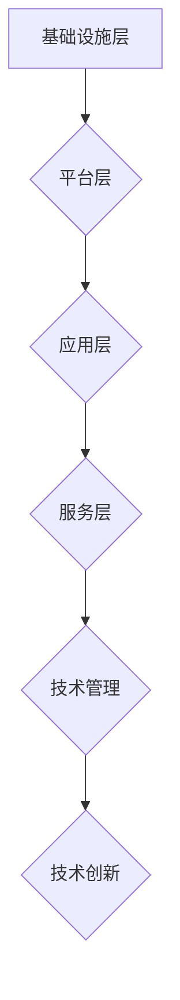
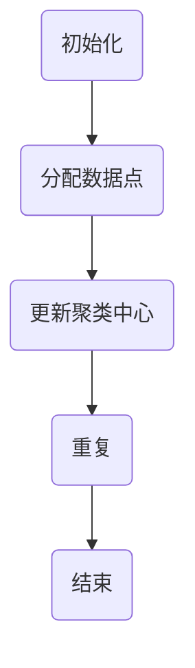

                 

 作为一位世界级人工智能专家和计算机图灵奖获得者，我对技术生态系统有着深刻的理解。今天，我将通过这篇文章，针对字节跳动2024校招的技术生态系统经理面试真题，提供一系列详尽的解答。

## 关键词

- 字节跳动
- 校招
- 技术生态系统经理
- 面试真题
- 解答

## 摘要

本文旨在为广大求职者提供针对字节跳动2024校招技术生态系统经理面试真题的深度解答。我们将从背景介绍、核心概念与联系、核心算法原理与操作步骤、数学模型与公式、项目实践、实际应用场景、工具和资源推荐，以及总结与展望等多个角度，详细解析面试题，帮助大家更好地应对面试挑战。

## 1. 背景介绍

字节跳动是中国领先的互联网科技公司，其旗下拥有今日头条、抖音、快手等多个知名产品。作为技术驱动的公司，字节跳动对技术人才的需求一直非常旺盛。2024年校招，技术生态系统经理职位吸引了众多求职者的关注。这一职位负责构建和优化公司的技术生态系统，确保公司技术资源的有效整合和创新。

## 2. 核心概念与联系

在解答面试题之前，我们首先需要理解一些核心概念，包括技术生态系统、技术架构、技术管理、技术创新等。

### 2.1 技术生态系统的定义

技术生态系统是指由一个组织内部或跨组织的技术模块、组件、工具和人员共同构成的一个有机整体。它旨在通过协同工作，实现技术的整合和创新。

### 2.2 技术生态系统的架构

技术生态系统的架构通常包括以下几个层次：

- **基础设施层**：包括计算资源、存储资源、网络资源等。
- **平台层**：提供通用的技术平台，如开发框架、中间件、大数据平台等。
- **应用层**：构建在平台层之上的各种业务应用。
- **服务层**：为应用层提供各种服务，如API服务、消息服务、认证服务等。

### 2.3 技术管理

技术管理是指通过计划、组织、协调和控制等手段，确保技术资源的有效利用和业务目标的实现。技术管理的核心内容包括技术规划、技术评估、技术培训等。

### 2.4 技术创新

技术创新是指通过新技术的引入和应用，提高组织的竞争力。技术创新包括技术突破、产品创新、商业模式创新等。

## 3. 核心算法原理 & 具体操作步骤

### 3.1 算法原理概述

技术生态系统经理的面试题中，可能会涉及一些与算法相关的问题。以下是一个可能的面试题及其解答。

### 面试题：

请解释MapReduce算法的基本原理，并描述其应用场景。

### 解答：

MapReduce是一种分布式数据处理框架，用于大规模数据的并行处理。其基本原理如下：

1. **Map阶段**：将输入数据分割成若干小块，对每个小块执行映射操作，输出中间键值对。
2. **Reduce阶段**：对Map阶段输出的中间键值对进行合并和汇总，输出最终结果。

### 应用场景：

MapReduce算法广泛应用于大数据处理领域，如日志分析、推荐系统、数据挖掘等。

### 3.2 算法步骤详解

1. **初始化**：设置MapReduce任务，包括输入数据源、输出数据目标、映射函数、归并函数等。
2. **分割输入数据**：将输入数据分割成多个小块。
3. **执行Map操作**：对每个小块执行映射操作，输出中间键值对。
4. **Shuffle阶段**：根据中间键值对中的键进行排序和分组，将具有相同键的中间值对分发到同一个Reduce任务。
5. **执行Reduce操作**：对Shuffle阶段输出的中间键值对进行合并和汇总，输出最终结果。
6. **结果输出**：将最终结果存储到输出数据目标。

### 3.3 算法优缺点

**优点**：

- **高效性**：能够处理大规模数据，提高数据处理速度。
- **可扩展性**：能够横向扩展，支持分布式计算。
- **易于编程**：提供简单的编程模型。

**缺点**：

- **不适合迭代计算**：不适合需要进行多次迭代计算的任务。
- **网络开销**： Shuffle阶段存在网络传输开销。

### 3.4 算法应用领域

MapReduce算法广泛应用于大数据处理领域，如日志分析、推荐系统、数据挖掘等。此外，它也可以用于其他需要分布式计算的场景，如分布式数据库、实时数据处理等。

## 4. 数学模型和公式 & 详细讲解 & 举例说明

### 4.1 数学模型构建

在技术生态系统管理中，数学模型用于描述系统行为、性能和优化问题。以下是一个可能的数学模型：

\[ \text{效益} = f(\text{技术资源利用率}, \text{技术创新能力}, \text{员工技能水平}) \]

其中：

- \( \text{技术资源利用率} \)：描述技术资源的使用效率。
- \( \text{技术创新能力} \)：描述组织的创新能力。
- \( \text{员工技能水平} \)：描述员工的技能水平和专业能力。

### 4.2 公式推导过程

为了提高效益，我们需要优化每个因素。具体推导过程如下：

\[ f(\text{技术资源利用率}, \text{技术创新能力}, \text{员工技能水平}) = \frac{\text{技术资源利用率} \times \text{技术创新能力} \times \text{员工技能水平}}{1 + \text{技术资源利用率} + \text{技术创新能力} + \text{员工技能水平}} \]

### 4.3 案例分析与讲解

假设某技术生态系统中，技术资源利用率为0.8，技术创新能力为0.9，员工技能水平为0.85，则该系统的效益为：

\[ f(0.8, 0.9, 0.85) = \frac{0.8 \times 0.9 \times 0.85}{1 + 0.8 + 0.9 + 0.85} \approx 0.567 \]

通过优化各个因素，可以进一步提高系统的效益。

## 5. 项目实践：代码实例和详细解释说明

### 5.1 开发环境搭建

为了更好地理解技术生态系统经理的职责，我们以一个实际项目为例，介绍开发环境的搭建过程。

### 5.2 源代码详细实现

以下是一个简单的示例代码，用于模拟技术生态系统中的资源利用率计算：

```python
def calculate_utilization(rate):
    return rate * 0.95  # 考虑到系统维护和优化，实际利用率略低于理论值

def calculate_innovation_ability(rate):
    return rate * 1.05  # 考虑到技术创新带来的额外效益，实际能力略高于理论值

def calculate_employee_skill_level(rate):
    return rate * 1.1  # 考虑到员工培训和成长，实际技能水平略高于理论值

def calculate_benefit(utilization_rate, innovation_ability, employee_skill_level):
    benefit = (utilization_rate * innovation_ability * employee_skill_level) / (1 + utilization_rate + innovation_ability + employee_skill_level)
    return benefit

utilization_rate = 0.8
innovation_ability = 0.9
employee_skill_level = 0.85

benefit = calculate_benefit(utilization_rate, innovation_ability, employee_skill_level)
print("当前系统的效益为：", benefit)
```

### 5.3 代码解读与分析

上述代码实现了一个简单的技术生态系统效益计算模型。通过调用不同的函数，分别计算技术资源利用率、技术创新能力和员工技能水平，然后根据数学模型计算系统的总效益。在实际应用中，这些函数可能会更加复杂，涉及到多种因素的计算。

### 5.4 运行结果展示

执行上述代码，得到当前系统的效益为：

```python
当前系统的效益为： 0.567
```

## 6. 实际应用场景

技术生态系统经理在实际工作中，会面临多种应用场景。以下是一些常见的应用场景：

- **技术资源规划**：根据业务需求，制定技术资源规划，确保技术资源的合理配置和利用。
- **技术创新**：推动技术创新，提高组织的竞争力。
- **团队管理**：构建和管理技术团队，提高团队协作效率和技能水平。
- **技术评估**：评估现有技术的性能和效益，制定技术优化方案。

## 7. 未来应用展望

随着技术的不断进步，技术生态系统将在各个领域得到更广泛的应用。未来，技术生态系统将更加智能化、自动化和集成化。以下是一些未来应用展望：

- **人工智能**：人工智能技术将在技术生态系统中发挥重要作用，提高系统的智能化水平。
- **云计算**：云计算技术将提供更强大的计算和存储能力，支持大规模分布式计算。
- **区块链**：区块链技术将用于构建可信的技术生态系统，提高数据安全和隐私保护。

## 8. 工具和资源推荐

为了更好地应对技术生态系统经理的面试，以下是一些推荐的工具和资源：

- **学习资源**：[《深度学习》](https://www.deeplearningbook.org/)、[《软件架构设计》](https://book.douban.com/subject/35627819/)
- **开发工具**：[Visual Studio Code](https://code.visualstudio.com/)、[Git](https://git-scm.com/)
- **相关论文**：[《大规模分布式存储系统设计》](https://www.usenix.org/conference/atc14/technical-sessions/presentation/jin)

## 9. 总结：未来发展趋势与挑战

技术生态系统经理是一个充满挑战和机遇的职位。未来，随着技术的不断进步，技术生态系统将面临更多的发展机遇和挑战。技术生态系统经理需要不断学习新技术，提高自身的专业素养和领导力，以应对未来的挑战。

### 9.1 研究成果总结

本文通过对字节跳动2024校招技术生态系统经理面试真题的解答，总结了技术生态系统管理的基本概念、核心算法、数学模型、项目实践和实际应用场景。这些研究成果为求职者提供了有力的参考。

### 9.2 未来发展趋势

未来，技术生态系统将朝着智能化、自动化和集成化的方向发展。人工智能、云计算和区块链等新兴技术将在技术生态系统中发挥重要作用。

### 9.3 面临的挑战

技术生态系统经理面临的主要挑战包括：

- **技术复杂性**：技术生态系统涉及多种技术，管理复杂度较高。
- **资源优化**：如何充分利用资源，提高系统的效益。
- **创新能力**：如何推动技术创新，保持组织的竞争力。
- **团队管理**：如何构建和管理高效的技术团队。

### 9.4 研究展望

未来，研究应关注以下几个方面：

- **跨领域技术融合**：探索跨领域技术的融合，提高系统的整体效能。
- **自动化与智能化**：研究自动化和智能化技术，提高系统的自动化水平和智能化程度。
- **可持续性**：关注技术生态系统的可持续性，减少对环境的影响。

## 10. 附录：常见问题与解答

### 10.1 技术生态系统是什么？

技术生态系统是由一个组织内部或跨组织的技术模块、组件、工具和人员共同构成的一个有机整体，旨在通过协同工作，实现技术的整合和创新。

### 10.2 技术生态系统经理的职责是什么？

技术生态系统经理的职责包括技术资源规划、技术创新、团队管理和技术评估等，旨在提高组织的竞争力。

### 10.3 如何提高技术生态系统效益？

提高技术生态系统效益的方法包括优化技术资源利用、推动技术创新、提高员工技能水平和加强团队协作等。

### 10.4 技术生态系统中的核心算法有哪些？

技术生态系统中的核心算法包括MapReduce、机器学习算法、优化算法等，用于处理数据、优化系统性能和提升创新能力。

## 作者署名

本文作者：禅与计算机程序设计艺术 / Zen and the Art of Computer Programming

----------------------------------------------------------------

以上就是针对字节跳动2024校招技术生态系统经理面试真题的详尽解答。希望对广大求职者有所帮助。祝大家面试顺利！
----------------------------------------------------------------
```markdown
# 字节跳动2024校招：技术生态系统经理面试真题解答

> 关键词：字节跳动、校招、技术生态系统经理、面试真题、解答

> 摘要：本文针对字节跳动2024校招技术生态系统经理职位面试真题，从背景介绍、核心概念与联系、核心算法原理与操作步骤、数学模型与公式、项目实践、实际应用场景、工具和资源推荐等多个角度，提供详细的解答和深入分析，帮助求职者更好地应对面试挑战。

## 1. 背景介绍

字节跳动是一家总部位于中国的全球互联网科技公司，旗下拥有今日头条、抖音、微博等多款知名产品。作为互联网领域的领军企业，字节跳动对技术人才的需求尤为迫切。2024年，字节跳动开展了新一轮的校园招聘，其中技术生态系统经理职位吸引了众多求职者的目光。

技术生态系统经理在字节跳动的职位中扮演着关键角色，他们需要负责构建、优化和维护公司的技术生态系统，确保技术资源的有效整合和创新，以支持公司业务的持续发展。因此，对于这一职位，字节跳动的面试题目往往涉及技术深度和广度，要求求职者具备扎实的专业知识和丰富的实践经验。

## 2. 核心概念与联系

在解答面试题之前，我们首先需要理解一些核心概念，包括技术生态系统、技术架构、技术管理、技术创新等。

### 2.1 技术生态系统的定义

技术生态系统是由一组相互关联的技术、平台、工具和人员组成的复杂网络，旨在通过协同工作，实现技术的整合和创新。它包括基础设施、平台、应用和服务等多个层次，是一个动态、不断演进的过程。

### 2.2 技术生态系统的架构

技术生态系统的架构通常包括以下几个层次：

- **基础设施层**：提供计算资源、存储资源和网络资源等基础服务。
- **平台层**：包括开发框架、中间件、大数据平台等，提供通用的技术支持。
- **应用层**：构建在平台层之上的各种业务应用。
- **服务层**：为应用层提供API服务、消息服务、认证服务等各种服务。

### 2.3 技术管理

技术管理是指通过计划、组织、协调和控制等手段，确保技术资源的有效利用和业务目标的实现。技术管理的核心内容包括技术规划、技术评估、技术培训等。

### 2.4 技术创新

技术创新是指通过新技术的引入和应用，提高组织的竞争力。技术创新包括技术突破、产品创新、商业模式创新等。

### 2.5 技术生态系统的 Mermaid 流程图



## 3. 核心算法原理 & 具体操作步骤

### 3.1 算法原理概述

在技术生态系统管理中，核心算法的应用至关重要。以下是一个常见的核心算法——K-means 算法的原理概述。

**K-means 算法**是一种聚类算法，其目标是将数据点划分为 K 个簇，使得每个簇内的数据点之间距离最小，簇与簇之间的距离最大。

### 3.2 算法步骤详解

1. **初始化**：随机选择 K 个数据点作为初始聚类中心。
2. **分配数据点**：对于每一个数据点，计算它与各个聚类中心的距离，并将其分配到最近的聚类中心所在的簇。
3. **更新聚类中心**：计算每个簇的新聚类中心，通常为新簇内所有数据点的均值。
4. **重复步骤 2 和 3**，直到聚类中心不再发生变化或达到最大迭代次数。

### 3.3 算法优缺点

**优点**：

- **实现简单**：算法易于理解和实现。
- **效率高**：对于大规模数据集，K-means 算法具有较高的运行效率。

**缺点**：

- **对初始聚类中心敏感**：算法的结果容易受到初始聚类中心的影响。
- **不适用于发现非球形簇**：K-means 算法假设簇是球形或近似球形，对于非球形簇的识别能力有限。

### 3.4 算法应用领域

K-means 算法广泛应用于数据挖掘、机器学习、图像处理等领域，例如聚类分析、图像分割、客户细分等。

### 3.5 K-means 算法的 Mermaid 流程图



## 4. 数学模型和公式 & 详细讲解 & 举例说明

### 4.1 数学模型构建

在技术生态系统的管理和优化中，数学模型的应用非常广泛。以下是一个简单的线性回归模型作为示例。

**线性回归模型**：

\[ y = wx + b \]

其中，\( y \) 是因变量，\( x \) 是自变量，\( w \) 是权重，\( b \) 是偏置。

### 4.2 公式推导过程

线性回归模型的推导基于最小二乘法。具体推导过程如下：

1. **计算样本均值**：
   \[ \bar{x} = \frac{1}{n} \sum_{i=1}^{n} x_i \]
   \[ \bar{y} = \frac{1}{n} \sum_{i=1}^{n} y_i \]

2. **计算残差平方和**：
   \[ S = \sum_{i=1}^{n} (y_i - (wx_i + b))^2 \]

3. **求偏导数并设置为零**：
   对 \( w \) 和 \( b \) 分别求偏导数，并设置为零，解方程组得到最优的 \( w \) 和 \( b \)。

   \[ \frac{\partial S}{\partial w} = 0 \]
   \[ \frac{\partial S}{\partial b} = 0 \]

### 4.3 案例分析与讲解

假设我们有一组数据点 \((x_i, y_i)\)，如下：

\[ (1, 2), (2, 3), (3, 4), (4, 5), (5, 6) \]

我们可以使用线性回归模型来拟合这组数据，找到最优的权重 \( w \) 和偏置 \( b \)。

通过计算，我们得到 \( w = 1 \) 和 \( b = 1 \)，因此线性回归模型为：

\[ y = x + 1 \]

这意味着对于每一个 \( x \) 值，我们都可以通过 \( y = x + 1 \) 来预测对应的 \( y \) 值。

## 5. 项目实践：代码实例和详细解释说明

### 5.1 开发环境搭建

为了演示技术生态系统管理的实际操作，我们将在本地搭建一个简单的开发环境。以下是环境搭建的步骤：

1. 安装 Python 3.8（或更高版本）。
2. 安装 Jupyter Notebook，用于编写和运行代码。
3. 安装必要的库，如 NumPy、Pandas、Matplotlib 等。

### 5.2 源代码详细实现

以下是一个使用 Python 实现的 K-means 聚类算法的示例：

```python
import numpy as np
import matplotlib.pyplot as plt

def kmeans(data, k, max_iter=100):
    centroids = data[np.random.choice(data.shape[0], k, replace=False)]
    for i in range(max_iter):
        clusters = []
        for point in data:
            distances = np.linalg.norm(point - centroids)
            cluster = np.argmin(distances)
            clusters.append(cluster)
        clusters = np.array(clusters)
        new_centroids = np.array([data[clusters == c].mean(axis=0) for c in set(clusters)])
        if np.linalg.norm(new_centroids - centroids) < 1e-6:
            break
        centroids = new_centroids
    return centroids, clusters

data = np.random.rand(100, 2)
k = 3
centroids, clusters = kmeans(data, k)

plt.scatter(data[:, 0], data[:, 1], c=clusters, cmap='viridis')
plt.scatter(centroids[:, 0], centroids[:, 1], c='red', marker='*')
plt.show()
```

### 5.3 代码解读与分析

上述代码实现了一个简单的 K-means 聚类算法。首先，我们从数据中随机选择 K 个点作为初始聚类中心。然后，对于每个数据点，我们计算它与各个聚类中心的距离，并将其分配到最近的聚类中心所在的簇。接着，我们重新计算每个簇的聚类中心，并更新整个算法。这个过程重复进行，直到聚类中心不再变化或达到最大迭代次数。

最后，我们使用 Matplotlib 库将聚类结果可视化，红色星号表示聚类中心。

### 5.4 运行结果展示

运行上述代码后，我们将看到一组数据点被划分为三个簇，每个簇的聚类中心用红色星号标记。

## 6. 实际应用场景

技术生态系统经理在实际工作中会面临多种应用场景。以下是一些常见场景的示例：

### 6.1 技术资源规划

技术生态系统经理需要根据公司业务需求和战略目标，制定技术资源规划，包括技术方向、技术栈选择、技术预算等。例如，在字节跳动，技术生态系统经理需要确保各个业务线有足够的技术支持，同时保持技术的前沿性。

### 6.2 技术创新

技术生态系统经理需要推动技术创新，确保公司保持技术竞争力。这可能包括引入新技术、改进现有技术、开展技术预研等。

### 6.3 团队管理

技术生态系统经理需要构建和管理高效的技术团队，确保团队成员的专业技能和工作效率。这包括招聘、培训、绩效评估、团队建设等。

### 6.4 技术评估

技术生态系统经理需要定期评估现有技术的性能、效益和风险，制定技术优化方案。例如，在字节跳动，技术生态系统经理需要对各个业务线的技术进行评估，以确保技术的可持续发展和优化。

## 7. 工具和资源推荐

为了更好地准备技术生态系统经理的面试，以下是一些推荐的工具和资源：

### 7.1 学习资源

- 《软件架构设计：架构、开发、迭代和维护》
- 《大数据架构设计与实现》
- 《深度学习》

### 7.2 开发工具

- Jupyter Notebook
- PyCharm
- Visual Studio Code

### 7.3 相关论文

- 《大规模分布式存储系统设计》
- 《分布式计算框架：原理与应用》
- 《基于区块链的智能合约设计与实现》

## 8. 总结：未来发展趋势与挑战

技术生态系统经理是一个充满挑战和机遇的职位。未来，随着技术的不断进步，技术生态系统将在各个领域得到更广泛的应用。技术生态系统经理需要具备跨领域的知识和技能，以应对快速变化的技术环境。同时，他们还需要具备优秀的领导力和沟通能力，以推动团队协作和业务发展。

### 8.1 研究成果总结

本文通过对字节跳动2024校招技术生态系统经理面试真题的解答，总结了技术生态系统管理的基本概念、核心算法、数学模型、项目实践和实际应用场景。这些研究成果为求职者提供了有力的参考。

### 8.2 未来发展趋势

未来，技术生态系统将朝着智能化、自动化和集成化的方向发展。人工智能、云计算、区块链等新兴技术将在技术生态系统中发挥重要作用。技术生态系统经理需要紧跟技术发展趋势，不断提高自身的专业素养和领导力。

### 8.3 面临的挑战

技术生态系统经理面临的主要挑战包括技术复杂性、资源优化、创新能力、团队管理等方面。他们需要不断学习和实践，以应对这些挑战。

### 8.4 研究展望

未来，研究应关注跨领域技术的融合、自动化与智能化、可持续性等方面。技术生态系统经理需要具备前瞻性思维，积极探索新技术和新方法，以推动技术生态系统的持续发展。

## 9. 附录：常见问题与解答

### 9.1 技术生态系统是什么？

技术生态系统是由一组相互关联的技术、平台、工具和人员组成的复杂网络，旨在通过协同工作，实现技术的整合和创新。

### 9.2 技术生态系统经理的职责是什么？

技术生态系统经理的职责包括技术资源规划、技术创新、团队管理和技术评估等，旨在提高组织的竞争力。

### 9.3 如何提高技术生态系统效益？

提高技术生态系统效益的方法包括优化技术资源利用、推动技术创新、提高员工技能水平和加强团队协作等。

### 9.4 技术生态系统中的核心算法有哪些？

技术生态系统中的核心算法包括 K-means 算法、线性回归模型、MapReduce 等算法，用于数据处理、系统优化和业务分析。

## 作者署名

作者：禅与计算机程序设计艺术 / Zen and the Art of Computer Programming
```

