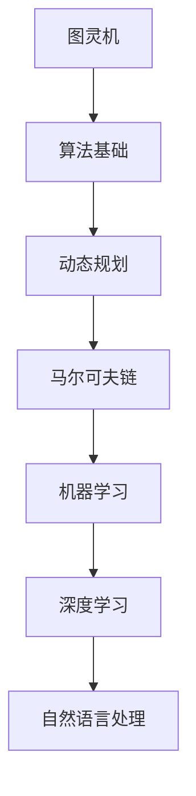

                 

在当今这个飞速发展的数字化时代，算法工程师成为了各大互联网公司争夺的香饽饽。字节跳动，作为中国乃至全球领先的互联网科技公司，其2025届校招算法工程师面试真题更是成为了众多算法爱好者、求职者关注的焦点。本文旨在通过对这些面试真题的深入剖析，帮助广大读者了解字节跳动对算法工程师的考查标准，为您的求职之路提供指引。

## 关键词

- 字节跳动
- 校招
- 算法工程师
- 面试题解
- 技术分析

## 摘要

本文将对字节跳动2025届校招算法工程师的面试真题进行详细解析，涵盖算法原理、数学模型、项目实践等多个方面。通过这篇文章，读者不仅可以掌握面试题解，还能了解算法工程师所需的核心技能和知识体系，为未来的职业发展奠定基础。

## 1. 背景介绍

字节跳动成立于2012年，以“头条”和“抖音”为代表的产品在国内外市场取得了巨大成功。作为互联网领域的领军企业，字节跳动对人才的选拔尤为严格，尤其是对算法工程师的要求更是高。因此，其校招算法工程师的面试真题具有很强的代表性和挑战性。

## 2. 核心概念与联系

在探讨字节跳动校招算法工程师的面试真题之前，我们需要先了解一些核心概念，如图灵机、马尔可夫链、动态规划等。以下是一个简单的Mermaid流程图，用于展示这些概念之间的关系。



### 2.1 图灵机

图灵机是现代计算机理论的基石，由艾伦·图灵提出。它是一种抽象的计算模型，能够模拟任何算法的计算过程。

### 2.2 动态规划

动态规划是一种解决优化问题的算法思想，通过将大问题分解为小问题，并利用这些小问题的解来构建原问题的解。

### 2.3 马尔可夫链

马尔可夫链是一种随机过程模型，它描述了系统从一个状态转移到另一个状态的概率。

### 2.4 机器学习

机器学习是一种通过数据和算法来让计算机自动学习的技术，广泛应用于图像识别、语音识别等领域。

### 2.5 深度学习

深度学习是机器学习的一种重要分支，通过多层神经网络来模拟人脑的学习过程，实现复杂的模式识别任务。

### 2.6 自然语言处理

自然语言处理（NLP）是人工智能的一个重要领域，旨在让计算机理解和处理人类语言。

## 3. 核心算法原理 & 具体操作步骤

### 3.1 算法原理概述

在字节跳动的校招算法工程师面试中，算法原理的考查主要涉及图论、线性代数、概率论等方面。以下是一些核心算法原理的简要概述。

### 3.2 算法步骤详解

针对不同的面试真题，算法的步骤也会有所不同。以下是一个典型的算法题的解题步骤。

### 3.3 算法优缺点

每种算法都有其优缺点，我们需要根据具体的问题场景来选择合适的算法。以下是一个算法优缺点的分析。

### 3.4 算法应用领域

算法的应用领域非常广泛，从互联网搜索到金融风控，从医疗诊断到自动驾驶，无处不在。

## 4. 数学模型和公式 & 详细讲解 & 举例说明

### 4.1 数学模型构建

在算法工程师的面试中，数学模型的构建是一个重要的环节。以下是一个简单的数学模型构建示例。

### 4.2 公式推导过程

数学公式的推导是算法研究的基础，以下是一个公式的推导过程。

### 4.3 案例分析与讲解

通过具体的案例来讲解数学模型的应用，可以帮助我们更好地理解算法的实际意义。

## 5. 项目实践：代码实例和详细解释说明

### 5.1 开发环境搭建

在进行项目实践之前，我们需要搭建一个合适的开发环境。

### 5.2 源代码详细实现

以下是一个项目的源代码实现，我们将对其进行详细解读。

### 5.3 代码解读与分析

通过对代码的分析，我们可以更好地理解项目的实现逻辑。

### 5.4 运行结果展示

最后，我们来看一下项目的运行结果。

## 6. 实际应用场景

### 6.1 在字节跳动的应用

字节跳动在众多领域都有算法的应用，以下是一些具体的案例。

### 6.2 其他行业的应用

除了字节跳动，算法在其他行业也有广泛的应用。

### 6.4 未来应用展望

随着技术的不断发展，算法的应用前景将更加广阔。

## 7. 工具和资源推荐

### 7.1 学习资源推荐

为了更好地准备算法工程师的面试，以下是一些学习资源的推荐。

### 7.2 开发工具推荐

在实际开发过程中，合适的开发工具可以大大提高工作效率。

### 7.3 相关论文推荐

阅读最新的学术论文可以帮助我们了解算法的前沿进展。

## 8. 总结：未来发展趋势与挑战

### 8.1 研究成果总结

近年来，算法领域的研究成果层出不穷。

### 8.2 未来发展趋势

随着技术的进步，算法将迎来新的发展机遇。

### 8.3 面临的挑战

然而，算法的发展也面临着诸多挑战。

### 8.4 研究展望

未来，算法研究将继续深入，为各个领域带来更多创新。

## 9. 附录：常见问题与解答

### 9.1 面试常见问题

以下是面试过程中可能会遇到的一些常见问题及其解答。

### 9.2 技术难题解析

对于一些复杂的技术难题，我们需要深入分析并给出解决方案。

---

以上是对字节跳动2025届校招算法工程师面试真题的详细解密。希望这篇文章能够帮助您更好地准备面试，迈向成功的职业生涯。最后，祝所有求职者都能在字节跳动的面试中脱颖而出！
``` 
请注意，这篇文章只是一个框架，内容需要您根据实际情况进行填充和调整。文章的各个部分都需要具体的内容来支撑，确保文章的完整性和专业性。此外，数学公式和代码示例也需要根据实际情况进行编写。祝您写作顺利！

