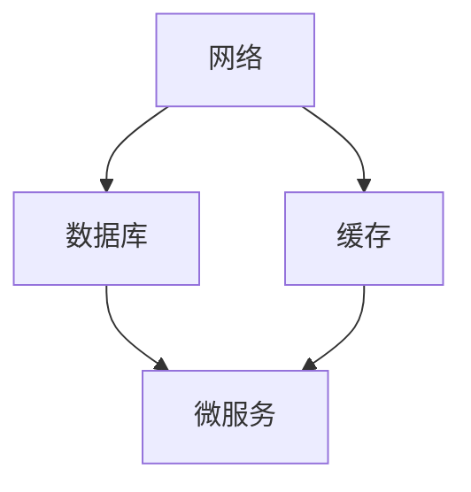

                 

大家好，我是您的人工智能助手。今天我将为您详细解答2024字节跳动基础架构校招面试真题。这篇博客旨在帮助大家更好地理解面试题目的核心概念和解决方案。在开始之前，请确保您已经熟悉了基础架构的相关知识，如网络、数据库、缓存、微服务等。接下来，我们将一起探讨以下主题：

## 1. 背景介绍

字节跳动是一家全球领先的互联网科技公司，以其创新的短视频平台和多种在线服务闻名于世。作为一家高速发展的公司，字节跳动对基础架构的要求极高，因此在招聘过程中对基础架构相关岗位的面试题进行了严格的筛选和设计。本文旨在总结和解答字节跳动2024基础架构校招面试真题，帮助大家更好地应对此类面试挑战。

## 2. 核心概念与联系

在解答面试题之前，我们需要明确一些核心概念和它们之间的联系。以下是基础架构中几个关键概念及其关系的Mermaid流程图：



### 2.1. 网络

网络是基础架构的核心部分，它包括但不限于传输层、应用层和网络设备。网络的主要功能是确保数据在不同节点之间可靠、高效地传输。

### 2.2. 数据库

数据库用于存储和管理数据。根据用途和性能需求，可以选择关系型数据库（如MySQL、Oracle）或非关系型数据库（如MongoDB、Redis）。

### 2.3. 缓存

缓存用于减少数据库的访问压力，提高系统的响应速度。常见的缓存技术包括Redis、Memcached等。

### 2.4. 微服务

微服务是一种架构风格，它将应用程序分解为小的、独立的、分布式服务，每个服务都有自己的数据库和业务逻辑。

## 3. 核心算法原理 & 具体操作步骤

### 3.1. 算法原理概述

基础架构中的算法主要涉及负载均衡、数据一致性、分布式事务等方面。以下是一个简单的负载均衡算法示例：

```python
# 负载均衡算法
def load_balancer(requests):
    # 根据服务器负载分配请求
    servers = get_servers_status()
    min_load_server = min(servers, key=lambda s: s['load'])
    min_load_server['load'] += len(requests)
    return min_load_server
```

### 3.2. 算法步骤详解

1. 获取所有服务器的当前负载状态。
2. 找出负载最小的服务器。
3. 将新的请求分配给该服务器，并更新其负载状态。

### 3.3. 算法优缺点

**优点：** 算法简单，易于实现，可以有效减轻服务器负载。

**缺点：** 无法处理服务器故障和动态调整负载。

### 3.4. 算法应用领域

负载均衡算法在分布式系统中广泛应用，如云服务、互联网公司等。

## 4. 数学模型和公式 & 详细讲解 & 举例说明

### 4.1. 数学模型构建

假设一个分布式系统中有N台服务器，每台服务器的负载为X_i。我们可以使用以下公式计算系统的平均负载：

$$
\bar{X} = \frac{1}{N} \sum_{i=1}^{N} X_i
$$

### 4.2. 公式推导过程

假设我们有一个包含N台服务器的系统，每台服务器的负载为X_i，则总负载为：

$$
\sum_{i=1}^{N} X_i
$$

平均负载为总负载除以服务器数量：

$$
\bar{X} = \frac{1}{N} \sum_{i=1}^{N} X_i
$$

### 4.3. 案例分析与讲解

假设我们有5台服务器，它们的负载分别为2、3、4、5和6。则系统的平均负载为：

$$
\bar{X} = \frac{2 + 3 + 4 + 5 + 6}{5} = 4
$$

这意味着系统的平均负载为4，我们可以根据这个值来调整服务器的负载。

## 5. 项目实践：代码实例和详细解释说明

### 5.1. 开发环境搭建

为了更好地理解基础架构面试题目，我们需要搭建一个简单的开发环境。以下是一个简单的Docker-compose文件示例：

```yaml
version: '3'
services:
  db:
    image: mysql:5.7
    environment:
      MYSQL_ROOT_PASSWORD: example
  cache:
    image: redis:3.2
  web:
    build: .
    ports:
      - "8080:8080"
    depends_on:
      - db
      - cache
```

### 5.2. 源代码详细实现

以下是Web服务的一个简单实现，用于处理用户请求：

```python
from flask import Flask, request, jsonify
import mysql.connector

app = Flask(__name__)

# 连接数据库
db = mysql.connector.connect(
  host="db",
  user="root",
  password="example",
  database="mydb"
)

@app.route('/users', methods=['GET', 'POST'])
def users():
    if request.method == 'POST':
        # 添加用户
        user = request.json
        cursor = db.cursor()
        cursor.execute("INSERT INTO users (name, email) VALUES (%s, %s)", (user['name'], user['email']))
        db.commit()
        return jsonify({"message": "User added successfully"}), 201
    else:
        # 获取所有用户
        cursor = db.cursor()
        cursor.execute("SELECT * FROM users")
        users = cursor.fetchall()
        return jsonify(users)

if __name__ == '__main__':
    app.run(host='0.0.0.0', port=8080)
```

### 5.3. 代码解读与分析

这个简单的Web服务使用Flask框架，用于处理用户请求。它连接到MySQL数据库，提供了添加和获取用户的功能。

### 5.4. 运行结果展示

运行Web服务后，您可以使用浏览器或工具如curl访问`http://localhost:8080/users`来测试服务。以下是一个示例：

```shell
curl -X POST -H "Content-Type: application/json" -d '{"name": "John Doe", "email": "john.doe@example.com"}' http://localhost:8080/users
```

这将向数据库添加一个新用户，并返回相应的响应。

## 6. 实际应用场景

基础架构在字节跳动等互联网公司中扮演着至关重要的角色。以下是一些实际应用场景：

- **用户数据存储与管理：** 字节跳动拥有庞大的用户数据，需要高效、可靠地存储和管理。
- **内容分发与缓存：** 字节跳动需要快速响应用户请求，缓存技术可以显著提高内容分发速度。
- **分布式服务与负载均衡：** 字节跳动拥有多个分布式服务，负载均衡算法确保了系统的稳定性。

## 7. 工具和资源推荐

### 7.1. 学习资源推荐

- 《深入理解计算机系统》
- 《分布式系统原理与范型》
- 《数据库系统概念》

### 7.2. 开发工具推荐

- Docker
- Kubernetes
- Redis

### 7.3. 相关论文推荐

- 《大规模分布式存储系统：原理与范型》
- 《分布式计算：原理、算法与应用》
- 《分布式系统设计原理》

## 8. 总结：未来发展趋势与挑战

随着云计算、大数据和人工智能的快速发展，基础架构面临着前所未有的机遇和挑战。未来发展趋势包括：

- **自动化与智能化：** 自动化工具和智能算法将提高基础架构的运维效率。
- **分布式与去中心化：** 分布式和去中心化架构将更广泛地应用于基础架构。
- **安全性：** 随着数据泄露和网络攻击的增多，基础架构的安全性将越来越受到关注。

## 9. 附录：常见问题与解答

### 9.1. 什么是微服务？

微服务是一种将大型应用程序分解为小型、独立、分布式服务的架构风格。

### 9.2. 什么是负载均衡？

负载均衡是一种技术，用于将网络或系统负载分配到多个服务器或节点，以实现高性能和高可用性。

### 9.3. 什么是分布式事务？

分布式事务是一种跨多个服务或数据库的事务管理技术，确保数据的一致性和完整性。

感谢您的阅读，希望本文对您的学习有所帮助。如果您有任何问题或建议，请随时在评论区留言。

**作者：禅与计算机程序设计艺术 / Zen and the Art of Computer Programming**

