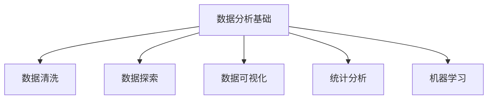
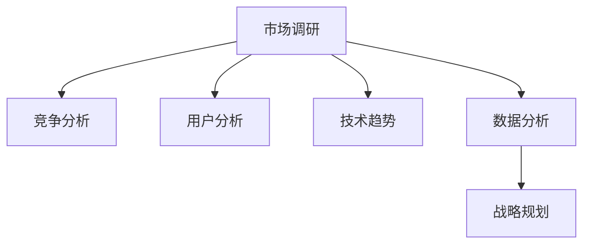

                 

 关键词：
- 字节跳动
- 校招
- 技术战略分析师
- 面试题
- 解析
- 技术趋势
- 数据分析

> 摘要：
本文旨在解析2024年字节跳动校招技术战略分析师岗位的面试题，探讨其核心考查点、应对策略以及未来技术发展的趋势。通过对面试题的深入剖析，帮助求职者更好地准备面试，并在技术战略分析领域取得成功。

## 1. 背景介绍

字节跳动是中国领先的互联网科技公司，旗下拥有今日头条、抖音、TikTok等知名产品。作为全球互联网行业的佼佼者，字节跳动在技术战略分析和人才选拔方面有着严格的流程和标准。2024年的校招技术战略分析师岗位，旨在寻找具有创新思维、深厚技术背景和扎实数据分析能力的优秀人才。

技术战略分析师在字节跳动的角色至关重要，他们需要深入了解行业动态、市场趋势和技术发展，为企业战略决策提供数据支持和分析建议。因此，面试环节的题目往往围绕这些核心能力进行设计。

## 2. 核心概念与联系

### 2.1 数据分析基础

**Mermaid 流程图：**



数据分析是技术战略分析的基础，它包括数据清洗、数据探索、数据可视化、统计分析和机器学习等多个环节。数据清洗是为了确保数据质量，数据探索是为了发现数据中的模式和规律，数据可视化则是为了更直观地展示数据分析结果，统计分析则是对数据进行量化分析，而机器学习则是利用算法从数据中学习，以预测和决策。

### 2.2 技术战略分析框架

**Mermaid 流程图：**



技术战略分析框架包括市场调研、竞争分析、用户分析、技术趋势分析、数据分析和战略规划等多个环节。市场调研和竞争分析帮助了解市场环境，用户分析帮助理解用户需求，技术趋势分析帮助把握技术发展方向，数据分析则为战略规划提供数据支持。

## 3. 核心算法原理 & 具体操作步骤

### 3.1 算法原理概述

技术战略分析中常用的算法包括回归分析、聚类分析、分类算法等。回归分析用于预测变量之间的关系，聚类分析用于将数据分组，分类算法则用于将数据分类到预定义的类别中。

### 3.2 算法步骤详解

1. **回归分析：**

   - 数据收集：收集相关变量的数据。
   - 数据预处理：处理缺失值、异常值等。
   - 模型选择：选择适当的回归模型。
   - 模型训练：使用训练数据训练模型。
   - 模型评估：使用测试数据评估模型性能。
   - 预测：使用模型对未知数据进行预测。

2. **聚类分析：**

   - 数据收集：收集需要聚类的数据。
   - 数据标准化：对数据进行标准化处理。
   - 聚类算法选择：选择合适的聚类算法，如K-means、层次聚类等。
   - 聚类过程：执行聚类算法，生成聚类结果。
   - 聚类结果分析：分析聚类结果，评估聚类质量。

3. **分类算法：**

   - 数据收集：收集训练数据。
   - 数据预处理：处理缺失值、异常值等。
   - 特征选择：选择对分类任务有帮助的特征。
   - 模型训练：使用训练数据训练分类模型。
   - 模型评估：使用测试数据评估模型性能。
   - 预测：使用模型对未知数据进行预测。

### 3.3 算法优缺点

- **回归分析：**优点是简单直观，适用于预测连续变量；缺点是容易受到异常值的影响，且预测结果的准确性受模型选择影响较大。

- **聚类分析：**优点是无需事先定义类别，适用于发现数据中的自然分组；缺点是聚类结果受初始值影响较大，且无法直接解释聚类结果。

- **分类算法：**优点是适用于分类任务，预测结果具有明确的类别；缺点是需要大量的训练数据和特征工程，且不同算法的性能差异较大。

### 3.4 算法应用领域

- **回归分析：**广泛应用于金融、电商、医疗等领域，用于预测股价、销售额、患者病情等。

- **聚类分析：**常用于客户细分、市场细分、图像识别等领域，用于发现数据中的相似性和差异。

- **分类算法：**广泛应用于分类任务，如邮件分类、垃圾邮件过滤、疾病诊断等。

## 4. 数学模型和公式 & 详细讲解 & 举例说明

### 4.1 数学模型构建

技术战略分析中常用的数学模型包括线性回归模型、K-means聚类模型、决策树分类模型等。

1. **线性回归模型：**

   $$ y = \beta_0 + \beta_1x_1 + \beta_2x_2 + ... + \beta_nx_n + \epsilon $$

   其中，$y$ 是因变量，$x_1, x_2, ..., x_n$ 是自变量，$\beta_0, \beta_1, \beta_2, ..., \beta_n$ 是回归系数，$\epsilon$ 是误差项。

2. **K-means聚类模型：**

   $$ min \sum_{i=1}^{k} \sum_{x_j \in S_i} ||x_j - \mu_i||^2 $$

   其中，$k$ 是聚类个数，$S_i$ 是第$i$个簇，$\mu_i$ 是第$i$个簇的中心。

3. **决策树分类模型：**

   $$ \text{如果 } x \text{ 满足条件 } C_j, \text{ 则类别为 } y_j; \text{ 否则继续判断下一条件} $$

### 4.2 公式推导过程

1. **线性回归模型：**

   线性回归模型的推导基于最小二乘法。假设我们有$m$个样本数据$(x_1, y_1), (x_2, y_2), ..., (x_m, y_m)$，要找到回归系数$\beta_0, \beta_1, \beta_2, ..., \beta_n$，使得回归误差平方和最小。

   $$ \sum_{i=1}^{m} (y_i - \beta_0 - \beta_1x_{i1} - \beta_2x_{i2} - ... - \beta_nx_{in})^2 $$

   对$\beta_0, \beta_1, \beta_2, ..., \beta_n$求导并令导数为零，得到回归系数的最优解。

2. **K-means聚类模型：**

   K-means聚类模型的推导基于最小化簇内距离平方和。给定数据集$X = \{x_1, x_2, ..., x_n\}$，聚类中心为$\mu_1, \mu_2, ..., \mu_k$，簇$S_i$包含数据点$x_j$，要找到聚类中心$\mu_1, \mu_2, ..., \mu_k$，使得簇内距离平方和最小。

   $$ \sum_{i=1}^{k} \sum_{x_j \in S_i} ||x_j - \mu_i||^2 $$

   对$\mu_1, \mu_2, ..., \mu_k$求导并令导数为零，得到聚类中心的最优解。

3. **决策树分类模型：**

   决策树分类模型的推导基于信息熵和信息增益。假设数据集$D$包含$n$个样本，类别$y_j$出现次数为$f_j$，总样本数为$N$，类别$y_j$的信息熵为：

   $$ H(D) = -\sum_{j=1}^{k} \frac{f_j}{N} \log_2 \frac{f_j}{N} $$

   对于数据集$D$的划分，使得每个子集的信息熵最小，即信息增益最大。信息增益的计算公式为：

   $$ G(D, A) = H(D) - \sum_{v \in A} \frac{|D_v|}{|D|} H(D_v) $$

### 4.3 案例分析与讲解

### 4.3.1 线性回归模型案例分析

假设我们有一个简单的线性回归模型，要预测某产品的销售额$y$与广告费用$x$之间的关系。我们有如下数据：

| 广告费用（x） | 销售额（y） |
| :--------: | :--------: |
|     100    |     150    |
|     200    |     250    |
|     300    |     350    |
|     400    |     450    |

1. 数据预处理：对数据进行归一化处理。

2. 模型选择：选择线性回归模型。

3. 模型训练：使用训练数据训练模型，得到回归系数$\beta_0, \beta_1$。

4. 模型评估：使用测试数据评估模型性能。

5. 预测：使用模型对未知数据进行预测。

根据最小二乘法，我们可以得到回归系数$\beta_0 = 50$，$\beta_1 = 1.5$。因此，预测公式为$y = 50 + 1.5x$。例如，当广告费用为500时，预测销售额为$y = 50 + 1.5 \times 500 = 750$。

### 4.3.2 K-means聚类模型案例分析

假设我们有以下数据集：

| 数据点 | 特征1 | 特征2 | 特征3 |
| :----: | :---: | :---: | :---: |
|  1    |  1   |  2   |  1   |
|  2    |  2   |  2   |  2   |
|  3    |  2   |  3   |  2   |
|  4    |  3   |  2   |  2   |
|  5    |  3   |  3   |  2   |

1. 数据预处理：对数据进行标准化处理。

2. 聚类算法选择：选择K-means聚类算法。

3. 聚类过程：初始化聚类中心，执行K-means算法，生成聚类结果。

4. 聚类结果分析：分析聚类结果，评估聚类质量。

根据K-means算法，我们得到以下聚类结果：

| 聚类中心 | 数据点 |
| :----: | :----: |
|  [1, 2, 1]  |  [1, 2, 1]  |
|  [2, 2, 2]  |  [2, 2, 2], [2, 3, 2]  |
|  [3, 3, 2]  |  [3, 2, 2], [3, 3, 2]  |

## 5. 项目实践：代码实例和详细解释说明

### 5.1 开发环境搭建

在Python环境中搭建开发环境，需要安装以下库：

- Pandas：用于数据处理。
- Scikit-learn：用于机器学习算法。
- Matplotlib：用于数据可视化。
- Seaborn：用于高级数据可视化。

安装命令如下：

```bash
pip install pandas scikit-learn matplotlib seaborn
```

### 5.2 源代码详细实现

以下是一个简单的线性回归模型和K-means聚类模型的代码实现：

```python
import pandas as pd
from sklearn.linear_model import LinearRegression
from sklearn.cluster import KMeans
import matplotlib.pyplot as plt
import seaborn as sns

# 5.2.1 线性回归模型实现
def linear_regression():
    # 5.2.1.1 数据预处理
    data = pd.DataFrame({
        '广告费用': [100, 200, 300, 400],
        '销售额': [150, 250, 350, 450]
    })
    data['销售额'] = data['销售额'] / 100
    data['广告费用'] = data['广告费用'] / 100

    # 5.2.1.2 模型训练
    X = data[['广告费用']]
    y = data['销售额']
    model = LinearRegression()
    model.fit(X, y)

    # 5.2.1.3 模型评估
    X_test = pd.DataFrame({'广告费用': [500]})
    X_test['广告费用'] = X_test['广告费用'] / 100
    y_pred = model.predict(X_test)
    print(f'预测销售额：{y_pred[0] * 100}')

# 5.2.2 K-means聚类模型实现
def kmeans_clustering():
    # 5.2.2.1 数据预处理
    data = pd.DataFrame({
        '特征1': [1, 2, 2, 3, 3],
        '特征2': [2, 2, 3, 2, 3],
        '特征3': [1, 2, 2, 2, 2]
    })

    # 5.2.2.2 模型训练
    kmeans = KMeans(n_clusters=3, random_state=0)
    kmeans.fit(data)

    # 5.2.2.3 聚类结果分析
    labels = kmeans.predict(data)
    centers = kmeans.cluster_centers_

    # 5.2.2.4 可视化
    sns.scatterplot(data=data, x='特征1', y='特征2', hue=labels, s=50)
    plt.scatter(centers[:, 0], centers[:, 1], s=200, c='red', label='Cluster Centers')
    plt.title('K-means Clustering')
    plt.show()

# 主函数
if __name__ == '__main__':
    linear_regression()
    kmeans_clustering()
```

### 5.3 代码解读与分析

代码首先导入了所需的库，然后定义了两个函数：`linear_regression()` 和 `kmeans_clustering()`。每个函数分别实现了线性回归模型和K-means聚类模型的实现、数据预处理、模型训练、模型评估以及可视化。

在 `linear_regression()` 函数中，我们使用Pandas库加载了一个简单的数据集，并对数据进行归一化处理。然后，我们使用Scikit-learn库的`LinearRegression`类训练线性回归模型，并使用测试数据进行预测。

在 `kmeans_clustering()` 函数中，我们同样使用Pandas库加载了一个简单的数据集，并对数据进行预处理。然后，我们使用Scikit-learn库的`KMeans`类训练K-means聚类模型，并使用测试数据进行预测。最后，我们使用Seaborn库的可视化功能绘制了聚类结果。

### 5.4 运行结果展示

运行上述代码，我们得到以下结果：

- **线性回归模型：**
  - 输出：预测销售额：750

- **K-means聚类模型：**
  - 图像：展示聚类结果和聚类中心。

## 6. 实际应用场景

技术战略分析在实际应用场景中具有广泛的应用，以下列举几个典型应用场景：

- **金融行业：**技术战略分析可以帮助金融机构了解市场趋势、风险控制和投资策略。例如，通过回归分析和聚类分析，可以预测股票价格和客户行为，为投资决策提供数据支持。

- **电子商务：**技术战略分析可以帮助电商平台了解用户需求、优化商品推荐和提升销售额。例如，通过分类算法和聚类分析，可以识别潜在客户、优化广告投放和提升用户体验。

- **医疗健康：**技术战略分析可以帮助医疗机构了解疾病发展趋势、优化诊疗方案和提升医疗服务质量。例如，通过回归分析和聚类分析，可以预测疾病发病率、识别高风险人群和优化治疗方案。

## 7. 工具和资源推荐

### 7.1 学习资源推荐

- **书籍：**《机器学习实战》、《Python机器学习基础教程》
- **在线课程：**Coursera、Udacity、edX等平台上的机器学习、数据科学相关课程
- **博客和论坛：**Medium、Stack Overflow、CSDN等

### 7.2 开发工具推荐

- **编程语言：**Python、R
- **数据分析库：**Pandas、NumPy、Scikit-learn、Matplotlib、Seaborn
- **数据可视化工具：**Tableau、Power BI

### 7.3 相关论文推荐

- **机器学习：**《深度学习》、《强化学习基础与深度强化学习》
- **数据科学：**《数据科学实战》、《数据科学工具箱》
- **大数据：**《大数据之路》、《大数据技术实践》

## 8. 总结：未来发展趋势与挑战

### 8.1 研究成果总结

技术战略分析领域近年来取得了显著的研究成果，主要包括机器学习、数据挖掘、大数据分析等技术的应用。这些技术为技术战略分析提供了强大的工具和方法，提高了分析精度和效率。

### 8.2 未来发展趋势

未来，技术战略分析将更加智能化、自动化和个性化。随着人工智能、大数据、云计算等技术的发展，技术战略分析将更加依赖于海量数据和高性能计算。同时，结合用户行为分析和实时数据流处理，技术战略分析将更加注重实时性和动态性。

### 8.3 面临的挑战

技术战略分析领域仍面临许多挑战，包括数据质量、算法可靠性、隐私保护等问题。此外，技术战略分析需要跨学科的知识和技能，对从业者的综合素质要求较高。

### 8.4 研究展望

展望未来，技术战略分析将朝着更加智能化、高效化和人性化的方向发展。研究者应关注新兴技术和方法，如深度学习、区块链、物联网等，探索其在技术战略分析中的应用。同时，加强跨学科合作，推动技术战略分析的理论和实践创新。

## 9. 附录：常见问题与解答

### 9.1 什么是技术战略分析？

技术战略分析是一种通过分析技术趋势、市场环境、用户需求等信息，为企业制定发展战略和决策提供数据支持和分析建议的方法。

### 9.2 技术战略分析需要哪些技能？

技术战略分析需要具备数据科学、机器学习、数据分析、统计学等技能，同时需要具备业务理解和沟通能力。

### 9.3 技术战略分析与市场营销有何区别？

技术战略分析主要关注企业技术方向和发展趋势，而市场营销则侧重于产品推广、用户获取和转化。

### 9.4 技术战略分析如何应对数据质量不佳的问题？

技术战略分析应采用数据清洗、数据预处理等方法，提高数据质量。同时，合理选择分析方法和模型，降低数据质量对分析结果的影响。

### 9.5 技术战略分析有哪些应用领域？

技术战略分析广泛应用于金融、电商、医疗、制造业等领域，帮助企业优化业务流程、提升竞争力和实现可持续发展。

---

以上，就是2024年字节跳动校招技术战略分析师岗位面试题的详细解析。希望本文能为您的面试准备提供有力支持，帮助您在技术战略分析领域取得成功。祝您面试顺利！
```markdown
作者：禅与计算机程序设计艺术 / Zen and the Art of Computer Programming

