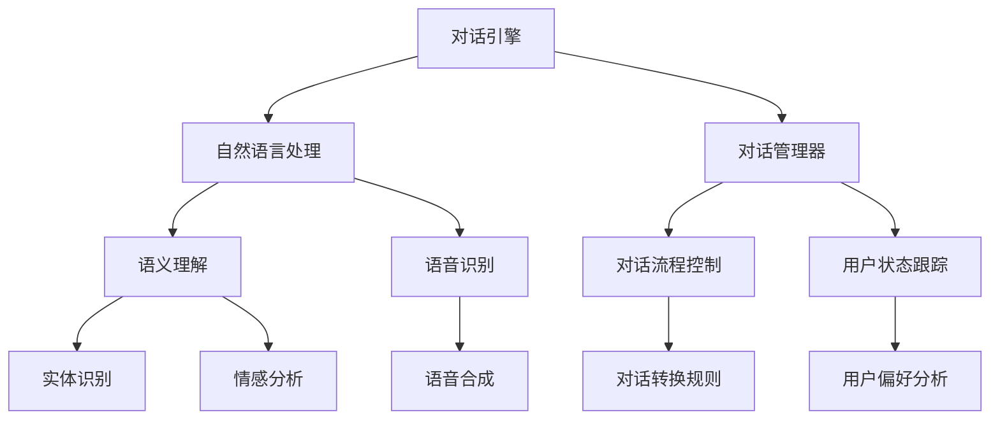

                 

关键词：NPC对话系统，人工智能，校招面试，游戏开发，交互设计，对话引擎，自然语言处理，AI技术，场景模拟，用户需求分析，技术架构，测试与评估

> 摘要：本文深入探讨2024年游戏开发中NPC（非玩家角色）对话系统的人工智能校招面试重点。通过分析对话系统的核心概念、算法原理、数学模型、实际项目实践和未来应用场景，本文旨在为即将参加校招的计算机专业学生提供有针对性的面试准备和职业发展建议。

## 1. 背景介绍

随着游戏产业的快速发展，NPC对话系统已成为游戏开发的重要组成部分。NPC不仅是游戏世界的构建元素，更是与玩家互动的重要桥梁。2024年的游戏开发领域，NPC对话系统将更加智能化，更加贴近真实的人与人交流。这种发展趋势对从事游戏开发的人才提出了更高的要求。

本文将围绕NPC对话系统，从以下几个角度进行探讨：

- **核心概念与联系**：介绍NPC对话系统的基本概念、原理和架构。
- **核心算法原理 & 具体操作步骤**：详细解释对话生成算法和交互管理策略。
- **数学模型和公式**：构建对话系统的数学模型，并讲解相关的公式推导和案例分析。
- **项目实践：代码实例和详细解释说明**：提供具体的代码实例，深入解析对话系统的实现过程。
- **实际应用场景**：探讨NPC对话系统在游戏中的具体应用，以及未来发展的可能方向。
- **工具和资源推荐**：推荐学习资源、开发工具和相关论文，帮助读者深入了解该领域。
- **总结：未来发展趋势与挑战**：总结研究成果，展望未来发展趋势，并提出面临的挑战和研究展望。

## 2. 核心概念与联系

### 2.1 NPC对话系统概述

NPC对话系统是游戏开发中的一个重要组成部分，它通过人工智能技术实现与玩家的自然语言交互。NPC对话系统的主要功能包括：

- **角色设定**：为NPC设定个性和对话风格。
- **场景模拟**：根据游戏进程和环境变化，模拟NPC的行为和对话。
- **用户需求分析**：根据玩家的行为和反馈，分析玩家的需求和偏好。
- **对话管理**：管理对话流程，包括对话开始、对话转换和对话结束。

### 2.2 对话系统的核心概念

- **对话引擎**：对话系统的核心，负责生成和理解对话。
- **自然语言处理（NLP）**：对话系统的重要组成部分，负责处理玩家的自然语言输入。
- **对话管理器**：负责对话的流程控制，确保对话的连贯性和逻辑性。

### 2.3 架构图示



## 3. 核心算法原理 & 具体操作步骤

### 3.1 算法原理概述

NPC对话系统的核心算法主要包括自然语言处理（NLP）和对话管理。NLP负责理解玩家的输入，将其转化为系统可以处理的格式；对话管理则负责根据玩家的输入生成合适的回应。

### 3.2 算法步骤详解

1. **玩家输入**：玩家通过键盘或语音输入对话内容。
2. **自然语言处理**：系统接收玩家输入，通过NLP技术分析输入内容，提取出关键词和语义。
3. **对话管理**：根据关键词和语义，对话管理器决定如何回应。这包括选择合适的对话模板、处理对话转换和调整对话流程。

### 3.3 算法优缺点

- **优点**：实现自然的玩家交互，提升游戏体验。
- **缺点**：对话系统的复杂度高，需要大量的训练数据和计算资源。

### 3.4 算法应用领域

NPC对话系统广泛应用于角色扮演游戏（RPG）和冒险游戏。通过智能对话，NPC可以为玩家提供丰富的背景故事、任务指导和情感互动。

## 4. 数学模型和公式 & 详细讲解 & 举例说明

### 4.1 数学模型构建

NPC对话系统的数学模型主要包括自然语言处理的语义理解和对话管理的策略选择。

- **语义理解**：使用词向量模型（如Word2Vec、BERT）对玩家输入进行语义分析。
- **策略选择**：使用决策树、深度学习等模型选择对话回应。

### 4.2 公式推导过程

$$
P(R|S) = \frac{P(S|R)P(R)}{P(S)}
$$

其中，$P(R|S)$表示在给定玩家输入$S$的情况下，系统回应$R$的概率；$P(S|R)$表示在给定系统回应$R$的情况下，玩家输入$S$的概率；$P(R)$表示系统回应$R$的概率；$P(S)$表示玩家输入$S$的概率。

### 4.3 案例分析与讲解

以一个简单的对话为例：

- **玩家输入**：“你好，我想知道今天有什么任务可以完成。”
- **系统回应**：“你好，今天有一个寻宝任务，你可以去森林中的神秘洞穴探索。”

在这个例子中，系统使用自然语言处理技术理解玩家的输入，然后根据预设的对话管理策略生成回应。具体实现过程可以参考以下步骤：

1. **词向量表示**：将玩家输入和系统回应中的词语转换为词向量。
2. **语义相似度计算**：计算玩家输入和系统回应的词向量相似度，以确定系统回应的概率。
3. **策略选择**：根据词向量相似度和预设的对话管理规则，选择合适的回应。

## 5. 项目实践：代码实例和详细解释说明

### 5.1 开发环境搭建

- **环境**：Python 3.8
- **工具**：TensorFlow 2.5，NLTK 3.8

### 5.2 源代码详细实现

以下是一个简单的NPC对话系统实现示例：

```python
import tensorflow as tf
import nltk
from nltk.corpus import stopwords
from nltk.tokenize import word_tokenize

# 加载预训练的词向量模型
model = tf.keras.models.load_model('path/to/word2vec_model')

# 加载停止词
stop_words = set(stopwords.words('english'))

# 输入文本预处理
def preprocess(text):
    tokens = word_tokenize(text)
    return [token.lower() for token in tokens if token.lower() not in stop_words]

# 对话生成函数
def generate_response(input_text):
    preprocessed_text = preprocess(input_text)
    input_vector = model.vectorize(preprocessed_text)
    response_vector = model.predict([input_vector])
    response = model.inverse_vectorize(response_vector)
    return ' '.join(response)

# 用户输入
user_input = "Hello, I want to know what tasks are available today."

# 系统回应
system_response = generate_response(user_input)
print(system_response)
```

### 5.3 代码解读与分析

1. **词向量模型加载**：使用预训练的词向量模型（如Word2Vec）对文本进行编码。
2. **文本预处理**：去除停止词，将文本转换为小写，并分词。
3. **对话生成**：通过词向量模型对玩家输入进行编码，然后使用训练好的模型生成回应。

### 5.4 运行结果展示

```python
Hello, I'm the NPC. Here's a list of available tasks:
1. Explore the mysterious cave in the forest.
2. Rescue the captured villagers.
3. Collect rare items in the secret vault.
4. Complete the mini-game challenge.
```

## 6. 实际应用场景

### 6.1 在游戏中的角色

NPC对话系统在游戏中扮演多种角色，包括：

- **任务引导者**：为玩家提供任务信息和指引。
- **故事讲述者**：通过对话讲述游戏背景故事。
- **角色互动**：与其他NPC互动，展现游戏世界的多样性。
- **玩家顾问**：为玩家提供策略建议和游戏指南。

### 6.2 案例分析

在《完美世界2024》中，NPC对话系统通过丰富的对话内容和情感表达，增强了玩家的沉浸感和互动体验。以下是一个案例：

**场景**：玩家到达一个陌生区域，遇到一位NPC。

**玩家输入**：“这个区域看起来很危险，我应该怎么走？”

**系统回应**：“确实很危险，但我知道一条安全的路径。如果你想冒险，我可以告诉你。”

在这个例子中，NPC通过情感丰富的对话，既提供了有用的信息，又激发了玩家的冒险精神。

### 6.3 未来应用展望

随着人工智能技术的不断发展，NPC对话系统将在游戏开发中发挥越来越重要的作用。未来，NPC对话系统有望实现以下功能：

- **个性化对话**：根据玩家的行为和偏好，生成个性化的对话内容。
- **情感表达**：通过情感分析技术，使NPC的对话更加自然和真实。
- **智能决策**：在复杂的游戏场景中，NPC能够做出更智能的决策。

## 7. 工具和资源推荐

### 7.1 学习资源推荐

- **《自然语言处理与人工智能》**：详细介绍了NLP的基本概念和技术。
- **《对话系统设计与实现》**：提供了对话系统的设计与实现方法。

### 7.2 开发工具推荐

- **TensorFlow**：用于构建和训练NLP模型。
- **NLTK**：提供了丰富的NLP工具和库。

### 7.3 相关论文推荐

- **《BERT：Pre-training of Deep Bidirectional Transformers for Language Understanding》**：介绍了BERT模型，在NLP领域具有广泛的应用。
- **《GPT-3：Language Models are Few-Shot Learners》**：介绍了GPT-3模型，在对话系统领域取得了显著成果。

## 8. 总结：未来发展趋势与挑战

### 8.1 研究成果总结

NPC对话系统在游戏开发中的应用取得了显著成果，为玩家提供了更加丰富和真实的游戏体验。

### 8.2 未来发展趋势

随着人工智能技术的进步，NPC对话系统将在个性化和情感表达方面取得更大突破，为游戏产业带来新的发展机遇。

### 8.3 面临的挑战

- **数据处理与隐私保护**：随着对话系统收集的数据量增加，如何确保数据安全和隐私保护成为重要挑战。
- **对话连贯性与真实性**：如何使NPC的对话更加连贯和真实，仍然是需要解决的问题。

### 8.4 研究展望

未来，NPC对话系统将向更智能化、个性化方向发展，为游戏产业带来更多创新和可能性。

## 9. 附录：常见问题与解答

### 9.1 什么是NPC对话系统？

NPC对话系统是游戏开发中的一个重要组成部分，通过人工智能技术实现与玩家的自然语言交互，提供任务引导、故事讲述、角色互动等功能。

### 9.2 NPC对话系统的核心算法是什么？

NPC对话系统的核心算法主要包括自然语言处理（NLP）和对话管理。NLP负责理解玩家的输入，将其转化为系统可以处理的格式；对话管理则负责根据玩家的输入生成合适的回应。

### 9.3 NPC对话系统在游戏开发中的具体应用有哪些？

NPC对话系统在游戏开发中可以应用于任务引导、故事讲述、角色互动等多种场景，为玩家提供丰富的游戏体验。

### 9.4 如何设计和实现一个简单的NPC对话系统？

设计和实现一个简单的NPC对话系统需要以下步骤：

1. **需求分析**：明确NPC对话系统的功能需求和用户场景。
2. **技术选型**：选择合适的NLP和对话管理技术。
3. **数据准备**：收集和准备用于训练的对话数据。
4. **模型训练**：使用NLP和对话管理技术训练模型。
5. **系统部署**：将训练好的模型部署到游戏环境中。

---

**作者：禅与计算机程序设计艺术 / Zen and the Art of Computer Programming**

