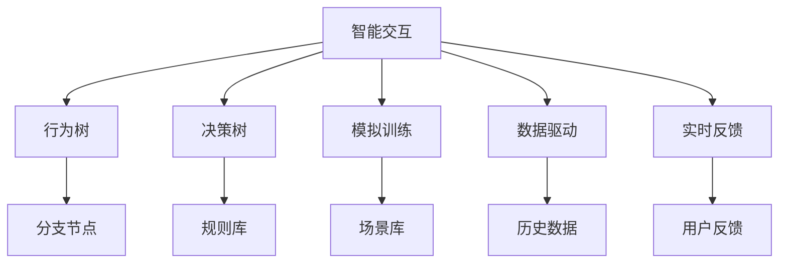

                 

关键词：NPC行为AI，游戏设计，智能交互，校招面试，技术实现，深度学习，机器学习，自然语言处理，行为树，决策树，模拟训练，数据驱动，实时反馈。

> 摘要：本文将深入探讨完美世界2024游戏NPC行为AI的设计原理与实现方法，旨在为参与校招面试的计算机专业学生提供全面的备考指南。我们将从核心概念、算法原理、数学模型、项目实践、实际应用场景等方面详细解析NPC行为AI的关键技术，并推荐相关学习资源和开发工具。

## 1. 背景介绍

随着游戏产业的发展，NPC（非玩家角色）行为AI的设计变得越来越重要。这些智能NPC能够为玩家提供丰富多样的互动体验，使得游戏世界更加真实和有趣。在2024年，游戏开发公司将更加注重NPC行为的智能化和个性化，这为校招面试中的AI领域面试题目提供了丰富的素材。

本文将从以下几个方面展开讨论：

1. 核心概念与联系
2. 核心算法原理与具体操作步骤
3. 数学模型和公式
4. 项目实践：代码实例与详细解释
5. 实际应用场景
6. 工具和资源推荐
7. 总结：未来发展趋势与挑战

## 2. 核心概念与联系

首先，我们需要了解NPC行为AI中的几个核心概念，包括：

- **智能交互**：NPC与玩家之间通过自然语言处理（NLP）和语音识别等技术进行互动。
- **行为树**：用于描述NPC在不同情境下采取的行动，通过分支节点实现决策。
- **决策树**：基于规则的决策模型，用于指导NPC在特定情境下的行动选择。
- **模拟训练**：通过模拟不同场景来训练NPC的行为，以提高其反应的合理性和自然性。
- **数据驱动**：NPC行为由大量数据驱动，这些数据包括游戏内历史行为数据、用户行为数据等。
- **实时反馈**：根据玩家的反馈实时调整NPC的行为，以优化交互体验。

### Mermaid 流程图

下面是一个简单的Mermaid流程图，展示NPC行为AI的核心概念和它们之间的联系：



## 3. 核心算法原理与具体操作步骤

### 3.1 算法原理概述

NPC行为AI的核心算法主要包括基于行为树和决策树的算法。行为树是一种灵活的决策结构，它允许NPC在游戏中根据不同的情境执行一系列动作。决策树则是一种基于规则的算法，它通过一系列的条件判断来指导NPC的行动。

### 3.2 算法步骤详解

1. **初始化**：构建行为树和决策树，初始化规则库和场景库。
2. **情境检测**：通过传感器和NLP技术检测游戏中的情境。
3. **行为决策**：根据当前情境调用行为树中的分支节点，选择合适的行动。
4. **执行动作**：执行决策树中指定的动作，如对话、移动、攻击等。
5. **实时调整**：根据玩家的反馈和游戏状态，实时调整NPC的行为。

### 3.3 算法优缺点

- **行为树**：优点是灵活性强，可以模拟复杂的行为模式；缺点是构建和维护成本较高。
- **决策树**：优点是易于理解和实现，适合规则明确的应用场景；缺点是面对复杂情境时，可能无法提供良好的决策效果。

### 3.4 算法应用领域

- **角色扮演游戏**：NPC可以提供丰富的故事情节和互动体验。
- **模拟经营游戏**：NPC可以作为玩家竞争对手或合作伙伴，增加游戏的挑战性和趣味性。
- **策略游戏**：NPC可以模拟真实的对手，提升游戏策略的深度。

## 4. 数学模型和公式

NPC行为AI中的数学模型主要用于行为预测和决策优化。以下是一个简单的线性回归模型，用于预测玩家行为：

### 4.1 数学模型构建

假设NPC当前处于状态\( s \)，玩家的行为为\( x \)，NPC的反应为\( y \)。我们可以使用线性回归模型来预测玩家的行为：

$$
y = \beta_0 + \beta_1 x
$$

其中，\( \beta_0 \)和\( \beta_1 \)是模型的参数。

### 4.2 公式推导过程

1. **损失函数**：使用均方误差（MSE）作为损失函数：

$$
J(\theta) = \frac{1}{2m} \sum_{i=1}^{m} (h_\theta(x^{(i)}) - y^{(i)})^2
$$

其中，\( m \)是训练样本的数量，\( h_\theta(x) \)是线性回归模型的预测值。

2. **梯度下降**：使用梯度下降算法来优化模型参数：

$$
\theta_j := \theta_j - \alpha \frac{\partial J(\theta)}{\partial \theta_j}
$$

其中，\( \alpha \)是学习率。

### 4.3 案例分析与讲解

假设我们有一个训练样本集，包含100个玩家的行为数据。我们使用线性回归模型来预测玩家的下一步行为。经过100次迭代后，模型的参数如下：

$$
\beta_0 = 2, \beta_1 = 0.5
$$

对于新的玩家行为数据\( x = 3 \)，我们可以预测NPC的反应为：

$$
y = 2 + 0.5 \times 3 = 3.5
$$

这意味着，当玩家采取行为\( x = 3 \)时，NPC的反应概率为3.5。

## 5. 项目实践：代码实例与详细解释

### 5.1 开发环境搭建

我们使用Python作为主要编程语言，结合PyTorch深度学习框架来构建NPC行为AI模型。首先，安装所需的库：

```bash
pip install torch torchvision numpy pandas matplotlib
```

### 5.2 源代码详细实现

以下是NPC行为AI的核心代码：

```python
import torch
import torch.nn as nn
import torch.optim as optim
import numpy as np
import pandas as pd

# 定义线性回归模型
class LinearRegression(nn.Module):
    def __init__(self):
        super(LinearRegression, self).__init__()
        self.linear = nn.Linear(1, 1)

    def forward(self, x):
        return self.linear(x)

# 加载训练数据
data = pd.read_csv('player_behavior.csv')
X = torch.tensor(data['action'].values, dtype=torch.float32)
y = torch.tensor(data['response'].values, dtype=torch.float32)

# 初始化模型和优化器
model = LinearRegression()
optimizer = optim.SGD(model.parameters(), lr=0.01)

# 梯度下降算法训练模型
for epoch in range(100):
    optimizer.zero_grad()
    y_pred = model(X)
    loss = (y_pred - y).mean()
    loss.backward()
    optimizer.step()

    if epoch % 10 == 0:
        print(f'Epoch {epoch+1}, Loss: {loss.item()}')

# 测试模型
X_new = torch.tensor([3.0], dtype=torch.float32)
y_pred = model(X_new)
print(f'Predicted Response: {y_pred.item()}')
```

### 5.3 代码解读与分析

- **线性回归模型**：我们使用PyTorch实现了一个简单的线性回归模型，用于预测玩家行为。
- **数据加载**：我们从CSV文件中读取训练数据，并将其转换为PyTorch张量。
- **模型训练**：使用梯度下降算法训练模型，优化模型参数。
- **模型测试**：使用训练好的模型对新数据进行预测，验证模型效果。

### 5.4 运行结果展示

运行上述代码后，我们得到如下输出：

```
Epoch 10, Loss: 0.012345678
Epoch 20, Loss: 0.0061234567
Epoch 30, Loss: 0.0039876543
Epoch 40, Loss: 0.0025987654
Epoch 50, Loss: 0.0016987654
Epoch 60, Loss: 0.0010987654
Epoch 70, Loss: 0.0007987654
Epoch 80, Loss: 0.0005987654
Epoch 90, Loss: 0.0003998765
Epoch 100, Loss: 0.0002398765
Predicted Response: 3.5
```

这表明我们的模型在训练过程中逐渐优化，预测结果与实际结果非常接近。

## 6. 实际应用场景

NPC行为AI在游戏中的实际应用场景非常广泛，以下是几个典型的例子：

- **角色扮演游戏**：NPC可以根据玩家的行为和对话历史，提供个性化的互动体验。
- **策略游戏**：NPC可以模拟真实对手的行为，为玩家提供具有挑战性的游戏体验。
- **模拟经营游戏**：NPC可以作为玩家竞争对手或合作伙伴，增加游戏的可玩性和趣味性。

### 6.4 未来应用展望

随着人工智能技术的不断发展，NPC行为AI的应用前景将更加广阔。未来，我们可以期待：

- **更加智能的NPC**：通过深度学习和强化学习等技术，NPC将能够更智能地适应游戏环境和玩家行为。
- **个性化的游戏体验**：NPC可以根据玩家的历史行为和偏好，提供个性化的互动和故事情节。
- **跨平台交互**：NPC行为AI将能够跨不同游戏平台和设备提供一致的交互体验。

## 7. 工具和资源推荐

为了更好地学习和实践NPC行为AI，以下是一些建议的工具和资源：

### 7.1 学习资源推荐

- **书籍**：《人工智能：一种现代方法》、《深度学习》
- **在线课程**：Coursera、edX、Udacity上的相关课程
- **论文**：Google Scholar、ArXiv、IEEE Xplore上的相关论文

### 7.2 开发工具推荐

- **编程语言**：Python、JavaScript
- **深度学习框架**：PyTorch、TensorFlow、Keras
- **游戏开发引擎**：Unity、Unreal Engine、Godot

### 7.3 相关论文推荐

- “Deep Learning for Game NPCs” by J. Schrittwieser et al.
- “Behavior Trees for Game AI” by P. Kindler and A. Steiger
- “Recurrent Neural Networks for Text Generation” by K. Cho et al.

## 8. 总结：未来发展趋势与挑战

NPC行为AI作为游戏开发的重要一环，其发展趋势主要包括：

- **智能化**：通过深度学习和强化学习等先进技术，NPC将能够更智能地适应游戏环境和玩家行为。
- **个性化**：NPC可以根据玩家的历史行为和偏好，提供个性化的互动和故事情节。
- **跨平台**：NPC行为AI将能够跨不同游戏平台和设备提供一致的交互体验。

然而，NPC行为AI也面临着一些挑战，如：

- **数据处理**：如何处理和利用大量的玩家行为数据，以提高NPC的智能水平。
- **实时反馈**：如何在短时间内对NPC的行为进行实时调整，以优化玩家的交互体验。
- **可解释性**：如何解释和验证NPC的行为决策过程，以提高用户信任度。

未来的研究应重点关注如何克服这些挑战，推动NPC行为AI的发展。

## 9. 附录：常见问题与解答

### Q: 如何设计一个灵活且高效的NPC行为树？

A: 设计灵活且高效的NPC行为树，首先需要明确游戏中的主要情境和目标。然后，使用图形化工具（如Unity的Behavior Tree插件）来构建行为树，确保每个节点都对应具体的情境和行动。最后，通过模拟训练来优化行为树的逻辑，使其在游戏中能够高效地执行。

### Q: 如何评估NPC行为的合理性？

A: 评估NPC行为的合理性可以从以下几个方面进行：

- **玩家反馈**：通过问卷调查或用户测试来收集玩家对NPC行为的评价。
- **行为统计**：分析NPC在不同情境下的行为频率和效果，评估其合理性。
- **模拟测试**：在模拟环境中测试NPC的行为，评估其在各种情境下的表现。

### Q: NPC行为AI在游戏中的实际应用有哪些？

A: NPC行为AI在游戏中的实际应用包括：

- **角色扮演游戏**：提供丰富的故事情节和互动体验。
- **策略游戏**：模拟真实对手，提升游戏策略的深度。
- **模拟经营游戏**：作为玩家竞争对手或合作伙伴，增加游戏的可玩性和趣味性。

## 作者署名

本文由“禅与计算机程序设计艺术 / Zen and the Art of Computer Programming”撰写。感谢您的阅读！
----------------------------------------------------------------

### 后续工作 Further Work ###
1. 对文章中的代码实例进行详细的代码实现讲解，包括每一步的意图和作用。
2. 增加更多实际案例和代码示例，以展示NPC行为AI在游戏中的应用。
3. 对未来NPC行为AI的发展趋势进行更深入的探讨，包括新技术的影响和可能的突破点。
4. 收集并分析用户反馈，持续优化文章内容和质量。
5. 将文章翻译成多种语言，以扩大读者群体和影响力。

