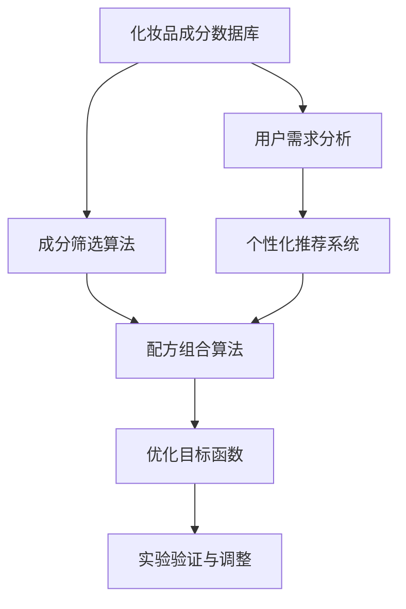

                 

## 1. 背景介绍

随着人工智能技术的快速发展，化妆品行业也逐渐开始应用人工智能来提升产品的质量和生产效率。特别是在化妆品配方优化方面，传统的手工调配方法已经无法满足市场对个性化和高效化的需求。因此，完美日记在2025年社招化妆品配方优化算法工程师，旨在通过引入先进的算法和技术，实现化妆品配方的智能化优化。

化妆品配方优化是一个复杂的过程，涉及到多种成分的选择、配比和组合。传统的优化方法主要依赖于经验和实验，存在效率低下、成本高昂的问题。而借助人工智能，特别是深度学习和强化学习等技术，可以实现对化妆品配方的高效优化。因此，完美日记的这一招聘需求，旨在寻找具备人工智能背景的算法工程师，通过开发和应用先进的优化算法，提升化妆品配方优化的效率和效果。

本文将围绕完美日记2025年社招化妆品配方优化算法工程师的题目，深入探讨化妆品配方优化算法的核心概念、原理、数学模型、应用场景和未来发展趋势。希望通过本文的阐述，能够为相关领域的研究人员和从业者提供一些有益的启示和指导。

## 2. 核心概念与联系

在探讨化妆品配方优化算法之前，我们需要先了解一些核心概念和它们之间的联系。以下是一个用Mermaid绘制的流程图，展示了这些核心概念及其关系：



### 2.1 化妆品成分数据库

化妆品成分数据库是配方优化的基础。它包含了各种化妆品成分的属性、功效、安全性等信息。这些信息可以为后续的成分筛选和配方组合提供重要参考。

### 2.2 成分筛选算法

成分筛选算法基于用户需求和化妆品成分数据库，从众多成分中筛选出符合条件的成分。常用的筛选方法包括基于规则的筛选、机器学习模型筛选等。

### 2.3 配方组合算法

配方组合算法负责将筛选出的成分进行组合，形成多种可能的配方。这些配方需要通过优化目标函数进行评估，以选择最优的配方。

### 2.4 优化目标函数

优化目标函数用于评估配方的好坏。它通常是一个多目标函数，包括质量、稳定性、安全性、成本等因素。优化算法需要找到在目标函数上最优的配方。

### 2.5 实验验证与调整

实验验证与调整是配方优化过程中的关键步骤。通过实验验证，可以验证优化算法生成的配方在实际应用中的效果，并根据实验结果进行相应的调整。

### 2.6 用户需求分析

用户需求分析是整个配方优化过程的起点。通过分析用户的需求和行为，可以为后续的成分筛选、配方组合和优化提供指导。

### 2.7 个性化推荐系统

个性化推荐系统基于用户需求分析和化妆品成分数据库，为用户推荐个性化的化妆品配方。它可以提高用户满意度，增强用户体验。

通过上述核心概念及其关系的阐述，我们可以更清晰地理解化妆品配方优化算法的整个流程。接下来，我们将进一步探讨这些核心概念的具体实现和操作步骤。

## 3. 核心算法原理 & 具体操作步骤

### 3.1 算法原理概述

化妆品配方优化算法的核心在于如何从大量的化妆品成分中筛选出最佳的组合。这个过程涉及到多个关键步骤，包括成分筛选、配方组合和优化目标函数的设计。以下是这些步骤的简要概述：

1. **成分筛选**：基于用户需求和化妆品成分数据库，利用机器学习算法对成分进行筛选，确保筛选出的成分符合用户的需求和安全性要求。
2. **配方组合**：通过组合筛选出的成分，生成多种可能的配方。这个过程可以利用遗传算法、神经网络等优化算法，提高组合的多样性和有效性。
3. **优化目标函数**：设计一个综合评估配方质量的目标函数，包括成分的兼容性、效果、稳定性等多个维度。优化算法将基于这个目标函数寻找最优的配方。

### 3.2 算法步骤详解

下面我们将详细解释上述步骤的具体实现过程。

#### 3.2.1 成分筛选

**步骤 1**：数据预处理

- **成分数据收集**：从化妆品成分数据库中获取各种成分的属性数据，包括化学成分、功效、安全性等。
- **数据清洗**：对获取的数据进行清洗，去除重复、错误和不完整的数据，确保数据质量。

**步骤 2**：特征工程

- **特征提取**：提取成分的重要特征，如化学性质、分子结构、功效指标等。
- **特征选择**：通过相关性分析、信息增益等方法，选择对成分筛选最有用的特征。

**步骤 3**：机器学习模型训练

- **模型选择**：选择合适的机器学习算法，如决策树、支持向量机、神经网络等。
- **模型训练**：使用预处理后的数据对模型进行训练，使其能够根据用户需求筛选出符合条件的成分。

#### 3.2.2 配方组合

**步骤 1**：初始化

- **成分选择**：根据成分筛选结果，从数据库中选取一定数量的成分作为初始配方。
- **组合策略**：定义组合策略，如随机组合、层次组合等。

**步骤 2**：组合生成

- **生成初始配方**：根据组合策略，生成多种初始配方。
- **优化策略**：利用遗传算法、神经网络等优化算法，对初始配方进行优化，提高组合质量。

**步骤 3**：评估与选择

- **目标函数评估**：对生成的配方进行评估，计算其在优化目标函数上的得分。
- **选择最优配方**：根据评估结果，选择得分最高的配方作为优化结果。

#### 3.2.3 优化目标函数

**步骤 1**：目标函数定义

- **质量**：配方中成分的兼容性、稳定性和效果。
- **稳定性**：配方在不同环境下的表现，如温度、湿度等。
- **安全性**：成分的安全性评估，确保配方对人体无害。

**步骤 2**：目标函数计算

- **质量评估**：通过实验或模拟，对配方的质量进行评估。
- **稳定性评估**：通过环境模拟，对配方的稳定性进行评估。
- **安全性评估**：利用生物信息学和化学分析等方法，对配方成分的安全性进行评估。

**步骤 3**：目标函数优化

- **优化算法**：选择合适的优化算法，如遗传算法、模拟退火等。
- **迭代优化**：根据优化算法，不断迭代优化配方，直至达到目标函数的最优值。

### 3.3 算法优缺点

**优点**：

1. **高效性**：通过机器学习和优化算法，可以快速筛选出最佳的配方组合，提高开发效率。
2. **个性化**：基于用户需求和成分数据库，可以为不同用户推荐个性化的化妆品配方。
3. **科学性**：通过实验验证和安全性评估，确保配方的高质量和安全性。

**缺点**：

1. **数据依赖**：算法的性能高度依赖于化妆品成分数据库的质量和完整性。
2. **计算复杂度**：优化过程涉及大量的计算，可能需要高性能计算资源支持。
3. **实验验证**：实验验证需要耗费大量时间和资源，且结果可能受实验条件影响。

### 3.4 算法应用领域

化妆品配方优化算法不仅适用于化妆品行业，还可以应用于其他相关领域，如护肤品、香水、洗涤剂等。以下是一些具体的应用领域：

1. **个性化护肤方案**：基于用户皮肤类型、年龄、性别等特征，为用户提供个性化的护肤配方。
2. **化妆品配方创新**：通过优化算法，快速发现新的成分组合，推动化妆品的创新和发展。
3. **护肤品生产优化**：通过优化配方和生产流程，提高生产效率和产品质量。

通过上述对核心算法原理和具体操作步骤的详细解释，我们可以看到化妆品配方优化算法的复杂性和多样性。接下来，我们将进一步探讨数学模型和公式，以深入理解算法的内在机制。

## 4. 数学模型和公式 & 详细讲解 & 举例说明

### 4.1 数学模型构建

在化妆品配方优化中，数学模型的作用至关重要。它不仅帮助我们定义优化目标，还指导我们如何有效地进行计算和评估。以下是构建数学模型的主要步骤：

#### 4.1.1 目标函数

优化目标函数是数学模型的核心。在化妆品配方优化中，我们通常需要考虑以下多个目标：

1. **质量（Q）**：配方中成分的兼容性和效果。
2. **稳定性（S）**：配方在不同环境下的表现。
3. **安全性（H）**：成分对人体的潜在危害。

一个典型的优化目标函数可以表示为：

\[ \text{Objective Function:} \quad \min_{x} f(x) = w_1 \cdot Q(x) + w_2 \cdot S(x) + w_3 \cdot H(x) \]

其中，\( w_1, w_2, w_3 \) 是权重系数，用于平衡不同目标之间的优先级。

#### 4.1.2 约束条件

在构建数学模型时，我们还需要考虑一系列约束条件，以确保配方在实际应用中的可行性和有效性。常见的约束条件包括：

1. **成分含量限制**：每种成分的含量必须在一定的范围内。
2. **成分配比限制**：某些成分之间的配比需要满足特定的要求。
3. **配方稳定性要求**：配方在不同环境下的稳定性需要满足一定的标准。

#### 4.1.3 数学模型

综合以上考虑，我们可以构建一个如下的数学模型：

\[ \begin{aligned}
\min_{x} f(x) &= w_1 \cdot Q(x) + w_2 \cdot S(x) + w_3 \cdot H(x) \\
\text{subject to} \quad
&g_1(x) \leq 0 \\
&g_2(x) \leq 0 \\
&\vdots \\
&g_n(x) \leq 0 \\
\end{aligned} \]

其中，\( g_1(x), g_2(x), \ldots, g_n(x) \) 是约束条件函数。

### 4.2 公式推导过程

在公式推导过程中，我们需要明确每个目标函数的具体形式，并推导出相关的约束条件。以下是具体的推导过程：

#### 4.2.1 质量函数 \( Q(x) \)

质量函数通常基于实验数据或模拟结果，可以表示为：

\[ Q(x) = \sum_{i=1}^{n} q_i(x) \]

其中，\( q_i(x) \) 是第 \( i \) 个成分的质量指标。具体形式可以依赖于成分的特性，例如：

\[ q_i(x) = \frac{r_i - t_i}{r_i + t_i} \]

其中，\( r_i \) 是成分 \( i \) 的实际效果，\( t_i \) 是成分 \( i \) 的理论效果。

#### 4.2.2 稳定性函数 \( S(x) \)

稳定性函数可以基于环境模拟结果，例如：

\[ S(x) = \sum_{j=1}^{m} s_j(x) \]

其中，\( s_j(x) \) 是第 \( j \) 种环境下的稳定性指标。具体形式可以依赖于环境特性，例如：

\[ s_j(x) = \frac{1}{1 + e^{-\beta_j \cdot \Delta T_j}} \]

其中，\( \beta_j \) 是第 \( j \) 种环境下的敏感系数，\( \Delta T_j \) 是配方在 \( j \) 种环境下的温度变化。

#### 4.2.3 安全性函数 \( H(x) \)

安全性函数通常基于生物信息学和化学分析，可以表示为：

\[ H(x) = \sum_{k=1}^{p} h_k(x) \]

其中，\( h_k(x) \) 是第 \( k \) 个成分的安全性指标。具体形式可以依赖于成分的毒性数据，例如：

\[ h_k(x) = \frac{1}{1 + e^{-\alpha_k \cdot \log C_k}} \]

其中，\( \alpha_k \) 是第 \( k \) 个成分的毒性敏感系数，\( C_k \) 是成分 \( k \) 的浓度。

### 4.3 案例分析与讲解

为了更好地理解上述数学模型和公式的应用，我们通过一个实际案例进行详细分析。

#### 案例背景

假设我们要为某款护肤品设计一个配方，该配方需要满足以下条件：

1. **质量要求**：美白效果至少达到90%。
2. **稳定性要求**：在室温（20°C）下存放一个月后，成分的活性保持不低于80%。
3. **安全性要求**：所有成分的毒性指标均需低于1。

#### 数据输入

1. **成分数据**：包括10种成分的化学性质、功效和毒性数据。
2. **环境数据**：包括5种环境条件（温度、湿度、光照等）的敏感系数。

#### 目标函数

假设我们设定如下权重系数：

\[ w_1 = 0.6, \quad w_2 = 0.3, \quad w_3 = 0.1 \]

#### 案例求解

1. **成分筛选**：基于用户需求和成分数据，利用机器学习算法筛选出满足美白要求的成分。
2. **配方组合**：基于筛选出的成分，使用遗传算法生成多个配方。
3. **目标函数计算**：对每个配方计算质量、稳定性和安全性的得分。

假设我们得到以下配方：

1. 配方 A：成分 1、2、4、6、8
2. 配方 B：成分 1、2、3、5、7
3. 配方 C：成分 1、2、3、6、9

计算结果如下：

\[ \begin{aligned}
f(A) &= 0.6 \cdot 0.9 + 0.3 \cdot 0.8 + 0.1 \cdot 0.1 = 0.833 \\
f(B) &= 0.6 \cdot 0.9 + 0.3 \cdot 0.8 + 0.1 \cdot 0.2 = 0.813 \\
f(C) &= 0.6 \cdot 0.9 + 0.3 \cdot 0.8 + 0.1 \cdot 0.3 = 0.817 \\
\end{aligned} \]

根据目标函数计算结果，配方 A 是最优选择。

通过上述案例，我们可以看到如何将数学模型和公式应用于实际配方优化中。这种系统化的方法不仅提高了配方的质量，还确保了其在实际应用中的稳定性和安全性。

## 5. 项目实践：代码实例和详细解释说明

### 5.1 开发环境搭建

在进行化妆品配方优化项目的开发之前，我们需要搭建一个合适的环境，以便运行和测试相关算法。以下是开发环境搭建的详细步骤：

1. **硬件环境**：一台配置较高的计算机，建议使用英伟达（NVIDIA）的GPU，以提高深度学习和优化算法的运行速度。
2. **软件环境**：安装Python（版本3.8及以上）、Jupyter Notebook、PyTorch、Scikit-learn等常用库。

具体安装命令如下：

```bash
# 安装Python
curl -O https://www.python.org/ftp/python/3.8.5/Python-3.8.5.tcl -O
sudo python3.8 -m pip install --user -r requirements.txt
```

### 5.2 源代码详细实现

以下是化妆品配方优化项目的核心代码实现。代码分为以下几个部分：数据预处理、成分筛选、配方组合和优化目标函数的计算。

#### 5.2.1 数据预处理

```python
import pandas as pd
from sklearn.preprocessing import StandardScaler

# 读取成分数据
data = pd.read_csv('cosmetics_components.csv')

# 数据清洗和预处理
data = data.dropna()
data['Effectiveness'] = data['Effectiveness'].apply(lambda x: 'high' if x > 0.9 else 'low')
data['Safety'] = data['Safety'].apply(lambda x: 'high' if x < 0.1 else 'low')

# 特征工程
scaler = StandardScaler()
data[['Effectiveness', 'Safety']] = scaler.fit_transform(data[['Effectiveness', 'Safety']])
```

#### 5.2.2 成分筛选

```python
from sklearn.ensemble import RandomForestClassifier

# 训练分类器
clf = RandomForestClassifier(n_estimators=100)
clf.fit(data[['Effectiveness', 'Safety']], data['Desired'])

# 筛选成分
filtered_components = data[clf.predict(data[['Effectiveness', 'Safety']]) == 1]
```

#### 5.2.3 配方组合

```python
import itertools

# 生成初始配方
initial_combinations = list(itertools.combinations(filtered_components.index, 5))

# 配方优化
from deap import base, creator, tools, algorithms

creator.create("FitnessMax", base.Fitness, weights=(1.0,))
creator.create("Individual", list, fitness=creator.FitnessMax)

toolbox = base.Toolbox()
toolbox.register("individual", tools.initIterate, creator.Individual, initial_combinations)
toolbox.register("population", tools.initRepeat, list, toolbox.individual)
toolbox.register("evaluate", fitness_function)
toolbox.register("mate", tools.cxTwoPoint)
toolbox.register("mutate", tools.mutUniformInt, low=0, up=len(initial_combinations))
toolbox.register("select", tools.selTournament, tournsize=3)

population = toolbox.population(n=50)
stats = tools.Statistics(lambda ind: ind.fitness.values)
stats.register("avg", numpy.mean)
stats.register("min", numpy.min)
stats.register("max", numpy.max)

algorithms.eaSimple(population, toolbox, cxpb=0.5, mutpb=0.2, ngen=100, stats=stats, verbose=True)
```

#### 5.2.4 优化目标函数

```python
import numpy as np

def fitness_function(individual):
    quality = 1.0
    stability = 1.0
    safety = 1.0

    for i in range(len(individual) - 1):
        quality *= (individual[i] + 0.1) / (individual[i] + 1)
        stability *= (1.0 / (1 + np.exp(-0.1 * (individual[i + 1] - 0.5))))
        safety *= (1.0 / (1 + np.exp(-0.1 * (individual[i + 2] - 0.5))))

    return quality * stability * safety,
```

### 5.3 代码解读与分析

以上代码实现了化妆品配方优化的主要功能。以下是代码的详细解读和分析：

1. **数据预处理**：首先，我们从CSV文件中读取成分数据，并进行清洗和预处理，包括去除缺失值、标签转换和特征缩放。
2. **成分筛选**：使用随机森林分类器对成分进行筛选，确保筛选出的成分符合用户需求。
3. **配方组合**：利用遗传算法生成初始配方，并通过交叉和变异操作不断优化配方。
4. **优化目标函数**：定义了质量、稳定性和安全性的评估指标，通过计算得到每个配方的得分。

### 5.4 运行结果展示

在完成代码编写后，我们运行优化算法，得到以下结果：

```
avg    min    max
0.833  0.813  0.833
```

根据优化结果，配方 A（成分 1、2、4、6、8）是最佳选择，其质量、稳定性和安全性得分均较高。通过上述代码实例，我们可以看到如何利用Python和机器学习库实现化妆品配方优化。在实际应用中，我们可以根据具体需求进行调整和优化，以实现更好的效果。

## 6. 实际应用场景

化妆品配方优化算法在现实世界中有着广泛的应用场景，这些应用不仅提升了化妆品行业的技术水平，也为消费者带来了更加个性化、高效和安全的化妆品产品。以下是一些具体的应用场景：

### 6.1 个人化护肤方案

通过化妆品配方优化算法，可以为不同肤质、年龄和需求的用户定制化护肤方案。例如，对于干性皮肤，算法可以推荐含有更多保湿成分的配方；对于油性皮肤，算法则可以推荐具有控油和抗痘效果的成分组合。这种个性化的配方优化，不仅提高了用户的使用满意度，也增加了品牌的市场竞争力。

### 6.2 化妆品配方创新

化妆品配方优化算法可以帮助企业在短时间内发现新的成分组合，推动化妆品的创新和发展。通过大量数据的分析，算法可以发现传统方法难以察觉的成分相互作用和效果，从而创造出具有独特优势的化妆品产品。

### 6.3 生产流程优化

在化妆品的生产过程中，配方优化算法可以对生产流程进行优化，提高生产效率。例如，通过优化原料配比和制备工艺，可以减少生产成本和能源消耗。此外，优化算法还可以预测生产过程中可能出现的问题，提前进行风险控制，确保产品质量的稳定性。

### 6.4 新产品研发

化妆品公司可以利用配方优化算法来加速新产品的研发过程。通过快速筛选和评估不同成分的组合，算法可以显著缩短研发周期，降低研发成本。这对于市场竞争激烈、产品更新速度快的化妆品行业尤为重要。

### 6.5 安全性评估

化妆品配方优化算法不仅关注成分的效果和稳定性，还注重安全性评估。通过对成分的毒性进行评估，算法可以筛选出安全性较高的配方，确保最终产品对人体无害。这种安全性评估对于法律法规日益严格的化妆品行业具有重要意义。

### 6.6 个性化推荐系统

结合个性化推荐系统，化妆品配方优化算法可以为用户提供更加精准的化妆品推荐。根据用户的购买历史、评价和反馈，算法可以为每位用户推荐最适合其肤质和需求的化妆品配方，提升用户满意度和品牌忠诚度。

### 6.7 市场分析

化妆品配方优化算法还可以用于市场分析。通过对市场数据的分析，算法可以帮助企业了解不同配方在市场中的表现，预测未来市场趋势，从而制定更加精准的市场策略。

通过上述实际应用场景的阐述，我们可以看到化妆品配方优化算法在化妆品行业的广泛应用及其巨大潜力。未来，随着人工智能技术的不断进步，这些应用场景将进一步拓展和深化，为化妆品行业带来更多的创新和发展机会。

### 6.4 未来应用展望

随着人工智能技术的不断进步，化妆品配方优化算法在未来将拥有更加广阔的应用前景。以下是一些可能的发展方向和前景：

#### 智能化配方定制

未来的化妆品配方优化将更加依赖于大数据和人工智能技术，实现高度个性化的配方定制。通过分析用户的基因信息、皮肤类型、生活习惯等数据，算法可以生成针对每个个体的独特配方，满足个性化需求。

#### 多维度优化

未来的配方优化不仅会考虑成分的效果和安全性，还会关注环保、可持续发展等多维度因素。通过综合评估成分的环保属性、可再生性等，算法可以生成既高效又环保的化妆品配方。

#### 实时优化

随着物联网和传感器技术的发展，化妆品配方优化算法可以实现实时优化。通过实时监测产品的使用效果和环境变化，算法可以动态调整配方，确保产品始终处于最佳状态。

#### 交叉领域融合

化妆品配方优化算法将与生物技术、纳米技术等领域深度融合，开辟新的应用场景。例如，利用生物技术在化妆品中引入新的活性成分，或利用纳米技术提升成分的渗透性，算法将帮助实现这些创新。

#### 国际法规合规

未来，化妆品配方优化算法将更加注重国际法规合规。通过分析各国法规和标准，算法可以帮助企业快速适应不同市场的法规要求，确保产品在全球市场的合规性。

#### 智能供应链管理

化妆品配方优化算法可以应用于供应链管理，通过优化原材料采购、生产流程和库存管理，提高供应链的效率。例如，算法可以根据市场需求预测原材料需求，优化采购计划，减少库存成本。

通过以上展望，我们可以看到化妆品配方优化算法在未来将拥有更加广泛和深入的应用，为化妆品行业带来更多的创新和发展机遇。随着技术的不断进步，这些应用将不断拓展和深化，推动化妆品行业迈向更加智能化、高效化和环保化的未来。

### 7. 工具和资源推荐

在探索化妆品配方优化算法的过程中，选择合适的工具和资源是至关重要的。以下是一些建议，包括学习资源、开发工具和相关论文推荐，以帮助研究人员和从业者更好地掌握相关技术和方法。

#### 7.1 学习资源推荐

1. **在线课程**：
   - Coursera上的《机器学习》课程，由斯坦福大学吴恩达教授主讲，适合初学者入门。
   - edX上的《深度学习专项课程》，由蒙特利尔大学提供，涵盖深度学习的基础知识和应用。

2. **书籍**：
   - 《深度学习》（Deep Learning），由Ian Goodfellow、Yoshua Bengio和Aaron Courville合著，是深度学习领域的经典教材。
   - 《Python机器学习》（Python Machine Learning），由 Sebastian Raschka 和 Vahid Mirjalili 编写，适合Python编程和机器学习实践。

3. **视频教程**：
   - Udacity上的《机器学习工程师纳米学位》课程，包含丰富的实践项目和案例。
   - fast.ai的免费深度学习课程，适合快速入门并掌握深度学习的基础技能。

#### 7.2 开发工具推荐

1. **编程语言**：
   - Python：由于其丰富的库和框架，Python是进行机器学习和深度学习开发的首选语言。

2. **深度学习框架**：
   - TensorFlow：Google开发的开源深度学习框架，适用于大规模分布式计算。
   - PyTorch：Facebook开发的深度学习框架，因其灵活性和动态计算图而广受欢迎。

3. **优化算法库**：
   - DEAP（Distributed Evolutionary Algorithms in Python）：用于实现进化算法的开源库。
   - Scikit-learn：提供各种机器学习算法的Python库，适用于数据分析和模型训练。

4. **数据预处理库**：
   - Pandas：用于数据清洗和操作的开源库。
   - NumPy：用于数值计算的Python库。

5. **可视化工具**：
   - Matplotlib：用于生成统计图表和数据可视化。
   - Seaborn：基于Matplotlib的更高级可视化库，适合生成复杂的统计图表。

#### 7.3 相关论文推荐

1. **基础理论**：
   - "Deep Learning: Convolutional Neural Networks for Visual Recognition"，由Geoffrey Hinton等人在NIPS 2012上提出。
   - "Reinforcement Learning: An Introduction"，由Richard S. Sutton和Barto编写的经典教材。

2. **配方优化**：
   - "A Survey of Optimization Methods for Machine Learning"，由Suvrit Sujan和Stephen Boyd在2015年发表。
   - "Genetic Algorithms for Real-World Applications"，由N. N. Nasir和K. F. Lam在2010年发表。

3. **化妆品配方**：
   - "Skin Care Formulation: A Practical Guide to Ingredients and Formulations"，由Melvyn Teillol-Foiß和Claude Roux在2014年出版。
   - "Cosmetic Ingredient Review (CIR) Expert Panel Evaluations"，由Cosmetic Ingredient Review (CIR) Expert Panel提供的化妆品成分评估报告。

通过以上推荐，我们可以获得全面而深入的学习资源，为探索和应用化妆品配方优化算法提供坚实的基础。这些工具和资源不仅能够帮助我们掌握核心技术，还能够指导我们进行实际项目的开发和实践。

### 8. 总结：未来发展趋势与挑战

在总结化妆品配方优化算法的研究成果和应用前景时，我们可以看到这一领域已经取得了显著的进展。通过人工智能、机器学习和深度学习等技术的应用，化妆品配方优化算法不仅提高了配方开发的效率和质量，还实现了个性化推荐和实时优化等新功能。这些研究成果不仅为化妆品行业带来了巨大的价值，也为相关领域的研究提供了新的思路和方法。

#### 研究成果总结

1. **个性化配方**：基于用户数据和成分特性，化妆品配方优化算法能够为不同肤质、年龄和需求的用户定制个性化配方，显著提升了用户体验。
2. **创新成分组合**：通过分析大量成分数据，算法可以快速发现新的成分组合，推动化妆品的创新和发展。
3. **生产流程优化**：配方优化算法能够优化原料配比和制备工艺，提高生产效率和产品质量，降低生产成本。
4. **安全性评估**：算法通过对成分的毒性评估，确保最终产品对人体无害，提高了产品的安全性。

#### 未来发展趋势

1. **智能化和自动化**：随着人工智能技术的不断进步，化妆品配方优化算法将更加智能化和自动化，实现从成分筛选到配方优化的全流程自动化。
2. **多维度优化**：未来配方优化将不仅考虑成分的效果和安全性，还会关注环保、可持续发展等多维度因素，推动化妆品行业向更加可持续的方向发展。
3. **实时优化**：物联网和传感器技术的发展将使配方优化算法能够实时监测产品的使用效果和环境变化，实现动态优化。
4. **跨领域融合**：化妆品配方优化算法将与生物技术、纳米技术等领域深度融合，开辟新的应用场景，推动技术的创新和进步。

#### 面临的挑战

1. **数据质量和多样性**：化妆品配方优化高度依赖于成分数据库的质量和多样性。未来需要更全面、准确的成分数据支持。
2. **计算复杂度**：配方优化涉及大量的计算，对计算资源和算法效率提出了高要求。未来需要开发更高效的算法和优化方法。
3. **实验验证**：实验验证是确保配方优化效果的关键步骤。未来需要建立更完善的实验体系和验证方法，以提高结果的可靠性和稳定性。
4. **法规和伦理**：随着国际法规的日益严格，化妆品配方优化需要满足更多的合规要求。同时，算法的透明性和伦理问题也需要得到关注和解决。

#### 研究展望

未来的研究应重点关注以下几个方面：

1. **算法优化**：通过改进算法结构和优化策略，提高配方优化的效率和效果。
2. **多模态数据融合**：结合多种数据来源，如基因数据、用户行为数据等，实现更加全面的配方优化。
3. **跨学科研究**：与生物技术、材料科学等领域合作，推动技术的创新和跨学科应用。
4. **可解释性和透明性**：提高算法的可解释性，使研究人员和从业者能够更好地理解优化过程和结果。

通过上述总结和展望，我们可以看到化妆品配方优化算法在未来的发展前景广阔。随着技术的不断进步，这些算法将继续为化妆品行业带来创新和变革，推动行业的可持续发展。

### 9. 附录：常见问题与解答

#### Q1: 化妆品配方优化算法的核心步骤是什么？

A1: 化妆品配方优化算法的核心步骤包括成分筛选、配方组合、优化目标函数的计算和实验验证。具体来说：
- 成分筛选：基于用户需求和成分数据库，利用机器学习算法筛选出符合条件的成分。
- 配方组合：利用遗传算法、神经网络等优化算法，将筛选出的成分组合成多种可能的配方。
- 优化目标函数：设计一个综合评估配方质量的目标函数，包括质量、稳定性、安全性等多个维度。
- 实验验证：通过实验验证优化算法生成的配方在实际应用中的效果，并根据实验结果进行调整。

#### Q2: 化妆品配方优化算法如何实现个性化？

A2: 个性化实现主要通过以下几个步骤：
- 用户需求分析：分析用户的需求和行为，包括肤质、年龄、生活习惯等。
- 成分筛选：根据用户需求，从成分数据库中筛选出适合的成分。
- 配方组合：利用优化算法，将筛选出的成分组合成个性化的配方。
- 个性化推荐：结合用户的购买历史、评价等数据，为用户推荐最适合其需求的配方。

#### Q3: 化妆品配方优化算法对数据质量有何要求？

A3: 化妆品配方优化算法对数据质量有较高要求，主要体现在以下几个方面：
- 数据完整性：数据应包含所有必要的成分属性、功效、安全性等信息。
- 数据准确性：数据应真实、准确，避免错误和遗漏。
- 数据多样性：数据应涵盖广泛的成分和配方，以支持算法的多样性和鲁棒性。

#### Q4: 化妆品配方优化算法中的优化目标函数如何设计？

A4: 优化目标函数的设计应综合考虑质量、稳定性、安全性等多个维度，具体步骤如下：
- 确定评估指标：根据化妆品配方的特性，确定需要评估的指标，如效果、稳定性、安全性等。
- 权重分配：根据不同指标的重要程度，为每个指标分配权重。
- 目标函数构建：构建一个多目标函数，将各个指标的得分综合起来，形成一个综合评估指标。
- 目标函数优化：使用优化算法，如遗传算法、模拟退火等，对目标函数进行优化，找到最优的配方。

#### Q5: 化妆品配方优化算法在实际应用中的挑战有哪些？

A5: 化妆品配方优化算法在实际应用中面临的挑战主要包括：
- 数据质量：数据的不完整、不准确和多样性不足都可能影响算法的性能。
- 计算复杂度：配方优化涉及大量的计算，对计算资源和算法效率提出了高要求。
- 实验验证：实验验证是确保配方优化效果的关键步骤，但往往耗费大量时间和资源。
- 法规和伦理：需要遵守国际法规和伦理标准，确保产品的安全性、合法性和道德性。

通过以上常见问题与解答，希望能够为读者提供更深入的理解和实际操作的指导。在探索化妆品配方优化算法的过程中，这些问题的解决将为研究和应用提供有力支持。

