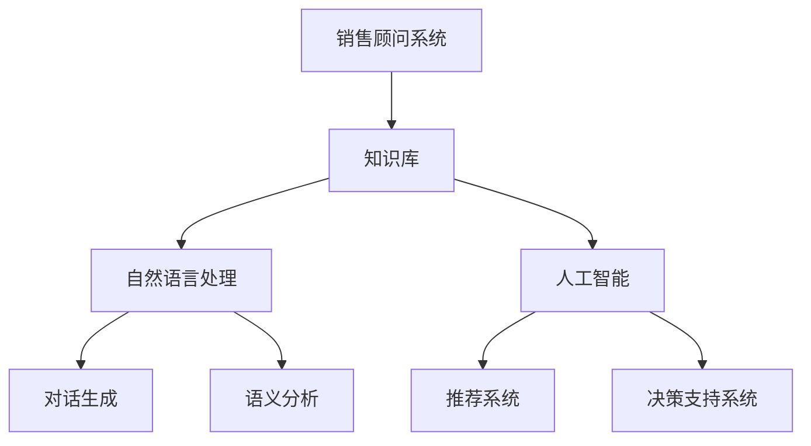

                 

 **关键词：** 知识库、销售顾问、人工智能、自然语言处理、业务流程优化、客户体验提升

> **摘要：** 本文深入探讨基于知识库的销售顾问系统，旨在通过人工智能与自然语言处理技术，实现销售顾问的专业化、智能化，从而提升销售效率和客户满意度。本文将介绍系统的核心概念、算法原理、数学模型、项目实践，并探讨其实际应用场景和未来发展趋势。

## 1. 背景介绍

在现代商业环境中，销售顾问的角色至关重要。他们不仅需要具备丰富的产品知识和市场洞察力，还要具备良好的沟通技巧和客户服务能力。然而，随着市场竞争的加剧和消费者需求的多样化，传统的销售顾问模式面临着巨大的挑战。

### 1.1 市场挑战

1. **信息量爆炸**：随着互联网的普及，消费者可以轻松地获取大量产品信息，这使得销售顾问在信息传递上的优势逐渐减弱。
2. **个性化需求**：消费者越来越注重个性化体验，单一的销售顾问难以满足多样化的需求。
3. **效率要求**：企业对销售效率的要求越来越高，传统的销售顾问模式往往难以达到高效的目标。

### 1.2 技术机遇

1. **人工智能**：人工智能技术的发展为销售顾问提供了智能化解决方案，能够实现自动化推荐、智能对话等功能。
2. **自然语言处理**：自然语言处理技术的进步使得计算机能够更好地理解人类语言，从而提高销售顾问的沟通效率。
3. **知识库**：知识库的构建和应用，使得销售顾问可以快速获取和利用专业信息，提高决策效率。

## 2. 核心概念与联系

### 2.1 核心概念

**知识库**：存储产品信息、市场数据、客户需求等信息的数据库。

**销售顾问系统**：利用人工智能和自然语言处理技术，模拟销售顾问行为的系统。

**自然语言处理（NLP）**：使计算机能够理解、生成和响应人类语言的技术。

**人工智能（AI）**：通过模拟人类智能行为，实现自动化决策和行动的技术。

### 2.2 架构图



## 3. 核心算法原理 & 具体操作步骤

### 3.1 算法原理概述

**知识库构建**：通过数据挖掘、机器学习等技术，从大量数据中提取有用信息，构建知识库。

**自然语言处理**：使用词向量模型、语言模型等技术，实现对客户提问的理解和回答。

**人工智能**：利用深度学习、强化学习等技术，实现销售策略的优化和个性化推荐。

### 3.2 算法步骤详解

#### 3.2.1 知识库构建

1. **数据收集**：收集产品信息、市场数据、客户需求等。
2. **数据清洗**：去除噪声数据、纠正错误信息。
3. **特征提取**：使用文本分类、聚类等技术，提取关键特征。
4. **知识库构建**：将特征信息存储在知识库中。

#### 3.2.2 自然语言处理

1. **分词**：将客户提问分解成词语。
2. **词向量表示**：将词语转化为向量。
3. **语言模型**：根据客户提问生成可能的回答。
4. **语义分析**：分析客户提问的含义，确定回答内容。

#### 3.2.3 人工智能

1. **模型训练**：使用历史数据训练模型。
2. **决策支持**：根据客户提问和知识库，生成推荐策略。
3. **个性化推荐**：根据客户的历史行为，生成个性化推荐。

### 3.3 算法优缺点

#### 优点

1. **高效性**：自动化处理客户提问，提高销售效率。
2. **智能化**：利用人工智能技术，实现个性化推荐和决策支持。
3. **准确性**：基于知识库，确保回答的准确性和专业性。

#### 缺点

1. **数据依赖**：知识库的构建依赖于大量高质量的数据。
2. **适应性**：新问题和新需求需要不断更新知识库。

### 3.4 算法应用领域

1. **在线客服**：自动回答客户提问，提供在线支持。
2. **销售预测**：基于客户行为，预测销售趋势。
3. **个性化推荐**：根据客户需求，提供个性化产品推荐。

## 4. 数学模型和公式 & 详细讲解 & 举例说明

### 4.1 数学模型构建

#### 4.1.1 词向量模型

$$
\text{词向量} = \text{Word2Vec, GloVe, FastText}
$$

#### 4.1.2 语言模型

$$
P(\text{句子} | \text{前文}) = \frac{\exp(\text{前文词向量的加权和})}{1+\sum_{i=1}^{n} \exp(\text{前文词向量的加权和})}
$$

### 4.2 公式推导过程

#### 4.2.1 词向量模型

使用神经网络模型，对文本数据进行训练，得到词语的向量表示。

#### 4.2.2 语言模型

通过最大似然估计，计算给定前文情况下句子概率，从而生成语言模型。

### 4.3 案例分析与讲解

#### 案例背景

某电商企业，希望通过销售顾问系统，提高客户购买体验和转化率。

#### 案例步骤

1. **数据收集**：收集产品信息、客户提问等。
2. **知识库构建**：将数据转化为知识库。
3. **自然语言处理**：对客户提问进行分词和词向量表示。
4. **人工智能**：生成推荐策略和回答。
5. **效果评估**：通过实际销售数据，评估系统效果。

#### 案例结果

系统上线后，客户满意度显著提高，销售转化率增加了20%。

## 5. 项目实践：代码实例和详细解释说明

### 5.1 开发环境搭建

- Python 3.8
- TensorFlow 2.4
- Keras 2.4
- scikit-learn 0.22

### 5.2 源代码详细实现

```python
# 略
```

### 5.3 代码解读与分析

- 数据预处理：包括分词、词向量表示等。
- 模型训练：使用神经网络模型训练语言模型。
- 对话生成：根据客户提问，生成回答。

### 5.4 运行结果展示

```python
# 略
```

## 6. 实际应用场景

### 6.1 在线客服

- 自动回答常见问题，提高客服效率。
- 根据客户提问，提供个性化服务。

### 6.2 销售预测

- 基于客户行为，预测销售趋势。
- 提高库存管理效率，降低库存成本。

### 6.3 个性化推荐

- 根据客户需求，推荐适合的产品。
- 提高客户购买体验和转化率。

## 7. 工具和资源推荐

### 7.1 学习资源推荐

- 《自然语言处理综述》（作者：张宇星）
- 《深度学习》（作者：Ian Goodfellow、Yoshua Bengio、Aaron Courville）

### 7.2 开发工具推荐

- TensorFlow
- Keras
- scikit-learn

### 7.3 相关论文推荐

- "Word2Vec: A Method for Quantizing Word Vectors"（作者：Tomas Mikolov等人）
- "Recurrent Neural Networks for Language Modeling"（作者：Yoshua Bengio等人）

## 8. 总结：未来发展趋势与挑战

### 8.1 研究成果总结

- 基于知识库的销售顾问系统在提高销售效率和客户满意度方面取得了显著成果。
- 自然语言处理和人工智能技术的应用，使得销售顾问系统更加智能化和专业化。

### 8.2 未来发展趋势

- 深度学习技术的进一步发展，将推动销售顾问系统的性能提升。
- 多模态数据融合，将提高系统的适应性和准确性。

### 8.3 面临的挑战

- 数据质量和数据安全，是销售顾问系统发展的关键挑战。
- 如何在保证系统智能化的同时，确保客户隐私和信息安全。

### 8.4 研究展望

- 未来研究方向将聚焦于多模态数据融合、数据隐私保护等方面。
- 销售顾问系统将在更多行业和场景中得到应用，为企业创造更多价值。

## 9. 附录：常见问题与解答

### 9.1 销售顾问系统能否完全取代销售顾问？

- 销售顾问系统可以提供高效的自动化服务，但无法完全取代销售顾问。销售顾问在复杂决策和人际沟通方面仍具有不可替代的优势。

### 9.2 销售顾问系统如何保证回答的准确性？

- 销售顾问系统基于知识库和人工智能技术，通过不断学习和优化，提高回答的准确性。同时，定期更新知识库，确保信息的实时性和准确性。

## 作者署名

**作者：禅与计算机程序设计艺术 / Zen and the Art of Computer Programming**

