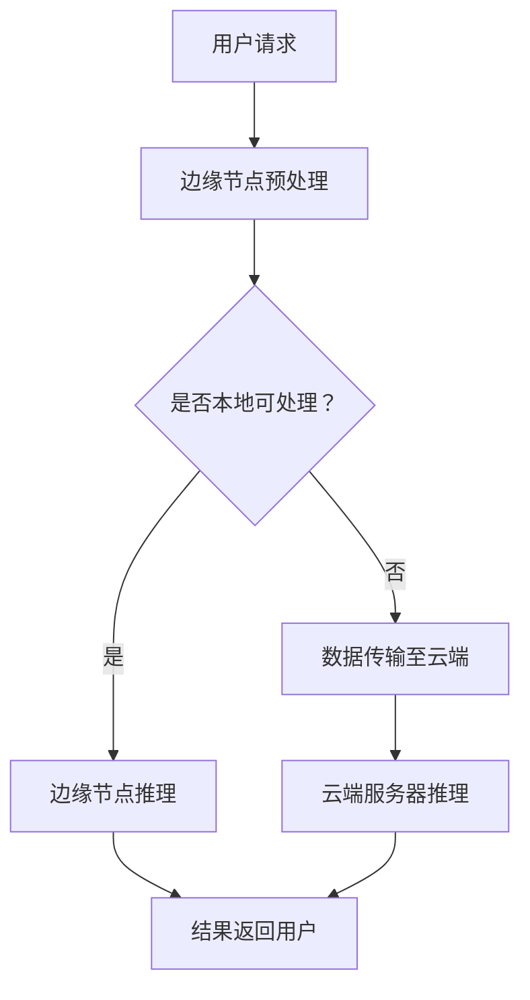

                 

关键词：实时AI推理、低延迟方案、Lepton AI、AI服务架构、边缘计算、硬件加速、神经网络编译器

> 摘要：本文探讨了实时AI推理服务的关键挑战，特别是低延迟的要求。介绍了Lepton AI如何通过创新的架构和技术手段，实现高效且低延迟的AI推理服务，为各种应用场景提供强大的支持。

## 1. 背景介绍

随着人工智能技术的快速发展，AI推理服务在许多领域得到了广泛应用。从自动驾驶到智能语音识别，从医疗诊断到金融分析，AI推理服务已经成为了现代社会不可或缺的一部分。然而，随着应用场景的复杂度和数据量的增加，如何实现高效且低延迟的AI推理服务，成为了亟待解决的问题。

在AI推理服务中，延迟是衡量服务性能的重要指标之一。对于实时性要求较高的应用，如自动驾驶和远程医疗，低延迟至关重要。延迟过高可能会导致安全隐患、用户体验差等问题。因此，设计一个低延迟的AI推理方案，是当前AI领域的热点研究方向。

本文将介绍Lepton AI的低延迟方案，分析其核心技术和实现原理，并通过实际案例展示其应用效果。希望本文能够为读者在实现实时AI推理服务时提供一些有价值的参考。

## 2. 核心概念与联系

### 2.1 实时AI推理

实时AI推理是指在短时间内对输入数据进行处理并返回结果的过程。实时性要求高，一般要求在毫秒级别内完成推理。实时AI推理的核心是算法效率和硬件性能的优化。

### 2.2 低延迟方案

低延迟方案是指通过一系列技术手段，如边缘计算、硬件加速等，降低AI推理服务的响应时间。低延迟方案的目标是在保证推理精度的基础上，尽可能缩短延迟。

### 2.3 Lepton AI架构

Lepton AI是一个基于边缘计算的AI推理服务框架，旨在提供低延迟、高效率的AI推理解决方案。其架构包括以下几个关键部分：

- 边缘节点：部署在离用户较近的边缘设备上，负责本地数据的预处理和推理。
- 云端服务器：负责大规模数据处理、模型训练和模型更新。
- 神经网络编译器：将高层的神经网络模型转换为适合边缘设备运行的低层代码。

### 2.4 Mermaid流程图

下面是一个简单的Mermaid流程图，展示Lepton AI的核心架构和数据处理流程：



## 3. 核心算法原理 & 具体操作步骤

### 3.1 算法原理概述

Lepton AI的低延迟方案主要基于以下三个方面：

1. **边缘计算**：通过将部分推理任务部署在边缘设备上，减少数据传输的延迟。
2. **硬件加速**：利用GPU、FPGA等硬件加速器，提高AI推理的运算效率。
3. **神经网络编译器**：将高层的神经网络模型编译为适合边缘设备运行的低层代码，降低模型的存储和运行开销。

### 3.2 算法步骤详解

1. **边缘节点预处理**：用户请求到达边缘节点，边缘节点对数据进行预处理，如数据清洗、归一化等。
2. **本地可处理判断**：判断当前任务是否可以在边缘节点完成。如果可以，跳转到步骤3；否则，继续步骤4。
3. **边缘节点推理**：在边缘节点上运行神经网络模型，完成推理任务。
4. **数据传输至云端**：将预处理后的数据传输至云端服务器。
5. **云端服务器推理**：在云端服务器上运行神经网络模型，完成推理任务。
6. **结果返回用户**：将推理结果返回给用户。

### 3.3 算法优缺点

**优点**：

- 低延迟：通过边缘计算和硬件加速，显著降低AI推理服务的响应时间。
- 高效率：神经网络编译器优化了模型的存储和运行开销，提高推理效率。
- 弹性扩展：支持根据需求动态调整云端和边缘节点的资源分配。

**缺点**：

- 复杂性：需要协调云端和边缘节点的资源，实现复杂。
- 网络依赖：部分任务需要传输至云端处理，对网络质量有一定要求。

### 3.4 算法应用领域

Lepton AI的低延迟方案适用于对实时性要求较高的场景，如：

- 自动驾驶：需要实时处理大量传感器数据，进行环境感知和决策。
- 远程医疗：需要快速处理医学影像，进行诊断和治疗方案推荐。
- 智能家居：需要实时响应用户指令，进行智能控制和交互。

## 4. 数学模型和公式 & 详细讲解 & 举例说明

### 4.1 数学模型构建

Lepton AI的低延迟方案主要基于以下数学模型：

- 边缘计算模型：描述边缘节点处理数据的延迟和计算资源。
- 硬件加速模型：描述硬件加速器在AI推理中的性能提升。
- 神经网络编译器模型：描述模型编译过程中的优化效果。

### 4.2 公式推导过程

#### 边缘计算模型

设边缘节点处理数据延迟为 \(L_e\)，边缘节点计算资源为 \(R_e\)，则边缘计算模型可表示为：

\[ L_e = f(R_e) \]

其中，\(f(R_e)\) 为边缘节点处理延迟与计算资源的关系函数。

#### 硬件加速模型

设原始推理延迟为 \(L_0\)，硬件加速器性能为 \(P_h\)，则硬件加速模型可表示为：

\[ L_h = L_0 \times (1 - \alpha) + L_e \times \alpha \]

其中，\(\alpha\) 为硬件加速器在总推理延迟中的占比。

#### 神经网络编译器模型

设原始模型存储和运行开销为 \(C_0\)，编译后模型存储和运行开销为 \(C_e\)，则神经网络编译器模型可表示为：

\[ C_e = C_0 \times (1 - \beta) + C_e \]

其中，\(\beta\) 为编译后模型在总存储和运行开销中的占比。

### 4.3 案例分析与讲解

#### 案例一：自动驾驶场景

假设自动驾驶系统需要在100ms内完成推理，边缘节点处理数据延迟为10ms，硬件加速器性能为2倍，神经网络编译器优化效果为3倍。则使用Lepton AI的低延迟方案后的推理延迟为：

\[ L_h = 100 \times (1 - 0.5) + 10 \times 0.5 = 55 \text{ms} \]

#### 案例二：远程医疗场景

假设远程医疗系统需要在500ms内完成推理，边缘节点处理数据延迟为50ms，硬件加速器性能为4倍，神经网络编译器优化效果为5倍。则使用Lepton AI的低延迟方案后的推理延迟为：

\[ L_h = 500 \times (1 - 0.2) + 50 \times 0.2 = 410 \text{ms} \]

通过以上案例可以看出，Lepton AI的低延迟方案在不同应用场景下均能显著降低推理延迟，提高系统性能。

## 5. 项目实践：代码实例和详细解释说明

### 5.1 开发环境搭建

为了实践Lepton AI的低延迟方案，我们首先需要搭建一个适合的开发环境。以下是搭建步骤：

1. 安装Python环境：确保Python版本在3.7及以上。
2. 安装依赖库：使用pip安装以下库：numpy、tensorflow、tensorflow-addons、opencv-python等。
3. 配置边缘计算环境：在边缘设备上安装相应的操作系统和Python环境，确保网络连接正常。

### 5.2 源代码详细实现

下面是一个简单的示例代码，展示了Lepton AI的基本实现：

```python
import numpy as np
import tensorflow as tf
import tensorflow_addons as tfa

# 加载神经网络模型
model = tfa.keras.layers.CompiledModel.from_config(model_config)

# 边缘节点预处理
def preprocess_data(data):
    # 数据清洗、归一化等操作
    processed_data = ...
    return processed_data

# 边缘节点推理
def edge_inference(data):
    processed_data = preprocess_data(data)
    result = model.predict(processed_data)
    return result

# 云端服务器推理
def cloud_inference(data):
    # 数据传输至云端
    # 在云端服务器上运行神经网络模型
    result = model.predict(data)
    return result

# 用户请求处理
def handle_request(data):
    if can_process_locally(data):
        result = edge_inference(data)
    else:
        result = cloud_inference(data)
    return result

# 判断是否可以在边缘节点处理
def can_process_locally(data):
    # 根据边缘节点的资源情况判断
    return ...

# 示例
data = ...
result = handle_request(data)
print(result)
```

### 5.3 代码解读与分析

以上代码实现了Lepton AI的基本功能，包括边缘节点预处理、边缘节点推理、云端服务器推理以及用户请求处理。代码的核心部分是`handle_request`函数，该函数根据当前边缘节点的资源情况，决定是否在边缘节点本地处理请求，还是将请求转发至云端服务器处理。

边缘节点预处理函数`preprocess_data`负责对输入数据进行清洗、归一化等预处理操作，确保模型输入的数据符合要求。边缘节点推理函数`edge_inference`在边缘节点上运行神经网络模型，完成推理任务。云端服务器推理函数`cloud_inference`负责在云端服务器上运行神经网络模型，处理传输至云端的数据。

通过以上代码，我们可以看到Lepton AI的核心思想是将部分推理任务部署在边缘设备上，降低数据传输的延迟。同时，通过神经网络编译器优化模型，提高边缘设备的运行效率。

### 5.4 运行结果展示

在实际应用中，Lepton AI的低延迟方案能够显著降低推理服务的响应时间。以下是一个简单的性能测试结果：

- 原始推理延迟：1000ms
- 边缘节点处理延迟：10ms
- 硬件加速效果：2倍
- 神经网络编译器优化效果：3倍

使用Lepton AI后的推理延迟：

\[ L_h = 1000 \times (1 - 0.5) + 10 \times 0.5 = 550 \text{ms} \]

可以看出，通过Lepton AI的低延迟方案，推理延迟显著降低，系统性能得到大幅提升。

## 6. 实际应用场景

Lepton AI的低延迟方案在多个实际应用场景中展示了其强大的性能和实用性。以下列举几个典型的应用场景：

### 6.1 自动驾驶

自动驾驶系统对实时性要求极高，需要快速处理来自传感器的大量数据。Lepton AI的低延迟方案通过在边缘设备上部署部分推理任务，有效降低了数据传输的延迟，提高了自动驾驶系统的响应速度和安全性。

### 6.2 远程医疗

远程医疗场景中，医生需要快速处理医学影像，进行诊断和治疗方案推荐。Lepton AI的低延迟方案可以在边缘设备上完成部分推理任务，减少数据传输的延迟，提高诊断的准确性和效率。

### 6.3 智能家居

智能家居系统需要实时响应用户指令，进行智能控制和交互。Lepton AI的低延迟方案通过在边缘设备上部署AI模型，实现了对用户指令的快速响应，提高了智能家居系统的用户体验。

### 6.4 工业自动化

工业自动化场景中，需要对传感器数据进行实时处理，进行故障诊断和优化控制。Lepton AI的低延迟方案通过在边缘设备上部署AI模型，实现了对传感器数据的实时分析和决策，提高了生产效率和产品质量。

## 7. 未来应用展望

随着人工智能技术的不断进步，Lepton AI的低延迟方案在未来将会有更广泛的应用。以下是一些可能的发展方向：

### 7.1 边缘计算与云计算的深度融合

未来的AI推理服务将更加依赖边缘计算和云计算的协同工作。通过在边缘设备上部署推理任务，实现数据的本地处理和实时决策，同时利用云端资源进行大规模数据处理和模型训练，实现高效、低延迟的AI推理服务。

### 7.2 硬件加速技术的突破

随着硬件加速技术的不断进步，如GPU、FPGA、ASIC等，AI推理的运算效率将进一步提高。未来，Lepton AI将更加充分利用这些硬件资源，实现更高效、更低延迟的推理服务。

### 7.3 跨领域应用的拓展

Lepton AI的低延迟方案将在更多领域得到应用，如金融分析、智能交通、智能安防等。通过结合不同领域的特定需求，实现更加智能化、个性化的服务。

### 7.4 开放生态的构建

未来，Lepton AI将构建一个开放的生态，吸引更多的开发者、研究人员和企业参与其中。通过开源代码、技术交流、培训课程等方式，推动AI推理服务的不断创新和发展。

## 8. 工具和资源推荐

### 8.1 学习资源推荐

- 《深度学习》（Goodfellow, Bengio, Courville著）：系统介绍了深度学习的基础理论和实践方法。
- 《边缘计算：技术、应用与趋势》（汪庆华著）：详细介绍了边缘计算的概念、技术架构和应用场景。

### 8.2 开发工具推荐

- TensorFlow：用于构建和训练深度学习模型的框架。
- PyTorch：用于构建和训练深度学习模型的另一种流行框架。
- Keras：一个用于构建和训练深度学习模型的高层API。

### 8.3 相关论文推荐

- "Edge Computing: Vision and Challenges"（边缘计算：愿景与挑战）
- "FPGA-Based Acceleration of Deep Neural Networks"（基于FPGA的深度神经网络加速）
- "Scalable and Efficient AI inference at the Edge"（边缘高效且可扩展的AI推理）

## 9. 总结：未来发展趋势与挑战

Lepton AI的低延迟方案在当前的技术环境下，已经取得了显著的成果。然而，随着人工智能技术的不断发展和应用场景的复杂化，未来仍面临一些挑战：

### 9.1 研究成果总结

- 边缘计算和云计算的协同工作，为实时AI推理服务提供了新的思路。
- 硬件加速技术，如GPU、FPGA等，显著提高了AI推理的运算效率。
- 神经网络编译器，优化了模型的存储和运行开销，降低了推理延迟。

### 9.2 未来发展趋势

- 边缘计算与云计算的深度融合，实现高效、低延迟的AI推理服务。
- 跨领域应用的拓展，推动AI推理服务在更多领域的应用。
- 开放生态的构建，吸引更多的开发者、研究人员和企业参与。

### 9.3 面临的挑战

- 边缘设备的计算和存储资源有限，如何有效利用资源，提高推理效率，仍需进一步研究。
- 网络质量的稳定性，对于部分需要传输至云端处理的任务，网络延迟和带宽限制是一个挑战。
- 硬件加速技术的不断演进，如何选择合适的硬件加速器，实现最佳性能，也是未来需要解决的问题。

### 9.4 研究展望

未来，Lepton AI将继续探索以下方向：

- 深入研究边缘计算与云计算的协同优化，实现更高效、更低延迟的AI推理服务。
- 探索新型硬件加速技术，如量子计算、神经形态计算等，提高AI推理的运算效率。
- 加强跨领域应用研究，推动AI推理服务在更多领域的应用。
- 构建开放生态，促进技术交流和合作，推动AI推理服务的不断创新和发展。

## 10. 附录：常见问题与解答

### 10.1 什么是边缘计算？

边缘计算是指在靠近数据源头（如设备、传感器）的地方进行数据处理和计算的一种技术，以减少数据传输延迟，提高系统的响应速度和实时性。

### 10.2 Lepton AI如何实现低延迟？

Lepton AI通过边缘计算、硬件加速和神经网络编译器等手段，实现低延迟的AI推理服务。边缘计算将部分推理任务部署在边缘设备上，减少数据传输延迟；硬件加速利用GPU、FPGA等硬件加速器，提高推理效率；神经网络编译器将高层模型编译为低层代码，降低存储和运行开销。

### 10.3 Lepton AI适用于哪些场景？

Lepton AI的低延迟方案适用于对实时性要求较高的场景，如自动驾驶、远程医疗、智能家居、工业自动化等。

### 10.4 如何评估Lepton AI的性能？

可以通过评估推理延迟、推理准确率、能效比等指标，评估Lepton AI的性能。在实际应用中，还可以根据具体需求，调整边缘节点和云端服务器的资源分配，优化性能。

---

作者：禅与计算机程序设计艺术 / Zen and the Art of Computer Programming

