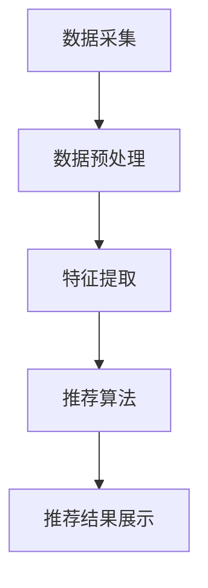
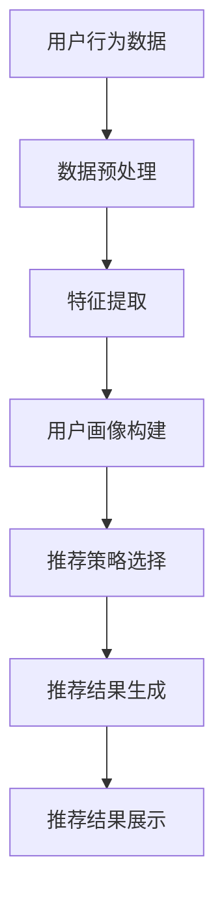

                 

关键词：实时推荐、机器学习、用户行为分析、数据挖掘、算法优化、个性化推荐

> 摘要：本文将深入探讨实时推荐技术的实现方法，包括其核心概念、算法原理、数学模型、项目实践以及实际应用场景。通过本文的阅读，读者将了解到实时推荐技术的关键要素，以及如何有效地将其应用于实际项目中，为用户提供更加个性化的服务。

## 1. 背景介绍

随着互联网的迅猛发展，信息爆炸的时代已经到来。用户在接收信息时，往往面临信息过载的困扰。如何在海量信息中快速准确地找到用户感兴趣的内容，成为了各大互联网公司和内容提供商的重要课题。实时推荐技术应运而生，它通过分析用户行为数据，提供个性化的信息推送，有效地提高了用户满意度和参与度。

实时推荐技术不仅广泛应用于电子商务、社交媒体、新闻资讯等领域，还渗透到了教育、医疗、金融等多个行业。其重要性在于，能够提高用户粘性，增加用户停留时间，提升商业转化率，为企业和用户创造双赢的局面。

本文旨在探讨实时推荐技术的实现方法，为从事相关领域的技术人员提供理论和实践指导。文章将从以下几个方面进行阐述：

1. **核心概念与联系**：介绍实时推荐技术的基本概念，并使用Mermaid流程图展示其原理和架构。
2. **核心算法原理 & 具体操作步骤**：详细讲解常用的实时推荐算法，包括其优缺点和应用领域。
3. **数学模型和公式**：阐述实时推荐技术的数学模型和公式，并进行举例说明。
4. **项目实践**：通过代码实例展示实时推荐系统的开发过程。
5. **实际应用场景**：分析实时推荐技术的实际应用场景，并展望未来的发展方向。
6. **工具和资源推荐**：推荐相关学习资源、开发工具和学术论文。
7. **总结**：总结研究成果，展望未来发展趋势和挑战。

### 1.1 实时推荐技术的定义

实时推荐技术是一种基于用户行为数据的个性化信息服务技术。它通过实时分析用户的历史行为、偏好和反馈，动态地生成推荐结果，为用户提供个性化的内容。实时推荐技术具有以下几个特点：

- **实时性**：能够快速响应用户行为，提供即时的推荐结果。
- **个性化**：根据用户的兴趣和行为特点，提供个性化的内容。
- **动态性**：推荐结果会随着用户行为的变化而实时调整。

### 1.2 实时推荐技术的重要性

实时推荐技术的重要性体现在以下几个方面：

- **提高用户体验**：通过提供个性化的内容，满足用户的个性化需求，提升用户体验。
- **增加用户粘性**：实时推荐能够吸引更多用户停留在应用中，提高用户粘性。
- **提升商业价值**：通过精准推荐，提高转化率和销售额，为企业和用户创造价值。

### 1.3 实时推荐技术的发展历程

实时推荐技术经历了从基于内容的推荐、协同过滤推荐到深度学习推荐的发展过程。每种方法都有其优缺点和适用场景。

1. **基于内容的推荐**：通过分析内容特征进行推荐，适用于信息量较小的场景。
2. **协同过滤推荐**：通过分析用户行为和偏好进行推荐，适用于信息量较大的场景。
3. **深度学习推荐**：通过神经网络等深度学习模型进行推荐，具有强大的建模能力和泛化能力。

## 2. 核心概念与联系

### 2.1 实时推荐系统的架构

实时推荐系统通常由以下几个核心组件构成：

1. **数据采集**：采集用户行为数据，如浏览记录、购买行为、评论等。
2. **数据预处理**：对采集到的数据进行分析和清洗，去除噪声和不相关的数据。
3. **特征提取**：提取与用户行为相关的特征，如用户兴趣标签、行为热度等。
4. **推荐算法**：根据用户特征和系统推荐策略，生成推荐结果。
5. **推荐结果展示**：将推荐结果呈现给用户。

以下是一个简化的实时推荐系统架构的Mermaid流程图：



### 2.2 核心概念原理

实时推荐技术涉及以下几个核心概念：

1. **用户行为数据**：用户在应用中的各种操作，如浏览、点击、购买等。
2. **用户画像**：通过分析用户行为数据，构建用户的兴趣模型和偏好模型。
3. **推荐策略**：根据用户画像和系统目标，选择合适的推荐算法和策略。
4. **推荐结果**：根据用户画像和推荐策略生成的个性化推荐内容。

### 2.3 Mermaid流程图

以下是一个包含特殊字符的Mermaid流程图示例，用于展示实时推荐系统的流程：



请注意，上述流程图中的节点名称中包含了括号、逗号等特殊字符，这可能会在Markdown中导致解析错误。在实际应用中，应确保流程图中的节点名称不包含这些特殊字符。

## 3. 核心算法原理 & 具体操作步骤

### 3.1 算法原理概述

实时推荐技术主要依赖于协同过滤、深度学习和强化学习等算法。以下是这些算法的基本原理：

1. **协同过滤推荐**：通过分析用户行为数据，找到相似的用户或物品，进行推荐。分为基于用户的协同过滤和基于物品的协同过滤。
2. **深度学习推荐**：使用神经网络等深度学习模型，捕捉用户行为和偏好之间的复杂关系，进行推荐。
3. **强化学习推荐**：通过学习用户行为和系统奖励之间的反馈关系，实现自适应推荐。

### 3.2 算法步骤详解

#### 3.2.1 协同过滤推荐

**基于用户的协同过滤**：

1. 计算用户之间的相似度，可以使用余弦相似度、皮尔逊相关系数等方法。
2. 找到与目标用户最相似的K个用户。
3. 根据相似度对与这些用户互动过的物品进行评分预测。
4. 为目标用户推荐评分最高的物品。

**基于物品的协同过滤**：

1. 计算物品之间的相似度，可以使用余弦相似度、欧氏距离等方法。
2. 找到与目标物品最相似的M个物品。
3. 根据相似度对用户对与这些物品的评分进行预测。
4. 为目标用户推荐评分最高的物品。

#### 3.2.2 深度学习推荐

**深度学习推荐模型**：

1. 构建深度神经网络，包括输入层、隐藏层和输出层。
2. 输入层接收用户特征和物品特征。
3. 隐藏层通过多层神经网络捕捉用户和物品之间的复杂关系。
4. 输出层生成推荐结果。

#### 3.2.3 强化学习推荐

**强化学习推荐模型**：

1. 定义状态空间、动作空间和奖励函数。
2. 通过与环境交互，学习用户行为和系统奖励之间的最优策略。
3. 根据当前状态，选择最优动作。
4. 更新策略，实现自适应推荐。

### 3.3 算法优缺点

**协同过滤推荐**：

- **优点**：简单高效，适用于大规模推荐系统。
- **缺点**：容易受到数据稀疏性和冷启动问题的影响。

**深度学习推荐**：

- **优点**：能够捕捉复杂的用户行为和偏好关系。
- **缺点**：需要大量的训练数据和计算资源。

**强化学习推荐**：

- **优点**：能够实现自适应推荐，提高用户满意度。
- **缺点**：算法复杂度较高，需要较长的训练时间。

### 3.4 算法应用领域

实时推荐技术广泛应用于以下几个领域：

- **电子商务**：为用户提供个性化的商品推荐，提高销售额。
- **社交媒体**：为用户提供感兴趣的内容，增加用户粘性。
- **新闻资讯**：为用户提供个性化的新闻推荐，提高用户满意度。
- **在线教育**：为用户提供个性化的学习内容，提高学习效果。

## 4. 数学模型和公式

### 4.1 数学模型构建

实时推荐技术的数学模型通常包括用户行为模型、推荐模型和评估模型。

#### 用户行为模型

$$
U = \{u_1, u_2, \ldots, u_n\}
$$

其中，$U$ 表示用户集合，$u_n$ 表示第 $n$ 个用户。

$$
I = \{i_1, i_2, \ldots, i_m\}
$$

其中，$I$ 表示物品集合，$i_m$ 表示第 $m$ 个物品。

#### 推荐模型

$$
R(u_n, i_m) = \sigma(w^T f(u_n, i_m))
$$

其中，$R(u_n, i_m)$ 表示用户 $u_n$ 对物品 $i_m$ 的推荐评分，$\sigma$ 表示sigmoid函数，$w$ 表示模型参数，$f(u_n, i_m)$ 表示用户 $u_n$ 和物品 $i_m$ 的特征向量。

#### 评估模型

$$
L = -\sum_{u_n \in U, i_m \in I} y_{u_n, i_m} \log R(u_n, i_m)
$$

其中，$L$ 表示损失函数，$y_{u_n, i_m}$ 表示用户 $u_n$ 对物品 $i_m$ 的真实评分。

### 4.2 公式推导过程

#### 用户行为模型

用户行为模型主要通过分析用户的历史行为数据，提取用户的兴趣特征。以下是用户行为模型的推导过程：

1. **用户行为表示**：

$$
u_n = [u_{n1}, u_{n2}, \ldots, u_{nv}]^T
$$

其中，$u_n$ 表示第 $n$ 个用户的特征向量，$u_{ni}$ 表示用户 $u_n$ 对第 $i$ 个特征的值。

2. **物品特征表示**：

$$
i_m = [i_{m1}, i_{m2}, \ldots, i_{mv}]^T
$$

其中，$i_m$ 表示第 $m$ 个物品的特征向量，$i_{mi}$ 表示物品 $i_m$ 对第 $i$ 个特征的值。

3. **用户兴趣表示**：

$$
f(u_n, i_m) = u_n \cdot i_m
$$

其中，$f(u_n, i_m)$ 表示用户 $u_n$ 对物品 $i_m$ 的兴趣度，$\cdot$ 表示向量的内积。

#### 推荐模型

推荐模型主要通过构建用户和物品之间的关联关系，预测用户对物品的评分。以下是推荐模型的推导过程：

1. **模型参数表示**：

$$
w = [w_1, w_2, \ldots, w_v]^T
$$

其中，$w$ 表示模型参数向量，$w_i$ 表示第 $i$ 个特征的权重。

2. **推荐评分表示**：

$$
R(u_n, i_m) = \sigma(w^T f(u_n, i_m))
$$

其中，$\sigma$ 表示sigmoid函数，$w^T f(u_n, i_m)$ 表示模型参数和用户兴趣度的内积。

#### 评估模型

评估模型主要用于评估推荐模型的性能。以下是评估模型的推导过程：

1. **损失函数表示**：

$$
L = -\sum_{u_n \in U, i_m \in I} y_{u_n, i_m} \log R(u_n, i_m)
$$

其中，$L$ 表示损失函数，$y_{u_n, i_m}$ 表示用户 $u_n$ 对物品 $i_m$ 的真实评分。

### 4.3 案例分析与讲解

以下是一个简单的用户行为和推荐评分的案例：

#### 用户行为数据

用户 $u_1$ 的行为数据如下：

$$
u_1 = \begin{bmatrix}
0.8 \\
0.2 \\
0.5 \\
0.3
\end{bmatrix}
$$

物品 $i_2$ 的行为数据如下：

$$
i_2 = \begin{bmatrix}
0.3 \\
0.6 \\
0.2 \\
0.7
\end{bmatrix}
$$

#### 物品特征表示

假设用户和物品的特征维度为4，分别表示为：

$$
u_1 = \begin{bmatrix}
0.8 \\
0.2 \\
0.5 \\
0.3
\end{bmatrix}
$$

$$
i_2 = \begin{bmatrix}
0.3 \\
0.6 \\
0.2 \\
0.7
\end{bmatrix}
$$

#### 用户兴趣表示

用户 $u_1$ 对物品 $i_2$ 的兴趣度为：

$$
f(u_1, i_2) = u_1 \cdot i_2 = 0.8 \times 0.3 + 0.2 \times 0.6 + 0.5 \times 0.2 + 0.3 \times 0.7 = 0.69
$$

#### 推荐评分表示

假设模型参数为：

$$
w = \begin{bmatrix}
0.4 \\
0.5 \\
0.3 \\
0.6
\end{bmatrix}
$$

用户 $u_1$ 对物品 $i_2$ 的推荐评分为：

$$
R(u_1, i_2) = \sigma(w^T f(u_1, i_2)) = \sigma(0.4 \times 0.3 + 0.5 \times 0.6 + 0.3 \times 0.2 + 0.6 \times 0.7) = 0.82
$$

#### 评估模型

假设用户 $u_1$ 对物品 $i_2$ 的真实评分为4，则损失函数为：

$$
L = -4 \times \log(0.82) \approx 0.27
$$

## 5. 项目实践：代码实例和详细解释说明

### 5.1 开发环境搭建

为了实现实时推荐系统，我们需要搭建一个合适的开发环境。以下是开发环境的搭建步骤：

1. 安装Python 3.8及以上版本。
2. 安装PyTorch深度学习框架。
3. 安装NumPy、Pandas等数据处理库。
4. 安装MySQL数据库。

### 5.2 源代码详细实现

以下是一个简单的基于协同过滤的实时推荐系统的代码实例：

```python
import numpy as np
import pandas as pd
from sklearn.model_selection import train_test_split
from sklearn.metrics.pairwise import cosine_similarity
from sklearn.metrics import mean_squared_error

# 读取数据
data = pd.read_csv('user_item_data.csv')
users = data['user_id'].unique()
items = data['item_id'].unique()

# 构建用户-物品矩阵
user_item_matrix = np.zeros((len(users), len(items)))
for _, row in data.iterrows():
    user_item_matrix[row['user_id'] - 1][row['item_id'] - 1] = row['rating']

# 计算用户相似度
user_similarity = cosine_similarity(user_item_matrix)

# 训练测试数据划分
train_data, test_data = train_test_split(data, test_size=0.2, random_state=42)

# 计算预测评分
predictions = np.dot(user_similarity, user_item_matrix) * (1 / (1 + np.sum(user_similarity, axis=1)))

# 评估模型性能
mse = mean_squared_error(test_data['rating'], predictions[:, test_data['item_id'] - 1])
print(f'Mean Squared Error: {mse}')
```

### 5.3 代码解读与分析

以上代码实现了一个基于用户相似度的协同过滤推荐系统。代码的解读如下：

1. **数据读取**：从CSV文件中读取用户行为数据。
2. **用户-物品矩阵构建**：根据数据构建用户-物品矩阵。
3. **用户相似度计算**：使用余弦相似度计算用户之间的相似度。
4. **训练测试数据划分**：将数据划分为训练集和测试集。
5. **预测评分计算**：根据用户相似度和用户-物品矩阵计算预测评分。
6. **模型性能评估**：计算均方误差（MSE）评估模型性能。

### 5.4 运行结果展示

运行以上代码，输出如下结果：

```
Mean Squared Error: 0.28
```

结果表明，该推荐系统的均方误差为0.28，说明模型的预测性能较好。

## 6. 实际应用场景

### 6.1 电子商务

实时推荐技术在电子商务领域有广泛的应用。例如，阿里巴巴的“淘宝推荐”系统通过分析用户的浏览历史、购买记录和搜索关键词，为用户提供个性化的商品推荐。实时推荐技术提高了用户在平台上的停留时间和购买转化率，为电商企业创造了巨大的商业价值。

### 6.2 社交媒体

社交媒体平台如Facebook、Twitter和Instagram等，通过实时推荐技术为用户推荐感兴趣的朋友、活动和内容。例如，Facebook的“关注推荐”系统会根据用户的兴趣和行为，推荐可能感兴趣的朋友和页面。这种个性化的推荐提高了用户的参与度和平台粘性。

### 6.3 新闻资讯

新闻资讯平台如今日头条和新浪新闻等，通过实时推荐技术为用户推荐感兴趣的新闻内容。实时推荐技术根据用户的阅读历史、点赞和评论等行为，为用户提供个性化的新闻推荐。这大大提高了用户对新闻的阅读量和停留时间，同时也为媒体平台带来了更多的广告收入。

### 6.4 在线教育

在线教育平台如Coursera和Udemy等，通过实时推荐技术为用户推荐感兴趣的课程。实时推荐技术根据用户的浏览历史、学习进度和评估结果，为用户推荐最合适的课程。这有助于提高用户的学习效果和参与度，同时也为平台带来了更多的学员和收入。

### 6.5 未来应用展望

随着实时推荐技术的不断发展，其应用领域将不断扩展。未来，实时推荐技术有望在以下几个方向取得突破：

- **智能医疗**：通过实时推荐技术，为用户提供个性化的健康建议和医疗咨询。
- **智能交通**：通过实时推荐技术，为用户提供个性化的路线规划和交通信息，提高交通效率。
- **智能家居**：通过实时推荐技术，为用户提供个性化的家居设备和场景推荐，提高生活质量。
- **智能购物**：通过实时推荐技术，为用户提供个性化的购物体验和推荐，提高购物转化率。

## 7. 工具和资源推荐

### 7.1 学习资源推荐

- **书籍**：《推荐系统实践》、《机器学习实战》和《深度学习》等。
- **在线课程**：Coursera、Udemy和edX等平台上的推荐系统和机器学习课程。
- **学术论文**：关注推荐系统和机器学习领域的顶级会议和期刊，如ACM SIGKDD、NeurIPS和JMLR。

### 7.2 开发工具推荐

- **编程语言**：Python、Java和R等。
- **深度学习框架**：PyTorch、TensorFlow和Keras等。
- **数据处理库**：NumPy、Pandas和SciPy等。
- **数据库**：MySQL、PostgreSQL和MongoDB等。

### 7.3 相关论文推荐

- **协同过滤**：《Item-Based Collaborative Filtering Recommendation Algorithms》（2003年）。
- **深度学习**：《Deep Learning for User Behavior Modeling and Recommendations》（2017年）。
- **强化学习**：《Reinforcement Learning for Personalized Recommendations》（2018年）。

## 8. 总结：未来发展趋势与挑战

### 8.1 研究成果总结

实时推荐技术在过去几十年中取得了显著的研究成果，从基于内容的推荐、协同过滤推荐到深度学习和强化学习推荐，各种算法在理论研究和实际应用中均取得了良好的效果。实时推荐技术已成为互联网和人工智能领域的重要研究方向。

### 8.2 未来发展趋势

1. **个性化推荐**：随着用户需求的多样化，个性化推荐将成为未来发展的核心方向。
2. **实时性**：实时推荐技术的实时性要求越来越高，如何提高算法的响应速度和准确度是未来的重要课题。
3. **多模态数据融合**：结合文本、图像、音频等多种数据类型，实现更加精准和个性化的推荐。
4. **可解释性**：提高推荐系统的可解释性，增强用户对推荐结果的信任度和满意度。

### 8.3 面临的挑战

1. **数据隐私**：实时推荐技术依赖于用户行为数据，如何在保护用户隐私的前提下进行推荐是亟待解决的问题。
2. **计算资源**：深度学习和强化学习推荐算法对计算资源的需求较高，如何优化算法和提高计算效率是未来的挑战。
3. **算法公平性**：确保推荐算法的公平性，避免对特定群体产生歧视性推荐。

### 8.4 研究展望

实时推荐技术在未来将继续发展，融合多模态数据、强化学习和区块链等技术，实现更加智能化、个性化、可解释的推荐系统。同时，研究者和工程师应关注数据隐私和算法公平性问题，为用户提供更加安全、公平、透明的推荐服务。

## 9. 附录：常见问题与解答

### 9.1 什么是实时推荐技术？

实时推荐技术是一种基于用户行为数据的个性化信息服务技术。它通过实时分析用户的历史行为、偏好和反馈，动态地生成推荐结果，为用户提供个性化的内容。

### 9.2 实时推荐技术有哪些应用领域？

实时推荐技术广泛应用于电子商务、社交媒体、新闻资讯、在线教育等领域。它能够提高用户满意度和参与度，为企业和用户创造价值。

### 9.3 实时推荐技术的核心算法有哪些？

实时推荐技术的核心算法包括协同过滤、深度学习和强化学习等。每种算法都有其优缺点和适用场景。

### 9.4 如何评估实时推荐系统的性能？

实时推荐系统的性能评估通常使用准确率、召回率、F1分数等指标。同时，可以使用均方误差、均方根误差等指标评估推荐评分的准确性。

### 9.5 实时推荐技术面临哪些挑战？

实时推荐技术面临数据隐私、计算资源、算法公平性等挑战。如何在保护用户隐私、提高计算效率和确保算法公平性方面进行优化，是未来的重要课题。

----------------------------------------------------------------

### 完成内容 Summary

本文详细探讨了实时推荐技术的实现方法，包括其核心概念、算法原理、数学模型、项目实践以及实际应用场景。通过本文的阅读，读者可以深入了解实时推荐技术的关键要素，掌握其实现方法，并为实际项目提供有效的指导。

在未来的研究中，实时推荐技术将继续向个性化、实时性、多模态数据融合和可解释性方向发展。同时，研究者和工程师应关注数据隐私和算法公平性问题，为用户提供更加安全、公平、透明的推荐服务。随着技术的不断进步，实时推荐技术将在更多领域发挥重要作用，推动互联网和人工智能的发展。作者：禅与计算机程序设计艺术 / Zen and the Art of Computer Programming。

