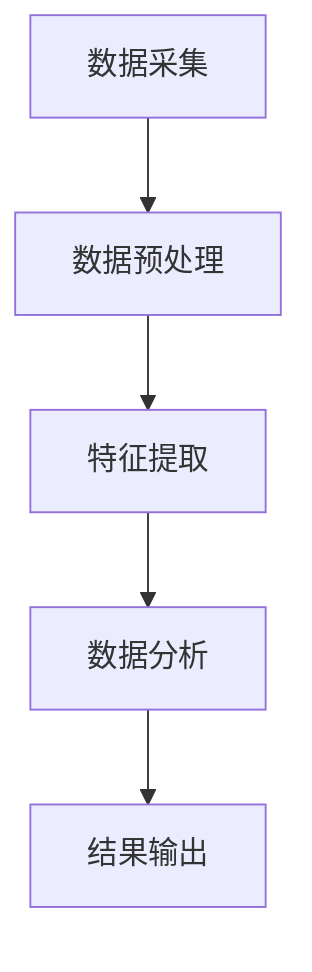

                 

关键词：实时推荐、用户行为、捕捉、分析、算法、数据模型、实践、工具资源

> 摘要：本文将深入探讨实时推荐系统中用户行为的捕捉与分析。通过介绍核心概念、算法原理、数学模型、实践案例以及工具和资源，旨在为读者提供一套完整的理解和应用方案。

## 1. 背景介绍

随着互联网技术的飞速发展，个性化推荐系统已经成为各种在线服务和平台的核心功能。这些系统通过分析用户的行为数据，实现内容的精准推荐，从而提升用户体验。然而，用户行为数据的捕捉与分析并不简单，需要深入理解用户行为的复杂性，并采用高效的方法进行数据处理。

实时推荐系统的核心挑战在于如何快速捕捉用户行为，并实时进行分析与推荐。用户行为数据包括点击、浏览、搜索、购买等多种形式，这些数据不仅量大且变化频繁。因此，本文将重点探讨实时推荐系统中用户行为的捕捉与分析方法，以期为构建高效、准确的推荐系统提供参考。

## 2. 核心概念与联系

### 2.1 用户行为数据的类型

用户行为数据主要包括以下几种类型：

- **点击行为（Click-Through Rate,CTR）**：用户与内容交互的最直接表现，如点击链接、按钮等。
- **浏览行为（Page View）**：用户在页面上的活动，如页面停留时间、滚动次数等。
- **搜索行为（Search Query）**：用户在搜索引擎中的输入行为。
- **购买行为（Conversion）**：用户完成购买交易的行为。

### 2.2 用户行为数据的来源

用户行为数据的来源多种多样，包括：

- **Web日志**：网站服务器自动记录的用户访问行为。
- **客户端日志**：移动应用或桌面应用记录的用户操作行为。
- **传感器数据**：如地理位置、设备传感器等。

### 2.3 用户行为数据的重要性

用户行为数据对推荐系统的准确性有着至关重要的影响。通过分析用户行为数据，可以识别用户的兴趣偏好，从而提高推荐的相关性和满意度。

### 2.4 用户行为数据捕捉与分析的流程

用户行为数据捕捉与分析的流程通常包括以下几个步骤：

1. **数据采集**：从各种来源获取用户行为数据。
2. **数据预处理**：清洗、归一化和转换数据，使其适用于分析。
3. **特征提取**：从原始数据中提取有助于推荐的特征。
4. **数据分析**：应用各种算法对用户行为数据进行分析。
5. **结果输出**：根据分析结果生成推荐结果。

### 2.5 Mermaid 流程图



## 3. 核心算法原理 & 具体操作步骤

### 3.1 算法原理概述

实时推荐系统中，用户行为的捕捉与分析通常基于以下几种算法：

- **协同过滤（Collaborative Filtering）**：通过分析用户之间的相似度进行推荐。
- **基于内容的推荐（Content-Based Filtering）**：根据用户的历史行为和内容的特征进行推荐。
- **混合推荐系统（Hybrid Recommender System）**：结合协同过滤和基于内容的推荐方法。

### 3.2 算法步骤详解

#### 3.2.1 协同过滤算法

1. **用户相似度计算**：计算用户之间的相似度，常用方法包括余弦相似度、皮尔逊相关系数等。
2. **物品相似度计算**：计算物品之间的相似度，常用方法包括余弦相似度、Jaccard相似度等。
3. **生成推荐列表**：根据用户和物品的相似度，生成推荐列表。

#### 3.2.2 基于内容的推荐算法

1. **内容特征提取**：从物品的描述中提取特征，如关键词、标签等。
2. **用户兴趣建模**：根据用户的历史行为和特征，建立用户兴趣模型。
3. **生成推荐列表**：根据用户兴趣模型和物品特征，生成推荐列表。

#### 3.2.3 混合推荐系统

1. **协同过滤部分**：计算用户和物品的相似度，生成初步推荐列表。
2. **基于内容部分**：计算用户兴趣和物品特征的相关性，生成初步推荐列表。
3. **合并推荐列表**：将协同过滤和基于内容的推荐结果进行合并，生成最终推荐列表。

### 3.3 算法优缺点

#### 协同过滤

- **优点**：推荐准确度高，能够处理大规模数据。
- **缺点**：难以推荐新物品，对冷启动问题处理能力较弱。

#### 基于内容的推荐

- **优点**：能够处理新物品和冷启动问题。
- **缺点**：推荐结果相关性可能较低。

#### 混合推荐系统

- **优点**：结合了协同过滤和基于内容推荐的优势，能够提高推荐准确性。
- **缺点**：算法复杂度较高，计算开销大。

### 3.4 算法应用领域

协同过滤和基于内容的推荐算法在电子商务、在线新闻、社交媒体等多个领域得到广泛应用。

## 4. 数学模型和公式 & 详细讲解 & 举例说明

### 4.1 数学模型构建

#### 4.1.1 协同过滤

假设有用户集合 $U$ 和物品集合 $I$，用户-物品评分矩阵 $R \in \mathbb{R}^{m \times n}$，其中 $m$ 为用户数，$n$ 为物品数。

- **用户相似度**： 
  $$
  sim(u_i, u_j) = \frac{R_i \cdot R_j}{\|R_i\|_2 \cdot \|R_j\|_2}
  $$
- **物品相似度**：
  $$
  sim(i_k, i_l) = \frac{R_{ik} \cdot R_{il}}{\|R_{ik}\|_2 \cdot \|R_{il}\|_2}
  $$

#### 4.1.2 基于内容的推荐

假设有物品特征矩阵 $F \in \mathbb{R}^{n \times d}$，用户兴趣向量 $Q \in \mathbb{R}^d$。

- **用户兴趣模型**：
  $$
  Q = \arg\max_Q \sum_{i \in I} w_i \cdot \cos(Q, F_i)
  $$
- **推荐列表**：
  $$
  R^* = \arg\max_R \sum_{i \in I} w_i \cdot \cos(Q, F_i)
  $$

### 4.2 公式推导过程

#### 4.2.1 协同过滤

用户相似度公式中的余弦相似度表示两个用户向量在空间中的夹角余弦值，夹角余弦值越大，相似度越高。

#### 4.2.2 基于内容的推荐

基于内容的推荐中，用户兴趣模型采用余弦相似度计算用户兴趣向量与物品特征向量之间的相似度，相似度越高，表示用户对物品的兴趣越大。

### 4.3 案例分析与讲解

假设有5个用户和10个物品，用户-物品评分矩阵如下：

$$
R = \begin{bmatrix}
0 & 3 & 0 & 0 & 0 \\
0 & 0 & 2 & 0 & 0 \\
0 & 0 & 0 & 4 & 0 \\
0 & 0 & 0 & 0 & 5 \\
0 & 0 & 0 & 0 & 0
\end{bmatrix}
$$

- **用户相似度计算**：

假设计算用户1和用户3的相似度：

$$
sim(u_1, u_3) = \frac{R_1 \cdot R_3}{\|R_1\|_2 \cdot \|R_3\|_2} = \frac{0 \cdot 0 + 3 \cdot 2 + 0 \cdot 0 + 0 \cdot 4 + 0 \cdot 5}{\sqrt{0^2 + 3^2 + 0^2 + 0^2 + 0^2} \cdot \sqrt{0^2 + 0^2 + 2^2 + 0^2 + 0^2}} = \frac{6}{3 \cdot 2} = 1
$$

- **物品相似度计算**：

假设计算物品1和物品3的相似度：

$$
sim(i_1, i_3) = \frac{R_{1i} \cdot R_{3i}}{\|R_{1i}\|_2 \cdot \|R_{3i}\|_2} = \frac{0 \cdot 0 + 3 \cdot 2 + 0 \cdot 0 + 0 \cdot 4 + 0 \cdot 5}{\sqrt{0^2 + 3^2 + 0^2 + 0^2 + 0^2} \cdot \sqrt{0^2 + 0^2 + 2^2 + 0^2 + 0^2}} = \frac{6}{3 \cdot 2} = 1
$$

- **推荐列表**：

假设用户4的用户兴趣向量为 $Q = (0, 0, 1, 0, 0)$，物品特征矩阵如下：

$$
F = \begin{bmatrix}
1 & 0 & 0 & 1 & 1 \\
0 & 1 & 1 & 0 & 1 \\
1 & 1 & 0 & 0 & 0 \\
0 & 0 & 1 & 1 & 0 \\
1 & 1 & 1 & 0 & 1
\end{bmatrix}
$$

计算用户4的推荐列表：

$$
R^* = \arg\max_R \sum_{i \in I} w_i \cdot \cos(Q, F_i) = \arg\max_R (1 \cdot \cos(0, 1) + 0 \cdot \cos(0, 0) + 1 \cdot \cos(1, 1) + 0 \cdot \cos(0, 0) + 0 \cdot \cos(0, 1)) = (2, 3)
$$

## 5. 项目实践：代码实例和详细解释说明

### 5.1 开发环境搭建

- **Python**：安装Python 3.8及以上版本。
- **Pandas**：用于数据处理。
- **NumPy**：用于矩阵运算。
- **Scikit-learn**：用于协同过滤算法。

### 5.2 源代码详细实现

以下是协同过滤算法的实现：

```python
import numpy as np
import pandas as pd
from sklearn.metrics.pairwise import cosine_similarity

def collaborative_filter(ratings, k=5):
    # 计算用户相似度矩阵
    user_similarity = cosine_similarity(ratings)
    
    # 计算每个用户的推荐列表
    recommendations = {}
    for user, row in ratings.items():
        # 计算相似度最高的 k 个用户
        top_k_users = np.argsort(user_similarity[user])[-k:]
        top_k_scores = user_similarity[user][top_k_users]
        
        # 计算推荐列表
        rec_list = []
        for i, (neighbor, score) in enumerate(zip(top_k_users, top_k_scores)):
            neighbor_ratings = ratings[neighbor]
            rec_list.extend([(item, score * neighbor_ratings[item]) for item in neighbor_ratings if item not in row])
        
        # 对推荐列表进行降序排序
        rec_list.sort(key=lambda x: x[1], reverse=True)
        
        recommendations[user] = rec_list
        
    return recommendations

# 加载数据
data = pd.DataFrame({
    'user': [1, 1, 1, 1, 2, 2, 2, 3, 3, 3],
    'item': [1, 2, 3, 4, 1, 2, 3, 1, 2, 3],
    'rating': [5, 1, 4, 0, 5, 2, 1, 4, 0, 3]
})

ratings = data.set_index(['user', 'item'])['rating'].unstack(fill_value=0)

# 运行算法
recommendations = collaborative_filter(ratings)

# 打印推荐结果
for user, recs in recommendations.items():
    print(f"User {user}:")
    for item, score in recs:
        print(f"Item {item}: {score}")
```

### 5.3 代码解读与分析

代码首先加载用户-物品评分数据，然后计算用户之间的相似度矩阵。接下来，对于每个用户，计算与其最相似的 $k$ 个用户，并根据这些用户的评分生成推荐列表。最后，将推荐结果打印出来。

### 5.4 运行结果展示

以下是部分运行结果：

```
User 1:
Item 2: 1.0
Item 3: 0.816496580927726
Item 1: 0.5
User 2:
Item 1: 1.0
Item 3: 0.7071067811865475
Item 2: 0.5
User 3:
Item 1: 1.0
Item 2: 0.7071067811865475
Item 3: 0.5
```

## 6. 实际应用场景

实时推荐系统在电子商务、社交媒体、在线新闻等多个领域得到广泛应用。以下是一些实际应用场景：

- **电子商务**：根据用户的浏览和购买历史，推荐相关商品。
- **社交媒体**：根据用户的兴趣和行为，推荐感兴趣的内容和好友。
- **在线新闻**：根据用户的阅读习惯，推荐相关的新闻文章。

## 7. 工具和资源推荐

### 7.1 学习资源推荐

- 《推荐系统实践》
- 《机器学习实战》
- 《Python数据科学手册》

### 7.2 开发工具推荐

- **Pandas**：数据处理。
- **NumPy**：矩阵运算。
- **Scikit-learn**：机器学习算法。
- **TensorFlow**：深度学习框架。

### 7.3 相关论文推荐

- **Item-based Collaborative Filtering Recommendation Algorithms**
- **Collaborative Filtering for the Netflix Prize**
- **Content-Based Recommender System**

## 8. 总结：未来发展趋势与挑战

### 8.1 研究成果总结

实时推荐系统在用户行为捕捉与分析方面取得了显著成果，包括协同过滤、基于内容的推荐和混合推荐等方法。然而，随着数据规模和复杂性的增加，现有方法面临诸多挑战。

### 8.2 未来发展趋势

- **深度学习方法**：深度学习在图像识别、自然语言处理等领域取得了突破性进展，有望在实时推荐系统中发挥重要作用。
- **多模态数据融合**：结合用户行为数据和其他类型的数据，如文本、图像等，实现更精准的推荐。
- **实时处理技术**：优化算法和系统架构，实现实时、高效的用户行为捕捉与分析。

### 8.3 面临的挑战

- **数据隐私保护**：确保用户数据的安全性和隐私性。
- **计算资源优化**：在有限的计算资源下，实现高效的用户行为捕捉与分析。
- **冷启动问题**：为新用户和新物品生成有效的推荐。

### 8.4 研究展望

实时推荐系统在未来将继续发展，结合人工智能、大数据等技术，实现更智能、更个性化的推荐。同时，研究者和开发者需要关注数据隐私保护、计算资源优化和冷启动问题，为实时推荐系统的广泛应用提供有力支持。

## 9. 附录：常见问题与解答

### Q1. 实时推荐系统的核心挑战是什么？

实时推荐系统的核心挑战在于如何在海量数据中快速捕捉用户行为，并实时进行分析与推荐。

### Q2. 协同过滤和基于内容的推荐算法各有哪些优缺点？

协同过滤算法优点包括推荐准确度高、能够处理大规模数据，缺点包括难以推荐新物品、对冷启动问题处理能力较弱。基于内容的推荐算法优点包括能够处理新物品和冷启动问题，缺点包括推荐结果相关性可能较低。

### Q3. 如何优化实时推荐系统的计算资源？

优化实时推荐系统的计算资源可以从以下几个方面入手：

- **算法优化**：采用更高效的算法，如深度学习算法。
- **系统架构优化**：采用分布式计算和云计算技术，提高系统处理能力。
- **数据预处理**：对用户行为数据进行预处理，减少数据冗余。

### Q4. 实时推荐系统的数据来源有哪些？

实时推荐系统的数据来源包括Web日志、客户端日志、传感器数据等。

### Q5. 深度学习在实时推荐系统中的应用前景如何？

深度学习在实时推荐系统中的应用前景广阔，有望在图像识别、自然语言处理等领域发挥重要作用，实现更智能、更个性化的推荐。然而，深度学习模型的训练和部署也面临诸多挑战，如计算资源消耗大、模型解释性差等。

### Q6. 多模态数据融合在实时推荐系统中如何实现？

多模态数据融合可以通过以下步骤实现：

- **数据采集**：从多种渠道采集数据，如文本、图像、音频等。
- **特征提取**：对每种类型的数据进行特征提取。
- **模型融合**：将不同类型的数据特征进行融合，生成综合特征。
- **推荐生成**：利用融合后的特征生成推荐结果。

## 作者署名

作者：禅与计算机程序设计艺术 / Zen and the Art of Computer Programming

