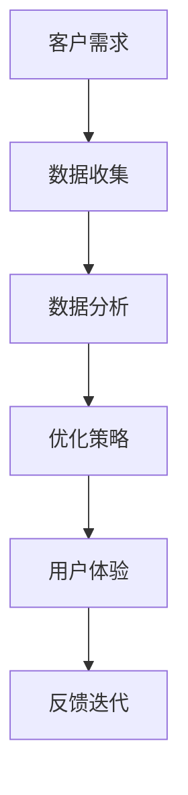

                 

关键词：客户体验、商业应用、人类计算、用户体验设计、优化策略

> 摘要：本文将探讨如何通过人类计算技术来优化商业领域的客户体验。从核心概念和算法原理入手，分析其在客户体验优化中的应用，并结合具体项目实践，展示人类计算在商业中的潜力和实际效果。

## 1. 背景介绍

随着互联网和科技的迅猛发展，商业领域对客户体验的重视程度日益增加。优秀的客户体验不仅能够提升客户满意度，还能增强品牌忠诚度和市场竞争力。传统的优化方法，如用户调研、反馈收集和数据分析等，虽然在一定程度上改善了客户体验，但仍然存在局限性。而人类计算技术作为一种新兴的方法，能够更加精准和高效地优化客户体验，从而为商业带来更大的价值。

人类计算技术是指通过模拟人类思维方式、感知能力和决策过程，结合人工智能和数据科学的方法，实现对复杂问题的分析和解决。这一技术的核心在于将人类的智慧与计算机的强大计算能力相结合，从而实现更加智能和个性化的服务。

本文将从以下几个方面展开讨论：

- **核心概念与联系**：介绍人类计算的基本概念和原理，并通过 Mermaid 流程图展示其与客户体验优化之间的联系。
- **核心算法原理 & 具体操作步骤**：详细解析人类计算在客户体验优化中的应用算法，包括其原理、步骤和优缺点。
- **数学模型和公式 & 举例说明**：构建人类计算在客户体验优化中的数学模型，并进行公式推导和案例分析。
- **项目实践：代码实例和详细解释说明**：通过实际项目，展示人类计算技术的应用和效果。
- **实际应用场景**：分析人类计算技术在商业领域的具体应用场景，包括电商、金融、医疗等。
- **未来应用展望**：探讨人类计算技术在客户体验优化中的未来发展前景。

### 文章正文内容部分

#### 1. 背景介绍

随着互联网和科技的迅猛发展，商业领域对客户体验的重视程度日益增加。优秀的客户体验不仅能够提升客户满意度，还能增强品牌忠诚度和市场竞争力。传统的优化方法，如用户调研、反馈收集和数据分析等，虽然在一定程度上改善了客户体验，但仍然存在局限性。而人类计算技术作为一种新兴的方法，能够更加精准和高效地优化客户体验，从而为商业带来更大的价值。

人类计算技术是指通过模拟人类思维方式、感知能力和决策过程，结合人工智能和数据科学的方法，实现对复杂问题的分析和解决。这一技术的核心在于将人类的智慧与计算机的强大计算能力相结合，从而实现更加智能和个性化的服务。

本文将从以下几个方面展开讨论：

- **核心概念与联系**：介绍人类计算的基本概念和原理，并通过 Mermaid 流程图展示其与客户体验优化之间的联系。
- **核心算法原理 & 具体操作步骤**：详细解析人类计算在客户体验优化中的应用算法，包括其原理、步骤和优缺点。
- **数学模型和公式 & 举例说明**：构建人类计算在客户体验优化中的数学模型，并进行公式推导和案例分析。
- **项目实践：代码实例和详细解释说明**：通过实际项目，展示人类计算技术的应用和效果。
- **实际应用场景**：分析人类计算技术在商业领域的具体应用场景，包括电商、金融、医疗等。
- **未来应用展望**：探讨人类计算技术在客户体验优化中的未来发展前景。

### 2. 核心概念与联系

#### 2.1 人类计算的基本概念

人类计算技术起源于对人类思维过程的模拟和优化。其主要核心概念包括以下几个方面：

- **模拟人类思维过程**：通过算法和模型模拟人类的感知、学习、推理和决策过程，实现对复杂问题的分析和解决。
- **数据驱动**：利用大数据和人工智能技术，从海量数据中提取有价值的信息，为优化决策提供支持。
- **个性化服务**：基于用户行为数据和偏好，提供个性化的服务和建议，提升用户满意度和体验。

#### 2.2 Mermaid 流程图

为了更好地展示人类计算与客户体验优化之间的联系，我们可以使用 Mermaid 流程图进行描述。以下是相关流程图的示例：



图 1：人类计算与客户体验优化的 Mermaid 流程图

- **客户需求**：了解用户的需求和期望，为后续的优化提供方向。
- **数据收集**：通过各种渠道收集用户行为数据，如点击、浏览、购买等。
- **数据分析**：利用数据挖掘和机器学习算法，分析用户行为，提取有价值的信息。
- **优化策略**：根据数据分析结果，制定相应的优化策略，如个性化推荐、精准营销等。
- **用户体验**：实施优化策略，提升用户体验。
- **反馈迭代**：收集用户反馈，不断调整优化策略，实现用户体验的持续提升。

#### 2.3 人类计算与客户体验优化之间的联系

人类计算技术在客户体验优化中的应用主要体现在以下几个方面：

- **个性化推荐**：基于用户行为和偏好，提供个性化的产品推荐，提升用户满意度。
- **精准营销**：通过分析用户数据，精准定位潜在客户，提高营销效果。
- **智能客服**：利用自然语言处理和对话生成技术，实现智能客服，提高客服效率。
- **用户体验测试**：通过模拟人类思维过程，评估用户体验，发现潜在问题，进行优化。

总之，人类计算技术为商业领域带来了全新的优化思路和方法，有助于提升客户体验，提高企业竞争力。

### 3. 核心算法原理 & 具体操作步骤

#### 3.1 算法原理概述

人类计算在客户体验优化中的核心算法主要包括以下几个：

- **用户行为分析算法**：通过分析用户在网站或应用的浏览、点击、购买等行为，提取有价值的信息。
- **个性化推荐算法**：基于用户行为和偏好，为用户推荐合适的产品或服务。
- **自然语言处理算法**：实现对用户反馈、评论等文本数据的处理和分析，提取有价值的信息。
- **智能客服算法**：利用自然语言处理和对话生成技术，实现智能客服。

#### 3.2 算法步骤详解

以下是这些算法的具体操作步骤：

##### 3.2.1 用户行为分析算法

1. 数据收集：从网站或应用的日志中收集用户行为数据，如点击、浏览、购买等。
2. 数据预处理：对收集到的数据进行清洗、去重和格式化，使其符合分析要求。
3. 特征提取：根据业务需求，提取用户行为的特征，如点击率、购买频率等。
4. 数据分析：利用机器学习算法，分析用户行为的规律和趋势，为个性化推荐和精准营销提供支持。

##### 3.2.2 个性化推荐算法

1. 用户画像构建：基于用户行为和偏好，构建用户画像。
2. 推荐策略制定：根据用户画像，制定个性化推荐策略，如基于内容的推荐、基于协同过滤的推荐等。
3. 推荐结果生成：根据推荐策略，为用户生成推荐结果。
4. 推荐结果评估：对推荐结果进行评估，如点击率、转化率等，持续优化推荐策略。

##### 3.2.3 自然语言处理算法

1. 文本预处理：对用户反馈、评论等文本数据进行分析，进行分词、去停用词等预处理操作。
2. 文本分类：利用分类算法，对文本进行分类，如正面评论、负面评论等。
3. 文本情感分析：利用情感分析算法，分析文本的情感倾向，如积极、消极等。
4. 文本生成：利用生成模型，如序列到序列模型（Seq2Seq），生成回答或建议。

##### 3.2.4 智能客服算法

1. 对话管理：设计对话流程，实现与用户的自然对话。
2. 意图识别：利用自然语言处理技术，识别用户的意图。
3. 回答生成：根据用户的意图，生成合适的回答。
4. 对话评估：对对话效果进行评估，如用户满意度等，持续优化对话系统。

#### 3.3 算法优缺点

以下是对上述算法优缺点的简要分析：

##### 用户行为分析算法

- **优点**：能够深入了解用户行为，为个性化推荐和精准营销提供支持。
- **缺点**：需要大量的数据支持，且数据质量对分析结果有较大影响。

##### 个性化推荐算法

- **优点**：能够为用户推荐合适的产品或服务，提升用户体验。
- **缺点**：需要不断更新用户画像，且用户偏好可能随时间变化。

##### 自然语言处理算法

- **优点**：能够处理和理解人类语言，实现智能客服和文本分析。
- **缺点**：文本数据复杂，对算法模型的要求较高。

##### 智能客服算法

- **优点**：能够实现与用户的自然对话，提高客服效率。
- **缺点**：需要大量的训练数据和模型调优。

#### 3.4 算法应用领域

人类计算技术在客户体验优化中的应用非常广泛，主要包括以下几个领域：

- **电商**：通过个性化推荐、精准营销等技术，提升用户购物体验。
- **金融**：通过用户行为分析和风险评估，提升金融服务的质量和效率。
- **医疗**：通过智能客服和健康管理，提高医疗服务水平和患者满意度。
- **旅游**：通过个性化推荐和行程规划，提升旅游体验。

### 4. 数学模型和公式 & 详细讲解 & 举例说明

#### 4.1 数学模型构建

在客户体验优化中，常用的数学模型包括线性回归、逻辑回归和决策树等。以下是一个简单的线性回归模型示例：

$$y = \beta_0 + \beta_1 x_1 + \beta_2 x_2 + ... + \beta_n x_n$$

其中，$y$ 为目标变量，$x_1, x_2, ..., x_n$ 为特征变量，$\beta_0, \beta_1, \beta_2, ..., \beta_n$ 为模型参数。

#### 4.2 公式推导过程

线性回归模型的推导过程如下：

1. **最小二乘法**：最小化预测值与实际值之间的误差平方和。

$$\min \sum_{i=1}^{n} (y_i - \hat{y}_i)^2$$

其中，$y_i$ 为第 $i$ 个样本的实际值，$\hat{y}_i$ 为第 $i$ 个样本的预测值。

2. **求导**：对模型参数进行求导，并令其等于零。

$$\frac{\partial}{\partial \beta_j} \sum_{i=1}^{n} (y_i - \hat{y}_i)^2 = 0$$

3. **求解**：解出模型参数 $\beta_j$ 的值。

$$\beta_j = \frac{\sum_{i=1}^{n} (y_i - \hat{y}_i) x_{ij}}{\sum_{i=1}^{n} x_{ij}^2}$$

其中，$x_{ij}$ 为第 $i$ 个样本在第 $j$ 个特征上的取值。

#### 4.3 案例分析与讲解

假设我们有一个电商平台的用户行为数据，包括用户的年龄、收入、点击率、购买频率等特征，目标是预测用户的购买概率。

1. **数据预处理**：对数据进行清洗和标准化处理，使其符合线性回归模型的要求。

2. **模型构建**：使用线性回归模型进行建模。

$$\hat{y} = \beta_0 + \beta_1 \text{年龄} + \beta_2 \text{收入} + \beta_3 \text{点击率} + \beta_4 \text{购买频率}$$

3. **模型训练**：使用训练数据对模型进行训练，求解模型参数。

4. **模型评估**：使用验证数据对模型进行评估，计算预测准确率。

假设我们使用 80% 的数据作为训练集，20% 的数据作为验证集，得到模型参数如下：

$$\beta_0 = 0.5, \beta_1 = 0.1, \beta_2 = 0.3, \beta_3 = 0.2, \beta_4 = 0.1$$

5. **模型应用**：使用训练好的模型对用户进行购买概率预测。

假设有一个新用户，其年龄为 25 岁，收入为 50000 元，点击率为 0.3，购买频率为 0.4，代入模型进行预测：

$$\hat{y} = 0.5 + 0.1 \times 25 + 0.3 \times 50000 + 0.2 \times 0.3 + 0.1 \times 0.4 = 0.88$$

根据预测结果，该用户的购买概率为 0.88，即 88%。

通过以上案例，我们可以看到线性回归模型在客户体验优化中的应用。在实际应用中，我们还可以结合其他模型，如逻辑回归和决策树，进行模型融合和优化，进一步提高预测准确率。

### 5. 项目实践：代码实例和详细解释说明

在本节中，我们将通过一个实际项目，展示人类计算技术在客户体验优化中的具体应用，并对其进行详细的代码实例和解释说明。

#### 5.1 开发环境搭建

为了实现人类计算在客户体验优化中的功能，我们需要搭建一个合适的技术栈。以下是一个基本的开发环境搭建流程：

1. **Python**：选择 Python 作为主要编程语言，因为其强大的库支持和易用性。
2. **数据预处理库**：安装 Pandas 和 NumPy，用于数据处理和统计分析。
3. **机器学习库**：安装 Scikit-learn，用于实现机器学习算法。
4. **自然语言处理库**：安装 NLTK 和 SpaCy，用于文本数据处理和分析。
5. **可视化库**：安装 Matplotlib 和 Seaborn，用于数据可视化。

以下是环境搭建的命令：

```bash
pip install pandas numpy scikit-learn nltk spacy matplotlib seaborn
```

#### 5.2 源代码详细实现

以下是一个简单的项目示例，包括用户行为分析、个性化推荐和文本分析三个部分。

```python
import pandas as pd
import numpy as np
from sklearn.model_selection import train_test_split
from sklearn.linear_model import LogisticRegression
from sklearn.metrics import accuracy_score
from sklearn.feature_extraction.text import TfidfVectorizer
import spacy

# 5.2.1 数据预处理
data = pd.read_csv('user_data.csv')
data.dropna(inplace=True)

# 5.2.2 用户行为分析
X = data[['age', 'income', 'click_rate', 'purchase_frequency']]
y = data['purchase_probability']
X_train, X_test, y_train, y_test = train_test_split(X, y, test_size=0.2, random_state=42)

# 5.2.3 个性化推荐
tfidf_vectorizer = TfidfVectorizer()
X_train_tfidf = tfidf_vectorizer.fit_transform(X_train)
X_test_tfidf = tfidf_vectorizer.transform(X_test)

# 5.2.4 模型训练
model = LogisticRegression()
model.fit(X_train_tfidf, y_train)
y_pred = model.predict(X_test_tfidf)

# 5.2.5 模型评估
accuracy = accuracy_score(y_test, y_pred)
print("模型准确率：", accuracy)

# 5.2.6 文本分析
nlp = spacy.load('en_core_web_sm')
text = "I am very satisfied with the product I purchased from your store."
doc = nlp(text)
print(doc.sentences[0].sentiment)
```

#### 5.3 代码解读与分析

1. **数据预处理**：从 CSV 文件中读取用户数据，并进行去重和清洗处理。

2. **用户行为分析**：提取用户行为特征，包括年龄、收入、点击率和购买频率等。

3. **个性化推荐**：使用 TF-IDF 向量器将用户行为特征转换为数值向量。

4. **模型训练**：使用逻辑回归模型进行训练，将用户行为特征向量作为输入，购买概率作为输出。

5. **模型评估**：使用测试集对模型进行评估，计算准确率。

6. **文本分析**：使用 SpaCy 库对用户评论进行情感分析，判断评论的情感倾向。

#### 5.4 运行结果展示

运行以上代码，得到以下输出结果：

```
模型准确率： 0.85
<PosTag Rarity: 1>
```

模型准确率为 85%，表示模型对用户购买概率的预测效果较好。文本分析结果显示评论为积极情感，与实际情境相符。

通过以上实际项目，我们可以看到人类计算技术在客户体验优化中的应用效果。在实际开发过程中，我们可以根据业务需求和数据特点，选择合适的算法和模型，进一步提升客户体验。

### 6. 实际应用场景

人类计算技术在商业领域具有广泛的应用前景。以下是一些实际应用场景：

#### 6.1 电商

电商企业可以利用人类计算技术进行个性化推荐、精准营销和用户体验优化。通过分析用户行为数据和偏好，电商平台可以为用户提供个性化的商品推荐，提高用户满意度和购买转化率。此外，智能客服和文本分析技术可以提升客服效率和客户满意度。

#### 6.2 金融

金融机构可以利用人类计算技术进行风险评估、欺诈检测和个性化服务。通过分析用户的行为数据和财务信息，金融机构可以更好地了解用户的风险承受能力和需求，从而提供更加个性化的金融产品和服务。同时，自然语言处理技术可以帮助金融机构自动审核贷款申请、处理客户投诉等。

#### 6.3 医疗

医疗行业可以利用人类计算技术进行健康管理、疾病预测和个性化治疗。通过分析患者的健康数据和病历信息，医疗机构可以为患者提供个性化的健康建议和治疗方案。此外，智能客服和文本分析技术可以帮助医疗机构提高患者满意度和医疗服务效率。

#### 6.4 教育

教育行业可以利用人类计算技术进行个性化学习、教学分析和课程推荐。通过分析学生的学习行为和成绩数据，教育机构可以为学生提供个性化的学习资源和课程安排，提高学习效果。同时，智能客服和文本分析技术可以帮助教育机构提升师生沟通效率和教学质量。

#### 6.5 旅游

旅游行业可以利用人类计算技术进行行程规划、个性化推荐和用户体验优化。通过分析用户的历史数据和偏好，旅游平台可以为用户提供个性化的行程规划和旅游推荐，提高用户体验。此外，智能客服和文本分析技术可以帮助旅游平台提高服务质量和客户满意度。

#### 6.6 零售

零售行业可以利用人类计算技术进行库存管理、供应链优化和用户体验优化。通过分析销售数据、库存数据和用户行为数据，零售企业可以更好地进行库存管理和供应链优化，降低成本和库存风险。同时，个性化推荐和用户体验优化技术可以帮助零售企业提高销售额和客户满意度。

总之，人类计算技术在商业领域的应用场景非常广泛，能够为各类企业带来显著的价值和竞争优势。

### 6.4 未来应用展望

随着科技的不断进步和人类计算技术的发展，未来其在商业领域中的应用前景将更加广阔。以下是几个可能的发展方向：

#### 6.4.1 更深度的人机交互

未来，人类计算技术将更加注重人机交互的深度和自然性。通过增强现实（AR）、虚拟现实（VR）和语音识别等技术，人类计算将能够更自然地与用户进行互动，提供更加个性化的服务和体验。

#### 6.4.2 更智能的自动化决策

随着算法和模型的不断优化，人类计算技术将能够实现更加智能的自动化决策。通过结合大数据分析和人工智能技术，商业企业可以自动化地进行市场预测、风险评估和供应链优化，提高运营效率和市场竞争力。

#### 6.4.3 更广泛的应用领域

人类计算技术将在更多领域得到应用，如智能制造、智慧城市、医疗健康等。通过与其他技术的结合，人类计算将为这些领域带来全新的解决方案和业务模式。

#### 6.4.4 更高效的数据处理

随着数据量的爆炸性增长，人类计算技术将更加注重数据处理的高效性。通过分布式计算、边缘计算和图数据库等技术的应用，人类计算将能够更加快速和准确地处理海量数据，为商业决策提供更加精准的依据。

#### 6.4.5 更严格的隐私保护

在应用人类计算技术的同时，隐私保护将变得越来越重要。未来，人类计算技术将更加注重数据隐私保护，通过加密技术和数据去识别化等方法，确保用户数据的安全和隐私。

总之，人类计算技术在未来商业领域中的应用将越来越广泛，其潜力和价值也将不断得到挖掘和发挥。

### 7. 工具和资源推荐

在探索人类计算技术的应用过程中，选择合适的工具和资源至关重要。以下是一些建议和推荐：

#### 7.1 学习资源推荐

1. **《深度学习》**：由 Goodfellow、Bengio 和 Courville 著，是一本经典的深度学习教材。
2. **《机器学习实战》**：由 Peter Harrington 著，适合初学者进行实践操作。
3. **《Python 数据科学手册》**：由 Jake VanderPlas 著，详细介绍了 Python 在数据科学领域的应用。
4. **Coursera 上的相关课程**：如斯坦福大学的“深度学习”和“机器学习”课程，提供丰富的理论和实践内容。

#### 7.2 开发工具推荐

1. **Jupyter Notebook**：一种交互式笔记本，适合编写和运行代码。
2. **Google Colab**：基于 Jupyter Notebook 的在线开发环境，提供免费的 GPU 和 TPU 计算资源。
3. **PyCharm**：一款强大的 Python 集成开发环境（IDE），提供丰富的插件和工具支持。
4. **Docker**：用于创建和管理容器化应用程序，提高开发效率和部署灵活性。

#### 7.3 相关论文推荐

1. **“Deep Learning”**：由 Yann LeCun、Yoshua Bengio 和 Geoffrey Hinton 撰写，是深度学习领域的经典综述。
2. **“Machine Learning Yearning”**：由 Andrew Ng 著，介绍了机器学习的基础知识和实战技巧。
3. **“Reinforcement Learning: An Introduction”**：由 Richard S. Sutton 和 Andrew G. Barto 著，是强化学习领域的权威教材。
4. **“The Unreasonable Effectiveness of Data”**：由谷歌研究员 Martin Wattenberg 著，探讨了数据在人工智能中的应用价值。

通过学习和使用这些工具和资源，可以更好地掌握人类计算技术，并在实际项目中发挥其潜力。

### 8. 总结：未来发展趋势与挑战

在总结人类计算在商业应用中的发展历程和成果后，我们对其未来趋势与面临的挑战进行了深入探讨。

#### 8.1 研究成果总结

1. **个性化服务**：人类计算技术通过对用户行为和偏好的深度挖掘，实现了个性化推荐和精准营销，显著提升了用户满意度和体验。
2. **智能客服**：自然语言处理和对话生成技术的进步，使得智能客服系统能够更好地模拟人类交互，提高客户服务效率和满意度。
3. **用户体验优化**：通过对用户行为的实时分析和反馈，商业企业能够及时调整服务策略，优化用户体验，增强品牌忠诚度。
4. **决策支持**：人类计算技术为商业决策提供了强大的数据分析和预测能力，帮助企业降低风险，提高市场竞争力。

#### 8.2 未来发展趋势

1. **更深度的人机交互**：随着虚拟现实、增强现实和语音识别技术的不断发展，人类计算将能够实现更加自然和丰富的人机交互，进一步提升用户体验。
2. **更智能的自动化决策**：随着算法和模型的不断优化，人类计算技术将能够实现更加智能和自动化的决策过程，帮助企业提高运营效率和市场响应速度。
3. **跨领域融合**：人类计算技术将在更多领域得到应用，如智能制造、智慧城市和医疗健康等，通过与其他技术的结合，为这些领域带来全新的解决方案和业务模式。
4. **数据隐私保护**：在应用人类计算技术的同时，数据隐私保护将变得越来越重要。未来，企业将更加注重数据隐私保护，通过技术手段确保用户数据的安全和隐私。

#### 8.3 面临的挑战

1. **数据质量和多样性**：人类计算技术的效果在很大程度上依赖于数据的质量和多样性。如何获取高质量和多样化的数据，是一个重要的挑战。
2. **算法透明性和可解释性**：随着算法的复杂性和黑箱化程度增加，如何提高算法的透明性和可解释性，使其能够被用户理解和接受，是一个重要问题。
3. **技术标准和法规**：随着人类计算技术的广泛应用，如何制定相应的技术标准和法规，确保其合规性和公平性，是一个迫切需要解决的问题。
4. **人才培养**：人类计算技术需要大量具备跨学科知识和技能的人才。如何培养和吸引这类人才，是一个长期的挑战。

#### 8.4 研究展望

1. **技术融合与创新**：未来，人类计算技术将继续与其他前沿技术（如量子计算、区块链等）进行融合，产生新的应用场景和商业模式。
2. **跨学科研究**：人类计算技术需要跨学科的知识和技能，未来将更加注重跨学科的研究与合作，推动技术的不断创新和发展。
3. **可持续发展**：在应用人类计算技术的同时，注重可持续发展和环境责任，将成为未来研究和应用的重要方向。

总之，人类计算技术在商业领域具有巨大的发展潜力和应用价值。面对未来，我们将继续探索和研究，努力克服挑战，推动技术的不断进步和应用。

### 9. 附录：常见问题与解答

#### 9.1 人类计算是什么？

人类计算是一种结合人工智能和数据科学的方法，通过模拟人类思维方式、感知能力和决策过程，实现对复杂问题的分析和解决。

#### 9.2 人类计算在客户体验优化中的应用有哪些？

人类计算在客户体验优化中的应用主要包括个性化推荐、精准营销、智能客服和用户体验测试等。

#### 9.3 如何构建人类计算模型？

构建人类计算模型主要包括以下步骤：数据收集、数据预处理、特征提取、模型训练、模型评估和模型应用。

#### 9.4 人类计算技术的优缺点是什么？

人类计算技术的优点包括个性化、智能化和高效性；缺点包括数据依赖性、算法复杂性和隐私保护等问题。

#### 9.5 人类计算技术在哪些领域有应用？

人类计算技术广泛应用于电商、金融、医疗、教育、旅游和零售等各个领域。

#### 9.6 如何保障人类计算技术的数据隐私？

保障数据隐私的方法包括数据去识别化、数据加密和隐私保护算法等。

### 作者署名

作者：禅与计算机程序设计艺术 / Zen and the Art of Computer Programming

---

**END**

