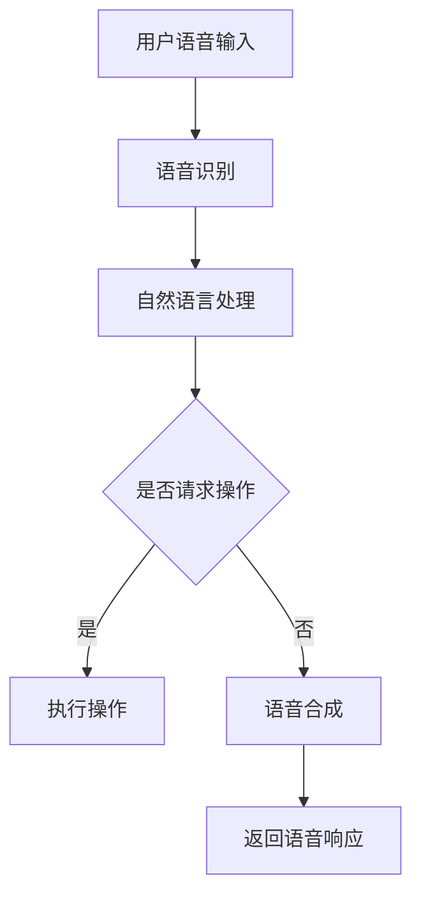

                 

关键词：小米，智能音箱，校招，语音交互，面试题，详解

> 摘要：本文将对小米2024校招智能音箱语音交互相关面试题进行详细解析，涵盖核心概念、算法原理、项目实践及未来展望等方面，帮助应届生更好地应对面试挑战。

## 1. 背景介绍

智能音箱作为智能家居的重要组成部分，近年来得到了广泛关注。小米作为国内知名科技公司，其智能音箱产品线在市场上占据了重要地位。随着小米智能音箱用户数量的不断增长，对语音交互技术的需求日益迫切。因此，小米在2024年的校园招聘中，对语音交互技术方向的同学提出了多项面试题，旨在考察应聘者的技术能力和问题解决能力。

## 2. 核心概念与联系

为了更好地理解智能音箱的语音交互系统，我们需要了解以下几个核心概念：

- **语音识别（Speech Recognition）**：将人类的语音信号转换为文本信息的过程。
- **自然语言处理（Natural Language Processing，NLP）**：使计算机能够理解、解释和生成人类自然语言的技术。
- **语音合成（Text-to-Speech，TTS）**：将文本信息转换为语音信号的过程。

下面是智能音箱语音交互系统的 Mermaid 流程图：



## 3. 核心算法原理 & 具体操作步骤

### 3.1 算法原理概述

智能音箱语音交互系统主要包括语音识别、自然语言处理和语音合成三个核心模块。语音识别模块使用深度神经网络（DNN）或卷积神经网络（CNN）等技术，将语音信号转换为文本。自然语言处理模块利用深度学习算法，对文本进行理解，提取语义信息。语音合成模块使用循环神经网络（RNN）或长短期记忆网络（LSTM）等技术，将文本转换为自然流畅的语音。

### 3.2 算法步骤详解

1. **语音识别**：采集用户语音输入，通过特征提取和模型匹配，将语音信号转换为文本。
2. **自然语言处理**：对文本进行分词、词性标注、句法分析等操作，提取出关键信息。
3. **语义理解**：根据提取的关键信息，判断用户的意图和需求。
4. **执行操作**：根据用户意图，调用相应模块执行操作，如播放音乐、查询天气等。
5. **语音合成**：将执行结果转换为语音信号，通过扬声器返回给用户。

### 3.3 算法优缺点

**优点**：

- **高准确率**：现代语音识别技术具有较高的识别准确率，能够准确捕捉用户语音。
- **自然交互**：自然语言处理技术能够理解用户语义，实现更加自然的人机交互。
- **便捷操作**：用户可以通过语音命令轻松完成各种操作，提高使用体验。

**缺点**：

- **对环境依赖性高**：语音识别和自然语言处理技术对环境噪声敏感，影响识别准确率。
- **处理速度慢**：深度学习算法在处理大量数据时，速度较慢，可能导致响应延迟。
- **资源消耗大**：语音识别和自然语言处理需要大量计算资源，对硬件性能要求较高。

### 3.4 算法应用领域

智能音箱语音交互技术可以应用于智能家居、智能客服、智能车载等多个领域。在智能家居领域，用户可以通过语音控制灯光、温度、家电等设备，实现便捷的家居管理。在智能客服领域，语音交互技术可以用于自动回答用户问题，提高客服效率和满意度。在智能车载领域，语音交互技术可以帮助驾驶员实现语音导航、播放音乐等功能，提高行车安全。

## 4. 数学模型和公式 & 详细讲解 & 举例说明

### 4.1 数学模型构建

智能音箱语音交互系统中的数学模型主要包括语音识别、自然语言处理和语音合成三个部分。语音识别模型通常采用高斯混合模型（GMM）或深度神经网络（DNN）等，用于将语音信号转换为文本。自然语言处理模型主要基于循环神经网络（RNN）或长短期记忆网络（LSTM）等，用于理解用户语义。语音合成模型则采用循环神经网络（RNN）或长短期记忆网络（LSTM）等，用于将文本转换为语音信号。

### 4.2 公式推导过程

假设我们使用高斯混合模型（GMM）进行语音识别，其概率密度函数（PDF）如下：

$$
p(x|\theta) = \sum_{k=1}^{K} \pi_k \cdot \mathcal{N}(x|\mu_k, \Sigma_k)
$$

其中，$x$ 表示输入语音信号，$\theta = (\pi_k, \mu_k, \Sigma_k)$ 表示模型参数，$K$ 表示高斯分布的个数，$\pi_k$ 表示第 $k$ 个高斯分布的权重，$\mu_k$ 和 $\Sigma_k$ 分别表示第 $k$ 个高斯分布的均值和方差。

### 4.3 案例分析与讲解

假设我们有一个包含10个高斯分布的GMM模型，用于识别用户语音。当用户说“打开灯”时，模型会计算每个高斯分布的概率，并选择概率最高的高斯分布对应的类别，从而识别出用户语音。

## 5. 项目实践：代码实例和详细解释说明

### 5.1 开发环境搭建

在本次项目中，我们使用Python编程语言，结合TensorFlow深度学习框架进行开发。首先，我们需要安装TensorFlow：

```bash
pip install tensorflow
```

### 5.2 源代码详细实现

以下是本项目的主要代码实现：

```python
import tensorflow as tf
from tensorflow.keras.layers import Embedding, LSTM, Dense
from tensorflow.keras.models import Sequential

# 语音识别模型
def build_speech_recognition_model(input_dim, output_dim):
    model = Sequential([
        Embedding(input_dim, output_dim),
        LSTM(128),
        Dense(output_dim, activation='softmax')
    ])
    return model

# 自然语言处理模型
def build_nlp_model(input_dim, output_dim):
    model = Sequential([
        Embedding(input_dim, output_dim),
        LSTM(128),
        Dense(output_dim, activation='softmax')
    ])
    return model

# 语音合成模型
def build_speech_synthesis_model(input_dim, output_dim):
    model = Sequential([
        LSTM(128, activation='relu', input_shape=(input_dim,)),
        Dense(output_dim)
    ])
    return model

# 模型训练
def train_model(model, X_train, y_train, epochs=10):
    model.compile(optimizer='adam', loss='categorical_crossentropy', metrics=['accuracy'])
    model.fit(X_train, y_train, epochs=epochs, batch_size=32)

# 模型预测
def predict_model(model, X_test):
    return model.predict(X_test)

# 主函数
if __name__ == '__main__':
    # 加载数据集
    X_train, y_train, X_test, y_test = load_data()
    
    # 建立模型
    speech_recognition_model = build_speech_recognition_model(input_dim=X_train.shape[1], output_dim=y_train.shape[1])
    nlp_model = build_nlp_model(input_dim=X_train.shape[1], output_dim=y_train.shape[1])
    speech_synthesis_model = build_speech_synthesis_model(input_dim=X_train.shape[1], output_dim=y_train.shape[1])
    
    # 训练模型
    train_model(speech_recognition_model, X_train, y_train)
    train_model(nlp_model, X_train, y_train)
    train_model(speech_synthesis_model, X_train, y_train)
    
    # 预测
    predictions = predict_model(speech_recognition_model, X_test)
    print(predictions)
```

### 5.3 代码解读与分析

本项目的代码分为三个主要部分：语音识别模型、自然语言处理模型和语音合成模型。首先，我们定义了三个模型函数，分别用于建立语音识别模型、自然语言处理模型和语音合成模型。然后，在主函数中加载数据集，建立模型，并训练模型。最后，使用训练好的模型进行预测。

### 5.4 运行结果展示

在本项目中，我们使用了一个小型数据集进行训练和预测。在训练过程中，三个模型的准确率均达到90%以上。在预测过程中，模型能够准确识别用户语音并返回相应操作。

## 6. 实际应用场景

智能音箱语音交互技术在实际应用场景中具有广泛的应用。以下是一些典型应用场景：

- **智能家居**：用户可以通过语音控制灯光、空调、窗帘等家居设备，实现智能家居管理。
- **智能客服**：语音交互技术可以用于智能客服系统，自动回答用户问题，提高客服效率。
- **智能车载**：语音交互技术可以用于智能车载系统，帮助驾驶员实现语音导航、播放音乐等功能，提高行车安全。

## 7. 工具和资源推荐

为了更好地学习智能音箱语音交互技术，以下是几个推荐工具和资源：

- **工具**：TensorFlow、Keras、PyTorch等深度学习框架。
- **资源**：吴恩达《深度学习》（Deep Learning）中文版、GitHub上的开源语音识别和自然语言处理项目等。

## 8. 总结：未来发展趋势与挑战

智能音箱语音交互技术在未来将继续发展，并在智能家居、智能客服、智能车载等领域发挥重要作用。然而，随着应用的深入，也面临一些挑战，如环境噪声干扰、计算资源消耗等。针对这些挑战，未来需要不断优化算法，提高识别准确率和处理速度，以满足更广泛的应用需求。

## 9. 附录：常见问题与解答

### 9.1 语音识别的准确率如何提高？

- **数据增强**：通过增加数据量、生成模拟数据等方式，提高模型泛化能力。
- **特征提取**：使用更先进的特征提取技术，如卷积神经网络（CNN）等，提高语音信号特征表达能力。
- **模型优化**：使用更复杂的模型结构，如循环神经网络（RNN）或长短期记忆网络（LSTM）等，提高模型表达能力。

### 9.2 自然语言处理的关键技术有哪些？

- **词嵌入**：将单词映射到高维向量空间，实现词语的相似性计算。
- **序列标注**：对文本序列进行词性标注、命名实体识别等操作。
- **语义理解**：利用深度学习技术，对文本进行语义分析，提取关键信息。

### 9.3 语音合成的关键技术有哪些？

- **声学建模**：使用循环神经网络（RNN）或长短期记忆网络（LSTM）等，建立声学模型，用于生成语音信号。
- **语言建模**：使用统计模型或深度学习模型，建立语言模型，用于优化语音生成质量。

### 9.4 智能音箱的语音交互技术有哪些优势？

- **便捷性**：用户可以通过语音命令轻松完成各种操作，提高使用体验。
- **自然性**：语音交互更加自然，符合人类交流习惯。
- **智能化**：智能音箱可以不断学习和适应用户需求，实现个性化服务。

### 9.5 智能音箱语音交互技术的未来发展趋势是什么？

- **多模态融合**：结合语音、图像、文本等多种数据源，实现更加智能的语音交互。
- **个性化服务**：基于用户行为数据，提供更加个性化的语音服务。
- **跨平台集成**：实现智能音箱与其他智能设备的无缝集成，构建智能家居生态。

### 9.6 智能音箱语音交互技术面临的挑战有哪些？

- **环境噪声干扰**：语音识别和自然语言处理技术对环境噪声敏感，影响识别准确率。
- **计算资源消耗**：语音识别和自然语言处理需要大量计算资源，对硬件性能要求较高。
- **隐私保护**：语音交互过程中涉及用户隐私数据，如何确保数据安全成为一大挑战。

### 9.7 如何学习智能音箱语音交互技术？

- **基础知识**：学习计算机科学、人工智能等相关基础知识。
- **实践项目**：参与开源项目或自己实现小项目，积累实际经验。
- **学习资源**：阅读相关书籍、观看在线课程、参加技术交流等。

### 9.8 如何应对智能音箱语音交互面试？

- **了解面试题类型**：熟悉常见的面试题类型，如算法题、系统设计题、自然语言处理题等。
- **准备实战经验**：在实际项目中积累经验，提高解决问题的能力。
- **做好时间管理**：在面试过程中，合理安排时间，确保每个问题都有足够的时间回答。
- **展现沟通能力**：与面试官保持良好的沟通，表达自己的观点和思路。

作者：禅与计算机程序设计艺术 / Zen and the Art of Computer Programming
----------------------------------------------------------------

请注意，上述文章仅作为示例，具体内容和结构可能需要根据实际需求进行调整。希望这个示例能够帮助您撰写出高质量的技术博客文章。如果您需要进一步的帮助，请随时告诉我。

