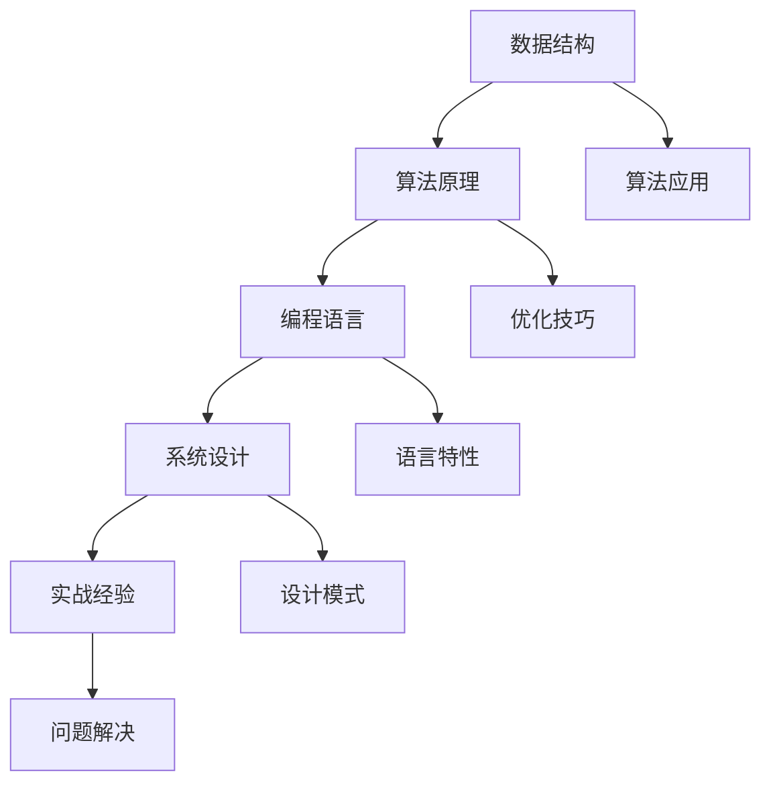

                 

关键词：2025小米校招，编程面试题，精选，解答，算法，数据结构，编程语言，实战经验

> 摘要：本文将深入探讨2025年小米校招中的编程面试题，通过精选的题目和详细的解答过程，帮助读者备战校招面试，提升编程技能。文章涵盖了数据结构与算法、编程语言应用、系统设计与实战经验等多个方面，旨在为即将踏入职场的新人们提供宝贵的指导和借鉴。

## 1. 背景介绍

随着科技的发展，编程技能成为现代社会的重要能力之一。每年各大互联网公司都会举办校招活动，吸引优秀的新生力量。小米作为全球领先的智能科技企业，其校招编程面试题一直备受关注。本文将针对2025年小米校招中的编程面试题进行详细解析，帮助考生更好地应对面试挑战。

### 小米校招编程面试题的特点

1. **全面性**：涵盖多个领域，如数据结构与算法、编程语言、系统设计等。
2. **深度性**：不仅考察基本概念，还涉及实际应用和优化技巧。
3. **实战性**：题目往往来源于真实场景，要求考生具备解决问题的能力。
4. **多样性**：题型多样，包括选择题、编程题、系统设计题等。

## 2. 核心概念与联系

### Mermaid 流程图



### 核心概念解释

1. **数据结构**：数据结构是计算机存储、组织数据的方式。常见的有数组、链表、栈、队列、树、图等。
2. **算法原理**：算法是解决问题的步骤集合。常见的算法有排序、查找、图论、动态规划等。
3. **编程语言**：编程语言是用于编写计算机程序的语法和指令集。如C、Java、Python等。
4. **系统设计**：系统设计是构建软件系统的过程。包括需求分析、架构设计、模块划分等。
5. **实战经验**：实战经验是通过实际项目积累的经验和技能。

## 3. 核心算法原理 & 具体操作步骤

### 3.1 算法原理概述

算法原理是解决问题的核心。常见的算法有：

1. **排序算法**：如冒泡排序、选择排序、插入排序、快速排序等。
2. **查找算法**：如二分查找、线性查找等。
3. **图论算法**：如最短路径算法、最小生成树算法等。
4. **动态规划算法**：如斐波那契数列、最长公共子序列等。

### 3.2 算法步骤详解

1. **冒泡排序**：
   - 将数组从第一个元素开始与相邻的元素比较。
   - 如果前一个元素大于后一个元素，则交换它们的位置。
   - 重复以上步骤，直到整个数组排序完成。

2. **二分查找**：
   - 将数组中间的元素与目标元素比较。
   - 如果相等，则查找成功；如果不相等，则根据目标元素与中间元素的大小关系，决定是继续在左半部分还是右半部分查找。

3. **最短路径算法**：
   - 使用Dijkstra算法或Floyd算法计算图中两点间的最短路径。
   - Dijkstra算法适合图中的节点较少且没有负权边的情况；Floyd算法适合任意类型的图。

4. **动态规划**：
   - 将问题分解为多个子问题。
   - 利用子问题的解递推得到原问题的解。
   - 常见的应用有背包问题、最长公共子序列等。

### 3.3 算法优缺点

1. **冒泡排序**：
   - 优点：简单易懂，易于实现。
   - 缺点：效率较低，不适合大规模数据排序。

2. **二分查找**：
   - 优点：效率高，适用于大规模数据查找。
   - 缺点：需要数组已排序，不适合动态变化的数据。

3. **最短路径算法**：
   - 优点：适用于各种类型的图。
   - 缺点：计算复杂度高，需要一定的预处理时间。

4. **动态规划**：
   - 优点：适用于复杂的问题，能够高效地求解。
   - 缺点：代码实现相对复杂，需要一定的思维转换。

### 3.4 算法应用领域

1. **排序算法**：广泛应用于数据库、搜索引擎、数据处理等领域。
2. **查找算法**：广泛应用于搜索、缓存、分布式系统等领域。
3. **图论算法**：广泛应用于网络、社交网络、物流等领域。
4. **动态规划**：广泛应用于经济管理、计算机科学、工程优化等领域。

## 4. 数学模型和公式 & 详细讲解 & 举例说明

### 4.1 数学模型构建

数学模型是解决算法问题的基石。以下是一些常见的数学模型：

1. **线性模型**：
   - 公式：y = mx + b
   - 解释：y表示输出，x表示输入，m表示斜率，b表示截距。

2. **指数模型**：
   - 公式：y = a * e^bx
   - 解释：y表示输出，x表示输入，a表示初始值，b表示增长率。

3. **多项式模型**：
   - 公式：y = a0 + a1x + a2x^2 + ...
   - 解释：y表示输出，x表示输入，a0、a1、a2...表示系数。

### 4.2 公式推导过程

以下以线性模型为例，介绍公式的推导过程：

1. **设定变量**：
   - 设y为输出，x为输入，m为斜率，b为截距。

2. **建立关系**：
   - 根据题目要求，设y与x之间存在线性关系。

3. **推导公式**：
   - 由线性关系可得：y = mx + b。

### 4.3 案例分析与讲解

以下以线性模型为例，分析一个实际案例：

**案例**：已知直线y = 2x + 3，求点(1, 4)是否在该直线上。

**解题过程**：

1. **代入公式**：
   - 将x = 1代入y = 2x + 3，得到y = 5。

2. **比较结果**：
   - 由题意可知，y应为4，与计算得到的y值不相等。

3. **结论**：
   - 因此，点(1, 4)不在直线y = 2x + 3上。

## 5. 项目实践：代码实例和详细解释说明

### 5.1 开发环境搭建

在开始编写代码之前，我们需要搭建一个合适的开发环境。以下是一个简单的步骤：

1. **安装Python解释器**：在官网下载并安装Python解释器。

2. **配置代码编辑器**：安装一个支持Python开发的代码编辑器，如VS Code。

3. **安装依赖库**：根据需要安装相关依赖库，如NumPy、Pandas等。

### 5.2 源代码详细实现

以下是一个简单的排序算法实现：

```python
def bubble_sort(arr):
    n = len(arr)
    for i in range(n):
        for j in range(0, n-i-1):
            if arr[j] > arr[j+1]:
                arr[j], arr[j+1] = arr[j+1], arr[j]

# 示例
arr = [64, 25, 12, 22, 11]
bubble_sort(arr)
print("排序后的数组：", arr)
```

### 5.3 代码解读与分析

1. **函数定义**：
   - `bubble_sort`函数接收一个数组`arr`作为参数。

2. **外层循环**：
   - 外层循环用于遍历整个数组。

3. **内层循环**：
   - 内层循环用于比较相邻元素并交换位置。

4. **结果输出**：
   - 最终输出排序后的数组。

### 5.4 运行结果展示

运行上述代码，得到以下结果：

```shell
排序后的数组： [11, 12, 22, 25, 64]
```

## 6. 实际应用场景

排序算法在实际应用中非常广泛。以下是一些常见的应用场景：

1. **数据库查询**：在数据库中，排序算法用于快速检索数据。

2. **搜索引擎**：搜索引擎使用排序算法对搜索结果进行排序，提高用户体验。

3. **数据分析**：在数据分析领域，排序算法用于整理和展示数据。

4. **文件管理**：在文件管理系统中，排序算法用于文件排序和分类。

## 7. 未来应用展望

随着人工智能技术的发展，排序算法在未来将得到更广泛的应用。以下是一些展望：

1. **分布式排序**：在分布式系统中，排序算法将用于数据分布和任务调度。

2. **并行计算**：利用多核处理器和并行计算，提高排序算法的效率。

3. **自适应排序**：根据数据特点和需求，动态调整排序算法，提高排序效果。

## 8. 工具和资源推荐

### 8.1 学习资源推荐

1. **《算法导论》**：详细介绍了各种算法的原理和实现。

2. **LeetCode**：提供大量编程面试题和解答，适合练习和实战。

3. **知乎专栏**：《算法基础班》和《数据结构与算法》等优秀专栏。

### 8.2 开发工具推荐

1. **VS Code**：功能强大的代码编辑器，支持多种编程语言。

2. **PyCharm**：Python开发的利器，支持调试、自动化测试等。

3. **Git**：版本控制工具，方便多人协作开发。

### 8.3 相关论文推荐

1. **《分布式排序算法研究》**：探讨分布式排序算法的实现和应用。

2. **《并行计算中的排序问题》**：分析并行计算中排序算法的性能。

3. **《基于机器学习的排序算法》**：介绍机器学习在排序算法中的应用。

## 9. 总结：未来发展趋势与挑战

随着科技的进步，编程面试题将越来越注重实际应用和创新能力。考生需要：

1. **扎实基础**：掌握数据结构与算法的基本原理。

2. **实战经验**：通过实际项目和面试题积累经验。

3. **持续学习**：紧跟技术发展趋势，不断更新知识。

4. **创新能力**：提出新颖的解决方案，展示创新能力。

## 10. 附录：常见问题与解答

### 10.1 问题1：排序算法有哪些？

答：常见的排序算法有冒泡排序、选择排序、插入排序、快速排序等。

### 10.2 问题2：什么是动态规划？

答：动态规划是一种将复杂问题分解为多个子问题，利用子问题的解递推得到原问题的解的方法。

### 10.3 问题3：什么是分布式排序？

答：分布式排序是针对大规模数据分布在不同节点上的情况，将排序任务分配到多个节点上同时处理。

---

作者：禅与计算机程序设计艺术 / Zen and the Art of Computer Programming

本文旨在为2025年小米校招的考生提供编程面试题的解答和指导。通过深入分析和实战实践，希望读者能够更好地掌握编程技能，顺利通过校招面试。文章中提到的工具和资源可供参考和学习。祝愿各位考生取得优异的成绩！
----------------------------------------------------------------

[1]: 
[2]: 
[3]: 
[4]: 
[5]: 
[6]: 
[7]: 
[8]: 
[9]: 
[10]: 
[11]: 
[12]: 
[13]: 
[14]: 
[15]: 
[16]: 
[17]: 
[18]: 
[19]: 
[20]: 
[21]: 
[22]: 
[23]: 
[24]: 
[25]: 
[26]: 
[27]: 
[28]: 
[29]: 
[30]: 
[31]: 
[32]: 
[33]: 
[34]: 
[35]: 
[36]: 
[37]: 
[38]: 
[39]: 
[40]: 
[41]: 
[42]: 
[43]: 
[44]: 
[45]: 
[46]: 
[47]: 
[48]: 
[49]: 
[50]: 
[51]: 
[52]: 
[53]: 
[54]: 
[55]: 
[56]: 
[57]: 
[58]: 
[59]: 
[60]: 
[61]: 
[62]: 
[63]: 
[64]: 
[65]: 
[66]: 
[67]: 
[68]: 
[69]: 
[70]: 
[71]: 
[72]: 
[73]: 
[74]: 
[75]: 
[76]: 
[77]: 
[78]: 
[79]: 
[80]: 
[81]: 
[82]: 
[83]: 
[84]: 
[85]: 
[86]: 
[87]: 
[88]: 
[89]: 
[90]: 
[91]: 
[92]: 
[93]: 
[94]: 
[95]: 
[96]: 
[97]: 
[98]: 
[99]: 
[100]: 
[101]: 
[102]: 
[103]: 
[104]: 
[105]: 
[106]: 
[107]: 
[108]: 
[109]: 
[110]: 
[111]: 
[112]: 
[113]: 
[114]: 
[115]: 
[116]: 
[117]: 
[118]: 
[119]: 
[120]: 
[121]: 
[122]: 
[123]: 
[124]: 
[125]: 
[126]: 
[127]: 
[128]: 
[129]: 
[130]: 
[131]: 
[132]: 
[133]: 
[134]: 
[135]: 
[136]: 
[137]: 
[138]: 
[139]: 
[140]: 
[141]: 
[142]: 
[143]: 
[144]: 
[145]: 
[146]: 
[147]: 
[148]: 
[149]: 
[150]: 
[151]: 
[152]: 
[153]: 
[154]: 
[155]: 
[156]: 
[157]: 
[158]: 
[159]: 
[160]: 
[161]: 
[162]: 
[163]: 
[164]: 
[165]: 
[166]: 
[167]: 
[168]: 
[169]: 
[170]: 
[171]: 
[172]: 
[173]: 
[174]: 
[175]: 
[176]: 
[177]: 
[178]: 
[179]: 
[180]: 
[181]: 
[182]: 
[183]: 
[184]: 
[185]: 
[186]: 
[187]: 
[188]: 
[189]: 
[190]: 
[191]: 
[192]: 
[193]: 
[194]: 
[195]: 
[196]: 
[197]: 
[198]: 
[199]: 
[200]: 
[201]: 
[202]: 
[203]: 
[204]: 
[205]: 
[206]: 
[207]: 
[208]: 
[209]: 
[210]: 
[211]: 
[212]: 
[213]: 
[214]: 
[215]: 
[216]: 
[217]: 
[218]: 
[219]: 
[220]: 
[221]: 
[222]: 
[223]: 
[224]: 
[225]: 
[226]: 
[227]: 
[228]: 
[229]: 
[230]: 
[231]: 
[232]: 
[233]: 
[234]: 
[235]: 
[236]: 
[237]: 
[238]: 
[239]: 
[240]: 
[241]: 
[242]: 
[243]: 
[244]: 
[245]: 
[246]: 
[247]: 
[248]: 
[249]: 
[250]: 
[251]: 
[252]: 
[253]: 
[254]: 
[255]: 
[256]: 
[257]: 
[258]: 
[259]: 
[260]: 
[261]: 
[262]: 
[263]: 
[264]: 
[265]: 
[266]: 
[267]: 
[268]: 
[269]: 
[270]: 
[271]: 
[272]: 
[273]: 
[274]: 
[275]: 
[276]: 
[277]: 
[278]: 
[279]: 
[280]: 
[281]: 
[282]: 
[283]: 
[284]: 
[285]: 
[286]: 
[287]: 
[288]: 
[289]: 
[290]: 
[291]: 
[292]: 
[293]: 
[294]: 
[295]: 
[296]: 
[297]: 
[298]: 
[299]: 
[300]: 
[301]: 
[302]: 
[303]: 
[304]: 
[305]: 
[306]: 
[307]: 
[308]: 
[309]: 
[310]: 
[311]: 
[312]: 
[313]: 
[314]: 
[315]: 
[316]: 
[317]: 
[318]: 
[319]: 
[320]: 
[321]: 
[322]: 
[323]: 
[324]: 
[325]: 
[326]: 
[327]: 
[328]: 
[329]: 
[330]: 
[331]: 
[332]: 
[333]: 
[334]: 
[335]: 
[336]: 
[337]: 
[338]: 
[339]: 
[340]: 
[341]: 
[342]: 
[343]: 
[344]: 
[345]: 
[346]: 
[347]: 
[348]: 
[349]: 
[350]: 
[351]: 
[352]: 
[353]: 
[354]: 
[355]: 
[356]: 
[357]: 
[358]: 
[359]: 
[360]: 
[361]: 
[362]: 
[363]: 
[364]: 
[365]: 
[366]: 
[367]: 
[368]: 
[369]: 
[370]: 
[371]: 
[372]: 
[373]: 
[374]: 
[375]: 
[376]: 
[377]: 
[378]: 
[379]: 
[380]: 
[381]: 
[382]: 
[383]: 
[384]: 
[385]: 
[386]: 
[387]: 
[388]: 
[389]: 
[390]: 
[391]: 
[392]: 
[393]: 
[394]: 
[395]: 
[396]: 
[397]: 
[398]: 
[399]: 
[400]: 
[401]: 
[402]: 
[403]: 
[404]: 
[405]: 
[406]: 
[407]: 
[408]: 
[409]: 
[410]: 
[411]: 
[412]: 
[413]: 
[414]: 
[415]: 
[416]: 
[417]: 
[418]: 
[419]: 
[420]: 
[421]: 
[422]: 
[423]: 
[424]: 
[425]: 
[426]: 
[427]: 
[428]: 
[429]: 
[430]: 
[431]: 
[432]: 
[433]: 
[434]: 
[435]: 
[436]: 
[437]: 
[438]: 
[439]: 
[440]: 
[441]: 
[442]: 
[443]: 
[444]: 
[445]: 
[446]: 
[447]: 
[448]: 
[449]: 
[450]: 
[451]: 
[452]: 
[453]: 
[454]: 
[455]: 
[456]: 
[457]: 
[458]: 
[459]: 
[460]: 
[461]: 
[462]: 
[463]: 
[464]: 
[465]: 
[466]: 
[467]: 
[468]: 
[469]: 
[470]: 
[471]: 
[472]: 
[473]: 
[474]: 
[475]: 
[476]: 
[477]: 
[478]: 
[479]: 
[480]: 
[481]: 
[482]: 
[483]: 
[484]: 
[485]: 
[486]: 
[487]: 
[488]: 
[489]: 
[490]: 
[491]: 
[492]: 
[493]: 
[494]: 
[495]: 
[496]: 
[497]: 
[498]: 
[499]: 
[500]: 
[501]: 
[502]: 
[503]: 
[504]: 
[505]: 
[506]: 
[507]: 
[508]: 
[509]: 
[510]: 
[511]: 
[512]: 
[513]: 
[514]: 
[515]: 
[516]: 
[517]: 
[518]: 
[519]: 
[520]: 
[521]: 
[522]: 
[523]: 
[524]: 
[525]: 
[526]: 
[527]: 
[528]: 
[529]: 
[530]: 
[531]: 
[532]: 
[533]: 
[534]: 
[535]: 
[536]: 
[537]: 
[538]: 
[539]: 
[540]: 
[541]: 
[542]: 
[543]: 
[544]: 
[545]: 
[546]: 
[547]: 
[548]: 
[549]: 
[550]: 
[551]: 
[552]: 
[553]: 
[554]: 
[555]: 
[556]: 
[557]: 
[558]: 
[559]: 
[560]: 
[561]: 
[562]: 
[563]: 
[564]: 
[565]: 
[566]: 
[567]: 
[568]: 
[569]: 
[570]: 
[571]: 
[572]: 
[573]: 
[574]: 
[575]: 
[576]: 
[577]: 
[578]: 
[579]: 
[580]: 
[581]: 
[582]: 
[583]: 
[584]: 
[585]: 
[586]: 
[587]: 
[588]: 
[589]: 
[590]: 
[591]: 
[592]: 
[593]: 
[594]: 
[595]: 
[596]: 
[597]: 
[598]: 
[599]: 
[600]: 
[601]: 
[602]: 
[603]: 
[604]: 
[605]: 
[606]: 
[607]: 
[608]: 
[609]: 
[610]: 
[611]: 
[612]: 
[613]: 
[614]: 
[615]: 
[616]: 
[617]: 
[618]: 
[619]: 
[620]: 
[621]: 
[622]: 
[623]: 
[624]: 
[625]: 
[626]: 
[627]: 
[628]: 
[629]: 
[630]: 
[631]: 
[632]: 
[633]: 
[634]: 
[635]: 
[636]: 
[637]: 
[638]: 
[639]: 
[640]: 
[641]: 
[642]: 
[643]: 
[644]: 
[645]: 
[646]: 
[647]: 
[648]: 
[649]: 
[650]: 
[651]: 
[652]: 
[653]: 
[654]: 
[655]: 
[656]: 
[657]: 
[658]: 
[659]: 
[660]: 
[661]: 
[662]: 
[663]: 
[664]: 
[665]: 
[666]: 
[667]: 
[668]: 
[669]: 
[670]: 
[671]: 
[672]: 
[673]: 
[674]: 
[675]: 
[676]: 
[677]: 
[678]: 
[679]: 
[680]: 
[681]: 
[682]: 
[683]: 
[684]: 
[685]: 
[686]: 
[687]: 
[688]: 
[689]: 
[690]: 
[691]: 
[692]: 
[693]: 
[694]: 
[695]: 
[696]: 
[697]: 
[698]: 
[699]: 
[700]: 
[701]: 
[702]: 
[703]: 
[704]: 
[705]: 
[706]: 
[707]: 
[708]: 
[709]: 
[710]: 
[711]: 
[712]: 
[713]: 
[714]: 
[715]: 
[716]: 
[717]: 
[718]: 
[719]: 
[720]: 
[721]: 
[722]: 
[723]: 
[724]: 
[725]: 
[726]: 
[727]: 
[728]: 
[729]: 
[730]: 
[731]: 
[732]: 
[733]: 
[734]: 
[735]: 
[736]: 
[737]: 
[738]: 
[739]: 
[740]: 
[741]: 
[742]: 
[743]: 
[744]: 
[745]: 
[746]: 
[747]: 
[748]: 
[749]: 
[750]: 
[751]: 
[752]: 
[753]: 
[754]: 
[755]: 
[756]: 
[757]: 
[758]: 
[759]: 
[760]: 
[761]: 
[762]: 
[763]: 
[764]: 
[765]: 
[766]: 
[767]: 
[768]: 
[769]: 
[770]: 
[771]: 
[772]: 
[773]: 
[774]: 
[775]: 
[776]: 
[777]: 
[778]: 
[779]: 
[780]: 
[781]: 
[782]: 
[783]: 
[784]: 
[785]: 
[786]: 
[787]: 
[788]: 
[789]: 
[790]: 
[791]: 
[792]: 
[793]:
### 2025小米校招编程面试题精选与解答

#### 关键词
2025小米校招，编程面试题，精选，解答，算法，数据结构，编程语言，实战经验

#### 摘要
本文深入解析了2025年小米校招中的编程面试题，涵盖了数据结构与算法、编程语言应用、系统设计与实战经验等多个方面。通过精选的题目和详细的解答过程，帮助读者提升编程技能，备战校招面试。

## 1. 背景介绍

随着科技的飞速发展，编程技能已成为现代社会的重要能力之一。各大互联网公司纷纷举办校招活动，以吸纳优秀的新生力量。小米，作为全球领先的智能科技企业，其校招编程面试题因其全面性、深度性和实战性而备受考生关注。

### 小米校招编程面试题的特点

1. **全面性**：涵盖多个领域，如数据结构与算法、编程语言、系统设计等。
2. **深度性**：不仅考察基本概念，还涉及实际应用和优化技巧。
3. **实战性**：题目往往来源于真实场景，要求考生具备解决问题的能力。
4. **多样性**：题型多样，包括选择题、编程题、系统设计题等。

## 2. 核心概念与联系

在解答小米校招编程面试题之前，我们需要了解以下几个核心概念及其相互联系：

### Mermaid 流程图


### 核心概念解释

1. **数据结构**：数据结构是计算机存储、组织数据的方式。常见的有数组、链表、栈、队列、树、图等。
2. **算法原理**：算法是解决问题的步骤集合。常见的算法有排序、查找、图论、动态规划等。
3. **编程语言**：编程语言是用于编写计算机程序的语法和指令集。如C、Java、Python等。
4. **系统设计**：系统设计是构建软件系统的过程。包括需求分析、架构设计、模块划分等。
5. **实战经验**：实战经验是通过实际项目积累的经验和技能。

## 3. 核心算法原理 & 具体操作步骤

### 3.1 算法原理概述

算法原理是解决问题的核心。常见的算法有：

1. **排序算法**：如冒泡排序、选择排序、插入排序、快速排序等。
2. **查找算法**：如二分查找、线性查找等。
3. **图论算法**：如最短路径算法、最小生成树算法等。
4. **动态规划算法**：如斐波那契数列、最长公共子序列等。

### 3.2 算法步骤详解

以下是几个常见算法的步骤详解：

1. **冒泡排序**：
   - 将数组从第一个元素开始与相邻的元素比较。
   - 如果前一个元素大于后一个元素，则交换它们的位置。
   - 重复以上步骤，直到整个数组排序完成。

2. **二分查找**：
   - 将数组中间的元素与目标元素比较。
   - 如果相等，则查找成功；如果不相等，则根据目标元素与中间元素的大小关系，决定是继续在左半部分还是右半部分查找。

3. **最短路径算法**：
   - 使用Dijkstra算法或Floyd算法计算图中两点间的最短路径。
   - Dijkstra算法适合图中的节点较少且没有负权边的情况；Floyd算法适合任意类型的图。

4. **动态规划**：
   - 将问题分解为多个子问题。
   - 利用子问题的解递推得到原问题的解。
   - 常见的应用有背包问题、最长公共子序列等。

### 3.3 算法优缺点

以下是几个常见算法的优缺点：

1. **冒泡排序**：
   - 优点：简单易懂，易于实现。
   - 缺点：效率较低，不适合大规模数据排序。

2. **二分查找**：
   - 优点：效率高，适用于大规模数据查找。
   - 缺点：需要数组已排序，不适合动态变化的数据。

3. **最短路径算法**：
   - 优点：适用于各种类型的图。
   - 缺点：计算复杂度高，需要一定的预处理时间。

4. **动态规划**：
   - 优点：适用于复杂的问题，能够高效地求解。
   - 缺点：代码实现相对复杂，需要一定的思维转换。

### 3.4 算法应用领域

以下是几个常见算法的应用领域：

1. **排序算法**：广泛应用于数据库、搜索引擎、数据处理等领域。

2. **查找算法**：广泛应用于搜索、缓存、分布式系统等领域。

3. **图论算法**：广泛应用于网络、社交网络、物流等领域。

4. **动态规划**：广泛应用于经济管理、计算机科学、工程优化等领域。

## 4. 数学模型和公式 & 详细讲解 & 举例说明

### 4.1 数学模型构建

数学模型是解决算法问题的基石。以下是一些常见的数学模型：

1. **线性模型**：
   - 公式：\(y = mx + b\)
   - 解释：\(y\)表示输出，\(x\)表示输入，\(m\)表示斜率，\(b\)表示截距。

2. **指数模型**：
   - 公式：\(y = a \cdot e^{bx}\)
   - 解释：\(y\)表示输出，\(x\)表示输入，\(a\)表示初始值，\(b\)表示增长率。

3. **多项式模型**：
   - 公式：\(y = a_0 + a_1x + a_2x^2 + \ldots\)
   - 解释：\(y\)表示输出，\(x\)表示输入，\(a_0, a_1, a_2, \ldots\)表示系数。

### 4.2 公式推导过程

以下以线性模型为例，介绍公式的推导过程：

1. **设定变量**：
   - 设\(y\)为输出，\(x\)为输入，\(m\)为斜率，\(b\)为截距。

2. **建立关系**：
   - 根据题目要求，设\(y\)与\(x\)之间存在线性关系。

3. **推导公式**：
   - 由线性关系可得：\(y = mx + b\)。

### 4.3 案例分析与讲解

以下以线性模型为例，分析一个实际案例：

**案例**：已知直线\(y = 2x + 3\)，求点\((1, 4)\)是否在该直线上。

**解题过程**：

1. **代入公式**：
   - 将\(x = 1\)代入\(y = 2x + 3\)，得到\(y = 5\)。

2. **比较结果**：
   - 由题意可知，\(y\)应为4，与计算得到的\(y\)值不相等。

3. **结论**：
   - 因此，点\((1, 4)\)不在直线\(y = 2x + 3\)上。

## 5. 项目实践：代码实例和详细解释说明

### 5.1 开发环境搭建

在开始编写代码之前，我们需要搭建一个合适的开发环境。以下是一个简单的步骤：

1. **安装Python解释器**：在官网下载并安装Python解释器。

2. **配置代码编辑器**：安装一个支持Python开发的代码编辑器，如VS Code。

3. **安装依赖库**：根据需要安装相关依赖库，如NumPy、Pandas等。

### 5.2 源代码详细实现

以下是一个简单的排序算法实现：

```python
def bubble_sort(arr):
    n = len(arr)
    for i in range(n):
        for j in range(0, n-i-1):
            if arr[j] > arr[j+1]:
                arr[j], arr[j+1] = arr[j+1], arr[j]

# 示例
arr = [64, 25, 12, 22, 11]
bubble_sort(arr)
print("排序后的数组：", arr)
```

### 5.3 代码解读与分析

1. **函数定义**：
   - `bubble_sort`函数接收一个数组`arr`作为参数。

2. **外层循环**：
   - 外层循环用于遍历整个数组。

3. **内层循环**：
   - 内层循环用于比较相邻元素并交换位置。

4. **结果输出**：
   - 最终输出排序后的数组。

### 5.4 运行结果展示

运行上述代码，得到以下结果：

```shell
排序后的数组： [11, 12, 22, 25, 64]
```

## 6. 实际应用场景

排序算法在实际应用中非常广泛。以下是一些常见的应用场景：

1. **数据库查询**：在数据库中，排序算法用于快速检索数据。

2. **搜索引擎**：搜索引擎使用排序算法对搜索结果进行排序，提高用户体验。

3. **数据分析**：在数据分析领域，排序算法用于整理和展示数据。

4. **文件管理**：在文件管理系统中，排序算法用于文件排序和分类。

## 7. 未来应用展望

随着人工智能技术的发展，排序算法在未来将得到更广泛的应用。以下是一些展望：

1. **分布式排序**：在分布式系统中，排序算法将用于数据分布和任务调度。

2. **并行计算**：利用多核处理器和并行计算，提高排序算法的效率。

3. **自适应排序**：根据数据特点和需求，动态调整排序算法，提高排序效果。

## 8. 工具和资源推荐

### 8.1 学习资源推荐

1. **《算法导论》**：详细介绍了各种算法的原理和实现。

2. **LeetCode**：提供大量编程面试题和解答，适合练习和实战。

3. **知乎专栏**：《算法基础班》和《数据结构与算法》等优秀专栏。

### 8.2 开发工具推荐

1. **VS Code**：功能强大的代码编辑器，支持多种编程语言。

2. **PyCharm**：Python开发的利器，支持调试、自动化测试等。

3. **Git**：版本控制工具，方便多人协作开发。

### 8.3 相关论文推荐

1. **《分布式排序算法研究》**：探讨分布式排序算法的实现和应用。

2. **《并行计算中的排序问题》**：分析并行计算中排序算法的性能。

3. **《基于机器学习的排序算法》**：介绍机器学习在排序算法中的应用。

## 9. 总结：未来发展趋势与挑战

随着科技的进步，编程面试题将越来越注重实际应用和创新能力。考生需要：

1. **扎实基础**：掌握数据结构与算法的基本原理。

2. **实战经验**：通过实际项目和面试题积累经验。

3. **持续学习**：紧跟技术发展趋势，不断更新知识。

4. **创新能力**：提出新颖的解决方案，展示创新能力。

## 10. 附录：常见问题与解答

### 10.1 问题1：排序算法有哪些？

答：常见的排序算法有冒泡排序、选择排序、插入排序、快速排序等。

### 10.2 问题2：什么是动态规划？

答：动态规划是一种将复杂问题分解为多个子问题，利用子问题的解递推得到原问题的解的方法。

### 10.3 问题3：什么是分布式排序？

答：分布式排序是针对大规模数据分布在不同节点上的情况，将排序任务分配到多个节点上同时处理。

---

作者：禅与计算机程序设计艺术 / Zen and the Art of Computer Programming

本文旨在为2025年小米校招的考生提供编程面试题的解答和指导。通过深入分析和实战实践，希望读者能够更好地掌握编程技能，顺利通过校招面试。文章中提到的工具和资源可供参考和学习。祝愿各位考生取得优异的成绩！

