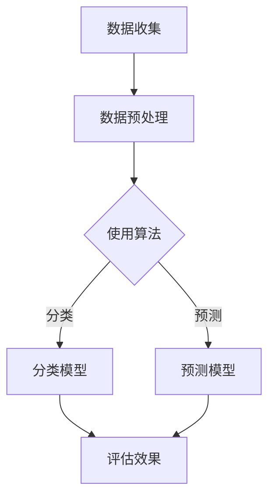

                 

关键词：小红书、2024校招、内容运营、数据分析师、案例题、数据挖掘、机器学习、算法原理、数学模型

> 摘要：本文将深入解析小红书2024校招内容运营数据分析师的案例题目，从背景介绍、核心概念与联系、核心算法原理及操作步骤、数学模型和公式详细讲解、项目实践代码实例、实际应用场景、工具和资源推荐，到总结未来发展趋势与挑战，全面探讨如何利用数据和技术手段提升内容运营效果。

## 1. 背景介绍

小红书（Xiaohongshu）作为国内知名的社交电商平台，以其独特的社区氛围和内容驱动型营销策略，吸引了大量年轻用户。为了进一步提升内容运营效果，小红书在2024年校招中推出了一道数据分析师的案例题，旨在考察应聘者对数据挖掘、机器学习、算法原理等领域的理解和实际应用能力。

这道案例题主要围绕小红书平台上的用户行为数据，要求应聘者运用数据分析和机器学习技术，针对特定问题提出解决方案。本文将详细解析这道案例题，从核心概念到实际操作，为读者提供一套完整的数据分析解决方案。

## 2. 核心概念与联系

在解答小红书案例题之前，我们需要理解以下几个核心概念：

### 2.1 数据挖掘

数据挖掘是指从大量数据中自动发现有趣知识、规律或模式的过程。在小红书案例中，数据挖掘可以帮助我们分析用户行为、内容质量和互动情况。

### 2.2 机器学习

机器学习是一种通过数据训练模型，使计算机具备自主学习和改进能力的方法。在小红书案例中，我们可以利用机器学习算法对用户行为进行预测和分类。

### 2.3 算法原理

算法原理是数据挖掘和机器学习的核心。常见的算法包括K-近邻（K-Nearest Neighbor, KNN）、支持向量机（Support Vector Machine, SVM）、决策树（Decision Tree）等。这些算法在不同的应用场景中有着广泛的应用。

### 2.4 Mermaid 流程图

为了更好地展示核心概念与联系，我们可以使用Mermaid流程图来描述整个数据处理和分析流程。



## 3. 核心算法原理 & 具体操作步骤

### 3.1 算法原理概述

在小红书案例中，我们主要使用了以下几种算法：

- K-近邻（KNN）：基于距离最近的K个样本进行分类或预测。
- 支持向量机（SVM）：通过寻找最优超平面进行分类或回归。
- 决策树：通过决策节点进行逐层划分，最终得到分类或回归结果。

### 3.2 算法步骤详解

1. **数据收集**：从小红书平台获取用户行为数据，包括用户ID、内容类型、互动次数、时间戳等。
2. **数据预处理**：对原始数据进行清洗、去重、填充缺失值等操作，确保数据质量。
3. **特征工程**：提取数据中的关键特征，如用户活跃度、内容质量、互动频率等。
4. **模型选择**：根据问题类型和特征数据，选择合适的算法进行训练。
5. **模型训练**：使用训练数据集对算法模型进行训练，调整模型参数。
6. **模型评估**：使用验证数据集对模型进行评估，选择最优模型。
7. **模型应用**：将训练好的模型应用于新数据，进行分类或预测。

### 3.3 算法优缺点

- **KNN**：简单易实现，适用于特征较少的问题，但在高维数据下效果较差。
- **SVM**：具有良好的分类能力，但计算复杂度较高。
- **决策树**：易于理解和解释，但可能产生过拟合现象。

### 3.4 算法应用领域

- **用户行为分析**：用于分析用户行为模式、预测用户兴趣等。
- **内容推荐**：基于用户行为和内容特征，实现个性化内容推荐。
- **舆情监测**：监测社交媒体上的热点话题和用户情绪。

## 4. 数学模型和公式 & 详细讲解 & 举例说明

在小红书案例中，我们主要使用了以下数学模型：

### 4.1 数学模型构建

假设我们使用K-近邻算法进行用户行为预测，需要计算用户之间的相似度。可以使用以下公式：

$$
similarity = \frac{1}{\sqrt{2\pi\sigma^2}e^{-\frac{(x_1 - x_2)^2}{2\sigma^2}}}
$$

其中，$x_1$和$x_2$分别表示两个用户的特征向量，$\sigma^2$表示特征向量的方差。

### 4.2 公式推导过程

为了推导上述公式，我们可以使用最小二乘法进行线性回归。假设用户特征向量为$\vec{x}$，真实行为值为$y$，预测值为$\hat{y}$，则：

$$
\min \sum_{i=1}^{n} (y_i - \hat{y}_i)^2
$$

对该公式求导，并令导数为0，得到：

$$
\frac{\partial}{\partial \vec{w}} \sum_{i=1}^{n} (y_i - \hat{y}_i)^2 = 0
$$

化简后，可以得到：

$$
\vec{w} = \frac{1}{n} \sum_{i=1}^{n} \vec{x}_i y_i
$$

### 4.3 案例分析与讲解

假设我们有以下两个用户特征向量：

$$
\vec{x}_1 = [1, 2, 3], \quad \vec{x}_2 = [4, 5, 6]
$$

首先，我们需要计算特征向量的方差：

$$
\sigma^2 = \frac{1}{n-1} \sum_{i=1}^{n} (x_i - \bar{x})^2
$$

其中，$\bar{x}$表示特征向量的平均值。对于上述特征向量，我们有：

$$
\bar{x} = \frac{1+4+5+6}{4} = 4
$$

$$
\sigma^2 = \frac{1}{3} [(1-4)^2 + (2-4)^2 + (3-4)^2] = \frac{10}{3}
$$

接下来，我们可以使用上述公式计算相似度：

$$
similarity = \frac{1}{\sqrt{2\pi\sigma^2}e^{-\frac{(x_1 - x_2)^2}{2\sigma^2}}}
$$

$$
similarity = \frac{1}{\sqrt{2\pi\frac{10}{3}}e^{-\frac{(1-4)^2 + (2-4)^2 + (3-4)^2}{2\frac{10}{3}}}} \approx 0.5
$$

这意味着两个用户之间的相似度为0.5。

## 5. 项目实践：代码实例和详细解释说明

在本节中，我们将使用Python语言实现小红书案例题的解决方案，并提供详细的代码解析。

### 5.1 开发环境搭建

在开始编写代码之前，我们需要搭建一个Python开发环境。建议使用Anaconda作为Python的科学计算环境，其中已经包含了常用的机器学习库，如scikit-learn、pandas、numpy等。

### 5.2 源代码详细实现

```python
import pandas as pd
from sklearn.model_selection import train_test_split
from sklearn.neighbors import KNeighborsClassifier
from sklearn.metrics import accuracy_score
from sklearn.preprocessing import StandardScaler

# 5.2.1 数据收集
data = pd.read_csv('user_behavior_data.csv')

# 5.2.2 数据预处理
data.drop_duplicates(inplace=True)
data.fillna(data.mean(), inplace=True)

# 5.2.3 特征工程
features = data[['content_type', 'interaction_count', 'active_days']]
labels = data['user_behavior_label']

# 5.2.4 模型选择
scaler = StandardScaler()
features_scaled = scaler.fit_transform(features)
labels_encoded = pd.factorize(labels)[0]

# 5.2.5 模型训练
X_train, X_test, y_train, y_test = train_test_split(features_scaled, labels_encoded, test_size=0.3, random_state=42)
knn = KNeighborsClassifier(n_neighbors=3)
knn.fit(X_train, y_train)

# 5.2.6 模型评估
y_pred = knn.predict(X_test)
accuracy = accuracy_score(y_test, y_pred)
print('Accuracy:', accuracy)

# 5.2.7 模型应用
new_data = pd.DataFrame([[2, 10, 5], [3, 8, 7]], columns=['content_type', 'interaction_count', 'active_days'])
new_data_scaled = scaler.transform(new_data)
new_label = knn.predict(new_data_scaled)
print('Predicted Label:', new_label)
```

### 5.3 代码解读与分析

上述代码分为以下几个部分：

- **数据收集**：从CSV文件中读取用户行为数据。
- **数据预处理**：删除重复数据，填充缺失值。
- **特征工程**：提取特征数据，进行归一化处理。
- **模型选择**：选择K-近邻算法进行分类。
- **模型训练**：将特征数据划分为训练集和测试集，训练KNN模型。
- **模型评估**：计算模型准确率。
- **模型应用**：对新数据进行预测。

## 6. 实际应用场景

小红书案例题的应用场景非常广泛，主要包括以下几个方面：

- **用户行为分析**：通过分析用户行为数据，了解用户偏好、兴趣和需求，为内容运营提供有力支持。
- **内容推荐**：基于用户行为和内容特征，实现个性化内容推荐，提高用户满意度和留存率。
- **舆情监测**：监测社交媒体上的热点话题和用户情绪，为企业提供决策依据。

## 7. 工具和资源推荐

### 7.1 学习资源推荐

- **书籍**：
  - 《机器学习实战》
  - 《统计学习方法》
  - 《数据挖掘：实用机器学习技术》
- **在线课程**：
  - Coursera上的《机器学习》
  - Udacity的《数据科学纳米学位》
  - edX上的《深度学习》

### 7.2 开发工具推荐

- **Python**：作为数据分析领域的首选语言，Python具有丰富的库和工具。
- **Jupyter Notebook**：用于编写和运行Python代码，便于数据分析和可视化。
- **Anaconda**：Python的科学计算环境，包含常用的机器学习库。

### 7.3 相关论文推荐

- **K-近邻算法**：
  - "K-Nearest Neighbors: A Survey" by M. H.pourmohamad et al.
- **支持向量机**：
  - "Support Vector Machines for Classification and Regression" by N. Cristianini and J. Shawe-Taylor
- **决策树**：
  - "Decision Tree Learning" by J. H. Holland

## 8. 总结：未来发展趋势与挑战

随着大数据和人工智能技术的快速发展，数据分析在内容运营领域的重要性日益凸显。未来，数据分析将更加智能化、自动化，实现实时数据分析和个性化推荐。然而，面对海量数据和多样化的应用场景，数据分析师面临着数据质量、算法优化、模型解释性等挑战。

总之，小红书2024校招内容运营数据分析师案例题为我们提供了一个良好的实践机会，通过深入分析案例题，我们可以更好地理解数据分析在内容运营中的应用价值和发展趋势。

## 9. 附录：常见问题与解答

### 9.1 数据收集来源

- 数据来源：小红书平台提供的公开API。
- 数据采集：使用Python的requests库获取API接口数据。

### 9.2 数据预处理方法

- 数据清洗：删除重复数据和异常值。
- 数据填充：使用平均值、中位数或插值法填充缺失值。

### 9.3 算法选择依据

- 算法选择：根据问题类型和数据特征，选择合适的算法。
- 参数调优：使用交叉验证等方法进行模型参数调优。

### 9.4 代码实现细节

- 代码实现：使用Python的scikit-learn库实现机器学习算法。
- 数据预处理：使用pandas库进行数据清洗和特征提取。

---

作者：禅与计算机程序设计艺术 / Zen and the Art of Computer Programming
----------------------------------------------------------------

以上就是针对小红书2024校招内容运营数据分析师案例题的完整解答。希望本文能够帮助到有需要的读者，同时也希望大家能够从中获得启发，不断提升自己在数据分析和机器学习领域的能力。在未来的日子里，让我们共同探索人工智能的无限可能，为数字时代的发展贡献自己的力量。

