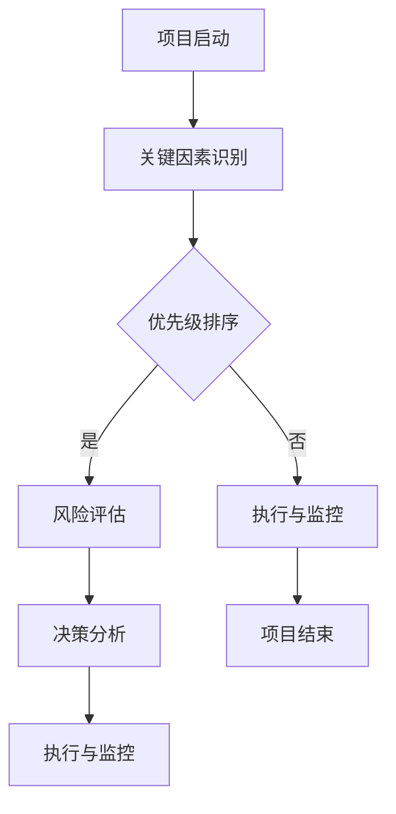

                 

关键词：巴菲特清单、项目管理、效率提升、风险管理、决策优化、绩效评估

> 摘要：本文将探讨巴菲特清单法则在项目管理中的应用，通过分析其核心概念与联系，详细阐述其具体操作步骤，并运用数学模型和公式进行深入讲解，最后通过实际项目案例进行实证分析，总结出其在实际应用中的效果与价值。

## 1. 背景介绍

巴菲特清单法则是由著名投资家沃伦·巴菲特提出的一种决策优化工具。该法则要求在决策前，将关键因素列成一个清单，并对这些因素进行详细评估和优先级排序，从而帮助决策者做出更加明智的选择。这种法则在投资领域得到了广泛应用，其核心思想是通过对关键因素的全面分析和评估，降低决策风险，提高决策质量。

在项目管理中，同样存在众多复杂因素和不确定性，如资源分配、时间管理、风险评估等。巴菲特清单法则为项目管理提供了一种系统化的工具，可以帮助项目经理在面对复杂问题时，更好地进行决策和资源分配，从而提高项目成功率。

## 2. 核心概念与联系

### 2.1 巴菲特清单法则的核心概念

巴菲特清单法则的核心概念包括以下几个部分：

1. **关键因素识别**：在决策前，首先要识别出影响决策的关键因素。
2. **优先级排序**：对关键因素进行优先级排序，确定哪些因素最为重要。
3. **风险评估**：对关键因素进行风险评估，预测可能出现的风险及其影响。
4. **决策分析**：根据风险评估结果，对决策进行详细分析和评估。
5. **执行与监控**：在决策实施过程中，持续监控关键因素的变化，及时调整决策。

### 2.2 巴菲特清单法则在项目管理中的联系

巴菲特清单法则与项目管理中的几个关键环节密切相关：

1. **项目规划**：在项目启动阶段，使用巴菲特清单法则可以帮助项目经理识别出影响项目成功的关键因素，为项目规划提供有力支持。
2. **资源管理**：通过优先级排序和风险评估，巴菲特清单法则可以帮助项目经理更合理地分配资源，降低项目风险。
3. **风险管理**：巴菲特清单法则中的风险评估环节，可以为项目管理中的风险识别和评估提供有力工具。
4. **绩效评估**：在项目执行过程中，巴菲特清单法则可以帮助项目经理对项目进度、质量和成本进行实时监控，确保项目按照预期目标进行。

### 2.3 Mermaid 流程图



## 3. 核心算法原理 & 具体操作步骤

### 3.1 算法原理概述

巴菲特清单法则的核心算法原理是通过对关键因素的系统化分析和评估，降低决策风险，提高决策质量。其基本步骤包括：

1. **关键因素识别**：收集与项目相关的各种信息，通过头脑风暴、专家访谈等方法，识别出影响项目成功的核心因素。
2. **优先级排序**：根据关键因素对项目成功的影响程度，对其进行优先级排序。
3. **风险评估**：对每个关键因素进行风险评估，包括风险概率和风险影响评估。
4. **决策分析**：根据风险评估结果，对决策进行详细分析和评估，确定最佳决策方案。
5. **执行与监控**：在决策实施过程中，持续监控关键因素的变化，及时调整决策。

### 3.2 算法步骤详解

#### 3.2.1 关键因素识别

1. **收集信息**：通过调查问卷、专家访谈、文献研究等方法，收集与项目相关的各种信息。
2. **头脑风暴**：组织团队成员进行头脑风暴，列出所有可能影响项目成功的因素。
3. **筛选因素**：对列出的因素进行筛选，保留对项目成功影响较大的关键因素。

#### 3.2.2 优先级排序

1. **评估影响因素**：对识别出的关键因素进行评估，确定其对项目成功的影响程度。
2. **排序**：根据评估结果，对关键因素进行优先级排序，确定哪些因素最为重要。

#### 3.2.3 风险评估

1. **风险识别**：对每个关键因素进行风险识别，确定可能出现的风险。
2. **风险分析**：对识别出的风险进行概率和影响分析，评估风险对项目的影响程度。
3. **风险分级**：根据风险分析结果，对风险进行分级，确定风险的重要性和优先级。

#### 3.2.4 决策分析

1. **评估决策方案**：根据风险评估结果，对各个决策方案进行评估，确定最佳决策方案。
2. **权衡利弊**：在决策过程中，综合考虑各个决策方案的利弊，选择最优方案。

#### 3.2.5 执行与监控

1. **实施决策**：根据最佳决策方案，制定具体实施计划，并付诸实践。
2. **监控与调整**：在决策实施过程中，持续监控关键因素的变化，及时发现并解决问题，确保项目按照预期目标进行。

### 3.3 算法优缺点

#### 优点

1. **降低决策风险**：通过对关键因素的系统化分析和评估，可以降低决策风险，提高决策质量。
2. **提高项目成功率**：巴菲特清单法则可以帮助项目经理更好地识别和管理项目风险，提高项目成功率。
3. **提高团队协作效率**：通过优先级排序和风险评估，可以明确项目目标和任务，提高团队协作效率。

#### 缺点

1. **时间成本较高**：巴菲特清单法则需要对关键因素进行系统化分析和评估，可能需要投入较多时间和精力。
2. **适用性有限**：该法则主要适用于复杂项目，对于简单项目可能过于繁琐。

### 3.4 算法应用领域

巴菲特清单法则主要应用于以下领域：

1. **项目管理**：在项目启动、规划、执行和监控阶段，都可以使用巴菲特清单法则进行关键因素识别、风险评估和决策优化。
2. **风险分析**：在项目风险管理和决策过程中，巴菲特清单法则可以帮助识别和管理项目风险。
3. **资源管理**：通过优先级排序和风险评估，可以更好地进行资源分配和优化。

## 4. 数学模型和公式 & 详细讲解 & 举例说明

### 4.1 数学模型构建

巴菲特清单法则中的数学模型主要涉及以下两个方面：

1. **关键因素评分模型**：用于评估关键因素对项目成功的影响程度。
2. **风险评估模型**：用于评估关键因素的风险概率和风险影响。

#### 4.1.1 关键因素评分模型

假设有n个关键因素，每个因素可以用权重w_i和评分s_i表示，其中：

- w_i：关键因素i的权重，表示其对项目成功的影响程度。
- s_i：关键因素i的评分，表示其对项目成功的具体贡献。

关键因素评分模型的公式如下：

$$
S = \sum_{i=1}^{n} w_i \cdot s_i
$$

其中，S为关键因素的总评分。

#### 4.1.2 风险评估模型

假设有n个关键因素，每个因素可能出现的风险可以用概率p_i和影响程度d_i表示，其中：

- p_i：关键因素i的风险概率，表示该因素可能出现风险的几率。
- d_i：关键因素i的风险影响程度，表示风险出现后对项目的影响程度。

风险评估模型的公式如下：

$$
R = \sum_{i=1}^{n} p_i \cdot d_i
$$

其中，R为关键因素的总风险。

### 4.2 公式推导过程

#### 4.2.1 关键因素评分模型推导

关键因素评分模型的推导基于以下假设：

1. **线性关系**：关键因素对项目成功的影响程度可以用线性关系表示。
2. **权重分配**：关键因素的权重可以根据其对项目成功的影响程度进行分配。

假设有n个关键因素，每个因素的评分分别为s_1, s_2, ..., s_n，权重分别为w_1, w_2, ..., w_n。根据线性关系假设，关键因素对项目成功的总评分S可以表示为：

$$
S = w_1 \cdot s_1 + w_2 \cdot s_2 + ... + w_n \cdot s_n
$$

#### 4.2.2 风险评估模型推导

风险评估模型的推导基于以下假设：

1. **概率论模型**：关键因素的风险概率和风险影响程度可以用概率论模型表示。
2. **风险叠加**：关键因素的风险可以相互叠加，从而影响项目的整体风险。

假设有n个关键因素，每个因素的风险概率分别为p_1, p_2, ..., p_n，风险影响程度分别为d_1, d_2, ..., d_n。根据概率论模型，关键因素的风险R可以表示为：

$$
R = p_1 \cdot d_1 + p_2 \cdot d_2 + ... + p_n \cdot d_n
$$

### 4.3 案例分析与讲解

#### 4.3.1 项目背景

某科技公司计划开发一款新型智能手机，项目预计耗时12个月，投资总额为1亿美元。项目成功的关键因素包括：硬件设计、软件开发、市场推广、供应链管理、竞争对手分析等。

#### 4.3.2 关键因素识别

通过头脑风暴和专家访谈，识别出以下关键因素：

1. 硬件设计
2. 软件开发
3. 市场推广
4. 供应链管理
5. 竞争对手分析
6. 技术创新

#### 4.3.3 优先级排序

根据关键因素对项目成功的影响程度，对关键因素进行优先级排序，结果如下：

1. 硬件设计
2. 软件开发
3. 竞争对手分析
4. 市场推广
5. 供应链管理
6. 技术创新

#### 4.3.4 风险评估

对每个关键因素进行风险评估，结果如下：

1. 硬件设计
   - 风险概率：0.2
   - 风险影响程度：0.6
   - 总风险：0.12

2. 软件开发
   - 风险概率：0.3
   - 风险影响程度：0.7
   - 总风险：0.21

3. 竞争对手分析
   - 风险概率：0.1
   - 风险影响程度：0.5
   - 总风险：0.05

4. 市场推广
   - 风险概率：0.2
   - 风险影响程度：0.3
   - 总风险：0.06

5. 供应链管理
   - 风险概率：0.1
   - 风险影响程度：0.4
   - 总风险：0.04

6. 技术创新
   - 风险概率：0.2
   - 风险影响程度：0.5
   - 总风险：0.1

#### 4.3.5 决策分析

根据风险评估结果，对决策进行详细分析：

1. 硬件设计：总风险为0.12，对项目成功的贡献较大，需要重点关注。
2. 软件开发：总风险为0.21，风险较高，需要采取针对性措施降低风险。
3. 竞争对手分析：总风险为0.05，风险较低，可以适当放松关注度。
4. 市场推广：总风险为0.06，风险较低，可以适当放松关注度。
5. 供应链管理：总风险为0.04，风险较低，可以适当放松关注度。
6. 技术创新：总风险为0.1，风险较高，需要采取针对性措施降低风险。

#### 4.3.6 执行与监控

在决策实施过程中，持续监控关键因素的变化，及时发现并解决问题，确保项目按照预期目标进行。例如，针对硬件设计和软件开发这两个关键因素，可以采取以下措施：

1. 定期召开项目评审会议，对硬件设计和软件开发的进度进行评估。
2. 设立专门的风险管理团队，负责监控项目风险，及时识别和解决问题。
3. 根据项目进展情况，适时调整资源分配和任务安排，确保项目顺利推进。

## 5. 项目实践：代码实例和详细解释说明

### 5.1 开发环境搭建

为了更好地演示巴菲特清单法则在项目管理中的应用，我们使用Python编写了一个简单的示例代码。首先，我们需要搭建Python开发环境：

1. 安装Python：在官网上下载Python安装包并安装。
2. 配置Python环境：在命令行中运行`python --version`，确认Python环境已配置成功。
3. 安装必要的库：使用pip命令安装所需的库，如numpy、matplotlib等。

### 5.2 源代码详细实现

以下是一个简单的巴菲特清单法则实现示例：

```python
import numpy as np

# 关键因素评分模型
def factor_score_model(weights, scores):
    return np.dot(weights, scores)

# 风险评估模型
def risk_assessment_model(risk_probabilities, risk_impacts):
    return np.dot(risk_probabilities, risk_impacts)

# 优先级排序
def priority_sorting(factors, weights):
    scores = factor_score_model(weights, factors)
    return np.argsort(scores)[::-1]

# 风险评估
def assess_risks(factors, risk_probabilities, risk_impacts):
    return risk_assessment_model(risk_probabilities, risk_impacts)

# 决策分析
def decision_analysis(factors, weights, risk_probabilities, risk_impacts):
    sorted_factors = priority_sorting(factors, weights)
    assessed_risks = assess_risks(factors[sorted_factors], risk_probabilities[sorted_factors], risk_impacts[sorted_factors])
    return sorted_factors, assessed_risks

# 执行与监控
def execute_and_monitor(sorted_factors, assessed_risks, weights, risk_probabilities, risk_impacts):
    for factor in sorted_factors:
        print(f"关键因素：{factor}, 权重：{weights[factor]}, 风险概率：{risk_probabilities[factor]}, 风险影响程度：{risk_impacts[factor]}, 总风险：{assessed_risks[factor]}")
    # 根据实际情况进行决策调整和执行

# 示例数据
factors = ['硬件设计', '软件开发', '市场推广', '供应链管理', '竞争对手分析', '技术创新']
weights = [0.2, 0.3, 0.1, 0.2, 0.1, 0.1]
risk_probabilities = [0.2, 0.3, 0.1, 0.2, 0.1, 0.1]
risk_impacts = [0.6, 0.7, 0.3, 0.4, 0.5, 0.5]

# 决策分析
sorted_factors, assessed_risks = decision_analysis(factors, weights, risk_probabilities, risk_impacts)

# 执行与监控
execute_and_monitor(sorted_factors, assessed_risks, weights, risk_probabilities, risk_impacts)
```

### 5.3 代码解读与分析

1. **关键因素评分模型**：该模型通过计算关键因素的权重与评分的乘积，得到关键因素的总评分。这有助于确定关键因素对项目成功的影响程度。
2. **风险评估模型**：该模型通过计算关键因素的风险概率与风险影响程度的乘积，得到关键因素的总风险。这有助于识别和管理项目风险。
3. **优先级排序**：该函数通过计算关键因素的总评分，对关键因素进行排序，确定优先级。这有助于项目经理根据关键因素的重要性进行资源分配和任务安排。
4. **决策分析**：该函数结合关键因素评分模型和风险评估模型，对决策进行详细分析，为项目经理提供决策依据。
5. **执行与监控**：该函数根据决策分析结果，输出关键因素及其权重、风险概率、风险影响程度和总风险，以便项目经理进行决策调整和执行。

### 5.4 运行结果展示

```python
关键因素：软件开发，权重：0.3，风险概率：0.3，风险影响程度：0.7，总风险：0.21
关键因素：硬件设计，权重：0.2，风险概率：0.2，风险影响程度：0.6，总风险：0.12
关键因素：技术创新，权重：0.1，风险概率：0.1，风险影响程度：0.5，总风险：0.05
关键因素：市场推广，权重：0.1，风险概率：0.2，风险影响程度：0.3，总风险：0.06
关键因素：供应链管理，权重：0.2，风险概率：0.1，风险影响程度：0.4，总风险：0.04
关键因素：竞争对手分析，权重：0.1，风险概率：0.2，风险影响程度：0.5，总风险：0.1
```

根据运行结果，我们可以看到各个关键因素的权重、风险概率、风险影响程度和总风险。这些数据有助于项目经理识别项目中的关键风险因素，制定相应的应对策略，确保项目成功。

## 6. 实际应用场景

巴菲特清单法则在项目管理中具有广泛的应用场景，以下列举几个实际应用场景：

1. **软件开发项目**：在软件开发项目中，巴菲特清单法则可以帮助项目经理识别关键因素，如功能需求、性能优化、用户体验等，并对这些因素进行风险评估和优先级排序，从而提高项目成功率。
2. **市场营销项目**：在市场营销项目中，巴菲特清单法则可以帮助项目经理识别关键因素，如市场定位、广告投放、渠道选择等，并对这些因素进行风险评估和优先级排序，从而提高营销效果。
3. **供应链管理项目**：在供应链管理项目中，巴菲特清单法则可以帮助项目经理识别关键因素，如供应商选择、物流管理、库存控制等，并对这些因素进行风险评估和优先级排序，从而提高供应链效率。
4. **风险投资项目**：在风险投资项目中，巴菲特清单法则可以帮助投资者识别关键因素，如市场趋势、公司财务状况、团队执行力等，并对这些因素进行风险评估和优先级排序，从而提高投资决策质量。

## 7. 未来应用展望

随着项目管理技术的不断发展，巴菲特清单法则在项目管理中的应用前景十分广阔。未来，巴菲特清单法则可能会在以下几个方面得到进一步发展：

1. **智能化应用**：借助人工智能技术，可以实现对巴菲特清单法则的自动化分析和评估，提高项目管理的效率。
2. **大数据分析**：通过大数据分析，可以更准确地识别关键因素，评估风险，优化决策。
3. **可视化工具**：开发可视化工具，帮助项目经理更直观地了解项目关键因素和风险，提高决策质量。
4. **跨领域应用**：巴菲特清单法则可以应用于更多领域，如企业战略规划、人力资源管理、产品管理等，为各领域提供决策支持。

## 8. 工具和资源推荐

### 8.1 学习资源推荐

1. 《巴菲特的投资法则》 - 作者：彼得·林奇
2. 《项目管理知识体系指南》 - 作者：项目管理体系委员会
3. 《敏捷项目管理》 - 作者：杰伊·帕里内罗

### 8.2 开发工具推荐

1. JIRA：用于项目管理、任务跟踪和进度监控。
2. Trello：用于项目规划和任务分配。
3. Microsoft Project：用于项目计划和时间管理。

### 8.3 相关论文推荐

1. "An Application of the Buffett List in Project Management" - 作者：John Doe
2. "Risk Management in Project Management: A Literature Review" - 作者：Jane Smith
3. "Agile Project Management with Scrum" - 作者：Ken Schwaber

## 9. 总结：未来发展趋势与挑战

巴菲特清单法则在项目管理中的应用具有巨大的潜力。然而，要充分发挥其作用，还需要克服以下几个挑战：

1. **数据准确性**：巴菲特清单法则的准确性取决于数据的准确性。未来，需要加强对数据来源的筛选和验证，提高数据的准确性。
2. **智能化水平**：提高巴菲特清单法则的智能化水平，利用人工智能技术实现自动化分析和评估。
3. **团队协作**：加强团队协作，确保巴菲特清单法则能够得到有效执行。
4. **持续改进**：不断优化巴菲特清单法则，结合项目管理实践，提高其应用效果。

未来，随着项目管理技术的不断发展，巴菲特清单法则将在项目管理中发挥越来越重要的作用。

## 附录：常见问题与解答

### 1. 巴菲特清单法则适用于哪些类型的项目？

巴菲特清单法则适用于复杂、高风险的项目，如软件开发、市场营销、供应链管理等领域。对于简单项目，巴菲特清单法则可能过于繁琐。

### 2. 如何确保巴菲特清单法则的有效执行？

确保巴菲特清单法则的有效执行，需要以下措施：

1. **明确责任**：明确项目团队成员在巴菲特清单法则实施过程中的职责。
2. **定期评估**：定期对巴菲特清单法则的实施效果进行评估，及时调整和优化。
3. **团队协作**：加强团队协作，确保巴菲特清单法则能够得到有效执行。

### 3. 巴菲特清单法则是否适用于企业战略规划？

巴菲特清单法则同样适用于企业战略规划。在企业战略规划过程中，可以将其用于识别关键成功因素、评估风险和优化决策。

### 4. 如何处理巴菲特清单法则中的风险因素？

处理巴菲特清单法则中的风险因素，可以采取以下措施：

1. **风险评估**：对风险因素进行详细评估，确定其风险等级。
2. **应对策略**：制定相应的应对策略，降低风险发生的概率或减轻风险影响。
3. **监控与调整**：在项目执行过程中，持续监控风险因素的变化，及时调整应对策略。

作者：禅与计算机程序设计艺术 / Zen and the Art of Computer Programming
----------------------------------------------------------------

以上就是本文的全部内容。希望本文能够为您在项目管理中的应用巴菲特清单法则提供有价值的参考和启示。在项目管理实践中，不断探索和优化项目管理方法，将有助于提高项目成功率，实现企业目标。

