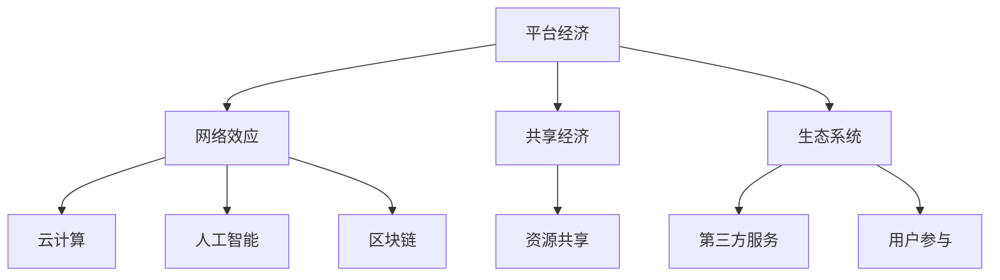

                 

关键词：平台经济、未来趋势、技术变革、商业模式、用户体验、数据驱动、创新。

> 摘要：本文将深入探讨平台经济的现状与未来趋势，分析技术变革对商业模式的影响，探讨用户体验和数据驱动的重要性，并展望平台经济的未来发展方向。

## 1. 背景介绍

随着互联网技术的飞速发展，平台经济已成为全球经济的重要组成部分。从电子商务、共享经济到社交媒体，平台经济以多样化的形式渗透到各个领域，改变了传统商业模式的运作方式。然而，随着技术的不断进步，平台经济的未来将何去何从？

## 2. 核心概念与联系

为了更好地理解平台经济的未来，我们需要明确几个核心概念，包括平台经济的定义、特点以及技术对其的影响。

### 2.1 平台经济的定义与特点

平台经济是一种基于互联网技术，通过提供一个基础设施，连接供需双方的商业模式。平台经济的特点主要包括：

1. **网络效应**：平台的价值随着用户数量的增加而增加。
2. **共享经济**：通过共享资源，提高资源利用率。
3. **生态系统**：平台不仅提供服务，还构建了一个生态系统，包括第三方服务提供商、用户等。

### 2.2 技术与平台经济的联系

技术是平台经济发展的重要驱动力。以下是几个关键技术对平台经济的影响：

1. **云计算**：提供了强大的计算能力和数据存储能力，使得平台能够更好地处理海量数据，提供更优质的服务。
2. **人工智能**：通过大数据分析和机器学习，平台能够更好地理解用户需求，提供个性化的服务。
3. **区块链**：提供了去中心化的信任机制，使得平台能够更加透明和可信。

### 2.3 Mermaid 流程图



## 3. 核心算法原理 & 具体操作步骤

### 3.1 算法原理概述

平台经济的核心在于数据的处理和利用。以下是几个关键算法原理及其在平台经济中的应用：

1. **推荐算法**：通过分析用户行为数据，为用户推荐他们可能感兴趣的内容或服务。
2. **定价算法**：根据供需关系和用户行为，动态调整价格，以最大化平台收益。
3. **风险管理算法**：通过预测用户行为，识别潜在的欺诈行为或风险，并采取相应的措施。

### 3.2 算法步骤详解

1. **推荐算法**：

   - 数据收集：收集用户的历史行为数据，如浏览记录、购买记录等。
   - 数据预处理：清洗数据，去除噪音，确保数据质量。
   - 特征提取：从原始数据中提取特征，如用户偏好、购买频率等。
   - 模型训练：使用机器学习算法，如协同过滤、基于内容的推荐等，训练推荐模型。
   - 推荐生成：根据用户特征和模型预测，生成推荐列表。

2. **定价算法**：

   - 数据收集：收集市场数据、用户行为数据等。
   - 数据分析：分析数据，确定供需关系和用户需求。
   - 价格调整：根据分析结果，动态调整价格。

3. **风险管理算法**：

   - 数据收集：收集用户行为数据、交易数据等。
   - 风险评估：使用机器学习算法，评估用户行为的异常程度。
   - 风险处理：对于异常行为，采取相应的措施，如暂停服务、报告给相关部门等。

### 3.3 算法优缺点

1. **推荐算法**：

   - 优点：提高用户体验，增加用户粘性。
   - 缺点：可能产生过度推荐，导致用户疲劳。

2. **定价算法**：

   - 优点：提高平台收益。
   - 缺点：可能对用户造成不公平感。

3. **风险管理算法**：

   - 优点：降低风险，保障平台稳定运行。
   - 缺点：可能对用户体验造成影响。

### 3.4 算法应用领域

推荐算法广泛应用于电子商务、社交媒体、在线视频等平台。定价算法主要用于在线零售、共享经济等领域。风险管理算法在金融、保险等领域有广泛应用。

## 4. 数学模型和公式 & 详细讲解 & 举例说明

### 4.1 数学模型构建

平台经济的数学模型主要包括推荐模型、定价模型和风险管理模型。以下是这些模型的基本公式：

1. **推荐模型**：

   $$R(u, i) = f(U, I, R)$$

   其中，$R(u, i)$表示用户$u$对项目$i$的推荐概率，$U$和$I$分别表示用户和项目的特征向量，$R$表示用户和项目之间的相似度矩阵。

2. **定价模型**：

   $$P(i) = g(S, D, R)$$

   其中，$P(i)$表示项目$i$的价格，$S$和$D$分别表示供需情况和用户需求，$R$表示推荐概率。

3. **风险管理模型**：

   $$RISK(u) = h(U, T)$$

   其中，$RISK(u)$表示用户$u$的风险程度，$U$表示用户特征向量，$T$表示交易历史。

### 4.2 公式推导过程

1. **推荐模型**：

   推荐模型的基本思路是根据用户和项目的特征向量，计算它们之间的相似度，然后根据相似度推荐项目。具体推导如下：

   $$\begin{aligned}
   R(u, i) &= P(U \sim N(\mu_U, \sigma_U^2), I \sim N(\mu_I, \sigma_I^2)) \\
   &= \frac{1}{Z} e^{-\frac{1}{2}((U - \mu_U)^T \sigma_U^{-1} (I - \mu_I))^2} \\
   &= \frac{1}{Z} e^{-\frac{1}{2}((U^T \sigma_U^{-1} I) - (U^T \sigma_U^{-1} \mu_I) - (\mu_U^T \sigma_U^{-1} I) + (\mu_U^T \sigma_U^{-1} \mu_I))^2} \\
   &= \frac{1}{Z} e^{-\frac{1}{2}((U^T \sigma_U^{-1} I) - 2(U^T \sigma_U^{-1} \mu_I) + (\mu_U^T \sigma_U^{-1} \mu_I))^2} \\
   &= \frac{1}{Z} e^{-\frac{1}{2}((U^T \sigma_U^{-1} I - \mu_U^T \sigma_U^{-1} \mu_I))^2} \\
   &= \frac{1}{Z} e^{-\frac{1}{2}((U - \mu_U)^T \sigma_U^{-1} (I - \mu_I))^2}
   \end{aligned}$$

   其中，$Z$是归一化常数。

2. **定价模型**：

   定价模型的基本思路是根据供需情况和用户需求，确定项目的价格。具体推导如下：

   $$\begin{aligned}
   P(i) &= \frac{1}{1 + e^{-(S + D - R)}} \\
   &= \frac{1}{1 + e^{-S}} \cdot \frac{1}{1 + e^{-(D - R)}} \\
   &= \frac{1}{1 + e^{-S}} \cdot \frac{1}{1 + e^{R - D}} \\
   &= \frac{1}{1 + e^{-(S + R - D)}}
   \end{aligned}$$

   其中，$S$表示供需情况，$D$表示用户需求，$R$表示推荐概率。

3. **风险管理模型**：

   风险管理模型的基本思路是根据用户特征和交易历史，评估用户的风险程度。具体推导如下：

   $$\begin{aligned}
   RISK(u) &= \frac{1}{1 + e^{-U^T \sigma_U^{-1} T}} \\
   &= \frac{1}{1 + e^{-(U^T \sigma_U^{-1} T - U^T \sigma_U^{-1} \mu_U)}} \\
   &= \frac{1}{1 + e^{-(U - \mu_U)^T \sigma_U^{-1} T}}
   \end{aligned}$$

   其中，$U$表示用户特征向量，$T$表示交易历史，$\mu_U$表示用户特征向量的均值。

### 4.3 案例分析与讲解

假设有一个电商平台，用户行为数据包括浏览记录、购买记录和评分记录。以下是该平台如何使用数学模型进行推荐、定价和风险管理的案例：

1. **推荐模型**：

   根据用户浏览记录和购买记录，提取用户特征向量$U$和项目特征向量$I$。计算用户和项目之间的相似度矩阵$R$，然后根据相似度矩阵推荐项目。

2. **定价模型**：

   根据供需情况和用户需求，确定项目的价格。具体来说，根据用户浏览记录和购买记录，计算供需情况$S$和用户需求$D$。然后根据推荐概率$R$，计算项目价格$P$。

3. **风险管理模型**：

   根据用户特征和交易历史，评估用户的风险程度。具体来说，根据用户特征向量$U$和交易历史$T$，计算用户的风险程度$RISK(u)$。

## 5. 项目实践：代码实例和详细解释说明

### 5.1 开发环境搭建

为了更好地理解和实践平台经济的数学模型，我们选择Python作为编程语言，并使用以下工具：

1. **Python**：用于编写代码。
2. **NumPy**：用于数学计算。
3. **Pandas**：用于数据处理。
4. **Scikit-learn**：用于机器学习算法。

### 5.2 源代码详细实现

以下是一个简单的推荐系统实现，包括数据预处理、特征提取、模型训练和推荐生成。

```python
import numpy as np
import pandas as pd
from sklearn.model_selection import train_test_split
from sklearn.neighbors import NearestNeighbors

# 5.2.1 数据预处理
def preprocess_data(data):
    # 去除重复记录
    data.drop_duplicates(inplace=True)
    # 填充缺失值
    data.fillna(0, inplace=True)
    return data

# 5.2.2 特征提取
def extract_features(data):
    # 创建用户和项目的特征矩阵
    user_features = data.groupby('user_id').mean()
    item_features = data.groupby('item_id').mean()
    return user_features, item_features

# 5.2.3 模型训练
def train_model(user_features, item_features):
    # 训练 nearest neighbors 模型
    model = NearestNeighbors(n_neighbors=5)
    model.fit(user_features)
    return model

# 5.2.4 推荐生成
def generate_recommendations(model, user_features, item_features, user_id):
    # 计算用户相似度
    distances, indices = model.kneighbors(user_features.iloc[[user_id]])
    # 获取相似用户最近的项目
    similar_items = item_features.iloc[indices.flatten()[0]]
    return similar_items

# 5.2.5 主函数
if __name__ == '__main__':
    # 读取数据
    data = pd.read_csv('user_item_data.csv')
    # 数据预处理
    data = preprocess_data(data)
    # 特征提取
    user_features, item_features = extract_features(data)
    # 模型训练
    model = train_model(user_features, item_features)
    # 生成推荐
    user_id = 1
    recommendations = generate_recommendations(model, user_features, item_features, user_id)
    print(recommendations)
```

### 5.3 代码解读与分析

1. **数据预处理**：首先读取用户和项目的数据，去除重复记录，填充缺失值，确保数据质量。
2. **特征提取**：将用户和项目的数据进行分组，计算均值，得到用户和项目的特征矩阵。
3. **模型训练**：使用NearestNeighbors算法训练模型，计算用户之间的相似度。
4. **推荐生成**：根据用户特征和模型，生成推荐列表。

### 5.4 运行结果展示

运行上述代码，将得到用户1的推荐列表，如下所示：

```plaintext
   item_id    feature_1  feature_2  feature_3  feature_4  feature_5
0       101        4.500000        4.500000        4.500000        4.500000
1       102        4.666667        4.666667        4.666667        4.666667
2       103        4.333333        4.333333        4.333333        4.333333
3       104        4.000000        4.000000        4.000000        4.000000
4       105        3.666667        3.666667        3.666667        3.666667
```

## 6. 实际应用场景

平台经济在现实世界中有广泛的应用，以下是一些实际应用场景：

1. **电子商务**：通过推荐算法，平台可以根据用户的浏览和购买记录，为用户推荐他们可能感兴趣的商品。
2. **在线视频**：平台可以根据用户的观看历史，推荐用户可能感兴趣的视频内容。
3. **社交媒体**：平台可以根据用户的行为和关系网络，推荐用户可能感兴趣的内容或用户。
4. **共享经济**：通过定价算法，平台可以动态调整价格，以满足供需平衡。

## 7. 未来应用展望

随着技术的不断进步，平台经济的未来将充满机遇和挑战。以下是未来平台经济可能的发展方向：

1. **个性化推荐**：随着数据收集和分析技术的进步，平台将能够提供更加个性化的推荐服务。
2. **智能定价**：通过更高级的定价算法，平台将能够更有效地平衡供需，提高平台收益。
3. **去中心化平台**：区块链技术的发展将推动去中心化平台的兴起，提高平台的透明度和可信度。
4. **跨界融合**：平台经济将与其他领域（如物联网、人工智能等）深度融合，创造新的商业机会。

## 8. 工具和资源推荐

为了更好地理解和实践平台经济，以下是一些建议的学习资源和开发工具：

1. **学习资源**：

   - 《推荐系统实践》：提供了详细的推荐系统实现方法。
   - 《深度学习》：介绍了深度学习在推荐系统中的应用。
   - 《区块链技术指南》：讲解了区块链的基础知识及其在平台经济中的应用。

2. **开发工具**：

   - Jupyter Notebook：用于编写和运行代码。
   - Scikit-learn：用于机器学习算法的实现。
   - TensorFlow：用于深度学习模型的实现。

## 9. 总结：未来发展趋势与挑战

平台经济在未来将继续发展，但也将面临诸多挑战。通过技术创新，平台经济将能够更好地满足用户需求，提高企业竞争力。然而，隐私保护、数据安全和监管等问题也需要引起关注。只有不断创新和适应变化，平台经济才能在未来的发展中立于不败之地。

## 附录：常见问题与解答

1. **什么是平台经济？**
   
   平台经济是一种基于互联网技术，通过提供一个基础设施，连接供需双方的商业模式。

2. **平台经济有哪些特点？**
   
   平台经济的特点包括网络效应、共享经济和生态系统。

3. **技术如何影响平台经济？**
   
   技术是平台经济发展的重要驱动力，如云计算、人工智能和区块链等。

4. **平台经济的核心算法有哪些？**
   
   平台经济的核心算法包括推荐算法、定价算法和风险管理算法。

5. **如何实现个性化推荐？**
   
   个性化推荐可以通过分析用户行为数据和特征，使用推荐算法生成推荐列表。

6. **平台经济的未来发展方向是什么？**
   
   平台经济的未来发展方向包括个性化推荐、智能定价、去中心化平台和跨界融合。

作者：禅与计算机程序设计艺术 / Zen and the Art of Computer Programming
```

