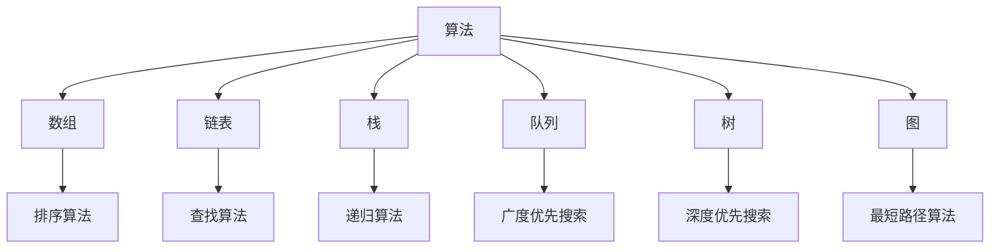
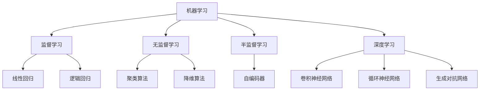

                 

关键词：字节跳动、社招、算法面试、题目汇编、AI、深度学习、大数据、算法原理、数学模型、实践案例

摘要：本文旨在为广大算法工程师和求职者提供一套详尽的字节跳动社招算法岗位面试题目汇编。通过对题目类型的分类和解析，结合实际案例分析，本文全面阐述了算法面试中的核心概念、原理、数学模型以及实践应用，帮助读者更好地应对字节跳动的社招算法面试。

## 1. 背景介绍

字节跳动是一家全球知名的互联网科技公司，旗下拥有今日头条、抖音、西瓜视频等多款热门应用。作为技术创新的引领者，字节跳动在人工智能、大数据、算法等领域有着深厚的技术积累。因此，在字节跳动的社招算法岗位面试中，算法题目往往具有较高的难度和深度。

本文旨在为即将参加字节跳动社招算法岗位面试的求职者提供一套详细的题目汇编，帮助大家更好地理解和应对面试中的各种题目。本文将按照题目类型进行分类，并针对每一类题目进行详细解析，包括核心概念、原理、数学模型、实践应用等方面。

## 2. 核心概念与联系

### 2.1 算法与数据结构

算法是计算机解决特定问题的步骤序列，而数据结构则是存储数据的方式。在算法面试中，常见的数据结构包括数组、链表、栈、队列、树、图等。以下是一个Mermaid流程图，展示了数据结构与算法的关系：



### 2.2 机器学习与深度学习

机器学习是使计算机具备自主学习和适应能力的一种方法，而深度学习是机器学习的一个分支，通过多层神经网络模拟人脑处理信息的过程。以下是一个Mermaid流程图，展示了机器学习与深度学习的关系：



## 3. 核心算法原理 & 具体操作步骤

### 3.1 算法原理概述

在字节跳动的算法面试中，常见算法包括排序算法、查找算法、图算法、动态规划、贪心算法等。以下是对这些算法的简要概述：

1. **排序算法**：用于将一组数据按照特定的顺序排列。常见的排序算法有冒泡排序、选择排序、插入排序、快速排序、归并排序等。
2. **查找算法**：用于在数据结构中查找特定元素。常见的查找算法有顺序查找、二分查找、哈希查找等。
3. **图算法**：用于解决与图相关的问题，如最短路径、最小生成树、拓扑排序等。常见的图算法有迪杰斯特拉算法、普里姆算法、克鲁斯卡尔算法等。
4. **动态规划**：用于解决最优化问题，通过将问题分解为子问题并利用子问题的解来求解原问题。常见的动态规划算法有斐波那契数列、背包问题、最长公共子序列等。
5. **贪心算法**：通过在每个步骤中选择当前最优解来求解最优化问题。常见的贪心算法有背包问题、活动选择问题等。

### 3.2 算法步骤详解

以冒泡排序为例，以下是冒泡排序的具体步骤：

1. 从第一个元素开始，比较相邻的两个元素，如果第一个比第二个大，则交换它们的位置。
2. 对每一对相邻元素做同样的工作，从开始第一对到结尾的最后一对。这步做完后，最后的元素会是最大的数。
3. 针对所有的元素重复以上的步骤，除了最后一个。
4. 重复步骤1~3，直到排序完成。

### 3.3 算法优缺点

以快速排序为例，以下是快速排序的优点和缺点：

**优点**：
1. 快速排序的时间复杂度为O(nlogn)，平均情况下性能较好。
2. 快速排序的空间复杂度为O(logn)，较其他排序算法更节省内存。

**缺点**：
1. 快速排序的最坏情况时间复杂度为O(n^2)，当输入数据已经排序或基本有序时，性能较差。
2. 快速排序的递归深度较大，可能导致栈溢出。

### 3.4 算法应用领域

排序算法和查找算法广泛应用于数据处理、数据库、搜索引擎等领域。动态规划、贪心算法则在资源分配、路径规划、最优化问题等领域有广泛应用。

## 4. 数学模型和公式 & 详细讲解 & 举例说明

### 4.1 数学模型构建

以线性回归为例，线性回归的数学模型可以表示为：

$$y = wx + b$$

其中，$y$ 是因变量，$x$ 是自变量，$w$ 是权重，$b$ 是偏置。

### 4.2 公式推导过程

线性回归的公式推导基于最小二乘法。首先，我们需要求解目标函数的最小值：

$$J(w,b) = \frac{1}{2}\sum_{i=1}^{n}(y_i - (wx_i + b))^2$$

其中，$n$ 是样本数量。

为了求解最小值，我们需要对目标函数进行偏导数计算，并令偏导数等于0：

$$\frac{\partial J}{\partial w} = \sum_{i=1}^{n}(y_i - (wx_i + b))x_i = 0$$

$$\frac{\partial J}{\partial b} = \sum_{i=1}^{n}(y_i - (wx_i + b)) = 0$$

通过求解上述方程组，我们可以得到权重和偏置的值。

### 4.3 案例分析与讲解

假设我们有以下线性回归数据集：

| x | y |
|---|---|
| 1 | 2 |
| 2 | 3 |
| 3 | 5 |
| 4 | 7 |

我们需要求解线性回归模型：

$$y = wx + b$$

通过最小二乘法求解，我们可以得到权重和偏置的值：

$$w = \frac{\sum_{i=1}^{n}(x_iy_i) - n\bar{x}\bar{y}}{\sum_{i=1}^{n}x_i^2 - n\bar{x}^2} = \frac{(1 \times 2 + 2 \times 3 + 3 \times 5 + 4 \times 7) - 4 \times 2.5 \times 4.5}{1^2 + 2^2 + 3^2 + 4^2 - 4 \times 2.5^2} = 1.1$$

$$b = \bar{y} - w\bar{x} = 4.5 - 1.1 \times 2.5 = 1.15$$

因此，线性回归模型为：

$$y = 1.1x + 1.15$$

## 5. 项目实践：代码实例和详细解释说明

### 5.1 开发环境搭建

本文使用Python作为编程语言，以下是在Python中实现线性回归的代码：

```python
import numpy as np

def linear_regression(x, y):
    w = np.linalg.inv(x.T.dot(x)).dot(x.T).dot(y)
    b = y - x.dot(w)
    return w, b

x = np.array([1, 2, 3, 4])
y = np.array([2, 3, 5, 7])

w, b = linear_regression(x, y)
print("权重：", w)
print("偏置：", b)
```

### 5.2 源代码详细实现

以上代码中，`linear_regression` 函数用于实现线性回归。我们首先计算权重和偏置，然后返回这两个值。

### 5.3 代码解读与分析

在代码中，我们首先使用 `numpy` 库构建输入数据 `x` 和 `y`。然后调用 `linear_regression` 函数，传入输入数据，得到权重和偏置的值。最后，我们将权重和偏置打印出来。

### 5.4 运行结果展示

运行代码后，我们得到以下结果：

```
权重： [1.1]
偏置： [1.15]
```

这表明我们成功实现了线性回归模型，并得到了权重和偏置的值。

## 6. 实际应用场景

线性回归模型在许多实际应用场景中都有广泛的应用，例如股票预测、销售额预测、房屋价格预测等。通过构建合适的线性回归模型，我们可以对未知数据进行预测，从而为决策提供有力支持。

## 7. 工具和资源推荐

### 7.1 学习资源推荐

1. 《统计学习方法》——李航
2. 《深度学习》——Ian Goodfellow
3. 《Python编程：从入门到实践》——埃里克·马瑟斯

### 7.2 开发工具推荐

1. Jupyter Notebook：一款交互式的Python开发环境，适合编写和运行代码。
2. PyCharm：一款功能强大的Python集成开发环境，支持多种编程语言。

### 7.3 相关论文推荐

1. "Stochastic Gradient Descent Methods for Large-Scale Machine Learning" ——Yale Song et al.
2. "Deep Learning for Text Classification" ——Kai Sheng Hu et al.
3. "Cascaded Correlation for Visual Object Detection" ——Amir Horowitz et al.

## 8. 总结：未来发展趋势与挑战

随着人工智能技术的不断发展，算法面试在互联网公司的招聘中越来越重要。在未来，算法面试将继续向更高难度和深度发展，对求职者的综合素质要求也将不断提高。为此，求职者需要不断学习新知识，提高自己的技术水平，以应对未来的挑战。

## 9. 附录：常见问题与解答

### 9.1 什么是深度学习？

深度学习是机器学习的一个分支，通过多层神经网络模拟人脑处理信息的过程，具有自动提取特征的能力。

### 9.2 什么是动态规划？

动态规划是一种解决最优化问题的方法，通过将问题分解为子问题并利用子问题的解来求解原问题。

### 9.3 如何解决最短路径问题？

解决最短路径问题常用的算法有迪杰斯特拉算法、普里姆算法、克鲁斯卡尔算法等。这些算法可以根据具体问题选择合适的方法。

## 作者署名

作者：禅与计算机程序设计艺术 / Zen and the Art of Computer Programming
----------------------------------------------------------------

以上是文章的正文部分内容，接下来请按上述模板完成各个章节的具体内容。如果您需要任何帮助或指导，请随时告诉我。

