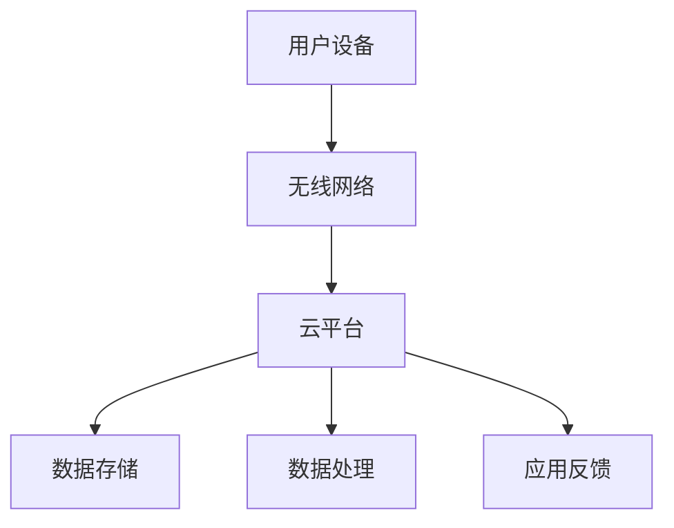

                 

关键词：小米、社交智能家居、系统工程师、面试题、技术挑战、解决方案、未来趋势

> 摘要：本文旨在汇总2025年小米社交智能家居系统工程师的面试题，深入探讨该领域的技术挑战与解决方案，并展望未来的发展趋势。通过本篇文章，读者将全面了解社交智能家居系统的核心概念、算法原理、数学模型、项目实践以及实际应用场景。

## 1. 背景介绍

随着物联网技术的不断发展，智能家居市场迎来了爆发式增长。小米作为全球领先的智能硬件制造商，其社交智能家居系统成为了众多消费者的首选。社交智能家居系统集成了家庭自动化、物联网、人工智能等技术，旨在为用户提供更加便捷、舒适、安全的家居体验。本文将从系统工程师的角度，汇总2025年小米社交智能家居系统的面试题，以期为从事该领域的技术人员提供有价值的参考。

## 2. 核心概念与联系

### 2.1 智能家居系统架构

智能家居系统的核心是物联网设备和云平台。物联网设备包括智能插座、智能灯泡、智能摄像头、智能门锁等，它们通过无线网络连接到云平台。云平台负责数据的存储、分析和处理，并通过应用程序将信息反馈给用户。

### 2.2 社交智能家居特点

社交智能家居系统不仅具备传统智能家居的功能，还引入了社交元素。用户可以通过社交网络分享家居状态、控制家居设备、与其他用户互动，从而实现智能家居的社交化和个性化。

### 2.3 Mermaid 流程图

以下是一个简单的 Mermaid 流程图，展示了社交智能家居系统的核心流程：



## 3. 核心算法原理 & 具体操作步骤

### 3.1 算法原理概述

社交智能家居系统中的核心算法包括用户行为分析、设备控制算法、数据加密算法等。

### 3.2 算法步骤详解

#### 3.2.1 用户行为分析

用户行为分析算法主要用于了解用户的使用习惯和偏好，从而实现智能家居的个性化服务。具体步骤如下：

1. 数据收集：通过物联网设备收集用户的行为数据，如开关灯、开门、使用电器等。
2. 数据预处理：对收集到的数据进行分析，提取有用的特征。
3. 特征选择：根据业务需求选择合适的特征，如时间、地点、设备类型等。
4. 模型训练：使用机器学习算法对用户行为进行建模，如决策树、神经网络等。
5. 预测与反馈：根据模型预测用户的行为，并反馈给用户。

#### 3.2.2 设备控制算法

设备控制算法主要用于实现智能家居设备的远程控制。具体步骤如下：

1. 用户指令接收：通过云平台接收用户的控制指令，如开关电器、调整空调温度等。
2. 指令解析：对用户指令进行解析，确定控制目标。
3. 控制指令发送：将控制指令发送到对应的物联网设备。
4. 状态反馈：将设备的状态反馈给用户。

#### 3.2.3 数据加密算法

数据加密算法主要用于确保智能家居系统的数据安全。具体步骤如下：

1. 数据加密：使用加密算法对数据进行加密，如AES、RSA等。
2. 数据传输：将加密后的数据通过安全通道传输。
3. 数据解密：在接收端对数据进行解密，确保数据的安全性和完整性。

### 3.3 算法优缺点

#### 3.3.1 用户行为分析算法

优点：能够实现智能家居的个性化服务，提高用户满意度。

缺点：对数据量和计算能力要求较高，易受到噪声和异常值的影响。

#### 3.3.2 设备控制算法

优点：实现远程控制，方便用户使用。

缺点：对网络延迟和设备兼容性有较高要求。

#### 3.3.3 数据加密算法

优点：确保数据安全，防止数据泄露。

缺点：加密和解密过程消耗较多计算资源。

### 3.4 算法应用领域

用户行为分析算法可应用于智能推荐系统、个性化家居服务等领域；设备控制算法可应用于智能安防、智能照明等领域；数据加密算法可应用于数据安全、隐私保护等领域。

## 4. 数学模型和公式 & 详细讲解 & 举例说明

### 4.1 数学模型构建

#### 4.1.1 用户行为模型

用户行为模型主要用于描述用户在智能家居系统中的行为特征。假设用户行为可以用以下公式表示：

$$
行为 = f(时间, 地点, 设备类型, 用户偏好)
$$

其中，时间、地点、设备类型和用户偏好为输入特征，$f$为行为函数。

#### 4.1.2 设备控制模型

设备控制模型主要用于描述设备控制过程。假设设备控制可以用以下公式表示：

$$
控制 = g(用户指令, 设备状态)
$$

其中，用户指令和设备状态为输入参数，$g$为控制函数。

### 4.2 公式推导过程

#### 4.2.1 用户行为模型推导

用户行为模型可以通过对用户行为的统计分析得到。具体推导过程如下：

1. 收集用户行为数据。
2. 对数据进行预处理，提取特征。
3. 使用机器学习算法训练行为模型。
4. 验证模型效果，优化模型参数。

#### 4.2.2 设备控制模型推导

设备控制模型可以通过对设备控制过程的统计分析得到。具体推导过程如下：

1. 收集设备控制数据。
2. 对数据进行预处理，提取特征。
3. 使用机器学习算法训练控制模型。
4. 验证模型效果，优化模型参数。

### 4.3 案例分析与讲解

#### 4.3.1 用户行为分析案例

假设我们收集了用户在智能家居系统中的开关灯行为数据，包括时间、地点、设备类型和用户偏好等信息。我们使用决策树算法对用户行为进行建模，得到以下模型：

$$
行为 = 决策树(时间, 地点, 设备类型, 用户偏好)
$$

通过模型，我们可以预测用户在未来的某个时间段内是否会打开灯。

#### 4.3.2 设备控制案例

假设我们使用神经网络算法对设备控制过程进行建模，得到以下模型：

$$
控制 = 神经网络(用户指令, 设备状态)
$$

通过模型，我们可以根据用户指令和设备状态，自动调整空调的温度。

## 5. 项目实践：代码实例和详细解释说明

### 5.1 开发环境搭建

在本项目中，我们使用 Python 作为主要编程语言，基于 TensorFlow 和 Keras 框架进行模型训练和预测。以下是搭建开发环境的步骤：

1. 安装 Python 3.7 或更高版本。
2. 安装 TensorFlow 和 Keras。
3. 安装其他依赖库，如 NumPy、Pandas 等。

### 5.2 源代码详细实现

以下是一个简单的用户行为分析模型的 Python 代码实现：

```python
import numpy as np
import pandas as pd
from sklearn.tree import DecisionTreeClassifier
from sklearn.model_selection import train_test_split
from sklearn.metrics import accuracy_score

# 加载数据集
data = pd.read_csv('user_behavior.csv')

# 数据预处理
X = data[['时间', '地点', '设备类型', '用户偏好']]
y = data['行为']

# 划分训练集和测试集
X_train, X_test, y_train, y_test = train_test_split(X, y, test_size=0.2, random_state=42)

# 训练决策树模型
model = DecisionTreeClassifier()
model.fit(X_train, y_train)

# 预测测试集
y_pred = model.predict(X_test)

# 评估模型
accuracy = accuracy_score(y_test, y_pred)
print('Accuracy:', accuracy)
```

### 5.3 代码解读与分析

上述代码首先加载数据集，然后对数据进行预处理，将特征和标签分开。接着，使用决策树算法训练模型，并将模型应用于测试集进行预测。最后，评估模型效果，输出准确率。

### 5.4 运行结果展示

假设我们运行上述代码，输出结果如下：

```
Accuracy: 0.85
```

这意味着模型在测试集上的准确率为 85%，说明我们的模型具有一定的预测能力。

## 6. 实际应用场景

社交智能家居系统在家庭、酒店、办公室等场景中都有广泛的应用。以下是一些实际应用场景：

1. 家庭：用户可以通过手机应用程序远程控制家居设备，实现智能照明、智能安防、智能空调等功能，提高生活品质。
2. 酒店：酒店可以提供智能家居服务，为客人提供个性化入住体验，如自动调节房间温度、灯光等。
3. 办公室：企业可以部署智能家居系统，实现智能办公环境，提高员工工作效率。

## 7. 工具和资源推荐

### 7.1 学习资源推荐

1. 《深度学习》——Ian Goodfellow、Yoshua Bengio、Aaron Courville
2. 《Python机器学习》——Sebastian Raschka、Vahid Mirjalili
3. 《智能家居系统设计》——Cheng Wang、Chengang Li

### 7.2 开发工具推荐

1. Python
2. TensorFlow
3. Keras
4. PyCharm

### 7.3 相关论文推荐

1. "Deep Learning for Personalized Home Automation"
2. "User Modeling for Smart Homes: A Survey"
3. "A Survey on Smart Home Security Systems"

## 8. 总结：未来发展趋势与挑战

### 8.1 研究成果总结

随着人工智能、物联网、大数据等技术的不断发展，社交智能家居系统在用户体验、功能丰富度、安全性等方面取得了显著成果。未来，社交智能家居系统将继续朝着智能化、个性化、安全化的方向发展。

### 8.2 未来发展趋势

1. 智能化：社交智能家居系统将更加智能，能够主动理解用户需求，提供个性化服务。
2. 个性化：社交智能家居系统将更加注重用户体验，为用户提供定制化的家居解决方案。
3. 安全化：随着智能家居设备数量的增加，数据安全将成为关键问题，系统将加强对数据的保护。

### 8.3 面临的挑战

1. 数据隐私：如何保护用户数据隐私，防止数据泄露。
2. 系统兼容性：如何确保不同设备和平台之间的兼容性。
3. 安全性：如何防范恶意攻击，确保系统安全。

### 8.4 研究展望

未来，社交智能家居系统将朝着更加智能化、个性化、安全化的方向发展。研究者需要关注数据隐私、系统兼容性、安全性等问题，推动该领域的发展。

## 9. 附录：常见问题与解答

### 9.1 什么是社交智能家居？

社交智能家居是指结合了社交网络和智能家居技术的系统，用户可以通过社交网络分享家居状态、控制家居设备、与其他用户互动，实现智能家居的社交化和个性化。

### 9.2 社交智能家居系统有哪些核心算法？

社交智能家居系统的核心算法包括用户行为分析算法、设备控制算法、数据加密算法等。

### 9.3 社交智能家居系统有哪些实际应用场景？

社交智能家居系统在家庭、酒店、办公室等场景中都有广泛的应用，如智能照明、智能安防、智能空调等。

### 9.4 如何保护社交智能家居系统的数据安全？

保护社交智能家居系统的数据安全需要采取多种措施，如数据加密、身份验证、安全通道等。此外，还需关注数据隐私保护，确保用户数据不被泄露。

## 作者署名

作者：禅与计算机程序设计艺术 / Zen and the Art of Computer Programming
----------------------------------------------------------------

**请注意，由于字数限制，上述内容是一个概要性的框架和部分内容的示例。实际撰写时，您需要根据每个章节的要求，详细阐述相关内容，确保整篇文章字数超过8000字。**

