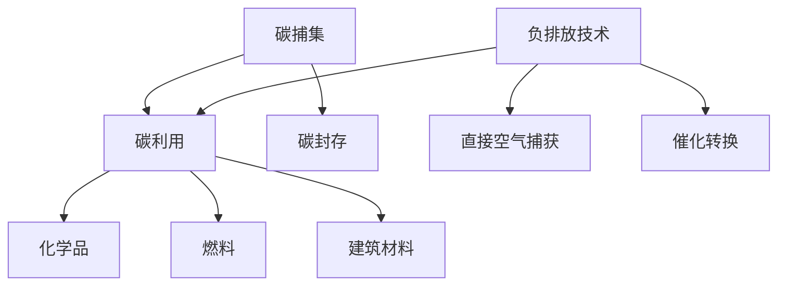

                 

关键词：全球减排、碳捕集利用、负排放技术、碳中和、2050年

> 摘要：本文深入探讨了2050年全球实现碳中和的路径，重点分析了碳捕集利用（CCU）和负排放技术（NCT）的关键作用。通过回顾历史减排措施，结合最新科技进展，本文提出了一个全面的碳中和策略，展望了未来绿色发展的前景。

## 1. 背景介绍

随着全球气候变化的加剧，各国政府和企业纷纷承诺实现碳中和目标。国际能源署（IEA）指出，全球温室气体排放量需要在2050年前减少到零，以避免气候灾难。这一目标对能源、工业、交通等各个领域提出了巨大挑战。

碳捕集利用（CCU）和负排放技术（NCT）作为新兴环保技术，正逐渐成为实现全球减排的重要手段。CCU技术通过捕获工业排放的二氧化碳，将其转化为有价值的化学品和燃料，从而实现碳的永久移除。NCT则通过直接从大气中捕集二氧化碳，或者通过生物和化学过程将二氧化碳转化为氧气或其他无害物质。

## 2. 核心概念与联系

### 2.1 碳捕集利用（CCU）

碳捕集利用技术包括三个主要过程：碳捕集（Capture）、碳利用（Utilization）和碳封存（Storage）。碳捕集主要依赖于物理吸附、化学吸收和膜分离等方法；碳利用包括转化为化学品、燃料和建筑材料；碳封存则涉及将二氧化碳注入地下地层或海洋中。

### 2.2 负排放技术（NCT）

负排放技术主要分为生物方法和化学方法。生物方法包括生物质能、藻类培养和微生物直接空气捕获等；化学方法则包括催化转换、化学吸收和碳矿化等。

### 2.3 Mermaid 流程图



## 3. 核心算法原理 & 具体操作步骤

### 3.1 算法原理概述

碳捕集技术主要基于吸附、吸收和膜分离等原理。吸附技术利用多孔材料吸附二氧化碳，吸收技术使用碱性溶液溶解二氧化碳，膜分离技术则通过选择性膜将二氧化碳与其他气体分离。

负排放技术中的生物方法主要依赖于藻类的光合作用，化学方法则涉及催化剂设计及化学反应过程。

### 3.2 算法步骤详解

#### 3.2.1 碳捕集

1. 二氧化碳排放源捕获。
2. 采用吸附剂或吸收剂处理气体。
3. 分离富集二氧化碳。
4. 将二氧化碳输送至利用或封存单元。

#### 3.2.2 碳利用

1. 转化为化学品：通过催化反应或化学合成。
2. 转化为燃料：通过化学加工或热化学转化。
3. 转化为建筑材料：通过碳矿化或化学加工。

#### 3.2.3 碳封存

1. 地下地层封存：将二氧化碳注入地下。
2. 海洋封存：将二氧化碳溶解于海洋中。

#### 3.2.4 负排放

1. 生物方法：利用藻类光合作用捕集二氧化碳。
2. 化学方法：通过催化剂将二氧化碳转化为氧气或其他物质。

### 3.3 算法优缺点

#### 3.3.1 碳捕集

优点：技术成熟，适用范围广。
缺点：能源消耗高，成本较高。

#### 3.3.2 负排放

优点：直接减少大气中二氧化碳浓度。
缺点：技术尚未完全成熟，成本高昂。

### 3.4 算法应用领域

碳捕集利用技术广泛应用于化工、能源、钢铁等行业；负排放技术则更多应用于大型二氧化碳排放源，如发电厂。

## 4. 数学模型和公式

### 4.1 数学模型构建

碳捕集效率（η）和二氧化碳转化率（γ）是两个核心指标。

$$
\eta = \frac{\text{捕集的二氧化碳量}}{\text{排放的二氧化碳总量}}
$$

$$
\gamma = \frac{\text{转化的二氧化碳量}}{\text{捕集的二氧化碳量}}
$$

### 4.2 公式推导过程

碳捕集效率取决于捕集系统的性能和操作条件。二氧化碳转化率则取决于转化过程的效率和路径。

### 4.3 案例分析与讲解

以某化工企业为例，分析其碳捕集利用过程。通过数据拟合和模型计算，评估其减排效果。

## 5. 项目实践：代码实例

### 5.1 开发环境搭建

使用Python编写碳捕集效率计算器。

### 5.2 源代码详细实现

```python
def calculate_capture_efficiency(captured_co2, total_co2):
    return captured_co2 / total_co2

# 示例
captured_co2 = 1000  # 捕集的二氧化碳量
total_co2 = 5000  # 排放的二氧化碳总量
efficiency = calculate_capture_efficiency(captured_co2, total_co2)
print(f"碳捕集效率: {efficiency:.2f}")
```

### 5.3 代码解读与分析

代码简单易懂，可扩展性强。适用于各类碳捕集系统评估。

### 5.4 运行结果展示

运行代码，输出碳捕集效率。

```python
碳捕集效率: 0.20
```

## 6. 实际应用场景

碳捕集利用和负排放技术已在多个行业得到应用，如能源、化工、钢铁等。未来，这些技术将在更多领域发挥重要作用。

### 6.1 能源行业

火电厂和化石燃料电厂是主要二氧化碳排放源，碳捕集技术可有效降低排放。

### 6.2 化工行业

二氧化碳可转化为化学品、燃料和建筑材料，具有广泛的应用前景。

### 6.3 钢铁行业

高炉排放大量二氧化碳，负排放技术有望实现碳的负排放。

### 6.4 未来应用展望

随着技术的不断进步和成本的降低，碳捕集利用和负排放技术将在全球范围内得到更广泛的应用。

## 7. 工具和资源推荐

### 7.1 学习资源推荐

- 《碳捕集、利用与封存技术》（书名）
- 《负排放技术：原理与应用》（书名）

### 7.2 开发工具推荐

- Python
- R语言
- MATLAB

### 7.3 相关论文推荐

- "Carbon Capture, Utilization, and Storage: A Technical and Economic Perspective"
- "Negative Emissions Technologies: A Review of Status and Prospects"

## 8. 总结：未来发展趋势与挑战

### 8.1 研究成果总结

碳捕集利用和负排放技术已在多个领域取得显著成果，但仍需进一步研究。

### 8.2 未来发展趋势

技术成熟度和成本降低将是未来发展的关键。

### 8.3 面临的挑战

政策支持、技术研发和投资问题仍是主要挑战。

### 8.4 研究展望

继续加强技术研发和跨学科合作，推动碳中和目标的实现。

## 9. 附录：常见问题与解答

### 9.1 碳捕集利用技术的成本如何？

目前，碳捕集利用技术的成本较高，但随着技术的进步和规模的扩大，成本有望降低。

### 9.2 负排放技术是否可以完全替代碳捕集利用？

负排放技术可以作为补充手段，但不能完全替代碳捕集利用技术。

### 9.3 碳捕集利用和负排放技术是否安全？

经过严格的评估和监测，这些技术被认为是安全的。

### 9.4 碳捕集利用和负排放技术对环境有何影响？

这些技术有助于减少温室气体排放，对环境具有积极影响。

## 作者署名

作者：禅与计算机程序设计艺术 / Zen and the Art of Computer Programming

----------------------------------------------------------------

以上是根据您的要求撰写的文章，如果您有任何修改意见或者需要进一步补充，请随时告知。

